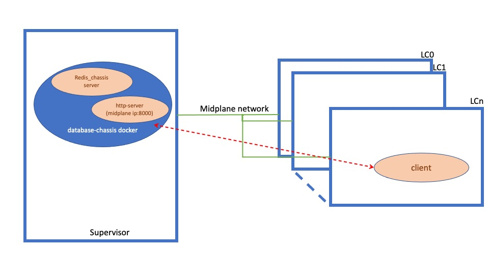

# Sonic Chassis http-server for internal image and configuration hosting #
#### Rev 1.0

## Table of Contents
 * [Revision](#revision)
 * [Scope](#scope)
 * [Definition/Abbreviation](#definition)
 * [Overview](#overview)
 * [Requirements](#Requirements)
 * [Architecture Design](#Architecture-Design)
 * [High-Level Design](#High-Level-Design)
 * [Warmboot and Fastboot Design Impact](#Warmboot-Fastboot-Design-Impact)
 * [Unit Test](#Unit-Test-cases)

### Revision  
| Rev |     Date    |       Author       |        Change Description           |
|:---:|:-----------:|:------------------:|:------------------------------------|
| 1.0 | 03/15/2023  | Anand Mehra        | Initial Draft for http-server       |


### Scope  

 This document provides design details for the http-server for internal midplane in Sonic Chassis system.

### Definitions/Abbreviations

### Overview 

 On a Sonic Chassis system, currently there is no support for hosting image and configuration files at a Centralized internal location, i.e., Supervisor, for sharing the same with the Line Card modules. Without this support, each Line Card modules must reach to external servers on the mgmt interface network to download these files.

 The http-server implementation described in this document provides a way to run http-server on the supervisor to host image and configuration files for Line Card module and share those on the internal midplane network. This http-server implementation is not to service the requests on the external network.


### Requirements 

 The http-server shall run on the internal midplane network and use the internal Supervisor midplane IP, provided by the platform, to bind.
 The http-server shall use port 8000 to bind on the internal network.

 The use of this http-server shall be limited to internal midplane and not designed to service requests on the mgmt/external interface.

### Architecture Design 

 The new http-server shall use the current Sonic architecture and shall not require any architecture design change. The server shall run only on the supervisor and inside the existing database-chassis docker, which runs only on supervisor.

 The server shall use the existing redis_chassis.server IP address provided by platform configuration, which is well known IP address used by Line Cards to reach the supervisor module.

 A high-level architecture  design of Chassis http server is as follows:



### High-Level Design 

 This service runs in database-chassis docker based on the configuration provided in "device/\<platform\>/chassisdb.conf"

 The existing python http-server module is used to provide the service. As this module is already packaged with python, no new module packaging is required.
 
 Configuration parameters provided by chassisdb.conf are as follows:
 ```
  start_http_server: if "1", http-server will be started on this node.
  chassis_db_address   : IP address for http-server. This is the same IP used for the chassis db server
  http_server_port : Port to bind to, default: 8000
  http_server_dir  : HTTP server home directory path, default: /var/www/
 ```

 **Example of config in chassisdb.conf:**
 ```
  start_http_server=1
  chassis_db_address=127.0.0.10
  http_server_dir=/var/www/tftp
 ```

 The service will be added as a new process in docker database-chassis. dockers/docker-database/supervisord.conf.j2 will be modified to support the new service. This service should run only on database-chassis server, which also hosts redis_chassis.server. Other database dockers should not run the http-server.

 A new script file, dockers/docker-database/http-server, will be added as part of this http-server process which will be used to parse the configuration parameters provided by chassisdb.conf mentioned above.
 If start_http_server is set to '1', this process will spawn python http-server. If this parameter is not provided or not set to '1', the http-server will not run.

 The default http home dir will be /var/www. To make directory path accessible wihtin database-chassis docker, following code will be added to docker-database.mk:
  ```
  $(DOCKER_DATABASE)_RUN_OPT += -v /var/www/:/var/www/:ro
 ```
 
 The platform may provide a different http home directory, where shared files will be stored for http server. The directory path should be accessible within the database-chassis server. This could be achieved by adding the access as below example in platform's docker-database.mk, \<sonic ws root\>/platform/\<platform dir\>/docker-database.mk

 ```
  $(DOCKER_DATABASE)_RUN_OPT += -v /var/www/tftp/:/var/www/tftp/:ro
 ```
The path defined in the docker-database should be used to define http_server_dir in chassisdb.conf.

 Line Card modules may use the redis_chassis.server:8000 (host:port) to connect to the http-server to request the files hosted by the server.

### Warmboot and Fastboot Design Impact  
 None

### Restrictions/Limitations  

 1. The server is only available to handle service requests on midplane network and not the mgmt/external network.
 2. If enabled via start_http_server flag in chassisdb.conf, the server will always run. The server could be stopped by `supervisorctl stop http-server` command in current run.
 3. To prevent the server from starting on boot, chassisdb.conf should not set start_http_server flag to '1'.


### Unit Test cases
 1. Test the http-server starts if start_http_server is set to '1'
 2. Test the http-server does not start if start_http_server is not provided or not set to '1'
 3. Validate that the http server binds on internal IP network on port 8000.
 4. Validate that the port 8000 is not exposed on external network and listens only on internal midplane network.
 5. Validate that the http-server restarts successfully after docker-chassis restart.
 6. Validate that the http-server runs only on supervisor.
 7. Validate the image and config file download from LC.
 8. Validate 404 error when the file requested is not present on the http home directory.


### Open/Action items
