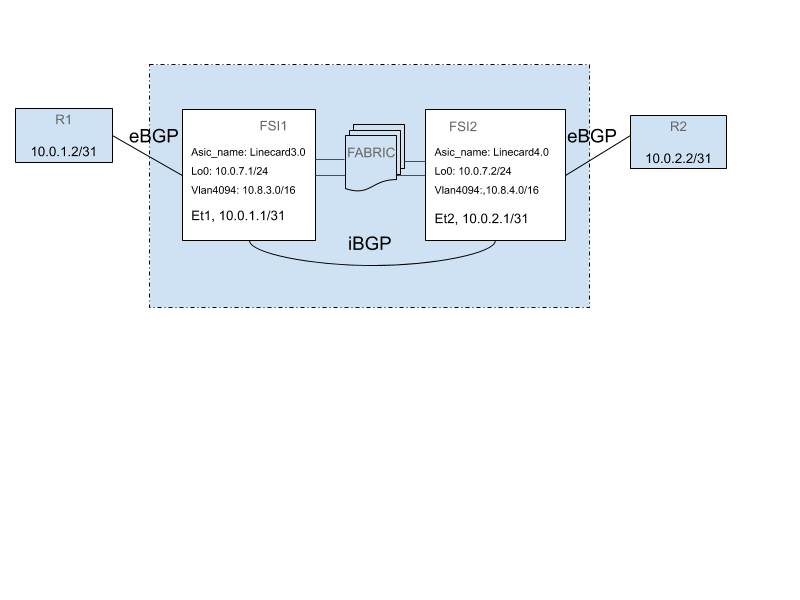
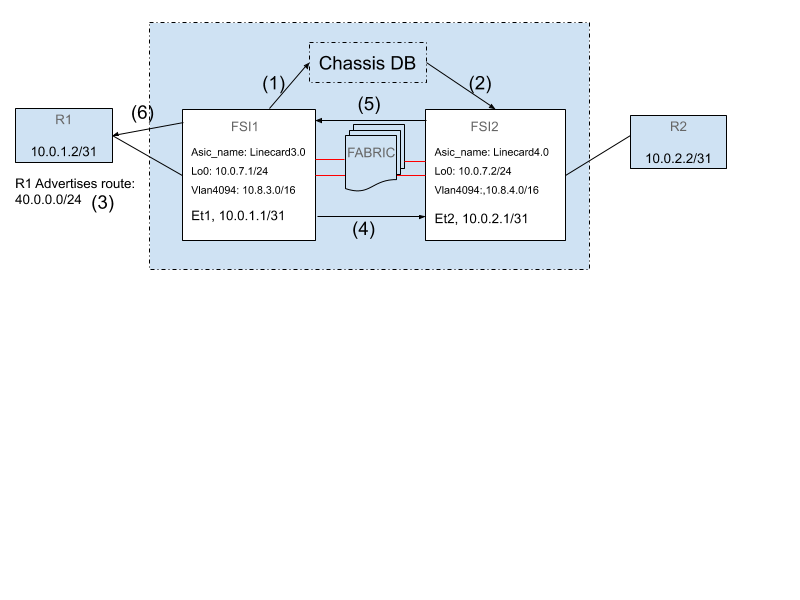

# IP Forwarding in a Distributed VOQ Architecture

# High Level Design Document
#### Rev 0.1

# Table of Contents
* [Revision](#revision)
* [About this Manual](#about-this-manual)
* [Scope](#scope)
* [Definitions/Abbreviation](#definitionsabbreviation)
* [1 Requirements](#1-requirements)
* [2 Design](#2-design)
* [3 Flows](#3-flows)
* [4 Testing](#4-testing)

###### Revision
| Rev |     Date    |       Author       | Change Description |
|:---:|:-----------:|:------------------:|--------------------|
| 0.1 | July-10 2020 | Eswaran Baskaran, Sambath Balasubramanian, Kartik Chandran, Saravanan Sellappa, Joanne Mikkelson, Song Yuan (Arista Networks) | Initial Version |

# About this Manual

This document provides an overview of the SONiC support for IP forwarding (IPv4 and IPv6) across a system of forwarding engines connected over a VOQ Fabric

# Scope

This document covers the following aspects of IP forwarding
 - Representation of L3 Interfaces
 - IP connectivity over the inband control plane between forwarding devices in the system
 - Management of routes and nexthops across all forwarding devices in the system.


# Definitions/Abbreviations

|      |                    |                                |
|------|--------------------|--------------------------------|
| FSI  | Forwarding SONiC Instance |  SONiC instance on a packet forwarding module like a linecard.
| SSI | Supervisor SONiC Instance |  SONiC instance on a central supervisor module that controls a cluster of forwarding instances and the interconnection fabric.
| Forwarding Device | A unit of hardware that runs SONiC and is responsible for packet forwarding |
| ASIC | Application Specific Integrated Circuit | Refers to the forwarding engine on a device that is responsible for packet forwarding. Also referred to as NPU |


# 1 Requirements

# 1.1 Functional Requirements

# 1.1.2 Address Families
IPv4 and IPv6 forwarding must be supported.

# 1.1.3 Interfaces

The following interface type must be supported
Routed physical ethernet interfaces.
Link Aggregation Groups (LAGs), where all members are connected to the same forwarding device.

# 1.1.3 Topologies and Protocols

The system must support dual-stack (IPv4 and IPv6) eBGP protocol peering with externally connected neighbors.
The system must be capable of forwarding to ECMP nexthops where the physical connectivity to the nexthops may be arbitrarily distributed across the forwarding devices in the system.

## 1.2 Configuration and Management Requirements

Each forwarding device must run an independent routing protocol stack which peers with externally connected neighbors using eBGP and within the system with other forwarding devices using iBGP. The existing SONiC configuration interface and feature set (such as route filtering policies and other routing protocol settings) should apply unchanged where applicable.
Each forwarding device is provisioned with routed interfaces in exactly the same way as with SONiC on fixed configuration devices.
In addition, every forwarding device is provided with the global view of all L3 interfaces across the system.

# 2 Design

## L3 Interfaces

Every routed port on the system requires a representation in the SAI stack of the local FSI.

All the L3 interfaces on the chassis are represented in the Chassis DB as System Interface objects with the structure below.

```
; All Routed interfaces on the system
key        = SYSTEM_INTERFACE|instance_name|ifname
                                         ; ifname should be
					 ; Ethernet or Portchannel
vrf                 = "" / vrf_name      ; associated vrf name
```

The intfOrch iterates over all the interfaces in chassis db and creates a SAI rif object for each one of them.

When the local FSI discovers a neighbor on a remote FSI, the L3 interface corresponding to the remote routed port that is connected to the neighbor is used as one of the parameters passed to function creating the neighbor. This L3 interface is used to identify the remote system port connected to the remote neighbor.

## Internal Control Plane

Each ASIC in the system is provisioned with an Inband CPU port that provides connectivity to other ASICs in the chassis over the internal fabric. The inband CPU port is just a system port. The inband port on each chip is named as LinecardN.K|Cpu where N is the slot number and K is the chip number within the slot.

A specific VLAN is provisioned to facilitate L2 connectivity in between the inband CPU ports. A ‘vlan’ netdevice in the kernel acts as the L3 endpoint. The IP address space for all the VLAN devices is internal to the chassis. All the CPU system ports are added to the inband VLAN at orchagent startup.


Orchagent will create a host interface for this inband VLAN such that packets injected into this VLAN host interface, will be bridged on the VLAN in the ASIC.

Sonic configuration in CHASSIS_DB is below

```
"METADATA": {
        "inband_vlan": { “name” : “Vlan4094” }
	    }

“INBAND_INTERFACE” : {
    “Linecard3.0|vlan4094”: { 10.8.3.0/16 },
            “Linecard3.1|vlan4094”: { 10.8.3.1/16 },
	    “Linecard4.0|vlan4094”: { 10.8.4.0/16 }
	    }

“SYSTEM_VLAN_MEMBER” : {
    "Vlan4094|Linecard3.0|Cpu"
    "Vlan4094|Linecard3.1|Cpu"
    "Vlan4094|Linecard4.0|Cpu"
}

```

Orchagent in each LSI will connect to CHASSIS_DB and do the following
 1. Create vlan interface Vlan4094 based on the INBAND_VLAN table entry.
 2. Create a SAI HostIf for the Vlan4094 interface.
 3. Add all the ‘SYSTEM_VLAN_MEMBER’ entries as members to this Vlan4094
 4. Configure the IP address of the Vlan interface based on the INBAND_INTERFACE table entry.

## Directly Attached and Remote Neighbors

When directly attached neighbors come up, the FSI populates the GLOBAL_NEIGHBOR_TABLE in CHASSIS_DB. This table will contain the state of all active L3 neighbors directly attached to interfaces on the chassis.

```
GLOBAL_NEIGH_TABLE
key                = GLOBAL_NEIGH_TABLE:instance_name:ifname:ipaddress
address_family     = 1*4DIGIT          ; ipv4 or ipv6
remote_encap_index = 1*6DIGIT          ; Encap Index of the remote neighbor
```

The instance_name:ifname in the key indicates the egress interface to which the L3 neighbor is connected.

Each LSI in the system will use the information in the GLOBAL_NEIGH_TABLE and create a SAI neighbor object in the local SAI using the remote_encap_index attribute and the RIF object that maps to the egress interface. This allows SAI to program the ASIC such that packets to this neighbor are sent to the correct egress ASIC and the packet rewrite is handled correctly on the egress ASIC for this packet.

Once the remote neighbor SAI object is created, remote nexthops can be created with the RIF of the egress interface and the nexthop IP address. These remote nexthops will also be made visible to BGP by adding a static route in the kernel for that neighbor. The nexthop of this route will be the Vlan4094 interface (with no IP nexthop). Zebra will automatically add these routes to the RIB.

## Routing



BGP configuration will include an iBGP mesh including each FSI, peering over the Vlan4094 interface. This will ensure that eBGP-learned routes are distributed to every FSI in the chassis. These routes will have the same nexthop as on the originating FSI and will be resolvable on the other FSIs only after the static route representing that remote nexthop has been added to the kernel.

The resolved routes will be placed in the RIB and the FIB with the remote nexthop IP address and the inband Vlan4094 interface. The local NEIGH_TABLE will not contain an entry for this nexthop, and in that case, the GLOBAL_NEIGH_TABLE will be searched for a neighbor with the correct IP address. This entry will be used to program the route with the correct SAI neighbor object.

For ECMP routes, the same logic all applies to each nexthop in the ECMP group. Three additional BGP configuration changes will allow each FSI to program the same ECMP group:
 1. "neighbor <> addpath-tx-all-paths" for each iBGP peer
 2. A new configuration to be added to FRR, "bgp bestpath peer-type multipath-relax"
 3. "bgp disable-ebgp-connected-route-check"

These configurations will ensure all paths, not just the best path, learned by one FSI will be learned on all FSIs; will allow paths learned over the iBGP mesh to be in the same ECMP group as routes learned via eBGP; and will allow the remote neighbor entry-based nexthops to be placed in the FIB, rather than filtered out by zebra because they are not directly connected.

If any redistributed/locally originated routes are configured by an operator to be advertised by an FSI to its eBGP peers, the routes should also be configured to be advertised to the iBGP peers.

# 3 Flows



## Routes

1. R1 comes up. After FSI1 orchagent creates the SAI neighbor object for 10.0.1.2, it will retrieve the ENCAP_INDEX for the neighbor and publish an entry in the Chassis DB GLOBAL_NEIGHBOR_TABLE.
2. Orchagent in FSI2 reacts to the GLOBAL_NEIGH_TABLE entry and
creates a local SAI neighbor object with the remote ENCAP_INDEX and a SAI nexthop object to be used by routes in the data plane and
installs a host route 10.0.1.2/32 with interface Vlan4094 in the kernel. This is necessary for routes with the nexthop 10.0.1.2 to resolve correctly in BGP and get installed in the data plane.
installs a static ARP entry for 10.0.1.2/32 with the MAC address of Linecard3.0:Vlan4094 (the remote inband CPU port). This is required for the ability to ping remote neighbor R1 from FSI2.
3. R1 advertises a route for 40.0.0.0/24 to FSI1.
4. FSI1 redistributes 40.0.0.0/24 route to FSI2 with the nexthop as 10.0.1.2.
As the nexthop 10.0.1.2 is reachable with the static route for 10.0.1.2 with Vlan4094 as the egress interface, BGP will add the route for 40.0.0.0/24 to the FIB.
Orchagent will find 10.0.1.2 in the GLOBAL_NEIGH_TABLE and will retrieve the appropriate RIF based on the instance_name:ifname of the remote neighbor. This RIF and ENCAP_INDEX from the GLOBAL_NEIGH_TABLE entry will be used to create the nexthop. This nexthop will be used for the route programming.

## Ping from FSI to remote neighbors

5. A ping packet from FSI2 to 10.0.1.2/31 will be sent out of Linecard4.0:vlan4094 with the destination MAC address of Linecard3.0:vlan4094. The IP source address of this packet must be the loopback IP address of Linecard4.0.
6. FSI1 will receive the packet and the kernel will route the packet to R1. The echo reply packet from R1 will be directly sent to Linecard4.0 by the ASIC of Linecard3.0 because the destination IP address will be the loopback address of Linecard4.0 that is routable in the Linecard3.0 ASIC.

# 4 Testing

## Virtual Chassis Test Infrastructure

Test coverage for the distributed VoQ architecture is achieved by extending the existing virtual switch based SWSS pytest infrastructure.The distributed switching architecture is represented as multiple VS instances connected with each other and called as Virtual Chassis (VC), where one of the instances plays the role of the SSI and the remaining instances as FSIs and external neighbors of FSIs.

Start script of the VS differentiates if the VS is part of VC or standalone VS instance with the presence of /usr/share/sonic/hwsku/default_config.json. The contents of this configuration file determines if the instance is a SSI or FSI. Following are the contents of SSI’s default_config.json where start_chassis_db triggers to instantiate CHASSIS_DB redis-server.

```
{
    "DEVICE_METADATA": {
            "localhost": {
	    "hostname": "supervisor",
	    "mac" : "00:00:00:00:aa:00",
	    "chassis_db_address" : "10.8.1.200",
	    "inband_address" : "10.8.1.200/24,"
	    "start_chassis_db" : "1",
	    "comment" : "default_config for a vs that runs CHASSIS_DB"
	    },									            
     }
}
```

FSI’s default_config.json has connect_to_chassis_db and chassis_db_address to let the FSI connect with the SSI’s chassis-db redis-server.

A VC can be created, deleted using a virtual_chassis.py. This script expects a topology file to perform the create/delete/verify operation and an unique namespace string to run the test in that namespace. There are few sample topology*.json files under the same directory where the script is located (device/virtual/x86_64-kvm_x86_64-r0/virtual_chassis/).
topology.json provides one SSI and 3 FSIs.
topology_nbrs.json provides one SSI, 3 FSIs and 1 neighbor per FSI.
Topology_ecmp_nbrs.json is the same as topology_nbrs.json with two neighbors for one of the FSIs.
In the following example the VC is created with namespace NS which will have one SSI(supervisor.NS), 3 FSIs (lc1.NS, lc2.NS, lc3.NS) and 3 neighbors (one per FSI: R1.NS, R2.NS, R3.NS)
```
virtual_chassis.py topology_nbrs.json create NS
virtual_chassis.py topology_nbrs.json verify NS
virtual_chassis.py topology_nbrs.json delete NS
```

## Test Cases

### CHASSIS_DB connectivity

Creates a VC to verify
- Each FSI in the VC can connect to CHASSIS_DB on the SSI
- Each FSI in the VC can ping its neighboring Router

### Neighbors and Nexthops

- Applies to each of IPv4 and IPv6 neighbors
- Addition of a new neighbor to all forwarding devices
- Removal of an existing IPv4 neighbor from all forwarding devices
- Relocation of an existing neighbor to a different L3 interface

### Routes

Applies to both IPv4 and IPv6 prefixes

- Addition of a prefix to an existing resolved nexthop
- Removal of a prefix from an existing resolved nexthop
- Transition from an unresolved to resolved nexthops with associated prefixes in existence
- Addition of an additional nexthop for a given prefix to form an ECMP group to transition from single to multiple nexthops
- Addition of additional member to an ECMP group
- Removal of an existing prefix from an ECMP group
- Transition of ECMP nexthop to a single group

### Routes
Formation of internal BGP
