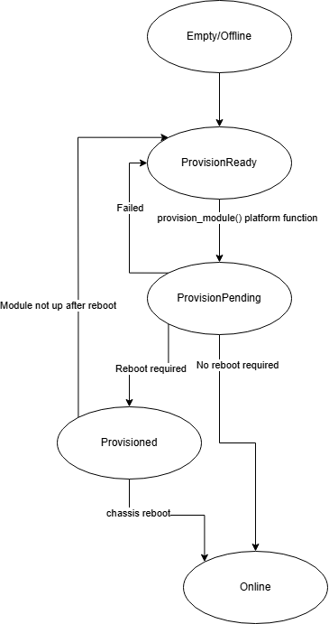
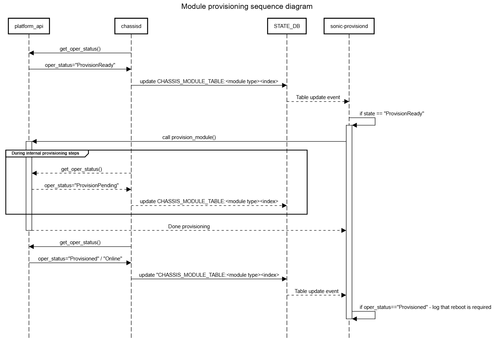

# Automatic module provisioning for chassis #
#### Rev 1.0

## Revision


| Rev  |    Date    |                Author                 | Change Description |
| :--: | :--------: | :-----------------------------------: | ------------------ |
| 1.0  | 4-Mar-2026 |  Liam Kearney   | Initial version    |


## Scope

This document gives the details for a new platform API and pmon daemon to facilitate provisioning of newly installed / replacement modules in a SONiC modular chassis.

## Background

In a SONiC chassis, each linecard runs an independent instance of SONiC. If a linecard is replaced or a new linecard is inserted into an empty slot, there are no guarantees that this linecard has been provisioned to work with SONiC / has SONiC installed. Some vendors may require some steps / scripts / etc. to be executed on the supervisor card in order for the linecard to be available / operational / get to first boot.

In other words, there is a use case for SONiC on the supervisor to have a hook into platform/vendor code when a new module is inserted / detected, to facilitate converting the module from factory state to SONiC.

This document aims to introduce a unified mechanism to achieve this.

## Requirements 
 - When new linecards are inserted into a chassis, the supervisor card running SONiC is responsible for detecting the presence of these new modules. It is up to the vendors to implement a mechanism to detect this.
 - A new platform API will be introduced as an entrypoint for vendor code to perform conversion on a module
 - New module states will be introduced to represent the various provision states of a module
 - The chassis is assumed to be in a safe state to perform conversion when a linecard is inserted (ie. No production traffic) – this will be achieved via operational guidelines, ie. isolate chassis from network when replacing/inserting a linecard.
 - While hot-swap is desirable, implementation effort from vendors may be non-trivial and it should not be a requirement for this feature. An intermediary state will be introduced to indicate that a module has been converted but the chassis requires a reboot to fully instantiate the linecard. 
 - A new pmon daemon will be introduced to call the new platform API if the platform layer signals that the module can be provisioned. 
 - Minigraph / config db installation on newly provisioned linecards is out of scope. Vendors are permitted to provide a mechanism for this, but it will not be assumed. Post linecard insertion / replacement, a fresh config push to the entire chassis is expected.
 - Linecard is expected to come up with at _minimum_ console access and midplane network configured.

## New module operational states:

The following new states will be added as possible return values for the function get_oper_status() in sonic-platform-common/sonic_platform_base/module_base.py:

 - "ProvisionReady" – Linecard is available for conversion
 - "ProvisionPending" – Linecard is undergoing conversion
 - "Provisioned" – Linecard is converted but not fully available. Chassis may require reboot.

```
  ...
    # Module state when module is detected, is able to run SONiC, but is not yet running SONiC.
    # Modules in this state will be attempted to be converted to SONiC via calls to module.provision_module()
    # This state & following "Provision" states should not be used if provision_module() is not implemented. 
    MODULE_STATUS_PROVISION_READY = "ProvisionReady"
    # Module state if module is currently undergoing provisioning.
    # Module is not expected to be contactable in this state.
    MODULE_STATUS_PROVISION_PENDING = "ProvisionPending"
    # Module state once module has been provisioned successfully,
    # but the chassis requires a reboot to fully incorporate the module. 
    MODULE_STATUS_PROVISIONED = "Provisioned"
  ...
```

It is expected that the platform layer will use these states to signal to STATE_DB the provisioning state of the linecard.

Vendors are responsible for deciding on, and reporting, that a linecard is available for conversion, and it's various conversion states.

A state diagram for the transitions is as follows: 



These states will get pushed to the `oper_status` field in STATE_DB : CHASSIS_MODULE_TABLE:LINE-CARD\<x> tables for each module by chassisd. An example of one of these tables is as below: 

```
admin@str2-7804-sup-1:~$ sonic-db-cli  STATE_DB hgetall "CHASSIS_MODULE_TABLE|LINE-CARD0"
{'desc': '7800R3AK-36DM2-LC', 'slot': '3', 'oper_status': 'Online', 'num_asics': '0', 'serial': '<SN>'}
```

##  New platform module API

In addition to the above states, the following platform API will be added to module_base.py

When called on a module, it is expected that the platform layer will execute the required steps to bring the module up as SONiC.

This function may block.

If provisioning is performed asynchronously, the platform layer is expected to report accurate MODULE_STATUS information during the execution of provisioning.

```
   def provision_module(self):
        """
        Request to provision the module.
        This method should be implemented only if the module supports
        provisioning to SONiC, and supports the various Provision operational states.

        Returns:
            bool: True if the request has been issued successfully, False if not
        """
        raise NotImplementedError
```


## New pmon daemon - sonic-provisiond

A new pmon daemon will be introduced which will be responsible for triggering provisioning / calling this new API. This daemon will simply subscribe to all `CHASSIS_MODULE_TABLE|*` tables, and listen to changes to the `oper_state` field. If `oper_state` switches to `'ProvisionReady'`, it will call provision_module() on the corresponding module.

Chassisd will remain responsible for polling get_oper_status() and syncing this with STATE_DB - sonic-provisiond will simply react to state_db changes.

Enabling/disabling auto-provisioning will be achieved by enabling/disabling this service.

## Provisioning sequence diagram


