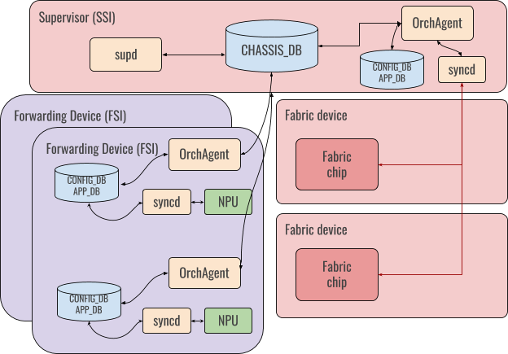

# Distributed Forwarding in a Virtual Output Queue (VOQ) Architecture

# High Level Design Document
#### Rev 0.1

# Table of Contents
* [List of Tables](#list-of-tables)
* [List of Figures](#list-of-figures)
* [Revision](#revision)
* [About this Manual](#about-this-manual)
* [Scope](#scope)
* [Definitions/Abbreviation](#definitionsabbreviation)
* [1 Requirements](#1-requirements)
* [2 Design](#2-design)
* [3 Testing](#3-testing)

# List of Tables
* [Table 1: Abbreviations](#definitionsabbreviation)

# List of Figures
* [Figure 1: VoQ Distributed Forwarding Architecture](#41-general-flow)

###### Revision
| Rev |     Date    |       Author       | Change Description |      
|:---:|:-----------:|:------------------:|--------------------|
| 0.1 | May-19 2020 | Kartik Chandran (Arista Networks) | Initial Version |
| 0.2 | June-22 2020 | Kartik Chandran (Arista Networks) | First set of review comments from public review |  

# About this Manual

This document provides an overview of the implementation of SONiC support for distributed  packet forwarding across a set of devices that have a VOQ (Virtual Output Queue) architecture interconnected by an internal fabric.

# Scope

Support for distributed forwarding encompasses the following aspects
- Physical interfaces and VOQs
- Logical interfaces such as link aggregation groups (LAGs)
- The internal interconnection fabric  
- The packet forwarding data plane
- The control plane, both internal (within the devices in the system) and with external devices.

This document covers
 - The basic SONiC architecture enhancements to support  distributed VOQ based forwarding 
 - Representation and management of physical ports across the system.
 
The other aspects listed above are expected to be covered in separate self-contained design proposals that build on this architecture. 

The initial target for this work is a VOQ chassis system in which linecards running SONiC are interconnected over a fabric and the overall system is controlled by a supervisor module that also runs SONiC. 

However, this architecture makes no hard assumptions about operating within a chassis and can be extended to other form factors with the same VOQ architecture. 


# Definitions/Abbreviations

|      |                    |                                |
|------|--------------------|--------------------------------|
| FSI  | Forwarding SONiC Instance |  SONiC instance on a packet forwarding module like a linecard.
| SSI | Supervisor SONiC Instance |  SONiC instance on a central supervisor module that controls a cluster of forwarding instances and the interconnection fabric.
| Forwarding Device | A unit of hardware that runs SONiC and is responsible for packet forwarding |
| ASIC | Application Specific Integrated Circuit | Refers to the forwarding engine on a device that is responsible for packet forwarding. Also referred to as NPU


# 1 Requirements

# 1.1 Functional Requirements

## 1.1.1 Distributed Operation

* Each forwarding device must run an independent SONiC instance (called   the Forwarding SONiC Instance or FSI) which controls the operation of one or more ASICs on the device, including the front panel and internal fabric ports conn ected to the ASICs.
* A Forwarding device must act as a fully functional router that can run routing protocols and other networking services just like single box SONiC devices. 
* The system of forwarding devices should be managed by a single central Supervisor SONiC instance (SSI) that also manages the internal fabric that interconnects the forwarding devices.

## 1.1.2 Intra-System Control Plane

* Each FSI should be able to connect to other FSIs over the internal fabric in order to be able to run protocols like BGP within the system. 

* This connection must be fate shared with the data path so that a loss of connectivity in the internal fabric is reflected as loss of internal control plane connectivity as well.

## 1.1.3 Intra-System Management Plane

Every FSI must have a management interface over which it can reach the supervisor and the rest of the network outside the system. This network must be completely separate from the internal control plane network described above.

## 1.2 Configuration and Management Requirements

* Each SONiC instance must be independently configurable and manageable through standard SONiC management interfaces.
 
* The physical configuration of the entire system is fixed at startup. This includes
  * The Hardware SKU that is used for each forwarding device
  * The Physical port organization of the entire system

* Live replacement of forwarding devices or pluggable modules like transceivers must be supported as long as the part being replaced is an identical SKU.

# 2 Design

## 2.1 Design Assumptions

In order for the system to function correctly, some state that provides the global view of the system to all the FSIs is necessary. This state is stored in the SSI and all FSIs connect to the SSI over the internal management network to access this state.

## 2.2 SAI Support

Support for VOQ based forwarding in SONiC is dependent on the [SAI VOQ API](https://github.com/opencomputeproject/SAI/blob/master/doc/VoQ/SAI-Proposal-VoQ-Switch.md)

## 2.3 State Sharing



All state of global interest to the entire system is stored in the SSI in a new Redis instance with a database called “Chassis DB”. This instance is accessible over the internal management network.

FSIs connect to this instance in addition to their own local Redis instance to access and act on this global state.

##  2.3.1 Chassis DB Organization

The Chassis DB runs in a new container known as ‘docker-database-chassis’ as a separate Redis instance. This ensures both that the Chassis state is isolated from the rest of the databases in the instance and can also be conditionally started only on the SSI.

## 2.3.2 Config DB Additions

```
{
    "DEVICE_METADATA": {
        "localhost": {
            ….
            “chassis_db_address" : "10.8.1.200",
            “connect_chassis_db” : “1”,
            ….
        }
    }
```
Two new attributes are added to the DEVICE_METADATA object in Config DB. These are used to convey to an FSI that a ChassisDB exists in the system. 


## 2.4 Chip Management
There are two kinds of chips that are of interest 

### 2.4.1 Forwarding ASIC 

The ASIC (also referred to as NPU in SONiC terminology) performs all the packet reception, forwarding, queueing and transmission functions in the system. 

### 2.4.2 Fabric Chip

The internal fabric that interconnects forwarding engines is made up of multiple fabric chips that are responsible for moving packets from the source to destination forwarding engine.

ASICs are connected to fabric chips over internal links that terminate on fabric ports at each end. 

Fabric chips do not play any role in packet forwarding and do not need to be explicitly configured once initialized. All subsequent interactions with fabric chips are for monitoring only. 

All chips are managed based on the existing Multi-ASIC paradigm in SONiC, in which there is one instance of syncd (and SAI), swss and other related agents per chip. 

### 2.4.3 Switch Numbering

* Each chip in the system (ASIC and Fabric Chip) in the system is given a global ID called a Switch ID. 
* Each chip consumes C consecutive switch IDs, where C is the number of switching cores.
* Each core on a chip has a core ID between 0 and C.

Please see the SAI VoQ spec for more detailed examples.

## 2.5 SONiC Instance and ASIC Naming

### Forwarding SONiC Instance

Each FSI has a globally unique name that represents that SONiC instance. In a modular chassis, the name would conventionally be "Lineard-N", where N is the slot in which the linecard is inserted.

### ASIC Name

In addition, each ASIC has a globally unique name which would conventionally be "Linecard-N.K", where K is a slot local identifier of the ASIC.

## 2.6 Port Management 

There are four types of ports that need to be managed

### 2.6.1 Local Ports 

These are front panel interfaces that are directly attached to each FSI. They are modeled and represented in SONiC exactly as they are with existing fixed configuration devices.

### 2.6.2 System Ports

Every port on the system requires a global representation in addition to its existing local representation. This is known as a System Port (AKA sysport). Every system port is assigned an identifier that is globally unique called a system_port_id. In addition, every port is assigned a local port ID within a core called a “Core Port Id”. The scope of the Local Port Id is _within_ a core of a forwarding engine.

System Ports are modeled in ChassisDB in the SYSTEM_PORT table.

```
;Layer2 port representation across a distribute VoQ system
;instance_name is the globally unique name  on the forwarding device on ;which the port is present
key              = SYSTEM_PORT|asic_name|ifname             ;
speed            = 1*6DIGIT      ; port line speed in Mbps
system_port_id   = 1*6DIGIT      ; globally unique port ID
switch_id        = 1*2DIGIT      ; global switch ID. 
core_id          = 1*2DIGIT      ; core id within switch_id. 
core_port_id     = 1*6DIGIT      ; chip specific port  
```

The globally unique key in the SYSTEM_PORT_TABLE is the name of the ASIC instance and the front panel interface name. The ASIC name is chosen so that various agents like syncd can use this name as a filtering criterion to select the subset of entities that they need to operate on in order to manage a specific ASIC.

The only restriction on selecting the ifname is that the key "SYSTEM_PORT|asic_name|ifname" must uniquely identify a port on the system.

### 2.6.3 Inband Ports

Inband ports are required to provide control plane connectivity between  forwarding engines. They are connected to the forwarding device local CPU on one side and the internal fabric on the other. 

Every inband port is assigned a System Port ID just like front panel ports which is known to all the forwarding devices. Thus, every inband port is reachable from every forwarding engine.

### 2.6.4 Fabric Ports

The provisioning and management of Fabric ports is outside the scope of this document and will be documented as a separate proposal.

## 2.7 Orchestration Agent

### 2.7.1 System Port Handling

System port configuration is expected to completely static and known at the start of the system.

Based on the state of ‘“connect_chassis_db” in the device metadata in ConfigDB, Orchagent connects to Chassis DB and subscribes to the SYSTEM_PORT table in CHASSIS_DB. It uses this list of system ports from the SYSTEM_PORT table to construct the switch attributes needed by the create_switch SAI API. In a later phase, the system ports could be directly created by making sairedis calls from orchagent. 
        
A system port can be used in lieu of a physical port in several SAI API calls as relevant. For example, a system port can be added as a vlan member or be a lag member. To account for these, portsorch will be updated to support sysports. 


Portsyncd does not have to support sysports because sysports do not have any associated kernel devices. 

# 3 Testing

Test coverage for the distributed VoQ architecture is achieved by extending the existing virtual switch based SWSS pytest infrastructure.

The distributed switching architecture is represented as multiple VS instances connected with each other and called as Virtual Chassis, where one of the instance plays the role of the SSI and the remaining instances as FSIs. 

## 3.1 Regression Testing

Existing SWSS pytests can be executed against any of the instances in the virtual chassis to ensure that existing SONiC functionality is not affected while operating in a distributed environment.

## 3.2 Distributed VoQ functionality

Additional tests that specifically validate distributed VoQ forwarding functionality run only in the virtual chassis environment. 

### 3.2.3 test_virtual_chassis.py

Is the top level test driver that executes testcases against the virtual chassis. 

Sysport handling is tested by test_chassis_sysport which validates that
* System ports can be populated in CHASSIS_DB
* All FSIs can connect to CHASSIS_DB and access sysport state
* Orchagent programs the correct SAI Redis ASIC_DB state to represent the configured sysport.

# 4 Future Work

## Dynamic System Ports 

Dynamic system port support is required to support the following forwarding scenarios

* Addition of a new forwarding device into an existing running system
* Replacing a forwarding device with another device of a different hardware SKU (such as replacing a linecard with a new linecard of a different SKU in a chassis slot).

Both these scenarios can be supported smoothly as long as the global system port numbering scheme is maintained and the modifications to system ports can be performed without impacting the System Port IDs of the running system.

Support for dynamic system ports requires SAI support for the `create_port` and `remove_port` calls. 

### Overview of PortsOrch changes

 * Subscribe to the SYSTEM_PORT table in PortsOrch
 * React to changes in the SYSTEM_PORT table
 * Make the appropriate `create_port` and `remove_port` calls.

In addition, forwarding features that are dependent on System Ports need to react to these changes and reprogram the related forwarding plane state such as routing nexthops, LAG membership etc.


