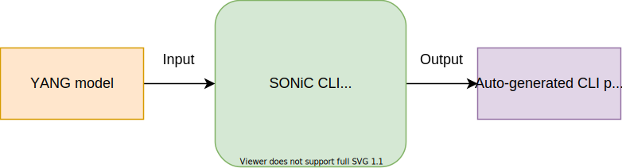
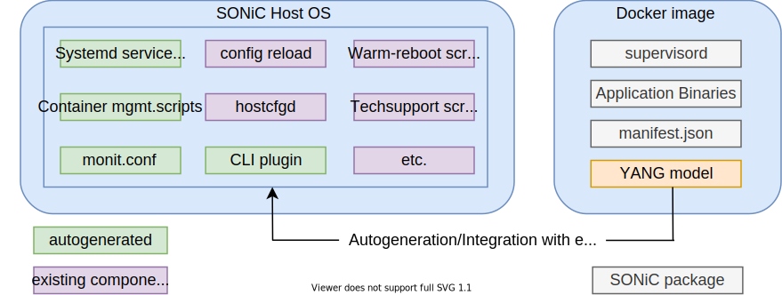
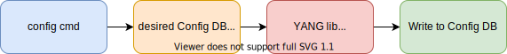

# SONiC CLI Auto-generation tool

## Table of Content 

- [Revision](#revision)
- [Scope](#scope)
- [Definitions/Abbreviations](#definitionsabbreviations)
- [Overview](#overview)
- [Feature overview](#feature-overview)
- [Motivation](#motivation)
- [Requirements](#requirements)
- [Architecture Design](#architecture-design)
- [High-level design](#high-level-design)
- [Configuration and management](#configuration-and-management)
- [SAI API](#sai-api)
- [Warmboot and Fastboot Design Impact](#warmboot-and-fastboot-design-impact)
- [Restrictions Limitations](#restrictions-limitations)
- [Testing Requirements Design](#testing-requirements-design)
- [Open questions](#open-questions)
- [Development plan](#development-plan)

### Revision

|  Rev  |  Date   |      Author      | Change Description |
| :---: | :-----: | :--------------: | ------------------ |
|  1.0  | 04/2021 | Vadym Hlushko    | Phase 1 Design     |

### Scope  

This document describes the high-level design details of the SONiC CLI Auto-generation tool for SONiC Application extensions infrastructure.

### Definitions/Abbreviations 

| Abbreviation | Definition                            |
|--------------|---------------------------------------|
| SONiC        | Software for Open Networking in Cloud |
| SAE          | SONiC Application Extension           |
| DB           | Database                              |
| API          | Application Programming Interface     |
| SAI          | Switch Abstraction Interface          |
| YANG         | Yet Another Next Generation           |
| CLI          | Command-line interface                |
| NOS          | Network operating system              |

## Overview 

### Feature overview

The SONiC CLI Auto-generation tool - is a utility for generating the command-line interface for third-party features, called application extensions, that provide their functionality as separate docker containers. The YANG model will be used to describe the CONFIG DB schema and CLI will be generated according to CONFIG DB schema. The YANG model will serve as an input parameter for the SONiC Auto-generation utility. The CLI should be a part of SONiC utilities and support - show, config operations.

### Motivation

To make SONiC NOS more flexible for developers [SONiC Application Extension infrastructure](https://github.com/stepanblyschak/SONiC/blob/sonic-app-ext-3/doc/sonic-application-extention/sonic-application-extention-hld.md) was introduced. 

If someone wants to extend the SONiC NOS functionality - the SAE infrastructure should be used. Some of the third-party features that will be integrated into the SONiC - may require the command-line interface. To avoid spending time on the investigation of how to develop and add a new CLI to [sonic-utilities](https://github.com/sonic-net/sonic-utilities/tree/master) - the CLI Auto-generation utility was introduced. The command line interface that would be generated will be intuitive for people familiar with the SONiC NOS and CONFIG DB schema.

## Requirements

### Functional requirements
* Should support:
  * CONFIG DB tables with ability to add/delete/update entries

## Architecture design

A current SONiC NOS architecture does not require changes, because the SONiC CLI Auto-generation feature comes as a component for the SONiC Application extension infrastructure. So, only the [sonic-package-manager](https://github.com/stepanblyschak/SONiC/blob/sonic-app-ext-3/doc/sonic-application-extention/sonic-application-extention-hld.md#cli-enhancements) utility requires changes.

## High-level design

### Basic concept

There are three main entities:

`YANG model` - YANG model file which contains a description of CONFIG DB schema. Should be written strictly according to [SONiC Yang Model Guidelines](https://github.com/sonic-net/SONiC/blob/master/doc/mgmt/SONiC_YANG_Model_Guidelines.md) 

`SONiC CLI Auto-generation tool` - a utility that reads the YANG model and produces the Auto-generated CLI plugin.

`Auto-generated CLI plugin` - python script, which will be used as a plugin for existing CLI, will be placed in the specific place (described later) and provide to the user a CLI for a new feature.

###### Figure 1: Basic Concepts
<p align=center>

</p>

## Architecture design

A current SONiC utilities support `show`, `config`, `sonic-clear` operations. A plugin approach is taken when extending those utilities. A common way to introduce plugin support for a python application is to structure a plugin as a python module that can be discovered by the application in a well known location in the system.

###### Auto-generated CLI plugins locations for `config` and `show` command groups:
```
admin@sonic: /usr/local/lib/<python version>/dist-packages/config/plugins/auto
admin@sonic: /usr/local/lib/<python version>/dist-packages/show/plugins/auto
```

Auto-generated CLI plugins will be placed to a package directory named `plugins/auto` under each `show`, `config` python package so that by iterating modules inside those packages utilities can load them. This is implemented in a way defined in [Python Packaging Guide. Creating and discovering plugins.](https://packaging.python.org/guides/creating-and-discovering-plugins/#using-namespace-packages)

A code snipped describing the approach is given:

```python
import show.plugins

def iter_plugins_namespace(ns_pkg):
    return pkgutil.iter_modules(ns_pkg.__path__, ns_pkg.__name__ + ".")

discovered_plugins = {
    name: importlib.import_module(name)
    for finder, name, ispkg
    in iter_namespace(show.plugins)
}
```

### Modules/sub-modules changes

### SONiC CLI Auto-generation tool as part of `sonic-package-manager`

The SONiC CLI Auto-generation tool is a part of [sonic-package-manager](https://github.com/stepanblyschak/SONiC/blob/sonic-app-ext-3/doc/sonic-application-extention/sonic-application-extention-hld.md#cli-enhancements) utility. A package [installation](https://github.com/stepanblyschak/SONiC/blob/sonic-app-ext-3/doc/sonic-application-extention/sonic-application-extention-hld.md#package-installation) and [upgrade flow](https://github.com/stepanblyschak/SONiC/blob/sonic-app-ext-3/doc/sonic-application-extention/sonic-application-extention-hld.md#package-upgrade) will trigger the `SONiC CLI auto-generation tool` if the YANG model was provided as part of the Application extension docker image.

In order to get the auto-generated CLI - the YANG model should be a part of the Application extension Docker image and placed along with [manifest.json](https://github.com/stepanblyschak/SONiC/blob/sonic-app-ext-3/doc/sonic-application-extention/sonic-application-extention-hld.md#manifest) file. The user should be able to reach the YANG model by using the docker labels.
```
com.azure.sonic.yang_model
```
###### Figure 2: YANG model location as part of Application extension docker image
<p align=center>

</p>

If the Application Extension will be installed or updated by `sonic-package-manager` and the CLI will be generated - the YANG model for the current Application Extension will be placed in a well-known system location on the switch along with existing YANG models. This step is done in order to provide data validation - when the user executing generated CLI.
###### YANG models location on the switch:
```
admin@sonic: /usr/local/yang-models/
```

The [manifest.json](https://github.com/stepanblyschak/SONiC/blob/sonic-app-ext-3/doc/sonic-application-extention/sonic-application-extention-hld.md#manifest) file should have a specific ON/OFF triggers for CLI auto-generation:

| Path                                 | Type   | Mandatory | Description                                                               |
| ---------------------------------    | ------ | --------- | ------------------------------------------------------------------------- |
| /cli/click-cli-auto-generate-config  | boolean| yes       | ON/OFF triger for auto-generation of CLI command *config*. Default: false | 
| /cli/click-cli-auto-generate-show    | boolean| yes       | ON/OFF triger for auto-generation of CLI command *show*. Default: false   |

Inside the manifest.json there are [other keys](https://github.com/stepanblyschak/SONiC/blob/sonic-app-ext-3/doc/sonic-application-extention/sonic-application-extention-hld.md#manifest-path-7), that describing a path to a `NOT auto-generated CLI plugins`. For example, there are:

| Path                   | Type   | Mandatory | Description                                                     |
| ---------------------- | ------ | --------- | --------------------------------------------------------------- |
| /cli/show-cli-plugin   | string | no        | A path to a plugin for sonic-utilities show CLI command.        |
| /cli/config-cli-plugin | string | no        | A path to a plugin for sonic-utilities config CLI command.      |

For example, the user can have a `config` CLI auto-generated and the `show` CLI NOT auto-generated.

### SONiC CLI Auto-generation tool as independent CLI utility

For `debugging` purposes the `SONiC CLI Auto-generation` tool will be accessible from the switch CLI as an independent utility called - `sonic-cli-gen`. The user could provide a YANG model and place on the switch to:
###### YANG model location:
```
admin@sonic: /usr/local/yang-models/
```
The `sonic-cli-gen` utility can generate CLI plugin for `config` and `show` CLI groups, `yang_model_name` is a YANG model from the directory above:
```
admin@sonic: sonic-cli-gen generate config <yang_model_name>
admin@sonic: sonic-cli-gen generate show <yang_model_name>
```

###### Example of `sonic-cli-gen generate` execution
```
admin@sonic: sonic-cli-gen generate config sonic-acl

Loaded below Yang Models
['sonic-acl', 'sonic-breakout_cfg', 'sonic-crm', 'sonic-device_metadata', 'sonic-device_neighbor', 'sonic-extension', 'sonic-flex_counter', 'sonic-interface', 'sonic-loopback-interface', 'sonic-port', 'sonic-portchannel', 'sonic-types', 'sonic-versions', 'sonic-vlan', 'sonic-vrf']
Note: Below table(s) have no YANG models:
COPP_GROUP, COPP_TRAP, FEATURE, KDUMP, MGMT_INTERFACE, SNMP, SNMP_COMMUNITY, WJH, WJH_CHANNEL, 
INFO:sonic-cli-gen: Auto-generation successful! Location: /usr/local/lib/python3.7/dist-packages/config/plugins/auto/sonic-acl_yang.py
```

Also, the `sonic-cli-gen` can remove auto-generated plugins:

###### Example of `sonic-cli-gen remove` execution:
```
admin@sonic: sonic-cli-gen remove config sonic-acl
/usr/local/lib/python3.7/dist-packages/config/plugins/auto/sonic-acl_yang.py was removed.
```

Most of the existed YANG models could be passed to `sonic-cli-gen`. List of the worked YANG models from [/usr/local/yang-models](https://github.com/vadymhlushko-mlnx/sonic-buildimage/tree/master/src/sonic-yang-models/yang-models):
```
sonic-acl.yang
sonic-breakout_cfg.yang
sonic-crm.yang
sonic-device_metadata.yang
sonic-device_neighbor.yang
sonic-flex_counter.yang
sonic-interface.yang
sonic-loopback-interface.yang
sonic-port.yang
sonic-portchannel.yang
sonic-versions.yang
sonic-vlan.yang
```

### Auto-generated CLI workflow

###### Figure 3. Config command flow
<p align=center>

</p>

The auto-generated CLI will use the next scenario:

1. The user executes an auto-generated CLI command.
2. The auto-generated command produces a file, which describes the configuration to apply.
3. The YANG library validates data provided by the user in 1 step, according to the YANG model.
4. After successful validation, it writes data to Config DB.

## Configuration and management

### Auto-generation rules

```diff
- Please make sure that you read all the rules.
- Because you will often have a question that is covered in the next rule.
```

__1. For auto-generated CLI (sub-commands, arguments) will be used - hyphen separated style:__

For instance let's take a feature called __FEATURE-A__: 

###### config command
```
admin@sonic:~$ config feature-a sub-command-1 add <KEY> ...
```

__2. For every `container`, that goes after `top-level container`, (top-level container goes after `module`) will be generated dedicated sub-command for `show` and `config` command groups AND in case if `container` is without `list`, for every `leaf` will be generated dedicated sub-command:__

For instance let's take a PART of existing [sonic-device_metadata.yang](https://github.com/sonic-net/sonic-buildimage/blob/master/src/sonic-yang-models/yang-models/sonic-device_metadata.yang)

###### sonic-device_metadata YANG model
```yang
module sonic-device_metadata {
		//..
    container sonic-device_metadata {
        container DEVICE_METADATA {
            container localhost{
                leaf hwsku {
                    type stypes:hwsku;
                }
                leaf default_bgp_status {
                    type enumeration {
                        enum up;
                        enum down;
                    }
                    default up;
                }
                leaf hostname {
                    type string {
                        length 1..255;
                    }
                }
                leaf platform {
                    type string {
                        length 1..255;
                    }
                }
            }
        }
    }
}
```

###### `config` command
```
admin@sonic:~$ config device-metadata localhost hwsku "ACS-MSN2100"
admin@sonic:~$ config device-metadata localhost default-bgp-status up
admin@sonic:~$ config device-metadata localhost hostname "r-sonic-switch"
admin@sonic:~$ config device-metadata localhost platform "x86_64-mlnx_msn2100-r0"
```

__The `show` command produces named columns. Each column name is an uppercase of `leaf` name from the YANG model, if `leaf` contain `-` or `_` those will be trimmed:__

###### show command
```
admin@sonic:~$ show device-metadata localhost

HWSKU        DEFAULT BGP STATUS  HOSTNAME        PLATFORM
-----        ------------------  --------        --------
ACS-MSN2100  UP                  r-sonic-switch  x86_64-mlnx_msn2100-r0
```

###### Config DB schema
```
{
	"DEVICE_METADATA": {
		"locahost": {
			"hwsku": "ACS-MSN2100",
			"default_bgp_status": "up",
			"hostname": "r-sonic-switch",
			"platform": "x86_64-mlnx_msn2100-r0"
		}
	}
}
```
__3. For every `list` element will be generated `add/del/update` commands:__

For instance let's take a PART of existing [sonic-vlan.yang](https://github.com/sonic-net/sonic-buildimage/blob/master/src/sonic-yang-models/yang-models/sonic-vlan.yang)

###### sonic-vlan YANG model
```yang
module sonic-vlan {
	// ...
	container sonic-vlan {
		// ...
		container VLAN {
			list VLAN_LIST {
				key "name";
				leaf name {
					type string {
						pattern 'Vlan([0-9]{1,3}|[1-3][0-9]{3}|[4][0][0-8][0-9]|[4][0][9][0-4])';
					}
				}
				leaf vlanid {
					type uint16 {
						range 1..4094;
					}
				}
				leaf mtu {
					type uint16 {
						range 1..9216;
					}
				}
				leaf admin_status {
					type stypes:admin_status;
				}
			}
		}
	}
}
```

In the case of below, `Vlan11` - is a positional argument and `key` for the `list`.
`vlanid`, `mtu`, `admin-status` - are not-positional arguments, and to give them the next style MUST be used (check `config command`)
__This style "--arg" is NOT RELATED to the Linux CLI optional parameter style__

###### `config` command
```
admin@sonic:~$ config vlan add Vlan11 --vlanid 11 --mtu 128 --admin-status up
admin@sonic:~$ config vlan del Vlan11
```

The `update` command will be generated but not always could be executed. The user will get an error message from the YANG validator if the `update command` is not supported.

###### `update` command
```
admin@sonic:~$ config vlan update Vlan11 --vlanid 12 --mtu 129
admin@sonic:~$ config vlan update Vlan11 --admin-status down
```

YANG models support [The leaf's "mandatory" Statement](https://tools.ietf.org/html/rfc7950#section-7.6.5).
If the user wants to distinguish whether a CLI argument is mandatory or not, he can use the --help command (covered in the next rules)

If the user wants to add to the list a new element with KEY that already existed in the list, he will get a warning message.

###### `config` command
```
admin@sonic:~$ config vlan add Vlan11 --vlanid 11 --mtu 128 --admin-status up
Vlan11 already exist! Do you want to replace it? yes/no
```

###### `show` command
```
admin@sonic:~$ show vlan

NAME    VLANID  MTU  ADMIN STATUS
----    ------  ---  ------------
Vlan11  11      128  up
```
###### Config DB schema
```
{
	"VLAN": {
		"Vlan11": {
			"vlanid": 11,
			"mtu": 128,
			"admin_status": up
		}
	}
}
```

__In case if the YANG models have more than 1 `list` entity inside `container`:__

For instance let's take a PART of existing [sonic-vlan.yang](https://github.com/sonic-net/sonic-buildimage/blob/master/src/sonic-yang-models/yang-models/sonic-vlan.yang)

###### YANG model with 2 lists
```yang
module sonic-vlan {
	// ...
	container sonic-vlan {

		container VLAN_INTERFACE {
			// ...

			list VLAN_INTERFACE_LIST {
				// ...
			}

			list VLAN_INTERFACE_IPPREFIX_LIST {
				// ...	
			}
		}
	}
}
```

If there is more than 1 `list` entity inside `container` then dedicated sub-command for every `list` will be generated:

###### `config` command
```
admin@sonic:~$ config vlan-interface vlan-interface-list add <KEY> ...
admin@sonic:~$ config vlan-interface vlan-interface-ipprefix-list add <KEY> ...
```

If there is only 1 `list` entity inside `container` then there will be NO dedicated sub-command.
###### `config` command
```
admin@sonic:~$ config vlan-interface add <KEY> ...
```

__4. For every `leaf-list` element will be generated dedicated `add/del/update` commands, also the user can use a comma-separated list when creating a new list element to fill `leaf-list`. Also will be added dedicated command `clear` to delete all the elements from `leaf-list`:__

For instance let's take a PART of existing [sonic-vlan.yang](https://github.com/sonic-net/sonic-buildimage/blob/master/src/sonic-yang-models/yang-models/sonic-vlan.yang)

###### sonic-vlan YANG model
```yang
module sonic-vlan {
	// ...
	container sonic-vlan {
		// ...
		container VLAN {
			list VLAN_LIST {
				key "name";
				leaf name {
					type string {
						pattern 'Vlan([0-9]{1,3}|[1-3][0-9]{3}|[4][0][0-8][0-9]|[4][0][9][0-4])';
					}
				}
				leaf vlanid {
					type uint16 {
						range 1..4094;
					}
				}
				leaf mtu {
					type uint16 {
						range 1..9216;
					}
				}
				leaf admin_status {
					type stypes:admin_status;
				}
				leaf-list dhcp_servers {
					type inet:ip-address;
				}
			}
		}
	}
}
```

The user can create a new list object, and provide values to `leaf-list` `dhcp_servers` by using a comma-separated list (example below)

###### `config` command
```
admin@sonic:~$ config vlan add Vlan11 --vlanid 11 --mtu 128 --admin-status up --dhcp-servers "192.168.0.10,11.12.13.14"
```

The user can use dedicated sub-commands `add/del`, a `clear` sub-command will delete all the elements from `leaf-list`.
The `add` subcommand will append a new element to the end of the list.

###### `config` command
```
admin@sonic:~$ config vlan dhcp-servers add Vlan11 10.10.10.10
admin@sonic:~$ config vlan dhcp-servers del Vlan11 10.10.10.10
admin@sonic:~$ config vlan dhcp-servers clear Vlan11
```

The `update` command will be generated but not always could be executed. The user will get an error message from the YANG validator if the `update command` is not supported.

###### `show` command
```
admin@sonic:~$ show vlan

NAME    VLANID  MTU  ADMIN STATUS  DHCP SERVERS
----    ------  ---  ------------  ------------
Vlan11  11      128  up            192.168.0.10
                                   11.12.13.14
```
###### Config DB schema
```
{
	"VLAN": {
		"Vlan11": {
			"vlanid": 11,
			"mtu": 128,
			"admin_status": up,
			"dhcp_servers": [
				"192.168.0.10",
				"11.12.13.14"
			]
		}
	}
}
```

__5. In case if YANG model contains `grouping` and `uses` syntax:__

Please note that `grouping` MUST be located:
- in the same YANG model and placed under `module` entity (i.e. NOT nested in `container` entities)
- in other YANG model under `module` entity (i.e. NOT nested in `container` entities), the `import` statement should be used to import `grouping` from another YANG model.

###### YANG model
```yang
module sonic-feature-a {
	// ...
	grouping target {
		leaf address {
			type inet:ip-address;
		}
		leaf port {
			type inet:port-number;
		}
	}
	container sonic-feature-a {
		// ...
		container FEATURE_A {
			list FEATURE_A_LIST {
				key "host_name";
				leaf host_name {
					type string;
				}
				uses target;
			}
		}
	}
}
```

###### `config` command
```
admin@sonic:~$ config feature-a add Linux --address "10.10.10.10" --port 1024
```

###### `show` command
```
admin@sonic:~$ show feature-a

HOST NAME  TARGET
---------  ------
Linux      address: "192.168.0.20"
           port:    "1024"
```

###### Config DB schema
```
{
	"FEATURE_A": {
		"Linux": {
			"address: "192.168.0.20",
			"port": 1024
		}
	}
}
```

__6. In case if YANG model contains `description` , it will be used for CLI `--help`:__
###### YANG model
```yang
module sonic-feature-a {
	// ...
	container sonic-feature-a {
		// ...
		container FEATURE_A {
			description "FEATURE_A overview";
			list FEATURE_A_LIST {
				key "host_name";
				leaf host_name {
					type string;
				}
			}
		}
	}
}
```

###### `config` command
```
admin@sonic:~$ config feature-a --help
Usage: config feature-a [OPTIONS] COMMAND [ARGS]...

  FEATURE_A overview

Options:
  --help  Show this message and exit.

Commands:
  add     Add configuration.
  del     Del configuration.
```

In case if `leaf` contain ["mandatory"](https://tools.ietf.org/html/rfc7950#section-7.6.5) statement

###### `config` command
```
admin@sonic:~$ config feature-a add --help
Usage: config feature-a add [OPTIONS] <key> 

   Add configuration

Options:
  --help     Show this message and exit.
  --adrress  [mandatory] IP address.
  --port     Port number. 
```

## SAI API

No SAI API changes required for this feature.

## Warmboot and Fastboot Design Impact

No impact for warmboot/fastboot flows.

## Restrictions Limitations 

1. The YANG models for Application extension MUST have unique names for constructs - __module__, __container__, that are located on the same nested level in comparison to [existing YANG models](https://github.com/sonic-net/sonic-buildimage/tree/master/src/sonic-yang-models/yang-models). This needed to avoid an intersection with the existing CLI on the switch. The below [sonic-vlan.yang](https://github.com/sonic-net/sonic-buildimage/blob/master/src/sonic-yang-models/yang-models/sonic-vlan.yang) has a __module__ name - "sonic-vlan", so the developer can NOT use this "sonic-vlan" name for another module in another YANG mode.

```yang
module sonic-vlan {
	// ...
	container sonic-vlan {

		container VLAN_INTERFACE {
		}
	}
}
```
If there will be some conflicts, CLI auto-generation process will fail with an error message.

## Testing Requirements Design  

### Unit Test cases 

The unit tests will be provided during implementation.

## Open questions

## Development plan

#### Phase 1 requirements
* Should support:
  * CONFIG DB tables with the ability to add/delete/update entries

#### Phase 2 requirements
* Should support:
  * All SONiC DB tables with the ability to add/delete/update entries
  * Auto-generation of *sonic-clear* CLI
