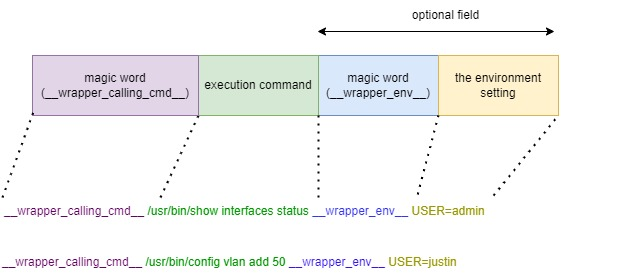

# 1. CLI wrapper 

# 2. High Level Design Document

<!-- markdown-toc start - Don't edit this section. Run M-x markdown-toc-refresh-toc -->
**Table of Contents**

- [1. CLI wrapper ](#1-cli-wrapper)
- [2. High Level Design Document](#2-high-level-design-document)
    - [2.1. Revision](#21-revision)
    - [2.2. About this Manual](#22-about-this-manual)
    - [2.3. Architecture](#23-architecture)
    - [2.4. Design](#24-design)
        - [2.4.1. Generate wrapped files](#241-generate-wrapped-files)
        - [2.4.2. Command execution flow](#242-command-execution-flow)
        - [2.4.3. Watchdog execution flow](#243-watchdog-execution-flow)
        - [2.4.4. Encoded command format](#244-encoded-command-format)
        - [2.4.5. CLI wrapper service](#245-cli-wrapper-service)
        - [2.4.6. Source tree](#246-source-tree)

<!-- markdown-toc end -->

## 2.1 Revision

| Rev  |    Date    |                Author                 | Change Description |
| :--: | :--------: | :-----------------------------------: | ------------------ |
| 0.1  | 08/12/2022 |  Justin Lu                            | Initial version    |
| 0.2  | 09/03/2022 |  Justin Lu                            | 1. Add watchdog design   2. modify architecture picture |
| 0.3  | 09/22/2022 |  Antonio Ho                           | Add enable/disable design |

## 2.2 About this Manual

This document provides the high-level design for CLI_wrapper in SONiC

## 2.3 Architecture
SONiC uses click package as its CLI engine, although click package provides developers a convenient way to establish whole CLI architecture, it also has some disadvantage. The problem we want to address here is about the bad performance of CLI execution time. 

Everytime user executes a command, CLI engine will load main source file (ex. config/main.py), then starts to execute the command. In this process, all libraries always have to be imported again. It costs about 80% execution time on this process, so CLI_wrapper is designed to reduce the time.

The figure below depicts the architecture of CLI_wrapper. 

* CLI_wrapper builder

  In order to integrate CLI_wrapper with current CLI architecture, we develop CLI_wrapper builder to generate CLI_wrapper for command source file (ex. main.py). When sonic-utilities debian is packaged, it calls CLI_wrapper builder to generate wrapped files which contains only function interface and minimal libraries. It replaces function body with the calling of CLI_wrapper client to send a encoded command to CLI_wrapper server and acquires the result. Since the CLI_wrapper only contains minimal libraries, CLI engine doesn't need a lot of time to execute.

* CLI_wrapper server

  CLI_wrapper server is responsible for the execution of click command. It starts when system boots up, and loads all needed libraries to server. Then setup a socket to wait client's request. Once it accepts a request, it spawns a CLI_worker process to deal with this request. 
  
  In order to avoid that some command may stuck in CLI worker and cause resource leakage, a watchdog thread is designed to watch the execution time of CLI worker, once the execution time exceeds maximum execution time, the CLI worker will be gracefully terminated. But if the CLI worker is still alive after one minute, a kill signal will be sent to CLI worker to tear down it. 
  
  The local DB is used to store the record of spawned CLI worker, it records the steady timestamp and pid of the CLI worker. 
  
* CLI_worker
  
  Decode the request and execute this command. Return the execution result to client and finish this process.
  
  Everytime cli_wapper server receives a request, it spawns a process to handle this request, so no single block point may happen in this design. 
  
* CLI_wrapper client

  It is a library that can be used to interact with CLI wrapper server. 
  
---

## 2.4 Design

This section provides design details for CLI_wrapper.

### 2.4.1 Generate wrapped files

* In the step 1 and step 2, builder copies the necessary libraries to wrapped file and discard other libraries to reduce loading time

* In the step 3, builder removes the content of command function body and replaces it with CLI_wrapper client

    
### 2.4.2 Command execution flow

* System ctrl bring up CLI_wrapper server when system starts

* Click engine imports wrapped main.py and call CLI_wrapper client to send request

* CLI_wrapper client gets command parameter and environment setting from CLI context, then encodes those information to a command string and send to CLI_wrapper server.

* CLI_wrapper server launches a CLI worker to deal with this request and write timestamp and pid to local DB

* CLI worker decodes the command to get parameters and environment setting, then execute this command based on those settings. In the end, it sends return code and data back to CLI wrapper client

### 2.4.3 Watchdog execution flow

* Default polling time is 60 seconds, watchdog check if the pid in local DB is still running, if not, update local DB.

* Default expired time is 600 seconds (To send terminate signal) and 660 seconds (To send kill signal), watchdog check if CLI worker execution time exceeds expired time, send terminate or kill signal to recycle it.

### 2.4.4 Encoded command format

In order to send all needed information in a request, some encode processes must be applied before sending it to server.
The following picture shows two examples for encoded requests.

* \__wrapper_calling_cmd__: used to indicate the start of a command

* \__wrapper_env__ : used to indicate the environment setting when executing this command, separate the value by ";", this is a optional field.

### 2.4.5 CLI wrapper service

In compile stage, CLI_wrapper builder put generated wrapped file and original main.py to a backup folder.

CLI wrapper service use these backup files to enable/disable CLI_wrapper feature.

* Enable CLI wrapper service

    1. Replace main.py with wrapped main.py

    2. Start CLI wrapper daemon

* Disable CLI wrapper service

    1. Replace main.py with main_impl.py

    2. Stop CLI wrapper daemon

### 2.4.6 Source tree 

Here lists the related source tree of CLI_wrapper

* CLI_wrapper builder : files/build_scripts/cli_wrapper
* CLI_wrapper client : src/sonic-utilities/cli_wrapper
* CLI_wrapper server : src/sonic-utilities/cli_wrapper
* Integrate CLI wrapper builder to sonic-utilities debian: rules/sonic-utilities.mk

