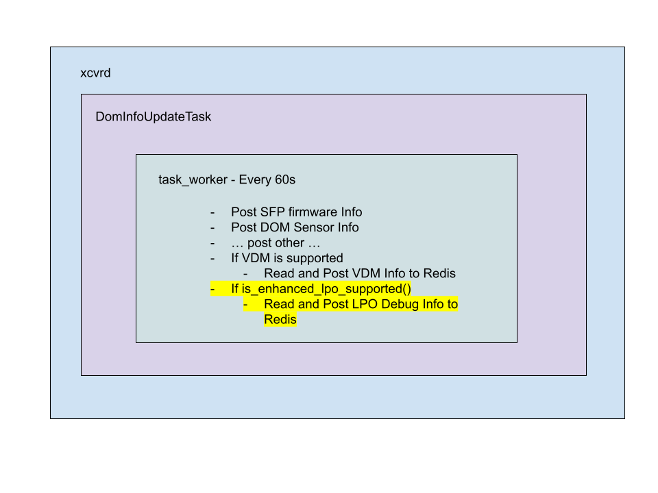

# Enhanced LPO SI Parameters and Debug Registers HLD
## Table of Contents
- [Revision](#revision)
- [About This Manual](#about-this-manual)
- [1 \- Proposed Enhanced LPO Registers and Eeprom Map](#1---proposed-enhanced-lpo-registers-and-eeprom-map)
    - [1.1 Enhanced Registers Advertisement](#11-enhanced-registers-advertisement)
    - [1.2 New Enhanced Tuning Registers](#12-new-enhanced-tuning-registers)
        - [1.2.1 High Level Overview](#121-high-level-overview)
        - [1.2.2 Detailed Explanation and Eeprom Map](#122-detailed-explanation-and-eeprom-map)
    - [1.3 New Enhanced Debug Registers](#13-new-enhanced-debug-registers)
        - [1.3.1 High Level Overview](#131-high-level-overview)
            - [1.3.1.1 Polarity](#1311-polarity)
            - [1.3.1.2 TX Host-Side VMA Monitoring](#1312-tx-host-side-vma-monitoring)
            - [1.3.1.3 Tx Host Input VMA Thresholds](#1313-tx-host-input-vma-thresholds)
            - [1.3.1.4 TX Host-Side VMA Status Flags](#1314-tx-host-side-vma-status-flags)
            - [1.3.1.5 Per-Lane TX Host Input VMA Measurements](#1315-per-lane-tx-host-input-vma-measurements)
            - [1.3.1.6 TX Host-Side VMA Masking](#1316-tx-host-side-vma-masking)
            - [1.3.1.7 RX Optical Input OMA Monitoring](#1317-rx-optical-input-oma-monitoring)
            - [1.3.1.8 RX Optical Input OMA Status Flags](#1318-rx-optical-input-oma-status-flags)
            - [1.3.1.9 Per-Lane RX Optical OMA Measurements](#1319-per-lane-rx-optical-oma-measurements)
            - [1.3.1.10 RX Optical OMA Masking](#13110-rx-optical-oma-masking)
            - [1.3.1.11 Tx Outer Extinction Ratio](#13111-tx-outer-extinction-ratio)
        - [1.3.2 Detailed Explanation and Eeprom Map](#132-detailed-explanation-and-eeprom-map)
            - [1.3.2.1 Upper Page C1h](#1321-upper-page-c1h)
            - [1.3.2.2 Upper Page C2h](#1322-upper-page-c2h)
- [2 \- SONiC Software Requirements](#2---sonic-software-requirements)
- [3 \- High-Level Design](#3---high-level-design)
    - [3.1 Support for new tuning parameter on LPOs](#31-support-for-new-tuning-parameter-on-lpos)
    - [3.2 Support for New Enhanced Diagnostic Registers](#32-support-for-new-enhanced-diagnostic-registers)
        - [3.2.1 Detection of modules with 25h and 26h page support](#321-detection-of-modules-with-25h-and-26h-page-support)
        - [3.2.2 Polling Debug Registers](#322-polling-debug-registers)
        - [3.2.3 Populating to Redis](#323-populating-to-redis)

# Revision

| Rev | Date | Author | Change Description |
| :---- | :---- | :---- | :---- |
| 1.0 | 2/3/2025 | Arista Networks | Initial Version |

# About This Manual

This is a high-level design document describing the implementation of enhanced registers on CMIS LPO modules for (1) additional optical SI tuning parameters and (2) LPO debuggability.

Section 1 introduces the new registers and their eeprom map to be implemented on the module. Section 2 and 3 focuses on the SONiC-side implementation to support these new registers.

# 1 - Proposed Enhanced LPO Registers and Eeprom Map

The new enhanced registers and their corresponding eeprom maps are listed in this section

## 1.1 Enhanced Registers Advertisement

For LPOs to advertise support for the new enhanced registers, the following bytes will be used.

| Page | Byte | Bits| Description| Type |
| :---: | :---: | :---: | :--- | :--- |
| 01h | 195 | 7-0 | LPO EEPROM compliance "L" (Byte 195 \== 0x4C to claim support) | RO |
| 01h | 196 | 7-0 | Enhanced LPO Specification version | RO |

Byte 195 in the module is set to 0x4C (ascii “L”) to indicate to the host that these registers are supported.

## 1.2 New Enhanced Tuning Registers

Below is the proposed list of parameters to enhance the signal integrity of LPO modules. This parameter is configured as part of stage control set 0 similar to the other module side tuning parameters. (“FixedInputEqTargetTx”, “OuputEqPreCursorTargetRx”, ….)

### 1.2.1 High Level Overview

Below, a high level overview of the registers are given. See section 1.2.2 for a detailed explanation and a eeprom map.

| Parameter | Description |
| :---- | :---- |
| FixedOuterExtictionRatioTargetTx lanes 1-8  | Fixed Tx output outer extinction ratio (OER) |

## 

### 1.2.2 Detailed Explanation and Eeprom Map

| Page | Byte | Bits| Name| Description | Type |
| :---: | :---: | :---: | :---: | :---- | :---- |
| 10h | 245 | 7-0 | Enhanced::SCS0::FixedOuterExtictionRatioTargetTx1 | U8 FixedOuterExtictionRatioTargetTx\<i\> Fixed Tx output outer extinction ratio (OER) under AGC mode: in 0.1 dB increments | RW Adv. |
| 10h | 246 | 7-0 | Enhanced::SCS0::FixedOuterExtictionRatioTargetTx2 | U8 FixedOuterExtictionRatioTargetTx\<i\> Fixed Tx output outer extinction ratio (OER) under AGC mode: in 0.1 dB increments | RW Adv. |
| 10h | 247 | 7-0 | Enhanced::SCS0::FixedOuterExtictionRatioTargetTx3 | U8 FixedOuterExtictionRatioTargetTx\<i\> Fixed Tx output outer extinction ratio (OER) under AGC mode: in 0.1 dB increments | RW Adv. |
| 10h | 248 | 7-0 | Enhanced::SCS0::FixedOuterExtictionRatioTargetTx4 | U8 FixedOuterExtictionRatioTargetTx\<i\> Fixed Tx output outer extinction ratio (OER) under AGC mode: in 0.1 dB increments | RW Adv. |
| 10h | 249 | 7-0 | Enhanced::SCS0::FixedOuterExtictionRatioTargetTx5 | U8 FixedOuterExtictionRatioTargetTx\<i\> Fixed Tx output outer extinction ratio (OER) under AGC mode: in 0.1 dB increments | RW Adv. |
| 10h | 250 | 7-0 | Enhanced::SCS0::FixedOuterExtictionRatioTargetTx6 | U8 FixedOuterExtictionRatioTargetTx\<i\> Fixed Tx output outer extinction ratio (OER) under AGC mode: in 0.1 dB increments | RW Adv. |
| 10h | 251 | 7-0 | Enhanced::SCS0::FixedOuterExtictionRatioTargetTx7 | U8 FixedOuterExtictionRatioTargetTx\<i\> Fixed Tx output outer extinction ratio (OER) under AGC mode: in 0.1 dB increments | RW Adv. |
| 10h | 252 | 7-0 | Enhanced::SCS0::FixedOuterExtictionRatioTargetTx8 | U8 FixedOuterExtictionRatioTargetTx\<i\> Fixed Tx output outer extinction ratio (OER) under AGC mode: in 0.1 dB increments | RW Adv. |

## 1.3 New Enhanced Debug Registers
Below is the proposed list of parameters to enhance LPO debuggability. These registers are all defined in upper page 25h and 26h.

### 1.3.1 High Level Overview

A high level overview of these registers is provided in this section. See section 1.3.2 for a detailed explanation and a eeprom map.

#### 1.3.1.1 Polarity

| Parameter | Description |
| :---- | :---- |
| LPOTxPolarityInverted | Indicates TX electrical polarity inversion; critical when debugging lane-specific BER or link-up failures caused by PCB polarity mismatches. |
| LPORxPolarityInverted | Indicates RX electrical polarity inversion; useful for isolating host-side polarity errors versus optical or DSP faults. |

#### 1.3.1.2 TX Host-Side VMA Monitoring

Electrical Amplitude into Module. VMA (Voltage Modulation Amplitude) reflects the actual electrical swing driving the optical modulator

| Parameter | Description |
| :---- | :---- |
| LPOTxHostInputVMAMonAccuracySupported | Indicates whether VMA monitoring meets accuracy specs; prevents false conclusions when correlating electrical swing to optical performance. |
| LPOTxHostInputVMAHighAlarmThreshold | Upper VMA alarm limit; catches over-drive conditions that increase modulator nonlinearity and PAM4 eye distortion. |
| LPOTxHostInputVMALowAlarmThreshold | Lower VMA alarm limit; identifies under-drive scenarios leading to poor extinction ratio and elevated BER. |
| LPOTxHostInputVMAHighWarningThreshold | Early warning for excessive electrical swing before hard optical penalties appear. |
| LPOTxHostInputVMALowWarningThreshold | Early warning for marginal electrical amplitude that may degrade link margin under temperature or aging. |

#### 1.3.1.3 Tx Host Input VMA Thresholds

| Parameter | Description |
| :---- | :---- |
| LPOTxHostInputVMAHighAlarmThreshold | Upper VMA alarm limit; catches over-drive conditions that increase modulator nonlinearity and PAM4 eye distortion. |
| LPOTxHostInputVMALowAlarmThreshold | Lower VMA alarm limit; identifies under-drive scenarios leading to poor extinction ratio and elevated BER. |
| LPOTxHostInputVMAHighWarningThreshold | Early warning for excessive electrical swing before hard optical penalties appear. |
| LPOTxHostInputVMALowWarningThreshold | Early warning for marginal electrical amplitude that may degrade link margin under temperature or aging. |

#### 1.3.1.4 TX Host-Side VMA Status Flags

| Parameter | Description |
| :---- | :---- |
| LPOTxHostInputVMAHighAlarmFlag | Asserted when TX electrical swing exceeds safe limits; strong indicator of host-side over-equalization or driver misconfiguration. |
| LPOTxHostInputVMALowAlarmFlag | Asserted when electrical swing is too low; often correlates with poor eye opening and sensitivity to noise. |
| LPOTxHostInputVMAHighWarningFlag | Predictive indicator of impending over-drive issues before BER impact. |
| LPOTxHostInputVMALowWarningFlag | Predictive indicator of reduced electrical margin. |

#### 1.3.1.5 Per-Lane TX Host Input VMA Measurements

| Parameter | Description |
| :---- | :---- |
| LPOHostInputVMATx1 – Tx8 | Per-lane electrical modulation amplitude into the module; invaluable for isolating lane-specific PCB, connector, or SerDes issues. |

#### 1.3.1.6 TX Host-Side VMA Masking

| Parameter | Description |
| :---- | :---- |
| LPOTxHostInputVMAHighAlarmMask | Masks high-VMA alarms to suppress known-benign conditions during debug or bring-up. |
| LPOTxHostInputVMALowAlarmMask | Masks low-VMA alarms when operating intentionally at reduced swing. |
| LPOTxHostInputVMAHighWarningMask | Masks high-VMA warnings for controlled experiments. |
| LPOTxHostInputVMALowWarningMask | Masks low-VMA warnings during margin testing. |

#### 1.3.1.7 RX Optical Input OMA Monitoring

​​OMA (Optical Modulation Amplitude) is the **true optical eye height** — this directly ties fiber impairments to BER.

| Parameter | Description |
| :---- | :---- |
| LPORxInputOMAMonAccuracySupported | Indicates whether optical amplitude readings are reliable enough for root-cause analysis. |
| LPORxInputOMAHighAlarmThreshold | Upper optical power modulation limit; flags potential receiver saturation or excessive launch power. |
| LPORxInputOMALowAlarmThreshold | Lower optical modulation limit; strong indicator of fiber loss, connector contamination, or transmitter aging. |
| LPORxInputOMAHighWarningThreshold | Early warning for excessive received modulation. |
| LPORxInputOMALowWarningThreshold | Early warning for degraded optical margin before BER collapses. |

#### 1.3.1.8 RX Optical Input OMA Status Flags

| Parameter | Description |
| :---- | :---- |
| LPORxInputOMAHighAlarmFlag | Indicates dangerously high received optical modulation; can explain sudden error bursts due to overload. |
| LPORxInputOMALowAlarmFlag | Indicates insufficient optical modulation; classic symptom of fiber loss or mis-patching. |
| LPORxInputOMAHighWarningFlag | Predictive indicator of excessive optical power trends. |
| LPORxInputOMALowWarningFlag | Predictive indicator of fading optical margin. |

#### 1.3.1.9 Per-Lane RX Optical OMA Measurements

| Parameter | Description |
| :---- | :---- |
| LPOInputOMARx1 – Rx8 | Per-lane received optical modulation amplitude; essential for distinguishing fiber issues vs TX degradation vs RX DSP problems. |

#### 1.3.1.10 RX Optical OMA Masking

| Parameter | Description |
| :---- | :---- |
| LPORxInputOMAHighAlarmMask | Suppresses high-OMA alarms during controlled stress tests. |
| LPORxInputOMALowAlarmMask | Suppresses low-OMA alarms during attenuation experiments. |
| LPORxInputOMAHighWarningMask | Masks early optical overload warnings. |
| LPORxInputOMALowWarningMask | Masks early optical degradation warnings. |

#### 1.3.1.11 Tx Outer Extinction Ratio

| Parameter | Description |
| :---- | :---- |
| LPOTxOuterExtinctionRatioMax | Maximum allowed outer extinction ratio of the optical PAM4 waveform; useful for detecting over-driven modulation that can increase eye closure and nonlinear penalties. |

### 1.3.2 Detailed Explanation and Eeprom Map

#### 1.3.2.1 Upper Page C1h

Note: Unlisted registers are reserved

| Page | Byte | Bits | Name | Description | Type |
| :---: | :---: | :---: | :---: | ----- | :---: |
| C1h | 129 | 7-0 | Enhanced::LPOTxOuterExtinctionRatioMax | U8, Max supported value of the Tx OER under AGC mode: in 0.1 dB increments, yielding a total range of 0 to 25.5 dB. Linearity and other Tx distortions should be considered to advertise the max Tx OER. Advertisement: C1h:128.2 | RO |
| C1h | 133 | 7-0 | Enhanced::LPOTxPolarityInverted | 0b:Tx lane\<i\> do NOT swap the P and N signals 1b: Tx lane \<i\> swap the P and N signals Bit-i is used to advertise the polarity inversion for Tx lane \<i+1\> | RO |
| C1h | 134 | 7-0 | Enhanced::LPORxPolarityInverted | 0b:Rx lane\<i\> do NOT swap the P and N signals 1b: Rx lane \<i\> swap the P and N signals Bit-i is used to advertise the polarity inversion for Rx lane \<i+1\> | RO |
| C1h | 135 | 7-0 | Enhanced::LPOTxHostInputVMAMonAccuracySupported | U4 threshold for LPOHostInputVMATx monitoring accuracy: in 5 mV increments, yielding a total range of 0 to 75 mV. The absolute difference between the measured TP1 VMA and the monitored TP1 VMA shall be less than the advertised accuracy Advertisement: C1h:128.3 | RO |
| C1h | 136 | 7-0 | Enhanced::LPOTxHostInputVMAHighAlarmThreshold | U8 threshold for LPOHostInputVMATx monitor: in 5 mV increments, yielding a total measurement range of 0 to 1275 mV. Advertisement: C1h:128.3 | RO |
| C1h | 137 | 7-0 | Enhanced::LPOTxHostInputVMALowAlarmThreshold | U8 threshold for LPOHostInputVMATx monitor: in 5 mV increments, yielding a total measurement range of 0 to 1275 mV. Advertisement: C1h:128.3 | RO |
| C1h | 138 | 7-0 | Enhanced::LPOTxHostInputVMAHighWarningThreshold | U8 threshold for LPOHostInputVMATx monitor: in 5 mV increments, yielding a total measurement range of 0 to 1275 mV. Advertisement: C1h:128.3 | RO |
| C1h | 139 | 7-0 | Enhanced::LPOTxHostInputVMALowWarningThreshold | U8 threshold for LPOHostInputVMATx monitor: in 5 mV increments, yielding a total measurement range of 0 to 1275 mV. Advertisement: C1h:128.3 | RO |
| C1h | 140 | 7-0 | Enhanced::LPORxInputOMAMonAccuracySupported | U4 threshold for TP3 LPORxInputOMA monitoring accuracy: in 0.2 dB increments, yielding a total range of 0 to 3 dB. The difference between the measured TP3 OMA and the monitored TP3 OMA shall be less than the advertised accuracy. Advertisement: C1h:128.4 | RO |
| C1h | 141 | 7-0 | Enhanced::LPORxInputOMAHighAlarmThreshold (MSB) | U16 threshold (MSB) for LPOHostInputVMATx monitor: in 0.1uW increments, yielding a total measurement range of 0 to 6.5535 mW (\~-40 dBm to \+8.2 dBm for non-zero values) Advertisement: C1h:128.4 | RO |
| C1h | 142 | 7-0 | Enhanced::LPORxInputOMAHighAlarmThreshold (LSB) | U16 threshold (LSB) for LPOHostInputVMATx monitor: in 0.1uW increments, yielding a total measurement range of 0 to 6.5535 mW (\~-40 dBm to \+8.2 dBm for non-zero values) Advertisement: C1h:128.4 | RO |
| C1h | 143 | 7-0 | Enhanced::LPORxInputOMALowAlarmThreshold (MSB) | U16 threshold (MSB) for LPOHostInputVMATx monitor: in 0.1uW increments, yielding a total measurement range of 0 to 6.5535 mW (\~-40 dBm to \+8.2 dBm for non-zero values) Advertisement: C1h:128.4 | RO |
| C1h | 144 | 7-0 | Enhanced::LPORxInputOMALowAlarmThreshold (LSB) | U16 threshold (LSB) for LPOHostInputVMATx monitor: in 0.1uW increments, yielding a total measurement range of 0 to 6.5535 mW (\~-40 dBm to \+8.2 dBm for non-zero values) Advertisement: C1h:128.4 | RO |
| C1h | 145 | 7-0 | Enhanced::LPORxInputOMAHighWarningThreshold (MSB) | U16 threshold (MSB) for LPOHostInputVMATx monitor: in 0.1uW increments, yielding a total measurement range of 0 to 6.5535 mW (\~-40 dBm to \+8.2 dBm for non-zero values) Advertisement: C1h:128.4 | RO |
| C1h | 146 | 7-0 | Enhanced::LPORxInputOMAHighWarningThreshold (LSB) | U16 threshold (LSB) for LPOHostInputVMATx monitor: in 0.1uW increments, yielding a total measurement range of 0 to 6.5535 mW (\~-40 dBm to \+8.2 dBm for non-zero values) Advertisement: C1h:128.4 | RO |
| C1h | 147 | 7-0 | Enhanced::LPORxInputOMALowWarningThreshold (MSB) | U16 threshold (MSB) for LPOHostInputVMATx monitor: in 0.1uW increments, yielding a total measurement range of 0 to 6.5535 mW (\~-40 dBm to \+8.2 dBm for non-zero values) Advertisement: C1h:128.4 | RO |
| C1h | 148 | 7-0 | Enhanced::LPORxInputOMALowWarningThreshold (LSB) | U16 threshold (LSB) for LPOHostInputVMATx monitor: in 0.1uW increments, yielding a total measurement range of 0 to 6.5535 mW (\~-40 dBm to \+8.2 dBm for non-zero values) Advertisement: C1h:128.4 | RO |

#### 1.3.2.2 Upper Page C2h

Note: Unlisted registers are reserved

| Page | Byte | Bits | Name | Description | Type |
| :---: | :---: | :---: | :---: | ----- | :---: |
| C2h | 141 | 7-0 | Enhanced::LPOTxHostInputVMAHighAlarmFlag | Latched LPOTxHostInputVMAHighAlarmFlag\<i\> Advertisement: C1h:128.3 Bit-i is used to latch the host lane \<i+1\> flag | RO/COR Adv. |
| C2h | 142 | 7-0 | Enhanced::LPOTxHostInputVMALowAlarmFlag | Latched LPOTxHostInputVMALowAlarmFlag\<i\> Advertisement: C1h:128.3 Bit-i is used to latch the host lane \<i+1\> flag | RO/COR Adv. |
| C2h | 143 | 7-0 | Enhanced::LPOTxHostInputVMAHighWarningFlag | Latched LPOTxHostInputVMAHighWarningFlag\<i\> Advertisement: C1h:128.3 Bit-i is used to latch the host lane \<i+1\> flag | RO/COR Adv. |
| C2h | 144 | 7-0 | Enhanced::LPOTxHostInputVMALowWarningFlag | Latched LPOTxHostInputVMALowWarningFlag\<i\> Advertisement: C1h:128.3 Bit-i is used to latch the host lane \<i+1\> flag | RO/COR Adv. |
| C2h | 145 | 7-0 | Enhanced::LPOHostInputVMATx1 | U8 LPOHostInputVMATx\<i\> Internally measured Tx host input VMA: in 5 mV increments, yielding a total measurement range of 0 to 1275 mV Advertisement: C1h:128.3 Accuracy: C1h:135 | RO |
| C2h | 146 | 7-0 | Enhanced::LPOHostInputVMATx2 | U8 LPOHostInputVMATx\<i\> Internally measured Tx host input VMA: in 5 mV increments, yielding a total measurement range of 0 to 1275 mV Advertisement: C1h:128.3 Accuracy: C1h:135 | RO |
| C2h | 147 | 7-0 | Enhanced::LPOHostInputVMATx3 | U8 LPOHostInputVMATx\<i\> Internally measured Tx host input VMA: in 5 mV increments, yielding a total measurement range of 0 to 1275 mV Advertisement: C1h:128.3 Accuracy: C1h:135 | RO |
| C2h | 148 | 7-0 | Enhanced::LPOHostInputVMATx4 | U8 LPOHostInputVMATx\<i\> Internally measured Tx host input VMA: in 5 mV increments, yielding a total measurement range of 0 to 1275 mV Advertisement: C1h:128.3 Accuracy: C1h:135 | RO |
| C2h | 149 | 7-0 | Enhanced::LPOHostInputVMATx5 | U8 LPOHostInputVMATx\<i\> Internally measured Tx host input VMA: in 5 mV increments, yielding a total measurement range of 0 to 1275 mV Advertisement: C1h:128.3 Accuracy: C1h:135 | RO |
| C2h | 150 | 7-0 | Enhanced::LPOHostInputVMATx6 | U8 LPOHostInputVMATx\<i\> Internally measured Tx host input VMA: in 5 mV increments, yielding a total measurement range of 0 to 1275 mV Advertisement: C1h:128.3 Accuracy: C1h:135 | RO |
| C2h | 151 | 7-0 | Enhanced::LPOHostInputVMATx7 | U8 LPOHostInputVMATx\<i\> Internally measured Tx host input VMA: in 5 mV increments, yielding a total measurement range of 0 to 1275 mV Advertisement: C1h:128.3 Accuracy: C1h:135 | RO |
| C2h | 152 | 7-0 | Enhanced::LPOHostInputVMATx8 | U8 LPOHostInputVMATx\<i\> Internally measured Tx host input VMA: in 5 mV increments, yielding a total measurement range of 0 to 1275 mV Advertisement: C1h:128.3 Accuracy: C1h:135 | RO |
| C2h | 157 | 7-0 | Enhanced::LPORxInputOMAHighAlarmFlag | Latched LPORxInputOMAHighAlarmFlag\<i\> Advertisement: C1h:128.4 Bit-i is used to latch the media lane \<i+1\> flag | RO/COR Adv. |
| C2h | 158 | 7-0 | Enhanced::LPORxInputOMALowAlarmFlag | Latched LPORxInputOMALowAlarmFlag\<i\> Advertisement: C1h:128.4 Bit-i is used to latch the media lane \<i+1\> flag | RO/COR Adv. |
| C2h | 159 | 7-0 | Enhanced::LPORxInputOMAHighWarningFlag | Latched LPORxInputOMAHighWarningFlag\<i\> Advertisement: C1h:128.4 Bit-i is used to latch the media lane \<i+1\> flag | RO/COR Adv. |
| C2h | 160 | 7-0 | Enhanced::LPORxInputOMALowWarningFlag | Latched LPORxInputOMALowWarningFlag\<i\> Advertisement: C1h:128.4 Bit-i is used to latch the media lane \<i+1\> flag | RO/COR Adv. |
| C2h | 161 | 7-0 | Enhanced::LPOInputOMARx1 (MSB) | U16 LPOInputOMARx\<i\> (MSB) Internally measured Rx media input OMA: in 0.1mW increments, yielding a total measurement range of 0 to 6.5535 mW (\~-40 dBm to \+8.2 dBm for non-zero values) Advertisement: C1h:128.4 Accuracy: C1h:140 | RO |
| C2h | 162 | 7-0 | Enhanced::LPOInputOMARx1 (LSB) | U16 LPOInputOMARx\<i\> (LSB) Internally measured Rx media input OMA: in 0.1mW increments, yielding a total measurement range of 0 to 6.5535 mW (\~-40 dBm to \+8.2 dBm for non-zero values) Advertisement: C1h:128.4 Accuracy: C1h:140 | RO |
| C2h | 163 | 7-0 | Enhanced::LPOInputOMARx2 (MSB) | U16 LPOInputOMARx\<i\> (MSB) Internally measured Rx media input OMA: in 0.1mW increments, yielding a total measurement range of 0 to 6.5535 mW (\~-40 dBm to \+8.2 dBm for non-zero values) Advertisement: C1h:128.4 Accuracy: C1h:140 | RO |
| C2h | 164 | 7-0 | Enhanced::LPOInputOMARx2 (LSB) | U16 LPOInputOMARx\<i\> (LSB) Internally measured Rx media input OMA: in 0.1mW increments, yielding a total measurement range of 0 to 6.5535 mW (\~-40 dBm to \+8.2 dBm for non-zero values) Advertisement: C1h:128.4 Accuracy: C1h:140 | RO |
| C2h | 165 | 7-0 | Enhanced::LPOInputOMARx3 (MSB) | U16 LPOInputOMARx\<i\> (MSB) Internally measured Rx media input OMA: in 0.1mW increments, yielding a total measurement range of 0 to 6.5535 mW (\~-40 dBm to \+8.2 dBm for non-zero values) Advertisement: C1h:128.4 Accuracy: C1h:140 | RO |
| C2h | 166 | 7-0 | Enhanced::LPOInputOMARx3 (LSB) | U16 LPOInputOMARx\<i\> (LSB) Internally measured Rx media input OMA: in 0.1mW increments, yielding a total measurement range of 0 to 6.5535 mW (\~-40 dBm to \+8.2 dBm for non-zero values) Advertisement: C1h:128.4 Accuracy: C1h:140 | RO |
| C2h | 167 | 7-0 | Enhanced::LPOInputOMARx4 (MSB) | U16 LPOInputOMARx\<i\> (MSB) Internally measured Rx media input OMA: in 0.1mW increments, yielding a total measurement range of 0 to 6.5535 mW (\~-40 dBm to \+8.2 dBm for non-zero values) Advertisement: C1h:128.4 Accuracy: C1h:140 | RO |
| C2h | 168 | 7-0 | Enhanced::LPOInputOMARx4 (LSB) | U16 LPOInputOMARx\<i\> (LSB) Internally measured Rx media input OMA: in 0.1mW increments, yielding a total measurement range of 0 to 6.5535 mW (\~-40 dBm to \+8.2 dBm for non-zero values) Advertisement: C1h:128.4 Accuracy: C1h:140 | RO |
| C2h | 169 | 7-0 | Enhanced::LPOInputOMARx5 (MSB) | U16 LPOInputOMARx\<i\> (MSB) Internally measured Rx media input OMA: in 0.1mW increments, yielding a total measurement range of 0 to 6.5535 mW (\~-40 dBm to \+8.2 dBm for non-zero values) Advertisement: C1h:128.4 Accuracy: C1h:140 | RO |
| C2h | 170 | 7-0 | Enhanced::LPOInputOMARx5 (LSB) | U16 LPOInputOMARx\<i\> (LSB) Internally measured Rx media input OMA: in 0.1mW increments, yielding a total measurement range of 0 to 6.5535 mW (\~-40 dBm to \+8.2 dBm for non-zero values) Advertisement: C1h:128.4 Accuracy: C1h:140 | RO |
| C2h | 171 | 7-0 | Enhanced::LPOInputOMARx6 (MSB) | U16 LPOInputOMARx\<i\> (MSB) Internally measured Rx media input OMA: in 0.1mW increments, yielding a total measurement range of 0 to 6.5535 mW (\~-40 dBm to \+8.2 dBm for non-zero values) Advertisement: C1h:128.4 Accuracy: C1h:140 | RO |
| C2h | 172 | 7-0 | Enhanced::LPOInputOMARx6 (LSB) | U16 LPOInputOMARx\<i\> (LSB) Internally measured Rx media input OMA: in 0.1mW increments, yielding a total measurement range of 0 to 6.5535 mW (\~-40 dBm to \+8.2 dBm for non-zero values) Advertisement: C1h:128.4 Accuracy: C1h:140 | RO |
| C2h | 173 | 7-0 | Enhanced::LPOInputOMARx7 (MSB) | U16 LPOInputOMARx\<i\> (MSB) Internally measured Rx media input OMA: in 0.1mW increments, yielding a total measurement range of 0 to 6.5535 mW (\~-40 dBm to \+8.2 dBm for non-zero values) Advertisement: C1h:128.4 Accuracy: C1h:140 | RO |
| C2h | 174 | 7-0 | Enhanced::LPOInputOMARx7 (LSB) | U16 LPOInputOMARx\<i\> (LSB) Internally measured Rx media input OMA: in 0.1mW increments, yielding a total measurement range of 0 to 6.5535 mW (\~-40 dBm to \+8.2 dBm for non-zero values) Advertisement: C1h:128.4 Accuracy: C1h:140 | RO |
| C2h | 175 | 7-0 | Enhanced::LPOInputOMARx8 (MSB) | U16 LPOInputOMARx\<i\> (MSB) Internally measured Rx media input OMA: in 0.1mW increments, yielding a total measurement range of 0 to 6.5535 mW (\~-40 dBm to \+8.2 dBm for non-zero values) Advertisement: C1h:128.4 Accuracy: C1h:140 | RO |
| C2h | 176 | 7-0 | Enhanced::LPOInputOMARx8 (LSB) | U16 LPOInputOMARx\<i\> (LSB) Internally measured Rx media input OMA: in 0.1mW increments, yielding a total measurement range of 0 to 6.5535 mW (\~-40 dBm to \+8.2 dBm for non-zero values) Advertisement: C1h:128.4 Accuracy: C1h:140 | RO |
| C2h | 177 | 7-0 | Enhanced::LPORxInputOMAHighAlarmMask | LPORxInputOMAHighAlarmMask\<i\>, Advertisement: C1h:128.4 Bit-i is used to mask the media lane\<i+1\> | RW Adv. |
| C2h | 178 | 7-0 | Enhanced::LPORxInputOMALowAlarmMask | LPORxInputOMALowAlarmMask\<i\>, Advertisement: C1h:128.4 Bit-i is used to mask the media lane\<i+1\> | RW Adv. |
| C2h | 179 | 7-0 | Enhanced::LPORxInputOMAHighWarningMask | LPORxInputOMAHighWarningMask\<i\>, Advertisement: C1h:128.4 Bit-i is used to mask the media lane\<i+1\> | RW Adv. |
| C2h | 180 | 7-0 | Enhanced::LPORxInputOMALowWarningMask | LPORxInputOMALowWarningMask\<i\>, Advertisement: C1h:128.4 Bit-i is used to mask the media lane\<i+1\> | RW Adv. |

# 2 \- SONiC Software Requirements

To support an enhanced LPO, SONiC will need to implement:

1) writing additional tuning parameters to LPO modules using optics\_si\_settings.json  
2) reading values in the debug registers to RedisDb

# 3 \- High-Level Design

## 3.1 Support for new tuning parameter on LPOs

In SONiC, there is already a platform specific optics\_si\_settings.json file can be defined to match on specific transceivers and apply tuning parameters such as “FixedInputEqTargetTx”, “OuputEqPreCursorTargetRx”, …. This design seeks to extend the existing infrastructure for an additional “FixedOuterExtictionRatioTargetTx” parameter.

An example optics\_si\_settings.json is shown below with the new attribute highlighted:

```diff
{
    "GLOBAL_MEDIA_SETTINGS": {
        "25,29-36,39,42": {
            "100G_SPEED": {
                "EOLO-138HG-PCT-10-SL1": {
                    "FixedInputEqTargetTx": {
                        "FixedInputEqTargetTx1": 0,
                        "FixedInputEqTargetTx2": 0,
                        "FixedInputEqTargetTx3": 0,
                        "FixedInputEqTargetTx4": 0,
                        "FixedInputEqTargetTx5": 0,
                        "FixedInputEqTargetTx6": 0,
                        "FixedInputEqTargetTx7": 0,
                        "FixedInputEqTargetTx8": 0
                    }
                },
                "EOLO-138HG-PCT-10-CSL1": {
+                   "FixedOuterExtictionRatioTargetTx": {
+                       "FixedOuterExtictionRatioTargetTx1": 1,
+                       "FixedOuterExtictionRatioTargetTx2": 1,
+                       "FixedOuterExtictionRatioTargetTx3": 1,
+                       "FixedOuterExtictionRatioTargetTx4": 1,
+                       "FixedOuterExtictionRatioTargetTx5": 1,
+                       "FixedOuterExtictionRatioTargetTx6": 1,
+                       "FixedOuterExtictionRatioTargetTx7": 1,
+                       "FixedOuterExtictionRatioTargetTx8": 1
                    },
```

See [optics\_si\_settings.json HLD](https://github.com/SONiC-net/SONiC/blob/master/doc/sfp-cmis/CMIS-custom-SI-settings.md) for more information.

## 3.2 Support for New Enhanced Diagnostic Registers

### 3.2.1 Detection of modules with 25h and 26h page support

To detect whether or not these debug registers are supported on an inserted module, a new CMIS API method is added. This function returns True if the inserted module advertises support for these additional features. (Byte 195 \- See section 1.1)

```py
class CmisApi(XcvrApi):
   ...
   def is_enhanced_lpo_supported( self ):
      # Returns if module supports debug registers in page 25h and 26h.
      ...
```

This is read only once initially when the module is first inserted.

### 3.2.2 Polling Debug Registers

Xcvrd currently starts up a dom\_mgr task to handle polling various transceiver status registers. This design extends the current infrastructure to the new debug registers introduced above. Below is a high level overview of where this new LPO read/ post logic is located. The highlighted section is the proposed change:



The logic for the additional registers is similar to the existing VDM polling support. It is only applicable for modules that claim page 25h and 26h support (See section 1.1) and will reread the LPO Debug registers every polling cycle.

### 3.2.3 Populating to Redis

This design proposes the following new redis DB paths to store LPO debug information inside STATE\_DB. This is populated by the DomInfoUpdateTask thread (see 3.2.2). See the new key/value pairs added below:

1) TRANSCEIVER\_LPO\_DEBUG\_INFO|EthernetX
    - LPOTxPolarityInverted  
    - LPORxPolarityInverted  
    - LPOTxHostInputVMAMonAccuracySupported  
    - LPORxInputOMAMonAccuracySupported  
    - LPOTxOuterExtinctionRatioMax

2) TRANSCEIVER\_LPO\_DEBUG\_STATUS|EthernetX
    - LPOHostInputVMATx\[1-8\]  
    - LPOInputOMARx\[1-8\]

3) TRANSCEIVER\_LPO\_DEBUG\_THRESHOLD|EthernetX
    - LPOTxHostInputVMAHighAlarmThreshold  
    - LPOTxHostInputVMALowAlarmThreshold  
    - LPOTxHostInputVMAHighWarningThreshold  
    - LPOTxHostInputVMALowWarningThreshold  
    - LPORxInputOMAHighAlarmThreshold  
    - LPORxInputOMALowAlarmThreshold  
    - LPORxInputOMAHighWarningThreshold  
    - LPORxInputOMALowWarningThreshold

4) TRANSCEIVER\_LPO\_DEBUG\_FLAG|EthernetX  
TRANSCEIVER\_LPO\_DEBUG\_FLAG\_SET\_TIME|EthernetX  
TRANSCEIVER\_LPO\_DEBUG\_FLAG\_CLEAR\_TIME|EthernetX  
TRANSCEIVER\_LPO\_DEBUG\_FLAG\_CHANGE\_COUNT|EthernetX
    - LPOTxHostInputVMAHighAlarmFlag  
    - LPOTxHostInputVMALowAlarmFlag  
    - LPOTxHostInputVMAHighWarningFlag  
    - LPOTxHostInputVMALowWarningFlag  
      LPORxInputOMAHighAlarmFlag  
    - LPORxInputOMALowAlarmFlag  
    - LPORxInputOMAHighWarningFlag  
    - LPORxInputOMALowWarningFlag