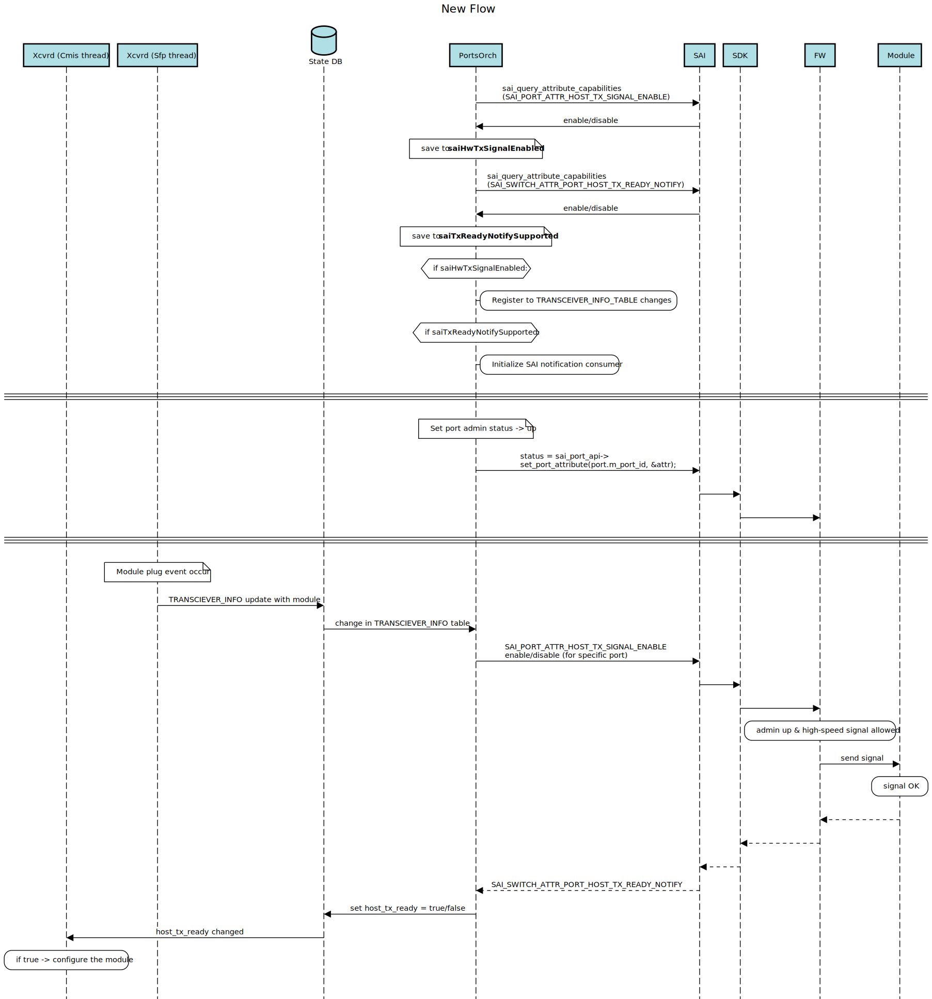

# Enhancement of CMIS module management

## Table of Content 

## 1. Revision 


 | Rev |     Date    |       Author       | Change Description                |
 |:---:|:-----------:|:------------------:|-----------------------------------|
 | 0.1 | July 2023   |  Noa Or            | Initial version                   |

## 2. Scope  

This section describes an enhancment of the synchronization between ASIC port and module configuration.

## 3. Definitions/Abbreviations 

N/A

## 4. Overview

Configuration of the ASIC side (port SERDES) is handled by the SWSS docker (Ports Orch Agent) interacting with the vendor SAI via SAI calls, whereas the modules supporting the CMIS protocol are configured by PMON docker (Xcvrd daemon).

These initialization processes should be synchronized and the configuration of CMIS module should start only after the ASIC is initialized and per CMIS 5.2 it started sending the high-speed signal toward a module.

Currently, SONIC uses the "host_tx_ready"  flag in the PORT table in STATE DB for synchronization. This flag is set by Ports OA right after the SAI API for setting the Admin status to UP returns with OK/Success status. PMON registers for changes of this flag in Redis DB and starts the CMIS initialization for a particular module when this flag is set.

Current design has some gaps with synchronization between ASIC and module configuration.
This document purpose is to introduce an enhacement that will address the gaps and find a backward compatible solution. 


## 5. Requirements

* SONiC shall have backward compatibility for platforms that don't support the proposed enhancement.

* Vendor SDK/FW shall start sending high-speed signal to module, only when admin status is up, and it has an indication that module was plugged in.

* Vendor SDK/FW shall support asynchronous notification of start/stop of sending high-speed signal from ASIC to module.

* PortsOrch shall set host_tx_ready in state DB, only when it recieved notification that the high-speed signal is sent. 

## 6. High-Level Design 

Current Flow:
<p align=left>

</p>

### 6.1. Problem Statement
With move to SW-based management of CMIS modules - when the ASIC side is configured by vendor SDK, and module side by SONIC, some problems have been identified with the current approach.

#### 6.1.2. Host TX Ready signal
As mentioned earlier, currently SONIC assumes that as soon as the Admin Status is set to UP and the corresponding SAI call returns with OK/SUCCESS status, the "host_tx_ready" flag can be set in the STATE DB to trigger the CMIS State Machine for specific port. 
But it is not always a truth. ASIC port initialization process takes some time and this time can increase with move to new transceiver technologies (e.g. BiDi). 
So, in some cases the module initialization can be triggered too early, before the high-speed signal started to be transmitted by ASIC to a module

#### 6.1.3. Unterminated Transmission
With move to the SW-based module management, the module presence is handled by SONIC, and FW might be unaware of the module presence status. 
In this case, when the Admin status of a port is set to UP, FW can start transmitting the high-speed signal even without a plugged-in module. Such unterminated transmission can cause cross-talks to adjacent ports, high EMI, high BER and eventually shorten the transceiver lifetime so it is recommended that ASIC will not start sending the high-speed signal before a module is plugged.

### 6.2. New Approach

To provide the response to the described problem statements, SONIC should do the following:

1. Control transmitting of the high-speed signal based on module presence (allow this signal only when a module is plugged-in).
2. Trigger the module initialization (using the CMIS state machine) only when the high-speed signal was already transmitted by ASIC towards a module.

SWSS shall allow transmitting of the high-speed signal on receiving the INSERTION indication from PMON.
Then, on setting the Admin Status to UP, the vendor SDK/FW shall start transmitting this signal to a module and shall report about that to SONIC.

ASIC FW shall start transmitting the high-speed TX signal only when **both** conditions are met:

1. It is allowed (by SWSS) to transmit this signal.
2. Port mapped to the module is set to Admin UP.

High Level Flow:

<p align=left>

</p>

#### 6.2.1. host_tx_signal
This flow shall be used only on supporting platforms.
Hence, as part of PortsOrch initialization, SONiC will query SAI capabilities regarding the support of allowence flag for sending high-speed signal to module - It will be done by checking if SAI_PORT_ATTR_HOST_TX_SIGNAL_ENABLE is supported.
In case SAI supports it, PortsOrch will start listening to TRANSCEIVER_INFO in State DB to know on any module plug event.

Module's INSERTION/REMOVAL events shall trigger the calling of SAI API on a Port object with SAI_PORT_ATTR_HOST_TX_SIGNAL_ENABLE to enable or disable data signal from ASIC to module.

Host Tx Signal Enable Flow:
<p align=left>

</p>

NOTE:
Setting SAI_PORT_ATTR_HOST_TX_SIGNAL_ENABLE to TRUE (when a module is plugged) is not sufficient to start the transmission of the high-speed signal towards a module. 
Vendor SDK/FW should wait until the Admin status of the port mapped to this module is set to UP to start transmitting the high-speed signal.

Once a module plug event occurs, Xcvrd in Pmon will update TRANSCEIVER_INFO table in STATE DB. 

In order to know on module plug events, Ports OA will listen to changes in TRANSCEIVER_INFO table.
According to information in TRANSCEIVER_INFO table, Ports OA will send SAI_PORT_ATTR_HOST_TX_SIGNAL_ENABLE enable/disable to SAI, indicating if sending high-speed signal to module is allowed or not. 

#### 6.2.2. host_tx_ready
When the ASIC starts transmitting the high-speed signal toward a plugged module the vendor SAI should notify the SONIC (SWSS) of that via a new notification - SAI_SWITCH_ATTR_PORT_HOST_TX_READY_NOTIFY.

The SWSS shall use this notification to set "host_tx_ready" flag in STATE DB which will trigger the CMIS initialization of the module.
It will ensure that the module initialization doesn't start before the high-speed signal is transmitted by ASIC to a module.

The notification shall be expected and consumed only on platforms supporting it. 
Hence, The platform capabilities for supporting of this feature should be queried on Port OA init.

On platforms not supporting this functionality the “host_tx_ready” flag shall be set in STATE DB upon return of Port Admin status UP with SUCCESS return code (backward-compatible behavior)

<p align=left>

</p>

For supporting platforms, admin status UP is not sufficient for configuring the module.
Ports OA will set host_tx_ready in state DB only after it knows a module was plugged, and received notification from SAI of the high-speed signal.
When the high-speed signal is sent, a notificatoin from SAI named "SAI_SWITCH_ATTR_PORT_HOST_TX_READY_NOTIFY" will arrive to swss. 
PortsOrch will update State DB with host_tx_ready, after the notification has arrived.

Cmis Manager task behavior will stay the same as today - start configuring the module only after admin state is UP, and host_tx_ready=true.

### 6.3. Implementation Flow

#### 6.3.1. Initialization Flow

Proposed enhancement will be supported on some vendor platforms, so there is a need to learn whether the specific platform supports them on not.
To do that, Ports OA shall use the query capability for the following SAI attributes:

1.	 SAI_PORT_ATTR_HOST_TX_SIGNAL_ENABLE – to know whether the platform supports the control of enabling/disabling the high-speed signal from ASIC to module from SONIC.
2.	SAI_SWITCH_ATTR_PORT_HOST_TX_READY_NOTIFY – to know whether the platform supports the asynchronous notification from SDK/SAI to SWSS about start/stop of transmission of high-speed signal data from ASIC to module.

Ports OA shall use the status of support of these capabilities for its flow.
For example, the notification consumer for a new SAI_SWITCH_ATTR_PORT_HOST_TX_READY_NOTIFY notification will be initialized only if the platform supports the asynchronous notification from SAI/SDK to SWSS.

#### 6.3.2. Enabling/disabling “host_tx_signal”
As described earlier, for platforms supporting this capability, high-speed signal shall be explicitly enabled/disabled by Ports OA on getting the Insertion/Removal event for a specific module.

When a module is plugged in/out the PMON adds/deletes a per-port entry in the TRANSCIEVER_TABLE in STATE DB.
This event shall be used by Ports OA as a trigger for enabling or disabling the host_tx_signal (using setting true/false to SAI_PORT_ATTR_HOST_TX_SIGNAL_ENABLE on the Port Object).

To detect this insertion/removal event the Ports Orch Agent shall register for changes in the TRANSCIEVER_TABLE in STATE DB and will do the following:
* INSERTION event – set SAI_PORT_ATTR_HOST_TX_SIGNAL_ENABLE to TRUE
* REMOVAL event   - set SAI_PORT_ATTR_HOST_TX_SIGNAL_ENABLE to FALSE

Please note that on platforms supporting this functionality, SDK/FW shall start the transmission of high-speed signal from ASIC to a module only if both criteria below are met:
* TX signal is enabled (via setting SAI_PORT_ATTR_HOST_TX_SIGNAL_ENABLE to TRUE)
* Admin Status is set to UP

Whenever one of them is set to false (e.g. TX signal is disabled due to removal event of Admin station is set to DOWN), the SDK/FW stops transmission of this signal.

This approach allows to avoid the issue of unterminated transmission when ASIC starts the transmission of the high-speed signal even when no module is plugged-in causing cross-talks to adjacent ports, high EMI/BER and shortening the transceiver lifespan

On port creation for platforms supporting proposed enhancements, the SAI_PORT_ATTR_HOST_TX_SIGNAL_ENABLE shall be explicitly set by Ports OA to FALSE since its default SAI value is defined as TRUE for backward-compatibility reasons.

#### 6.3.3. Handling of HW-based “host_tx_ready” event
Per description above, on the platform supporting new enhancements, the SDK/FW shall send an asynchronous notification of “host_tx_ready” to SWSS when the ASIC starts/stops sending high-speed signal to a module.

The vendor SDK shall internally support this indication from ASIC (via the trap mechanism) and shall call the notification callback registered by Ports OA on initialization .
The backward-compatibility is supported by a new design. Therefore, the handling shall be as follows:

| Platform Type                            | Ports OA Behavior                                                                                                                                            |   |
|------------------------------------------|--------------------------------------------------------------------------------------------------------------------------------------------------------------|---|
| Platform supporting new enhancements     | On return from SAI call of setting port's Admin status, nothing is done, unless the notification event "host_tx_ready" is received and consumed by Ports OA. |   |
| Platform not supporting new enhancements | Ports OA will set "host_tx_ready" in STATE DB right after Admin status SAI call returns.<br>(UP -> "true", DOWN -> "false")                                  |   |


##### 6.3.3.1. Warm-boot handling
After warm-boot, SONiC will not receive a new “host_tx_ready” notification from SAI (because nothing has changed in ASIC/module). 
To have the update status in STATE DB, one needs to refresh the status of “host_tx_ready” like it is done today for port’s operational status and speed.
To do that a new logic related to host_tx_ready will be added in PortsOrch::initializePort().
For platforms supporting proposed enhancements, SAI_PORT_ATTR_HOST_TX_READY_STATUS SAI attribute shall be queried and then the “host_tx_ready” flag in the STATE DB shall be updated accordingly.

```
bool PortsOrch::initializePort(Port &port)
{
    ...
    ...
    if (saiTxReadyNotifySupported && saiHwTxSignalEnabled)
    {
        uint32_t host_tx_ready_status;
        string status;
        attr.id = SAI_PORT_ATTR_HOST_TX_READY_STATUS;
        status = sai_port_api->get_port_attribute(port.m_port_id, 1, &attr);
        if (status == SAI_STATUS_SUCCESS)
        {
            if (attr.value.32)
            {
                status = "true";
            }
            else
            {
                status = "false";
            }
            vector<FieldValueTuple> tuples;
            FieldValueTuple tuple("host_tx_ready", status);
            tuples.push_back(tuple);
            m_portTable->set(port.m_alias, tuples);
        }
    }
    ...
    ...
}
```

#### 6.3.4. End-to-end Flow
The flow below illustrates all enhancements proposed by the current document:

<p align=left>

</p>


### 6.4. Unit Test cases  
1. sonic-sairedis/unittest/lib/TestSwitch.cpp will be ajdusted to the new notification.
2. sonic-sairedis/unittest/meta/TestNotificationFactory.cpp will be adjusted to the new notification.
3. A new test names sonic-sairedis/unittest/meta/TestNotificationHostTxReadyEvent.cpp will be added to cover the new notification handler.
4. New functional tests will be added in sonic-swss/tests/mock_tests/portsorch_ut.cpp to cover all new changes in sonic-swss.
5. sonic-swss/tests/test_warm_reboot.py will be ajdusted to check the host_tx_ready for each port. 

### 6.5. Open/Action items - if any 
N/A