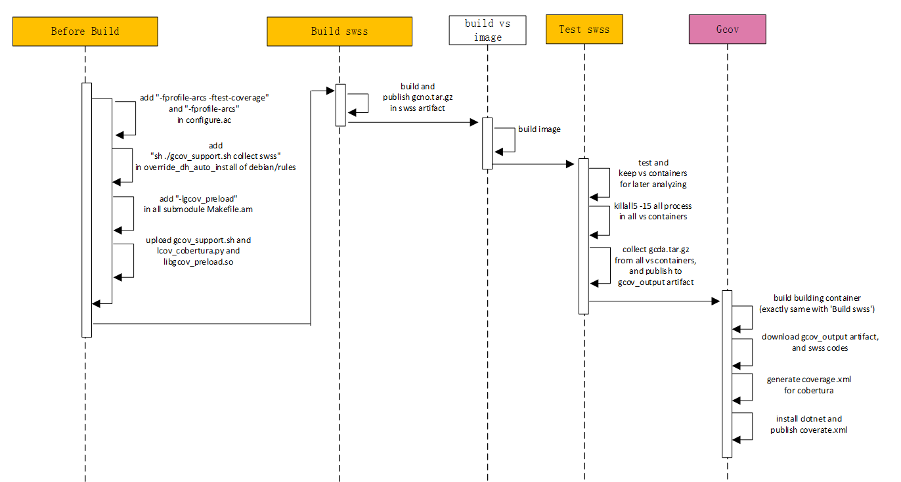

# [Code Coverage Rate HLD] Update code coverage rate.md
code-coverage-rate-hld

# About this Document
This document provides the high level design for code coverage rate testing.

# Problem Definition
Code coverage rate is the term used in code testing in Ruijie commercial switch for years. It is the rate of the number of code lines has been executed divied by the number of total code lines in switch operating system. We reuse this term in SONiC code testing and create some related tools for SONiC code testing.

# Ruijie's Solution
Ruijie use the Gcov tools to measure the code coverage rate in its commercial switch and white box switch. We create the Linux scripts for Gcov compiling, Gcov data collect, and Gcov data show functions for SONiC. A GCOV\_ENABLE compiling tag is provided for SONiC code project. And we integrate all these Gcov functions into Jenkins CICD system. Our solution is a complete tool set for code coverage rate for SONiC. 

# 1. Introduction to GCOV 

## 1.1. What-is-GCOV
Gcov is one of the commonly-used tools capable of testing code coverage. It is usually released together with GCC, used in analyzing programs to help create a more efficient and fast running program and discover the untested codes. Every developer can apply gcov as a profiling tool to optimize where your codes are defect by checking the two basic statistics collected from gcov reports: 
1)What codes have been executed. 
2)How many times a code line has been executed. 

These two statistics can also be fully exploited by a tester or developer to dramatically reduce the efforts putting into the test cases' improvement. This improvement then can benefit achieving a prospective code coverage rate. It is noted that the gcov tool can only be used in connect with gcc when managing codes. 

## 1.2. Main workflow
The workflow of generating a gcov report to the dfd\_debug in sonic-platform-modules-ruijie will be taken as an example briefly described below. 
Two special gcc options: -frofile-arcs -ftest-coverage are firstly added in compiler as shown in figure 1.1. These two options tell the compiler to generate some additional information required by gcov. 

1)-ftest-coverage: This option helps to generate the .gcno notes file sharing the same name with each source file. it also saves the information required by rebuilding the basic block graphs and the source line numbers of blocks. 
2)-fprofile-arcs: This option helps to generate the .gcda count data files when a compiled program is running. Same as .gcno files, an individual .gcda file is generated for each source file. This gcc option also saves the information about arc transition counts, value profile counts and some summary. 

 
__Figure 1.1: Additional options for gcc compiler__. 
After the special gcc options are added to the compiler, the ruijie BSP deb which contains the dfd\_debug process can be built. Considering the dfd\_debug is a common app, the device type can be neglected as shown in figure 1.2. 

 
__Figure 1.2: make ruijie BSP__. 

Successful building will create additional .gcno files in company with the object files, as it can be seen from figure 1.3. It should be mentioned if the source files keep unchanged, the .gcno files they produce will also remain the same. 

 
__Figure 1.3 .gcno files__. 

The executable file will next be copied to the /usr/local/bin dir in device under test, and executed directly. This step will create the .gcda file within the dir of /sonic/platform/Broadcom/sonic-platform-modules-ruijie/common/app/dev\_util/tmp in running environment. It is obvious that the path of this dir is totally in consistent with the path where the .gcno file is generated. Therefore it indicates .gcno files and .gcda files should be in the same dir when generating gcov reports. 

When the .gcda files are collected from the running environment, and sent to the path where the corresponding gcno files exist, the gcov command can be run against the source file and generate the \*.c.gcov file which includes the coverate informations details: 
gcov dfd\_debug.c --> dfd\_debug.c.gcov 

While a better option is to apply lcov tool to create a html-formed report. There are two main advantages to use lcov: 
1) The html-based report provides a better user-friendly view. All coverage data can be access by a simple web browser. 
2) For a large project, the coverage data would be huge and comprehensive. The lcov can generate a merged report which includes all submodules and their coverage data in three levels: the directory level, the file level and the source code level. 

The steps to generate a html report by lcov are listed below: 
In the dir where the gcda file exists: 
1) run "lcov -c -d .test.info" 
This command grabs all the coverage data into an info file which contains the coverage information about one or multiple source files. 
2) run "genhtml -o test\_report/test.info" 

This command translates the info file and generate a html-based coverage report, then a web browser will be available to check the report. As illustrated in figure 1.4, 
the blue bars cover the codes that have been executed, and the number marked at the beginning of each line indicates how many times this code line has been executed. While the red bars cover the code lines not executed. 

 
__Figure 1.4 Coverage details for a source file__. 

# 2. Basic workflow for SONiC Coverage Testing
In order that a SONiC image can be complied with gcov option and a corresponding gcov report can be generated as easily as possible, a script named gcov\_support.sh will be added to sonic-buildimage repository. The main purpose of adding this script is to help the users to output a gcov-versioned SONiC image and generate coverage reports in a very simple way as shown in figure 2.1. 

The following steps are required currently to generate a complete report for source codes in SONiC: 
        Add option "ENABLE_GCOV=y" when running a make command to compile a SONiC image 
	Upgrade the device under test with the gcov-versioned SONiC image and run the test suite 
	Collect the .gcno files in compiling environment and the .gcda files in running environment 
	Copy the gcov-required files (.gcno and .gcda) and the gcov_support.sh script into a local linux environment 
	Execute the generate keyword in the script to create the complete report and check with a web browser. 

 
__Figure 2.1 Workflow to enable gcov in SONiC__. 

## 2.1 Compile to gcov-versioned SONiC image
The option "ENABLE\_GCOV=y" passed to the compiling process will trigger the execution of two keywords in gcov\_support.sh script. This script contains in total 5 keywords as listed in figure 2.2 below. 
 
__Figure 2.2 Usage keywords of gcov\_support.sh__. 

init:This keyword will be merged to "make init" command, which is controlled by ENABLE\_GCOV option Then the execution of "make init" will first download and update the source codes in repository, and next run "init" keyword in script to apply the patches to all modules in SONiC. These patches are saved in a source address (http server) beforehand, and each is responsible for a particular module to modify the gcc compiling option By doing this, each module can be compiled to their gcov-versioned object files and the additional .gcno files. 

collect .gcno: This keyword will be triggered to run after all .deb files are built, which is also controlled by ENABLE\_GCOV option. By running "collect .gcno" keyword, all .gcno files generated during compiling will be collected and packed to a gcno.tar.gz file saved inside the target folder.  

## 2.2 Collect .gcda files
When the above compiling process is complete, a gcov-versioned SONiC image sonic\_xxx.bin("xxx" represents the platform being configured) will be created, and it can be used to update a device under test to generate the required .gcda files. According to the modules they belong to, the .gcda files will be temporarily saved in two directory: 
The .gcda files which are generated by processes in user space are saved in the root directory of the device under test. Besides, each .gcda file has a save path the same as that for the corresponding object file in the compiling environment. 

The .gcda file which are generated by kernel modules are saved in the directory of /sys/kernel/debug/gcov/sonic. Similarly, the path from /sonic is the same as that for the corresponding object file in the compiling environment. One important feature which should be mentioned is the .gcda files saved inside the system's kernel directory have no data displayed. They should be copied to the root directory alongside with that generated in user space. So that these kernel-related .gcda files can display their saved information and be used normally. 

To collect the .gcda files after running the test suite, users can find the gcov\_support.sh script in the system's directory of /usr/local/bin, and then run the "collect .gcda" keyword of the script as shown in figure 2.2 to do the collecting job and output gcda.tar.gz file.  

## 2.3 Generate the coverage report
gcno.tar.gz and gcda.tar.gz are the two basic files required to generate an accessible coverage report. As it can be seen from figure 2.1, the third step is to send these two compressed files into a local Linux Ubuntu environment. There exists two situations: 

If the local environment contains the sonic-buildimage repository, then the two compressed files should be sent to where the sonic folder resides, as shown in figure 2.3. 
Then the user can enter the sonic folder and run: 

./gcov\_support.sh generate [all | submodule\_name] 
"all" keyword represents this command will generate all modules' coverage reports and a merged report. While "submodule_name" keywords indicates the user can select one particular module to generate the coverage report.  

 
__Figure 2.3 The goal directory of gcov-required files__. 

If the local environment is clean and does not contain the sonic-buildimage repository, then the user can create a new directory named sonic, copy the script to sonic folder and then run: 
./gcov\_support.sh generate all 
to generate the overall report. 

It should be notice that the info file created by lcov command records the detail path of the source files, which can be seen in figure 2.5. If in practice the source files do not exist in the directory the info file indicates, then the generated report cannot presents the detail execution information of the source codes. Only the coverage percentage will be given.  
 
__Figure 2.4 run script in sonic folder__. 

 
__Figure 2.5 Source file path recorded in info files__. 

## 2.4 Check the coverage report
Figure 2.6 shows that the coverage reports will be saved under /sonic/gcov\_output directory. 

 
__Figure 2.6 Contents in gcov\_output__. 

The output includes: 
info folder: save info files for all modules according to their generated paths 
html folder: save gcov html report for all modules according to their generated paths 
AllMergeReport: save the merged overall report which contains all coverage information 
info\_err\_list:record the modules which failed to generate the info files 
gcda\_dir\_list.txt:record the directories of all .gcda files 
The merged overall report can be checked from index.html under AllMergeReport dir by a web browser. 

 
__Figure 2.7 Contents of AllMergeReport__. 
 
__Figure 2.8 Overall coverage report__. 

# 3. Modules already available for gcov
  sonic-isc-dhcp 
  sonic-libteam 
  sonic-lldp 
  sonic-frr 
  igb 
  iproute2 
  python3 
  mpdecimal 
  sonic-linux-kernel 
  sonic-platform-modules-ruijie(ruijie-BSP) 
# 4. Safety instruction
The gcov support for SONiC totally depends on the open-source tools -- gcov/lcov. Hence the modification towards the sonic project is only limited to the compiling options of gcc in order that the additional gcov-required files (.gcno and .gcda) can be generated during compiling. This modification will not have any influence on other sections of the compiling process.  

When a source file is compiled with the gcov compiling options, each executable line in this source file will be followed by a new-added piece of code wihch updates coverage statistics. Gcov realizes this process by adding stubs when generating assembly files. Each stub point will be inserted into 3 to 4 new assembly statements. These statements are directly added to the .s files. Then the assembly files can be assembled to the object files and the executable file. After doing this, when the executable file is running, the stubs added during compiling will collect the execution information. The statistical approach for these stubs is very simple, they are just variables in the memory and record the execution times for each code line. Therefore in the practical running environment, the performance impact brought by generating .gcda files can be ignored. The user can also hardly feel the difference.  

# 5. Coverage data for python script
The coverage report for a python script should be generated in the running environment by applying a tool called coverage. The steps are listed below: 

Install the coverage tool in the device under test: 
pip install coverage 
Run a python script with coverage tool instead of direct execution: 
coverage run -a /usr/local/bin/fancontrol.py start --> python fancontrol.py start 
Check the coverage result: 
coverage report 
Generate html-based report 
coverage html 

 
__Figure 5.1 Coverage report for python script__. 
The analysis to the coverage data collection of python scripts is till in progress. The elimination of the user's awareness to the coverage tool is our next step. 

