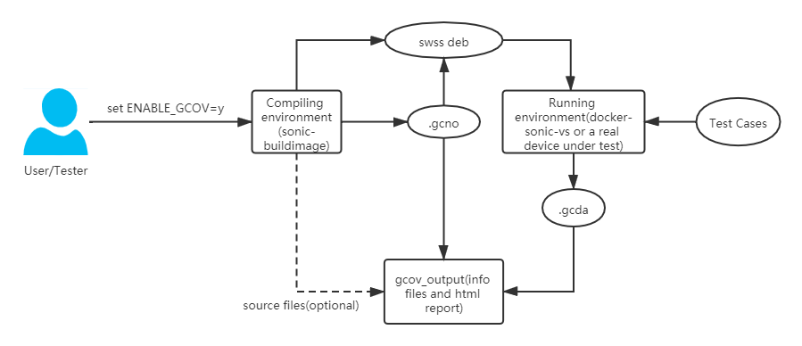
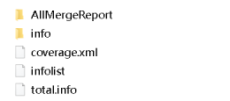

# Code Coverage Rate in SONiC
# High Level Design Document
#### Rev 0.1

# Table of Contents
  * [Revision](#revision)
  * [About this Document](#about-this-document)
  * [Problem Definition](#problem-definition)
  * [Solution](#solution)
  * [1 Introductions](#1-introductions)
    * [1.1 What-is-GCOV](#11-what-is-gcov)
    * [1.2 Main workflow](#12-main-workflow)
      * [1.2.1 User space modules](#121-user-space-modules)
      * [1.2.2 kernel modules](#122-kernel-modules)
  * [2 Design](#2-Design)
    * [2.1 New Configuration Parameters](#21-new-configuration-parameters)
    * [2.2 Compile to gcov-versioned debian packet](#22-compile-to-gcov-versioned-debian-packet)
    * [2.3 Collect gcno files](#23-collect-gcno-files)
    * [2.4 Collect gcda files](#24-collect-gcda-files)
    * [2.5 Generation of gcov report](#25-generation-of-gcov-report)
    * [2.6 Check the coverage report](#26-check-the-coverage-report)
  * [3 Safety instruction](#3-safety-instruction)
  * [4 Coverage data for python script](#4-coverage-data-for-python-script)

# Revision

| Rev |     Date    |       Author       | Change Description          |
|:---:|:-----------:|:-------------------------|:----------------------|
| 0.1 |  16/4/2019  |   Zhengnan Cheng   | Initial version       |

# About this Document
This document provides the high level design for code coverage rate testing.

# Problem Definition
Code coverage rate is a term that describe the rate of the number of code lines has been executed divide by the number of total code lines in switch operating system. We reuse this term in SONiC code testing and create some related tools for SONiC code testing.

# Solution
Use the Gcov tools to measure the code coverage rate in its commercial switch and white box switch. Create the Linux scripts for Gcov compiling, Gcov data collect, and Gcov report generation for SONiC. A ENABLE\_GCOV compiling tag is provided for SONiC code project. And we integrate all these Gcov functions into Jenkins CICD system. Our solution is a complete tool set for code coverage rate for SONiC. 

# 1. Introductions

## 1.1 What-is-GCOV
Gcov is one of the commonly-used tools capable of testing code coverage. It is usually released together with GCC, used in analyzing programs to help create a more efficient and fast running program and discover the untested codes. Every developer can apply gcov as a profiling tool to optimize where your codes are defect by checking the two basic statistics collected from gcov reports:<br>
- What codes have been executed.<br>
- How many times a code line has been executed.<br>

## 1.2 Main workflow

### 1.2.1 User space modules
Twp basic compiling flag for gcov:
- -ftest-coverage: This option helps to generate the .gcno notes file sharing the same name with each source file. The .gcno file saves the information required by rebuilding the basic block graphs and the source line numbers of blocks.<br>
- -fprofile-arcs: This option helps to generate the .gcda count data files when a compiled program is running. Same as .gcno files, an individual .gcda file is generated for each source file. The gcda file saves the information about arc transition counts, value profile counts and some summary.<br>

<br>
__Figure 1.1: Additional options for gcc compiler__.<br>

Successful building will create additional .gcno files in company with the object files, as it can be seen from figure 1.2. 

<br>
__Figure 1.2 .gcno files__.<br>

The execution of modules built with gcov options can create the .gcda file in running environment. gcno files and gcda files can then be put together using gcov command to generate the required report
- gcov dfd\_debug.c --> dfd\_debug.c.gcov<br>

While a better option is to apply lcov tool to create a html-formed report. There are two main advantages to use lcov:<br>
- The html-based report provides a better user-friendly view. All coverage data can be access by a simple web browser.<br>
- For a large project, the coverage data would be huge and comprehensive. The lcov can generate a merged report which includes all submodules and their coverage data in three levels: the directory level, the file level and the source code level.<br>

<br>
__Figure 1.3 Coverage details for a source file__.<br>

### 1.2.2 kernel modules
For linux kernel version larger than 2.6.31, gcov-based compiling can be directly enabled by configuring the kernel with the following macros:<br>
```
CONFIG_GCOV_KERNEL=y
CONFIG_GCOV_PROFILE_ALL=y
CONFIG_GCOV_FORMAT_AUTODETECT=y
# CONFIG_GCOV_FORMAT_3_4 is not set
# CONFIG_GCOV_FORMAT_4_7 is not set
```

# 2. Design
In order that a SONiC image can be complied with gcov option and a corresponding gcov report can be generated as easily as possible, a script named gcov\_support.sh will be added. Currently this script will be added to sonic-swss repo to provide help for swss's gcno and gcda files colletion and report generating in a way as shown in figure 2.1.<br>

<br>
__Figure 2.1 Workflow to enable gcov in SONiC__.<br>

The main design workflow is shown below:
<br>
__Figure 2.2 Main design workflow__.<br>

## 2.1 New Configuration Parameters
ENABLE_GCOV as a new configuration parameter is added to SONiC build system. The default value is "n". When a gcov building is required, this parameter should be set to "y"
```
#gcov compiling option
ENABLE_GCOV=n
export ENABLE_GCOV
```
This parameter will control whether a specify module should be compiled with gcov options introduced in 1.2.1

## 2.2 Compile to gcov-versioned debian packet
The configure script for swss package should be modified to merge gcov compiling options.
```
dnl if the user has specified any CFLAGS, override our settings
if test "$enable_gcov" = "yes"; then
    CFLAGS_COMMON+=" -fprofile-arcs -ftest-coverage"
    AC_SUBST(CFLAGS_COMMON)

    LDFLAGS+=" -fprofile-arcs"
    AC_SUBST(LDFLAGS)
fi
...
AC_ARG_ENABLE([gcov], AS_HELP_STRING([--enable-gcov], [enable coverage test]))
AS_IF([test "x${enable_gcov}" = "xyes" ], AC_MSG_RESULT([yes]), AC_MSG_RESULT([no]))
AM_CONDITIONAL([ENABLE_GCOV],[test "x${enable_gcov}" = "xyes"])
```
Besides the compiling flag, a dynamic library called libgcov_preload.so is also be introduced in this repo and added as a link to all submodules' Makefile.am. This dynamic library will help all user processes handle killing signals and call exit() to successfully generate gcda files.
```
e.g.
tlm_teamd_LDADD = -lhiredis -lswsscommon -lteamdctl $(JANSSON_LIBS) -lgcov_preload
```

## 2.3 Collect gcno files
The keyword "collect" in gcov_support.sh which has been added to swss repo will be used to collect gcno files, and it will be excuted during the "install" stage of the debian package building:
- All script keywords usage:
```
root@5c5e8c570c0f:/tmp/swss_gcov/src/sonic-swss# ./gcov_support.sh
Usage:
 collect               collect .gcno files based on module
 collect_gcda          collect .gcda files
 generate              generate gcov report in html form (all or submodule_name)
 tar_output            tar gcov_output forder
 merge_container_info  merge info files from different container
 set_environment       set environment ready for report generating in containers
```
- Adjustment towards the debian building rules
```
override_dh_auto_install:
	dh_auto_install --destdir=debian/swss

	mkdir -p debian/swss/tmp/gcov

	sh ./gcov_support.sh collect
```
After the "collect" operation, a compressed gcno_swss.tar.gz is sent to /tmp/gcov inside the debian package.

## 2.4 Collect gcda files
 After the regular tests to the swss module, keyword 'collect_gcda' will be executed inside the running containers to collect the gcda files and pack them into /tmp/gcov together with gcno_swss.tar.gz. This collection step will be included during the following 'set_environment' stage. Besides the collection of gcda files, 'set_environment' stage will prepare the environment ready for report generating and publish it into artifacts.
```
./tests/gcov_support.sh set_environment $(Build.ArtifactStagingDirectory)
```
It is worth noting that all vs containers set up for testing wil be keep active inside the environment, so that a killall command can be called in every containers to produce gcda files which can be collect during this stage.
```
sudo py.test -v --force-flaky --junitxml=tr.xml --keeptb --imgname=docker-sonic-vs:$(Build.DefinitionName).$(Build.BuildNumber)
``` 

## 2.5 Generation of gcov info files
In order to generate an accessible coverage report, gcno files, gcda files and the corresponding source codes are the basic elements required. The previous 'set_environment' stage prepares the gcno and gcda files by obtaining the report-generating environment(the directory of /tmp/gcov) from every containers running test cases. While this generation stage will set up a new container in order to collect source codes and use the report-generating environment to create the gcov report. The following keywords will be used during generation stage:
```
./gcov_support.sh generate
./gcov_support.sh merge_container_info $(Build.ArtifactStagingDirectory)
```
After report generation, a folder named 'gcov_output' will be posed and published as gcov_info to the artifact.
```
- publish: $(Build.ArtifactStagingDirectory)/gcov_output
  artifact: gcov_info
  displayName: "Archive gcov info"
  condition: always()
```
Then the overall summary report can be accessed through the 'Code Coverage' tab in the Azure Pipeline platform.

## 2.6 Check the coverage report
The overall summary report coverage.xml created by lcov_cobertura.py is saved under $(Build.ArtifactStagingDirectory)/gcov_output/AllMergeReport, and this xml file can be checked by Cobertura and display coverage information in the platform after a pull request. 
Figure 2.3 shows the contents under gcov_output folder. It is pulished as gcov_info in the artifacts<br>

<br>
__Figure 2.3 Contents in gcov\_output__.<br>

The output includes:<br>
- info: save info files for all modules<br>
- AllMergeReport: save the merged overall report which contains all coverage information<br>
- coverage.xml: the summary report in xml form originated from index.html in AllMergeReport<br>
- infolist: an info file list<br>
- total.info: an overall info file used to produced the summary report<br>
Figure 2.4 to 2.6 shows how the coverage information can be checked by anyone who just creates a pull request. 

<br>
__Figure 2.4 Code Coverage tab in pipeline platform__.<br>
<br>
__Figure 2.5 summary coverage information__.<br>
<br>
__Figure 2.6 source code details__.<br>

# 3. Safety instruction
The gcov support for SONiC totally depends on the open-source tools -- gcov/lcov. Hence the modification towards the sonic project is only limited to the compiling options of gcc in order that the additional gcov-required files (.gcno and .gcda) can be generated during compiling. This modification will not have any influence on other sections of the compiling process.<br> 

- When a source file is compiled with the gcov compiling options, each executable line in this source file will be followed by a new-added piece of code wihch updates coverage statistics. Gcov realizes this process by adding stubs when generating assembly files. Each stub point will be inserted into 3 to 4 new assembly statements. These statements are directly added to the .s files. Then the assembly files can be assembled to the object files and the executable file. After doing this, when the executable file is running, the stubs added during compiling will collect the execution information. The statistical approach for these stubs is very simple, they are just variables in the memory and record the execution times for each code line. Therefore in the practical running environment, the performance impact brought by generating .gcda files can be ignored. The user can also hardly feel the difference.<br> 

# 4. Coverage data for python script
The coverage report for a python script can be generated in the running environment by applying a tool called coverage. The steps are listed below:<br>

- Install the coverage tool in the device under test:<br>
```
pip install coverage<br>
```
Run a python script with coverage tool instead of direct execution:<br>
```
coverage run -a /usr/local/bin/fancontrol.py start --> python fancontrol.py start<br>
```
Check the coverage result:<br>
```
coverage report<br>
```
Generate html-based report:<br>
```
coverage html<br>
```

<br>
__Figure 4.1 Coverage report for python script__.<br>
The analysis to the coverage data collection of python scripts is till in progress. The elimination of the user's awareness to the coverage tool is our next step.<br>

