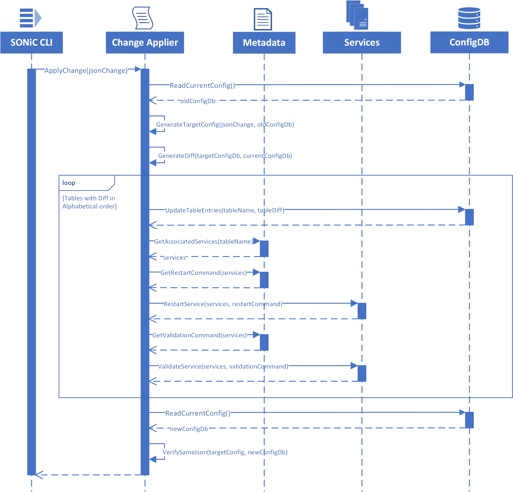

# JSON Change Application

# High Level Design Document

#### Rev 0.1

# Table of Contents
- [Table of Contents](#table-of-contents)
- [List of Tables](#list-of-tables)
- [Revision](#revision)
- [About this Manual](#about-this-manual)
- [Scope](#scope)
- [Definition/Abbreviation](#definition-abbreviation)
    + [Table 1: Abbreviations](#table-1--abbreviations)
- [1 Feature Overview](#1-feature-overview)
  * [1.1 Requirements](#11-requirements)
    + [1.1.1 Functional Requirements](#111-functional-requirements)
    + [1.1.2 Configuration and Management Requirements](#112-configuration-and-management-requirements)
    + [1.1.3 Scalability Requirements](#113-scalability-requirements)
    + [1.1.4 Warm Boot Requirements](#114-warm-boot-requirements)
  * [1.2 Design Overview](#12-design-overview)
    + [1.2.1 Basic Approach](#121-basic-approach)
- [2 Functionality](#2-functionality)
  * [2.1 Target Deployment Use Cases](#21-target-deployment-use-cases)
  * [2.2 Functional Description](#22-functional-description)
    + [Stage-1 Generating Diff from JsonChange](#stage-1-generating-diff-from-jsonchange)
    + [Stage-2 Update Table by Table in Alphabetical order](#stage-2-update-table-by-table-in-alphabetical-order)
    + [Stage-3 Post-update Validation](#stage-3-post-update-validation)
      - [Fail-safe Action](#fail-safe-action)
      - [Logging](#logging)
- [3 Design](#3-design)
  * [3.1 Overview](#31-overview)
    + [3.1.1 SONiC CLI](#311-sonic-cli)
    + [3.1.2 Change Applier](#312-change-applier)
    + [3.1.3 Metadata](#313-metadata)
    + [3.1.4 Services](#314-services)
    + [3.1.5 ConfigDB](#315-configdb)
  * [3.2 User Interface](#32-user-interface)
    + [3.2.1 Data Models](#321-data-models)
      - [3.2.1.1 JsonChange](#3211-jsonchange)
      - [3.2.1.2 Metadata](#3212-metadata)
    + [3.2.2 CLI](#322-cli)
- [4 Flow Diagrams](#4-flow-diagrams)
- [5 Error Handling](#5-error-handling)
- [6 Serviceability and Debug](#6-serviceability-and-debug)
- [7 Warm Boot Support](#7-warm-boot-support)
- [8 Scalability](#8-scalability)
- [9 Unit Tests](#9-unit-tests)

# List of Tables
[Table 1: Abbreviations](#table-1-abbreviations)

# Revision

| Rev | Date        | Author             | Change Description  |
|:---:|:-----------:|:------------------:|---------------------|
| 0.1  | 03/01/2021 | Mohamed Ghoneim    | Initial version     |

# About this Manual
This document provides a detailed description on the algorithm to implement JsonChange application described in [SONiC Generic Configuration Update and Rollback - HLD](SONiC_Generic_Config_Update_and_Rollback_Design.md#3115-change-applier)

# Scope
This document describes the algorithm of patch ordering described in [SONiC Generic Configuration Update and Rollback - HLD](SONiC_Generic_Config_Update_and_Rollback_Design.md#3115-change-applier) using YANG models. This document provides minor implementation details about the proposed solutions.

# Definition/Abbreviation

### Table 1: Abbreviations
| **Term**            | **Meaning**                |
| ------------------- | -------------------------- |
| JsonPatch           | JSON document structure for expressing a sequence of operations to apply to a JavaScript Object Notation  (JSON) document. Check [JSON Patch (RFC6902)](https://tools.ietf.org/html/rfc6902). |
| JsonChange          | JsonChange is a JsonPatch in terms of the final outcome of the update. Ordering of JsonChange updates will not follow the operations order within a JsonPatch, but will update the JSON file in any arbitrary order. Check [JsonChange](SONiC_Generic_Config_Update_and_Rollback_Design.md#31141-jsonchange) for details. |

# 1 Feature Overview
Currently there is no unified interface on top of ConfigDB for updating table entries and making sure the changes are absorbed correctly by corresponding applications. Today there is 2 different ways SONiC applications absorb the configs.

The first group of SONiC applications subscribe to ConfigDB change events, and absorb the changes automatically in parallel fashion. Since these applications absorb the changes in parallel of the ConfigDB updates, there is no easy way to verify if they absorbed the ConfigDB changes correctly.

The second group of SONiC applications store its configuration in ConfigDB but do not subscribe to the ConfigDB change events. So any changes to their corresponding table entries in ConfigDB are not processed by the application immediately. In order to apply the configuration changes, corresponding service needs to be restarted. See below table for an example.

```
{
  "SYSLOG_SERVER": ["rsyslog"],
  "DHCP_SERVER": ["dhcp_relay"],
  "NTP_SERVER": ["ntp-config.service", "ntp.service"],
  "BGP_MONITORS": ["bgp"],
  "BUFFER_PROFILE": ["swss"],
  "RESTAPI": ["restapi"]
}
```

An interface was introduced in [SONiC_Generic_Config_Update_and_Rollback_Design.md](SONiC_Generic_Config_Update_and_Rollback_Design.md#3115-change-applier) to address this issue. The interface will take care of:
- Updating ConfigDB entries
- Verifying changes are absorbed correctly by SONiC applications

In this design document, we are going to discuss an approach to implement this interface.

## 1.1 Requirements

### 1.1.1 Functional Requirements
- The input is a JsonChange and is described in [JsonChange](SONiC_Generic_Config_Update_and_Rollback_Design.md#31141-jsonchange).
- The API has no return, and rely on raised errors to check for any problems while execution.
- As per the definition of [JsonChange](SONiC_Generic_Config_Update_and_Rollback_Design.md#31141-jsonchange) ordering of the update is arbitrary and can be decided by the implementation.
- It is assumed that the configuration lock was acquired before applying any changes to ConfigDB.

### 1.1.2 Configuration and Management Requirements
N/A

### 1.1.3 Scalability Requirements
N/A

### 1.1.4 Warm Boot Requirements
N/A

## 1.2 Design Overview

### 1.2.1 Basic Approach
From [SONiC Generic Configuration Update and Rollback - HLD](SONiC_Generic_Config_Update_and_Rollback_Design.md#3115-change-applier), this is the target interface:

```python
void apply-change(JsonChange jsonChange)
```

|aspect      |item                   |description
|------------|-----------------------|-----------
|inputs      |JsonChange             | It represents the changes that needs to applied to the device running config, described in [SONiC_Generic_Config_Update_and_Rollback_Design](SONiC_Generic_Config_Update_and_Rollback_Design.md#31141-jsonchange).
|outputs     |None                   | 
|errors      |malformedChangeError   | Will be raised if the input JsonChange is not valid according to [SONiC_Generic_Config_Update_and_Rollback_Design](SONiC_Generic_Config_Update_and_Rollback_Design.md#31141-jsonchange).
|            |other errors           | Check [SONiC_Generic_Config_Update_and_Rollback_Design](SONiC_Generic_Config_Update_and_Rollback_Design.md#31141-apply-change) for exact list of errors to expect.
|side-effects|updating running-config| This operation will cause changes to the running-config according to the input JsonChange.
|assumptions |running-config locked| The implementor of this contract will interact with ConfigDB to updating the running-config, it is assumed the running-config is locked for changes for the lifespan of the operation.

The important constraint in the above interface is the JsonChange, where ordering of applying the modifications is arbitrary.

Let's take an example, assume the following is the running config:
```json
{
    "DEVICE_NEIGHBOR": {
        "Ethernet8": {
            "name": "Servers1",
            "port": "eth0"
        },
        "Ethernet80": {
            "name": "Servers19",
            "port": "eth0"
        }
    },
    "DHCP_SERVER": {
        "192.0.0.1": {},
        "192.0.0.2": {}
    },
}
```

And the JsonChange is represented by the the following JsonPatch operations:
```json
[
    { "op": "remove", "path": "/DHCP_SERVER/192.0.0.2" },
    { "op": "add", "path": "/DHCP_SERVER/192.0.0.3", "value": {} },
    { "op": "replace", "path": "/DEVICE_NEIGHBOR/Ethernet8/port", "value": "eth1" },
    { "op": "replace", "path": "/DEVICE_NEIGHBOR/Ethernet80", "value": { "name": "Servers19", "port": "eth1" } }
]
```

Then target config after applying JsonChange will be:
```json
{
    "DEVICE_NEIGHBOR": {
        "Ethernet8": {
            "name": "Servers1",
            "port": "eth1"
        },
        "Ethernet80": {
            "name": "Servers19",
            "port": "eth1"
        }
    },
    "DHCP_SERVER": {
        "192.0.0.1": {},
        "192.0.0.3": {}
    },
}
```

The diff between target config and running config is:
```diff
 {
     "DEVICE_NEIGHBOR": {
         "Ethernet8": {
             "name": "Servers1",
-            "port": "eth0"
+            "port": "eth1"
         },
         "Ethernet80": {
             "name": "Servers19",
-            "port": "eth0"
+            "port": "eth1"
         }
     },
     "DHCP_SERVER": {
         "192.0.0.1": {},
-        "192.0.0.2": {}
+        "192.0.0.3": {}
     },
 }
```

There can be many ways to fix this config, let's express the modifications as JsonPatch operations for simplicity.

The update can execute the following steps:
```json
[
    { "op": "replace", "path": "/DEVICE_NEIGHBOR/Ethernet8/port", "value": "eth1" },
    { "op": "replace", "path": "/DEVICE_NEIGHBOR/Ethernet80/port", "value": "eth1" },
    { "op": "remove", "path": "/DHCP_SERVER/192.0.0.2" },
    { "op": "add", "path": "/DHCP_SERVER/192.0.0.3", "value": {} }
]
```

Or it can be updated using the following steps:
```json
    { "op": "remove", "path": "/DHCP_SERVER/192.0.0.2" },
    { "op": "replace", "path": "/DEVICE_NEIGHBOR/Ethernet8/port", "value": "eth1" },
    { "op": "replace", "path": "/DEVICE_NEIGHBOR/Ethernet80/port", "value": "eth1" },
    { "op": "add", "path": "/DHCP_SERVER/192.0.0.3", "value": {} },
```

Applying JsonChange is all about the running config being converted to the target config, the steps to update can be arbitrary and are decided by the implementor of the `apply-change` interface.

Our current design documents will use the "Table" as the main granular element of update. We will update "Table" by "Table" in alphabetical order. Each table update will take care of updating table entries in ConfigDB, restarting services if needed and verifying services have absorbed

# 2 Functionality

## 2.1 Target Deployment Use Cases

This is going to be part of the `apply-patch` functionality described in [SONiC Generic Configuration Update and Rollback - HLD](SONiC_Generic_Config_Update_and_Rollback_Design.md)

## 2.2 Functional Description

The `apply-change` operation can be broadly classified into the following steps

### Stage-1 Generating Diff from JsonChange
SONiC current ConfigDB contents can be retrieved in a JSON file format. The JsonChange will be applied to the current config to generate the target config. The diff between target config and current config will be the main focus of the `change-applier`.

### Stage-2 Update Table by Table in Alphabetical order
Table entries will be update using ConfigDBConnector. Service corresponding to each table will restarted if they are not listening to ConfigDB changes. Services corresponding to each table will be verified that they have absorbed the changes correctly.

Continuation to the example in [1.2.1 Basic Approach](#1.2.1-Basic-Approach), the update will do the following:
1. Process tables in alphabetical order which is `DEVICE_NEIGHBOR` and then `DHCP_SERVER`
2. Update table `DEVICE_NEIGHBOR`

    a. Update table entries as such
    ```diff
         "DEVICE_NEIGHBOR": {
             "Ethernet8": {
                 "name": "Servers1",
    -            "port": "eth0"
    +            "port": "eth1"
             },
             "Ethernet80": {
                 "name": "Servers19",
    -            "port": "eth0"
    +            "port": "eth1"
             }
    ```
    b. Restart services associated with `DEVICE_NEIGHBOR` if not listening to ConfigDB changes

    c. Verify services associated with `DEVICE_NEIGHBOR` have absorbed the changes correctly
3. Update table `DHCP_SERVER`

    a. Update table entries as such
    ```diff
     {
         "DHCP_SERVER": {
             "192.0.0.1": {},
    -        "192.0.0.2": {}
    +        "192.0.0.3": {}
         }
     }
    ```
    b. Restart services associated with `DHCP_SERVER` if not listening to ConfigDB changes

    c. Verify services associated with `DHCP_SERVER` have absorbed the changes correctly

### Stage-3 Post-update Validation
The expectations after applying the JsonChange is that there will be no diff.

The verification steps:
1. Get the state of ConfigDB JSON before the update as a JSON object
2. Compare that Target JSON object generated in Stage-1 with current ConfigDB JSON
3. In case of mismatch, just report failure

#### Fail-safe Action

If an error is encountered during the `apply-change` operation, an error is reported and the system DOES NOT take any automatic action.

#### Logging

All the configuration update operations executed are stored in the systemd journal. They are also forwarded to the syslog. By storing the commands in the systemd-journal, the user will be able to search and display them easily at a later point in time.

# 3 Design

## 3.1 Overview


### 3.1.1 SONiC CLI
These are the CLI of SONiC switch to which makes it easy for the users to interact with the system. The CLI command we are interested in is `apply-patch` which will call `apply-change`. For further details check [SONiC_Generic_Config_Update_and_Rollback_Design](SONiC_Generic_Config_Update_and_Rollback_Design.md#311-applypatch).

### 3.1.2 Change Applier
This component provides an implementation of the interface `apply-change` discussed in [SONiC_Generic_Config_Update_and_Rollback_Design](SONiC_Generic_Config_Update_and_Rollback_Design.md#31151-apply-change).

### 3.1.3 Metadata
Metadata component contains info about which services correspond to which table. For each service it contains the CLI command used to manually restart the service, it also contains the CLI command used to verify the service has absorbed the change correctly.

### 3.1.4 Services
These are the SONiC services such as rsyslog, dhcp_relay, ntp-config.service, ntp.service, bgp, swss, restapi..etc.

The 3 dots (`...`) in `ValidateService(services, validationCommand, ...)` indicate other parameters can be passed to help with detailed validation such as ConfigDB as JSON before and after the update.

### 3.1.5 ConfigDB
SONiC is managing configuration in a single source of truth - a redisDB instance that we refer as ConfigDB. Applications subscribe to ConfigDB and generate their running configuration correspondingly.

For further details on the ConfigDB, check [SONiC Configuration Database Manual](https://github.com/sonic-net/SONiC/wiki/Configuration).

## 3.2 User Interface
N/A

### 3.2.1 Data Models
#### 3.2.1.1 JsonChange
check [JsonChange](SONiC_Generic_Config_Update_and_Rollback_Design.md#31141-jsonchange)
#### 3.2.1.2 Metadata

A new file will be added to the system which will contain the `apply-change` metadata.

The format of the file would be:
```
{
  "tables: {
    "<TABLE-NAME>": {
        "services-to-validate": ["<SERVICE1>", "<SERVICE2>" ...]
    },
    .
    .
    .
  },
  "services": {
    "<SERVICE-NAME>": {
      "validate-commands": "<CLI-COMMAND1>, <CLI-COMMAND2>, ..."
    },
    .
    .
    .
  }
}
```

The document contain info describing for each table the services that needs restarting and the services that do not need restarting. It also describes for each service the command needed to manually restart the service, and the command for validating the service have absorbed ConfigDB changes successfully.

- tables - contains all the information need for the tables.
- TABLE-NAME - The table name corresponding to tables from ConfigDB, will contain all the tables metadata. There can be multiple different TABLE-NAME keys/dictionaries.
- services-to-restart - The list of services to restart after updating the current table. There can be multiple services to restart.
- services-to-validate - The list of services to that needs validation after an update, it will be mainly the services that absorb changes automatically. There can be multiple services to validate.
- services - contains all the information needed for the services.
- SERVICE-NAME - The service name corresponding to services running on SONiC box, will contain all the services metadata. There can be multiple different SERVICE-NAME keys/dictionaries.
- restart-command - The CLI command used to restart the corresponding service.
- validate-commands - Multiple CLI commands used to validate the service has absorbed the change successfully. The validate commands can expect the config before and after the update to passed to the CLI commands for detailed validation if needed.

### 3.2.2 CLI
N/A

# 4 Flow Diagrams
N/A

# 5 Error Handling

Check [SONiC_Generic_Config_Update_and_Rollback_Design](SONiC_Generic_Config_Update_and_Rollback_Design.md#3115-change-applier) for formal list of errors defined for the interface `apply-change`.

# 6 Serviceability and Debug
All commands logs are stored in systemd-journal and syslog.

# 7 Warm Boot Support
N/A

# 8 Scalability
N/A

# 9 Unit Tests
| Test Case | Description |
| --------- | ----------- |
| 1         | Add a new table. |
| 2         | Remove an existing table. |
| 3         | Modify values of an existing table entry. |
| 4         | Modify value of an existing item of an array value. |
| 5         | Add a new item to an array value. |
| 6         | Remove an item form an array value. |
| 7         | Add a new key to an existing table .|
| 8         | Remove a key from an existing table. |
| 9         | Replace a mandatory item e.g. type under ACL_TABLE. |
| 10        | Remove an item that has a default value e.g. stage under ACL_TABLE. |
| 11        | Change applier - with sample data & validators that touch all code paths |
