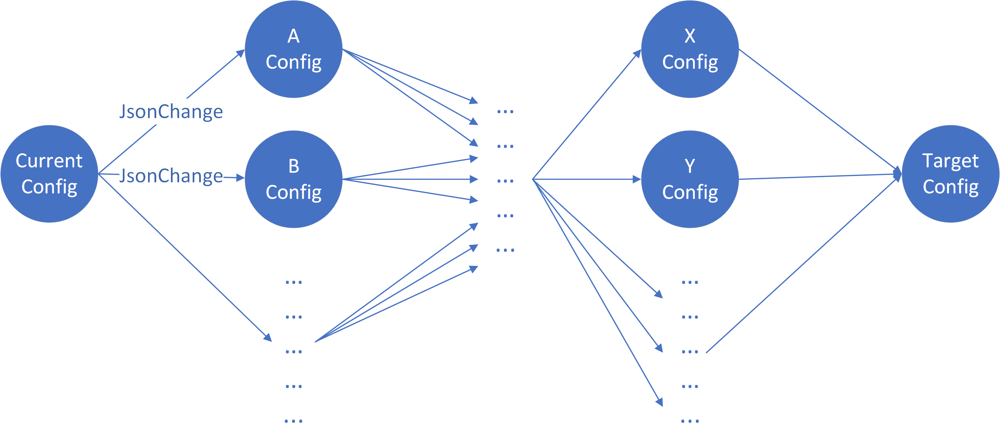
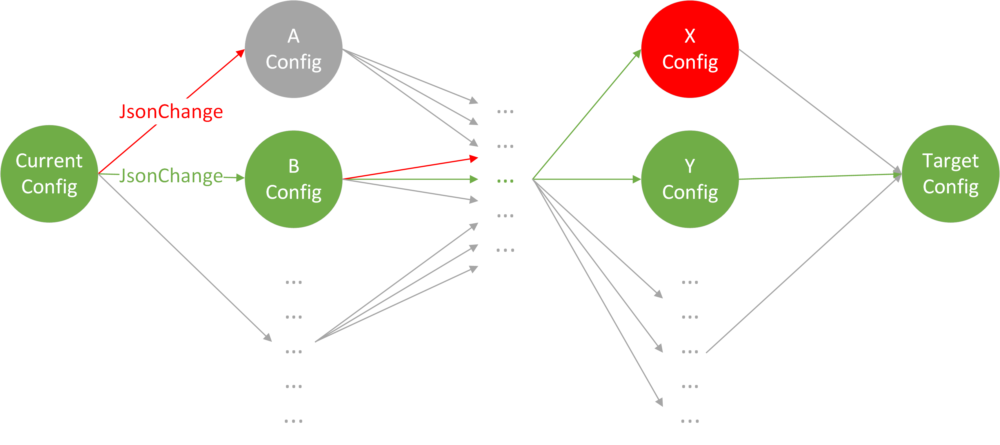

# JSON Patch Ordering using YANG Models

# High Level Design Document

#### Rev 0.1

# Table of Contents
- [Table of Contents](#table-of-contents)
- [List of Tables](#list-of-tables)
- [Revision](#revision)
- [About this Manual](#about-this-manual)
- [Scope](#scope)
- [Definition/Abbreviation](#definition-abbreviation)
    + [Table 1: Abbreviations](#table-1--abbreviations)
- [1 Feature Overview](#1-feature-overview)
  * [1.1 Requirements](#11-requirements)
    + [1.1.1 Functional Requirements](#111-functional-requirements)
    + [1.1.2 Configuration and Management Requirements](#112-configuration-and-management-requirements)
    + [1.1.3 Scalability Requirements](#113-scalability-requirements)
    + [1.1.4 Warm Boot Requirements](#114-warm-boot-requirements)
  * [1.2 Design Overview](#12-design-overview)
    + [1.2.1 Basic Approach](#121-basic-approach)
      - [1.2.1.1 Generating Possible Transitions](#1211-generating-possible-transitions)
      - [1.2.1.2 Validating Config State](#1212-validating-config-state)
- [2 Functionality](#2-functionality)
  * [2.1 Target Deployment Use Cases](#21-target-deployment-use-cases)
  * [2.2 Functional Description](#22-functional-description)
    + [2.2.1 Getting current config](#221-getting-current-config)
    + [2.2.2 Simulating patch application](#222-simulating-patch-application)
    + [2.2.3 Generating all possible moves](#223-generating-all-possible-moves)
      - [2.2.3.1 Generating Low level changes](#2231-generating-low-level-changes)
      - [2.2.3.2 Generating Upper Levels Moves](#2232-generating-upper-levels-moves)
      - [2.2.3.3 Generating Other Moves](#2233-generating-other-moves)
    + [2.2.4 Validating config and move](#224-validating-config-and-move)
- [3 Design](#3-design)
  * [3.1 Overview](#31-overview)
    + [3.1.1 Using YANG Models to Validate Config State](#311-using-yang-models-to-validate-config-state)
    + [3.1.2 Using YANG models to Generate Other Moves](#312-using-yang-models-to-generate-other-moves)
    + [3.1.3 Using YANG models to Host Flags for Move Validation](#313-using-yang-models-to-host-flags-for-move-validation)
      - [3.1.3.1 Extension: create-only](#3131-extension--create-only)
  * [3.2 User Interface](#32-user-interface)
    + [3.2.1 Data Models](#321-data-models)
    + [3.2.2 CLI](#322-cli)
- [4 Flow Diagrams](#4-flow-diagrams)
- [5 Error Handling](#5-error-handling)
- [6 Serviceability and Debug](#6-serviceability-and-debug)
- [7 Warm Boot Support](#7-warm-boot-support)
- [8 Scalability](#8-scalability)
- [9 Unit Tests](#9-unit-tests)
- [Appendix A Examples](#appendix-a-examples)
  * [A.1 Adding a new entry](#a1-adding-a-new-entry)
  * [A.2 Dynamic Port Breakout 1 to 4](#a2-dynamic-port-breakout-1-to-4)

# List of Tables
[Table 1: Abbreviations](#table-1-abbreviations)

# Revision

| Rev | Date        | Author             | Change Description  |
|:---:|:-----------:|:------------------:|---------------------|
| 0.1  | 03/01/2021 | Mohamed Ghoneim    | Initial version     |

# About this Manual
This document provides a detailed description on the algorithm to implement patch ordering described in [SONiC Generic Configuration Update and Rollback - HLD](SONiC_Generic_Config_Update_and_Rollback_Design.md#3114-patch-orderer)

# Scope
This document describes the algorithm of patch ordering described in [SONiC Generic Configuration Update and Rollback - HLD](SONiC_Generic_Config_Update_and_Rollback_Design.md#3114-patch-orderer) using YANG models. This document provides minor implementation details about the proposed solutions.

# Definition/Abbreviation

### Table 1: Abbreviations
| **Term**            | **Meaning**                |
| ------------------- | -------------------------- |
| JsonPatch           | JSON document structure for expressing a sequence of operations to apply to a JavaScript Object Notation  (JSON) document. Check [JSON Patch (RFC6902)](https://tools.ietf.org/html/rfc6902). |

# 1 Feature Overview
Please make sure you have reviewed SONiC Generic Configuration Update and Rollback design document especially [Patch Orderer](SONiC_Generic_Config_Update_and_Rollback_Design.md#3114-patch-orderer).

In this design document, we are going to explore using YANG models to order a given JsonPatch of updates. The idea is to make sure the transitions applied to the configurations all result in valid configs according to [SONiC YANG models](https://github.com/sonic-net/sonic-buildimage/tree/master/src/sonic-yang-models).

YANG models has multiple constrains that can affect ordering (check [YANG 1.1 (RFC7950)](https://tools.ietf.org/html/rfc7950)):
* leafref built-in type
* must statement
* ... other statements

These constrains should be helpful while generating the list of transitions needed.

## 1.1 Requirements

### 1.1.1 Functional Requirements
- The patch of updates should follow a standard notation. The [JSON Patch (RFC6902)](https://tools.ietf.org/html/rfc6902) notation should be used.
- The return of the function is a list of JsonChanges (check [JsonChange](SONiC_Generic_Config_Update_and_Rollback_Design.md#31141-jsonchange)).
- Each application of a JsonChange should move the configuration from a valid state to another valid state.
- A valid state is a config that is valid according to YANG models.
- Each JsonChange change should assume the applier of the change will have no notion of ordering. i.e. ordering of updates is only guaranteed between different JsonChange, within the same JsonChange order of update is not guaranteed.
- It is assumed that the configuration lock was acquired before starting patch ordering.

### 1.1.2 Configuration and Management Requirements
N/A

### 1.1.3 Scalability Requirements
N/A

### 1.1.4 Warm Boot Requirements
N/A

## 1.2 Design Overview

From [SONiC Generic Configuration Update and Rollback - HLD](SONiC_Generic_Config_Update_and_Rollback_Design.md#3114-patch-orderer), this is the target interface:

```python
list<JsonChange> order-patch(JsonPatch jsonPatch)
```

|aspect      |item                 |description
|------------|---------------------|-----------
|inputs      |JsonPatch            | It represents the changes that needs to applied to the device running config, described in [JSON Patch (RFC6902)](https://tools.ietf.org/html/rfc6902).
|outputs     |list&lt;JsonChange&gt;| The list will contain the steps to be followed to apply the input JsonPatch correctly. Each item in the list is assumed to be executed after the previous item, in the order given in the list.
|errors      |malformedPatchError  | Will be raised if the input JsonPatch is not valid according to [JSON Patch (RFC6902)](https://tools.ietf.org/html/rfc6902).
|            |other errors         | Check [SONiC Generic Configuration Update and Rollback - HLD](SONiC_Generic_Config_Update_and_Rollback_Design.md#3114-patch-orderer) for exact list of errors to expect.
|side-effects|None                 |
|assumptions |running-config locked| The implementor of this contract might interact with ConfigDB to get the running-config, it is assumed the running-config is locked for changes for the lifespan of the operation.

The important constraint in the above interface is the JsonChange, where the application of a single JsonChange does not guarantee any ordering. If ordering is needed, multiple JsonChanges should be returned.

This design document is exploring the option to use YANG models validations in order to verify each config state is valid.

To represent this problem as a graph we will consider the following:
- Nodes are configuration states which should be valid according to YANG models
- Edges are the valid JsonChanges which should ignore any command ordering



The problem now is just finding a path between the current config and the target config.  A solution to the above graph might be:



Note:
- Green nodes/edges are valid.
- Red nodes/edges are invalid.
- Grey nodes/edges are not tried.

### 1.2.1 Basic Approach
This problem can be reduced to a [constraint satisfaction problem](https://en.wikipedia.org/wiki/Constraint_satisfaction_problem) which are usually solved by search in particular [backtracking](https://en.wikipedia.org/wiki/Backtracking) or [local search](https://en.wikipedia.org/wiki/Local_search_(constraint_satisfaction)). This means we can have a wide range of algorithms to choose from such as Depth-First Search (DFS), Breadth-First Search (BFS), Dynamic Programming (DP), A*, other search algorithms, greedy approaches, heuristics or a combination of all of these algorithms.

There are at least 2 steps that are needed broadly for any algorithm.

#### 1.2.1.1 Generating Possible Transitions
A transition between config state to another config state will be done through JsonChanges.

Each transition should be validated that it does not contain dependent changes. For example: VLAN_MEMBER can contain a reference to PORT table, in that case VLAN_MEMBER cannot be updated together with PORT table in the same JsonChange.

If generating/validating transitions needs additional explicit flags/configs, these flags/configs should be added to YANG models as extensions.

#### 1.2.1.2 Validating Config State
A config state represents how the config looks like after applying a JsonChange. Validation of config state is simply the validation of the generated config using YANG models.

# 2 Functionality

## 2.1 Target Deployment Use Cases

This is going to be part of the `apply-patch` functionality described in [SONiC Generic Configuration Update and Rollback - HLD](SONiC_Generic_Config_Update_and_Rollback_Design.md)

## 2.2 Functional Description

Let's discuss how a simple DFS solution will look like.
```python
def order-patch(patch):
  current_config = get_current_config()
  target_config = simulate_patch(patch, current_config)
  return dfs(current_config, target_config)

visited = {}
def dfs(current_config, target_config):
  if current_config == target_config:
      return []
  if current_config in visited:
      return None
  visited[curr_config] = True

  moves = get_all_moves(current_config)
  for move in moves:
      if is_valid(move, current_config):
          new_config = apply_move(move, current_config)
          new_moves = dfs(new_config, target_config)
          if new_moves != None:
              return [move] + [new_moves]

  return None
```

In the above approach, we are trying all possible moves and just returning the first successful list of moves. Use of `Visited` dictionary help cut down states that were already visited.

### 2.2.1 Getting current config
Gets the current config from ConfigDB, e.g. `show runningconfiguration all`

### 2.2.2 Simulating patch application
Can use jsonpatch python library to do that, e.g. `patch.apply(current_config)`

### 2.2.3 Generating all possible moves
#### 2.2.3.1 Generating Low level changes

This means to include all moves at the lowest level of the JSON tree. For example showing the diff between Target Config and Current Config:
```diff
 {
   "ACL_RULE": {
     "SNMP_ACL|RULE_1": {
       "PRIORITY": "9999",
-      "SRC_IP": "2.2.2.2/21",
+      "SRC_IP": "1.1.1.1/21",
       "IP_PROTOCOL": "17",
       "PACKET_ACTION": "ACCEPT"
     },
-    "SNMP_ACL|RULE_2": {
-      "PRIORITY": "9998",
-      "SRC_IP": "2.2.2.2/20",
-      "IP_PROTOCOL": "17",
-      "PACKET_ACTION": "ACCEPT"
-    },
+    "SNMP_ACL|RULE_3": {
+      "PRIORITY": "9997",
+      "SRC_IP": "3.3.3.3/20",
+      "IP_PROTOCOL": "17",
+      "PACKET_ACTION": "ACCEPT"
+    },
     "SNMP_ACL|DEFAULT_RULE": {
       "PRIORITY": "1",
       "ETHER_TYPE": "2048",
       "PACKET_ACTION": "DROP"
     }
   },
   "ACL_TABLE": {
     "SNMP_ACL": {
       "type": "CTRLPLANE",
       "policy_desc": "SNMP_ACL",
       "services": [
         "SNMP"
       ]
     }
   }
 }
```

The lowest levels steps to try in the first run will be: (expressed as JsonPatch operations)

Moves generated for `/ACL_RULE/SNMP_ACL|RULE_1`, which corresponds to modifying a leaf key/value pair.
```json
[
    { "op": "replace", "path": "/ACL_RULE/SNMP_ACL|RULE_1/SRC_IP", "value": "1.1.1.1/21" }
]
```

Moves generated for `/ACL_RULE/SNMP_ACL|RULE_2`, which is getting completely removed:
```json
[
    { "op": "remove", "path": "/ACL_RULE/SNMP_ACL|RULE_2/PRIORITY" },
    { "op": "remove", "path": "/ACL_RULE/SNMP_ACL|RULE_2/SRC_IP" },
    { "op": "remove", "path": "/ACL_RULE/SNMP_ACL|RULE_2/IP_PROTOCOL" },
    { "op": "remove", "path": "/ACL_RULE/SNMP_ACL|RULE_2/PACKET_ACTION" }
]
```

Moves generated for `/ACL_RULE/SNMP_ACL|RULE_3`, which is getting completely added:
```json
[
    { "op": "add", "path": "/ACL_RULE/SNMP_ACL|RULE_3", "value": { "PRIORITY": "9997" } },
    { "op": "add", "path": "/ACL_RULE/SNMP_ACL|RULE_3", "value": { "SRC_IP": "2.2.2.2/20" } },
    { "op": "add", "path": "/ACL_RULE/SNMP_ACL|RULE_3", "value": { "IP_PROTOCOL": "17" } },
    { "op": "add", "path": "/ACL_RULE/SNMP_ACL|RULE_3", "value": { "PACKET_ACTION": "ACCEPT" } }
]
```

#### 2.2.3.2 Generating Upper Levels Moves
Recursively go through the the parent of the moves in the lower level, and try the following:
- If the parent is still the same, `replace` the parent with its children
- If the parent is remove, `remove` the parent
- If the parent is added, `add` the parent with its children

Move generated for `/ACL_RULE/SNMP_ACL|RULE_1`, will be `replace` since `/ACL_RULE/SNMP_ACL|RULE_1` itself is still the same.
```json
[
    { "op": "replace", "path": "/ACL_RULE/SNMP_ACL|RULE_1", "value": { "PRIORITY": "9999", "SRC_IP": "1.1.1.1/21", "IP_PROTOCOL": "17","PACKET_ACTION": "ACCEPT" } }
]
```

Move generated for `/ACL_RULE/SNMP_ACL|RULE_2`, will be `remove` since `/ACL_RULE/SNMP_ACL|RULE_2` itself is removed.
```json
[
    { "op": "remove", "path": "/ACL_RULE/SNMP_ACL|RULE_2"}
]
```

Move generated for `/ACL_RULE/SNMP_ACL|RULE_3`, will be `add` since `/ACL_RULE/SNMP_ACL|RULE_3` itself is added.
```json
[
    { "op": "add", "path": "/ACL_RULE/SNMP_ACL|RULE_3", "value": { "PRIORITY": "9997", "SRC_IP": "3.3.3.3/20", "IP_PROTOCOL": "17","PACKET_ACTION": "ACCEPT" } }
]
```
Next we recursively go up the tree, this includes at the level of `/ACL_RULE` table, and the whole config. Since both already exist the operation would be `replace`. Note that `"path": ""` where the path is empty represents the whole config.
```json
[
    { "op": "replace", "path": "/ACL_RULE", "value": { "SNMP_ACL|RULE_1": { "PRIORITY": "9999", "SRC_IP": "1.1.1.1/21", "IP_PROTOCOL": "17", "PACKET_ACTION": "ACCEPT" }, "SNMP_ACL|RULE_3": { "PRIORITY": "9997", "SRC_IP": "3.3.3.3/20", "IP_PROTOCOL": "17", "PACKET_ACTION": "ACCEPT"}, "SNMP_ACL|DEFAULT_RULE": { "PRIORITY": "1", "ETHER_TYPE": "2048", "PACKET_ACTION": "DROP" } }},
    { "op": "replace", "path": "", "value": { "ACL_RULE": { "SNMP_ACL|RULE_1": { "PRIORITY": "9999", "SRC_IP": "1.1.1.1/21", "IP_PROTOCOL": "17", "PACKET_ACTION": "ACCEPT" }, "SNMP_ACL|RULE_3": { "PRIORITY": "9997", "SRC_IP": "3.3.3.3/20", "IP_PROTOCOL": "17", "PACKET_ACTION": "ACCEPT"}, "SNMP_ACL|DEFAULT_RULE": { "PRIORITY": "1", "ETHER_TYPE": "2048", "PACKET_ACTION": "DROP" } }, "ACL_TABLE": { "SNMP_ACL": { "type": "CTRLPLANE", "policy_desc": "SNMP_ACL", "services": [ "SNMP" ] } } } }
]
```

#### 2.2.3.3 Generating Other Moves
- `replace` operation can be substituted by `remove`, which should be put back in the next level of recursion of the DFS, for example:  
    ```json
    [
        { "op": "replace", "path": "/ACL_RULE/SNMP_ACL|RULE_1", "value": { "PRIORITY": "9999", "SRC_IP": "1.1.1.1/21", "IP_PROTOCOL": "17","PACKET_ACTION": "ACCEPT" } }
    ]
    ```
    Will generate:
    ```json
    [
        { "op": "remove", "path": "/ACL_RULE/SNMP_ACL|RULE_1" }
    ]
    ```
- Lines getting removed which have references, can be substituted by deleting their references first as it is required anyway, for example:
    ```json
    [
        { "op": "remove", "path": "/PORT/Ethernet2" }
    ]
    ```
    Will generate the following assuming PORT Ethernet2 is consumed by ACL_TABLE and VLAN_MEMBER:
    ```json
    [
        { "op": "remove", "path": "/ACL_TABLE/NO-NSW-PACL-V4/ports/0" },
        { "op": "remove", "path": "/VLAN_MEMBER/Vlan100|Ethernet2" }
    ]
    ```
- There can be other moves as the quality of the moves will determine if there is a path to get to the Target Config from the Current Config.

### 2.2.4 Validating config and move
- Validates result config after applying the move against [SONiC YANG models](https://github.com/sonic-net/sonic-buildimage/tree/master/src/sonic-yang-models).
- Validates the operation itself
  - If we don't validate the operation, then we can always just replace the whole current_config with the whole target_config in one operation. This will always produce a valid result config.
  - Validating the operation makes sure it does not contain 2 changes that have dependency as JsonChange appliers do not take of ordering.
  - If ordering is necessary, the operation needs to be split into multiple JsonChanges.
  
# 3 Design

## 3.1 Overview
A small modification to the [DFS algorithm](##2.2-Functional-Description) listed before is introducing memoization, where the function is optimizing for the shortest number of moves.
```python
def order-patch(patch):
  current_config = get_current_config()
  target_config = simulate_patch(patch, current_config)
  return rec(current_config, target_config)

visited = {}
mem = {}
def rec(current_config, target_config):
  if current_config == target_config:
      return []
  if current_config in mem: # If already calculated, just return the result form memory
      return mem[current_config]
  if current_config in visited:
      return None
  visited[curr_config] = True

  moves = get_all_moves(current_config)
  best_moves = None
  for move in moves:
      if is_valid(move, current_config):
          new_config = apply_move(move, current_config)
          new_moves = rec(new_config, target_config)
          if new_moves != None:
              # Minimize on the number of moves
              if best_moves == None or len(best_moves) > 1 + len(new_moves):
                  best_moves = [move] + [new_moves]
  
  mem[current_config] = best_moves
  return best_moves
```

This optimization can help reduce the number of result JsonChanges, and ultimately reduce the time needed to completely apply all the JsonChanges.

SONiC YANG models are going to be used for the following:
- Validating config state after applying a move
- Generating other moves
- Host flags/configs for move validation

### 3.1.1 Using YANG Models to Validate Config State
This is a straightforward task and can be done using [SONiC Libynag wrapper](https://github.com/sonic-net/sonic-buildimage/blob/master/src/sonic-yang-mgmt/sonic_yang.py), specifically `validate_data_tree`.

### 3.1.2 Using YANG models to Generate Other Moves
Check [2.2.3 Generating all possible moves](#223-generating-all-possible-moves) to learn more about what are the possible moves.

YANG models can help with:
- Lines getting removed which have references, can be substituted by deleting their references first as it is required anyway (check [2.2.3.3 Generating Other Moves](#2233-generating-other-moves) for details). Getting the dependency of some data can be done using [SONiC Libynag wrapper](https://github.com/sonic-net/sonic-buildimage/blob/master/src/sonic-yang-mgmt/sonic_yang.py), specifically `find_data_dependencies`.
- Any other moves should be generated using YANG models, if YANG models data are not enough an extension to YANG models can be added to help with generating new moves.

### 3.1.3 Using YANG models to Host Flags for Move Validation
#### 3.1.3.1 Extension: create-only
Some fields are not allowed to be modified and can only be created, such as `/PORT/Ethernet0/lanes` which is marked as `CREATE_ONLY` in [opencomputeproject/SAI/blob/master/inc/saiport.h](https://github.com/opencomputeproject/SAI/blob/master/inc/saiport.h#L624):
```C
    /**
     * @brief Hardware Lane list
     *
     * @type sai_u32_list_t
     * @flags MANDATORY_ON_CREATE | CREATE_ONLY | KEY
     */
    SAI_PORT_ATTR_HW_LANE_LIST,
```

The new extension `create-only` will be added to [YANG models SONiC extensions](https://github.com/sonic-net/sonic-buildimage/blob/master/src/sonic-yang-models/yang-models/sonic-extension.yang):
```
extension create-only {
    description "During apply-patch operation the field can only be created (i.e. added) or re-created (i.e. removed then added) but cannot be modified (i.e. replaced).";
}
```

`create-only` field moves will be evaluated as follows:
1. Fail validation for `replace` move that is updating a field marked with `create-only`.
2. Fail validation for `replace` move that is updating parent of a field that is marked with `create-only` and the `create-only` field is itself different.
3. Pass validation for `replace` move that is updating parent of a field that is marked with `create-only` and the `create-only` field is itself the same.
4. Rule 2,3 above will be also applied to the grand-parent, grand-grand-parent ...etc


Let's take the example [A.2 Dynamic Port Breakout 1 to 4](#a2-dynamic-port-breakout-1-to-4) which has the following:
```json
[
    {
        "op": "replace",
        "path": "/PORT/Ethernet0/lanes",
        "value": "65"
    }
]
```
But the field `lanes` is `create-only` and cannot be modified i.e. replaced. The only way to update the `lanes` field is through deleting then adding its parent the `/PORT/Ethernet0`.

In [port YANG model](https://github.com/sonic-net/sonic-buildimage/blob/master/src/sonic-yang-models/yang-models/sonic-port.yang), let's mark `lanes` with `create-only`:
```diff
 leaf lanes {
     mandatory true;
+    ext:create-only;
     type string {
         length 1..128;
     }
 }
```

Now following the [DFS algorithm](#22-functional-description) described above:
1. Generating all possible moves which includes low level moves, upper level moves and other moves. We will end up with:
    ```json
    [
        { "op": "replace", "path": "/PORT/Ethernet0/lanes", "value": "65" },
        { "op": "delete", "path": "/PORT/Ethernet0/lanes" },
        { "op": "replace", "path": "/PORT/Ethernet0", "value": {"alias": "Eth1/1", "lanes": "65", "description": "", "speed": "10000"} },
        { "op": "delete", "path": "/PORT/Ethernet0" }
    ]
    ```
2. Validating the moves and result config states after applying the moves
    
    A.
    ```json
        { "op": "replace", "path": "/PORT/Ethernet0/lanes", "value": "65" }
    ```
    the move validation will fail because a `replace` move is applied to a the field `lanes` which is `create-only`

    B. 
    ```json
        { "op": "delete", "path": "/PORT/Ethernet0/lanes" }
    ```
    the generated config validation will fail because the field `lanes` is `mandatory` and cannot be deleted.

    C. 
    ```json
        { "op": "replace", "path": "/PORT/Ethernet0", "value": {"alias": "Eth1/1", "lanes": "65", "description": "", "speed": "10000"} },
    ```
    the move validation will fail because a `replace` move is applied the `/PORT/Ethernet0` which is a parent to `lanes` which is a `create-only` field, and also `lanes` field is different
 
    D. 
    ```json
        { "op": "delete", "path": "/PORT/Ethernet0" }
    ```
    the move validation will pass.  


## 3.2 User Interface
N/A

### 3.2.1 Data Models
check [JsonChange](SONiC_Generic_Config_Update_and_Rollback_Design.md#31141-jsonchange) 

### 3.2.2 CLI
N/A

# 4 Flow Diagrams
N/A

# 5 Error Handling

Check [here](SONiC_Generic_Config_Update_and_Rollback_Design.md#3114-patch-orderer) for formal list of errors defined for the interface `order-patch`.

# 6 Serviceability and Debug
All commands logs are stored in systemd-journal and syslog.


# 7 Warm Boot Support
N/A


# 8 Scalability
N/A

# 9 Unit Tests
| Test Case | Description |
| --------- | ----------- |
| 1         | Add a new table. |
| 2         | Remove an existing table. |
| 3         | Modify values of an existing table entry. |
| 4         | Modify value of an existing item an array value. |
| 5         | Add a new item to an array value. |
| 6         | Remove an item form an array value. |
| 7         | Add a new key to an existing table .|
| 8         | Remove a key from an existing table. |
| 9         | Remove 2 items that depends on each other but in different tables e.g. /PORT/Ethernet2 and /VLAN_MEMBER/Vlan101|Ethernet2. |
| 10        | Add 2 items that depends on each other but in different tables e.g. /PORT/Ethernet2 and /VLAN_MEMBER/Vlan101|Ethernet2. |
| 11        | Remove 2 items that depends on each other in the same table e.g. /INTERFACE/INTERFACE_LIST and /INTERFACE/INTERFACE_PREFIX_LIST. |
| 12        | Add 2 items that depends on each other in the same table e.g. /INTERFACE/INTERFACE_LIST and /INTERFACE/INTERFACE_PREFIX_LIST. |
| 13        | Replace a mandatory item e.g. type under ACL_TABLE. |
| 14        | Dynamic port breakout as described [here](https://github.com/sonic-net/SONiC/blob/master/doc/dynamic-port-breakout/sonic-dynamic-port-breakout-HLD.md).|
| 15        | Remove an item that has a default value. |
| 16        | Modifying items that rely depends on each other based on a `must` condition rather than direct connection such as `leafref` e.g. /CRM/acl_counter_high_threshold (check [here](https://github.com/sonic-net/sonic-buildimage/blob/master/src/sonic-yang-models/yang-models/sonic-crm.yang)). |

<br>

# Appendix A Examples
## A.1 Adding a new entry
**Current running config**
```json
{
    "DHCP_SERVER": {
        "192.0.0.1": {},
        "192.0.0.2": {},
        "192.0.0.3": {},
        "192.0.0.4": {}
    }
}
```
**JsonPatch**
```json
[
    {
        "path": "/DHCP_SERVER/192.0.0.5",
        "op": "add",
        "value": {}
    }
]
```

**Result Jsonchanges**
```json
[
    [{"op": "add", "path": "/DHCP_SERVER/192.0.0.5", "value": {}}]
]
```

## A.2 Dynamic Port Breakout 1 to 4
**Current running config**
```json
{
    "PORT": {
        "Ethernet0": {
            "alias": "Eth1",
            "lanes": "65, 66, 67, 68",
            "description": "Ethernet0 100G link",
            "speed": "100000"
        }
    },
    "ACL_TABLE": {
        "NO-NSW-PACL-V4": {
            "type": "L3",
            "policy_desc": "NO-NSW-PACL-V4",
            "ports": [
                "Ethernet0"
            ]
        }
    },
    "VLAN_MEMBER": {
        "Vlan100|Ethernet0": {
            "tagging_mode": "untagged"
        }
    }
}
```
**JsonPatch**
```json
[
    {
        "op": "add",
        "path": "/PORT/Ethernet3",
        "value": {
            "alias": "Eth1/4",
            "lanes": "68",
            "description": "",
            "speed": "10000"
        }
    },
    {
        "op": "add",
        "path": "/PORT/Ethernet1",
        "value": {
            "alias": "Eth1/2",
            "lanes": "66",
            "description": "",
            "speed": "10000"
        }
    },
    {
        "op": "add",
        "path": "/PORT/Ethernet2",
        "value": {
            "alias": "Eth1/3",
            "lanes": "67",
            "description": "",
            "speed": "10000"
        }
    },
    {
        "op": "replace",
        "path": "/PORT/Ethernet0/lanes",
        "value": "65"
    },
    {
        "op": "replace",
        "path": "/PORT/Ethernet0/alias",
        "value": "Eth1/1"
    },
    {
        "op": "replace",
        "path": "/PORT/Ethernet0/description",
        "value": ""
    },
    {
        "op": "replace",
        "path": "/PORT/Ethernet0/speed",
        "value": "10000"
    },
    {
        "op": "add",
        "path": "/VLAN_MEMBER/Vlan100|Ethernet2",
        "value": {
            "tagging_mode": "untagged"
        }
    },
    {
        "op": "add",
        "path": "/VLAN_MEMBER/Vlan100|Ethernet3",
        "value": {
            "tagging_mode": "untagged"
        }
    },
    {
        "op": "add",
        "path": "/VLAN_MEMBER/Vlan100|Ethernet1",
        "value": {
            "tagging_mode": "untagged"
        }
    },
    {
        "op": "add",
        "path": "/ACL_TABLE/NO-NSW-PACL-V4/ports/1",
        "value": "Ethernet1"
    },
    {
        "op": "add",
        "path": "/ACL_TABLE/NO-NSW-PACL-V4/ports/2",
        "value": "Ethernet2"
    },
    {
        "op": "add",
        "path": "/ACL_TABLE/NO-NSW-PACL-V4/ports/3",
        "value": "Ethernet3"
    }
]
```

**Result Jsonchanges**
```json
[
    [{"op": "remove", "path": "/ACL_TABLE/NO-NSW-PACL-V4/ports"}],
    [{"op": "remove", "path": "/VLAN_MEMBER/Vlan100|Ethernet0"}],
    [{"op": "remove", "path": "/PORT/Ethernet0"}],
    [{"op": "add", "path": "/PORT/Ethernet1", "value": {"alias": "Eth1/2", "lanes": "66", "description": "", "speed": "10000"}}],
    [{"op": "add", "path": "/PORT/Ethernet2", "value": {"alias": "Eth1/3", "lanes": "67", "description": "", "speed": "10000"}}],
    [{"op": "add", "path": "/PORT/Ethernet0", "value": {"alias": "Eth1/1", "lanes": "65", "description": "", "speed": "10000"}}],
    [{"op": "add", "path": "/PORT/Ethernet3", "value": {"alias": "Eth1/4", "lanes": "68", "description": "", "speed": "10000"}}],
    [{"op": "add", "path": "/ACL_TABLE/NO-NSW-PACL-V4/ports", "value": ["Ethernet0", "Ethernet1", "Ethernet2", "Ethernet3"]}],
    [{"op": "add", "path": "/VLAN_MEMBER/Vlan100|Ethernet1", "value": {"tagging_mode": "untagged"}}],
    [{"op": "add", "path": "/VLAN_MEMBER/Vlan100|Ethernet2", "value": {"tagging_mode": "untagged"}}],
    [{"op": "add", "path": "/VLAN_MEMBER/Vlan100|Ethernet3", "value": {"tagging_mode": "untagged"}}],
    [{"op": "add", "path": "/VLAN_MEMBER/Vlan100|Ethernet0", "value": {"tagging_mode": "untagged"}}],
]
```
