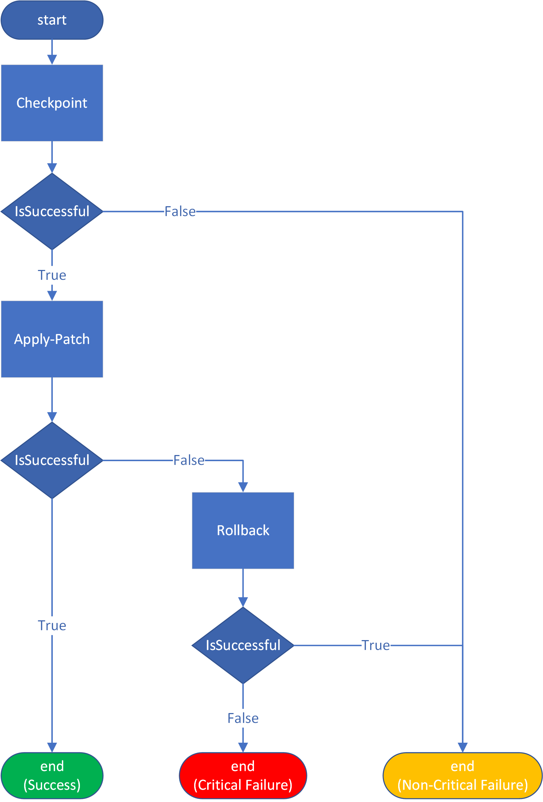
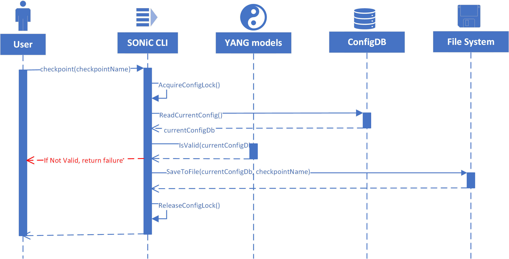

# SONiC Generic Configuration Update and Rollback

# High Level Design Document

#### Rev 0.1

# Table of Contents
- [Table of Contents](#table-of-contents)
- [List of Tables](#list-of-tables)
- [Revision](#revision)
- [About this Manual](#about-this-manual)
- [Scope](#scope)
- [Definition/Abbreviation](#definition-abbreviation)
    + [Table 1: Abbreviations](#table-1--abbreviations)
- [1 Feature Overview](#1-feature-overview)
  * [1.1 Requirements](#11-requirements)
    + [1.1.1 Functional Requirements](#111-functional-requirements)
    + [1.1.2 Configuration and Management Requirements](#112-configuration-and-management-requirements)
    + [1.1.3 Scalability Requirements](#113-scalability-requirements)
    + [1.1.4 Warm Boot Requirements](#114-warm-boot-requirements)
  * [1.2 Design Overview](#12-design-overview)
    + [1.2.1 Basic Approach](#121-basic-approach)
    + [1.2.2 Container](#122-container)
- [2 Functionality](#2-functionality)
  * [2.1 Target Deployment Use Cases](#21-target-deployment-use-cases)
  * [2.2 Functional Description](#22-functional-description)
    + [2.2.1 Apply-Patch](#221-apply-patch)
      - [Stage-1 JSON Patch Verification](#stage-1-json-patch-verification)
      - [Stage-2 JSON Patch Ordering](#stage-2-json-patch-ordering)
      - [Stage-3 Applying list of JsonChanges in order](#stage-3-applying-list-of-jsonchanges-in-order)
      - [Stage-4 Post-update validation](#stage-4-post-update-validation)
      - [Fail-safe Action](#fail-safe-action)
      - [Logging](#logging)
    + [2.2.2 Checkpoint](#222-checkpoint)
      - [Stage-1 Get current ConfigDB JSON config](#stage-1-get-current-configdb-json-config)
      - [Stage-2 Validating current ConfigDB JSON config using YANG models](#stage-2-validating-current-configdb-json-config-using-yang-models)
      - [Stage-3 Save JSON config](#stage-3-save-json-config)
    + [2.2.3 Rollback](#223-rollback)
      - [Stage-1 Get current ConfigDB JSON config](#stage-1-get-current-configdb-json-config-1)
      - [Stage-2 Get checkpoint JSON config](#stage-2-get-checkpoint-json-config)
      - [Stage-3 Generate the diff as JsonPatch between current config and checkpoint](#stage-3-generate-the-diff-as-jsonpatch-between-current-config-and-checkpoint)
      - [Stage-4 Apply-Patch](#stage-4-apply-patch)
      - [Stage-5 Verify config rollback](#stage-5-verify-config-rollback)
      - [Fail-safe Action](#fail-safe-action-1)
      - [Logging](#logging-1)
    + [2.2.4 Replace](#224-replace)
      - [Stage-1 Get target config from the external user](#stage-1-get-target-config-from-the-external-user)
      - [Stage-2 Validating the target config using YANG models](#stage-2-validating-the-target-config-using-yang-models)
      - [Stage-3 Get current ConfigDB JSON config](#stage-3-get-current-configdb-json-config)
      - [Stage-4 Generate the diff as JsonPatch between current config and target config](#stage-4-generate-the-diff-as-jsonpatch-between-current-config-and-target-config)
      - [Stage-5 Apply-Patch](#stage-5-apply-patch)
      - [Stage-6 Verify config replace](#stage-6-verify-config-replace)
      - [Fail-safe Action](#fail-safe-action-2)
      - [Logging](#logging-2)
- [3 Design](#3-design)
  * [3.1 Overview](#31-overview)
    + [3.1.1 ApplyPatch](#311-applypatch)
      - [3.1.1.1 User](#3111-user)
      - [3.1.1.2 SONiC CLI](#3112-sonic-cli)
      - [3.1.1.3 YANG models](#3113-yang-models)
      - [3.1.1.4 Patch Orderer](#3114-patch-orderer)
        * [3.1.1.4.1 JsonChange](#31141-jsonchange)
        * [3.1.1.4.2 Order-Patch](#31142-order-patch)
      - [3.1.1.5 Change Applier](#3115-change-applier)
        * [3.1.1.5.1 Apply-Change](#31151-apply-change)
      - [3.1.1.6 ConfigDB](#3116-configdb)
    + [3.1.2 Checkpoint](#312-checkpoint)
      - [3.1.2.1 User](#3121-user)
      - [3.1.2.2 SONiC CLI](#3122-sonic-cli)
      - [3.1.2.3 YANG models](#3123-yang-models)
      - [3.1.2.4 ConfigDB](#3124-configdb)
      - [3.1.2.5 File system](#3125-file-system)
    + [3.1.3 Rollback](#313-rollback)
      - [3.1.3.1 User](#3131-user)
      - [3.1.3.2 SONiC CLI](#3132-sonic-cli)
      - [3.1.3.4 File system](#3134-file-system)
      - [3.1.3.4 ConfigDB](#3134-configdb)
    + [3.1.4 Replace](#314-replace)
      - [3.1.4.1 User](#3141-user)
      - [3.1.4.2 SONiC CLI](#3142-sonic-cli)
      - [3.1.4.3 YANG models](#3143-yang-models)
      - [3.1.4.4 File system](#3144-file-system)
      - [3.1.4.5 ConfigDB](#3145-configdb)
    + [3.2 User Interface](#32-user-interface)
    + [3.2.1 Data Models](#321-data-models)
      - [3.2.1.1 JsonPatch](#3211-jsonpatch)
    + [3.2.2 CLI](#322-cli)
      - [3.2.2.1 Configuration Commands](#3221-configuration-commands)
      - [3.2.2.2 Show Commands](#3222-show-commands)
      - [3.2.2.3 Debug Commands](#3223-debug-commands)
    + [3.2.3 Multi ASIC support](#323-multi-asics-support)
- [4 Flow Diagrams](#4-flow-diagrams)
- [5 Error Handling](#5-error-handling)
- [6 Serviceability and Debug](#6-serviceability-and-debug)
- [7 Warm Boot Support](#7-warm-boot-support)
- [8 Scalability](#8-scalability)
- [9 Unit Tests](#9-unit-tests)
  * [9.1 Unit Tests for Apply-Patch](#91-unit-tests-for-apply-patch)
  * [9.2 Unit Tests for Checkpoint](#92-unit-tests-for-checkpoint)
  * [9.3 Unit Tests for Rollback](#93-unit-tests-for-rollback)
  * [9.4 Unit Tests for Replace](#94-unit-tests-for-replace)
- [10 E2E Tests](#10-e2e-tests)

# List of Tables
[Table 1: Abbreviations](#table-1-abbreviations)

# Revision

| Rev | Date        | Author             | Change Description  |
|:---:|:-----------:|:------------------:|---------------------|
| 0.1  | 03/01/2021 | Mohamed Ghoneim    | Initial version     |

# About this Manual
This document provides a detailed description on the strategy to implement the SONiC configuration generic update and rollback feature.

# Scope
This document describes the high level design of a SONiC configuration generic update and rollback feature. This document provides minor implementation details about the proposed solutions.

# Definition/Abbreviation

### Table 1: Abbreviations
| **Term** | **Meaning**                |
| -------- | -------------------------- |
| ConfigDB | Configuration Database     |
| JSON     | JavaScript Object Notation |

# 1 Feature Overview

Updating SONiC partial configurations **systematically** has been a challenge for a long time, as each part of the config has different requirements in terms of which files to push to the device, what commands to use, and if there are services that need manual restarting. For example updating `ACLs` is very different from updating `DHCP` configurations.

*ACLs*: Updating ACLs require the following steps:
- Pushing `acl.json` file to the device that contain the new ACL rules
- Pushing `minigraph.xml` to the device that contains the new ACL interfaces
- Execute `sudo acl-loader update full /etc/sonic/acl.json --table_name example_acl`

*DHCP*: Updating DHCP config requires the following steps:
- Pushing `minigraph.xml` to the device that contains the new ACL interfaces
- Generating `dhcp_servers` JSON configs from the `minigraph.xml`, and saving it as a temporary file
- Executing `sudo sonic-cfggen -j /tmp/dhcp.json --write-to-db`
- Restart `dhcp_relay` service

We have explored [SONiC CLI commands](https://github.com/sonic-net/sonic-utilities/blob/master/doc/Command-Reference.md) to make configuration changes. These CLI commands result in updates to the ConfigDB which are corresponding to the CLI command executed. For example, the config `vlan add 10` will create a new row in the VLAN table of the ConfigDB. But relying on the CLI commands to do partial update is also not feasible as there is no standard way of showing the config after the update. Setting up a different update mechanism for each part of the config is very time consuming and inefficient.

The other challenge to updating a switch is recoverability via rollback. Rollback needs to be with minimum-disruption e.g. if reverting ACL updates DHCP should not be affected. Currently SONiC has a couple of operations that can be candidates for rollback `config load` and `config reload`.

*config reload <config_db.json>* : This command clears all the contents of the ConfigDB and loads the contents of config_db.json into the ConfigDB. After that all the Docker containers  and Linux services are restarted to establish the user specified configuration state in the config_db.json file.

- Pro's
  - Assured way of affecting a configuration state change
- Con's
  - Brings the links down and resets the forwarding state. This operation is disruptive in nature
  - Time consuming as it may take 2-3 minutes for all the services to come back online. The time taken may vary based on the switch CPU power.
- Verdict
  - Cannot be used as a rollback mechanism

*config load <config_db.json>*: This command loads the contents of config_db.json into the ConfigDB. The updates made to the ConfigDB are additive in nature and thus the new configuration state is a combination of the current running state and the partial configuration state specified by the user in the config_db.json file

- Pro's
  - Quick way to add new configuration changes
  - It does not disrupt existing service whose configuration is not being modified. So it is non-disruptive in nature
- Con's
  - Can't remove existing configuration and can only be used to add/modify the existing configuration
- Verdict
  - Cannot be used as a rollback mechanism

Since both `config load` and `config reload` are not suitable for a minimum-disruption rollback, we have to look for other approaches.

In this design document, we will be exploring how to standardize the way to do partial updates, how to take checkpoints and finally how to rollback the configurations.

In summary, this is the flow of an update:



And the steps would be:
```
admin@sonic:~$ config checkpoint mycheckpoint
admin@sonic:~$ echo "config changes to apply to ConfigDb" > some-config-changes.json-patch
admin@sonic:~$ config apply-patch ./some-config-changes.json-patch
admin@sonic:~$ config rollback mycheckpoint # in case of failures
```

## 1.1 Requirements

### 1.1.1 Functional Requirements
- A single, simple command to partially update SONiC configuration according to a patch of updates
- A single, simple command to take a checkpoint of the full current SONiC config
- A single, simple command to fully rollback current SONiC configs with to a checkpoint
- [low-priority] A single simple command to fully replace current SONiC configs with a full config provided by an external user.
- Other commands to list checkpoints, delete checkpoints
- The patch of updates should follow a standard notation. The [JSON Patch (RFC6902)](https://tools.ietf.org/html/rfc6902) notation should be used
- Config rollback should be with minimum disruption to the device e.g. if reverting ACL updates DHCP should not be affected i.e. minimum-disruption rollback
- User should be able to preview the configuration difference before going ahead and committing the configuration changes
- In case of errors, the system should just report an error and the user should take care of it
- Only one session globally can update device config at a time i.e. no concurrent updates to configurations

### 1.1.2 Configuration and Management Requirements
- All commands argument to generated using Python-click to provide help menus and other out-of-the box features
- Only root user must be allowed to execute the commands
- Non-root users can execute commands with dry-run option
- Each command must provide the following sub options:
  - "dry-run" Perform a dry-run of the command showing exactly what will be executed on the device, without executing it
  - "verbose" Provide additional information on the steps executed

### 1.1.3 Scalability Requirements
N/A

### 1.1.4 Warm Boot Requirements
N/A

## 1.2 Design Overview


### 1.2.1 Basic Approach
SONiC ConfigDB contents can be retrieved in a JSON file format. Modifying JSON file should follow some rules in order to make it straightforward for the users. Fortunately there is already a formal way of defining JSON config updates. It is called JsonPatch, and is formally defined in [RFC 6902 JSON Patch](https://tools.ietf.org/html/rfc6902).

On top of ConfigDBConnector we are going to implement [RFC 6902 JSON Patch](https://tools.ietf.org/html/rfc6902). This API we will call `apply-patch`. On top of that API, we will implement the `rollback` functionality. It will simply starts by getting the diff (patch) between the checkpoint and the current running config, then it will call the API `apply-patch` to update that patch.

The [JsonPatch](https://pypi.org/project/jsonpatch/) python is an open source library that already implements the [RFC 6902 JSON Patch](https://tools.ietf.org/html/rfc6902). We can leverage this library to verify patch config, generate a diff between checkpoint and current running config, verify apply-patch and rollback work as expected by simulating the final output of the update and comparing with the observed output.

**Example:**
Assume running-config to be:
```
{
  "DEVICE_NEIGHBOR": {
    "Ethernet8": {
      "name": "Servers1",
      "port": "eth0"
    },
    "Ethernet96": {
      "name": "Servers23",
      "port": "eth0"
    },
  },
  "DHCP_SERVERS": {
    "1.1.1.1": {},
    "2.2.2.2": {},
    "3.3.3.3": {}
  }
}
```

and the ask to:
- replace *port* under *Ethernet8* with *eth1*
- add 4.4.4.4 to DHCP_SERVERS
- remove 2.2.2.2 from DHCP_SERVERS

The steps would be:

1) Take the content of config DB here and store it as a checkpoint
```
admin@sonic:~$ config checkpoint mycheckpoint
```
2) Create a file on the device named `dhcp-changes.json-patch`, with the following content
```
[
  {
    "op": "replace",
    "path": "/DEVICE_NEIGHBOR/Ethernet8/port",
    "value": "eth1"
  },
  {
    "op": "add",
    "path": "/DHCP_SERVERS/4.4.4.4",
    "value": {}
  },
  {
    "op": "remove",
    "path": "/DHCP_SERVERS/2.2.2.2"
  }
]
```
3) Apply patch using `apply-patch` command
```
admin@sonic:~$ config apply-patch ./dhcp-changes.json-patch
```
4) In case of failure, rollback the config using `rollback` command
```
admin@sonic:~$ config rollback mycheckpoint --verbose # verbose to see generated patch
```
This will internally do a diff, and generate patch of the needed changes and apply using `apply-patch`.
The patch will be:
```
[
  {
    "op": "replace",
    "path": "/DEVICE_NEIGHBOR/Ethernet8/port",
    "value": "eth0"
  },
  {
    "op": "remove",
    "path": "/DHCP_SERVERS/4.4.4.4,",
    "value": {}
  },
  {
    "op": "add",
    "path": "/DHCP_SERVERS/2.2.2.2"
  },
]
```

### 1.2.2 Container

All the introduced commands will be part of the *python-sonic-utilities* package installed in Debian host O/S.

# 2 Functionality

## 2.1 Target Deployment Use Cases

The `apply-patch` method should help with automating partial config updates, as external systems can generate the update patch, and apply.

The `checkpoint` and `rollback` commands should help improve recoverability, can also be used by external systems to help revert failures during `apply-patch` operation.

Human operators can also leverage the `checkpoint` and `rollback` functionalities while doing updates through the CLI using [SONiC CLI commands](https://github.com/sonic-net/sonic-utilities/blob/master/doc/Command-Reference.md).

## 2.2 Functional Description

### 2.2.1 Apply-Patch
The SONiC `apply-patch` command can broadly classified into the following steps

#### Stage-1 JSON Patch Verification
Using [YANG SONiC models](https://github.com/sonic-net/sonic-buildimage/tree/master/src/sonic-yang-models), but the format of the JSON patch is not what YANG SONiC models is built to verify. We will verify using the following steps:
1. Get current running config from ConfigDB as JSON
2. Simulate the patch application on the current config JSON object
3. Verify the the simulated output using YANG SONiC models

#### Stage-2 JSON Patch Ordering
There are many ideas to ordering the patch, I will pick a simple and straight forward idea to better understand this problem. Let's assume the main granular element is `Table`. Each table gets assigned an order index based on its semantic dependencies. Semantic dependencies mean tables referencing other tables, think of it as the result of doing a topological sorting of table dependencies. For example: `PORT` lots of table depend on it, but it does not depend on other tables so it gets a low index. `VLAN_MEMBER` depends on `PORT` so its gets a higher index, and so on. This helps make sure low order table absorb the changes first before dependent tables are updated.

Let's assume the following order indices:
```
PORT = 1
VLAN_MEMBER = 2
ACL = 3
```
And the patch to update is the following:
```
[
  { "op": "add", "path": "/ACL_TABLE/NO-NSW-PACL-V4/ports/0", "value": "Ethernet2" }
  { "op": "add", "path": "/VLAN_MEMBER/Vlan100|Ethernet2", "value": { "tagging_mode": "untagged" } }
  { "op": "add", "path": "/PORT/Ethernet2", "value": { "lanes": "65", "speed": "10000"} }
]
```

Each operation belongs to a single table, the table name will be the first token in the path after the first `/`. For example the table of the first operation is `ACL_TABLE`. Let's add the table name to each operation.
```
[
  { "table": "ACL_TABLE", "op": "add", "path": "/ACL_TABLE/NO-NSW-PACL-V4/ports/0", "value": "Ethernet2" }
  { "table": "VLAN_MEMBER", "op": "add", "path": "/VLAN_MEMBER/Vlan100|Ethernet2", "value": { "tagging_mode": "untagged" } }
  { "table": "PORT", "op": "add", "path": "/PORT/Ethernet2", "value": { "lanes": "65", "speed": "10000"} }
]
```

Using the indices table above, let's assign an order index to each operation:
```
[
  { "order": 3, "table": "ACL_TABLE", "op": "add", "path": "/ACL_TABLE/NO-NSW-PACL-V4/ports/0", "value": "Ethernet2" }
  { "order": 2, "table": "VLAN_MEMBER", "op": "add", "path": "/VLAN_MEMBER/Vlan100|Ethernet2", "value": { "tagging_mode": "untagged" } }
  { "order": 1, "table": "PORT", "op": "add", "path": "/PORT/Ethernet2", "value": { "lanes": "65", "speed": "10000"} }
]
```

Now let's order the operations by "order":
```
[
  { "order": 1, "table": "PORT", "op": "add", "path": "/PORT/Ethernet2", "value": { "lanes": "65", "speed": "10000"} }
  { "order": 2, "table": "VLAN_MEMBER", "op": "add", "path": "/VLAN_MEMBER/Vlan100|Ethernet2", "value": { "tagging_mode": "untagged" } }
  { "order": 3, "table": "ACL_TABLE", "op": "add", "path": "/ACL_TABLE/NO-NSW-PACL-V4/ports/0", "value": "Ethernet2" }
]
```
This will be the final order of applying the changes.

Unfortunately this solution does not always work especially for the case of deletion from PORT, VLAN_MEMBER, ACL_TABLE. Where if following the same logic we will have:
```
[
  { "order": 1, "table": "PORT", "op": "remove", "path": "/PORT/Ethernet2" }
  { "order": 2, "table": "VLAN_MEMBER", "op": "remove", "path": "/VLAN_MEMBER/Vlan100|Ethernet2" }
  { "order": 3, "table": "ACL_TABLE", "op": "remove", "path": "/ACL_TABLE/NO-NSW-PACL-V4/ports/0" }
]
```
This will not work, as the PORT table will complain that the port `Ethernet2` is still in use by a `VLAN_MEMBER`.

Since this problem can be solved by many ways, and it needs to verified thoroughly, let's abstract it to a a contract which will be implemented later.

The contract would be:
```python
list<JsonChange> order-patch(JsonPatch jsonPatch)
```

Here is a summary explaining the `JsonChange` contract. Check [3.1.1.4.1 JsonChange](#31141-jsonchange) for detailed description.

|aspect      |description
|------------|-----------
|definition | JsonChange is a JsonPatch in terms of the final outcome of the update. Ordering of JsonChange updates will not follow the operations order within a JsonPatch, but will update the JSON file in any arbitrary order.


Here is a summary explaining the `order-patch` contract, Check [3.1.1.4 Patch Orderer](#3114-patch-orderer) for detailed description.

|aspect      |item                 |description
|------------|---------------------|-----------
|inputs      |JsonPatch            | It represents the changes that needs to applied to the device running config, described in [JSON Patch (RFC6902)](https://tools.ietf.org/html/rfc6902).
|outputs     |list&lt;JsonChange&gt;| The list will contain the steps to be followed to apply the input JsonPatch correctly. Each item in the list is assumed to be executed after the previous item, in the order given in the list.
|errors      |malformedPatchError  | Will be raised if the input JsonPatch is not valid according to [JSON Patch (RFC6902)](https://tools.ietf.org/html/rfc6902).
|            |other errors         | Check [3.1.1.4.2 Order-Patch](#31142-order-patch) for exact list of errors to expect.
|side-effects|None                 |
|assumptions |running-config locked| The implementor of this contract might interact with ConfigDB to get the running-config, it is assumed the running-config is locked for changes for the lifespan of the operation.

#### Stage-3 Applying list of JsonChanges in order
There are a few SONiC applications which store their configuration in the ConfigDB. These applications do not subscribe to the ConfigDB change events. So any changes to their corresponding table entries as part of the patch apply process in the ConfigDB are not processed by the application immediately. In order to apply the configuration changes, corresponding service needs to be restarted. Listed below are some example tables from SONiC config, and the corresponding services that need to be manually restarted.


**NOTE**: In the below table we have "Key": ["list-item1", ...]. Key in below example is the table name, corresponding list is the list of services that needs restarting post table update.

```
{
  "SYSLOG_SERVER": ["rsyslog"],
  "DHCP_SERVER": ["dhcp_relay"],
  "NTP_SERVER": ["ntp-config.service", "ntp.service"]
  "BGP_MONITORS": ["bgp"],
  "BUFFER_PROFILE": ["swss"],
  "RESTAPI": ["restapi"]
}
```

Although some other services do not need manual restarting, and absorb the configs silently, there is no good way to make sure there is no errors encountered while the services absorbed the changes. Some of these services might report an error to syslog, others might crash ...etc.

Currently there is no standard approach of updating ConfigDB that takes care of manual service restart and verifying services have absorbed change correctly.

So we are going to introduce a new contract overlaying ConfigDB changes, that will take care of making correct changes to ConfigDB as well as verifying that corresponding services have absorbed the changes correctly.

The contract would be:
```python
void apply-change(JsonChange jsonChange)
```

Check [3.1.1.4.1 JsonChange](#31141-jsonchange) for detailed description of JsonChange.

Here is a summary explaining the `apply-change` contract, Check [3.1.1.4 Change Applier](#3115-change-applier) for detailed description.

|aspect      |item                   |description
|------------|-----------------------|-----------
|inputs      |JsonChange             | It represents the changes that needs to applied to the device running config, described in [3.1.1.4.1 JsonChange](#31141-jsonchange).
|outputs     |None                   | 
|errors      |malformedChangeError   | Will be raised if the input JsonChange is not valid according to [3.1.1.4.1 JsonChange](#31141-jsonchange).
|            |other errors           | Check [3.1.1.4.1 apply-change](#31141-apply-change) for exact list of errors to expect.
|side-effects|updating running-config| This operation will cause changes to the running-config according to the input JsonChange.
|assumptions |running-config locked| The implementor of this contract will interact with ConfigDB to updating the running-config, it is assumed the running-config is locked for changes for the lifespan of the operation.

#### Stage-4 Post-update validation
The expectations after applying the JsonPatch is that it will adhere to [RFC 6902](https://tools.ietf.org/html/rfc6902).

The verification steps
1) Get the state of ConfigDB JSON before the update as a JSON object
2) Simulate the JsonPatch application over this JSON object
3) Compare that JSON object with current ConfigDB JSON
4) In case of mismatch, just report failure

#### Fail-safe Action

If an error is encountered during the `apply-patch` operation, an error is reported and the system DOES NOT take any automatic action. The user can take a `checkpoint` before running `apply-patch` and if the operation failed, the user can `rollback`. Another idea is to introduce a `config-session` where a user enters a `config-session` mode does all the modifications, once they are happy with it, they `commit` the changes to ConfigDB. `config-session` can be built using `checkpoint` and `rollback` functionality, but this `config-session` idea is beyond the scope of this document.

#### Logging

All the configuration update operations executed and the output displayed by the `apply-patch` command are stored in the systemd journal. They are also forwarded to the syslog. By storing the commands in the systemd-journal, the user will be able to search and display them easily at a later point in time. The `show apply-patch log` command reads the systemd-journal to display information about the `apply-patch` command that was previously executed or currently in progress.

### 2.2.2 Checkpoint
The SONiC `checkpoint` command can broadly classified into the following steps

#### Stage-1 Get current ConfigDB JSON config
The *ConfigDBConnector* class is used to obtain the running configuration in JSON format

#### Stage-2 Validating current ConfigDB JSON config using YANG models
ConfigDB might be in invalid to begin with and later if used for rollback it will not work.

#### Stage-3 Save JSON config
Save the checkpoint to a dedicated location on the SONiC box

### 2.2.3 Rollback
The SONiC `rollback` command can broadly classified into the following steps

#### Stage-1 Get current ConfigDB JSON config
The *ConfigDBConnector* class is used to obtain the running configuration in JSON format

#### Stage-2 Get checkpoint JSON config
Load the checkpoint from the SONiC box

#### Stage-3 Generate the diff as JsonPatch between current config and checkpoint
The current ConfigDB JSON config is compared with the JSON config from the checkpoint. The comparison result should be in JsonPatch format.

#### Stage-4 Apply-Patch
Pass the generated JsonPatch to the apply-patch API

#### Stage-5 Verify config rollback
Compare the ConfigDB JSON after the update with the checkpoint JSON, there should be no differences.

#### Fail-safe Action

If an error is encountered during the `rollback` operation, an error is reported and the system DOES NOT take any automatic action. Rollback operation is itself an automated fail-safe action, if itself fails the caller should decide how to handle such failures e.g. generate an alert of high severity, or do `config reload`.

#### Logging

All the configuration update operations executed and the output displayed by the `rollback` command are stored in the systemd journal. They are also forwarded to the syslog. By storing the commands in the systemd-journal, the user will be able to search and display them easily at a later point in time. The `show rollback log` command reads the systemd-journal to display information about the `rollback` command that was previously executed or currently in progress.

### 2.2.4 Replace
The SONiC `replace` command can broadly classified into the following steps

#### Stage-1 Get target config from the external user
The external user to provide the full target ConfigDB config in JSON format.

#### Stage-2 Validating the target config using YANG models
The target config are unknown configs and need to be validating using YANG models

#### Stage-3 Get current ConfigDB JSON config
The *ConfigDBConnector* class is used to obtain the running configuration in JSON format

#### Stage-4 Generate the diff as JsonPatch between current config and target config
The current ConfigDB JSON config is compared with the target JSON config. The comparison result should be in JsonPatch format.

#### Stage-5 Apply-Patch
Pass the generated JsonPatch to the apply-patch API

#### Stage-6 Verify config replace
Compare the ConfigDB JSON after the update with the target JSON, there should be no differences.

#### Fail-safe Action

If an error is encountered during the `replace` operation, an error is reported and the system DOES NOT take any automatic action. The user can take a `checkpoint` before running `replace` and if the operation failed, the user can `rollback`.

#### Logging

All the configuration update operations executed and the output displayed by the `replace` command are stored in the systemd journal. They are also forwarded to the syslog. By storing the commands in the systemd-journal, the user will be able to search and display them easily at a later point in time. The `show replace log` command reads the systemd-journal to display information about the `replace` command that was previously executed or currently in progress.

# 3 Design

## 3.1 Overview

### 3.1.1 ApplyPatch


#### 3.1.1.1 User
The user of the system, can simply be a human operator or a service that can talk to SONiC CLI. The user can only apply-patch if they have an admin permission. Users without admin permissions can only execute dry-run of the operations where they will be able to see the exact changes going to affect the device, without executing these changes.

#### 3.1.1.2 SONiC CLI
These are the CLI of SONiC switch to which makes it easy for the users to interact with the system. The CLI commands we are interested in are `config ...` and `show ...`, check [SONiC Command Line Interface Guide](https://github.com/sonic-net/sonic-utilities/blob/master/doc/Command-Reference.md) to learn more about SONiC CLI.

For further details on the CLI setup, Check [3.2.2 CLI](#322-cli)

#### 3.1.1.3 YANG models
YANG is a data modeling language used to model configuration data, state data, Remote Procedure Calls, and notifications for network management protocols. For further details check [The YANG 1.1 Data Modeling Language](https://tools.ietf.org/html/rfc7950)

SONiC is currently getting on-boarded to YANG data models to help verify and generate the configurations. We will leverage these YANG models to help verify the result of simulating the JsonPatch on ConfigDb, to make sure final outcome adheres to all the constrains defined in the YANG models. For further details check [YANG SONiC models](https://github.com/sonic-net/sonic-buildimage/tree/master/src/sonic-yang-models).

#### 3.1.1.4 Patch Orderer
This component is going to solve the problems discussed in [Stage-2 JSON Patch Ordering](#stage-2-json-patch-ordering). This component is going to help provide an order of execution to the JsonPatch, in such a way when the config is updated in this order, there will be no errors generated on the device. The exact implementation details of this component will not be included in this design document, but we are going to explain in details the contract for any implementation.

The contract would be:
```python
list<JsonChange> order-patch(JsonPatch jsonPatch)
```

##### 3.1.1.4.1 JsonChange

|aspect      |description
|------------|-----------
|definition | JsonChange is a JsonPatch in terms of the final outcome of the update. Ordering of JsonChange updates will not follow the operations order within a JsonPatch, but will update the JSON file in any arbitrary order.
|validation  | JsonChange is considered valid if its corresponding JsonPatch is valid according to [JSON Patch (RFC6902)](https://tools.ietf.org/html/rfc6902)

Assume we have the following JsonPatch:
```
[
  { "op": "add", "path": "/ACL_TABLE/NO-NSW-PACL-V4/ports/0", "value": "Ethernet2" }
  { "op": "add", "path": "/VLAN_MEMBER/Vlan100|Ethernet2", "value": { "tagging_mode": "untagged" } }
  { "op": "add", "path": "/PORT/Ethernet2", "value": { "lanes": "65", "speed": "10000"} }
]
```

Operations specified in the JsonPatch will be executed in the order specified, but JsonChange can be applied in any arbitrary order as the implementation specify, for example:
```
[
  { "op": "add", "path": "/PORT/Ethernet2", "value": { "lanes": "65", "speed": "10000"} }
  { "op": "add", "path": "/VLAN_MEMBER/Vlan100|Ethernet2", "value": { "tagging_mode": "untagged" } }
  { "op": "add", "path": "/ACL_TABLE/NO-NSW-PACL-V4/ports/0", "value": "Ethernet2" }
]
```
or
```
[
  { "op": "add", "path": "/PORT/Ethernet2", "value": { "lanes": "65", "speed": "10000"} }
  { "op": "add", "path": "/VLAN_MEMBER/Vlan100|Ethernet2", "value": { "tagging_mode": "untagged" } }
  { "op": "add", "path": "/ACL_TABLE/NO-NSW-PACL-V4/ports/0", "value": "Ethernet2" }
]
```

The only condition of JsonChange is that the final outcome after applying the whole JsonPatch is the same.

##### 3.1.1.4.2 Order-Patch

|aspect      |item                     |description
|------------|-------------------------|-----------
|inputs      |JsonPatch                | It represents the changes that needs to applied to the device running config, described in [JSON Patch (RFC6902)](https://tools.ietf.org/html/rfc6902).
|outputs     |list&lt;JsonChange&gt;   | The list will contain the steps to be followed to apply the input JsonPatch correctly. Each item in the list is assumed to be executed after the previous item, in the order given in the list.
|errors      |malformedPatchError      | Will be raised if the input JsonPatch is not valid according to [JSON Patch (RFC6902)](https://tools.ietf.org/html/rfc6902).
|            |unprocessableRequestError| Will be raised if the implementation of the `order-patch` is not able to provide a valid ordering according to its own ordering validations.
|            |resourceNotFoundError    | Will be raised if running config failed to be read or in case any other external resource is not found nor available.
|            |conflictingStateError   | Will be raised if the patch cannot be applied to the current state of the running config e.g. trying to add an item to a non-existing json dictionary.
|            |internalError            | Will be raised if any other error is encountered that's different than the ones listed above.
|side-effects|None                     |
|assumptions |running-config locked    | The implementor of this contract might interact with ConfigDB to get the running-config, it is assumed the ConfigDB is locked for changes for the lifespan of the operation.

If `order-patch` has to force the update to follow very specific steps, it would have to provide multiple JsonChange objects in the return list of `order-patch`.

`order-patch` is returning a list of JsonChanges instead of a simple JsonPatch with multiple operations because a JsonChange can group together multiple JsonPatch operations that share no dependency and can be executed together. This can help the implementor of `apply-change` to optimize the mechanism for applying JsonChange e.g. group changes under same parent together or reduce number of service restarts.

For example:
Assume JsonPatch contains:
```
[
  { "op": "add", "path": "/DHCP_SERVERS/4.4.4.4", "value": {} },
  { "op": "replace", "path": "/DEVICE_NEIGHBOR/Ethernet8/port", "value": "eth1" },
  { "op": "add", "path": "/DHCP_SERVERS/2.2.2.2", "value": {} }
]
```
We have 2 operations updating DHCP servers, and another operation for DEVICE_NEIGHBOR. We can assume DHCP and DEVICE_NEIGHBOR tables to be independent meaning they can updated at the same time. `order-patch` would return:
```
[
  [
    { "op": "add", "path": "/DHCP_SERVERS/4.4.4.4", "value": {} },
    { "op": "replace", "path": "/DEVICE_NEIGHBOR/Ethernet8/port", "value": "eth1" },
    { "op": "add", "path": "/DHCP_SERVERS/2.2.2.2", "value": {} }
  ],
]
```
Updating DHCP_SERVERS requires restarting `dhcp_relay` service, so if the above patch is to be executed in order, we will restart `dhcp_relay` service twice.
But since the implementor of `apply-change` can order the operations in any way they see fit since they are OK to update together. They can decide move the DHCP updates together, and DHCP table twice, but restart `dhcp_relay` service only once.

Let's take a visual example, assume we have a JsonPatch with 8 operations, and here is the topological order of the operation. Arrow from op-x to op-y means op-y depends on op-x.


If we sort by on the operations we would have:


But if we organize the operations into groups of JsonChange, we will have:


This will allow the the implementor of `apply-change` to have the freedom to optimize the operations in any order they see fit.

**NOTE:** Check Patch Orderer implementation design design details in [Json_Patch_Ordering_using_YANG_Models_Design](Json_Patch_Ordering_using_YANG_Models_Design.md) document.

#### 3.1.1.5 Change Applier
This component is going to solve the problems discussed in [Stage-3 Applying list of JsonChanges in order](#stage-3-applying-list-of-jsonchanges-in-order). This component is going to help provide a mechanism for updating a JsonChange taking into account manual service restarts, and update verification. The exact implementation details of this component will not be included in this design document, but we are going to explain in details the contract for any implementation.

The contract would be:
```python
void apply-change(JsonChange jsonChange)
```

##### 3.1.1.5.1 Apply-Change
|aspect      |item                     |description
|------------|-------------------------|-----------
|inputs      |JsonChange               | It represents the changes that needs to applied to the device running config, described in [3.1.1.4.1 JsonChange](#31141-jsonchange).
|outputs     |None                     | 
|errors      |malformedChangeError     | Will be raised if the input JsonChange is not valid according to [3.1.1.4.1 JsonChange](#31141-jsonchange).
|            |resourceNotFoundError    | Will be raised if running config failed to be read or in case any other external resource is not found nor available.
|            |unprocessableRequestError| Will be raised if the change is valid, all the resources are found but when applying the change it causes an error in the system.
|            |internalError            | Will be raised if any other error is encountered that's different than the ones listed above.
|side-effects|updating running-config  | This operation will cause changes to the running-config according to the input JsonChange.
|assumptions |running-config locked    | The implementor of this contract will interact with ConfigDB to updating the running-config, it is assumed the ConfigDB is locked for changes for the lifespan of the operation.

Since the order of executing the operation does not matter, the implementor of this component can work on optimizing the time to run the operation. For details check [3.1.1.4 Change Applier](#3115-change-applier).

**NOTE:** Check Change Applier implementation design design details in [Json_Change_Application_Design](Json_Change_Application_Design.md) document.

#### 3.1.1.6 ConfigDB
SONiC is managing configuration in a single source of truth - a redisDB instance that we refer as ConfigDB. Applications subscribe to ConfigDB and generate their running configuration correspondingly.

For further details on the ConfigDB, check [SONiC Configuration Database Manual](https://github.com/sonic-net/SONiC/wiki/Configuration).

### 3.1.2 Checkpoint


#### 3.1.2.1 User
The user of the system, can simply be a human operator or a service that can talk to SONiC CLI. The user can only apply-patch if they have an admin permission.

#### 3.1.2.2 SONiC CLI
Same as [3.1.1.2 SONiC CLI](#3112-sonic-cli)

#### 3.1.2.3 YANG models
Same as [3.1.1.3 YANG models](#3113-yang-models)

#### 3.1.2.4 ConfigDB
same as [3.1.1.5 ConfigDB](#3115-configdb)

#### 3.1.2.5 File system
This will the file system where SONiC os is setup. Some suggestions prefer the path `/var/sonic/checkpoints`, but that is not decided yet. Will leave it to the implementor of this design document to decide.

### 3.1.3 Rollback


#### 3.1.3.1 User
Same as [3.1.2.1 User](#3121-user)

#### 3.1.3.2 SONiC CLI
Same as [3.1.1.2 SONiC CLI](#3112-sonic-cli)

#### 3.1.3.4 File system
Same as [3.1.2.5 File system](#3125-file-system)

#### 3.1.3.4 ConfigDB
same as [3.1.1.5 ConfigDB](#3115-configdb)

### 3.1.4 Replace


#### 3.1.4.1 User
Same as [3.1.2.1 User](#3121-user)

#### 3.1.4.2 SONiC CLI
Same as [3.1.1.2 SONiC CLI](#3112-sonic-cli)

#### 3.1.4.3 YANG models
Same as [3.1.1.3 YANG models](#3113-yang-models)

#### 3.1.4.4 File system
Same as [3.1.2.5 File system](#3125-file-system)

#### 3.1.4.5 ConfigDB
same as [3.1.1.5 ConfigDB](#3115-configdb)

### 3.2 User Interface

### 3.2.1 Data Models

#### 3.2.1.1 JsonPatch

The JsonPatch consistes of a list operation, and each operation follows this format:
```
  { "op": "<Operation-Code>", "path": "<Path>", "value": "<Value>", "from": "<From-Path>" }
```
For detailed information about the JSON patch operations refer to the section 4(Operations) of [RFC 6902](https://tools.ietf.org/html/rfc6902).


**Operation Code**

- replace - Set ConfigDB entry described in Path to be equal to the data specified in Value
- add - Create a new ConfigDB entry described in Path and set it Value
- remove - Delete the ConfigDB entry described in Path
- copy - Copy the ConfigDB entry specified in the FromPath to create a ConfigDB entry specified in Path
- move - Copy the ConfigDB entry specified in the FromPath to create a ConfigDB entry specified in Path and then delete the ConfigDB entry in FromPath

**Path**

Describes the location of the ConfigDB entry which is being processed. The path string can be dissected into below elements.

- Table Name - The ConfigDB table corresponding to the entry
- Key - The Key string to identify the row data within the ConfigDB table
- Field - The column_key to identify the ConfigDB entry within the identified row data

e.g  "/VLAN_MEMBER/Vlan10|Ethernet0/tagging_mode"

- Table: VLAN_MEMBER
- Key: Vlan10|Ethernet0
- Field: tagging_mode


**FromPath**

- Same as Path used in copy and move operations


**Value**

- Data that is used to patch the ConfigDB entry specified in path

### 3.2.2 CLI

#### 3.2.2.1 Configuration Commands

**apply-patch**
*Command Format*

config apply-patch <*patch-filename*> [--dry-run] [--verbose]

| Command Option    | Purpose                                                      |
| ----------------- | ------------------------------------------------------------ |
|<*patch-filename*> | The file of the JsonPatch file to apply which follows [JSON Patch (RFC6902)](https://tools.ietf.org/html/rfc6902) specifications |
|dry-run            | Displays the generates commands going to be executed without running them.  |
|verbose            | Provide additional details about each step executed as part of the operation. |

*Command Usage*

| Command                                           | Purpose                                                      |
| ------------------------------------------------- | ------------------------------------------------------------ |
| config apply-patch *filename*                     | Applies the given JsonPatch file operations following the [JSON Patch (RFC6902)](https://tools.ietf.org/html/rfc6902) specifications. |
| config apply-patch *filename* --dry-run           | Displays the generates commands going to be executed without running them. |
| config apply-patch *filename* --verbose           | Applies the given JsonPatch file operations following the [JSON Patch (RFC6902)](https://tools.ietf.org/html/rfc6902) specifications. The CLI output will include additional details about each step executed as part of the operation. |
| config apply-patch *filename* --dry-run --verbose | Displays the generates commands going to be executed without running them. The CLI output will include additional details about each step executed as part of the operation.  |


**checkpoint**

*Command Format*

config checkpoint <*checkpoint-name*> [--dry-run] [--verbose]

| Command Option      | Purpose                                                                       |
| ------------------- | ----------------------------------------------------------------------------- |
|<*checkpoint-name*>  | The name of the checkpoint where ConfigDB JSON config will saved under.       |
|dry-run              | Displays the generates commands going to be executed without running them.    |
|verbose              | Provide additional details about each step executed as part of the operation. |

*Command Usage*

| Command                                                  | Purpose                                                      |
| -------------------------------------------------------- | ------------------------------------------------------------ |
| config checkpoint *checkpoint-name*                      | Will save ConfigDB JSON config as a checkpoint with the name *checkpoint-name*. |
| config checkpoint *filename* --dry-run                   | Displays the generates commands going to be executed without running them. |
| config checkpoint *filename* --verbose                   | Will save ConfigDB JSON config as a checkpoint with the name *checkpoint-name*. The CLI output will include additional details about each step executed as part of the operation. |
| config checkpoint *filename* --dry-run --verbose         | Displays the generates commands going to be executed without running them. The CLI output will include additional details about each step executed as part of the operation.  |

**checkpoint**

*Command Format*

config rollback <*checkpoint-name*> [--dry-run] [--verbose]

| Command Option     | Purpose                                                                       |
| ------------------ | ----------------------------------------------------------------------------- |
|<*checkpoint-name*> | The name of the checkpoint where ConfigDB JSON config will saved under        |
|dry-run             | Displays the generates commands going to be executed without running them.    |
|verbose             | Provide additional details about each step executed as part of the operation. |

*Command Usage*

| Command                                        | Purpose                                                      |
| ---------------------------------------------- | ------------------------------------------------------------ |
| config rollback *checkpoint-name*              | Rolls back the ConfigDB JSON config to the config saved under *checkpoint-name* checkpoint. |
| config rollback *filename* --dry-run           | Displays the generates commands going to be executed without running them. |
| config rollback *filename* --verbose           | Rolls back the ConfigDB JSON config to the config saved under *checkpoint-name* checkpoint. The CLI output will include additional details about each step executed as part of the operation.
| config rollback *filename* --dry-run --verbose | Displays the generates commands going to be executed without running them. The CLI output will include additional details about each step executed as part of the operation.  |

#### 3.2.2.2 Show Commands

**apply-patch**
*Command Format*

show apply-patch log [exec | verify | status]

| Command                     | Purpose                                                      |
| --------------------------- | ------------------------------------------------------------ |
| show apply-patch log exec   | Displays a log of all the ConfigDB operations executed including<br/>those that failed. In case of a failed operation, it displays an<br/>error message against the failed operation. |
| show apply-patch log verify | Displays a log all the ConfigDB operations that failed, <br>along with an error message. It does not display the <br/>operations that were successful. |
| show apply-patch log status | Displays the status of last successful patch application<br/>operation since switch reboot. |

**rollback**
*Command Format*

show rollback log [exec | verify | status]

| Command                  | Purpose                                                      |
| ------------------------ | ------------------------------------------------------------ |
| show rollback log exec   | Displays a log of all the ConfigDB operations executed including<br/>those that failed. In case of a failed operation, it displays an<br/>error message against the failed operation. |
| show rollback log verify | Displays a log all the ConfigDB operations that failed, <br>along with an error message. It does not display the <br/>operations that were successful. |
| show rollback log status | Displays the status of last successful config rollback<br/>operation since switch reboot. |


#### 3.2.2.3 Debug Commands

Use the *verbose* option to view additional details while executing the different commands.

### 3.2.3 Multi ASICs Support

The initial design of the SONiC Generic Configuration Update and Rollback feature primarily focuses on single-ASIC platforms. To cater to the needs of Multi-ASIC platforms, this section introduces enhancements to support configuration updates and rollbacks across multiple ASICs and the host namespace.

#### 3.2.3.1 Overview

In Multi-ASIC SONiC platforms, configurations can be applied either globally, affecting all ASICs, or individually, targeting a specific ASIC or the host. The configuration management tools must, therefore, be capable of identifying and applying configurations based on their intended scope.

#### 3.2.3.2 Namespace-aware Configuration Management

The SONiC utilities for configuration management (apply-patch, checkpoint, and rollback) will be enhanced to become namespace-aware. These utilities will determine the target namespace for each operation from the configuration patch itself or from user input for operations that involve checkpoints and rollbacks.

#### 3.2.3.3 JSON Patch Format Extension

The JSON Patch format will be extended to include the namespace identifier for each operation's path. Path that operations the host namespace will be marked with a "localhost" identifier, while those intended for a specific ASIC will include an "asicN" identifier, where N denotes the ASIC number.

```json
[
    {
        "op": "add",
        "path": "/asic0/PORTCHANNEL/PortChannel102/admin_status",
        "value": "down"
    },
    {
        "op": "replace",
        "path": "/localhost/BGP_DEVICE_GLOBAL/STATE/tsa_enabled",
        "value": "true"
    },
    {
        "op": "replace",
        "path": "/asic0/BGP_DEVICE_GLOBAL/STATE/tsa_enabled",
        "value": "true"
    },
    {
        "op": "replace",
        "path": "/asic1/BGP_DEVICE_GLOBAL/STATE/tsa_enabled",
        "value": "true"
    }
]
```

#### 3.2.3.4 Applying Configuration Changes

When applying a configuration patch, the system will:

    Parse the extended JSON Patch to identify the target namespaces.
    Apply the operations intended for the host namespace directly to the host's configuration database.
    Apply ASIC-specific operations to the respective ASIC's configuration database.

#### 3.2.3.5 Checkpoints and Rollbacks

Checkpoint and rollback operations will be enhanced to support Multi-ASIC platforms by:

    Capturing the configuration state of all ASICs and the host namespace when creating a checkpoint.
    Allowing rollbacks to restore the configuration state of all ASICs and the host namespace to a specific checkpoint.

#### 3.2.3.6 Implementation Details

The extension of the SONiC Generic Configuration Update and Rollback feature to support Multi-ASIC platforms enhances the flexibility and manageability of SONiC deployments in complex environments. By introducing namespace-aware configuration management, SONiC can efficiently handle the intricacies of Multi-ASIC platforms, ensuring smooth and reliable operation.

    Namespace-aware Utilities: Update the SONiC configuration utilities to handle namespace identifiers in the configuration patches and command-line options for specifying target namespaces for checkpoints and rollbacks.

    Validation and Verification: Extend the configuration validation and verification mechanisms to cover Multi-ASIC scenarios, ensuring that configurations are valid and consistent across all ASICs and the host.

    CLI Enhancements: Introduce new CLI options to specify target namespaces for configuration operations, and to manage checkpoints and rollbacks in a Multi-ASIC environment.

    Testing: Develop comprehensive test cases to cover Multi-ASIC configuration updates, including scenarios that involve simultaneous updates to multiple ASICs and the host.

| Pull Request | Description |
| --------- | ----------- |
|[Add Multi ASIC support for apply-patch](https://github.com/sonic-net/sonic-utilities/pull/3249)|1. Categorize configuration as JSON patch format per ASIC.<br>2. Apply patch per ASIC, including localhost. |
|[Add Multi ASIC support for Checkpoint and Rollback](https://github.com/sonic-net/sonic-utilities)|To be implemented|

#### 3.2.3.7 Enhancement

Given that applying patches or performing other actions on multiple ASICs can be time-consuming, we are introducing the -p option to expedite the process. This option operates under the assumption that each ASIC functions independently.

| Pull Request | Description |
| --------- | ----------- |
|[Add Multi ASIC support for parallel option](https://github.com/sonic-net/sonic-utilities)|To be implemented|

1. apply-patch
    ```python
    @config.command('apply-patch')
    ...
    @click.option('-p', '--parallel', is_flag=True, default=False, help='applying the change to all ASICs parallelly')
    ...
    def apply_patch(ctx, patch_file_path, format, dry_run, parallel, ignore_non_yang_tables, ignore_path, verbose):
        ...
    ```
2. checkpoint
    ```python
    @config.command()
    ...
    @click.option('-p', '--parallel', is_flag=True, default=False, help='taking the checkpoints to all ASICs parallelly')
    ...
    def checkpoint(ctx, checkpoint_name, verbose):
    ```
3. replace
    ```python
    @config.command()
    ...
    @click.option('-p', '--parallel', is_flag=True, default=False, help='replacing the change to all ASICs parallelly')
    ...
    def replace(ctx, target_file_path, format, dry_run, ignore_non_yang_tables, ignore_path, verbose):
        ...
    ```
4. rollback
    ```python
    @config.command()
    ...
    @click.option('-p', '--parallel', is_flag=True, default=False, help='rolling back the change to all ASICs parallelly')
    ...
    def rollback(ctx, checkpoint_name, dry_run, ignore_non_yang_tables, ignore_path, verbose):
    ```
5. list_checkpoints
    ```python
    @config.command()
    ...
    @click.option('-p', '--parallel', is_flag=True, default=False, help='listing the change to all ASICs parallelly')
    ...
    def list_checkpoints(ctx, checkpoint_name, dry_run, ignore_non_yang_tables, ignore_path, verbose):
    ```
6. delete_checkpoint
    ```python
    @config.command()
    ...
    @click.option('-p', '--parallel', is_flag=True, default=False, help='listing the change to all ASICs parallelly')
    ...
    def delete_checkpoint(ctx, checkpoint_name, dry_run, ignore_non_yang_tables, ignore_path, verbose):
    ```

# 4 Flow Diagrams

# 5 Error Handling

If an error is encountered during executing any of the commands, the error is reported to the user. The system does not do any recovery actions, and leaves it up to the user to decide.

# 6 Serviceability and Debug
All commands logs are stored in systemd-journal and syslog.


# 7 Warm Boot Support
N/A


# 8 Scalability
N/A

# 9 Unit Tests
## 9.1 Unit Tests for Apply-Patch
| Test Case | Description |
| --------- | ----------- |
| 1         | Add a new table. |
| 2         | Remove an existing table. |
| 3         | Modify values of an existing table entry. |
| 4         | Modify value of an existing item an array value. |
| 5         | Add a new item to an array value. |
| 6         | Remove an item form an array value. |
| 7         | Add a new key to an existing table .|
| 8         | Remove a key from an existing table. |
| 9         | Remove 2 items that depends on each other but in different tables e.g. /PORT/Ethernet2 and /VLAN_MEMBER/Vlan101|Ethernet2. |
| 10        | Add 2 items that depends on each other but in different tables e.g. /PORT/Ethernet2 and /VLAN_MEMBER/Vlan101|Ethernet2. |
| 11        | Remove 2 items that depends on each other in the same table e.g. /INTERFACE/INTERFACE_LIST and /INTERFACE/INTERFACE_PREFIX_LIST. |
| 12        | Add 2 items that depends on each other in the same table e.g. /INTERFACE/INTERFACE_LIST and /INTERFACE/INTERFACE_PREFIX_LIST. |
| 13        | Replace a mandatory item e.g. type under ACL_TABLE. |
| 14        | Dynamic port breakout as described [here](https://github.com/sonic-net/SONiC/blob/master/doc/dynamic-port-breakout/sonic-dynamic-port-breakout-HLD.md).|
| 15        | Remove an item that has a default value. |
| 16        | Modifying items that rely depends on each other based on a `must` condition rather than direct connection such as `leafref` e.g. /CRM/acl_counter_high_threshold (check [here](https://github.com/sonic-net/sonic-buildimage/blob/master/src/sonic-yang-models/yang-models/sonic-crm.yang)). |
| 17        | Add a new ASIC config subtree. |
| 18        | Add a new ASIC with empty config. |
| 19        | Independent Patch Application: Apply configuration patches independently to each ASIC without any coordination between them. Verify that each ASIC updates according to its patch and that there are no discrepancies in configurations that might affect system operations.|
| 20        | Simultaneous Patch Application:Apply configuration patches to all ASICs simultaneously to ensure that simultaneous updates do not cause conflicts or failures. This test checks the systems ability to handle concurrent configuration changes across multiple independent units.|
| 21        | Sequential Patch Application: Apply configuration patches to ASICs in a controlled sequence, one after the other. This test aims to check if the order of patch application affects the final system configuration, especially when configurations might not directly interact but could have cumulative effects.|
| 22        |Patch Rollback Capability: After applying patches, initiate a rollback to previous configurations for each ASIC independently. Verify that each ASIC can revert to its previous state accurately and that the rollback process does not introduce new issues.|
| 23        | Conditional Patch Application: Apply patches based on conditional checks within each ASICs configuration (e.g., only apply a patch if the current firmware version is below a certain level). This test ensures that conditions within patches are evaluated correctly and that the patch is applied only when the conditions are met.|
| 24        | Cross-ASIC Dependency Verification: While each ASIC operates independently, this test involves applying patches that could potentially have indirect impacts on other ASICs through shared resources or network topology changes. Validate that changes in one ASIC do not adversely affect others.|
| 25        | Patch Compatibility and Conflict Resolution: Apply patches that introduce changes conflicting with existing configurations across ASICs. This test examines how the system identifies and resolves conflicts, ensuring that the most critical settings are preserved and that any issues are clearly reported.|
| 26        | Performance Impact Assessment: Measure system performance before and after patch application to determine the impact of configuration changes. This includes monitoring processing speed, memory usage, and network latency to ensure that performance remains within acceptable parameters.|

## 9.2 Unit Tests for Checkpoint
| Test Case | Description |
| --------- | ----------- |
| 1         | Invalid Configs according to YANG models should fail to be saved. |
| 2         | Saving ConfigDB successfully to a file. |

## 9.3 Unit Tests for Rollback
| Test Case | Description |
| --------- | ----------- |
| 1 ..*     | Rollback all unit-tests specified in [9.1 Unit Tests for Apply-Patch](#91-unit-tests-for-apply-patch). |

## 9.4 Unit Tests for Replace
| Test Case | Description |
| --------- | ----------- |
| 1 ..*     | Use replace instead of apply-patch for unit-tests specified in [9.1 Unit Tests for Apply-Patch](#91-unit-tests-for-apply-patch). |

# 10 E2E Tests
| Test Case | Description |
| --------- | ----------- |
| 1         | [Updating Syslog configs.](https://github.com/sonic-net/sonic-mgmt/blob/master/tests/generic_config_updater/test_syslog.py) |
| 2         | [Updating AAA configs.](https://github.com/sonic-net/sonic-mgmt/blob/master/tests/generic_config_updater/test_aaa.py) |
| 3         | [Updating DHCP configs.](https://github.com/sonic-net/sonic-mgmt/blob/master/tests/generic_config_updater/test_dhcp_relay.py) |
| 4         | [Updating IPv6 configs.](https://github.com/sonic-net/sonic-mgmt/blob/master/tests/generic_config_updater/test_ipv6.py) |
| 5         | Updating monitor configs (EverflowAlwaysOn). |
| 6         | [Updating BGP speaker configs.](https://github.com/sonic-net/sonic-mgmt/blob/master/tests/generic_config_updater/test_bgp_speaker.py) |
| 7         | [Updating BGP listener configs.](https://github.com/sonic-net/sonic-mgmt/blob/master/tests/generic_config_updater/test_bgpl.py) |
| 8         | [Updating Bounce back routing configs.](https://github.com/sonic-net/sonic-mgmt/blob/master/tests/bgp/test_bgp_bbr.py) |
| 9         | [Updating control-plane ACLs (NTP, SNMP, SSH) configs.](https://github.com/sonic-net/sonic-mgmt/blob/master/tests/generic_config_updater/test_cacl.py) |
| 10        | [Updating Ethernet interfaces configs.](https://github.com/sonic-net/sonic-mgmt/blob/master/tests/generic_config_updater/test_eth_interface.py) |
| 11        | [Updating VLAN interfaces configs.](https://github.com/sonic-net/sonic-mgmt/blob/master/tests/generic_config_updater/test_vlan_interface.py) |
| 12        | [Updating port-channel interfaces configs.](https://github.com/sonic-net/sonic-mgmt/blob/master/tests/generic_config_updater/test_portchannel_interface.py) |
| 13        | [Updating loopback interfaces configs.](https://github.com/sonic-net/sonic-mgmt/blob/master/tests/generic_config_updater/test_lo_interface.py) |
| 14        | [Updating Kubernetes configs.](https://github.com/sonic-net/sonic-mgmt/blob/master/tests/generic_config_updater/test_kubernetes_config.py) |
| 15        | [Updating BGP prefix hijack configs.](https://github.com/sonic-net/sonic-mgmt/blob/master/tests/generic_config_updater/test_bgp_prefix.py) |
| 16        | [Updating QoS headroom pool and buffer pool size.](https://github.com/sonic-net/sonic-mgmt/blob/master/tests/generic_config_updater/test_incremental_qos.py) |
| 17        | [Updating ECN tuning.](https://github.com/sonic-net/sonic-mgmt/blob/master/tests/generic_config_updater/test_ecn_config_update.py) |
| 18        | [Updating dynamic threshold tuning.](https://github.com/sonic-net/sonic-mgmt/blob/master/tests/generic_config_updater/test_mmu_dynamic_threshold_config_update.py) |
| 19        | [Disable/enable PFC_WD.](https://github.com/sonic-net/sonic-mgmt/blob/master/tests/generic_config_updater/test_pfcwd_status.py) |
| 20        | [Updating PFC_WD poll interval.](https://github.com/sonic-net/sonic-mgmt/blob/master/tests/generic_config_updater/test_pfcwd_interval.py) |
| 21        | [Updating PG headroom configs.](https://github.com/sonic-net/sonic-mgmt/blob/master/tests/generic_config_updater/test_pg_headroom_update.py) |
| 22        | [Add/Remove Rack.](https://github.com/sonic-net/sonic-mgmt/blob/master/tests/configlet/test_add_rack.py) |
