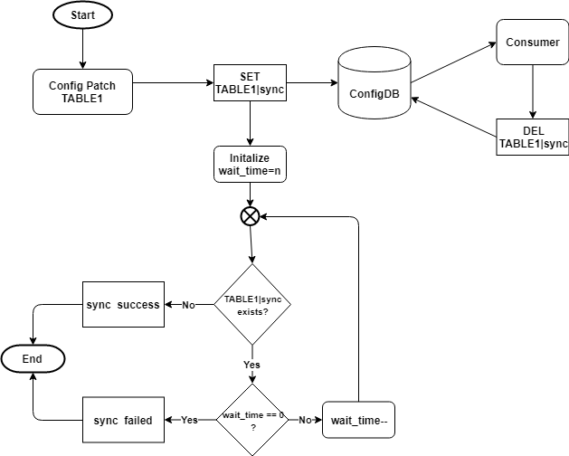
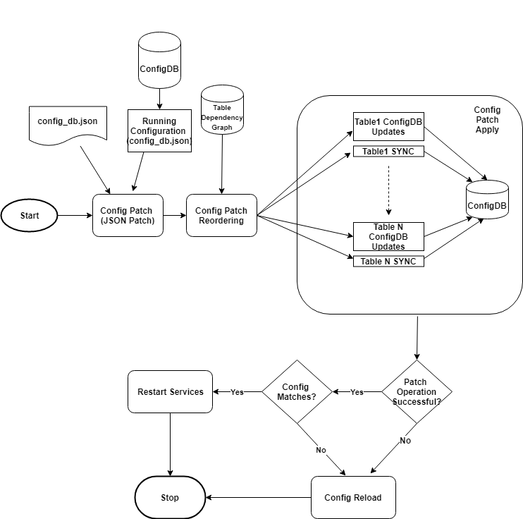

# SONiC Configuration Replace

# High Level Design Document
#### Rev 0.1

# Table of Contents
  * [List of Tables](#list-of-tables)
  * [Revision](#revision)
  * [About This Manual](#about-this-manual)
  * [Scope](#scope)
  * [Definition/Abbreviation](#definitionabbreviation)
  * [1 Feature Overview](#1-feature-overview)
      * [1.1 Requirements](#11-requirements)
          * [1.1.1 Functional Requirements](#111-functional-requirements)
          * [1.1.2 Configuration and Management Requirements](#112-configuration-and-management-requirements)
          * [1.1.3 Scalability Requirements](#113-scalability-requirements)
        * [1.1.4 Warm Boot Requirements](#114-warm-boot-requirements)
    * [1.2 Design Overview](#12-design-overview)
      * [1.2.1 Basic Approach](#121-basic-approach)
      * [1.2.1 Container](#122-container)
    * [2 Functionality](#2-functionality)
      * [2.1 Target Deployment Use Cases](#21-target-deployment-use-cases)
      * [2.2 Functional Description](#22-functional-description)
    * [3 Design](#3-design)
      * [3.1 Overview](#31-overview)
      * [3.2 DB Changes](#32-db-changes)
        * [3.2.1 ConfigDB](#321-configdb)
      * [3.3 Switch State Service Design](#33-switch-state-service-design)
        * [3.3.1 Orchestration Agent](#331-orchestration-agent)
        * [3.3.2 Other Process](#332-other-process)
      * [3.6 User Interface](#36-user-interface)
        * [3.6.1 Data Models](#361-data-models)
        * [3.6.2 CLI](#362-cli)
          * [3.6.2.1 Configuration Commands](#3621-configuration-commands)
          * [3.6.2.2 Show Commands](#3622-show-commands)
          * [3.6.2.3 Debug Commands](#3623-debug-commands)
      * [4 Flow Diagrams](#4-flow-diagrams)
      * [5 Error Handling](#5-error-handling)
      * [6 Serviceability and Debug](#6-serviceability-and-debug)
      * [7 Warm Boot Support](#7-warm-boot-support)
      * [8 Scalability](#8-scalability)
      * [9 Unit Tests](#9-unit-tests)


# List of Tables
[Table 1: Abbreviations](#table-1-abbreviations)

# Revision

| Rev |     Date    |       Author       | Change Description                |
|:---:|:-----------:|:------------------:|-----------------------------------|
| 0.1  | 11/18/2019 | Rajendra Dendukuri | Initial version    |

# About this Manual
This document provides a detailed description on the strategy to implement the SONiC configuration replace feature.

# Scope
This document describes the high level design of a SONiC configuration replace feature. This document also identifies problems in the SONiC asynchronous table updates design and possible solutions to overcome them. This document provides minor implementation details about the proposed solutions.

# Definition/Abbreviation

### Table 1: Abbreviations
| **Term** | **Meaning**                |
| -------- | -------------------------- |
| ConfigDB | Configuration Database     |
| JSON     | JavaScript Object Notation |


# 1 Feature Overview

In the SONiC NOS, the configuration state of the switch is stored in the ConfigDB redis database instance. The contents of ConfigDB are saved to a file in JSON format. This saved configuration file can be found in the path */etc/sonic/config_db.json*. When the switch boots up, the JSON contents of the saved configuration file  are loaded into the ConfigDB. This restores the switch configuration state to the saved state.


SONiC users use CLI commands to make configuration changes. These CLI commands result in updates to the ConfigDB which are corresponding to the CLI command executed.  For example, the *config vlan add 10* will create a new row in the VLAN table of the ConfigDB.


SONiC provides two additional commands to affect a wholesale change to its configuration state.

*config reload <config_db.json>* : This command clears all the contents of the ConfigDB and loads the contents of config_db.json into the ConfigDB. After that all the Docker containers  and Linux services are restarted to establish the user specified configuration state in the config_db.json file.

- Pro's
  - Assured way of affecting a configuration state change
- Con's
  - Brings the links down and resets the forwarding state. This operation is disruptive in nature
  - Time consuming as it may take 2-3 minutes for all the services to come back online. The time taken may vary based on the switch CPU power.


*config load  <config_db.json>*: This command loads the contents of config_db.json into the ConfigDB. The updates made to the ConfigDB are additive in nature and thus the new configuration state is a combination of the current running state and the partial configuration state specified by the user in the config_db.json file

- Pro's
  - Quick way to add new configuration changes
  - It does not disrupt existing service whose configuration is not being modified. So it is non-disruptive in nature
- Con's
  - Can't remove existing configuration and can only be used to add/modify the existing configuration


The SONiC configuration replace feature proposes a new command *config replace* which overcomes the disadvantages listed above. It can perform the function of the *config reload* command in a short time like the *config load* command.


*config replace <config_db.json>*: This proposed command finds the difference between the current configuration state of the switch and the user specified configuration state in the config_db.json file. The config difference is then carefully translated into equivalent ConfigDB update statements.  As part of these ConfigDB updates, some table entries may be added/deleted or replaced based on the configuration difference. The end result is that the ConfigDB contents will reflect the configuration state specified in the conig_db.json file. Since none of the dockers are being restarted, this operation is non-disruptive in nature. This entire operation can be finished in a timely manner (in the order of few seconds) based on the size of the configuration difference.


## 1.1 Requirements

### 1.1.1 Functional Requirements

- 1.0.0 - A single, simple command to move the SONiC switch from the current configuration state A to configuration state B
- 1.2.0 - The difference between the configuration state A and the configuration state B should be defined in a standard notation. The [JSON Patch (RFC6902)](https://tools.ietf.org/html/rfc6902) notation should be used.
- 1.3.0 - User should be able to preview  the configuration difference before going ahead and affecting the configuration changes
- 1.4.0 - A reliable fallback mechanism must be implemented to recover from any errors encountered during the configuration replace operation


### 1.1.2 Configuration and Management Requirements
- 2.1.0 - Python-click based CLI command *config replace* must be implemented to perform the SONiC configuration replace operation

- 2.2.0 - *config replace* equivalent KLISH CLI command should be implemented

- 2.3.0 - Only root user must be allowed to execute the *config replace* command

- 2.4.0 - The *config replace* command must provide following sub options:
  - 2.4.0.1 - "show-patch-" Perform a dry run of the operation to validate if the config replace action can be executed and display the configuration difference that would be applied
  
  - 2.4.0.2 - verbose - Provide additional information on the configuration steps being performed
  
  - 2.4.0.3 - debug - Print details on each individual ConfigDB update command executed as part of the *config replace* command
  
  - 2.4.0.4 - best-effort - Continue with the config replace command even when an error is encountered. Only operational errors are ignored, any command or input syntax errors are flagged and the command exits.
  
  - 2.4.0.5 - wait-time - Maximum duration in seconds for which the *config replace* command waits to confirm that the configuration updates for a ConfigDB table have been completely processed by the application before proceeding to the next ConfigDB table. A default value of 30s is used.


### 1.1.3 Scalability Requirements

N/A

### 1.1.4 Warm Boot Requirements

N/A

## 1.2 Design Overview
### 1.2.1 Basic Approach
When the SONiC ConfigDB contents are stored in a file format, they are stored in JSON format. Even the user specifies the intended configuration state as a JSON file. Hence the difference between two SONiC configuration states can be described as the difference between two JSON files. The notation of [RFC 6902 JSON Patch](https://tools.ietf.org/html/rfc6902) is used to represent this configuration difference.


The [Jsonpatch](https://pypi.org/project/jsonpatch/) python library is used to calculate the RFC6902 compliant JSON patch file between the running configuration and user specified *config_db.json*.


The  *ConfigDBConnector* class of the *sonic-py-swsssdk* is used to obtain the running configuration in JSON format. A new python script *config_replace* is introduced which calculates the JSON patch and then translates the JSON patch to equivalent Redis DB commands to update the ConfigDB. The *ConfigDBConnetor* class is used by the *config_replace* script to perform DB updates in ConfigDB instance of the redis database.


**Example:**

**running-config**

Below  are the CLI commands which are indicative of the VLAN configuration stored in the ConfigDB.

```
config vlan add 10
config vlan member add 10 Ethernet0 -u
config vlan member add 10 Ethernet4

config vlan add 20
config vlan member add 20 Ethernet4
```


**startup-config**

Below  are the CLI commands which are indicative of the VLAN configuration stored in the config_db.json file.

```
config vlan add 10
config vlan member add 10 Ethernet0

config vlan add 30
config vlan member add 30 Ethernet4
```


**Config Difference in JSON Patch Format**

```json
[
  {
    "path": "/VLAN_MEMBER/Vlan20|Ethernet4",
    "op": "remove"
  },
  {
    "path": "/VLAN_MEMBER/Vlan30|Ethernet4",
    "from": "/VLAN_MEMBER/Vlan10|Ethernet4",
    "op": "move"
  },
  {
    "path": "/VLAN_MEMBER/Vlan10|Ethernet0/tagging_mode",
    "value": "tagged",
    "op": "replace"
  },
  {
    "path": "/VLAN/Vlan20",
    "op": "remove"
  },
  {
    "path": "/VLAN/Vlan30",
    "value": {
      "vlanid": "30",
      "members": [
        "Ethernet4"
      ]
    },
    "op": "add"
  },
  {
    "path": "/VLAN/Vlan10/members/1",
    "op": "remove"
  }
]
```


**Equivalent Redis Commands for the config difference patch**

```
redis-cli -n 4 DEL "VLAN_MEMBER|Vlan20|Ethernet4"
redis-cli -n 4 DEL "VLAN_MEMBER|Vlan10|Ethernet4"
redis-cli -n 4 HSET "VLAN|Vlan10" members@ Ethernet0
redis-cli -n 4 DEL "VLAN_MEMBER|Vlan10|Ethernet0"
redis-cli -n 4 DEL "VLAN|Vlan20"

redis-cli -n 4 HSET "VLAN|Vlan30" vlanid 30
redis-cli -n 4 HSET "VLAN|Vlan30" members@ Ethernet4
redis-cli -n 4 HSET "VLAN_MEMBER|Vlan30|Ethernet4" tagging_mode tagged
redis-cli -n 4 HSET "VLAN_MEMBER|Vlan10|Ethernet0" tagging_mode tagged
```


### 1.2.2 Container
The *config replace* command will be part of the *python-sonic-utilities* package installed in Debian host O/S.


# 2 Functionality
## 2.1 Target Deployment Use Cases

The *config replace* features allows switch administrators to push an updated configuration file to a switch with least possible network disruptions. Only the exact configuration change is detected and applied.

During the course of administrating a SONiC switch, the user executes various CLI commands. Some of these commands are targeted to perform a temporary action which needs to be undone later. The *config replace* features allows a user to automatically undo the configurations made without requiring to remember what configuration changes had been performed.


The *config replace* feature can also illustrate the difference in the running configuration compared to a saved configuration file.


The existing *config save* command  along with the *config replace* command can be used to perform configuration commit and automatic rollback operations. The user can save the configuration of a SONiC switch at various points in time and can later chose to move to an intended previously known and tested configuration state.


## 2.2 Functional Description
The SONiC configuration replace feature can be broadly classified into following sequence of operations:


### Stage-1: Patch Creation

Running configuration and user specified config_db.json file are compared and a JSON patch is created.


### Stage-2: Patch Ordering

As per the JSON standard, the elements described in JSON format are  unordered. However, in SONiC there are some tables which can not be processed before another table is updated. For example changes to the VLAN_MEMBER table needs to be processed before the PORTCHANNEL table is processed. If the ordering is not established, the Port Channel delete operation will fail with an error message complaining that the port-channel is still part of a VLAN. So it is essential that the dependency between the tables is identified and the patch is processed in that order.


The config replace command uses an ordering table which specifies the list of dependent tables that need to be processed before a table is processed. Below is an example depiction of two ConfigDB tables.

```json
{
  "VLAN" : ["VLAN_MEMBER", "VLAN_INTERFACE"],
  "PORTCHANNEL" : ["VLAN_MEMBERSHIP", "PORTCHANNEL_MEMBER"]
}
```

A dependency graph is created for all the tables which are in the JSON patch file. The dependency graph  is then resolved to find the order in which the updates to tables in the JSON patch are performed. The JSON patch file is then sorted in the resolved order. 


### Stage-3: Patch Apply

Once the patch apply order has been determined, the patch file is applied. 


The ConfigDB JSON patch file is a list of elements which contain following fields.  Each element results in one or more ConfigDB updates.  For detailed information about the JSON patch operations refer to the  section 4(Operations) of [RFC 6902](https://tools.ietf.org/html/rfc6902).


**Operation Code**

- replace - Set ConfigDB entry described in Path to be equal to the data specified in Value

- add - Create a new ConfigDB entry described in Path and set it Value

- remove - Delete the ConfigDB entry described in Path

- copy - Copy the ConfigDB entry  specified in the FromPath to create a ConfigDB entry specified in Path
- move - Copy the ConfigDB entry specified in the FromPath to create a ConfigDB entry specified in Path and then delete the ConfigDB entry in FromPath


**Path**

Describes the location of the ConfigDB entry which is being processed. The path string can be dissected into below elements.

- Table Name - The ConfigDB table corresponding to the entry
- Key - The Key string to identify the row data within the ConfigDB table
- Field - The column_key to identify the ConfigDB entry within the identified row data
- Value - Data of the identified ConfigDB entry


e.g  "/VLAN_MEMBER/Vlan10|Ethernet0/tagging_mode"

Table: VLAN_MEMBER

Key: Vlan10|Ethernet0

Field: tagging_mode

Value: None


**FromPath**

- Same as Path used in copy and move operations


**Value**

- Data that is used to patch the ConfigDB entry specified in path


All operations on a ConfigDB table are processed completely before moving on to the next table in the config patch file. This serializes all the configuration operations and ensures that the processing ordering is honored. However, ConfigDB to SWSS communication is asynchronous. ConfigDB update notifications are processed by different processes (vlanmgrd, teammgrd, ..) in the order they receive messages. Each application can process the received table updates at its own pace resulting in a condition where processing of updates received by the applications are not processed in the same order in which ConfigDB updates were generated by the config replace command. 


#### ConfigDB Table Update Sync


In order to serialize the processing of ConfigDB updates, the ConfigDB patch apply operation has to wait for a confirmation from the application that all ConfigDB table updates have been processed. Only after that it can move to next table. For each table, a special key *sync* is introduced which is used as a marker on which the patch apply process waits for. When the consumer process of TABLE_A receives set operation with key value as sync, it deletes the "TABLE_A|sync" row from the ConfigDB. The patch apply process, after issuing all ConfigDB update commands, creates a table row "TABLE_A|sync" and waits for 30 seconds for the row entry to be deleted by the application. If the sync entry is not deleted by application even after 30 seconds, it logs an error and performs the fail-safe action. The wait time of 30 seconds is user configurable and can be provided as an argument to the *config replace* command. Optionally, the *config replace* can continue to process the next patch operation after logging the error if the  *best-effort* option is selected by the user.


Below is an illustration  on how a sync operation is performed for a ConfigDB table named TABLE1.




### Stage - 4: Patch Verify

After performing all the operations specified in the ConfigDB patch file, the JSON equivalent state of ConfigDB is compared with the JSON contents of the user specified *config_db.json* file. If any difference is observed it indicates that the config replace operation has failed and the fail-safe action is performed.


### Stage - 5: Restart Services

There are a few SONiC applications which store its configuration in the ConfigDB. These applications do not subscribe to the ConfigDB change events. So any changes to their corresponding table entries as part of the patch apply process in the ConfigDB are not processed by the application immediately. In order to apply the configuration changes, corresponding service needs to be restarted. A list of such ConfigDB tables and corresponding systemd service is specified in the *config replace* command.  See below for an example.

```json
{ 

 "COREDUMP" : "coredump-config",
    "DEVICE_METADATA" : "hostname-config", 
    "MGMT_INTERFACE" : "interfaces-config", 
    "MGMT_PORT" : "interfaces-config", 
    "NTP_SERVER" : "ntp-config", 
    "KDUMP" : "coredump-config", 
    "SYSLOG_SERVER" : "rsyslog-config"

}
```

This table is used to restart corresponding systemd service when a patch operation has been perform on its corresponding ConfigDB table. 


### Fail-safe Action

If an error is encountered during the *config replace* operation,  the *config reload* command is executed so that the switch returns to a configuration state. The fail-safe action can be ignored if the user chooses the *best-effort* option while executing the *config replace* command.


### Logging

All the configuration update operations executed and the output displayed by the Config Replace command are stored in the systemd journal. They are also forwarded to the syslog. By storing the commands in the systemd-journal, the user will be able to search and display them easily at a later point in time. It also allows the user to know  the current progress of the *config replace* command. The *show config-replace log* command reads the systemd-journal to display information about the *config replace* command that was previously executed or currently in progress.


# 3 Design
## 3.1 Overview
**Configuration Replace Operation**




## 3.2 DB Changes

### 3.2.1 ConfigDB
ConfigDB tables which may contain large number of rows, or are slow in processing updates or if other tables are dependent on its entries, need a sync key entry as described in the "[ConfigDB Table Update Sync](#configdb-table-update-sync)" section.

## 3.3 Switch State Service Design
### 3.3.1 Orchestration Agent

Refer to the [ConfigDB Table Update Sync](#configdb-table-update-sync) section.

### 3.3.2 Other Process 
Refer to the [ConfigDB Table Update Sync](#configdb-table-update-sync) section.

### 3.6 User Interface

### 3.6.1 Data Models
N/A

### 3.6.2 CLI
#### 3.6.2.1 Configuration Commands

**Command Format**

config replace <*filename*> [best-effort] [show-patch] [wait-time *secs*] [debug] [verbose]

| Command Option                                                | Purpose                                                 |
| -------------------------------------------------------- | ------------------------------------------------------------ |
|best-effort | When executed with the best-effort option, if any errors are encountered while performing the config replace operation, they are ignored and the command attempts to execute all of the identified table operations. However, certain errors like invalid input data can not be ignored and the command exits without performing any operation. When this option is not specified, the config replace command switches to a fail-safe mode which will execute the config reload command to bring the switch back to a consistent configuration state.|
|show-patch | Displays the difference between the running-configuration and the user specified configuration file.  |
|wait-time |  Specifies the time interval the config replace operation will wait before determining that a ConfigDB table update operation is completed. This allows the user to accommodate certain applications which require more time to process table updates. A value of 30 seconds is used if no value is specified.|
|debug | Provides debug level details about each step executed as part of the operation. |
|verbose | Provide additional details about each step executed as part of the operation. |

**Command Usage**

| Command                                                  | Purpose                                                      |
| -------------------------------------------------------- | ------------------------------------------------------------ |
| config replace *filename* show-patch               | Displays the difference between the <br/>running-configuration and user specified configuration file. |
| config replace *filename* best-effort              | Move SONiC switch configuration state to user<br/>  specified configuration file and ignore any <br/> errors encountered while performing this operation. |
| config replace *filename* verbose                  | Move SONiC switch configuration state to user specified <br/>configuration file. If any errors encountered while <br/> performing this operation, *config reload*  command <br/> is executed as a fall-back option. Provide additional details about each step executed as part of the operation. |
| config replace *filename* best-effort debug        | Move SONiC switch configuration state to user<br/>  specified configuration file and ignore any <br/> errors encountered while performing this operation. <br>Provide debug level details about each step executed as part of the operation. |
| config replace *filename* best-effort wait-time 20 | Move SONiC switch configuration state to user<br/>  specified configuration file and ignore any <br/> errors encountered while performing this operation. <br/> The configuration patch apply step allows the user specified <br>time interval of 20 seconds  to finish processing of a <br>ConfigDB table update operation. |

#### 3.6.2.2 Show Commands

**Command Format**

show config-replace log [exec | verify | status]

| Command                        | Purpose                                                      |
| ------------------------------ | ------------------------------------------------------------ |
| show config-replace log exec   | Displays a log of all the ConfigDB operations executed including<br/>those that failed. In case of a failed operation, it displays an<br/>error message against the failed operation. |
| show config-replace log verify | Displays a log all the ConfigDB operations that failed,  <br>along with an error message. It does not display the <br/>operations that were successful. |
| show config-replace log status | Displays the status of last successful configuration replace<br/>operation since switch reboot, including in-progress, successful, <br>and failure. |


#### 3.6.2.3 Debug Commands

Use the *debug* command option to view additional details while executing the config replace command.


# 4 Flow Diagrams

**Configuration Replace Operation**


**ConfigDB TABLE1 SYNC** 


# 5 Error Handling

If an error is encountered during config replace operation, the *config reload* command is executed to  recover from the error state.

# 6 Serviceability and Debug
The config replace operation logs are stored in systemd-journal and syslog.

# 7 Warm Boot Support
N/A

# 8 Scalability
N/A

# 9 Unit Tests


| Test Case | Description |
| --------- | ----------- |
|1|Add a new table.|
|2|Remove an existing table.|
|3|Modify values of an existing table entry.|
|4|Modify value of an existing item an array value.|
|5|Add a new item to an array  value.|
|6|Remove an item form an array value.|
|7|Add a new key to an existing table.|
|8|Remove a key from an existing  table.|
|9|Replace the switch configuration from a simple configuration to a configuration file with huge configuration difference. Use maximum number of VLANs and ports to create a huge configuration.|
|10|Replace the  switch configuration from a huge configuration to a simple configuration. Use maximum number of VLANs and ports to create a huge configuration.|
|11|Execute the config replace command with the debug option to view detailed information on individual steps performed during config replace operation.|
|12|Execute the config replace command with the  verbose option to view brief information on individual steps performed during config replace operation.|
|13|Execute the config replace command to view the configuration difference without applying it.|
|14|Extract logs of config replace operation performed from the systemd-journal and display them.|
|15|Invalid command parameters and invalid input config_db.json file.|
|16|Execute the config replace command when there is no difference between running configuration and input configuration file.|
|17|Validate that the tables are processed correctly in the order specified in the dependency table.|
|18|Validate that config replace command detects any circular dependency in the ordering rules. This is considered as an error scenario and the config reload command will be used as a fail-safe.|
|19|Validate that if an error is encountered during the config replace command, the config reload command is executed as a fail-safe.|
|20|Validate that if an error is encountered during the config replace command with best-effort option specified, the error is ignored and the command operation continues. The error condition of a circular dependency in table ordering rules is considered an exception to this test case.|
|21|Validate that the config replace command restarts only the systemd services whose ConfigDB entries have been modified.|
