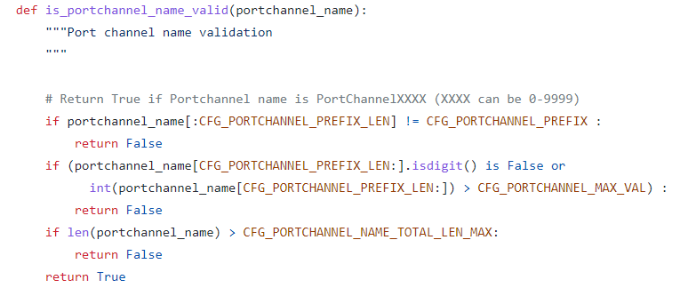
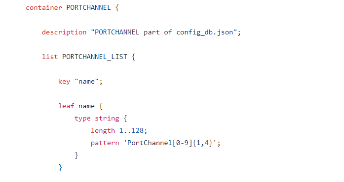
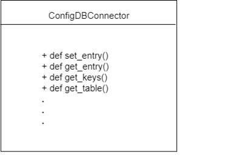
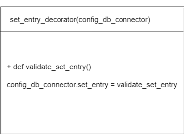
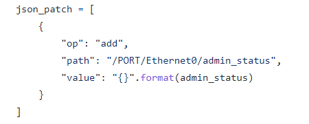

# SONiC Config Update Validation via YANG

## Table of Contents

- [1 Revision](#revision)
- [2 Project Overview](#project-overview)
- [3 Case Study: PortChannel](#case-study)
- [4 Design](#design)
    - [4.1 Design Summary](#design-summary)
    - [4.2 YANG Validation Implementation](#yang-validation-implementation)
    - [4.3 Additional Features](#additional-features)


### Revision

|  Rev  |  Date   |      Author      | Change Description |
| :---: | :-----: | :--------------: | ------------------ |
|  1.0  | 08/2022 |     Isabel Li    | Phase 1 Design     |

## Project Overview  

### Problem Statement
Currently, SONiC config fields updates are validated ad-hoc, and much of the validation criteria are duplicated both in python (hard-coded validation specs) and in YANG models

### Goal
Refactor code to utilize preexisting YANG models for config validation, instead of duplicating the validation specs in both YANG and in python

### Scope

#### Python
1.	SONiC config fields updated via config CLI (e.g. config portchannel add <…>). A comprehensive list of config fields in this project’s scope is as follows, defined in sonic-utilities/config directory:
    - 	AAA 
    - 	ACL 
    - 	BGP
    - 	Console 
    - 	DHCP Relay 
    - 	Drop Counter 
    - 	Dynamic Buffer Management
    - 	ECN
    - 	Feature
    - 	Interface 
    - 	Interface Naming Mode
    - 	Interface Vrf Binding
    - 	IPv6 Link Local
    - 	Kubernetes
    - 	Linux Kernel Dump
    - 	Loopback Interfaces
    - 	VRF
    - 	Management VRF
    - 	Mirroring
    - 	Muxcable
    - 	NAT Enable/Disable YANG Validation
    - 	NTP
    - 	NVGRE
    - 	PBH
    - 	Platform Component Firmware
    - 	PortChannel
    - 	QoS
    - 	sFlow
    - 	SNMP
    - 	Subinterfaces
    - 	Syslog
    - 	VLAN
    - 	Warm Restart
    - 	Watermark
    - 	ZTP
3.	ACL rules: incremental update, delete
4.	pfc
5.	crm
6.	mclag
7.	counterpoll 
8.	Scripts (python)
a.	configlet
b.	db_migrator
c.	dropconfig
d.	mellanox_buffer_migrator
e.	neighbor_advertisor
f.	null_route_helper
g.	hostcfgd

#### C++
1. buffermgrd


## Case Study

### Portchannel

PortChannel config CLI is defined in sonic-utilities/config/main.py. In this file, we find the following config validation:  


However, these specs for validation are also defined in the sonic-portchannel YANG model:  


For PortChannel and many of the config fields listed above, the field validation is unnecessarily duplicated in sonic-utilities/config and in YANG models. The goal of this project is to utilize preexisting YANG models to validate config CLI field updates, without unnecessarily defining separate, redundant validation specs ad-hoc in sonic-utilities.

Some necessary ad-hoc validations are not yet reflected in YANG models. For those missing validations that YANG infrastructure supports, GitHub issues are created to track the progress to filling in these YANG model gaps. In the uncommon scenario where YANG infrastructure is incapable of suporting a certain check, ad-hoc validation will be left in-place. 

During the migration process, we will first leave the ad-hoc validation code in-place, and leave an option to configure type of validation used: ad-hoc or YANG validation. Once YANG validation has stabilized and YANG validation coverage has widened, we will remove the preexisting ad-hoc validation code for non performance-sensitive scenarios. 

In performance-sensitive scenarios, such as warm and fast reboot, ad-hoc validation will remain the mode of validation, as GCU is more time-intensive.


## Design

### Design Summary
Currently, updates to ConfigDB are published via 2 steps:
1.	ad-hoc ConfigDB field validation 
2.	Call to config_db.set_entry(target_value) which blindly pushes the target_value passed via connection to ConfigDB using ConfigDBConnector object

Where YANG models are applicable, this project replaces these two steps with a ConfigDBConnector class decorator which validates the new config using preexisting YANG models before pushing the new config update to ConfigDB.

Why use ConfigDBConnector class decorator:
- 	allows us to preserve the preexisting instance of ConfigDBConnector (no new object initialization is required)
- 	decorates only the necessary instances of ConfigDBConnector with added YANG validation
- 	Non-invasive, all ConfigDBConnector code not writing to ConfigDB (no YANG validation necessary) can be left as-is

### Decorator Graphical Depiction
Existing ConfigDBConnector class and methods-



Decorator only overrides contents of original set_entry() method to include YANG validation



### YANG Validation Implementation
The YANG validation included in our ConfigDBConnector set_entry() decorator leverages the preexisting SONiC Generic Config Updater library, which uses YANG to validate JSON patches that contain write requests to ConfigDB, and then pushes these updates to ConfigDB only after YANG validation passes. 

Sample JSON patch:



Notably, there is a performance penalty when moving from ad-hoc validation to GCU-based YANG validation. Because the bulk of this project focuses on non-performance-sensitive scenarios such as user-based CLI writes to ConfigDB, this sacrifice in performance is deemed worthwhile. Performance-sensitive scenarios will be handled on a case-by-base basis, in some cases leaving ad-hoc validation as necessary. 

#### Performance Comparison 


##### YANG Validation via GCU Performance
```
admin@vlab-01:~$ time sudo config portchannel add PortChannel04
Patch Applier: Patch application starting.
Patch Applier: Patch: [{"op": "add", "path": "/PORTCHANNEL/PortChannel04", "value": {"admin_status": "up", "mtu": "9100", "lacp_key": "auto", "min_links": "1"}}]
Patch Applier: Getting current config db.
Patch Applier: Simulating the target full config after applying the patch.
Patch Applier: Validating target config does not have empty tables, since they do not show up in ConfigDb.
Patch Applier: Sorting patch updates.
Patch Applier: The patch was sorted into 1 change:
Patch Applier:   * [{"op": "add", "path": "/PORTCHANNEL/PortChannel04", "value": {"admin_status": "up", "mtu": "9100", "lacp_key": "auto", "min_links": "1"}}]
Patch Applier: Applying 1 change in order:
Patch Applier:   * [{"op": "add", "path": "/PORTCHANNEL/PortChannel04", "value": {"admin_status": "up", "mtu": "9100", "lacp_key": "auto", "min_links": "1"}}]
Patch Applier: Verifying patch updates are reflected on ConfigDB.
Patch Applier: Patch application completed.

real    0m5.177s
```

To disable GCU-based YANG validation: use the following command:
```
admin@vlab-01:~$ sudo config yang_config_validation disable
Wrote disable yang config validation into CONFIG_DB
```
##### Ad-hoc Validation Performance
```
admin@vlab-01:~$ time sudo config portchannel add PortChannel04

real    0m0.453s
```
### Decorator Pseudo Code
```
def validate_decorator(config_db_connector):
        def validated_set_entry(updated_value):
                update_json_patch = updated_value.to_json_patch()
                GenericConfigUpdater.apply_patch(update_json_patch)
        config_db_connector.set_entry = validated_set_entry

```
For the buffermgrd C++ use case, there are 3 options for YANG validation implementation:
- Call into Python GCU code for YANG validation
- Call into D-bus GCU APIs
- C++ to invoke GCU command line

D-bus GCU APIs are being supported and utilized by the gNMI project; as such, our preferred implementation is to leverage D-bus GCU APIs for this project as well. 

## Additional Features

### Validation Error Output - Exception Handling
Currently, error messages for invalid write requests to ConfigDB are defined on a case-by-case basis. Our goal is to preserve the preexisting error messages, as Exceptions raised and default error messages output by Generic Config Updater YANG validation can be difficult for the client to comprehend. 

To achieve this goal, we do the following:
1.	Take note of the type of Exception raised for a particular error (e.g. GCU would raise a ValueError for an invalid ConfigDB field format)
2.	From the calling function requesting a write to ConfigDB, catch the relevant exception type and output the original error message in exception handling

There may be a scenario where multiple error messages are associated with the same type of exception. In this case, we may combine multiple error messages into one (e.g. `Please check syntax and ensure existence of Portchannelx`). Additionally, where supported, we will add the `yang-error-msg` field in the relevant YANG model(s) which can help distinguish the specific failing YANG constraint. 

### Enable/Disable YANG Validation
In some cases, we may need to disable YANG validation prior to modifying ConfigDB. For example, a bug or an accident may cause YANG validation to improperly fail, thus blocking ConfigDB updates in a production environment. This may lead to a severe livesite. In order to mitigate such a livesite, we add a field to ConfigDB: `yangValidateEnabled`. 

`yangValidateEnabled` is configurable via the SONiC config CLI, set to True by default. This field never undergoes any YANG validation. When the user sets `yangValidateEnabled` to False, YANG validation for updates to Config DB is skipped, and updates to Config DB will proceed without validation.   

CLI to configure YANG config validation: 
`config yang_config_validation <enable|disable>`

Schema for new field:
Add `yang_config_validation` field to DEVICE_METADATA table in ConfigDB:
```
“DEVICE_METADATA”: {
    “localhost”: {
	    'bgp_asn': bgp_asn,
	    'region': region,
	    'yang_config_validation': 'disable'
            .
            .
            .
    }
}

```


