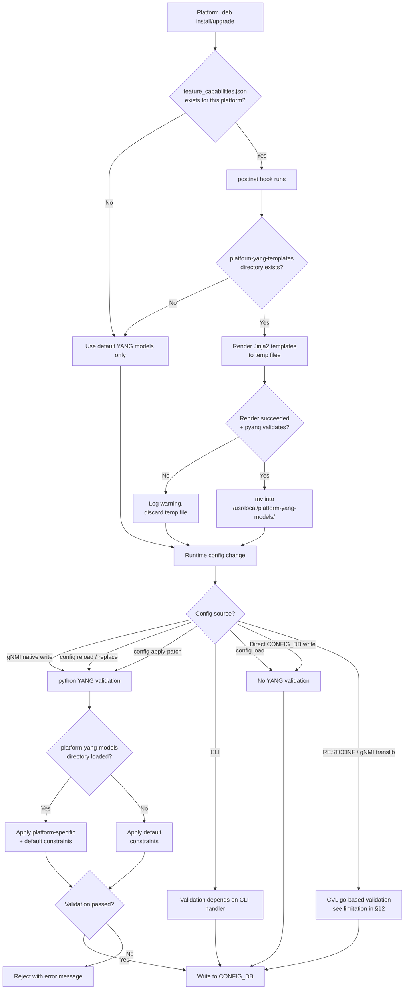

# Platform Specific Config Validation via YANG Models

## Table of Contents
- [1. Revision](#1-revision)
- [2. Scope](#2-scope)
- [3. Definitions/Abbreviations](#3-definitionsabbreviations)
- [4. Overview](#4-overview)
- [5. Requirements](#5-requirements)
- [6. Architecture Design](#6-architecture-design)
  - [6.1 Validation Flow](#61-validation-flow)
- [7. High-Level Design](#7-high-level-design)
  - [7.1 Framework](#71-framework)
  - [7.2 Directory Structure](#72-directory-structure)
  - [7.3 Implementation Details](#73-implementation-details)
  - [7.4 `feature_capabilities.json` schema](#74-feature_capabilitiesjson-schema)
  - [7.5 Design alternative considered: custom validation handlers](#75-design-alternative-considered-custom-validation-handlers)
- [8. SAI API](#8-sai-api)
- [9. Configuration and management](#9-configuration-and-management)
  - [9.1 CLI / YANG model enhancements](#91-cli--yang-model-enhancements)
  - [9.2 Upgrade, downgrade and rollback behavior](#92-upgrade-downgrade-and-rollback-behavior)
- [10. Warmboot and Fastboot Design Impact](#10-warmboot-and-fastboot-design-impact)
- [11. Memory Consumption](#11-memory-consumption)
- [12. Restrictions/Limitations](#12-restrictionslimitations)
- [13. Testing Requirements/Design](#13-testing-requirementsdesign)
  - [13.1 Unit Test cases](#131-unit-test-cases)
  - [13.2 System Test cases](#132-system-test-cases)
  - [13.3 Extending to New Features](#133-extending-to-new-features)
- [14. Open / Action items](#14-open--action-items)

## 1. Revision

| Rev | Date       | Author   | Change Description |
|-----|------------|----------|--------------------|
| v0.1 | 2025-11-18 | Rajath V | Initial version |
| v0.2 | 2025-11-23 | Rajath V | Updated HLD with code snippets and expected behavior |
| v0.3 | 2026-05-19 | Rajath V | Restructured to match `hld_template.md`. Addressed review feedback: hardened postinst (platform name resolution, atomic YANG generation), added `feature_capabilities.json` schema, expanded testing matrix, called out CVL/`config load` gaps as explicit limitations, clarified upgrade/rollback behavior. |

## 2. Scope

This document describes the design for platform-specific configuration validation in SONiC using YANG models generated per platform. The scope includes:

- Platform-specific constraint validation for CONFIG_DB writes that go through the python YANG validation path (`config apply-patch`, `config reload`, `config replace`, gNMI native writes).

This document explicitly does **not** cover:
- Validation on the `go`-based CVL path used by RESTCONF and gNMI translib writes (see section 12).
- A generic ASIC capability-query framework (see section 14 — kept as a future direction).

## 3. Definitions/Abbreviations

| Abbreviation | Description |
|--------------|-------------|
| YANG | Yet Another Next Generation (data modeling language) |
| gNMI | gRPC Network Management Interface |
| CVL | Configuration Validation Library — go-based YANG validator used by translib/CVL clients |
| ARS  | Adaptive Routing and Switching |
| BPF  | Buffer Profile |
| MMU  | Memory Management Unit (ASIC buffer subsystem) |
| postinst | Debian package post-installation script |

## 4. Overview

This document describes the design and guidelines to support platform-specific config validation on SONiC via YANG. The goal is to provide an easy way to add simple, declarative validation checks for new features whose valid ranges differ per platform.

Today, SONiC's YANG models are platform-agnostic — the YANG file is global and has no way of expressing platform-level value differences. With this design, platform-specific YANG deviation modules are generated at package install/upgrade time, then loaded alongside the base models so validation honors platform-specific constraints.

**Example use case**

Consider a buffer profile configuration where `dynamic_th` can take different ranges per platform:
- Tomahawk5: `dynamic_th` range is -7 to 3
- Tomahawk6: `dynamic_th` range is -1 to 3

(Indicative numbers; real values may differ.)

```json
{
    "BUFFER_PROFILE": {
        "my_custom_profile": {
            "pool": "[BUFFER_POOL|ingress_lossless_pool]",
            "xon": "18432",
            "xoff": "20480",
            "size": "38912",
            "dynamic_th": "3"
        }
    }
}
```

CLI handlers can implement bespoke per-platform checks, but JSON/gNMI write paths rely entirely on YANG models for validation. This framework brings platform-specific YANG validation to those paths.

## 5. Requirements

The platform-specific config validation framework shall provide:

1. **Install-time YANG generation**: Generate platform-specific YANG models at package install/upgrade time via jinja2 templates.
2. **Platform awareness**: Support different constraint ranges per platform via `feature_capabilities.json`.
3. **Backward compatibility**: Platforms without `feature_capabilities.json` see no behavior change.
4. **Framework extensibility**: New platform-specific checks can be added by feature owners with a single template plus a JSON entry.
5. **Seamless integration**: Plug into the existing python YANG validation flow; load generated YANG models if `/usr/local/platform-yang-models` exists.
6. **Atomic install**: A broken render must not produce a half-installed `.yang` file that breaks model loading.

## 6. Architecture Design

The framework is based on two key components:

1. **`feature_capabilities.json`** — Platform-specific files containing constraint definitions.
2. **Jinja2 templates** — YANG deviation templates that get rendered at package install time into platform-specific YANG modules.

This approach allows constraints to be added only on platforms that need them, eliminating unnecessary overhead for platforms that can use default values.

This is especially important for features like ARS where valid limits are platform-specific. Without this framework, CONFIG_DB accepts all data and the feature fails silently with errors visible only in syslogs. The framework guardrails at the YANG validation level, rejecting out-of-bound values before they reach CONFIG_DB.

### 6.1 Validation Flow

The following diagram illustrates the platform-specific validation flow:



The flow can be summarized as:

**`feature_capabilities.json` + YANG template → generated platform YANG → runtime validation on python paths**

## 7. High-Level Design

### 7.1 Framework

The design appends an additional set of YANG modules (rendered at install/upgrade time) to the existing python YANG validation flow. A platform `.deb` postinst hook reads the platform's `feature_capabilities.json` and renders one or more jinja2 templates into deviation YANG modules. The python YANG loader picks these up from `/usr/local/platform-yang-models/` on next load.

### 7.2 Directory Structure

**Source layout (in `sonic-buildimage`):**

```text
src/sonic-yang-models/
├── yang-models/                    # Static YANG files (existing)
│   ├── sonic-buffer-profile.yang
│   ├── sonic-vlan.yang
│   └── ...
├── yang-templates/                 # Build-time templates (existing)
│   ├── sonic-acl.yang.j2
│   ├── sonic-extension.yang.j2
│   └── ...
├── platform-yang-templates/        # NEW: install-time templates
│   └── sonic-buffer-profile-capability.yang.j2
└── setup.py                        # Modified to package platform-yang-templates/
```

**Runtime layout (after postinst hook):**

```text
/usr/local/
├── yang-models/                            # Base YANG models (from wheel)
│   ├── sonic-ars.yang
│   ├── sonic-port.yang
│   └── ...
├── platform-yang-templates/                # Templates (from wheel)
│   └── sonic-buffer-profile-capability.yang.j2
└── platform-yang-models/                   # Generated YANG (created at install time)
    └── sonic-buffer-profile-capability.yang

/usr/share/sonic/device/x86_64-<platform>/
├── feature_capabilities.json               # Input data for templates
├── hwsku.json
└── ...
```

### 7.3 Implementation Details

**postinst hook for platform-specific YANG generation:**

```bash
#!/bin/bash

# Generate platform-specific YANG models from templates
TEMPLATE_DIR="/usr/local/platform-yang-templates"
OUTPUT_DIR="/usr/local/platform-yang-models"

# Resolve the canonical platform name. sonic-cfggen is not yet available at
# postinst time. Prefer /host/machine.conf (onie_platform); fall back to
# parsing the postinst script filename.
PLATFORM_NAME=""
if [ -f /host/machine.conf ]; then
    PLATFORM_NAME=$(awk -F= '/^onie_platform=/{print $2}' /host/machine.conf)
fi
if [ -z "$PLATFORM_NAME" ]; then
    SCRIPT_NAME=$(basename "$0")
    PLATFORM_SUFFIX=$(echo "$SCRIPT_NAME" | sed 's/^sonic-platform-//' | sed 's/\.postinst$//')
    PLATFORM_NAME="x86_64-${PLATFORM_SUFFIX}"
    PLATFORM_NAME=$(echo "$PLATFORM_NAME" | sed 's/nexthop-/nexthop_/')
fi
FEATURE_CAPABILITIES_JSON="/usr/share/sonic/device/${PLATFORM_NAME}/feature_capabilities.json"

if [ -n "$PLATFORM_NAME" ] && [ -d "$TEMPLATE_DIR" ] && [ -f "$FEATURE_CAPABILITIES_JSON" ] && command -v j2 >/dev/null 2>&1; then
    mkdir -p "$OUTPUT_DIR"

    # Generate YANG files atomically: render to a temp file in the same dir,
    # validate it is non-empty (and parseable by pyang when available), then
    # mv into place. This prevents a half-baked .yang from being loaded by
    # sonic_yang at validation time.
    for template in "$TEMPLATE_DIR"/*.yang.j2; do
        [ -e "$template" ] || continue
        filename=$(basename "$template" .j2)
        output_file="$OUTPUT_DIR/$filename"
        tmp_out=$(mktemp "${OUTPUT_DIR}/.${filename}.XXXXXX")

        if j2 "$template" "$FEATURE_CAPABILITIES_JSON" > "$tmp_out" 2>/dev/null \
            && [ -s "$tmp_out" ] \
            && { ! command -v pyang >/dev/null 2>&1 || pyang -p "$OUTPUT_DIR:/usr/local/yang-models" "$tmp_out" >/dev/null 2>&1; }; then
            mv "$tmp_out" "$output_file"
            echo "Generated: $output_file"
        else
            rm -f "$tmp_out"
            echo "Warning: failed to generate or validate $output_file" >&2
        fi
    done
fi
```

Notes:
- The `postinst` script runs on every package install **and** upgrade. It does not run on rollback to an earlier image (the previous `.deb`'s postinst was already executed when that image was first installed). See section 9.2 for the upgrade/rollback story.
- Platform name resolution prefers `/host/machine.conf` over filename parsing because the filename heuristic is vendor-naming-specific. The script-name fallback is kept for environments where `/host/machine.conf` isn't populated yet.
- Generation is **atomic**: each `.yang.j2` is rendered to a hidden temp file in the same directory, validated (non-empty + `pyang` parse if available), and `mv`'d into place. A render failure leaves the previous good file untouched and logs a warning to the postinst log.

**Example `feature_capabilities.json`:**

```json
{
    "mmu_capabilities": {
        "bpf_dynamic_th_low": -7,
        "bpf_dynamic_th_high": 3
    }
}
```

**Example jinja2 template (`sonic-buffer-profile-capability.yang.j2`):**

```yang
module sonic-buffer-profile-capability {
    yang-version 1.1;
    namespace "http://github.com/sonic-net/sonic-buffer-profile-capability";
    prefix bpf-capability;

    import sonic-buffer-profile {
        prefix bpf;
    }

    description "SONiC buffer profile platform-specific YANG model - generated from feature_capabilities.json";

    revision 2025-11-12 {
        description "Initial revision generated from feature_capabilities.json at installation time";
    }

    
    
    

    // Platform-specific deviations - BUFFER_PROFILE uses bpf_dynamic_th range from mmu_capabilities
    deviation "/bpf:sonic-buffer-profile/bpf:BUFFER_PROFILE/bpf:BUFFER_PROFILE_LIST/bpf:dynamic_th" {
        deviate replace {
            type int32 {
                range "{{ bpf_dynamic_th_low }}..{{ bpf_dynamic_th_high }}" {
                    error-message "Invalid dynamic_th for this platform. dynamic_th should be in the range [{{ bpf_dynamic_th_low }}, {{ bpf_dynamic_th_high }}]";
                }
            }
        }
        description "Platform-specific deviation for dynamic_th";
    }
    
    // No buffer profile capability data - skip validation.
    
}
```

**Additional required changes:**

1. Ensure the jinja2 templates are packaged by the `sonic-yang-models` wheel via `setup.py`:

```python
    data_files=[
        ('platform-yang-templates', glob.glob('./platform-yang-templates/*.yang.j2')),
    ],
```

2. Modify `sonic_yang.py` and `sonic_yang_ext.py` to additionally load generated YANG files from `/usr/local/platform-yang-models/`:

```python
    generated_yang_dir = "/usr/local/platform-yang-models"
    if os.path.exists(generated_yang_dir):
        generated_yang = glob.glob(generated_yang_dir + "/*.yang")
        py.extend(generated_yang)
```

### 7.4 `feature_capabilities.json` schema

`feature_capabilities.json` is a flat JSON object whose top-level keys group capabilities by feature area. Each top-level key follows the naming convention `<feature>_capabilities` and maps to a dict of scalar values consumed by that feature's template.

```text
{
    "<feature_a>_capabilities": {
        "<knob_1>": <int|string|bool>,
        "<knob_2>": <int|string|bool>,
        ...
    },
    "<feature_b>_capabilities": {
        ...
    }
}
```

Rules:
- Top-level keys are optional. A template that doesn't see its expected key must render to a no-op (the `` branch in the BPF template is the canonical example).
- Values must be scalars or simple lists — no nested dicts. Each feature's template is the source of truth for what knobs it consumes.
- Unknown keys are ignored. This allows a single `feature_capabilities.json` to carry capabilities for multiple features without coupling them.

A formal JSON Schema is intentionally not committed yet — each feature owner documents its own capability keys in the template's header comment until the set stabilizes (see section 14).

### 7.5 Design alternative considered: custom validation handlers

@venkatmahalingam suggested implementing platform-specific value-range checks through the custom validation handler mechanism in `sonic-extension.yang.j2` (a python callout invoked from YANG). This was considered and not adopted as the primary mechanism because:

- Custom validation handlers are imperative python and require coordinating cross-repo changes for each new check.
- YANG `deviation` statements are the canonical YANG-native mechanism for narrowing a base type's range per platform; they keep the constraint declarative and discoverable via standard YANG tooling (`pyang`, `libyang`).
- The two approaches are complementary. Constraints that **can** be expressed as deviations are expressed as deviations (this framework). Constraints that need cross-table or stateful logic should still be implemented as custom handlers.

## 8. SAI API

No new SAI APIs are introduced or modified. This framework validates CONFIG_DB inputs in user space (libyang via python) before any SAI call is made.

A future-scope discussion of using SAI capability queries as a stronger source of truth for validation lives in section 14; it is not in scope for this design.

## 9. Configuration and management

**Triggers that exercise the new framework (python YANG path):**

1. `config apply-patch`
2. `config reload -y`
3. `config replace`
4. gNMI **native** write path (e.g. `gnmi_set` against sonic-net's native gNMI server)

**Triggers that do NOT exercise it (see §12 limitations):**

1. CLI based config — validation depends on the CLI handler.
2. Direct CONFIG_DB writes — no YANG validation at all.
3. `config load` — bypasses YANG validation.
4. RESTCONF and gNMI **translib** write paths — these run on the `go`-based CVL stack which is independent of this framework.

### 9.1 CLI / YANG model enhancements

No CLI changes. Generated YANG deviation modules are picked up automatically by `sonic_yang.py` and `sonic_yang_ext.py` once `/usr/local/platform-yang-models/` exists.

### 9.2 Upgrade, downgrade and rollback behavior

- **Fresh install**: postinst runs, generates and installs platform YANG into `/usr/local/platform-yang-models/`.
- **Image upgrade**: the new image's platform `.deb` postinst runs and **re-renders** all templates against the new `feature_capabilities.json`. Generation is atomic, so a failed render leaves the previous good YANG file in place.
- **Downgrade / rollback to a previous image**: the previous image already has its own `/usr/local/platform-yang-models/` baked in; the running rootfs swap restores those files. No re-execution of postinst is needed.
- **Feature capability removed across images**: if a future image drops a `<feature>_capabilities` key from `feature_capabilities.json`, the template's `` branch renders an empty no-op YANG module. The generated `.yang` file may still exist on disk from a previous install, but it carries no `deviation` statements and is therefore a no-op for validation. Operators should not see a behavior change.
- **Template removed across images**: if a template is removed from `platform-yang-templates/`, the corresponding generated `.yang` is not rewritten by the new postinst run, but it also won't be regenerated. It can be left in place as a stale no-op or cleaned up by a future image's postinst (out of scope here).

## 10. Warmboot and Fastboot Design Impact

No impact. The framework affects user-space CONFIG_DB validation at configuration time only. YANG model loading happens lazily when `sonic_yang.SonicYang` is instantiated; it does not run in the warmboot / fastboot critical path and adds no warmboot or fastboot delay.

## 11. Memory Consumption

Minimal. Each generated `.yang` file is on the order of 1–2 KB on disk and adds a comparable footprint to the libyang module tree when loaded. With one template per feature area and a small number of feature areas, the steady-state increase is well under 100 KB of RAM per process that instantiates `SonicYang`.

## 12. Restrictions/Limitations

| # | Limitation | Notes / mitigation |
|---|------------|--------------------|
| 1 | CLI-based config bypasses YANG validation | Existing limitation; CLI handlers do their own checks |
| 2 | Direct CONFIG_DB writes bypass YANG validation | Existing limitation; out of scope |
| 3 | `config load` bypasses all YANG validation | Operators are recommended to use `config apply-patch` or `config replace` instead. Closing this gap requires changes to the `config load` codepath and is tracked as a follow-up (see §14). |
| 4 | RESTCONF / gNMI **translib** writes use the `go`-based CVL stack and do **not** load these generated deviation modules | Significant gap given gNMI translib's growing usage. The CVL stack would need a parallel deviation-loading mechanism (or a shared library) to pick up `/usr/local/platform-yang-models/`. Tracked in §14. |
| 5 | A platform without `feature_capabilities.json` gets no platform-specific validation | By design; preserves backward compatibility |
| 6 | Operators see an additional `platform-yang-models/` directory of generated artifacts | Acceptable cost for declarative platform constraints. Files are clearly marked as generated in their `description` field |
| 7 | postinst depends on `j2` (jinja2 CLI) being on the runtime image | `j2` is part of the standard SONiC image. Postinst no-ops if absent rather than failing the package install |

## 13. Testing Requirements/Design

### 13.1 Unit Test cases

**Template rendering:**
- Render `sonic-buffer-profile-capability.yang.j2` with a full `feature_capabilities.json` (both `bpf_dynamic_th_low` and `bpf_dynamic_th_high` present) → produces a `deviation` block with the expected range.
- Render with `mmu_capabilities` absent → template hits the `` branch and produces a no-op module.
- Render with `mmu_capabilities` present but missing one of `bpf_dynamic_th_low` / `bpf_dynamic_th_high` → render fails or template generates a clearly invalid range; postinst's `pyang` check should reject it.

**Postinst hardening:**
- `/host/machine.conf` missing → falls back to script-name parsing.
- `feature_capabilities.json` missing → postinst is a no-op (no generated files, no error).
- `feature_capabilities.json` contains corrupt JSON → `j2` exits non-zero, temp file is discarded, previous good `.yang` is preserved.
- `j2` not installed → postinst skips generation cleanly with a warning.

**Loader:**
- `sonic_yang.py` and `sonic_yang_ext.py` correctly enumerate `*.yang` files in `/usr/local/platform-yang-models/` when present, and skip the load when the directory does not exist.

### 13.2 System Test cases

**Positive:**
- On a platform with `feature_capabilities.json`, `config apply-patch` with an in-range `dynamic_th` succeeds and writes to CONFIG_DB.
- `config reload -y` of a sound config succeeds.
- gNMI native `gnmi_set` with an in-range value succeeds.

**Negative:**
- `config apply-patch` with `dynamic_th` outside the platform range is rejected with the error message defined in the `deviation`.
- `config replace` with an out-of-range value is rejected at validation time before CONFIG_DB is touched.
- gNMI native `gnmi_set` with an out-of-range value returns an error and CONFIG_DB is unchanged.

**Backward compatibility:**
- On a platform without `feature_capabilities.json`, validation behavior matches the pre-framework image.

**Upgrade:**
- Image A (range -7..3) → Image B (range -1..3): after upgrade, a value of `-5` that was valid in A is rejected by `config apply-patch` in B.

### 13.3 Extending to New Features

New feature owners can extend the framework by following these steps:

1. Ensure the target platform's postinst already contains the generation block. If not, add it (it's identical across platforms).
2. Create or append to `/usr/share/sonic/device/<platform>/feature_capabilities.json` with a `<feature>_capabilities` top-level key and the scalar knobs that template will consume.
3. Add `sonic-<feature>-capability.yang.j2` to `src/sonic-yang-models/platform-yang-templates/`. The template should:
    - Wrap its `deviation` statements in `` so platforms without the capability render a no-op.
    - Document the expected `feature_capabilities.json` keys in a header comment.
4. Add unit tests covering both the populated and the `` no-op rendering of the new template.

## 14. Open / Action items

1. **Close the CVL (translib) gap (limitation §12.4).** Either teach the `go` CVL stack to load deviation modules from `/usr/local/platform-yang-models/`, or expose a shared validation library that both python and CVL clients use. Owner / timeline TBD.
2. **Close the `config load` gap (limitation §12.3).** Either route `config load` through the same YANG validation pipeline, or document operator guidance to use `config apply-patch` / `config replace`.
3. **Formalize the `feature_capabilities.json` schema.** Once a few features have on-boarded onto this framework, capture the shared shape in a JSON Schema and validate `feature_capabilities.json` at postinst time before rendering.
4. **SAI capability querying as a long-term direction.** A more robust capability framework would query SAI/ASIC capabilities at runtime, publish them to `STATE_DB`, and have the validation layer consult that. This is independent of the present design but worth pursuing as a follow-on:
    - Add SAI APIs (or wrappers) to query ASIC-specific capabilities.
    - Populate STATE_DB from those queries (likely `orchagent`).
    - Extend the python YANG validation layer to consult STATE_DB at validation time, so checks reflect actual ASIC capabilities rather than baked-in JSON.
    - Mirror the same on the CVL/translib side once §14.1 lands.
