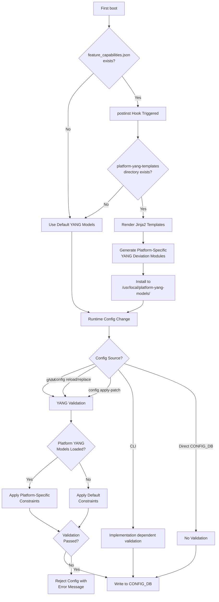

# Platform Specific Config Validation via YANG Models

## Table of Contents
- [Revision](#revision)
- [Scope](#scope)
- [Abbreviations](#abbreviations)
- [1. Overview](#1-overview)
- [2. Requirements](#2-requirements)
- [3. Architecture Design](#3-architecture-design)
  - [3.1 Validation Flow](#31-validation-flow)
- [4. High-Level Design](#4-high-level-design)
  - [4.1 Framework](#41-framework)
  - [4.2 Directory Structure](#42-directory-structure)
  - [4.3 Implementation Details](#43-implementation-details)
- [6. Configuration and Management](#6-configuration-and-management)
- [7. YANG Model Enhancements](#7-yang-model-enhancements)
- [8. Restrictions/Limitations](#8-restrictionslimitations)
- [9. Testing Requirements/Design](#9-testing-requirementsdesign)

## Revision

| Rev | Date       | Author   | Change Description |
|-----|------------|----------|-------------------|
| v0.1 | 2025-11-18 | Rajath V | Initial version   |
| v0.2 | 2025-11-23 | Rajath V | Updated HLD with code snippets and expected behavior |

## Scope

This document describes the design for platform-specific configuration validation in SONiC using YANG models generated per platform. The scope includes:

- Platform-specific constraint validation based on vendor requirements / platforms

## Abbreviations

| Abbreviation | Description |
|--------------|-------------|
| YANG | Yet Another Next Generation (data modeling language) |
| gNMI | gRPC Network Management Interface |
| ARS  | Adaptive Routing and Switching |

## 1. Overview

This document describes the broad guidelines to support platform-specific config validation on SONiC for YANG models. The goal of this framework is to provide an easy way to have simple validation checks for new features based on platform constraints.

The current YANG validation design is platform agnostic, since the YANG file is global and does not have a way to handle platform level changes for values. With this design, we can now add YANG models at the first boot which have values specific to that model, instead of the generic values handled before.

**Example Use Case:**

Consider a buffer profile configuration where `dynamic_th` can take different ranges per platform:
- Tomahawk5: `dynamic_th` range is -7 to 3
- Tomahawk6: `dynamic_th` range is -1 to 3

```json
{
    "BUFFER_PROFILE": {
        "my_custom_profile": {
            "pool": "[BUFFER_POOL|ingress_lossless_pool]",
            "xon": "18432",
            "xoff": "20480",
            "size": "38912",
            "dynamic_th": "3"
        }
    }
}
```

While CLI handlers could implement flexibility to check constraints based on platform, JSON/gNMI relies entirely on YANG models for validation. This framework enables platform-specific YANG validation.

## 2. Requirements

The platform-specific config validation framework shall provide:

1. **Runtime YANG Generation**: Generate platform-specific YANG models at package install time using jinja2 templates
2. **Platform Awareness**: Support different constraint ranges for different platforms via `feature_capabilities.json`
3. **Backward Compatibility**: Existing validation remains unchanged for platforms without capability definitions
4. **Framework Extensibility**: Easy addition of new platform-specific checks by feature owners
5. **Seamless Integration**: Integrate with existing YANG validation flow, allowing for additional checks for generated YANG models if platform specific yang models folder is present.

## 3. Architecture Design

The framework is based on two key components:
1. **feature_capabilities.json**: Platform-specific files containing constraint definitions
2. **Jinja2 templates**: YANG templates that generate platform-specific deviation modules at runtime

This approach allows checks to be added only on platforms that need them, eliminating unnecessary overhead for platforms that can use default values.

This is especially important for features like ARS where limits are specified per platform. Without this framework, CONFIG_DB accepts all data, but functionality fails silently with errors only visible in syslogs. A better approach is to guardrail at the YANG validation level, rejecting out-of-bound values before they reach CONFIG_DB.

### 3.1 Validation Flow

The following diagram illustrates the platform-specific validation flow:



The flow can be summarized as:

**feature_capabilities.json + YANG template -> Generated YANG -> Runtime validation**

## 4. High-Level Design

### 4.1 Framework

The design follows the current YANG validation flow and appends additional checks. A postinst hook is implemented that is platform-specific, checking whether a `feature_capabilities.json` file exists to generate the YANG file using jinja2 templates.

### 4.2 Directory Structure

**Source Directory Structure:**

```bash
src/sonic-yang-models/
├── yang-models/                    # Static YANG files
│   ├── sonic-buffer-profile.yang
│   ├── sonic-vlan.yang
│   └── ...
├── yang-templates/                 # Build-time templates (existing)
│   ├── sonic-acl.yang.j2          # Rendered during build for py/cvl variants
│   ├── sonic-extension.yang.j2
│   └── ...
├── platform-yang-templates/        # NEW: Runtime templates
│   ├── sonic-buffer-profile-capabilities.yang.j2
│
└── setup.py                        # Modified to package platform-yang-templates/
```

**Runtime Directory Structure (after postinst hook):**

```bash
/usr/local/
├── yang-models/                      # Base YANG models (from wheel)
│   ├── sonic-ars.yang
│   ├── sonic-port.yang
│   └── ...
├── platform-yang-templates/          # Platform-specific templates (from wheel)
│   ├── sonic-buffer-profile-capabilities.yang.j2
└── platform-yang-models/            # Generated YANG (created at install time)
    ├── sonic-buffer-profile-capabilities.yang

/usr/share/sonic/device/x86_64-<platform>/
├── feature_capabilities.json         # Input data for templates
├── hwsku.json
└── ...
```

### 4.3 Implementation Details

**postinst hook for platform-specific YANG generation:**

```bash
#!/bin/bash

# Generate platform-specific YANG models from templates
TEMPLATE_DIR="/usr/local/platform-yang-templates"
OUTPUT_DIR="/usr/local/platform-yang-models"
# Dynamically determine platform name from the script name.
SCRIPT_NAME=$(basename "$0")
PLATFORM_SUFFIX=$(echo "$SCRIPT_NAME" | sed 's/^sonic-platform-//' | sed 's/\.postinst$//')
PLATFORM_NAME="x86_64-${PLATFORM_SUFFIX}"
PLATFORM_NAME=$(echo "$PLATFORM_NAME" | sed 's/nexthop-/nexthop_/')
FEATURE_CAPABILITIES_JSON="/usr/share/sonic/device/${PLATFORM_NAME}/feature_capabilities.json"

# Check if all required components exist
if [ -d "$TEMPLATE_DIR" ] && [ -f "$FEATURE_CAPABILITIES_JSON" ] && command -v j2 >/dev/null 2>&1; then
    mkdir -p "$OUTPUT_DIR"

    # Generate YANG files from templates
    for template in "$TEMPLATE_DIR"/*.yang.j2; do
        [ -e "$template" ] || continue
        filename=$(basename "$template" .j2)
        output_file="$OUTPUT_DIR/$filename"

        if j2 "$template" "$FEATURE_CAPABILITIES_JSON" > "$output_file" 2>/dev/null; then
            echo "Generated: $output_file"
        else
            echo "Warning: Failed to generate $output_file" >&2
        fi
    done
fi
```

Note: The above snippet uses `PLATFORM_SUFFIX` and `PLATFORM_NAME` to dynamically determine the platform name from the postinst script name. This assumes the postinst script name follows a specific naming convention (e.g., `sonic-platform-nexthop-4010-r0.postinst`).

**Example feature_capabilities.json:**

```json
{
    "mmu_capabilities": {
            "bpf_dynamic_th_low": -7,
            "bpf_dynamic_th_high": 3
    }
}
```

**Example jinja2 template:**

```json
module sonic-buffer-profile-capability {
    yang-version 1.1;
    namespace "http://github.com/sonic-net/sonic-buffer-profile-capability";
    prefix bpf-capability;

    import sonic-buffer-profile {
        prefix bpf;
    }

    description "SONIC buffer profile platform-specific YANG model - generated from feature_capabilities.json";

    revision 2025-11-12 {
        description "Initial revision Generated from feature_capabilities.json at installation time";
    }

    
    
    

    // Platform-specific deviations - BUFFER_PROFILE uses bpf_dynamic_th range from mmu_capabilities
    deviation "/bpf:sonic-buffer-profile/bpf:BUFFER_PROFILE/bpf:BUFFER_PROFILE_LIST/bpf:dynamic_th" {
        deviate replace {
            type int32 {
                range "{{ bpf_dynamic_th_low }}..{{ bpf_dynamic_th_high }}" {
                    error-message "Invalid dynamic_th for this platform. dynamic_th should be in the range [{{ bpf_dynamic_th_low }}, {{ bpf_dynamic_th_high }}]";
                }
            }
        }
        description "Platform-specific deviation for dynamic_th";
    }
    
    // No buffer profile capability data - skip validation.
    
}
```

**Additional required changes:**

1. Ensure the new jinja2 templates are packaged by `sonic-yang-models` wheel by adding to `setup.py`:
```python
    data_files=[
        ('platform-yang-templates', glob.glob('./platform-yang-templates/*.yang.j2')),
    ],
```

2. Modify `sonic_yang.py` and `sonic_yang_ext.py` to load generated YANG files from `/usr/local/platform-yang-models/`:
```python
    generated_yang_dir = "/usr/local/platform-yang-models"
    if os.path.exists(generated_yang_dir):
        generated_yang = glob.glob(generated_yang_dir + "/*.yang")
        py.extend(generated_yang)
```

## 5. Configuration and Management

**Cases where the new framework will be triggered:**

1. `config apply-patch`
2. `config reload -y`
3. `config replace`
4. `gNMI` related config changes (like `gnmi_set`)

**Cases where the new framework will NOT be triggered:**

1. CLI based config - CLI can have validation checks in code itself if need be, depends on how the feature was implemented in the first place.
2. Manual writes to CONFIG_DB - no validation is hit, invalid values only appear in syslogs
3. `config load` - bypasses all validation, so YANG checks are never hit

## 6. YANG Model Enhancements

Platform-specific YANG deviation modules are generated at runtime from jinja2 templates. No changes to existing static YANG models are required.

The generated YANG modules use the YANG `deviation` statement to override constraints in base YANG models for specific platforms.

## 7. Restrictions/Limitations

- CLI-based config bypasses YANG validation (handled by CLI code)
- Manual CONFIG_DB writes bypass validation
- `config load` bypasses all validation
- Platform must have `feature_capabilities.json` defined for platform-specific validation to apply

## 8. Testing Requirements/Design

### 8.1 Framework Testing
- Verify jinja2 template rendering with feature_capabilities.json
- Test postinst hook execution on package installation
- Validate generated YANG file loading by sonic_yang.py

### 8.2 Validation Testing
- Test out-of-range values are rejected with appropriate error messages
- Verify `config apply-patch` triggers platform-specific validation
- Verify `config reload` triggers platform-specific validation
- Test gNMI config changes trigger platform-specific validation
- Verify platforms without feature_capabilities.json use default validation

### 8.3 Extending to New Features

New feature owners can extend the framework by following these steps:

1. Check if the platform postinst file already has the code for checking and generating platform-specific YANG files. If not, add this code.
2. Create a new `feature_capabilities.json` file or add to the existing file. Add a key `<feature>_capabilities` with values being the custom ranges or non-default values for that platform.
3. Create a `sonic-<feature>-capability.yang.j2` file in `sonic-buildimage/src/sonic-yang-models/platform-yang-templates/` directory. This will be used to generate the new `<feature>-capability.yang` in the `/usr/local/platform-yang-models` directory on the box.
