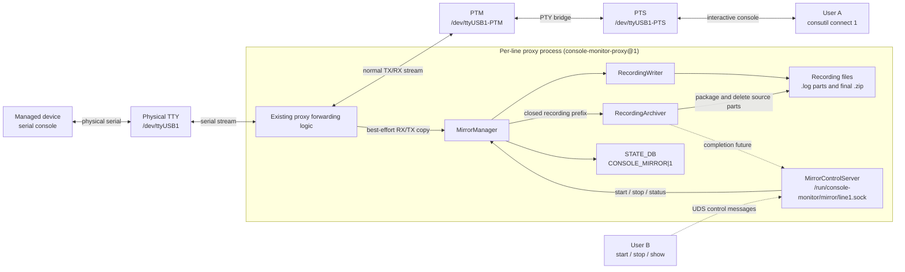
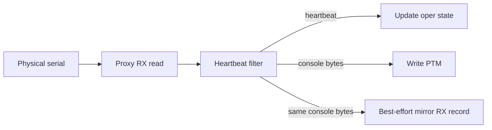
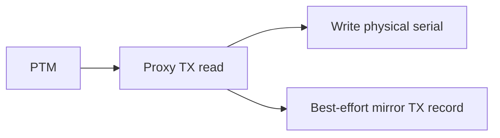

# SONiC Console Mirror
## High Level Design Document

### Revision

| Rev | Date | Author | Change Description |
| :---: | :---------: | :--------: | ------------------ |
| 0.1 | 06/13/2026 | William Zhang | Initial version |

---

## Table of Contents

- [SONiC Console Mirror](#sonic-console-mirror)
  - [High Level Design Document](#high-level-design-document)
    - [Revision](#revision)
  - [Table of Contents](#table-of-contents)
  - [Terminology and Abbreviations](#terminology-and-abbreviations)
  - [1. Feature Overview](#1-feature-overview)
    - [1.1 Feature Requirements](#11-feature-requirements)
  - [2. Design Overview](#2-design-overview)
    - [2.1 Architecture](#21-architecture)
    - [2.2 Design Principles](#22-design-principles)
    - [2.3 User Model](#23-user-model)
  - [3. Detailed Design](#3-detailed-design)
    - [3.1 Proxy Changes](#31-proxy-changes)
      - [3.1.1 MirrorManager](#311-mirrormanager)
      - [3.1.2 RecordingWriter](#312-recordingwriter)
      - [3.1.3 RecordingArchiver](#313-recordingarchiver)
      - [3.1.4 MirrorControlServer](#314-mirrorcontrolserver)
    - [3.2 Mirror Control Message Protocol](#32-mirror-control-message-protocol)
    - [3.3 RX Mirroring](#33-rx-mirroring)
    - [3.4 TX Mirroring](#34-tx-mirroring)
    - [3.5 Recording File Format](#35-recording-file-format)
      - [3.5.1 File Path](#351-file-path)
      - [3.5.2 File Rotation](#352-file-rotation)
      - [3.5.3 Header Lines](#353-header-lines)
      - [3.5.4 Data Record Lines](#354-data-record-lines)
      - [3.5.5 Event Lines](#355-event-lines)
      - [3.5.6 Payload Escaping Rules](#356-payload-escaping-rules)
    - [3.6 Error Handling](#36-error-handling)
    - [3.7 Service Lifecycle](#37-service-lifecycle)
      - [Proxy Startup](#proxy-startup)
      - [Mirror Start](#mirror-start)
      - [Mirror Stop](#mirror-stop)
      - [Automatic Mirror Stop](#automatic-mirror-stop)
      - [Proxy Shutdown](#proxy-shutdown)
  - [4. Database Changes](#4-database-changes)
    - [4.1 STATE\_DB](#41-state_db)
      - [4.1.1 CONSOLE\_MIRROR Table](#411-console_mirror-table)
  - [5. CLI](#5-cli)
    - [5.1 Start Mirroring](#51-start-mirroring)
    - [5.2 Stop Mirroring](#52-stop-mirroring)
    - [5.3 Show Mirror Status](#53-show-mirror-status)
  - [6. Example Workflow](#6-example-workflow)
    - [6.1 Manual Stop](#61-manual-stop)
    - [6.2 Automatic Stop](#62-automatic-stop)
  - [7. Security Considerations](#7-security-considerations)
  - [8. Future Work](#8-future-work)
  - [9. References](#9-references)

---

## Terminology and Abbreviations

| Term | Definition |
|------|------------|
| DCE | Data Communications Equipment - Console Server side |
| DTE | Data Terminal Equipment - SONiC switch (managed device) side |
| Mirror | A best-effort copy of serial console traffic for diagnostics |
| PTM | Pseudo Terminal Master - master side of a PTY pair |
| PTS | Pseudo Terminal Slave - slave side of a PTY pair |
| PTY | Pseudo Terminal - virtual terminal interface |
| PTY Bridge | Process that creates and bridges PTY pairs using socat |
| Proxy | Per-line process that owns the physical serial device and bridges it to PTM |
| RX | Data received by the console server from the managed device |
| TX | Data sent from the console user toward the managed device |
| UDS | Unix domain socket |

---

## 1. Feature Overview

Diagnosing issues with the serial console can be challenging because the connection is exclusive, so only the user on that line knows what's happening. The Console Mirror feature allows an operator on the SONiC console server to start and stop recording traffic for a specific console line. The feature is intended for troubleshooting serial console issues without taking over the active console session.

The existing console connection model is preserved. User A may already be connected to line 1 through the normal `consutil connect 1` path. User B can independently start mirroring for line 1 on the SONiC console server. Mirrored traffic is written to local recording files for later inspection.

### 1.1 Feature Requirements

The feature provides the following capabilities:

* Start recording for a specific console line.
* Stop recording for a specific console line.
* Record RX data received from the managed device.
* Record TX data sent by the active console user.
* Store the byte stream in a file format that preserves direction and timestamp information.
* Support configurable timestamp resolution.
* Allow only one mirror owner per line.
* Automatically stop each mirror session after a finite timeout, defaulting to 24 hours.
* Package all rotated log parts into one ZIP archive after recording stops.

---

## 2. Design Overview

### 2.1 Architecture

The design extends the existing console monitor DCE architecture. The per-line proxy remains the only process that owns the physical serial device. The PTY Bridge and the normal `consutil` connection flow remain unchanged.



### 2.2 Design Principles

* **Non-interference** - Mirroring must not change the console byte stream, line ownership, or active console session behavior.
* **Single active mirror owner** - At most one mirror session can be active per line.
* **Best-effort observability** - Recording should be reliable under normal operation, but slow disk I/O must not block the proxy data path.
* **Bounded lifetime** - Every mirror session has a finite auto-stop timeout. The default timeout is 24 hours.
* **Asynchronous finalization** - A stopped mirror becomes idle before archive creation completes. Archiving runs outside the serial forwarding path.
* **Text-first storage** - The recording format is a line-oriented UTF-8 text log. Printable characters are written as text, while control bytes, ANSI escape bytes, and invalid UTF-8 bytes are represented using printable escape sequences.
* **Minimal architecture change** - The existing PTY Bridge and `consutil connect` model are retained.
* **Operational state only** - Mirror configuration is not persisted and is not restored after reboot.

### 2.3 User Model

There are two independent users in the primary use case:

* User A owns the active interactive console session on line 1.
* User B starts mirroring line 1 from the SONiC console server.

User B does not become a second interactive console user. User B cannot write data to the managed device through the mirror path. The mirror path is read-only with respect to serial traffic and records TX data only because the proxy already observes TX bytes on their way from PTM to the physical serial device.

---

## 3. Detailed Design

### 3.1 Proxy Changes

The proxy is extended with a `MirrorManager` object. The proxy already observes both byte-stream directions:

* RX: physical serial device to PTM.
* TX: PTM to physical serial device.

The `MirrorManager` receives a copy of these bytes and records them with direction and timestamp metadata. It does not own the serial device and does not participate in forwarding decisions.

The proxy adds the following internal components:

| Component | Description |
|-----------|-------------|
| `MirrorManager` | Maintains mirror session state |
| `RecordingWriter` | Writes text records to the local file |
| `RecordingArchiver` | Packages all recording parts for a stopped session into one ZIP archive and removes the source parts after success |
| `MirrorControlServer` | Per-line UDS endpoint for start, stop, and status commands |

The proxy main loop must keep serial forwarding as the highest priority. Recording and archive work is offloaded to bounded queues and background tasks.

#### 3.1.1 MirrorManager

`MirrorManager` is the per-line in-proxy coordinator for mirroring. It is created when the proxy starts and remains in memory for the lifetime of the proxy process.

`MirrorManager` maintains the following runtime state:

| State Item | Description |
|------------|-------------|
| `state` | `idle`, `active`, or `stopping` |
| `line` | Console line owned by the proxy |
| `direction` | `rx`, `tx`, or `both` |
| `resolution` | Timestamp resolution for the recording |
| `start_time` | Recording start timestamp |
| `timeout` | Configured finite session timeout |
| `timer` | Active auto-stop timer |
| `file_path` | Current recording file path under the fixed secure directory |
| `writer` | Active `RecordingWriter`, if a session is active |
| `writer_drop_count` | Number of writer records dropped since the last recorded drop event |

`MirrorManager` exposes internal methods to the proxy and `MirrorControlServer`:

| Method | Caller | Description |
|--------|--------|-------------|
| `start(options)` | `MirrorControlServer` | Validate options, create session metadata and `RecordingWriter`, set the auto-stop timer, update STATE_DB |
| `stop(reason)` | `MirrorControlServer` or auto-stop timer | Stop recording, set STATE_DB state to `idle`, submit an immutable archive job, and return its completion future |
| `status()` | `MirrorControlServer` | Return current line mirror state |
| `submit(direction, payload)` | Proxy forwarding loop | Best-effort submit of RX/TX data to the recording writer |

The proxy forwarding loop calls `MirrorManager.submit()` after it observes console bytes on the RX or TX path. `submit()` must be non-blocking from the proxy's perspective. If mirroring is idle, the method returns immediately. If the active session does not include the submitted direction, the method returns immediately.


Writer submission is best effort. If the writer queue is full, `MirrorManager` increments `writer_drop_count` and does not block the forwarding loop. When the writer queue later accepts records again, `MirrorManager` emits one `EVENT` record with `reason=writer_queue_full` and the accumulated `writer_drop_count` value before recording subsequent data records.

When a session starts, `MirrorManager` calculates a monotonic deadline from the configured timeout and sets the `timer`. A monotonic clock prevents wall-clock adjustments from extending or shortening the recording unexpectedly. When the deadline expires, the timer invokes `stop(reason="timeout")`. Manual stop invokes the same shutdown path with `reason="manual"` and cancels the timer.

The transition from `active` to `stopping` is atomic. If a manual stop races with timer expiration, only the caller that performs this transition executes the shutdown sequence; the other caller returns the resulting session state. This prevents duplicate stop events and double-closing the writer.

After the writer is closed, `MirrorManager` creates an immutable archive job containing the line, direction, recording start timestamp, recording filename prefix, expected ZIP path, and stop reason. The manager submits this job to `RecordingArchiver` and immediately transitions the mirror state to `idle`. The archiver does not read mutable fields from the next mirror session.

#### 3.1.2 RecordingWriter

`RecordingWriter` is responsible for durable on-disk recording. It is created for one mirror session and destroyed when that session stops.

`RecordingWriter` owns:

| Resource | Description |
|----------|-------------|
| Recording file descriptor | Opened under `/var/log/sonic/console-mirror/line<line>/` |
| Writer queue | Bounded queue receiving data and event records from `MirrorManager` |
| Writer task/thread | Background execution context that drains the queue and writes text lines |

The writer opens the recording file with restrictive permissions:

```text
owner: root:root
mode: 0600
```

The containing directories are created by the proxy with mode `0700` before the file is opened. The writer must not follow user-provided paths because custom output directories are not supported.

Writer startup sequence:

1. Create or validate `/var/log/sonic/console-mirror/`.
2. Create or validate `/var/log/sonic/console-mirror/line<line>/`.
3. Open the recording file with exclusive creation.
4. Write SCM-Text header lines.
5. Start draining the bounded writer queue.

The writer converts records to SCM-Text lines. For data records, the payload is encoded using the printable escaping rules in [Payload Escaping Rules](#356-payload-escaping-rules). For event records, the payload is compact JSON.

If `max_file_size` is configured, `RecordingWriter` monitors the current file size before writing each record. If the next record would exceed the configured limit, the writer rotates to a new file as described in [File Rotation](#352-file-rotation). Rotation is performed by the writer task and must not block the serial forwarding path.

The writer must never run in the latency-sensitive serial forwarding path. If disk I/O is slow, only the bounded queue is affected. If the queue is full, records are dropped before reaching the writer, and the proxy continues forwarding console bytes.

Writer shutdown sequence:

1. Accept a stop event from `MirrorManager`.
2. Drain queued records up to a bounded shutdown timeout.
3. Flush the file.
4. Close the file descriptor.

If the writer encounters a fatal file error, for example disk full or write failure, it reports the error to `MirrorManager`. `MirrorManager` stops the recording session, updates STATE_DB state, and leaves the console forwarding path running.

#### 3.1.3 RecordingArchiver

`RecordingArchiver` runs archive jobs in a background execution context after recording has stopped. It does not run in the serial forwarding path and does not keep the mirror state active.

All parts belonging to one recording share the same filename prefix:

```text
console-mirror-line<line>-<direction>-<UTC start timestamp>
```

For example, the archiver packages:

```text
console-mirror-line1-both-20260613T141200Z-part0001.log
console-mirror-line1-both-20260613T141200Z-part0002.log
console-mirror-line1-both-20260613T141200Z-part0003.log
```

into:

```text
console-mirror-line1-both-20260613T141200Z.zip
```

Archive sequence:

1. Enumerate only regular `.log` files in the per-line directory that exactly match the immutable recording prefix and `-partNNNN.log` suffix.
2. Sort source files by part number and verify that the expected parts are readable.
3. Create the archive as `<archive_path>.tmp` using exclusive creation, with owner `root:root` and mode `0600`.
4. Add each source part to the ZIP using its base filename.
5. Close and validate the ZIP, then atomically rename the temporary archive to the expected `.zip` path.
6. Only after the final ZIP exists successfully, delete the original `.log` parts.
7. Complete the job future with the final archive path or an error.

If archive creation fails, `RecordingArchiver` deletes the incomplete `.zip.tmp` file and preserves all source logs. Archive status and archive paths are not written to STATE_DB.

Because the mirror state is already `idle`, a new mirror may start while a previous archive job is running. Recording start timestamps used in filenames must be unique for a line; the implementation uses sufficient fractional UTC precision and exclusive file creation to prevent a new session from reusing an archive job's prefix.

#### 3.1.4 MirrorControlServer

`MirrorControlServer` is the local IPC endpoint used by `consutil mirror` to control the in-process `MirrorManager`. It is created by each per-line proxy during startup.

The control socket path is:

```text
/run/console-monitor/mirror/line<line>.sock
```

The socket is created with restrictive permissions so only Admin/root users can issue mirror control commands. This socket is a control channel only. It is not the normal interactive console data path and it is not a multi-user console fan-out channel.

`MirrorControlServer` accepts JSON control messages with 4-byte big-endian length framing. It validates:

* The requested line matches the proxy line.
* The caller is authorized.
* The requested operation is supported.
* The requested direction and resolution are valid.
* The requested timeout is a valid positive finite duration that fits within the selected resolution's 12-digit delta range.
* No mirror session is already active when processing `start`.
* A mirror session is active when processing `stop`.

After validation, `MirrorControlServer` calls the corresponding `MirrorManager` method. For `start` and `status`, it returns one structured response. For manual `stop`, it sends an initial packaging response after recording has stopped, then keeps the UDS connection open until the archive future completes and sends a final response.

`MirrorControlServer` must not perform disk I/O or serial I/O itself. It only validates control messages, enforces access policy, and invokes `MirrorManager`.

### 3.2 Mirror Control Message Protocol

This section defines the message protocol used on the `MirrorControlServer` UDS described in [MirrorControlServer](#314-mirrorcontrolserver). Control messages are JSON objects framed with a 4-byte big-endian length prefix:

```json
{
  "op": "start",
  "line": "1",
  "direction": "both",
  "resolution": "us",
  "timeout": "24h",
  "max_file_size": "64MiB"
}
```

`max_file_size` uses the same size syntax as the CLI `--max-file-size` option. Supported suffixes are `B`, `KiB`, `MiB`, and `GiB`; if no suffix is provided, the value is interpreted as bytes.

`timeout` uses the same duration syntax as the CLI `--timeout` option. Supported suffixes are `s`, `m`, `h`, and `d`. If omitted, the proxy uses the default value `24h`. Zero, negative, and infinite timeout values are rejected so every mirror session has a bounded lifetime.

The timeout must also be no greater than the maximum recording duration supported by the selected timestamp resolution, as defined in [Data Record Lines](#354-data-record-lines).

Supported control operations:

| Operation | Description |
|-----------|-------------|
| `start` | Start a mirror session if no mirror session is active |
| `stop` | Stop the active mirror session |
| `status` | Return current mirror state for the line |

Each response is also a length-prefixed JSON object. Successful responses include a status and operation-specific fields. Error responses include `status: "error"`, a machine-readable `code`, and a human-readable `message`.

Example success response for `start`:

```json
{
  "status": "ok",
  "file_path": "/var/log/sonic/console-mirror/line1/console-mirror-line1-both-20260613T141200Z-part0001.log",
  "timeout": "24h",
  "stop_time": "2026-06-14T14:12:00Z"
}
```

Example error response when a mirror session is already active:

```json
{
  "status": "error",
  "code": "mirror_already_active",
  "message": "Line 1 already has an active mirror session"
}
```

A manual `stop` produces two responses on the same UDS connection. The first response confirms that mirroring has ended and gives the expected archive location:

```json
{
  "status": "packaging",
  "message": "Mirror stopped; packaging recording",
  "archive_path": "/var/log/sonic/console-mirror/line1/console-mirror-line1-both-20260613T141200Z.zip"
}
```

The CLI prints this information and continues waiting on the socket. When packaging completes, the server sends:

```json
{
  "status": "ok",
  "archive_path": "/var/log/sonic/console-mirror/line1/console-mirror-line1-both-20260613T141200Z.zip"
}
```

If the CLI disconnects while waiting, `MirrorControlServer` drops only the response subscription. The background archive job continues unchanged. If packaging fails, the final response uses `status: "error"` and reports that the original log parts were preserved.

### 3.3 RX Mirroring

RX mirroring is performed from the same read buffer used for the normal RX forwarding path. After console-monitor heartbeat filtering, the proxy forwards the remaining user-visible bytes to PTM and submits a best-effort RX mirror record to `MirrorManager`. Mirror submission must not block or change the normal forwarding decision.



This default placement records the same RX data that User A would see in the interactive console. Internal heartbeat frames are not recorded by default because they are implementation details of console monitor rather than managed-device console traffic.

### 3.4 TX Mirroring

TX mirroring is performed from the same read buffer used for the normal TX forwarding path. After reading data from PTM, the proxy writes the bytes to the physical serial device and submits a best-effort TX mirror record to `MirrorManager`. Mirror submission must not block or change the normal forwarding decision.



This captures User A's console input without granting User B any ability to inject input.

### 3.5 Recording File Format

The recording file is a UTF-8 text log. The format is named SCM-Text v1, short for Serial Console Mirror Text v1. It is line-oriented and append-only.

The goal of the text format is to make common console output easy to inspect directly while still representing serial bytes that cannot be safely printed in a log file. Printable UTF-8 characters are written as-is. Unsafe bytes are escaped so that tools such as `cat`, `less`, `grep`, and log collectors do not interpret terminal control sequences or lose byte boundaries.

#### 3.5.1 File Path

Recording files are always written under a fixed, security-controlled directory. The CLI does not support overriding the output directory.

Base directory:

```text
/var/log/sonic/console-mirror/
```

Per-line recording path:

```text
/var/log/sonic/console-mirror/line<line>/console-mirror-line<line>-<direction>-<UTC timestamp>-part<part>.log
```

Final archive path:

```text
/var/log/sonic/console-mirror/line<line>/console-mirror-line<line>-<direction>-<UTC timestamp>.zip
```

Example:

```text
/var/log/sonic/console-mirror/line1/console-mirror-line1-both-20260613T141200Z-part0001.log
```

The `.log` extension is used to make the text nature of the recording clear.

The proxy is responsible for creating the base directory and per-line subdirectories with restrictive ownership and permissions:

| Path | Owner | Permission | Description |
|------|-------|------------|-------------|
| `/var/log/sonic/console-mirror/` | `root:root` | `0700` | Base directory for all mirror recordings |
| `/var/log/sonic/console-mirror/line<line>/` | `root:root` | `0700` | Per-line recording directory |
| `console-mirror-line<line>-<direction>-<timestamp>-part<part>.log` | `root:root` | `0600` | Recording file |
| `console-mirror-line<line>-<direction>-<timestamp>.zip` | `root:root` | `0600` | Completed recording archive |

The `<direction>` field is `rx`, `tx`, or `both`, matching the direction selected when the recording starts.

The timestamp token identifies one recording and must be unique within a line directory. If another recording starts within the same second, the implementation includes fractional UTC digits in the token. Every part and the final ZIP for that recording use the same token.

#### 3.5.2 File Rotation

Rotation is controlled by `max_file_size`, which can be set through the CLI `--max-file-size` option or the control message `max_file_size` field.

Rotation behavior:

1. Each mirror session starts with `part0001`.
2. Before writing a record, `RecordingWriter` checks whether appending that record would make the current file exceed `max_file_size`.
3. If the limit would be exceeded, `RecordingWriter` writes a rotate event to the current file if space allows, then flushes and closes the current file.
4. The writer increments the part number, creates the new file, writes its header lines, and updates STATE_DB `file_path`.
5. The new file uses the same line, direction, start timestamp, resolution, and timeout, but a different part number.
6. After updating STATE_DB, the writer continues writing data records to the new part.

File rotation does not reset or extend the auto-stop deadline.

Example rotated files:

```text
/var/log/sonic/console-mirror/line1/console-mirror-line1-both-20260613T141200Z-part0001.log
/var/log/sonic/console-mirror/line1/console-mirror-line1-both-20260613T141200Z-part0002.log
/var/log/sonic/console-mirror/line1/console-mirror-line1-both-20260613T141200Z-part0003.log
```

Rotate event example:

```text
2026-06-13T14:13:00.000000Z +000060000000us 00000125 EVENT 00000041 {"event":"rotate","next_part":"part0002"}
```

If opening the next part file fails, `RecordingWriter` reports a fatal writer error to `MirrorManager`. The mirror session is stopped, STATE_DB is updated, and the normal console forwarding path continues.

#### 3.5.3 Header Lines

The file starts with comment-style header lines. Header keys use `key=value` syntax.

```text
# SONIC_CONSOLE_MIRROR_TEXT version=1
# line=1 direction=both resolution=us start_time=2026-06-13T14:12:00.123456Z timeout=24h stop_time=2026-06-14T14:12:00.123456Z part=part0001 encoding=printable-escape
# fields=timestamp delta seq direction length payload
```

Header lines start with `# ` so that simple text tools can distinguish metadata from data records.

#### 3.5.4 Data Record Lines

Each data record is written as one text line:

```text
<timestamp> <delta> <seq> <direction> <length> <payload>
```

The first five fields are space-delimited. The payload is the remainder of the line, so printable spaces from console output can be kept as spaces.

Fields:

| Field | Format | Example | Description |
|-------|--------|---------|-------------|
| `timestamp` | RFC 3339 UTC timestamp with configured fractional precision | `2026-06-13T14:12:01.000003Z` | Absolute time when the record is created |
| `delta` | `+` followed by a zero-padded 12-digit decimal value and the resolution suffix | `+000000876547us` | Time elapsed since the recording start timestamp |
| `seq` | Zero-padded 8-digit decimal number | `00000002` | Monotonic record sequence number, starting from `00000001` |
| `direction` | Fixed token | `RX`, `TX`, or `EVENT` | Record direction or event marker |
| `length` | Zero-padded 8-digit decimal number | `00000005` | Original payload length in bytes before escaping |
| `payload` | Remainder of the line | `show\n` | Printable-escaped representation of the serial bytes |

The `delta` field is a relative timestamp. It is calculated from the absolute record timestamp and the recording start timestamp:

```text
delta = record_timestamp - recording_start_timestamp
```

The unit suffix follows the selected timestamp resolution:

| Resolution | Delta Suffix | Meaning |
|------------|--------------|---------|
| `us` | `us` | Delta value is in microseconds |
| `ms` | `ms` | Delta value is in milliseconds |

Because the delta value is limited to 12 decimal digits, its maximum value is `999999999999`. This limits the maximum recording duration:

| Resolution | Maximum Duration | Approximate Duration |
|------------|------------------|----------------------|
| `us` | `999999.999999` seconds | 11 days, 13 hours, 46 minutes, 39.999999 seconds |
| `ms` | `999999999.999` seconds | 11,574 days, 1 hour, 46 minutes, 39.999 seconds, or approximately 31.69 years |

The proxy rejects a `start` request when its timeout exceeds the maximum duration for the selected resolution. The default `24h` timeout is valid for both supported resolutions.

For example, if the recording starts at `2026-06-13T14:12:00.123456Z` and a record is created at `2026-06-13T14:12:01.000003Z`, the elapsed time is `876547` microseconds, so the `delta` field is written as `+000000876547us`. The delta field makes it easy to analyze timing gaps between RX and TX records without repeatedly subtracting absolute timestamps.

Example records:

```text
2026-06-13T14:12:00.123456Z +000000000000us 00000001 RX 00000014 Booting SONiC\n
2026-06-13T14:12:01.000003Z +000000876547us 00000002 TX 00000005 show\n
2026-06-13T14:12:01.004200Z +000000880744us 00000003 RX 00000010 \x1b[2Jlogin:
```

#### 3.5.5 Event Lines

Mirror lifecycle and error events are also written as text lines. Event lines use `EVENT` as the direction field and a JSON object as the payload.

```text
2026-06-13T14:12:05.000000Z +000004876544us 00000004 EVENT 00000028 {"event":"drop","count":128}
```

Events are used for start, stop, queue overflow, file rotation, and writer error.

The stop event includes the reason so tooling can distinguish manual and automatic termination:

```text
2026-06-14T14:12:00.123456Z +086400000000us 00001000 EVENT 00000035 {"event":"stop","reason":"timeout"}
```

#### 3.5.6 Payload Escaping Rules

The writer applies a deterministic printable escaping function to each payload:

| Input byte or character | Output |
|-------------------------|--------|
| Printable UTF-8 character | Written as-is |
| Space | Written as-is |
| `\n` | `\\n` |
| `\r` | `\\r` |
| `\t` | `\\t` |
| Backslash | `\\\\` |
| ESC byte `0x1b` | `\\x1b` |
| Other C0/C1 control bytes | `\\xNN` |
| Invalid UTF-8 byte | `\\xNN` |

This keeps normal console text readable while preventing terminal control sequences from changing the viewer's terminal state. For example, the ANSI clear-screen sequence is written as `\x1b[2J` rather than being emitted as a literal ESC byte.

### 3.6 Error Handling

The mirror implementation must not block or terminate the active console session because of recording errors.

| Error | Behavior |
|-------|----------|
| File open failure | Reject `start` and report error to CLI |
| Invalid timeout | Reject `start`; zero, negative, infinite, and resolution-overflowing values are not accepted |
| Auto-stop timer setup failure | Reject `start` and close any newly opened recording file |
| Disk full | Stop recording, update STATE_DB, keep console forwarding |
| Writer queue full | Drop mirror records, record a drop event when the writer queue recovers, keep forwarding |
| ZIP creation failure | Preserve every source `.log` part, remove the incomplete `.zip.tmp`, and return an error to a waiting CLI |
| Source log deletion failure | Keep the valid ZIP, report the undeleted source paths, and do not treat archive contents as lost |
| Stop CLI disconnect | Continue the archive job; only the final completion notification is lost |
| Proxy exits during packaging | Preserve source logs; an incomplete temporary ZIP is not considered a completed archive |
| Proxy restart | Stop current mirror session and mark state `idle` after restart |

The writer queue should be bounded. When the queue is full, new mirror records are dropped rather than blocking the proxy. A drop event is inserted when the queue becomes writable again.

### 3.7 Service Lifecycle

#### Proxy Startup

1. Initialize serial and PTM resources as in the existing console monitor design.
2. Create the per-line mirror runtime directory.
3. Start the `MirrorControlServer`.
4. Initialize `MirrorManager` in idle state and overwrite any stale STATE_DB active state from an unclean restart.
5. Enter the normal proxy forwarding loop.

#### Mirror Start

1. CLI connects to the per-line mirror UDS.
2. CLI sends a `start` request.
3. Proxy validates line, permissions, active mirror state, and timeout.
4. Proxy creates the recording file and starts `RecordingWriter`.
5. Proxy calculates `stop_time`, arms the monotonic auto-stop timer, and updates STATE_DB with active mirror metadata.
6. Proxy replies with the recording file path, timeout, and expected stop time.

#### Mirror Stop

1. CLI sends a `stop` request.
2. Proxy cancels the auto-stop timer.
3. Proxy writes a stop event with `reason=manual` to the recording file.
4. Proxy drains the queue, flushes, and closes the writer.
5. Proxy creates an immutable archive job and expected ZIP path from the stopped recording prefix.
6. Proxy sets the mirror state to `idle` and clears active recording fields, including `file_path`, from STATE_DB.
7. `MirrorControlServer` sends the `packaging` response. The CLI prints that mirroring has stopped and displays the expected ZIP path, then waits for another framed response.
8. `RecordingArchiver` packages all matching part files asynchronously.
9. When the future completes, `MirrorControlServer` sends the final archive path or error to the waiting CLI.

The mirror is already idle during steps 7 through 9, so another mirror can start without waiting for packaging. A CLI process terminated during this wait does not cancel the archive job.

#### Automatic Mirror Stop

1. The monotonic auto-stop deadline expires.
2. `MirrorManager` invokes the same stop path used by the CLI with `reason=timeout`.
3. Proxy writes the timeout stop event, drains the queue, flushes, and closes the writer.
4. Proxy submits the archive job and updates STATE_DB state to `idle`, clearing active recording fields.
5. `RecordingArchiver` packages the stopped recording in the background. There is no waiting CLI, so completion is recorded only in process logs.

#### Proxy Shutdown

On proxy shutdown, the auto-stop timer is cancelled and the mirror writer receives a stop event and flushes the recording file if possible. STATE_DB is updated to show the mirror session is no longer active. In-progress archive tasks are allowed a bounded shutdown interval; if they cannot finish, source logs are preserved. Because no mirror configuration is stored in CONFIG_DB, the session is not restored when the proxy or device starts again.

---

## 4. Database Changes

No new persistent CONFIG_DB table is required for the initial implementation. Console mirroring is treated as an operational action rather than persistent configuration, so it should not automatically restart after device reboot.

Runtime state is stored in STATE_DB.

### 4.1 STATE_DB

#### 4.1.1 CONSOLE_MIRROR Table

| Key Format | Field | Value | Description |
|------------|-------|-------|-------------|
| `CONSOLE_MIRROR\|<line>` | `state` | `idle` / `active` / `error` | Mirror state |
| `CONSOLE_MIRROR\|<line>` | `owner_pid` | PID | CLI process that started the session |
| `CONSOLE_MIRROR\|<line>` | `started_by` | username | User that started mirroring |
| `CONSOLE_MIRROR\|<line>` | `start_time` | Unix timestamp | Mirror start time |
| `CONSOLE_MIRROR\|<line>` | `timeout` | positive integer seconds | Configured auto-stop timeout |
| `CONSOLE_MIRROR\|<line>` | `file_path` | path | Current active recording part; cleared when recording stops |
| `CONSOLE_MIRROR\|<line>` | `direction` | `rx` / `tx` / `both` | Mirrored direction |
| `CONSOLE_MIRROR\|<line>` | `resolution` | `us` / `ms` | Timestamp resolution |

Example:

```bash
admin@sonic:~$ sonic-db-cli STATE_DB HGETALL "CONSOLE_MIRROR|1"
1) "state"
2) "active"
3) "owner_pid"
4) "12345"
5) "started_by"
6) "admin"
7) "start_time"
8) "1718287920"
9) "timeout"
10) "86400"
11) "file_path"
12) "/var/log/sonic/console-mirror/line1/console-mirror-line1-both-20260613T141200Z-part0001.log"
13) "direction"
14) "both"
15) "resolution"
16) "us"
```

---

## 5. CLI

The CLI is added under `consutil` because it operates on console lines and manages recording lifecycle.

CLI permission requirements:

| Command | Required Privilege | Reason |
|---------|--------------------|--------|
| `consutil mirror start` | Admin/root | Starts a sensitive recording and creates a protected log file |
| `consutil mirror stop` | Admin/root | Stops an active recording session |
| `consutil mirror show` | Admin/root | Exposes active recording metadata, including recording file path |

### 5.1 Start Mirroring

```bash
sudo consutil mirror start <target> [OPTIONS]
```

Options:

| Option | Description |
|--------|-------------|
| `--devicename`, `-d` | Interpret target as remote device name instead of line number |
| `--direction {rx,tx,both}` | Select mirrored direction, default `both` |
| `--resolution {us,ms}` | Timestamp resolution, default `us` |
| `--timeout <duration>` | Auto-stop timeout, default `24h`. Supported suffixes are `s`, `m`, `h`, and `d`; the value must be positive, finite, and within the selected resolution's maximum duration |
| `--max-file-size <size>` | Maximum size of each recording part before rotation. Supported suffixes are `B`, `KiB`, `MiB`, and `GiB`; values without suffix are bytes |

Example:

```bash
sudo consutil mirror start 1 --direction both --resolution us
sudo consutil mirror start 1 --timeout 2h
```

Expected output when the default timeout is used:

```text
Started mirror on line [1]
Recording file: /var/log/sonic/console-mirror/line1/console-mirror-line1-both-20260613T141200Z-part0001.log
Auto-stop timeout: 24h
Expected stop time: 2026-06-14T14:12:00Z
```

If a mirror session is already active for the target line, the command fails:

```text
Cannot start mirror: line [1] already has an active mirror session
```

### 5.2 Stop Mirroring

```bash
sudo consutil mirror stop <target> [--devicename]
```

Example:

```bash
sudo consutil mirror stop 1
```

Expected output:

```text
Stopped mirror on line [1]; packaging recording
Expected archive: /var/log/sonic/console-mirror/line1/console-mirror-line1-both-20260613T141200Z.zip
Waiting for packaging to complete...

Recording archive: /var/log/sonic/console-mirror/line1/console-mirror-line1-both-20260613T141200Z.zip
```

After printing the expected archive path, the CLI remains blocked waiting for the final server response. Interrupting or terminating the CLI does not cancel packaging.

### 5.3 Show Mirror Status

```bash
sudo consutil mirror show [target] [--devicename]
```

Example output:

```text
Line  State   Direction  Timeout  Stop Time             File
----  ------  ---------  -------  --------------------  ----
1     active  both       24h      2026-06-14T14:12:00Z  /var/log/sonic/console-mirror/line1/console-mirror-line1-both-20260613T141200Z-part0001.log
2     idle    -          -        -                     -
```

---

## 6. Example Workflow

### 6.1 Manual Stop

User A is connected to line 1:

```bash
admin@sonic:~$ consutil connect 1
Successful connection to line [1]
```

User B starts recording line 1:

```bash
admin@sonic:~$ sudo consutil mirror start 1
Started mirror on line [1]
Recording file: /var/log/sonic/console-mirror/line1/console-mirror-line1-both-20260613T141200Z-part0001.log
Auto-stop timeout: 24h
Expected stop time: 2026-06-14T14:12:00Z
```

User B stops recording:

```bash
admin@sonic:~$ sudo consutil mirror stop 1
Stopped mirror on line [1]; packaging recording
Expected archive: /var/log/sonic/console-mirror/line1/console-mirror-line1-both-20260613T141200Z.zip
Waiting for packaging to complete...

Recording archive: /var/log/sonic/console-mirror/line1/console-mirror-line1-both-20260613T141200Z.zip
```

### 6.2 Automatic Stop

User B starts recording with the default 24-hour timeout:

```bash
admin@sonic:~$ sudo consutil mirror start 1
Started mirror on line [1]
Recording file: /var/log/sonic/console-mirror/line1/console-mirror-line1-both-20260613T141200Z-part0001.log
Auto-stop timeout: 24h
Expected stop time: 2026-06-14T14:12:00Z
```

If no manual stop is issued, the proxy stops the mirror automatically when the deadline expires. The recording ends with a timeout stop event:

```text
2026-06-14T14:12:00.000000Z +086400000000us 00001000 EVENT 00000035 {"event":"stop","reason":"timeout"}
```

The proxy then packages all parts into:

```text
/var/log/sonic/console-mirror/line1/console-mirror-line1-both-20260613T141200Z.zip
```

---

## 7. Security Considerations

Console mirror recordings are highly sensitive. They may contain credentials, bootloader commands, recovery tokens, private configuration, or device crash output.

Security requirements:

* Starting, stopping, or showing mirror sessions requires Admin/root privileges.
* Recording files are always written to `/var/log/sonic/console-mirror/`; users cannot specify a custom output directory.
* Recording parts, temporary archives, and completed ZIP archives are created with restrictive permissions (`0600`), owned by `root:root`.
* Recording directories are created with restrictive permissions (`0700`), owned by `root:root`, and are not world-readable.
* The UDS control socket is created with restrictive permissions so only Admin/root users can issue mirror control commands.
* CLI output should print the recording file path and active status for auditability.
* STATE_DB records should include `started_by`, `owner_pid`, `start_time`, `timeout` and the current active `file_path`.
* Archive progress and archive paths are not stored in STATE_DB.
* Mirroring should be visible through `consutil mirror show`.

This revision does not encrypt recordings. Encryption can be added later as an optional writer mode without changing the proxy interception points.

---

## 8. Future Work

The following items can be added in later revisions:

* CTS/RTS flow control signal mirroring.
* Recording file encryption.
* gNOI APIs for remote start and stop.
* Optional inclusion of console-monitor internal heartbeat frames for debugging.
* Optional redaction filters for known sensitive patterns.

---

## 9. References

1. [SONiC Console Monitor High Level Design](https://github.com/sonic-net/SONiC/blob/master/doc/console/Console-Monitor-High-Level-Design.md)
2. [SONiC Console Switch High Level Design](https://github.com/sonic-net/SONiC/blob/master/doc/console/SONiC-Console-Switch-High-Level-Design.md)
3. [sonic-net/sonic-utilities](https://github.com/sonic-net/sonic-utilities/)
4. [sonic-utilities consutil main.py](https://github.com/sonic-net/sonic-utilities/blob/master/consutil/main.py)
