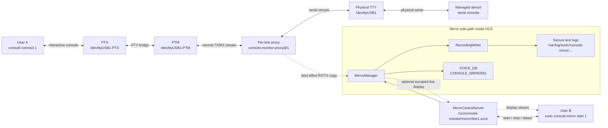
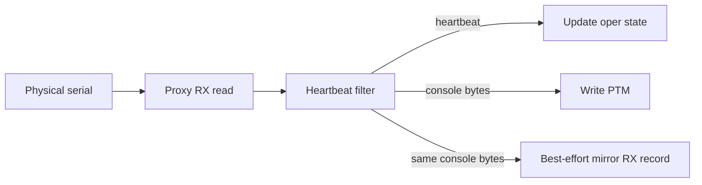
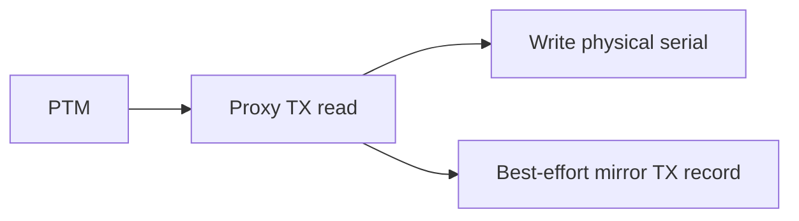

# SONiC Console Mirror
## High Level Design Document

### Revision

| Rev | Date | Author | Change Description |
| :---: | :---------: | :--------: | ------------------ |
| 0.1 | 06/13/2026 | William Zhang | Initial version |

---

## Table of Contents

- [SONiC Console Mirror](#sonic-console-mirror)
  - [High Level Design Document](#high-level-design-document)
    - [Revision](#revision)
  - [Table of Contents](#table-of-contents)
  - [Terminology and Abbreviations](#terminology-and-abbreviations)
  - [1. Feature Overview](#1-feature-overview)
    - [1.1 Feature Requirements](#11-feature-requirements)
  - [2. Design Overview](#2-design-overview)
    - [2.1 Architecture](#21-architecture)
    - [2.2 Design Principles](#22-design-principles)
    - [2.3 User Model](#23-user-model)
  - [3. Detailed Design](#3-detailed-design)
    - [3.1 Proxy Changes](#31-proxy-changes)
      - [3.1.1 MirrorManager](#311-mirrormanager)
      - [3.1.2 RecordingWriter](#312-recordingwriter)
      - [3.1.3 DisplaySink](#313-displaysink)
      - [3.1.4 MirrorControlServer](#314-mirrorcontrolserver)
    - [3.2 Mirror Control Message Protocol](#32-mirror-control-message-protocol)
    - [3.3 RX Mirroring](#33-rx-mirroring)
    - [3.4 TX Mirroring](#34-tx-mirroring)
    - [3.5 Live Display Mode](#35-live-display-mode)
    - [3.6 Recording File Format](#36-recording-file-format)
      - [3.6.1 File Path](#361-file-path)
      - [3.6.2 File Rotation](#362-file-rotation)
      - [3.6.3 Header Lines](#363-header-lines)
      - [3.6.4 Data Record Lines](#364-data-record-lines)
      - [3.6.5 Event Lines](#365-event-lines)
      - [3.6.6 Payload Escaping Rules](#366-payload-escaping-rules)
      - [3.6.7 Conversion Utility](#367-conversion-utility)
    - [3.7 Error Handling](#37-error-handling)
    - [3.8 Service Lifecycle](#38-service-lifecycle)
      - [Proxy Startup](#proxy-startup)
      - [Mirror Start](#mirror-start)
      - [Mirror Stop](#mirror-stop)
      - [Proxy Shutdown](#proxy-shutdown)
  - [4. Database Changes](#4-database-changes)
    - [4.1 STATE\_DB](#41-state_db)
      - [4.1.1 CONSOLE\_MIRROR Table](#411-console_mirror-table)
  - [5. CLI](#5-cli)
    - [5.1 Start Mirroring](#51-start-mirroring)
    - [5.2 Stop Mirroring](#52-stop-mirroring)
    - [5.3 Show Mirror Status](#53-show-mirror-status)
    - [5.4 Export Recording](#54-export-recording)
  - [6. Example Workflow](#6-example-workflow)
    - [6.1 Record Without Live Display](#61-record-without-live-display)
    - [6.2 Record With Live Display](#62-record-with-live-display)
  - [7. Security Considerations](#7-security-considerations)
  - [8. Future Work](#8-future-work)
  - [9. References](#9-references)

---

## Terminology and Abbreviations

| Term | Definition |
|------|------------|
| DCE | Data Communications Equipment - Console Server side |
| DTE | Data Terminal Equipment - SONiC switch (managed device) side |
| Mirror | A best-effort copy of serial console traffic for diagnostics |
| PTM | Pseudo Terminal Master - master side of a PTY pair |
| PTS | Pseudo Terminal Slave - slave side of a PTY pair |
| PTY | Pseudo Terminal - virtual terminal interface |
| PTY Bridge | Process that creates and bridges PTY pairs using socat |
| Proxy | Per-line process that owns the physical serial device and bridges it to PTM |
| RX | Data received by the console server from the managed device |
| TX | Data sent from the console user toward the managed device |
| UDS | Unix domain socket |

---

## 1. Feature Overview

Diagnosing issues with the serial console can be challenging because the connection is exclusive, so only the user on that line knows what's happening. The Console Mirror feature allows an operator on the SONiC console server to start and stop recording traffic for a specific console line. The feature is intended for troubleshooting serial console issues without taking over the active console session.

The existing console connection model is preserved. User A may already be connected to line 1 through the normal `consutil connect 1` path. User B can independently start mirroring for line 1 on the SONiC console server. User B may choose whether the mirrored traffic is only written to a local recording file or is also displayed in User B's terminal while recording is active.

### 1.1 Feature Requirements

The feature provides the following capabilities:

* Start recording for a specific console line.
* Stop recording for a specific console line.
* Record RX data received from the managed device.
* Record TX data sent by the active console user.
* Store the byte stream in a file format that preserves direction and timestamp information.
* Support configurable timestamp resolution.
* Optionally display mirrored traffic in the mirror user's terminal.
* Allow only one mirror owner per line.
* Avoid impacting console availability when recording or display is slow.

---

## 2. Design Overview

### 2.1 Architecture

The design extends the existing console monitor DCE architecture. The per-line proxy remains the only process that owns the physical serial device. The PTY Bridge and the normal `consutil` connection flow remain unchanged.



### 2.2 Design Principles

* **Non-interference** - Mirroring must not change the console byte stream, line ownership, or active console session behavior.
* **Single active mirror owner** - At most one mirror session can be active per line.
* **Best-effort observability** - Recording should be reliable under normal operation, but a slow writer or display consumer must not block the proxy data path.
* **Text-first storage** - The recording format is a line-oriented UTF-8 text log. Printable characters are written as text, while control bytes, ANSI escape bytes, and invalid UTF-8 bytes are represented using printable escape sequences.
* **Minimal architecture change** - The existing PTY Bridge and `consutil connect` model are retained.

### 2.3 User Model

There are two independent users in the primary use case:

* User A owns the active interactive console session on line 1.
* User B starts mirroring line 1 from the SONiC console server.

User B does not become a second interactive console user. User B cannot write data to the managed device through the mirror path. The mirror path is read-only with respect to serial traffic and records TX data only because the proxy already observes TX bytes on their way from PTM to the physical serial device.

---

## 3. Detailed Design

### 3.1 Proxy Changes

The proxy is extended with a `MirrorManager` object. The proxy already observes both byte-stream directions:

* RX: physical serial device to PTM.
* TX: PTM to physical serial device.

The `MirrorManager` receives a copy of these bytes and records them with direction and timestamp metadata. It does not own the serial device and does not participate in forwarding decisions.

The proxy adds the following internal components:

| Component | Description |
|-----------|-------------|
| `MirrorManager` | Maintains mirror session state and queues records to sinks |
| `RecordingWriter` | Writes text records to the local file |
| `DisplaySink` | Optional single live display stream to the CLI process |
| `MirrorControlServer` | Per-line UDS endpoint for start, stop, and status commands |

The proxy main loop must keep serial forwarding as the highest priority. Mirroring work is offloaded to bounded queues and writer tasks.

#### 3.1.1 MirrorManager

`MirrorManager` is the per-line in-proxy coordinator for mirroring. It is created when the proxy starts and remains in memory for the lifetime of the proxy process.

`MirrorManager` maintains the following runtime state:

| State Item | Description |
|------------|-------------|
| `state` | `idle`, `active`, or `stopping` |
| `session_id` | Random ID generated when a mirror session starts |
| `line` | Console line owned by the proxy |
| `direction` | `rx`, `tx`, or `both` |
| `resolution` | Timestamp resolution for the recording |
| `start_time` | Recording start timestamp |
| `file_path` | Current recording file path under the fixed secure directory |
| `writer` | Active `RecordingWriter`, if a session is active |
| `display_sink` | Active `DisplaySink`, if live display is attached |
| `pending_writer_drop_count` | Number of writer records dropped since the last recorded drop event |

`MirrorManager` exposes internal methods to the proxy and `MirrorControlServer`:

| Method | Caller | Description |
|--------|--------|-------------|
| `start(options)` | `MirrorControlServer` | Validate options, create session metadata, create `RecordingWriter`, update STATE_DB |
| `stop()` | `MirrorControlServer` | Write stop event, stop writer, detach display, clear STATE_DB active state |
| `status()` | `MirrorControlServer` | Return current line mirror state |
| `attach_display(connection)` | `MirrorControlServer` | Attach the single display stream for the active session |
| `submit(direction, payload)` | Proxy forwarding loop | Best-effort submit of RX/TX data to recording and display sinks |

The proxy forwarding loop calls `MirrorManager.submit()` after it observes console bytes on the RX or TX path. `submit()` must be non-blocking from the proxy's perspective. If mirroring is idle, the method returns immediately. If the active session does not include the submitted direction, the method returns immediately.

For accepted records, `MirrorManager` creates a mirror record containing timestamp, delta timestamp, sequence number, direction, original byte length, and raw payload bytes. It then submits the record to:

* `RecordingWriter`, if recording is active.
* `DisplaySink`, if live display is attached.

Writer submission is best effort. If the writer queue is full, `MirrorManager` increments `pending_writer_drop_count`, writes a syslog warning, and does not block the forwarding loop. When the writer queue later accepts records again, `MirrorManager` emits one `EVENT` record with `reason=writer_queue_full` and the accumulated `dropped_records` value before recording subsequent data records.

Display submission is also best effort. If the display queue is full, the display record is dropped and a syslog warning is written.

#### 3.1.2 RecordingWriter

`RecordingWriter` is responsible for durable on-disk recording. It is created for one mirror session and destroyed when that session stops.

`RecordingWriter` owns:

| Resource | Description |
|----------|-------------|
| Recording file descriptor | Opened under `/var/log/sonic/console-mirror/line<line>/` |
| Writer queue | Bounded queue receiving data and event records from `MirrorManager` |
| Writer task/thread | Background execution context that drains the queue and writes text lines |

The writer opens the recording file with restrictive permissions:

```text
owner: root:root
mode: 0600
```

The containing directories are created by the proxy with mode `0700` before the file is opened. The writer must not follow user-provided paths because custom output directories are not supported.

Writer startup sequence:

1. Create or validate `/var/log/sonic/console-mirror/`.
2. Create or validate `/var/log/sonic/console-mirror/line<line>/`.
3. Open the recording file with exclusive creation.
4. Write SCM-Text header lines.
5. Start draining the bounded writer queue.

The writer converts records to SCM-Text lines. For data records, the payload is encoded using the printable escaping rules in [Payload Escaping Rules](#366-payload-escaping-rules). For event records, the payload is compact JSON.

If `max_file_size` is configured, `RecordingWriter` monitors the current file size before writing each record. If the next record would exceed the configured limit, the writer rotates to a new file as described in [File Rotation](#362-file-rotation). Rotation is performed by the writer task and must not block the serial forwarding path.

The writer must never run in the latency-sensitive serial forwarding path. If disk I/O is slow, only the bounded queue is affected. If the queue is full, records are dropped before reaching the writer, a syslog warning is written, and the proxy continues forwarding console bytes.

Writer shutdown sequence:

1. Accept a stop event from `MirrorManager`.
2. Drain queued records up to a bounded shutdown timeout.
3. Flush the file.
4. Close the file descriptor.

If the writer encounters a fatal file error, for example disk full or write failure, it reports the error to `MirrorManager`. `MirrorManager` stops the recording session, writes syslog, updates STATE_DB state, and leaves the console forwarding path running.

#### 3.1.3 DisplaySink

`DisplaySink` provides the optional live display for the mirror owner. It is created only when the CLI requests `--display` and attaches to an active mirror session.

Only one `DisplaySink` is allowed per line. If a display sink is already attached, another attach request is rejected. This is separate from the single mirror owner rule: a line has at most one active mirror session, and that session has at most one live display sink.

`DisplaySink` owns:

| Resource | Description |
|----------|-------------|
| UDS connection | Connection back to the `consutil mirror start --display` process |
| Display queue | Bounded queue receiving display records from `MirrorManager` |
| Display task/thread | Background execution context that sends records to the CLI |

The display path is read-only with respect to the console line. It never accepts user input for the managed device and cannot inject TX bytes.

Display rendering uses the same printable escaping rules as the recording file. This prevents ANSI escape bytes and other control bytes from changing User B's terminal state. TX records may be prefixed with `[TX]` so that User B can distinguish user input from device output.

If the display queue is full, `DisplaySink` drops display records and writes a syslog warning. It does not update STATE_DB and does not affect `RecordingWriter`. If the CLI disconnects, `DisplaySink` is detached, a syslog message is written, and the recording session remains active.

#### 3.1.4 MirrorControlServer

`MirrorControlServer` is the local IPC endpoint used by `consutil mirror` to control the in-process `MirrorManager`. It is created by each per-line proxy during startup.

The control socket path is:

```text
/run/console-monitor/mirror/line<line>.sock
```

The socket is created with restrictive permissions so only Admin/root users can issue mirror control commands. This socket is a control channel only. It is not the normal interactive console data path and it is not a multi-user console fan-out channel.

`MirrorControlServer` accepts JSON control messages with 4-byte big-endian length framing. It validates:

* The requested line matches the proxy line.
* The caller is authorized.
* The requested operation is supported.
* The requested direction and resolution are valid.
* No mirror session is already active when processing `start`.
* A mirror session is active when processing `stop` or `attach-display`.

After validation, `MirrorControlServer` calls the corresponding `MirrorManager` method. It returns structured success or error responses to the CLI. For example, `start` returns the generated `session_id` and secure recording file path; `status` returns current STATE_DB-equivalent runtime metadata; `stop` returns the final file path.

`MirrorControlServer` must not perform disk I/O or serial I/O itself. It only validates control messages, enforces access policy, and invokes `MirrorManager`.

### 3.2 Mirror Control Message Protocol

This section defines the message protocol used on the `MirrorControlServer` UDS described in [MirrorControlServer](#314-mirrorcontrolserver). Control messages are JSON objects framed with a 4-byte big-endian length prefix:

```json
{
  "op": "start",
  "line": "1",
  "direction": "both",
  "resolution": "us",
  "display": false,
  "max_file_size": "64MiB"
}
```

`max_file_size` uses the same size syntax as the CLI `--max-file-size` option. Supported suffixes are `B`, `KiB`, `MiB`, and `GiB`; if no suffix is provided, the value is interpreted as bytes.

Supported control operations:

| Operation | Description |
|-----------|-------------|
| `start` | Start a mirror session if no mirror session is active |
| `stop` | Stop the active mirror session |
| `status` | Return current mirror state for the line |
| `attach-display` | Attach the calling CLI process as the single display sink |

The response is also a length-prefixed JSON object. Successful responses include `status: "ok"` and operation-specific fields. Error responses include `status: "error"`, a machine-readable `code`, and a human-readable `message`.

Example success response for `start`:

```json
{
  "status": "ok",
  "session_id": "a1b2c3d4",
  "file_path": "/var/log/sonic/console-mirror/line1/console-mirror-line1-20260613T141200Z-a1b2c3d4-part0001.log"
}
```

Example error response when a mirror session is already active:

```json
{
  "status": "error",
  "code": "mirror_already_active",
  "message": "Line 1 already has an active mirror session"
}
```

### 3.3 RX Mirroring

RX mirroring is performed from the same read buffer used for the normal RX forwarding path. After console-monitor heartbeat filtering, the proxy forwards the remaining user-visible bytes to PTM and submits a best-effort RX mirror record to `MirrorManager`. Mirror submission must not block or change the normal forwarding decision.



This default placement records the same RX data that User A would see in the interactive console. Internal heartbeat frames are not recorded by default because they are implementation details of console monitor rather than managed-device console traffic.

### 3.4 TX Mirroring

TX mirroring is performed from the same read buffer used for the normal TX forwarding path. After reading data from PTM, the proxy writes the bytes to the physical serial device and submits a best-effort TX mirror record to `MirrorManager`. Mirror submission must not block or change the normal forwarding decision.



This captures User A's console input without granting User B any ability to inject input.

### 3.5 Live Display Mode

When User B starts mirroring with live display enabled, the CLI sends `start` followed by `attach-display` on the same UDS connection. The proxy sends a copy of mirror records to this single display connection.

The live display stream is an internal stream of mirror records. The CLI renders these records to User B's terminal using the same printable escaping rules as the on-disk text log. This stream does not change the on-disk text log format.

Detailed display behavior:

* RX bytes are written to stdout after printable escaping.
* TX bytes may be shown with a configurable prefix, for example `[TX]`, to make user input distinguishable.
* Non-printable bytes are escaped before being printed to User B's terminal.
* ANSI escape bytes are printed as escaped text, for example `\x1b`, rather than being emitted as literal terminal control bytes.

The display sink has its own bounded queue. If User B's terminal is slow, display records may be dropped and the proxy writes a warning to syslog. Display drop events are not recorded in STATE_DB. Dropping display records must not affect the recording writer or the console data path.

If the display CLI exits, the proxy detaches only the display sink and writes a syslog message. The recording session remains active until `consutil mirror stop <line>` is executed or the proxy stops.

### 3.6 Recording File Format

The recording file is a UTF-8 text log. The format is named SCM-Text v1, short for Serial Console Mirror Text v1. It is line-oriented and append-only.

The goal of the text format is to make common console output easy to inspect directly while still representing serial bytes that cannot be safely printed in a log file. Printable UTF-8 characters are written as-is. Unsafe bytes are escaped so that tools such as `cat`, `less`, `grep`, and log collectors do not interpret terminal control sequences or lose byte boundaries.

#### 3.6.1 File Path

Recording files are always written under a fixed, security-controlled directory. The CLI does not support overriding the output directory.

Base directory:

```text
/var/log/sonic/console-mirror/
```

Per-line recording path:

```text
/var/log/sonic/console-mirror/line<line>/console-mirror-line<line>-<UTC timestamp>-<session id>-part<part>.log
```

Example:

```text
/var/log/sonic/console-mirror/line1/console-mirror-line1-20260613T141200Z-a1b2c3d4-part0001.log
```

The `.log` extension is used to make the text nature of the recording clear.

The proxy is responsible for creating the base directory and per-line subdirectories with restrictive ownership and permissions:

| Path | Owner | Permission | Description |
|------|-------|------------|-------------|
| `/var/log/sonic/console-mirror/` | `root:root` | `0700` | Base directory for all mirror recordings |
| `/var/log/sonic/console-mirror/line<line>/` | `root:root` | `0700` | Per-line recording directory |
| `console-mirror-line<line>-<timestamp>-<session_id>-part<part>.log` | `root:root` | `0600` | Recording file |

The proxy generates `session_id` when a mirror session starts. The value should be a random hexadecimal string generated with a cryptographically strong random source, for example `secrets.token_hex(8)`.

#### 3.6.2 File Rotation

Rotation is controlled by `max_file_size`, which can be set through the CLI `--max-file-size` option or the control message `max_file_size` field.

Rotation behavior:

1. Each mirror session starts with `part0001`.
2. Before writing a record, `RecordingWriter` checks whether appending that record would make the current file exceed `max_file_size`.
3. If the limit would be exceeded, `RecordingWriter` writes a rotate event to the current file if space allows, flushes and closes the current file, increments the part number, opens the next file, writes header lines, and continues recording.
4. The new file uses the same `session_id`, `line`, `start_time`, direction, and resolution, but a different part number.
5. `STATE_DB` `file_path` is updated to the current active part file.
6. Old part files are not deleted by this feature. Recording retention and deletion are handled by the platform log management policy.

Example rotated files:

```text
/var/log/sonic/console-mirror/line1/console-mirror-line1-20260613T141200Z-a1b2c3d4-part0001.log
/var/log/sonic/console-mirror/line1/console-mirror-line1-20260613T141200Z-a1b2c3d4-part0002.log
/var/log/sonic/console-mirror/line1/console-mirror-line1-20260613T141200Z-a1b2c3d4-part0003.log
```

Rotate event example:

```text
2026-06-13T14:13:00.000000Z +000060000000us 00000125 EVENT 00000041 {"event":"rotate","next_part":"part0002"}
```

If opening the next part file fails, `RecordingWriter` reports a fatal writer error to `MirrorManager`. The mirror session is stopped, syslog is written, STATE_DB is updated, and the normal console forwarding path continues.

#### 3.6.3 Header Lines

The file starts with comment-style header lines. Header keys use `key=value` syntax.

```text
# SONIC_CONSOLE_MIRROR_TEXT version=1
# line=1 direction=both resolution=us start_time=2026-06-13T14:12:00.123456Z session_id=a1b2c3d4 part=part0001 encoding=printable-escape
# fields=timestamp delta seq direction length payload
```

Header lines start with `# ` so that simple text tools can distinguish metadata from data records.

#### 3.6.4 Data Record Lines

Each data record is written as one text line:

```text
<timestamp> <delta> <seq> <direction> <length> <payload>
```

The first five fields are space-delimited. The payload is the remainder of the line, so printable spaces from console output can be kept as spaces.

Fields:

| Field | Format | Example | Description |
|-------|--------|---------|-------------|
| `timestamp` | RFC 3339 UTC timestamp with configured fractional precision | `2026-06-13T14:12:01.000003Z` | Absolute time when the record is created |
| `delta` | `+` followed by a zero-padded 12-digit decimal value and the resolution suffix | `+000000876547us` | Time elapsed since the recording start timestamp |
| `seq` | Zero-padded 8-digit decimal number | `00000002` | Monotonic record sequence number, starting from `00000001` |
| `direction` | Fixed token | `RX`, `TX`, or `EVENT` | Record direction or event marker |
| `length` | Zero-padded 8-digit decimal number | `00000005` | Original payload length in bytes before escaping |
| `payload` | Remainder of the line | `show\n` | Printable-escaped representation of the serial bytes |

The `delta` field is a relative timestamp. It is calculated from the absolute record timestamp and the recording start timestamp:

```text
delta = record_timestamp - recording_start_timestamp
```

The unit suffix follows the selected timestamp resolution:

| Resolution | Delta Suffix | Meaning |
|------------|--------------|---------|
| `ns` | `ns` | Delta value is in nanoseconds |
| `us` | `us` | Delta value is in microseconds |
| `ms` | `ms` | Delta value is in milliseconds |

For example, if the recording starts at `2026-06-13T14:12:00.123456Z` and a record is created at `2026-06-13T14:12:01.000003Z`, the elapsed time is `876547` microseconds, so the `delta` field is written as `+000000876547us`. The delta field makes it easy to analyze timing gaps between RX and TX records without repeatedly subtracting absolute timestamps.

Example records:

```text
2026-06-13T14:12:00.123456Z +000000000000us 00000001 RX 00000014 Booting SONiC\n
2026-06-13T14:12:01.000003Z +000000876547us 00000002 TX 00000005 show\n
2026-06-13T14:12:01.004200Z +000000880744us 00000003 RX 00000010 \x1b[2Jlogin:
```

#### 3.6.5 Event Lines

Mirror lifecycle and error events are also written as text lines. Event lines use `EVENT` as the direction field and a JSON object as the payload.

```text
2026-06-13T14:12:05.000000Z +000004876544us 00000004 EVENT 00000028 {"event":"drop","count":128}
```

Events are used for start, stop, queue overflow, display detach, and writer error.

#### 3.6.6 Payload Escaping Rules

The writer applies a deterministic printable escaping function to each payload:

| Input byte or character | Output |
|-------------------------|--------|
| Printable UTF-8 character | Written as-is |
| Space | Written as-is |
| `\n` | `\\n` |
| `\r` | `\\r` |
| `\t` | `\\t` |
| Backslash | `\\\\` |
| ESC byte `0x1b` | `\\x1b` |
| Other C0/C1 control bytes | `\\xNN` |
| Invalid UTF-8 byte | `\\xNN` |

This keeps normal console text readable while preventing terminal control sequences from changing the viewer's terminal state. For example, the ANSI clear-screen sequence is written as `\x1b[2J` rather than being emitted as a literal ESC byte.

#### 3.6.7 Conversion Utility

A conversion utility may still be provided for structured processing:

```bash
sudo consutil mirror export console-mirror-line1-20260613T141200Z-a1b2c3d4-part0001.log --format json
sudo consutil mirror export console-mirror-line1-20260613T141200Z-a1b2c3d4-part0001.log --format raw-text
```

JSON export parses the text log and preserves direction, timestamp, original byte length, and escaped payload. Raw-text export can drop metadata and print only the payload stream for quick inspection.

### 3.7 Error Handling

The mirror implementation must not block or terminate the active console session because of recording errors.

| Error | Behavior |
|-------|----------|
| File open failure | Reject `start` and report error to CLI |
| Disk full | Stop recording, update STATE_DB, keep console forwarding |
| Writer queue full | Drop mirror records, write syslog warning, record a drop event when the writer queue recovers, keep forwarding |
| Display queue full | Drop display records only, write syslog warning, keep recording |
| Display client disconnect | Detach display, write syslog message, keep recording |
| Proxy restart | Stop current mirror session and mark state inactive after restart |

The writer queue should be bounded. When the queue is full, new mirror records are dropped rather than blocking the proxy, and a syslog warning is written. A drop event is inserted when the queue becomes writable again.

### 3.8 Service Lifecycle

#### Proxy Startup

1. Initialize serial and PTM resources as in the existing console monitor design.
2. Create the per-line mirror runtime directory.
3. Start the `MirrorControlServer`.
4. Initialize `MirrorManager` in idle state.
5. Enter the normal proxy forwarding loop.

#### Mirror Start

1. CLI connects to the per-line mirror UDS.
2. CLI sends a `start` request.
3. Proxy validates line, permissions, and active mirror state.
4. Proxy creates the recording file and starts `RecordingWriter`.
5. Proxy updates STATE_DB with active mirror metadata.
6. Proxy replies with session ID and file path.
7. If display is requested, CLI attaches as the single display sink.

#### Mirror Stop

1. CLI sends a `stop` request.
2. Proxy writes a stop event to the recording file.
3. Proxy flushes and closes the writer.
4. Proxy clears active mirror state and updates STATE_DB.

#### Proxy Shutdown

On proxy shutdown, the mirror writer receives a stop event and flushes the recording file if possible. STATE_DB is updated to show the mirror session is no longer active.

---

## 4. Database Changes

No new persistent CONFIG_DB table is required for the initial implementation. Console mirroring is treated as an operational action rather than persistent configuration, so it should not automatically restart after device reboot.

Runtime state is stored in STATE_DB.

### 4.1 STATE_DB

#### 4.1.1 CONSOLE_MIRROR Table

| Key Format | Field | Value | Description |
|------------|-------|-------|-------------|
| `CONSOLE_MIRROR\|<line>` | `state` | `idle` / `active` / `error` | Mirror state |
| `CONSOLE_MIRROR\|<line>` | `session_id` | string | Active session ID |
| `CONSOLE_MIRROR\|<line>` | `owner_pid` | PID | CLI process that started the session |
| `CONSOLE_MIRROR\|<line>` | `started_by` | username | User that started mirroring |
| `CONSOLE_MIRROR\|<line>` | `start_time` | Unix timestamp | Mirror start time |
| `CONSOLE_MIRROR\|<line>` | `file_path` | path | Current recording file path |
| `CONSOLE_MIRROR\|<line>` | `direction` | `rx` / `tx` / `both` | Mirrored direction |
| `CONSOLE_MIRROR\|<line>` | `resolution` | `ns` / `us` / `ms` | Timestamp resolution |
| `CONSOLE_MIRROR\|<line>` | `display` | `yes` / `no` | Whether display sink is attached |

Example:

```bash
admin@sonic:~$ sonic-db-cli STATE_DB HGETALL "CONSOLE_MIRROR|1"
1) "state"
2) "active"
3) "session_id"
4) "a1b2c3d4"
5) "owner_pid"
6) "12345"
7) "started_by"
8) "admin"
9) "start_time"
10) "1718287920"
11) "file_path"
12) "/var/log/sonic/console-mirror/line1/console-mirror-line1-20260613T141200Z-a1b2c3d4-part0001.log"
13) "direction"
14) "both"
15) "resolution"
16) "us"
17) "display"
18) "yes"
```

---

## 5. CLI

The CLI is added under `consutil` because it operates on console lines and can optionally attach to a live terminal display.

CLI permission requirements:

| Command | Required Privilege | Reason |
|---------|--------------------|--------|
| `consutil mirror start` | Admin/root | Starts a sensitive recording and creates a protected log file |
| `consutil mirror stop` | Admin/root | Stops an active recording session |
| `consutil mirror show` | Admin/root | Exposes active recording metadata, including recording file path |
| `consutil mirror export` | Admin/root | Reads protected recording files |

### 5.1 Start Mirroring

```bash
sudo consutil mirror start <target> [OPTIONS]
```

Options:

| Option | Description |
|--------|-------------|
| `--devicename`, `-d` | Interpret target as remote device name instead of line number |
| `--direction {rx,tx,both}` | Select mirrored direction, default `both` |
| `--resolution {ns,us,ms}` | Timestamp resolution, default `us` |
| `--display` | Also display mirrored traffic in the current terminal |
| `--max-file-size <size>` | Maximum size of each recording part before rotation. Supported suffixes are `B`, `KiB`, `MiB`, and `GiB`; values without suffix are bytes |

Example:

```bash
sudo consutil mirror start 1 --direction both --resolution us
sudo consutil mirror start 1 --display
```

If a mirror session is already active for the target line, the command fails:

```text
Cannot start mirror: line [1] already has an active mirror session
```

### 5.2 Stop Mirroring

```bash
sudo consutil mirror stop <target> [--devicename]
```

Example:

```bash
sudo consutil mirror stop 1
```

Expected output:

```text
Stopped mirror on line [1]
Recording file: /var/log/sonic/console-mirror/line1/console-mirror-line1-20260613T141200Z-a1b2c3d4-part0001.log
```

### 5.3 Show Mirror Status

```bash
sudo consutil mirror show [target] [--devicename]
```

Example output:

```text
Line  State   Direction  Display  File
----  ------  ---------  -------  ----
1     active  both       yes      /var/log/sonic/console-mirror/line1/console-mirror-line1-20260613T141200Z-a1b2c3d4-part0001.log
2     idle    -          no       -
```

### 5.4 Export Recording

```bash
sudo consutil mirror export <file> --format {json,raw-text}
```

Example:

```bash
sudo consutil mirror export /var/log/sonic/console-mirror/line1/console-mirror-line1-20260613T141200Z-a1b2c3d4-part0001.log --format json
```

---

## 6. Example Workflow

### 6.1 Record Without Live Display

User A is connected to line 1:

```bash
admin@sonic:~$ consutil connect 1
Successful connection to line [1]
```

User B starts recording line 1:

```bash
admin@sonic:~$ sudo consutil mirror start 1
Started mirror on line [1]
Recording file: /var/log/sonic/console-mirror/line1/console-mirror-line1-20260613T141200Z-a1b2c3d4-part0001.log
```

User B stops recording:

```bash
admin@sonic:~$ sudo consutil mirror stop 1
Stopped mirror on line [1]
Recording file: /var/log/sonic/console-mirror/line1/console-mirror-line1-20260613T141200Z-a1b2c3d4-part0001.log
```

### 6.2 Record With Live Display

User B starts recording and live display:

```bash
admin@sonic:~$ sudo consutil mirror start 1 --display
Started mirror on line [1]
Recording file: /var/log/sonic/console-mirror/line1/console-mirror-line1-20260613T141200Z-a1b2c3d4-part0001.log
```

Mirrored RX/TX traffic is then displayed in User B's terminal. If User B exits the display process, recording remains active until `consutil mirror stop 1` is executed.

---

## 7. Security Considerations

Console mirror recordings are highly sensitive. They may contain credentials, bootloader commands, recovery tokens, private configuration, or device crash output.

Security requirements:

* Starting, stopping, showing, or exporting mirror sessions requires Admin/root privileges.
* Recording files are always written to `/var/log/sonic/console-mirror/`; users cannot specify a custom output directory.
* Recording files are created with restrictive permissions (`0600`), owned by `root:root`.
* Recording directories are created with restrictive permissions (`0700`), owned by `root:root`, and are not world-readable.
* The UDS control socket is created with restrictive permissions so only Admin/root users can issue mirror control commands.
* CLI output should print the recording file path and active status for auditability.
* STATE_DB records should include `started_by`, `owner_pid`, `start_time`, and current `file_path`.
* Mirroring should be visible through `consutil mirror show`.

This revision does not encrypt recordings. Encryption can be added later as an optional writer mode without changing the proxy interception points.

---

## 8. Future Work

The following items can be added in later revisions:

* CTS/RTS flow control signal mirroring.
* Recording file encryption.
* gNOI APIs for remote start and stop.
* Optional inclusion of console-monitor internal heartbeat frames for debugging.
* Optional redaction filters for known sensitive patterns.

---

## 9. References

1. [SONiC Console Monitor High Level Design](https://github.com/sonic-net/SONiC/blob/master/doc/console/Console-Monitor-High-Level-Design.md)
2. [SONiC Console Switch High Level Design](https://github.com/sonic-net/SONiC/blob/master/doc/console/SONiC-Console-Switch-High-Level-Design.md)
3. [sonic-net/sonic-utilities](https://github.com/sonic-net/sonic-utilities/)
4. [sonic-utilities consutil main.py](https://github.com/sonic-net/sonic-utilities/blob/master/consutil/main.py)
