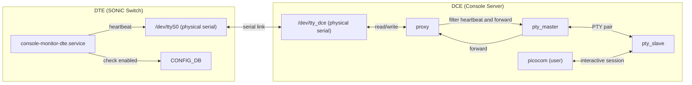
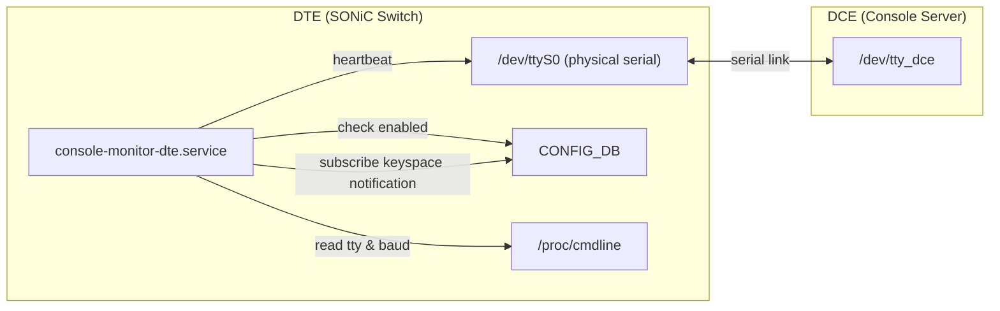
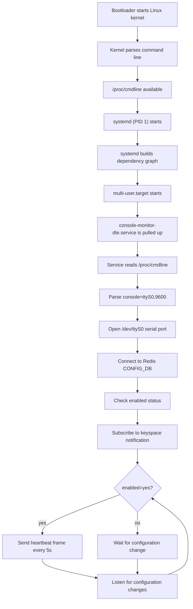

# SONiC Console Monitor

## High Level Design Document

### Revision

|  Rev  |   Date      |   Author   | Change Description |
| :---: | :---------: | :--------: | ------------------ |
|  0.1  | 12 Jan 2026 | Cliff Chen | Initial version    |

---

## Table of Contents

- [Terminology and Abbreviations](#terminology-and-abbreviations)
- [1. Feature Overview](#1-feature-overview)
  - [1.1 Feature Requirements](#11-feature-requirements)
- [2. Design Overview](#2-design-overview)
  - [2.1 Architecture](#21-architecture)
  - [2.2 DTE Side](#22-dte-side)
  - [2.3 DCE Side](#23-dce-side)
- [3. Detailed Design](#3-detailed-design)
  - [3.1 Frame Structure Design](#31-frame-structure-design)
  - [3.2 DTE Side Service](#32-dte-side-service)
  - [3.3 DCE Side Service](#33-dce-side-service)
- [4. Database Changes](#4-database-changes)
- [5. CLI](#5-cli)
- [6. Flow Diagrams](#6-flow-diagrams)
- [7. References](#7-references)

---

## Terminology and Abbreviations

| Term | Definition |
|------|------------|
| DCE | Data Communications Equipment - Console Server side |
| DTE | Data Terminal Equipment - SONiC Switch (managed device) side |
| Heartbeat | Periodic signal used to verify link connectivity |
| Oper | Operational state (Up/Down) |
| PTY | Pseudo Terminal - Virtual terminal interface |
| Proxy | Intermediate proxy process handling serial communication |
| TTY | Teletypewriter - Terminal device interface |

---

## 1. Feature Overview

In data center networks, Console Servers (DCE) connect to multiple SONiC Switches (DTE) via serial ports for out-of-band management and console access during failures. In emergency troubleshooting scenarios. If link failures are not detected in time or in advance, it significantly increases the difficulty and time cost of troubleshooting. 

The console monitor service provides real-time automatic detection of link Oper state, enabling observability for serial connections and allowing operations teams to monitor link health status instantly. It provides critical support during incident response, improving troubleshooting efficiency and reducing business interruption time.


### 1.1 Feature Requirements

*   **Connectivity Detection**
    *   Determine whether the DCE ↔ DTE serial link is available (Oper Up/Down)
*   **Non-Interference**
    *   Does not affect normal console operations, including remote device cold reboot and system reinstallation
*   **Robustness**
    *   Automatically resumes detection after device reboot

---

## 2. Design Overview

### 2.1 Architecture



### Key Decisions

*   The DCE side cannot determine the initial state of the DTE device (rebooting or normal), therefore DCE cannot proactively send probe data to DTE, as it may interfere with the bootloader

### 2.2 DTE Side

The DTE side dynamically responds to configuration changes via Redis keyspace notification. When the feature is enabled, it periodically sends heartbeat frames to verify link connectivity.

*   **Direct Serial Access**
    *   The service directly opens the physical serial port (e.g., `/dev/ttyS0`) for sending heartbeats
*   **Heartbeat Mechanism**
    *   Checks the `enabled` field of `CONSOLE_SWITCH|controlled_device` in CONFIG_DB at startup
    *   Listens to Redis keyspace notifications to dynamically respond to enabled state changes
    *   Sends heartbeat frames every 5 seconds only when enabled=yes
    *   DTE → DCE unidirectional transmission ensures DTE does not receive interfering data during reboot phase
*   **Collision Risk**
    *   Normal data streams may contain data matching the heartbeat frame format, causing false positives
    *   Heartbeat frame design minimizes collision probability

### 2.3 DCE Side

Creates a Proxy between the physical serial port and user applications, responsible for heartbeat frame detection, filtering, and link state maintenance.

*   **Exclusive Ownership**
    *   The only process holding the physical serial port file descriptor (`/dev/ttyUSBx`)
*   **PTY Creation**
    *   Creates pseudo-terminal pairs for upper-layer applications
*   **PTY Symlink**
    *   Creates fixed symlinks (e.g., `/dev/VC0-1`) pointing to dynamic PTY slaves (e.g., `/dev/pts/3`)
    *   Upper-layer applications (consutil, picocom) use stable device paths
*   **Heartbeat Filtering**
    *   Identifies heartbeat frames, updates state, and discards heartbeat data
*   **Data Passthrough**
    *   Non-heartbeat data is transparently forwarded to the virtual serial port

---

## 3. Detailed Design

### 3.1 Frame Structure Design

#### 3.1.1 Frame Format

```
+----------+--------+-----+------+------+--------+---------+-------+----------+
| SOF x 3  | Version| Seq | Flag | Type | Length | Payload | CRC16 | EOF x 3  |
+----------+--------+-----+------+------+--------+---------+-------+----------+
|    3B    |   1B   | 1B  |  1B  |  1B  |   1B   |   N B   |  2B   |    3B    |
+----------+--------+-----+------+------+--------+---------+-------+----------+
```

| Field | Size | Description |
|-------|------|-------------|
| SOF x 3 | 3 bytes | Frame header sync sequence, 0x05 0x05 0x05 |
| Version | 1 byte | Protocol version, currently 0x01 |
| Seq | 1 byte | Sequence number, 0x00-0xFF cyclic increment |
| Flag | 1 byte | Flag bits, reserved field, currently 0x00 |
| Type | 1 byte | Frame type |
| Length | 1 byte | Payload length (value <= 24) |
| Payload | N bytes | Optional data payload |
| CRC16 | 2 bytes | Checksum, big-endian (high byte first) |
| EOF x 3 | 3 bytes | Frame trailer sync sequence, 0x00 0x00 0x00 |

**Frame Length Limits:**

*   **Maximum Frame Length**
    *   Excluding frame header and trailer, does not exceed 64 bytes
    *   Length value <= 24
    *   Frame length <= buffer size ensures alignment recovery when reading from mid-frame
*   **Buffer Size**
    *   64 bytes, adjustable as needed

**CRC16 Calculation:**

*   **Algorithm**
    *   CRC-16/MODBUS
*   **Calculation Range**
    *   From Version to Payload (excluding escape characters, using raw data)
    *   Excludes frame header, CRC16 itself, and frame trailer
*   **Byte Order**
    *   Big-endian (high byte first, low byte last)

#### 3.1.2 Frame Type Definition

| Type | Value (Hex) | Description |
|------|-------------|-------------|
| HEARTBEAT | 0x01 | Heartbeat frame |
| Reserved | 0x02-0xFF | Future extension |

#### Flag Field Definition

Flag bits are reserved, currently defaults to 0x00

#### 3.1.3 Heartbeat Frame Example
```
05 05 05 01 00 00 01 00 XX XX 00 00 00
└──┬──┘ │  │  │  │  │  └──┬─┘ └──┬──┘
   │    │  │  │  │  │     │      └── EOF x 3 (frame trailer sync sequence)
   │    │  │  │  │  │     └── CRC16 (calculated value)
   │    │  │  │  │  └──────── Length: 0 (no payload)
   │    │  │  │  └─────────── Type: HEARTBEAT (0x01)
   │    │  │  └────────────── Flag: 0x00
   │    │  └───────────────── Seq: 0x00 (sequence number)
   │    └──────────────────── Version: 0x01
   └───────────────────────── SOF x 3 (frame header sync sequence)
```

#### 3.1.4 Design Decisions

*   **Reliable Detection**
    *   Uses SOF and EOF, supports alignment recovery when reading from mid-frame
    *   Uses special control characters as frame delimiters, limits maximum frame length, introduces sliding buffer to distinguish heartbeat frames from arbitrary byte streams
*   **Fault Tolerance**
    *   To prevent a single byte bit error from causing frame sync loss, uses 3 repeated frame delimiters as sync sequence
*   **Transparent Transmission**
    *   Escape mechanism ensures frame content can use arbitrary bytes

#### 3.1.5 Key Assumptions

*   User data streams will not contain special characters: 0x05 (SOF), 0x00 (EOF), 0x10 (DLE)
*   The probability of bit errors occurring consecutively in 3 bytes is negligible

#### 3.1.6 Special Character Definition

| Character | Value (Hex) | Name | Description |
|-----------|-------------|------|-------------|
| SOF | 0x05 | Start of Frame | Frame start character |
| EOF | 0x00 | End of Frame | Frame end character |
| DLE | 0x10 | Data Link Escape | Escape character |

**Delimiter ASCII Definitions:**

*   **SOF (0x05)**
    *   ASCII ENQ (Enquiry)
    *   Non-printable control character, not interpreted by modern terminals and shells
    *   Historically used for polling communication (master asking if slave is ready), no longer used in modern systems
*   **EOF (0x00)**
    *   ASCII NUL (Null)
    *   Null character, typically ignored by terminals
    *   C language string terminator, does not appear in normal text output
*   **DLE (0x10)**
    *   ASCII DLE (Data Link Escape)
    *   Non-printable control character, specifically designed for data link layer escaping
    *   Conforms to its historical semantics, used to mark that the following character requires special handling

**Sync Sequence Design:**

*   **Frame Header Sync Sequence**
    *   3 consecutive SOF characters: 0x05 0x05 0x05
    *   Receiving any single SOF triggers state transition, rather than requiring 3 consecutive SOFs
    *   A single SOF bit error will not cause frame sync loss
*   **Frame Trailer Sync Sequence**
    *   3 consecutive EOF characters: 0x00 0x00 0x00
    *   Similarly, receiving any single EOF character triggers state transition
    *   Similarly provides bit error tolerance

#### 3.1.7 Escape Rules

When frame content (between frame header and trailer) contains special characters, escaping is required:

| Original Byte | Escaped |
|---------------|---------|
| 0x05 (SOF) | 0x10 0x05 |
| 0x00 (EOF) | 0x10 0x00 |
| 0x10 (DLE) | 0x10 0x10 |

**Escape Processing Description:**

*   **Sender**
    *   Constructs raw frame content (Version + Seq + Flag + Type + Length + Payload)
    *   Calculates CRC16 (based on raw unescaped data)
    *   Escapes entire frame content (including CRC16)
    *   Finally adds frame header and trailer
*   **Receiver**
    *   After removing frame header and trailer, remaining raw data (including escape characters) is stored in frame buffer
    *   First unescape the buffer
    *   Then perform CRC16 verification
    *   After verification passes, extract field data

#### 3.1.8 Frame Detection and Filtering

**Buffer Design:**

Since frames may be split during read operations, a sliding buffer is needed to store received byte streams for frame detection.

*   **Characteristics:**
    *   Fixed size of 64 bytes
    *   Stores all input data except SOF and EOF

**Detection Algorithm:**

```txt
PROCEDURE PROCESS(F, data)
    // F is a frame-filter object with fields:
    //   F.buffer        : sequence of bytes
    //   F.in_frame      : boolean
    //   F.escape_next   : boolean
    // And helper procedures:
    //   FLUSH_AS_USER_DATA(F)
    //   DISCARD_BUFFER(F)
    //   TRY_PARSE_FRAME(F)
    //   FLUSH_BUFFER(F)

    FOR each byte b in data DO
        IF F.escape_next = TRUE THEN
            // previous byte was DLE; treat b as normal data
            APPEND(F.buffer, b)
            F.escape_next ← FALSE

            IF LENGTH(F.buffer) ≥ MAX_FRAME_BUFFER_SIZE THEN
                FLUSH_BUFFER(F)
            END IF

        ELSE IF b = DLE THEN
            // mark next byte as escaped (but keep DLE in buffer)
            APPEND(F.buffer, b)
            F.escape_next ← TRUE

        ELSE IF b = SOF THEN
            IF F.in_frame = FALSE THEN
                // bytes before SOF are user data
                FLUSH_AS_USER_DATA(F)
            ELSE
                // SOF inside a frame => previous frame incomplete; discard
                DISCARD_BUFFER(F)
            END IF
            F.in_frame ← TRUE

        ELSE IF b = EOF THEN
            TRY_PARSE_FRAME(F)
            F.in_frame ← FALSE

        ELSE
            APPEND(F.buffer, b)

            IF LENGTH(F.buffer) ≥ MAX_FRAME_BUFFER_SIZE THEN
                FLUSH_BUFFER(F)
            END IF
        END IF
    END FOR
END PROCEDURE

```

**Timeout Handling**

When no new data arrives within the timeout period, flush or discard the buffer based on `in_frame` state:
*   Timeout is dynamically calculated based on baud rate: `timeout = (10 / baud) × MAX_FRAME_BUFFER_SIZE × 3`
*   Formula explanation: per-character time (10 bits / baud rate) × maximum frame length × 3x margin
*   If not in frame: flush buffer as user data
*   If in frame: frame is incomplete, discard buffer contents
*   Exit in-frame state

---

### 3.2 DTE Side Service

#### 3.2.1 Service: `console-monitor-dte.service`

The DTE side service implements heartbeat sending functionality, dynamically responding to configuration changes via Redis keyspace notification.

*   **Parameter Acquisition**
    *   The service directly reads `/proc/cmdline` at startup
    *   Parses `console=<TTYNAME>,<BAUD>` parameter to obtain TTY name and baud rate
    *   If baud rate is not specified, defaults to 9600
*   **Startup Flow**
    1.  Read `/proc/cmdline` to parse serial port configuration
    2.  Open physical serial port (e.g., `/dev/ttyS0`)
    3.  Connect to Redis CONFIG_DB
    4.  Check the `enabled` field of `CONSOLE_SWITCH|controlled_device`
    5.  Subscribe to Redis keyspace notification to listen for configuration changes
*   **Heartbeat Mechanism**
    *   Monitors the `enabled` field of `CONSOLE_SWITCH|controlled_device` in CONFIG_DB
    *   If `"yes"`, sends heartbeat frame to serial port every 5 seconds
    *   If not `"yes"`, stops sending heartbeats
    *   Responds to configuration changes in real-time via keyspace notification

#### 3.2.2 Architecture Diagram



#### 3.2.3 Service Startup and Management

The DTE side service is managed by systemd, reading serial port configuration from the kernel command line at startup.

1.  **Service Startup**
    *   `console-monitor-dte.service` starts after `multi-user.target`
    *   Service reads `/proc/cmdline` to parse `console=<TTYNAME>,<BAUD>` parameter
    *   Opens corresponding serial port and connects to Redis
    *   Begins listening for configuration changes



---

### 3.3 DCE Side Console Monitor DCE Service

#### 3.3.1 Service: `console-monitor-dce.service`

Topology:


Each link has an independent Proxy instance, responsible for serial port read/write and state maintenance.

#### 3.3.2 Timeout Determination

Default timeout period is 15 seconds. If no heartbeat is received during this period, timeout is triggered.

#### 3.3.3 Oper State Determination

Each link maintains independent state, using dual detection mechanism of heartbeat and data activity:

*   **State becomes UP**: When a heartbeat frame is received, Proxy resets the heartbeat timeout timer and sets oper state to UP
*   **State becomes DOWN**: When heartbeat timeout (default 15 seconds) triggers, additionally checks for recent serial data activity:
    *   If there was data activity within the timeout period (even without heartbeat), reset timer and continue waiting
    *   If neither heartbeat nor data activity occurred, set oper state to DOWN
*   **Design Rationale**: Prevents false link state determination when DTE side is busy causing heartbeat write blocking

State changes are written to STATE_DB.

STATE_DB entries:

*   Key: `CONSOLE_PORT|<link_id>`
*   Field: `oper_state`, Value: `up` / `down`
*   Field: `last_state_change`, Value: `<timestamp>` (state change timestamp)

#### 3.3.4 Service Startup and Initialization

The console-monitor-dce service starts in the following order:

1.  **Wait for Dependencies**
    *   Starts after `config-setup.service` completes loading config.json into CONFIG_DB
2.  **Connect to Redis**
    *   Establishes connections to CONFIG_DB and STATE_DB
3.  **Read PTY Symlink Prefix**
    *   Reads device prefix (e.g., `C0-`) from `<platform_path>/udevprefix.conf`
    *   Constructs virtual device prefix `/dev/V<prefix>` (e.g., `/dev/VC0-`)
4.  **Initial Sync (Check Console Feature)**
    *   Checks the `enabled` field of `CONSOLE_SWITCH|console_mgmt` in CONFIG_DB
    *   If `enabled` is not `"yes"`, skips Proxy initialization; service continues running but does not start any Proxy
    *   If `enabled` is `"yes"`, initializes Proxy instances for each serial port configuration in CONFIG_DB
5.  **Subscribe to Configuration Changes**
    *   Monitors the following CONFIG_DB keyspace events simultaneously:
        *   `CONSOLE_PORT|*` - Serial port configuration changes
        *   `CONSOLE_SWITCH|*` - Console feature toggle changes
6.  **Initialize Proxy Instances** (only when enabled=yes)
    *   For each serial port configuration in CONFIG_DB:
        *   Open physical serial port (e.g., `/dev/C0-1`)
        *   Create PTY pair (master/slave, e.g., `/dev/pts/X`)
        *   Create symlink (e.g., `/dev/VC0-1` → `/dev/pts/3`)
        *   Configure serial port and PTY to raw mode
        *   Register file descriptors to asyncio event loop
        *   Start heartbeat timeout timer (15 seconds)
7.  **Enter Main Loop**
    *   Process serial data, filter heartbeats, update STATE_DB
8.  **Initial State**
    *   If no heartbeat within 15 seconds, `oper_state` is set to `down`, recording `last_state_change` timestamp
    *   After receiving first heartbeat, `oper_state` becomes `up`, recording `last_state_change` timestamp

#### 3.3.5 Dynamic Configuration Changes

*   Monitors CONFIG_DB configuration change events (including `CONSOLE_PORT` and `CONSOLE_SWITCH`)
*   Dynamically adds, removes, or restarts Proxy instances for links
*   **Console Feature Toggle Response**:
    *   When `enabled` of `CONSOLE_SWITCH|console_mgmt` changes from `"yes"` to other values, stops all existing Proxies
    *   When `enabled` becomes `"yes"`, starts corresponding Proxies based on `CONSOLE_PORT` configuration

#### 3.3.6 Service Shutdown and Cleanup

When console-monitor-dce service receives shutdown signal (SIGINT/SIGTERM), each proxy performs cleanup:

*   **STATE_DB Cleanup**
    *   Only deletes `oper_state` and `last_state_change` fields
    *   Preserves `state`, `pid`, `start_time` fields managed by consutil
*   **PTY Symlink**
    *   Deletes symlinks (e.g., `/dev/VC0-1`)
*   **Buffer Flush**
    *   If filter buffer is non-empty, flush to PTY

---

## 4. Database Changes

### 4.1 STATE_DB

Table: CONSOLE_PORT_TABLE

| Key Format | Field | Value | Description |
|------------|-------|-------|-------------|
| `CONSOLE_PORT|<link_id>` | `oper_state` | `up` / `down` | Link operational state |
| `CONSOLE_PORT|<link_id>` | `last_state_change` | `<timestamp>` | State change timestamp |

---

## 5. CLI

The `show line` command adds Oper State and State Duration display:

```
admin@sonic:~$ show line
```

Output:

```
  Line    Baud    Flow Control    PID    Start Time      Device    Oper State    State Duration
------  ------  --------------  -----  ------------  ----------  ------------  ----------------
     1    9600        Disabled      -             -   Terminal1             up          3d16h34s
     2    9600        Disabled      -             -   Terminal2           down              1h5m
```

New columns:

| Column Name | Description |
|-------------|-------------|
| Oper State | Current operational state of console link |
| State Duration | Duration of current state (format: XyXdXhXmXs, only shows non-zero parts) |

---

## 7. References

1. [SONiC Console Switch High Level Design](https://github.com/sonic-net/SONiC/blob/master/doc/console/SONiC-Console-Switch-High-Level-Design.md#scope)
2. [Systemd Generator Man Page](https://www.freedesktop.org/software/systemd/man/systemd.generator.html)
3. [Systemd Getty Generator Source Code](https://github.com/systemd/systemd/blob/main/src/getty-generator/getty-generator.c)
4. [Getty Explanation](https://0pointer.de/blog/projects/serial-console.html)
5. [ASCII Code](https://www.ascii-code.com/)
6. [agetty(8) - Linux manual page](https://man7.org/linux/man-pages/man8/agetty.8.html)
