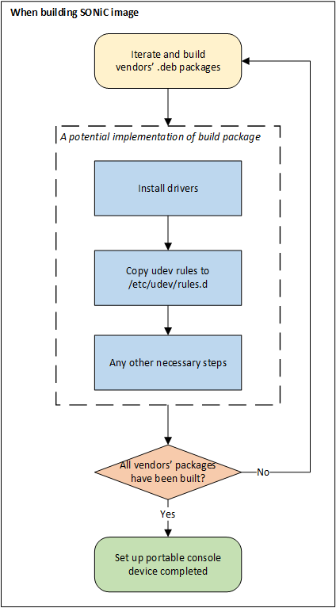
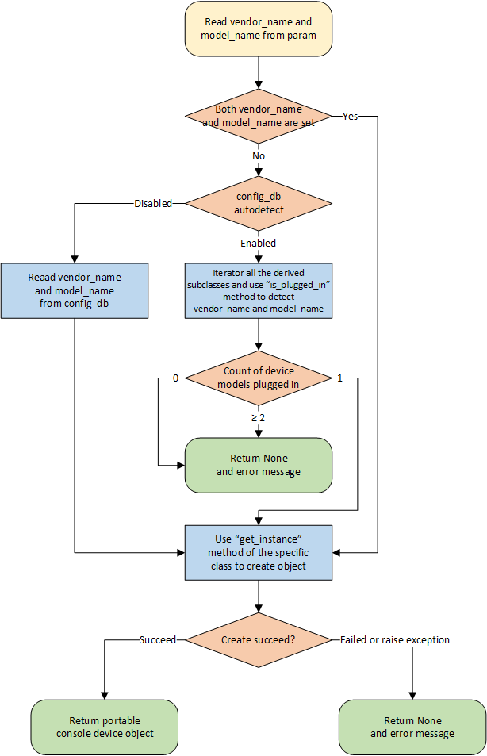

# Portable Console Device Design

## Revision

|  Rev  |   Date   |   Author   | Change Description |
| :---: | :------: | :--------: | ------------------ |
|  0.1  | 12/15/22 | Zhijian Li | Initial version    |

## Overview

In this design document, we provide the standard for adapting console devices to SONiC. If a vendor's console device implements this standard, it will work on any switch with SONiC installed.

## Assumption

1. In the current design, we only support **USB** console devices.
2. Only **one model** of console devices can work on SONiC switch at the same time. If console devices of different models are plugged in at the same time and the user doesn't manually specify `vendor_name` and `model_name`, none of these devices will work. (Look at [Factory Function Design](#factory-function-design) for more information.)
3. Multiple console devices of the **same model** from the **same vendor** can be daisy-chained to extend more console ports. Whether daisy-chaining is supported and how many devices are supported in daisy-chain depends on the vendor's implementation.

## Setup Portable Console Device in SONiC

After the console device is plugged into the SONiC switch, we need to set up the console device in SONiC for further use. The setup process includes:

  1. Install corresponding drivers.
  2. Map console interface from `/dev/ttyUSB<id>` to `/dev/console-<line-number>`. (Usually done with the help of [udev](https://wiki.debian.org/udev))
  3. Any other necessary steps.

Vendors should package all the files and setup procedures into a corresponding `<vendor_name>-<model_name>.deb` file. Since we prefer the setup process completed after building a SONiC image, files used to build `.deb` packages should be put in the [sonic-net/sonic-buildimage](https://github.com/sonic-net/sonic-buildimage) repository, then the `.deb` packages will be built and installed automatically. 

<!-- Pictures exported from Visio are zoomed to 70% -->



For example, vendor can prepare a `50-<vendor_name>-<model_name>.rules` file in the `.deb` package, and copy it to `/etc/udev/rules.d` during the installation phase. In the post installation phase, vendor can use `udevadm trigger -c add` to trigger the udev rules.

### Udev `.rules` File Priority

*This part proposes conventions for vendors who use [udev](https://wiki.debian.org/udev) to map console interface.*

Since [`man udev`](https://man7.org/linux/man-pages/man7/udev.7.html) mentions that "all rules files are collectively sorted and processed in lexical order", the name of a udev `.rules` file usually start with a number (between 01 and 99) which specifies the priority. The larger the number, the higher the priority. If there is no special need, set the priority of the `.rules` file to 50. Then the file name will look like `50-<vendor_name>-<model_name>.rules`.

## CONFIG_DB Changes

### CONSOLE_SWITCH_TABLE

The `CONSOLE_SWITCH_TABLE` holds the configuration database for the purpose of console switch features. This table is filled by the management framework. Three new fields will be added to this table.

```
; Console switch feature table
key = CONSOLE_SWITCH:console_mgmt

; field = value
autodetect  = "enable"/"disable" ; "enable" means factory function will auto detect which vendor's device is plugged in
                                 ; "disable" means factory function will read vendor_name and model_name from config_db
vendor_name = 1*255 VCHAR        ; Vendor name of portable console device.
                                 ; If `autodetect` is set to "enable", `vendor_name` must be empty.
model_name  = 1*255 VCHAR        ; Model name of portable console device.
                                 ; if `autodetect` is set to "enable", `model_name` must be empty.
```

## Portable Console Device API Design

### API Code Directory Structure

All the portable console device API code should be put in `/sonic_platform_common/sonic_console/` (Repository address: [sonic-net/sonic-platform-common](https://github.com/sonic-net/sonic-platform-common)). The directory structure is defined as below:

```
sonic_console/
├── __init__.py
├── console_base.py
├── factory.py
├── line_info.py
├── microsoft
│   ├── __init__.py
│   └── console_simulator.py
└── <vendor-name>
    ├── __init__.py
    └── console_<model-name>.py
```

The base class `PortableConsoleDeviceBase` will be put in `console_base.py`. Class `ConsoleLineInfo`, which is used in the base class, will be put in `line_info.py`. The factory function for creating concrete portable console device object will be put in `factory.py`. Classes implemented by vendors should be put in the corresponding `<vendor-name>` directories. The implementations of different models of the same vendor should be put in the corresponding `console_<model-name>.py` files. For instance, the simulator implemented by Microsoft will be put in `microsoft/console_simulator.py`.

### `ConsoleLineInfo` Class Design

Class `ConsoleLineInfo` contains the information of a console link. It is used in our base class design, so we describe it first:

```python
# line_info.py

class ConsoleLineInfo:

    def __init__(self, device_index, port_name, virtual_device_path):
        """
        Constructor of ConsoleLineInfo class.

        :param device_index: An integer, the index of the console device where the console line is
                                         located (0-based).
        :param port_name: An integer, the name of physical port, same as the front panel of portable
                                      console device.
        :param virtual_device_path: A string, the virtual device path of the console line.
        """
        self._device_index = device_index
        self._port_name = port_name
        self._virtual_device_path = virtual_device_path

    @property
    def device_index(self):
        return self._device_index

    @property
    def port_name(self):
        return self._port_name

    @property
    def virtual_device_path(self):
        return self._virtual_device_path
```

### Base Class Design

The base class for portable console device will be defined like:

```python
# console_base.py

class PortableConsoleDeviceBase:

    @classmethod
    def is_plugged_in(cls):
        """
        Retrives whether portable console device is plugged in or not.
        This method is mandatory for factory function to auto detect vendor name and model name.

        :return: A boolean, True if portable console device is plugged in
                          , False otherwise.
        """
        raise NotImplementedError

    @classmethod
    def get_vendor_name(cls):
        """
        Retrives the vendor name of the `PortableConsoleDeviceBase` concrete subclass.
        This method is mandatory for factory function to create instance from manual configuration.

        :return: A string, denoting vendor name of the `PortableConsoleDeviceBase` concrete subclass.
        """
        raise NotImplementedError

    @classmethod
    def get_model_name(cls):
        """
        Retrives the model name of the `PortableConsoleDeviceBase` concrete subclass.
        This method is mandatory for factory function to create instance from manual configuration.

        :return: A string, denoting model name of the `PortableConsoleDeviceBase` concrete subclass.
        """
        raise NotImplementedError

    @classmethod
    def get_instance(cls):
        """
        Build and return the portable console device object.

        :return: A tuple of two values.
                 The first value is an object derived from `PortableConsoleDeviceBase`. If object
                 cannot be created (eg. due to device not plugged in), return None.
                 The second value is a string. If object cannot be created, return the error message.
                 Otherwise, return an empty string.
        """
        raise NotImplementedError

    def get_num_devices(self):
        """
        Retrieves the number of portable console devices plugged in (by daisy-chain).

        :return: An integer, the number of portable console devices plugged in.
        """
        raise NotImplementedError

    def get_serial_numbers(self):
        """
        Retrieves the serial numbers of portable console devices.

        :return: A dict, the key is the index of the portable console device (integer, 0-based),
                         the value is serial number (string).
                 e.g.
                 {
                     0: "device-S/N-1",
                     1: "device-S/N-2",
                     ...
                 }
        """
        raise NotImplementedError

    def get_num_lines(self):
        """
        Retrieves the number of console lines on portable console devices.

        :return: An integer, the number of console lines on portable console devices.
        """
        raise NotImplementedError

    def get_all_lines(self):
        """
        Retrieves the infomation of all console lines on portable console devices.

        :return: A dict, the key is console line number (integer, 1-based),
                         the value is an object derived from `sonic_console.line_info.ConsoleLineInfo`.
                 e.g. (Suppose 2 devices daisy-chained, each has 24 console ports, port names on front
                       panel start from 1)
                 {
                     1: ConsoleLineInfo(
                         device_index=0,
                         port_name=1,
                         virtual_device_path="/dev/console-1"
                     ),
                     2: ConsoleLineInfo(
                         device_index=0,
                         port_name=2,
                         virtual_device_path="/dev/console-2"
                     ),
                     ...
                     25: ConsoleLineInfo(
                         device_index=1,
                         port_name=1,
                         virtual_device_path="/dev/console-25"
                     ),
                     26: ConsoleLineInfo(
                         device_index=1,
                         port_name=2,
                         virtual_device_path="/dev/console-26"
                     ),
                     ...
                 }
        """
        raise NotImplementedError

    def get_line(self, line_number):
        """
        Retrieves the information of a specific console line on portable console devices.

        :param index: An integer, console line number (1-based).
        :return: An object derived from `sonic_console.line_info.ConsoleLineInfo`.
        """
        raise NotImplementedError

    def get_num_psus(self, device_index):
        """
        Retrieves the number of power supply units available on a specific portable console device.

        :param device_index: An integer, the index (0-based) of the portable console device.
        :return: An integer, the number of power supply units available on the specific portable console
                 device.
        """
        raise NotImplementedError

    def get_all_psus(self):
        """
        Retrieves all power supply units available on the portable console device.

        :return: A dict, the key is the index of the portable console device (integer, 0-based),
                         the value is a list of objects derived from `sonic_psu.pus_base.PsuBase`
                             representing power supply units available on a portable console device.
                 e.g.
                 {
                     0: [PSU0, PSU1],
                     1: [PSU0, PSU1],
                     ...
                 }
        """
        raise NotImplementedError

    def get_psu(self, device_index, psu_index):
        """
        Retrieves a specific power supply unit.

        :param device_index: An integer, the index (0-based) of the portable console device.
        :param psu_index: An integer, the index (0-based) of the power supply unit on the specific
                                      portable console device to retrieve.
        :return: An objects derived from `sonic_psu.pus_base.PsuBase` representing the specified
                 power supply unit.
        """
        raise NotImplementedError
```

Vendors can simply inherit the base class and implement the interface methods. For the methods cannot support, vendors should raise a `TypeError` exception.

> This exception (`TypeError`) may be raised by user code to indicate that an attempted operation on an object is not supported, and is not meant to be.
> 
> --[Built-in Exceptions — Python documentation](https://docs.python.org/3/library/exceptions.html#TypeError)

For example, Microsoft will implement a portable console device simulator like:

```python
# microsoft/console_simulator.py

import copy
from functools import reduce
from sonic_console.console_base import PortableConsoleDeviceBase
from sonic_console.line_info import ConsoleLineInfo

class PortableConsoleDeviceSimulator(PortableConsoleDeviceBase):

    def __init__(self):
        self._serial_number = {
            0: "MSFT-SIM-01",
            1: "MSFT-SIM-02",
        }
        self._lines = {
            1: ConsoleLineInfo(
                device_index=0,
                port_name=1,
                virtual_device_path="/dev/console-1"
            ),
            2: ConsoleLineInfo(
                device_index=0,
                port_name=2,
                virtual_device_path="/dev/console-2"
            ),
            # ...
            25: ConsoleLineInfo(
                device_index=1,
                port_name=1,
                virtual_device_path="/dev/console-25"
            ),
            26: ConsoleLineInfo(
                device_index=1,
                port_name=2,
                virtual_device_path="/dev/console-26"
            ),
            # ...
        }
        self._psus = {
            0: [],
            1: [],
        }

    @classmethod
    def is_plugged_in(cls):
        # TODO: This method has not been fully designed. Will be implemented later.
        return False

    @classmethod
    def get_vendor_name(cls):
        return "Microsoft"

    @classmethod
    def get_model_name(cls):
        return "Simulator"

    @classmethod
    def get_instance(cls):
        try:
            obj = PortableConsoleDeviceSimulator()
            return (obj, "")
        except Exception as e:
            return (None, e)

    def get_num_devices(self):
        return len(self._serial_number)

    def get_serial_numbers(self):
        return copy.deepcopy(self._serial_number)

    def get_num_lines(self):
        return len(self._lines)

    def get_all_lines(self):
        return copy.deepcopy(self._lines)

    def get_line(self, line_number):
        return copy.deepcopy(self._lines.get(line_number, None))

    def get_num_psus(self, device_index):
        return len(self._psus.get(device_index, []))

    def get_all_psus(self):
        return copy.deepcopy(self._psus)

    def get_psu(self, device_index, psu_index):
        psus = self._psus.get(device_index, [])
        if 0 <= psu_index and psu_index < len(psus):
            return psus[psu_index]
        return None
```

### Factory Function Design

Factory function `get_portable_console_device` supports three ways to identify which subclass should be used to create portable console device object:

1. Use function parameter `vendor_name` and `model_name` to specify which subclass to use. (This can be used to write unit test.)
2. If `autodetect` is set to `disable` in `config_db`, then use `vendor_name` in `config_db` to specify which subclass to use. (If a vendor doesn't support the `is_plugged_in` method, the device can be manually confitured to work.)
3. If `autodetect` is set to `enable`, then use `is_plugged_in` method of all the derived subclass to detect which vendor's device is plugged in, and use the corresponding subclass. (**recommended**)

The flow chart below describes how `get_portable_console_device` function works:



As mentioned above, only the third way is our recommendation, which can automatically detect which vendor's device is plugged in and create the corresponing object. The first and second ways are reserved for more flexibility, so they are given higher priority.

## SONiC CLI Design

### Console Show Commands

#### show console summary

This command displays a summary of the portable console device.

* Usage:

  ```
  show console summary
  ```

* Example:

  ```
  admin@sonic:~$ show console summary
  Vendor Name: Microsoft
  Model Name: Simulator
  Serial Number:
      Device 0: MSFT-SIM-1
      Device 1: MSFT-SIM-2
  Auto Detect: Disable
  ```

#### show console vendor_name

This command displays the vendor name of the portable console device. If auto-detect is disabled, it will read the vendor name from CONFIG_DB. Otherwise, it will read the vendor name from `get_vendor_name()`.

* Usage:

  ```
  show console vendor_name
  ```

* Example:

  ```
  admin@sonic:~$ show console vendor_name
  Microsoft
  ```

#### show console model_name

This command displays the model name of the portable console device. If auto-detect is disabled, it will read the model name from CONFIG_DB. Otherwise, it will read the model name from `get_model_name()`.

* Usage:

  ```
  show console model_name
  ```

* Example:

  ```
  admin@sonic:~$ show console model_name
  Simulator
  ```

#### show console serial_number

This command displays the serial number of the portable console device.

* Usage:

  ```
  show console serial_number
  ```

* Example:

  ```
  admin@sonic:~$ show console serial_number
  Console Device  Serial
  --------------  -----------
  Device 0        MSFT-SIM-01
  Device 1        MSFT-SIM-02
  ```

#### show console virtual_device_list

This command displays the virtual device list of the portable console device.

* Usage:

  ```
  show console virtual_device_list
  ```

* Example:

  (Suppose 2 devices daisy-chained, each has 24 console ports, port names on front panel start from 1)
  ```
  admin@sonic:~$ show console virtual_device_list
  Line  Console Device  Port Name  Virtual Device Path
  ----  --------------  ---------  -------------------
     1  Device 0                1  /dev/console-1
     2  Device 0                2  /dev/console-2
   ...
    23  Device 0               23  /dev/console-23
    24  Device 0               24  /dev/console-24
    25  Device 1                1  /dev/console-25
    26  Device 1                2  /dev/console-26
   ...
    47  Device 1               23  /dev/console/47
    48  Device 1               24  /dev/console-48
  ```

#### show console psustatus

This command displays the status of power supply units of the portable console device.

* Usage:

  ```
  show console psustatus
  ```

* Example:

  ```
  admin@sonic:~$ show console psustatus
  Console Device  PSU    Model          Serial        HW Rev      Voltage (V)    Current (A)    Power (W)  Status    LED
  --------------  -----  -------------  ------------  --------  -------------  -------------  -----------  --------  -----
  Device 0        PSU 0  MTEF-PSF-AC-A  MT1621X15246  A3                11.97           4.56        54.56  OK        green
  Device 0        PSU 1  MTEF-PSF-AC-A  MT1621X15257  A3                11.97           4.56        54.56  OK        green
  Device 1        PSU 0  MTEF-PSF-AC-A  MT1621X15265  A3                11.97           4.56        54.56  OK        green
  Device 1        PSU 1  MTEF-PSF-AC-A  MT1621X15297  A3                11.97           4.56        54.56  OK        green
  ```

### Console Config Commands

#### config console auto_detect

This command is used to config portable console device auto-detect. If auto-detect is disabled, `vendor_name` and `model_name` must be configured to ensure portable console device work correctly. **By default, auto-detect is enabled.**

* Usage:

  ```
  config console auto_detect {enable|disable} [<vendor_name> <model_name>]
  ```

* Example:

  ```
  admin@sonic:~$ sudo config console auto_detect disable Microsoft Simulator
  ```

## Reference

* [udev - Linux dynamic device management](https://wiki.debian.org/udev)
* [udev(7) - Linux manual page](https://man7.org/linux/man-pages/man7/udev.7.html)