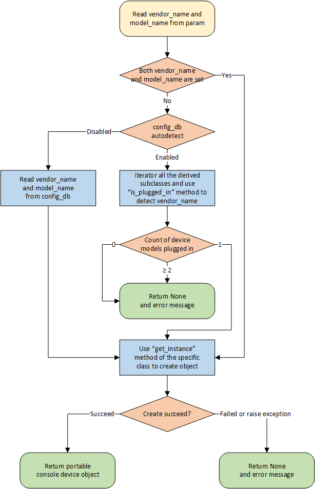

# Portable Console Device Design

## Revision

|  Rev  |   Date   |   Author   | Change Description |
| :---: | :------: | :--------: | ------------------ |
|  0.1  | 05/05/22 | Zhijian Li | Initial version    |

## Overview

In this design document, we provide the standard for adapting console devices to SONiC. If a vendor's console device implements this standard, it will work on any switch with SONiC installed.

## Assumption

1. In current design, we only support **USB** console devices.
2. Only **one** vendor's console devices can work on a SONiC switch at the same time. If console devices from multiple vendors are plugged in at the same time, which vendor's devices will work is an undefined behavior.
3. Multiple console devices from the **same vendor** can be daisy-chained to extend more console ports.

## Setup Portable Console Device in SONiC

After console device be plugged in the SONiC switch, we need to setup the console device in SONiC for further use. The setup process includes:

  1. Install corresponding drivers.
  2. Prepare a udev `.rules` file in `/etc/udev/rules.d/` which can map console interface from `/dev/ttyUSB<id>` to `/dev/console-<id>`.
  3. Any other necessary steps.

Since we prefer the setup process complete after building SONiC image, a directory is provided to vendors to put all the files (eg. driver, udev `.rules`, etc.) they need. A `setup.sh` script file must be placed in this directory, which will be run during the SONiC image build process. After SONiC image has been built, all the necessary files will be installed.

For example, vendor can prepare a `<vendor_name>-<model_name>.rules` file in this directory, and add the following lines in `setup.sh`:

```bash
cp ./<vendor_name>-<model_name>.rules /etc/udev/rules.d
```

Then SONiC will install the `.rules` correctly and load it when system boot.

## Portable Console Device API Design

### API Code Directory Structure

All the portable console device API code should be put in `/sonic_platform_common/sonic_console/`. The directory structure is defined as below:

```
sonic_console/
├── __init__.py
├── base.py
├── factory.py
├── vendor_1
│   └── vendor_1.py
└── vendor_2
    └── vendor_2.py
```

Base class will be put in `base.py`. Classes implemented by vendor will be put in corresponding `<vendor-name>` directory. Factory function for creating concrete portable console device object will be put in `factory.py`. 

### Base Class Design

Base class for portable console device is defined like below:

```python
# base.py

class PortableConsoleDeviceBase:

    @classmethod
    def is_plugged_in(cls):
        """
        Retrives whether portable console device is plugged in or not.
        This method is recommended for all vendors to implement!

        :return: Boolean, True if portable console device is plugged in
                        , False otherwise.
        """
        raise NotImplementedError

    @classmethod
    def get_vendor_name(cls):
        """
        Retrives the vendor name of the `PortableConsoleDeviceBase` concrete subclass.
        This method is mandatory for factory method to create instance from manual configuration.

        :return: String, denoting vendor name of the `PortableConsoleDeviceBase` concrete subclass.
                 eg. Celestica.
        """
        raise NotImplementedError

    @classmethod
    def get_instance(cls):
        """
        Build and return portable console device object.

        :return: Object derived from `PortableConsoleDeviceBase`. If object cannot be created
                 (eg. due to device not plugged in), return None.
        """
        return NotImplementedError

    def get_serial_number(self):
        """
        Retrieves the serial number of portable console device.

        :return: String, denoting serial number of portable console device.
        """
        raise NotImplementedError

    def get_virtual_device_list(self):
        """
        Retrieves the line number and virtual device list of portable console device.

        :return: A dict, the key is line number (integer, 1-based),
                         the value is virtual device name (string).
                 eg.
                 {
                     1: "/dev/console-1",
                     2: "/dev/console-2",
                     ...
                 }
        """
        raise NotImplementedError

    def get_all_psus(self):
        """
        Retrieves all power supply units available on portable console device.

        :return: A list of objects derived from `sonic_psu.pus_base.PsuBase` representing all
                 power supply units available on portable console device.
        """
        raise NotImplementedError
```

Vendors can simply inherit the base class and implement the interface methods. For the methods cannot support, vendors can also raise a `NotImplementedError` exception.

### Factory Function Design

Factory function `get_portable_console_device` supports three ways to identify which subclass should be used to create portable console device object:

1. Use function parameter `vendor_name` to specify which subclass to use. (Highest priority)
2. If `autodetect` is set to `enabled` in `config_db`, then use `vendor_name` in `config_db` to specify which subclass to use. (Second priority)
3. Use `is_plugged_in` method of all the derived subclass to detect which vendor's device is plugged in, and use the corresponding subclass. (Lowest priority but **recommended**)

The flow chart below describes how `get_portable_console_device` function works:



As mentioned above, only the third way is our recommendation, which can automatically find out which vendor's device is plugged in and create the corresponing object. The first and second ways are reserved for more flexibility, so they are given higher priority.

## CONFIG_DB Changes

### CONSOLE_SWITCH_TABLE

The `CONSOLE_SWITCH_TABLE` holds the configuration database for the purpose of console switch features. This table is filled by the management framework. Two new fields will be added to this table.

```
; Console switch feature table
key = CONSOLE_SWITCH:console_mgmt

; field = value
autodetect = "enabled"/"disabled" ; "enabled" means factory function will auto detect which vendor's device is plugged in
                                  ; "disabled" means factory function will read vendor_name from config_db
vendor_name = 1*255 VCHAR         ; vendor name of console switch
```