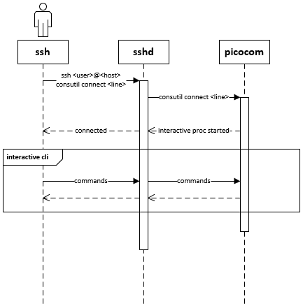
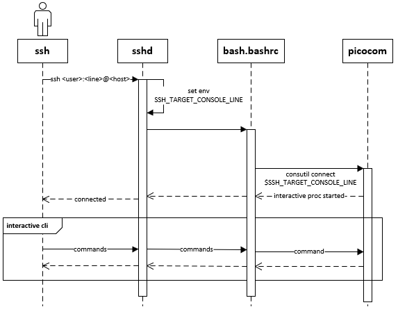
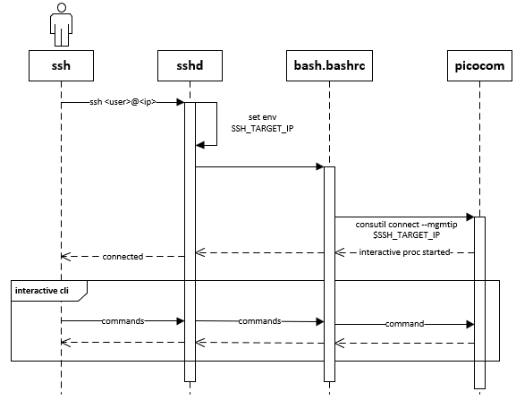

# SONiC Console Switch

# High Level Design Document

#### Revision 0.1

# Table of Contents

# List of Tables

# Revision
| Rev |     Date    |          Authors             | Change Description                |
|:---:|:-----------:|:----------------------------:|-----------------------------------|
| 0.1 | 08/20/2020  |  Jing Kan | Initial version                   |

# About this Manual

This document provides general information about Console switch features implementaion in SONiC

# Scope

This document describes the functionality and high level design of the Console switch features in SONiC.

# Definition/Abbreviation

### Table 1: Abbreviations
| Term | Meaning
|---|---|
| SSH | Secure Shell |

# 1 Feature Overview
Console Switch enable user to manage routers/switchs via console port.

## 1.1 Requirements

### 1.1.1 Functional Requirements

1. Support configuration of flow control on each console port
1. Support configuration of baudrate on each console port
1. Support access console line via reverse SSH

### 1.1.2 Configuration and Management Requirements

1. Support configuration using SONiC CONFIG_DB
1. Support configuration using SONiC MINIGRAPH

## 1.2 Design Overview

### 1.2.1 Basic Approach

Console device(Serial Hub) connect to a SONiC device via USB link.

Persist console configurations to control how to view/connect to a device via serial link, includes:
- Line Number
- Flow Control switch
- Remote Device Name

SONiC use picocom to connect to a remote device.
User use SSH to connect to SONiC device via SONiC management IP.

### 1.2.2 Container

No new containers are introduced.

# 2 Functionality

Refer to section 1

## 2.1 Target Deployment Use Cases

Configure/Manage remote devices via console port in SONiC.

## 2.2 Functional Description

Refer to section 1.1

## 2.3 Limitations

- Configuration is only supported on console port.

# 3 Design

## 3.1 Overview

The design overview at a high level:

SONiC OS is run on a regular network router or switch.
Console device(s) are connect to the SONiC device via USB link as add-on.
Below diagram shows the relationship:


Users can access Network Devices through SONiC Switch.

### 3.1.1 Persist console port configurations

Console port settings are persist in CONFIG_DB.

The configuration can be load from both config_db.json and minigraph.xml

### 3.1.2 Connect to a remote device by using picocom

A command line utility use picocom as client to connect to remote console line.

The command line utility 

### 3.1.3 Reverse SSH

The SONiC ssh enable user to connect to a console line without opening more TCP ports natively.

```bash
ssh <user>@<host> consult connect <line>
```

For better user experience, a customized sshd which can leave forwarding information in user's session will be install to SONiC OS. The default ```/etc/bash.bashrc``` will be modified and it will pick the forwarding setting and enter the picocom session automatically.

Two kinds of reverse SSH connection style will be support:

A: Port Forwarding
```bash
ssh <user>:<line>@<host>
```

B: IP Forwarding
```bash
ssh <user>@<ip>
```

For A, user need to specific the line number by following a colon after username. Below example shows that how to connect to console line 1 via SONiC host.

```bash
# example
ssh tom:1@host
```

By default, the content between colon and @ will be trimed by sshd before it do authentication and the trimed string will be dropped silently. To use this segment as line number for reverse SSH feature, we need to modify the source of OpenSSH and put this segment to a environment variable ```$SSH_TARGET_CONSOLE_LINE```, then we can insert a short script into ```/etc/bash.bashrc``` and run command ```consutil connect $SSH_TARGET_CONSOLE_LINE``` to enter the management session.

For B, there are multiple management IPs binding to the SONiC device and mapping them to each console port, for example:
```
    IP   -> Console Line Number -> Remote Device
10.0.0.1 ->          1                DeviceA
10.0.0.2 ->          2                DeviceB
10.0.0.3 ->          3                DeviceC
```
Then we can use below commands to connect to a remote device, what's more, we can use DNS to help us access the remote device more directly.
```bash
# example
ssh tom@10.0.0.1
ssh tom@10.0.0.2

# Assume domain name DeviceC.co point to 10.0.0.3
ssh tom@DeviceC.co
```

## 3.2 DB Changes

This section describes the changes made to different DBs for supporting Console switch features.

### 3.2.1 CONFIG_DB

The CONSOLE_PORT_TABLE holds the configuration database for the purpose of console port connection parameters. This table is filled by the management framework.

#### CONSOLE_PORT_TABLE
```
; Console port table
key = CONSOLE_PORT:port

; field = value
remote_device = 1*255VCHAR              ; name of remote device
baud_rate     = 1*11 DIGIT              ; baud rate
flow_control  = "0"/"1"                 ; "0" means disable flow control
                                        ; "1" means enable flow control
mgmt_ip       = ipv4_prefix/ipv6_prefix ; optional field, use for ip forwarding

```

### 3.2.2 APP_DB

No changes are introduced in APP_DB.

### 3.2.3 STATE_DB

No changes are introduced in STATE_DB.

### 3.2.4 ASIC_DB

No changes are introduced in ASIC_DB.

### 3.2.5 COUNTER_DB

No changes are introduced in COUNTER DB.

## 3.3 CLI

## 3.3.1 Consutil Command

```
Usage: consutil [OPTIONS] COMMAND [ARGS]...

  consutil - Command-line utility for interacting with switches via console
  device

Options:
  --help  Show this message and exit.

Commands:
  clear    Clear preexisting connection to line
  connect  Connect to switch via console device - TARGET...
  show     Show all /dev/ttyUSB lines and their info
```

### 3.3.1.1 Show line

Show all /dev/ttyUSB lines and their infomations.

```
Usage: sudo consutil show
```

### 3.3.1.2 Clear line

Clear preexisting connection to line.

```
Usage: consutil clear [OPTIONS] LINENUM
```

### 3.3.1.3 Connect line

Connect to switch via console.

```
Usage: consutil connect [OPTIONS] TARGET
```

## 3.4 Reverse SSH

Reverse SSH enable user to connect different remote devices via same TCP port.

### 3.4.1 Basic Usage

```bash
ssh <user>@<host> consutil connect <line>
```

### 3.4.2 Port based Forwarding
```bash
ssh <user>:<line>@<host>
```

### 3.4.3 IP based Forwarding
```bash
ssh <user>@<IP Address(IPv6)>
```

## 3.5 Example Configuration

### 3.5.1 CONFIG_DB object for console port

Console port 1 connect to a remote device ```switch1``` with baud_rate 9600 and enable flow control. Assigned a management IP address to this console line.
```json
{
    "CONSOLE_PORT": {
        "1": {
            "remote_device": "switch1",
            "baud_rate": "9600",
            "flow_control": "1",
            "mgmt_ip": "10.0.0.1"
        }
    }
}
```
User can manage remote device ```switch1``` by using below commands:
```bash
ssh <user>@<host> consutil connect 1
ssh <user>:1@<host>
ssh <user>@10.0.0.1
```

Console port 2 connect to a remote device ```switch2``` with baud_rate 9600 and disable flow control.
```json
{
    "CONSOLE_PORT": {
        "2": {
            "remote_device": "switch2",
            "baud_rate": "9600",
            "flow_control": "0"
        }
    }
}
```
User can manage remote device ```switch2``` by using below commands:
```bash
ssh <user>@<host> consutil connect 2
ssh <user>:2@<host>
```

# 4 Flow Diagrams

## 4.1 Creating of Console Port Objects

TODO

## 4.2 Show lines

TODO

## 4.3 Clear line

TODO

## 4.4 Connect line in SONiC

TODO

## 4.5 Connect line via SSH

### 4.5.1 Basic Usage

Refer to section 3.4.1



### 4.5.2 Port based Forwarding

Refer to section 3.4.2



### 4.5.3 IP based Forwarding

Refer to section 3.4.3



# 5 Error Handling

- Invalid config errors will be displayed via console and configuration will be rejected
- Internal processing errors within SwSS will be logged in syslog with ERROR level

# 6 Serviceability and Debug

Debug output will be captured as part of tech support.

- Internal processing errors within SwSS will be logged in syslog with ERROR level

# 7 Warm Boot Support

The Console switch settings are retained across warmboot.

# 8 Scalability

The Console switch settings are applied to console ports.

The maximum number of console port setting is specific to the console hardware SKU.

The maximum number of add-on console device is specific to the maximum USB dasiy-chain capability.

---
# References
