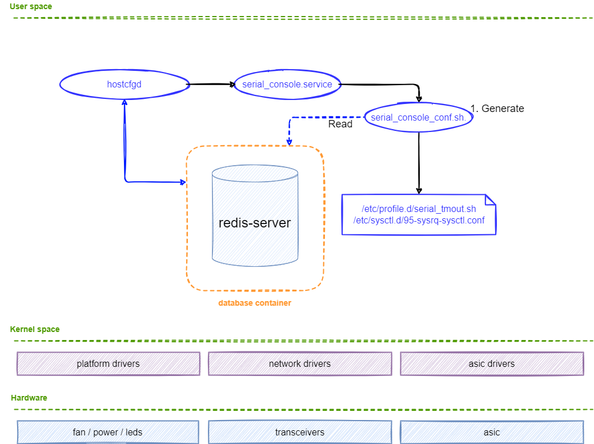
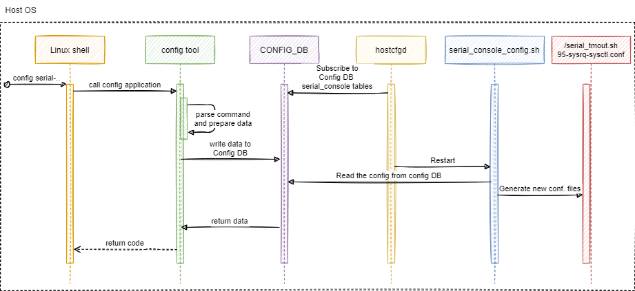

# Serial-console global config HLD
##  Table of Content 
- [Serial-console config HLD](#serial-console-global-config-hld)
- [Table of Content](#table-of-content)
- [Revision](#revision)
- [1. Introduction](#1-introduction)
- [1.1. Scope](#11-scope)
- [1.2. Definitions/Abbreviations](#12-definitionsabbreviations)
- [1.3. Overview](#13-overview)
- [1.4. Requirements](#14-requirements)
- [2. Architecture Design](#2-architecture-design)
    - [2.1. Configuration modules](#21-configuration-modules)
- [3. High-Level Design](#3-high-level-design)
      - [Flow diagram](#flow-diagram)
    - [3.1 Flow description](#31-flow-description)
    - [3.2 serial-console configurations](#32-serial-console-configurations)
- [4. Init flow](#4-init-flow)
    - [4.1. Feature Default](#41-feature-default)
- [5. SAI api](#5-sai-api)
- [6. Configuration and management](#6-configuration-and-management)
    - [6.1. SERIAL_CONSOLE configDB table](#61-serial_console-configdb-table)
    - [6.2. ConfigDB schemas](#62-configdb-schemas)
    - [6.3. CLI/YANG model Enhancements](#63-cliyang-model-enhancements)
    - [6.4. Config DB Enhancements](#64-config-db-enhancements)
    - [6.5. Manifest (if the feature is an Application Extension)](#65-manifest-if-the-feature-is-an-application-extension)
- [7. Warmboot and Fastboot Design Impact](#7-warmboot-and-fastboot-design-impact)
- [8. Restrictions/Limitations](#8-restrictionslimitations)
- [9. Testing Requirements/Design](#9-testing-requirementsdesign)
    - [9.1. Unit Test cases](#91-unit-test-cases)
    - [9.2. System Test cases](#92-system-test-cases)
- [10. Open/Action items - if any](#10-openaction-items---if-any)
###  Revision  

|  Rev  |   Date   |   Author   | Change Description |
| :---: | :------: | :--------: | ------------------ |
|  0.1  | 16/06/23 | Ivan Davydenko | Initial version    |

##  1. Introduction  

###  1.1. Scope  

This hld doc for serial cli global configurations describes the requirements, architecture and general flow details of serial connection config in SONIC OS based switches.

###  1.2. Definitions/Abbreviations 

	serial - connection achieved via serial interface and represented as _tty_ from the linux perspective;
	TCP - Transmission Control protocol	
	
###  1.3. Overview 

We want to allow configuring serial console global settings. This will feature will include two configurations on first phase.

###  1.4. Requirements

This feature requires a dedicated table in the configuration DB, enhancements of hostcfg demon and separate service that updates configutaion files. In order to update the serial-console configurations, we need to have write access in /etc/profile.d/, /proc/sys/kernel/sysrq and /etc/sysctl.d/95-sysrq-sysctl.conf.

##  2. Architecture Design 
###  2.1. Configuration modules


We want to enhance configDB to include table for serial-console global configurations. In addition, serial-config.service will be added to modify configuration files.

##  3. High-Level Design 

We want to enable serial-console configuration in SONIC. In order to do so will touch few areas in the system:
1. configDB - to include a dedicated table for configurations
2. hostcfg demon - to trigger dedicated service on config apply.
3. OS config files - specific for this stage we are only /etc/profile.d/tmout-env.sh and /etc/sysctl.d/95-sysrq-sysctl.conf and /proc/sys/kernel/sysrq are going to be modifed by the serial-config.sh runned by serial-config.service .

##### Flow diagram

### 3.1 Flow description
When the feature is enabled, by modifying the DB manually, user will set serial-console configurations by modifing CONFIG_DB in SERIAL_CONSOLE table.

The hostcfgd daemon will be extended to listen to configurations from SERIAL_CONSOLE table and restarts the serial_console.service. Serial console script will read SERIAL_CONSOLE table and update config files accordingly.

serial-config.service will start `Before=getty-pre.target` and run serial.config.sh to apply configuration before serial console became available.

### 3.2 Serial-console configurations

We want to enable configuring the following attributes:
| Policy             | Action                                                                | Param values        | Default      |
|--------------------|-----------------------------------------------------------------------|---------------------|--------------|
| inactivity timeout | Inactivity timeout for serial-console session                         | 0-35000 (minutes)   | 15           |
| sysrq capabilities | Enabling or disabling SysRq functionality for serial-consoles         | enabled/disabled    | disabled     |

j2 examples:
```
# tmout-env.sh.j2

{# apply only for serial tty #}
tty | grep -q tty &&  \
export TMOUT={{ serial_pol.inactivity_timeout | int * 60 }}
```
```
# sysrq-sysctl.conf.j2





kernel.sysrq={{ sysrq }}
```
##  4. Init flow 

During init flow we will set default configurations as mentioned in the table abowe. Default values will be added to init_cfg.json.j2 .
###  4.1. Feature Default

Description of default values in init_cfg.json regarding serial-console config:
```
inactivity timeout: 15 // in minutes
sysrq capabilities: disabled
```
##  5. SAI api
NA
##  6. Configuration and management 

###  6.1. SERIAL_CONSOLE configDB table

```
SERIAL_CONSOLE:{
	"inactivity_timeout": {{min}}
	"sysrq-capabilities": {{enabled|disabled}}
}
```
### 6.2. ConfigDB schemas
```
; Defines schema for SERIAL_CONSOLE configuration attributes in SERIAL_CONSOLE table:
inactivity_timeout                    = 5*DIGIT                 ; autologout timer - max is 35000 minutes
max_syslogins                         = "enabled/disabled"      ; enabling or disabling sysrq capabilities in linux, default is disabled.  
```

###  6.3. CLI/YANG model Enhancements
```yang
//filename:  sonic-serial-console.yang
module sonic-serial-console {

    yang-version 1.1;

    namespace "http://github.com/Azure/sonic-serial-console";
    prefix cli-sessions;

    description "SERIAL_CONSOLE YANG Module for SONiC-based OS";

    revision 2023-06-07 {
        description "First Revision";
    }

    container sonic-serial-console {

        container SERIAL_CONSOLE {

            description "SERIAL_CONSOLE part of config_db.json";

            key "name";

            leaf inactivity_timeout {
                description "serial-console inactivity-timeout timer value in minutes";
                type int32 {
                    range "0..35000";
                }
                default 15;
            }

            leaf sysrq_capabilities {
                description "managing SysRq capabilities";
                type enumeration {
                    enum disabled;
                    enum enabled;
                }
                default disabled;
            }
        }
        /* end of container SERIAL_CONSOLE */
    }
    /* end of top level container */
}
/* end of module sonic-serial-console */

```
###  6.4. Config DB Enhancements

The ConfigDB will be extended with next objects:

```json
{
	"SERIAL_CONSOLE": {
		"inactivity_timeout": "15",
		"sysrq_capabilities": "disabled",
	}
}
```

###  6.5. Manifest (if the feature is an Application Extension)

NA

		
##  7. Warmboot and Fastboot Design Impact  
NA

##  8. Restrictions/Limitations  

##  9. Testing Requirements/Design  
Explain what kind of unit testing, system testing, regression testing, warmboot/fastboot testing, etc.,
Ensure that the existing warmboot/fastboot requirements are met. For example, if the current warmboot feature expects maximum of 1 second or zero second data disruption, the same should be met even after the new feature/enhancement is implemented. Explain the same here.
Example sub-sections for unit test cases and system test cases are given below. 

###  9.1. Unit Test cases  
Configuration
1. Configure auto-logout for serial-console.
1.1. Configure and apply non-default auto-logout value (1-2 min.)
1.2. Connect and login via serial-console. Validate auto-logout happend in configured time (1-2 min.)
2. Init flow for auto-logout.
2.1. Don't save previous auto-logout configuration and reboot the switch.
2.2. After boot connect and login via serial-console. Validate that auto-logout didn't happend in previously configured time (1-2 min.)
3. Configure sysrq parameter. 
3.1. Configure and apply non-default sysrq-capabilities parameter (enabled)
3.2. Check sysrq parameter value in linux proc filesystem being changed to new applied value of "1"
4. Init flow for sysrq parameter.
4.1.  Don`t save previous sysrq configuration and reboot the switch.
4.2. Check sysrq parameter value in linux proc filesystem being equal to default value of "0".


###  9.2. System Test cases

##  10. Open/Action items - if any 

	
NOTE: All the sections and sub-sections given above are mandatory in the design document. Users can add additional sections/sub-sections if required.
