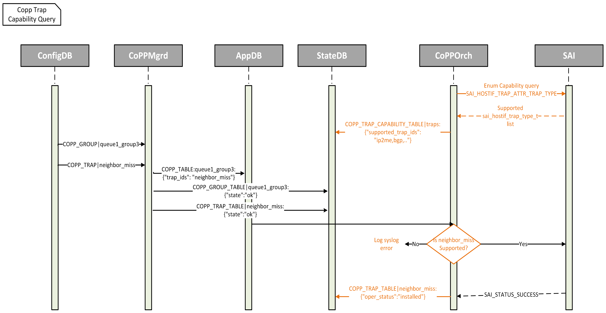

# CoPP Neighbor Miss Trap And Enhancements #

## Table of Content

- [1. Revision](#1-revision)
- [2. Scope](#2-scope)
- [3. Abbreviations](#3-abbreviations)
- [4. Overview](#4-overview)
- [5. Implementation Goals](#5-implementation-goals)
- [6. Architecture Design](#6-architecture-design)
- [7. High-Level Design](#7-high-level-design)
  - [7.1 SWSS Design](#71-swss-design)
  - [7.2 CoPP Capability Query Flow](#72-copp-capability-query-flow)
  - [7.3 CoPP Default Configuration Changes](#73-copp-default-configuration-changes)
  - [7.4 Vslib Changes](#74-vslib-changes)
  - [7.5 Schema Changes](#75-schema-changes)
- [8. SAI API](#8-sai-api)
- [9. Yang Model](#9-yang-model)
- [10. CLI Design](#10-cli-design)
  - [10.1 Show Commands](#101-show-commands)
    - [10.1.1 Command structure](#1011-command-structure)
- [11. Warmboot and Fastboot Design Impact](#11-warmboot-and-fastboot-design-impact)
- [12. Testing Requirements/Design](#12-testing-requirementsdesign)
  - [12.1 Unit Test cases](#121-unit-test-cases)


## 1. Revision  

| Rev | Date     | Author                       | Change Description |
|:---:|:--------:|:---------------------------: |--------------------|
| 0.1 |07/Feb/25 | Ravi Minnikanti **(Marvell)**<br>Gnanapriya S **(Marvell)**| Initial Version    |

## 2. Scope  

This document presents the high-level design for supporting the Neighbor Miss CoPP trap type. It also covers the SAI enum capability query for the trap type attribute, CLI show command support for CoPP, and other CoPP enhancements.

## 3. Abbreviations 

|  Abbreviation | Description                     |
|:-------------:|---------------------------------|
| __CoPP__      | Control Plane Policing          |
| __SWSS__      | Switch State Service            |
| __CLI__       | Command Line interface          |
| __SAI__       | Switch Abstraction Interface    |
| __DVS__       | Docker Virtual Switch           |
| __ARP__       | Address Resolution Protocol     |

## 4. Overview 

SAI has introduced a new HostIf trap type, SAI_HOSTIF_TRAP_TYPE_NEIGHBOR_MISS, to support CoPP configuration for neighbor miss traffic. When there is no reachability to a neighbor, IP packets match the subnet route entry with the next hop pointing to the router interface. These packets are considered neighbor miss packets.

Currently, CoPP for neighbor miss traffic is undefined. A surge in such IP packets sent to the CPU for ARP resolution can potentially impact other CPU traffic, starving critical traffic such as IP2ME. Therefore, it is important to police neighbor miss traffic separately.

This design introduces support for configuring the Neighbor Miss trap type, along with its default configuration.

At present, trap types are applied to SAI without verifying their support, leading to exceptions thrown by orchagent if a trap type is unsupported. Additionally, the current configuration lacks visibility of the trap types supported by SAI, and there is no CoPP CLI support available to display CoPP groups and trap types.

This design proposes adding an SAI enum capability query to orchagent to identify supported trap types. The supported trap types will also be published to the State DB for application visibility. Furthermore, CoPP CLI support will be added to display CoPP configuration and their operational status.

## 5. Implementation Goals

1. Implement configuration support for the Neighbor miss trap type and its default settings in copp_cfg.json.
2. Query the SAI enum capabilities to identify SAI neighbor miss trap support and configure only if it is supported.
3. Publish the supported trap types to STATE_DB.
4. Introduce CoPP CLI support to display trap CoPP configuration.
5. Add support for the enum capability query API in the SAI VS library.
6. Include the neighbor_miss trap in the CoPP dump command CLI output.

## 6. Architecture Design 

No architecture changes are required for this feature.

## 7. High-Level Design

### 7.1 SWSS Design

Two options are proposed to handle the SAI enum capability query for the trap type attribute. 

#### Option 1

During initialization, Copporch in Orchagent will perform an SAI enum capability query to identify supported trap types and publish them to a new CoPP trap capability table in STATE_DB. If SAI does not support the enum capability query API, Copporch will throw an exception. Copporch will maintain the supported trap enums returned by SAI enum capability query in a local data structure named `supported_trap_ids`.

For every CoPP trap configuration received through APPL_DB, Copporch will verify its trap type capability in the `supported_trap_ids` local data structure before invoking the SAI API to configure the trap type. An error log will be generated if the trap type is not supported.

A new field called "oper_status" will be added to the existing COPP_TRAP_TABLE in STATE_DB to track the operational status of the trap type. Once a trap type is successfully installed or removed, Copporch will add or remove a new field in existing COPP_GROUP_TABLE STATE_DB table called "oper_status".

#### Pros:
1. Clean Orchagent code.

#### Cons:
1. Mandates SAI enum capability query for trap type attribute from VendorSAI.

#### Option 2

During initialization, Copporch in Orchagent will perform an SAI enum capability query to identify supported trap types and publish them to a new CoPP trap capability table in STATE_DB. If the SAI does not support the enum capability query API, Copporch will print a warning log and proceed with the initialization. Additionally, Copporch will maintain the supported trap enums in a local data structure named `supported_trap_ids`. In case enum capability query is not supported, `supported_trap_ids` will be empty.

Considering that vendor SAI support for the new trap type introduced in SAI is limited, a new vector of type sai_hostif_trap_type_t named `require_capability_check_trap_ids` will be added to Copporch. This vector is a hardcoded list of trap types that need capability verification. Initially, this list will only include the neighbor miss enum, but new enums can be added in the future as required. 

```cpp
const unordered_set<sai_hostif_trap_type_t> require_capability_check_trap_ids = {
    SAI_HOSTIF_TRAP_TYPE_NEIGHBOR_MISS
};
```

Whenever CoPP trap configuration is received from APPL_DB, Copporch will first check if the trap is in the `require_capability_check_trap_ids` list. If exists, Copporch will check whether supported by vendor SAI using supported trap list. If the trap type is not supported, Copporch will log an error log and skip the configuration. If the trap type is supported, Copporch will invoke the SAI API to configure the trap type.

#### Pros:
1. Backward compatible
2. No mandate for SAI enum capability query for trap type attribute from VendorSAI.

#### Cons:
1. Option 1 offers cleaner solution.

### 7.2 CoPP Capability Query Flow

__Figure 1: CoPP Capability Query Flow__


### 7.3 CoPP Default Configuration Changes

A default configuration for Neighbor miss trap type will be added to copp_cfg.j2. Neighbor miss is default trap type with always_enabled set to true.

A new trap group queue1_group3 will be added to the default configuration with the following settings:

```json
  "queue1_group3": {
          "trap_action":"trap",
          "trap_priority":"1",
          "queue": "1",
          "meter_type":"packets",
          "mode":"sr_tcm",
          "cir":"200",
          "cbs":"200",
          "red_action":"drop"
  }

{

    "neighbor_miss": {
          "trap_ids": "neighbor_miss",
          "trap_group": "queue1_group3",
          "always_enabled": "true"
    }
}

```

### 7.4 Vslib Changes

The enum capability query support for SAI_HOSTIF_TRAP_ATTR_TRAP_TYPE attribute will be added to the SAI VS library

### 7.5 Schema Changes

State DB will have a new table called COPP_TRAP_CAPABILITY_TABLE which will have the supported trap types. 
Introducing new value pair "oper_status" field in existing COPP_TRAP_TABLE, to track the operational status of the trap type.

#### State-DB Schema

New COPP_TRAP_CAPABILITY_TABLE

 ```
 key                   = "COPP_TRAP_CAPABILITY_TABLE|traps"
 ; field               = value
 supported_trap_ids    = STRING
 ```

oper_status field in COPP_TRAP_TABLE

```
 key                   = "COPP_TRAP_TABLE|<trap_name>"
 ; field               = value
 state                 = STRING
 oper_status           = STRING
```

#### Example

```json
"COPP_TRAP_TABLE|neighbor_miss": {
    "type": "hash",
    "value": {
      "state": "ok",
      "oper_status": "installed"
    },
    "ttl": -0.001,
    "expireat": 1741187975.7037652
},

{
  "COPP_TRAP_CAPABILITY_TABLE|traps": {
	"type": "hash",
	"value": {
	  "supported_trap_ids": "stp,lacp,eapol,lldp,pvrst,igmp_query,igmp_leave,igmp_v1_report,igmp_v2_report,igmp_v3_report,sample_packet,udld,arp_req,arp_resp,dhcp,ospf,pim,vrrp,dhcpv6,ospfv6,vrrpv6,neigh_discovery,mld_v1_v2,mld_v1_report,mld_v1_done,mld_v2_report,src_nat_miss,dest_nat_miss,isis,ip2me,ssh,snmp,bgp,bgpv6,bfd,bfdv6,bfd_micro,bfdv6_micro,ldp,l3_mtu_error,ttl_error"
	},
	"ttl": -0.001,
	"expireat": 1738645275.8970804
  }
}
```

## 8. SAI API

This feature uses existing SAI APIs. No new SAI APIs are required.

| API                                        | Attribute                        |  Attribute Value                   |
|:-------------------------------------------|:---------------------------------|:-----------------------------------|
| sai_query_attribute_enum_values_capability | SAI_HOSTIF_TRAP_ATTR_TRAP_TYPE   |                                    |
| create_hostif_trap_fn                      | SAI_HOSTIF_TRAP_ATTR_TRAP_TYPE   | SAI_HOSTIF_TRAP_TYPE_NEIGHBOR_MISS |
| remove_hostif_trap_fn                      | SAI_HOSTIF_TRAP_ATTR_TRAP_TYPE   | SAI_HOSTIF_TRAP_TYPE_NEIGHBOR_MISS |
| set_hostif_trap_attribute_fn               | SAI_HOSTIF_TRAP_ATTR_TRAP_TYPE   | sai_object_id_t                    |

## 9. Yang Model

No changes. Yang model for CoPP is defined in [sonic-copp.yang](https://github.com/Azure/sonic-buildimage/blob/master/src/sonic-yang-models/yang-models/sonic-copp.yang).


## 10. CLI Design

### 10.1 Show Commands

A new CLI command, `show copp configuration`, is being introduced. The purpose of this command is to display the CoPP configuration applied to the ASIC. The command will show CoPP information from copp_cfg.json and CONFIG_DB with the latter taking precedence. Additionally, for each trap_id, the command will also display the operational status from STATE_DB.

#### 9.1.1 Command structure

```bash
show
|--- copp
     |--- configuration
	            |--- detailed [ --trapid <trapid> | --group <group> ]
```

**Example**:

In below example BGP and BGPv6 traps are not installed as feature is disabled.

```bash
root@0ed93b5ee13c:/# show copp configuration
TrapId           Trap Group       CBS    CIR  mode     meter_type    oper_status
---------------  -------------  -----  -----  -------  ------------  ------------
arp_req          queue4_group2    600    600  packets  sr_tcm        installed
arp_resp         queue4_group2    600    600  packets  sr_tcm        installed
bgp              queue4_group1   6000   6000  packets  sr_tcm        not_installed
bgpv6            queue4_group1   6000   6000  packets  sr_tcm        not_installed
dest_nat_miss    queue1_group2    600    600  packets  sr_tcm        installed
dhcp             queue4_group3    100    100  packets  sr_tcm        installed
dhcpv6           queue4_group3    100    100  packets  sr_tcm        installed
eapol            queue4_group1   6000   6000  packets  sr_tcm        installed
ip2me            queue1_group1   6000   6000  packets  sr_tcm        installed
lacp             queue4_group1   6000   6000  packets  sr_tcm        installed
lldp             queue4_group3    100    100  packets  sr_tcm        installed
neigh_discovery  queue4_group2    600    600  packets  sr_tcm        installed
neighbor_miss    queue1_group3    600    600  packets  sr_tcm        not_installed
src_nat_miss     queue1_group2    600    600  packets  sr_tcm        installed
udld             queue4_group3    100    100  packets  sr_tcm        installed
```

**Detailed View Example**:

```bash
root@0ed93b5ee13c:/# show copp configuration detailed --trapid neighbor_miss
Trap Group.................. queue1_group3
queue....................... 1
Trap Priority............... 1
Trap Action................. trap
Meter Type.................. packets
Mode........................ sr_tcm
CBS......................... 200
CIR......................... 200
Green Action................ forward
Yellow Action............... forward
Red Action.................. drop
Oper Status................. not_installed

root@0ed93b5ee13c:/# show copp configuration detailed --group queue1_group3
Trap Id(s).................. neighbor_miss
queue....................... 1
Trap Priority............... 1
Trap Action................. trap
Meter Type.................. packets
Mode........................ sr_tcm
CBS......................... 200
CIR......................... 200
Yellow Action............... forward
Green Action................ forward
Red Action.................. drop
```

## 10. Warmboot and Fastboot Design Impact

No warmboot and fastboot impact is expected for this feature.

## 11. Testing Requirements/Design

### 11.1. Unit Test cases

#### 11.1.1. SWSS Unit Test Cases

* The test_copp.py DVS test will be extended to verify the default settings for neighbor_miss.
* Currently, the existing test cases in test_copp.py add CoPP configuration to CONFIG_DB and check ASIC_DB to validate the configuration. These test cases will be extended to also verify the oper_status field in STATE_DB.

#### 11.1.2. CLI Mock Test Cases

* New CLI mock test case will be added to verify the CoPP CLI show command.

## 12. System Test Plan

### 12.1. Test Cases

There is an existing test case in sonic-mgmt PTF to test CoPP neighbor miss traffic. However, the test case targets testing whether the neighbor miss trap is being policied under default CoPP configuration. 

New test cases will be added to verify the neighbor miss trap configuration with its default settings in copp_cfg.json.
Test case will add an empty or NULL configuration for neighbor miss in CONFIG_DB to override the default configuration and verify the oper_status of neighbor_miss in CLI output.