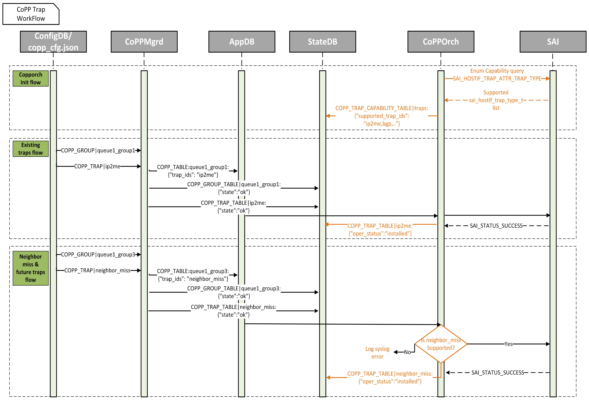

# CoPP Neighbor Miss Trap And Enhancements #

## Table of Content

- [1. Revision](#1-revision)
- [2. Scope](#2-scope)
- [3. Abbreviations](#3-abbreviations)
- [4. Overview](#4-overview)
- [5. Implementation Goals](#5-implementation-goals)
- [6. Architecture Design](#6-architecture-design)
- [7. High-Level Design](#7-high-level-design)
  - [7.1 SWSS Design](#71-swss-design)
    - [7.1.1 CoPP Init FlowChart](#711-copp-init-flowchart)
    - [7.1.2 CoPP Config FlowChart](#712-copp-config-flowchart)
  - [7.2 CoPP Trap WorkFlow](#72-copp-trap-workflow)
  - [7.3 CoPP Default Configuration Changes](#73-copp-default-configuration-changes)
  - [7.4 Schema Changes](#74-schema-changes)
- [8. SAI API](#8-sai-api)
- [9. Yang Model](#9-yang-model)
- [10. CLI Design](#10-cli-design)
  - [10.1 Show Commands](#101-show-commands)
    - [10.1.1 Command structure](#1011-command-structure)
- [11. Warmboot and Fastboot Design Impact](#11-warmboot-and-fastboot-design-impact)
- [12. Testing Requirements/Design](#12-testing-requirementsdesign)
  - [12.1 Unit Test cases](#121-unit-test-cases)
    - [12.1.1 SWSS Unit Test Cases](#1211-swss-unit-test-cases)
    - [12.1.2 CLI UT Test Cases](#1212-cli-ut-test-cases)
- [13. System Test Plan](#13-system-test-plan)
  - [13.1 Test Cases](#131-test-cases)

## 1. Revision  

| Rev | Date     | Author                       | Change Description |
|:---:|:--------:|:---------------------------: |--------------------|
| 0.1 |07/Feb/25 | Ravi Minnikanti **(Marvell)**<br>Gnanapriya S **(Marvell)**| Initial Version   |

## 2. Scope  

This document presents the high-level design for supporting the Neighbor Miss CoPP trap type. It also covers the SAI enum capability query for the trap type attribute, CLI show command support for CoPP.

## 3. Abbreviations 

|  Abbreviation | Description                     |
|:-------------:|---------------------------------|
| __CoPP__      | Control Plane Policing          |
| __SWSS__      | Switch State Service            |
| __CLI__       | Command Line interface          |
| __SAI__       | Switch Abstraction Interface    |
| __ARP__       | Address Resolution Protocol     |

## 4. Overview 

In today’s SONIC system, CoPP for neighbor miss traffic is undefined. A surge in such IP packets sent to the CPU for ARP resolution can potentially impact other CPU traffic, starving critical traffic such as IP2ME. Therefore, it is crucial to police neighbor miss traffic separately.

Furthermore, the current implementation applies trap types to SAI without verifying their support, leading to exceptions in orchagent. Additionally, the current configuration lacks visibility of the trap types supported by SAI, and there is no CoPP CLI support available to display configured CoPP groups and trap types.

This design proposes solution to the aforementioned problem. By introducing management support for neighbor miss trap type, which allows independent policing for neighbor miss packets. This ensures that surges in neighbor miss traffic will not impact other critical CPU-bound traffic and Prevents CPU starvation by controlling neighbor miss traffic independently. SAI also supports a trap type, SAI_HOSTIF_TRAP_TYPE_NEIGHBOR_MISS, to specifically identify and control neighbor miss traffic.

Additionally this design proposes an enhancement in orchagent to perform an SAI enum capability query to identify supported trap types in the system and prevent exceptions caused by unsupported trap types.

To improve manageability and troubleshooting capabilities, the design introduces a new CoPP CLI command to display CoPP configurations, including CoPP groups, associated trap types, and their operational status.

## 5. Implementation Goals

1. This design introduces support for configuring the neighbor miss trap type, along with its default configuration.
2. Perform an SAI enum capability query to identify supported trap types and configure neighbor_miss only if they are supported.
3. Publish the supported trap types to STATE_DB.
4. Implement CoPP CLI support to display the trap CoPP configuration.

## 6. Architecture Design 

No architecture changes are required for this feature.

## 7. High-Level Design

### 7.1 SWSS Design

To maintain backward compatibility and considering that support for newly introduced trap types in SAI is vendor-dependent, an enum capability query for all trap types has been implemented in orchagent, with intelligent exceptions.

During initialization, Copporch in Orchagent will perform an SAI enum capability query to identify supported trap types and maintain them in a local list called `supported_trap_ids`.

Additionally, Copporch will maintain a list called `default_supported_trap_ids`, which contains currently supported trap IDs in copporch in orchagent. If the SAI does not support the enum capability query API, Copporch will assume that the `default_supported_trap_ids` are supported for backward compatibility.

The list of supported trap IDs will be published to a new CoPP trap capability table in STATE_DB.

When CoPP trap configuration is received from APPL_DB:

1. Copporch will first check if the trap is supported in the `supported_trap_ids` list.
2. The trap configuration will be applied only if the trap is supported.
3. If the trap is not supported, a syslog error is logged.

#### 7.1.1 CoPP Init FlowChart
__Figure 1: CoPP Init FlowChart__


#### 7.1.2 CoPP Config FlowChart
__Figure 2: CoPP Config FlowChart__


### 7.2 CoPP Trap WorkFlow

__Figure 3: CoPP Trap WorkFlow__



### 7.3 CoPP Default Configuration Changes

A default configuration for neighbor miss trap type will be added to copp_cfg.j2. Neighbor miss is default trap type with always_enabled set to true.

A new trap group queue1_group3 will be added to the default configuration with the following settings:

```json
  "queue1_group3": {
          "trap_action":"trap",
          "trap_priority":"1",
          "queue": "1",
          "meter_type":"packets",
          "mode":"sr_tcm",
          "cir":"200",
          "cbs":"200",
          "red_action":"drop"
  }

{

    "neighbor_miss": {
          "trap_ids": "neighbor_miss",
          "trap_group": "queue1_group3",
          "always_enabled": "true"
    }
}

```

### 7.4 Schema Changes

State DB will have a new table called COPP_TRAP_CAPABILITY_TABLE which will have the supported trap types. 
Introducing new value pair "hw_status" field in existing COPP_TRAP_TABLE, to track the operational status of the trap type.

#### State-DB Schema

New COPP_TRAP_CAPABILITY_TABLE

 ```
 key                   = "COPP_TRAP_CAPABILITY_TABLE|traps"
 ; field               = value
 trap_ids              = STRING
 ```

hw_status field in COPP_TRAP_TABLE

```
 key                   = "COPP_TRAP_TABLE|<trap_name>"
 ; field               = value
 state                 = STRING
 hw_status             = STRING
```

#### Example

```json
"COPP_TRAP_TABLE|neighbor_miss": {
    "type": "hash",
    "value": {
      "state": "ok",
      "hw_status": "installed"
    },
    "ttl": -0.001,
    "expireat": 1741187975.7037652
},

{
  "COPP_TRAP_CAPABILITY_TABLE|traps": {
	"type": "hash",
	"value": {
	  "trap_ids": "stp,lacp,eapol,lldp,pvrst,igmp_query,igmp_leave,igmp_v1_report,igmp_v2_report,igmp_v3_report,sample_packet,udld,arp_req,arp_resp,dhcp,ospf,pim,vrrp,dhcpv6,ospfv6,vrrpv6,neigh_discovery,mld_v1_v2,mld_v1_report,mld_v1_done,mld_v2_report,src_nat_miss,dest_nat_miss,isis,ip2me,ssh,snmp,bgp,bgpv6,bfd,bfdv6,bfd_micro,bfdv6_micro,ldp,l3_mtu_error,ttl_error"
	},
	"ttl": -0.001,
	"expireat": 1738645275.8970804
  }
}
```

## 8. SAI API

This feature uses existing SAI APIs. No new SAI APIs are required.

| API                                        | Attribute                        |  Attribute Value                   |
|:-------------------------------------------|:---------------------------------|:-----------------------------------|
| sai_query_attribute_enum_values_capability | SAI_HOSTIF_TRAP_ATTR_TRAP_TYPE   |                                    |
| create_hostif_trap_fn                      | SAI_HOSTIF_TRAP_ATTR_TRAP_TYPE   | SAI_HOSTIF_TRAP_TYPE_NEIGHBOR_MISS |
| remove_hostif_trap_fn                      | SAI_HOSTIF_TRAP_ATTR_TRAP_TYPE   | SAI_HOSTIF_TRAP_TYPE_NEIGHBOR_MISS |
| set_hostif_trap_attribute_fn               | SAI_HOSTIF_TRAP_ATTR_TRAP_TYPE   | sai_object_id_t                    |

## 9. Yang Model

No changes. Yang model for CoPP is defined in [sonic-copp.yang](https://github.com/Azure/sonic-buildimage/blob/master/src/sonic-yang-models/yang-models/sonic-copp.yang).

## 10. CLI Design

### 10.1 Show Commands

A new CLI command, `show copp configuration`, is being introduced. The purpose of this command is to display the CoPP configuration applied to SAI. The command will retrieve configuration from copp_cfg.json and CONFIG_DB. Additionally, the command will display the operational status of the trap types retrieved from STATE_DB.

__Figure 4: CoPP CLI WorkFlow__


#### 10.1.1 Command structure

```bash
show
|--- copp
     |--- configuration
	            |--- detailed [ --trapid <trapid> | --group <group> ]
```

**Example**:

In below example BGP and BGPv6 traps are not installed as feature is disabled.

```bash
admin@sonic:~$ show copp configuration
TrapId           Trap Group     Action      CBS    CIR  Meter Type    Mode    HW Status
---------------  -------------  --------  -----  -----  ------------  ------  -------------
arp_req          queue4_group2  copy        600    600  packets       sr_tcm  installed
arp_resp         queue4_group2  copy        600    600  packets       sr_tcm  installed
bgp              queue4_group1  trap       6000   6000  packets       sr_tcm  not-installed
bgpv6            queue4_group1  trap       6000   6000  packets       sr_tcm  not-installed
dest_nat_miss    queue1_group2  trap        600    600  packets       sr_tcm  installed
dhcp             queue4_group3  trap        100    100  packets       sr_tcm  installed
dhcpv6           queue4_group3  trap        100    100  packets       sr_tcm  installed
eapol            queue4_group1  trap       6000   6000  packets       sr_tcm  installed
ip2me            queue1_group1  trap       6000   6000  packets       sr_tcm  installed
lacp             queue4_group1  trap       6000   6000  packets       sr_tcm  installed
lldp             queue4_group3  trap        100    100  packets       sr_tcm  installed
neigh_discovery  queue4_group2  copy        600    600  packets       sr_tcm  installed
neighbor_miss    queue1_group3  trap        200    200  packets       sr_tcm  installed
sample_packet    queue2_group1  trap       1000   1000  packets       sr_tcm  not-installed
src_nat_miss     queue1_group2  trap        600    600  packets       sr_tcm  installed
udld             queue4_group3  trap        100    100  packets       sr_tcm  installed
```

**Detailed View Example**:

```bash
admin@sonic:~$ show copp configuration detailed --trapid neighbor_miss
Trap Group.................. queue1_group3
Trap Action................. trap
Trap Priority............... 1
Queue....................... 1
CBS......................... 200
CIR......................... 200
Meter Type.................. packets
Mode........................ sr_tcm
Yellow Action............... forward
Green Action................ forward
Red Action.................. drop
HW Status................... installed

admin@sonic:~$ show copp configuration detailed --group queue1_group3
Trap Id(s).................. neighbor_miss
queue....................... 1
Trap Priority............... 1
Trap Action................. trap
Meter Type.................. packets
Mode........................ sr_tcm
CBS......................... 200
CIR......................... 200
Yellow Action............... forward
Green Action................ forward
Red Action.................. drop
```

## 11. Warmboot and Fastboot Design Impact

No warmboot and fastboot impact is expected for this feature.

## 12. Testing Requirements/Design

### 12.1. Unit Test cases

#### 12.1.1. SWSS Unit Test Cases

* **Neighbor Miss default configuration verification:** Default copp group and trap configuration of neighbor miss will be added to test_copp.py to verify the default configuration.
* **Trap hw_status verification:** Existing test cases currently verify trap configuration by SET/DEL on CONFIG_DB and vaidating the configuration by GET on ASIC_DB. These test cases will be extended to also verify the hw_status field in STATE_DB.
* **STATE_DB capability table verification:** New test cases will be added to verify the COPP_TRAP_CAPABILITY_TABLE table in STATE_DB. Test case will perform GET operation and verify trap_id_list field in the table is not empty.

#### 12.1.2. CLI UT Test Cases

* New CLI UT cases will be added to verify the CoPP CLI show command. Test cases will verify the output of the show command with input from mock_copp_cfg.json and mock CoPP tables in CONFIG_DB and STATE_DB test data.

## 13. System Test Plan

### 13.1. Test Cases

An existing test case in the sonic-mgmt PTF framework tests VLAN subnet route traffic policing under the default CoPP configuration.

A new test case will be introduced to verify the neighbor miss trap configuration with its default settings in copp_cfg.json using VLAN subnet route traffic. This test case will also update/empty/NULL configuration for neighbor miss in CONFIG_DB to override the default settings and verify the operational status of neighbor miss in the CLI output accordingly.
