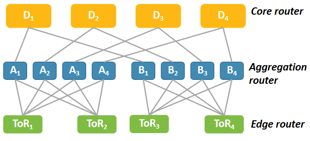

# Coral in SONiC
# High Level Design Document
#### Rev 0.1

# Table of Contents
todo

# Revision

| Rev   | Date  | Author | Change Description |
| :---: | :---: | :----- | :----------------- |
|       |       |        |                    |

# About this Manual
This document describes the design details of Coral feature.

TODO

# Scope
This document describes the high level design details about how Coral works.

# Definitions/Abbreviations
###### Table 1: Abbreviations
| Abbreviation |          Full form          |
| ------------ | --------------------------- |
| NAT          | Network Address Translation |
| ACL          | Access Control List         |
| FIB          | Forwarding Information Base |
| CLI          | Command Line Interface      |
| LEC          | Local Equivalence Class     |
| DPV          | Data plane verification     |

# 1 Motivation

Network errors such as forwarding loops, undesired blackholes and waypoint violations are the outcome of various
issues (e.g., software bugs, faulty hardware, protocol misconfigurations, and oversight negligence). They can happen in
all types of networks (e.g., enterprise networks, wide area networks and data center networks), and have both disastrous
financial and social consequences. Data plane verification (DPV) is important for finding such network errors. 
Current DPV tools employ a centralized architecture, where a server collects the data planes of all devices and verifies them. 
Despite substantial efforts on accelerating DPV, this centralized architecture is inherently unscalable. 

In order to tackle the scalability challenge of DPV, Coral is designed, a generic, distributed,
on-device DPV framework, which circumvents the scalability bottleneck of centralized design. The key insight is as follows. A
directed acyclic graph (DAG), which represents all valid paths in
the network, is called DVNet. The problem of DPV can be transformed into a counting problem in DVNet; the latter can then be decomposed into small tasks at nodes on the DVNet, which can be distributively executed at corresponding network devices, enabling scalability.

The picture below demonstrates the architechture and workflow of Coral.
<center>
<br/>
Figure 1. The architecture and workflow of Coral.
</center><br/>

Firstly, DVNet is generated based on specified verification requirement and actual network topology. Then, the counting problem is distributed to individual switches. On each switch, counting result is computed depending on received verification messages and delivered to corresponding upstream node on DVNet. Finally, the source switch would be able to determine whether there is an error on data plane according to received verification messages.


# 2 Overview

## 2.1 Functionality Overview
1. Coral feature allows user to verify a wide range of requirements, e.g., reachability, isolation, loop-freeness, black hole freeness and waypoint reachability.
2. Coral is able to verify data plane in the scenario of both burst update and incremental update.
3. Coral is also able to verify RCDC local contracts.
## 2.2 Requirements Overview
1. In order to compute Local Equivalence Class (LEC) table, Coral needs to have access to FIB stored in kernel.
2. An agent is needed to deliver verification messages containing counting result to upstream switch.
3. New CLI commands need to be added to specify data plane verification requirements and show related information, e.g., verification results, counting numbers, and status.

# 3 Functionality
## 3.1 Functionality Description
Coral detects a wide range of network errors (e.g., switch operating system errors) by checking the actual 
data plane on the network device, so that the operator can detect the network error in time, take relevant 
measures to correct the error, and reduce the loss as much as possible. Coral can efficiently validate a 
wide range of network forwarding requirements of operators in different scenarios. If the current network 
status does not meet the operator's network forwarding requirements, then prompt the operator network error.
Coral generates a directed acyclic graph DVnet based on the network topology and requirements, and performs a reverse counting process on DVnet,
finally determines whether the network is wrong based on the count result and the given requirement.

## 3.2 Use Case


Figure 2. An example topology and requirement.


Figure 3. The network data plane.


Figure 4. The DVNet and the counting process.

### 3.2.1 Green Start Use Case
Coral is used in the scenario of green start, i.e., all forwarding rules are
installed to corresponding switches all at once.
Note that P2 ∩ P3 = ∅ and P1 = P2 ∪ P3. Each u in DVNet initializes a packet space → count mapping, (P1, 0), except for D1 that initializes 
the mapping as (P1, 1) (i.e., one copy of any packet in P1 will be sent to the correct external ports). Afterwards, we traverse all the nodes 
in DVNet in reverse topological order to update their mappings. Each node u checks the data plane of u.dev to find the set of next-hop devices 
u.dev will forward P1 to. If the action of forwarding to this next-hop set is of ALL-type, the mapping at u can be updated by adding up the 
count of all downstream neighbors of u whose corresponding device belongs to the set of next-hops of u.dev for forwarding P1. For example, 
node W1 updates its mapping to (P1, 1) because device W forwards to D, but node B 2’s mapping is still (P1, 0) because B does not
forward P1 to D. Similarly, although W 1 has two downstream neighbors B2 and D1, each with an updated mapping (P1, 1). At its turn, 
we update its mapping to (P1, 1) instead of (P1, 2), because device W only forwards P1 to D, not B.
Consider the mapping update at A1. A would forward P2 to either B or W. A forwards P2 to B, the mapping at A1 is (P2, 0), because 
B1’s updated mapping is (P1, 0) and P2 ⊂ P1.  A forwards P2 to W , the mapping at A1 is (P2, 1) because W 1’s updated mapping is (P1, 1). 
Therefore, the updated mapping for P2 at A1 is (P2, [0, 1]). In the end, the updated mapping of S1 [(P2, [0, 1]), (P3, 1)] reflects the final 
counting results, indicating that the data plane in Figure 1b does not satisfy the requirements in Figure1b. In other words, the network 
data plane is erroneous.
### 3.2.2 Incremental Update Use Case
Consider a scenario in Figure 1, where B updates its data plane to forward P1 to W , instead of to D. The changed mappings of different 
nodes are circled with boxes in Figure 1c. In this case, device B locally updates the task results of B1 and B2 to [(P1, 1)] and [(P1, 0)], 
respectively, and sends corresponding updates to the devices of their upstream neighbors, i.e., [(P1, 1)] sent to A following the opposite 
of (A1, B1) and [(P1, 0)] sent to W following the opposite of (W 1, B2).
Upon receiving the update, W does not need to update its mapping for node W1, 
because W does not forward any packet to B. As such, W does not need to send any update to A along the opposite of (A1,W 1). In contrast, 
A needs to update its task result for node A1 to [(P1, 1)] because (1) no matter whether A forwards packets in P2 to B or W , 1 copy of 
each packet will be sent to D, and (2) P2 ∪ P3 = P1. After
updating its local result, A sends the update to S along the opposite of (S1,A1). Finally, S updates its local result for S1 to [(P1, 1)], 
i.e., the requirement is satisfied after the update.
### 3.2.3 Verifying RCDC Local Contracts Using Coral



Figure 5: An example datacenter.


Figure 6: Example illustrating local contracts.

We now explain what are ToR contracts. Each ToR has a default contract with next
hops set to its neighboring leaf devices. For example, the default
contract for ToR1 specifies {A1,A2,A3,A4} as the next hops.
Each ToR has a specific contract for every prefix hosted in the
datacenter besides the prefix that it is configured to announce, and
the next hops are set to its neighboring leaf devices. For example,
ToR1 has specific contracts for PrefixB, PrefixC
, and PrefixD with next hops set to {A1,A2,A3,A4}. Aggregation contracts and core contracts are similar to ToR contracts.


Figure 7: Maximal memory.


Figure 7: Maximal memory.


Figure 8: CPU load.


The local contract in Azure RCDC [1] that requires all pairs of ToR devices should reach each other along a shortest path, and all ToR-to-ToR 
shortest paths should be available in the data plane and verifies all the shortest path availability requirements is a special case of the 
counting task in Coral. It is assumed that the current data center is shown in Figure 5, we use three 
different switches acting as three devices (one edge like ToR1, one aggregation like A1 and one core like D1) whose tasks are to verify their 
local contracts which are similar to what shown in figure 6. 
Actually, we selected the three devices described above in the 48-ary Fattree and the NGClos datasets, respectively, and verify their local contracts on three commodity
switches. Figure 7 and Figure 8 show that all local contracts are verified on commodity switches with a CPU load ≤ 0.47 and a maximal memory
≤ 15.2MB. The power consumption of all three switches deployed with Coral is 
very low, so it is feasible to allow coral planners on the device to verify these local contracts on commodity network devices.

# 4 Design


```text
; Defines schema for node's config

key                      = NODE_TABLE:node_index
predecessor              = string                 ; List of predecessor 
successor                = string                 ; List of successor
accepted                 = boolean
```
