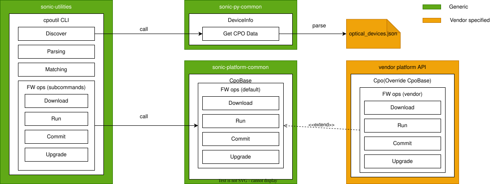
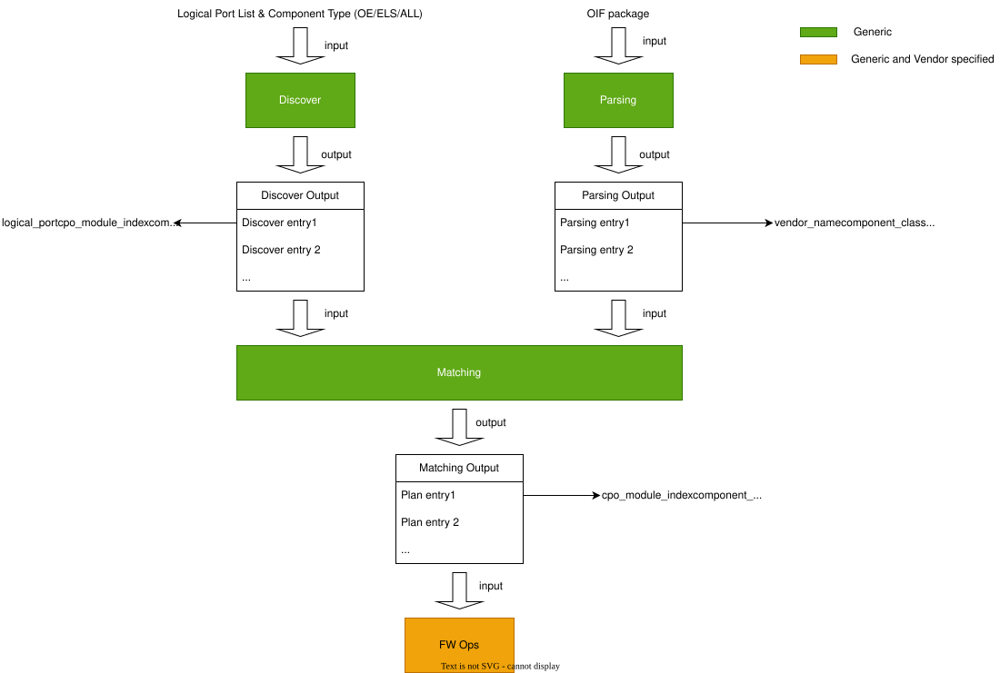
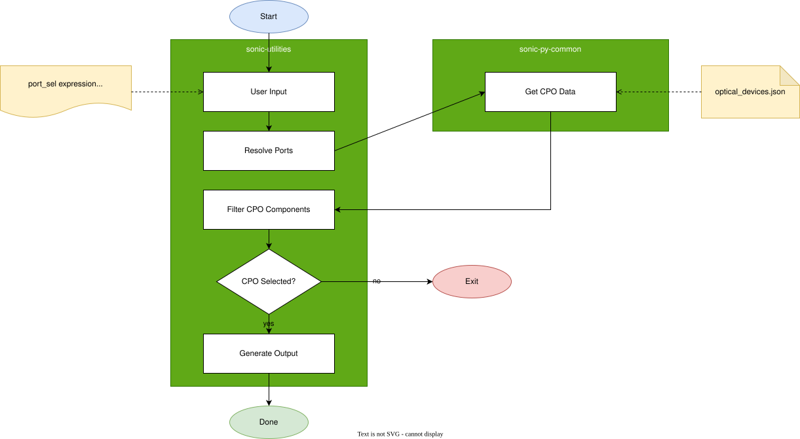
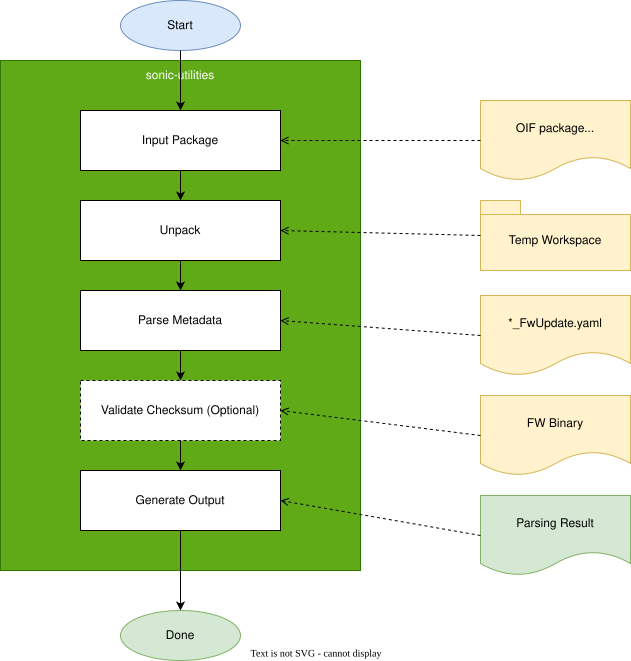
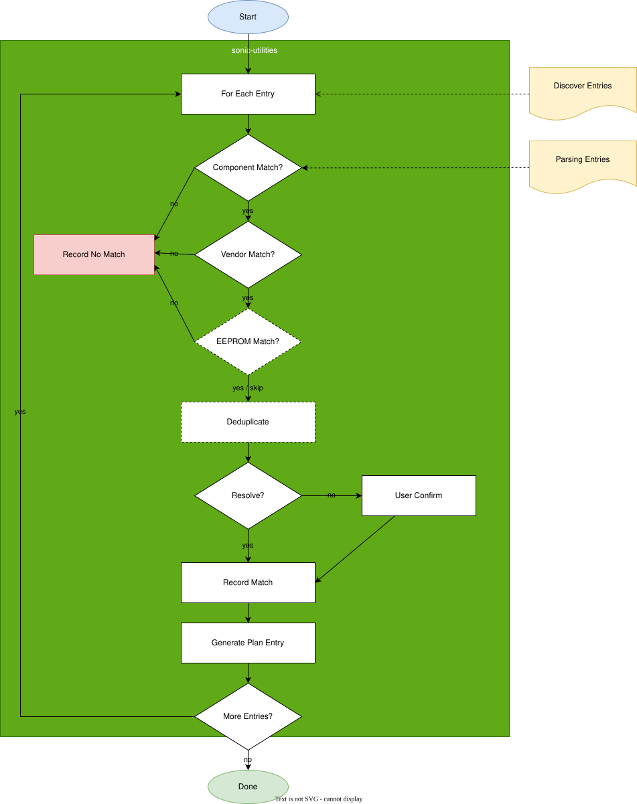
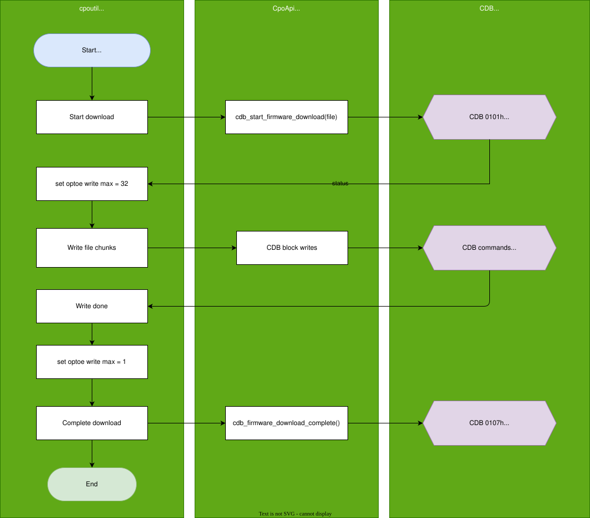
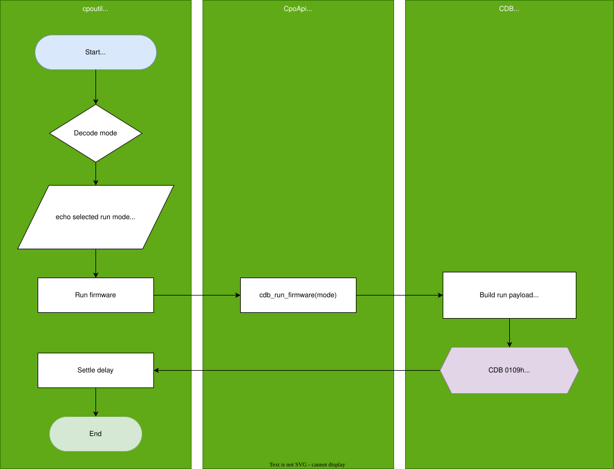
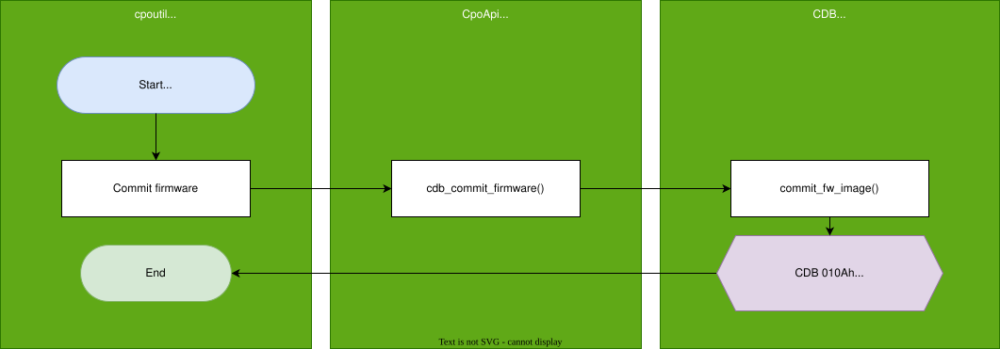
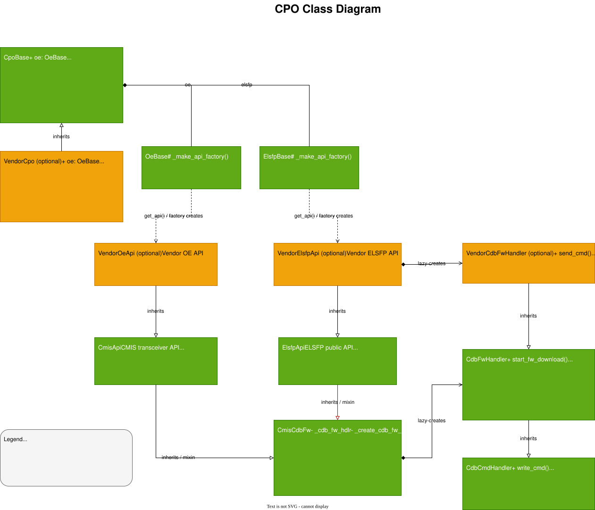

# cpoutil — CPO Component Firmware Management HLD

## Table of Content

- [Revision](#1-revision)
- [Scope](#2-scope)
- [Definitions/Abbreviations](#3-definitionsabbreviations)
- [Overview](#4-overview)
- [Requirements](#5-requirements)
- [Architecture Design](#6-architecture-design)
- [High-Level Design](#7-high-level-design)
  - [7.1 Background](#71-background)
  - [7.2 Motivation](#72-motivation)
  - [7.3 Repositories and modules](#73-repositories-and-modules)
  - [7.4 Flows](#74-flows)
  - [7.5 sonic-utilities](#75-sonic-utilities)
  - [7.6 sonic-platform-common](#76-sonic-platform-common)
  - [7.7 Error handling](#77-error-handling)
  - [7.8 Event logging / Serviceability](#78-event-logging--serviceability)
  - [7.9 Security considerations](#79-security-considerations)
  - [7.10 Platform dependency](#710-platform-dependency)
- [SAI API](#8-sai-api)
- [Configuration and management](#9-configuration-and-management)
- [Warmboot and Fastboot Design Impact](#10-warmboot-and-fastboot-design-impact)
- [Memory Consumption](#11-memory-consumption)
- [Restrictions/Limitations](#12-restrictionslimitations)
- [Testing Requirements/Design](#13-testing-requirementsdesign)
- [Open/Action items](#14-openaction-items)

### 1. Revision

| Rev | Date       | Author | Change Description                                      |
| --- | ---------- | ------ | ------------------------------------------------------- |
| 1.0 | 2026-08-03 | Junchao Chen | Base version — Phase 1 (firmware command group)         |

### 2. Scope

This document describes the high-level design of **cpoutil**, a new top-level SONiC CLI utility for firmware management of Co-Packaged Optics (CPO) modules and their sub-components — the Optical Engine (OE) and the External Laser Source (ELS).

This document version specifies the **`firmware` command group only**. Additional top-level command groups (`show`, `debug`, `reset`, `version`, …) are Phase 2 placeholders; their ownership, scope, and delivery are not decided yet and are **out of scope** for this document version.

Compared with the `sfputil firmware` command group, the scope of subcommands is defined as follows:

| Operation | Description | In scope |
| --- | --- | --- |
| download | Download firmware to the device bank. | Yes |
| run | Temporarily switch to the new firmware. | Yes |
| commit | Set the new firmware as the default. | Yes |
| upgrade | Perform download, run, and commit. | Yes |
| unlock | Enter module password. | No |
| target | Select target firmware for `Y-cable`. | No (not relevant) |

Key points:

- New top-level utility `cpoutil`, installed with `sonic-utilities`, following the Platform API dispatch pattern of `sfputil`, `fwutil`, and `psuutil`.
- Firmware lifecycle (`upgrade`, `download`, `run`, `commit`) for OE and ELS on CPO-capable logical ports, driven by OIF Firmware Update Packages.
- Vendor-neutral CLI + pipeline in `sonic-utilities` / `sonic-platform-common`; all hardware topology and non-standard orchestration confined to the vendor platform API.
- No SAI, SDK, orchagent, or Config DB changes are required.

### 3. Definitions/Abbreviations

| Term | Definition |
| --- | --- |
| CPO | Co-Packaged Optics — composite optical assembly integrated with the switch ASIC |
| OE | Optical Engine — the integrated optical engine component |
| ELS | External Laser Source — the pluggable external laser component |
| CMIS | Common Management Interface Specification for modules |
| CDB | Command Data Block — CMIS mechanism used for firmware transfer/activation |
| OIF | Optical Internetworking Forum |
| OIF IA | OIF Implementation Agreement OIF2026.122.02 — CMIS Firmware Update Package and Metadata File [1] |
| Firmware Update Package | An OIF `.tgz` bundle of firmware loads + metadata files |
| Firmware Load | An opaque, vendor-specific firmware binary within a package |
| Firmware Metadata file | `*_FwUpdate.yaml` describing a firmware load (match attributes + Firmware Load file) |
| ComponentClass | CPO vendor extension attribute: `OpticalEngine` \| `ExternalLaserSource` |
| Platform API | `sonic_platform_base` abstract bases + vendor API subclasses |
| `<port_sel>` | Logical port selector grammar (single port, range, list, `all`) |

### 4. Overview

`cpoutil` is a new SONiC top-level utility that manages firmware for OE and ELS. OE and ELS may come from different vendors, carry independent firmware banks, and must be matched independently against an OIF Firmware Update Package. `cpoutil` provides an `sfputil`-shaped CLI scoped by **logical port** (`Ethernet100`, ranges, lists, or `all`).

An operator needs to update the firmware of CPO optical components on a CPO-capable SONiC switch, using a multi-vendor OIF Firmware Update Package, without manual per-vendor knowledge of image selection or hardware topology. Representative flows:

- Full end-to-end upgrade of OE and ELS on a single port:
  `cpoutil firmware upgrade Ethernet100 release.tgz`
- Switch-wide upgrade of all CPO-capable ports:
  `cpoutil firmware upgrade all release.tgz`
- Multi-ports upgrade for ELS only:
  `cpoutil firmware upgrade Ethernet0,Ethernet16-100 release.tgz --component els`
- Staged (multi-step) lifecycle for maintenance windows of OE:
  - `cpoutil firmware download Ethernet0 release.tgz --component oe`
  - `cpoutil firmware run Ethernet0 --component oe`
  - `cpoutil firmware commit Ethernet0 --component oe`

### 5. Requirements

#### 5.1 Functional Requirements

| ID | Requirement |
| --- | --- |
| REQ-1 | Provide a new top-level utility `cpoutil`, installed with `sonic-utilities`, following the Platform API dispatch pattern of `sfputil`, `fwutil`, and `psuutil`. |
| REQ-2 | Phase 1 delivers the `firmware` command group — `upgrade`, `download`, `run`, `commit` — for OE and ELS FW lifecycle on CPO-capable logical ports. |
| REQ-3 | Operator scope uses logical port selectors (`Ethernet*`, ranges, comma-separated lists, `all`). |
| REQ-4 | Operators use `--component` to select the target component type: OE, ELS, or all. |
| REQ-5 | Stages (Discovery, Parsing, Matching) are vendor-neutral logic in `sonic-utilities`. No vendor-specific code in these stages. |
| REQ-6 | Stage (FW operations) delegates to the Platform API. A default CMIS CDB lifecycle (download -> run -> commit) is implemented in `sonic-platform-common` for OE and ELS targets that support the reference sequence. |
| REQ-7 | Vendor platform API MAY override Stage 4 when default behavior is insufficient. Overrides SHALL NOT replace OIF parsing, matching funnel rules, or CLI port/component scope. |
| REQ-8 | FW operations introduced by `cpoutil` SHALL NOT require changes to SAI, SDK, orchagent, or Config DB state. |
| REQ-9 | `cpoutil firmware upgrade` executes the full four-stage pipeline. `download`, `run`, `commit` execute the defined subsets. |
| REQ-10 | Package-driven subcommands accept OIF Firmware Update Packages [1] only. Parsing, matching, and optional checksum verification complete in `cpoutil` before FW execution is delegated to the Platform API. |
| REQ-11 | A single OIF package MAY contain multiple metadata + binary image pairs. `cpoutil` ingests all pairs at parse time and selects at most one load per runtime target at match time — by ComponentClass, VendorName, and optional CMIS match attributes — with no platform-specific pre-filter. Supports composite modules (multiple FW-bearing sub-components) and superset packages (unused entries: SKIPPED with warning on upgrade; fatal on download only when the scoped target has no match). |

#### 5.2 Configuration and Management Requirements

`cpoutil` is a maintenance/administrative CLI utility. It does not add persistent configuration.

- No Config DB change.
- No show command for phase 1.

#### 5.3 Scalability Requirements

- Supports single port, port range, comma-separated port list, mixed list, keyword `all` on `upgrade`.
- Supports single port only on `download`, `run`, `commit`.

#### 5.4 Performance Requirements

- Support serialize FW operation for now. Parallelize independent FW operation in multi-threading will support in future.

#### 5.5 Warm/Fast boot Requirements

No impact.

#### 5.6 Multi ASIC Requirements

`cpoutil` handles multi-ASIC platforms in the same way as `sfputil`. The top-level command group loads the logical port to physical index mapping by using the existing `load_port_config` utility, which already supports multi-ASIC platforms. All subsequent logic should operate on this port mapping, so no additional multi-ASIC handling is required.

### 6. Architecture Design

Design direction: maximize generic, vendor-neutral implementation in `sonic-utilities` and `sonic-platform-common`. Hardware topology, bus access, and non-standard FW orchestration live in the vendor platform API, reachable only through optional override tiers where the default CMIS CDB path or chassis orchestration is insufficient. `cpoutil` itself remains free of switch-vendor and ASIC-type conditionals.



**Layer model:**

```
Layer 0   Operator
            |
Layer 1   cpoutil CLI              command parse, scope validation, reporting
            |
Layer 2   cpoutil pipeline         Discovery | Parsing | Matching
            |
Layer 3   Platform API             Cpo abstractions
            |
Layer 4   Vendor platform API      topology, HW paths, orchestration overrides
            |
Layer 5   CPO module hardware      CMIS-managed OE / ELS
```

### 7. High-Level Design

#### 7.1 Background

CPO modules are composite: one OE and one ELS per virtual module today (future platforms may expose more than one ELS per OE). OE and ELS share a single CMIS management entity but are distinct FW-bearing components with independent images, banks, vendors, and package entries. Existing SONiC utilities (`sfputil`) do not model this decomposition, so a purpose-built, port-scoped CPO firmware utility is required.

#### 7.2 Motivation

- Switch modules may come from different vendors and hardware versions, requiring different firmware images for upgrades. The current `sfputil` does not support one-click upgrades for mixed modules, making the upgrade process cumbersome and error-prone. OIF's Multi-Vendor FW Upgrade framework [1] addresses this limitation by providing a self-describing firmware package that enables the host to match module EEPROM attributes and select the appropriate firmware load automatically.
- CPO composite modules require **per-component** (OE vs ELS) routing and matching that `sfputil` does not provide.
- A single, vendor-neutral CLI with a well-defined Platform API boundary keeps switch-vendor and ASIC specifics out of `sonic-utilities` while still supporting non-standard hardware topologies through optional override tiers.

#### 7.3 Repositories and modules

| Repository | Change |
| --- | --- |
| `sonic-utilities` | New top-level `cpoutil` CLI and vendor-neutral pipeline (Discovery, Parsing, Matching) |
| `sonic-platform-common` | Default CMIS CDB firmware lifecycle on `CpoBase`; CMIS/ELS match-attr helpers |
| Vendor platform API | Optional overrides for Stage (FW operations) when default behavior is insufficient |

No changes to SWSS, syncd, SAI, SDK, orchagent, or Redis DB schemas.

#### 7.4 Flows

**Overall flow:**



- **Stages (Discovery, Parsing, Matching)** are vendor-neutral logic in `sonic-utilities`.
- **Stage (FW operations)** executes through the Platform API — a default CMIS CDB firmware path in `sonic-platform-common`; vendor overrides in the platform API are optional and used only where the standard flow is insufficient.

**Subcommand flow:**

| Subcommand | Discover -> | Parsing -> | Matching -> | FW ops |
| --- | --- | --- | --- | --- |
| download | Yes | Yes | Yes | Download only |
| run | Yes | - | - | Run only |
| commit | Yes | - | - | Commit only |
| upgrade | Yes | Yes | Yes | Full cycle |

##### 7.4.1 Stage — Discovery

Resolve operator scope (`<port_sel>`, `--component`) into a list of FW-bearing components on the chassis.



Discover stage outputs a list of `discover_entries`:

```
discover_entry {
  logical_port
  cpo_module_index
  component_class          # OpticalEngine | ExternalLaserSource
  component_index
}
```

##### 7.4.2 Stage — Parsing

Ingest an OIF Firmware Update Package (`.tgz`) into parsing entries.



The parsing stage outputs a two-level dictionary of parsing entries, keyed first by `component_class` and then by `vendor_name`:

```
parsing_entry {
  vendor_name          # mandatory exact match
  component_class      # CPO extension: OpticalEngine | ExternalLaserSource
  match_attrs          # module EEPROM field to expected value pairs
  file_path            # basename; links metadata to binary
}
```

###### OIF FW Update Package

The FW Update Package contains 2 kinds of files:

- Firmware Load: Firmware files installed on the module, either OE or ELS.
- Firmware Metadata File: A file that describes one or more Firmware Loads and is used by the host for firmware selection and validation.

FW Update Package examples:

```
# OE-only release (one metadata + one binary):
cpo_oe_only.1.0.0_FwUpdate.tgz
  ├── vendor_a_oe_FwUpdate.yaml
  └── vendor_a_oe.bin

# One OE + one ELS for a composite CPO module (OE and ELS from different vendors):
cpo_module_ab.2.1.0_FwUpdate.tgz
  ├── vendor_a_oe_FwUpdate.yaml     # ComponentClass: OpticalEngine
  ├── vendor_a_oe.bin
  ├── acme_els_FwUpdate.yaml        # ComponentClass: ExternalLaserSource
  └── acme_els.bin

# One OE image plus ELS loads for three different laser vendors
# (switch-wide / multi-port upgrade; Matching picks the entry per target at runtime):
cpo_switch_bundle.3.0.0_FwUpdate.tgz
  ├── vendor_a_oe_FwUpdate.yaml
  ├── vendor_a_oe.bin
  ├── vendor_a_els_FwUpdate.yaml    # ELS vendor: VendorA
  ├── vendor_a_els.bin
  ├── acme_els_FwUpdate.yaml        # ELS vendor: AcmePhotonics
  ├── acme_els.bin
  ├── lumentum_els_FwUpdate.yaml    # ELS vendor: Lumentum
  └── lumentum_els.bin

# One Firmware Metadata file for multiple Firmware Loads
cpo_switch_bundle.4.0.0_FwUpdate.tgz
  ├── all_in_one_FwUpdate.yaml
  ├── vendor_a_oe.bin
  └── vendor_a_els.bin
```

A Firmware Metadata File may describe one or more Firmware Loads using either:

- a single YAML mapping describes Firmware Load, or
- a YAML list of mappings, where each list element describes one Firmware Load

Each YAML mapping that describes a Firmware Load includes the following fields:

- VendorName: mandatory, exact match
- *ComponentClass: mandatory, either ExternalLaserSource or OpticalEngine. **This field is a `cpoutil` extension to the OIF package which allows `cpoutil` to select the correct CPO component as the upgrade target**.
- FwLoadName: mandatory, unique, identifies the filename of the Firmware Load
- FwLoadVersion: optional, version string, identifies the version of the Firmware Load, e.g. "1.2.3". An informational attribute SHALL NOT be used as a firmware matching attribute and SHALL NOT be interpreted as part of CMIS-reported active or inactive firmware version information. When multiple Firmware Metadata entries match, a host may use FwLoadVersion as a tie-break policy (e.g., selecting the highest FwLoadVersion) or may prompt the operator to select among candidates.
- FwUpdateLoadChecksumSHA256: optional, checksum of the Firmware Load. `cpoutil` should verify the checksum when this field is present.
- FwUpdateLoadChecksumSHA512: optional, checksum of the Firmware Load. `cpoutil` should verify the checksum when this field is present.
- Firmware match attributes: optional except VendorName. They shall be retrievable by the host from the module via CMIS and made available for comparison. Simple regular expression wildcards are supported for matching FW match attributes, except VendorName, which SHALL be an exact match:
  - A question mark `?` matches any single character
  - An asterisk `*` matches any sequence of characters (including the empty sequence).

Firmware match attributes include:

| Page | Byte range | Field Name | Mandatory | Exact Match |
|---|---|---|---|---|
| 00h | 129-144 | VendorName | Mandatory | Yes |
| 00h | 0 | SFF8024Identifier | Optional | No |
| 00h | 145-147 | VendorOUI | Optional | No |
| 00h | 148-163 | VendorPN | Optional | No |
| 00h | 164-165 | VendorRev | Optional | No |
| 00h | 166-181 | VendorSN | Optional | No |
| 00h | 182-189 | DateCode | Optional | No |
| 00h | 190-199 | CLEICode | Optional | No |
| 01h | 128 | ModuleHardwareMajorRevision | Optional | No |
| 01h | 129 | ModuleHardwareMinorRevision | Optional | No |
| 01h | CDB | ModuleActiveFirmwareVersion | Optional | No |
| 01h | CDB | ModuleInActiveFirmwareVersion | Optional | No |
| 01h | CDB | ActiveExtraString | Optional | No |
| 01h | CDB | InActiveExtraString | Optional | No |

Firmware Metadata Files example 1 — single YAML mapping:

```yaml
VendorName: "VendorA"
ComponentClass: "OpticalEngine"
ModuleType: "OE-800G-2x400G"

# Vendor Information (CMIS Vendor Info fields)
VendorOUI: "00-1A-2B"
VendorPN: "VENDOR-A-QDD-400G-DR4"
VendorRev: "A1"
VendorSN: "VENDORA12345678"
DateCode: "2407"
CLEICode: "VENDOR-A-CLEI-400G"

# Hardware Version Information
ModuleHardwareMajorRevision: "1"
ModuleHardwareMinorRevision: "0"

# Firmware Version Information (as reported by CMIS)
ModuleActiveFirmwareVersion: "01.01.00020"
ModuleInActiveFirmwareVersion: "01.00.00010"

# 32-byte Extra Strings (vendor-defined, optional match attributes)
ActiveExtraString: "ELS1.0 OE1.0 PROD"
InActiveExtraString: "ELS0.9 OE0.9 FACTORY"

# Required: firmware load name within the FW Update Package (.tgz)
FwLoadName: "fw/els_oe_bundle_01.02.00042.bin"

# Optional: informational version string (not used for matching)
FwLoadVersion: "01.02.00042"

# Optional integrity checksums of the firmware load file
FwUpdateLoadChecksumSHA256: "b0f1a3a8c0b4f9033c0495dd67a62a4c5b25c037a1b5c0f1e9d2a7b418798d2"
```

Firmware Metadata Files example 2 — a list of YAML mappings:

```yaml
# contoso.02.00.00123FwUpdate.yaml
# Firmware Metadata File describing multiple firmware loads

- VendorName: "Contoso"
  ModuleType: "OE 800G"

  VendorPN: "CONTOSO-QDD-800G-LR8"

  ModuleHardwareMajorRevision: "2"
  ModuleHardwareMinorRevision: "1"

  # Match only modules with active FW below a threshold (using wildcard)
  ModuleActiveFirmwareVersion: "02.00.*"
  ModuleInActiveFirmwareVersion: "01.*"

  FwLoadName: "firmware/oe.bin"
  FwLoadVersion: "02.00.00123"
  FwUpdateLoadChecksumSHA256: "c4b210de9f21e5c3faa111a019848e24d94b3e3ea899b2375f70a1f7f12afc99"

- VendorName: "Contoso"
  ModuleType: "ELS 800G"

  VendorPN: "CONTOSO-*"

  ModuleHardwareMajorRevision: "2"
  ModuleHardwareMinorRevision: "2"

  FwLoadName: "firmware/els.bin"
  FwLoadVersion: "02.01.00005"
```

##### 7.4.3 Stage — Matching

For each `discover_entry`, select zero or one `parsing_entry` and generate a `plan_entry`.



Tie-break policy (Phase 1):

1. highest `FwLoadVersion` wins;
2. otherwise, prompt the operator to select from the candidate list, skip the target, or exit.

Matching stage outputs a list of `plan_entries`:

```
plan_entry {
  cpo_module_index     # index of CPO object
  component_class      # OpticalEngine | ExternalLaserSource
  component_index      # index of OE or ELS, skipped for now as there is only one OE and one ELS
  matching_decision    # no match - None (for logging a mismatch entry); match - FW Load file path
}
```

##### 7.4.4 Stage 4 — FW operations

Execute each upgrade plan through the CMIS firmware lifecycle.

Download flow:



Run flow:



Commit flow:



Upgrade flow is a combination of: download -> run -> commit.

#### 7.5 sonic-utilities

##### 7.5.1 Command Structure

Top-level invocation:

```
cpoutil <command_group> [arguments...] [options...]

Phase 1 (specified):
  firmware   upgrade | download | run | commit

Phase 2 (placeholders — out of scope this version):
  show | debug | reset | version | ...
```

`firmware` command surface:

```
cpoutil firmware upgrade  <port_sel>|all  <package.tgz>  [--component oe|els|all]
cpoutil firmware download <port_sel>    <package.tgz>  --component oe|els
cpoutil firmware run      <port_sel>                   --component oe|els
cpoutil firmware commit   <port_sel>                   --component oe|els
```

`<port_sel>` grammar (per [2], §7.5.1.1):

```
<port_sel>  ::=  <token> | <token> "," <port_sel>
<token>     ::=  <ifname> | <range>
<ifname>    ::=  Ethernet<N>                    ; N = non-negative integer
<range>     ::=  Ethernet<N> "-" Ethernet<M>    ; N <= M, inclusive; malformed -> fatal
```

Port scope rules:

- Canonical `Ethernet*` names only (from `port_config.ini`, same rules as `sfputil`); aliases (e.g. `etp1a`) are not accepted.
- Every explicitly named port must resolve to a CPO-capable port; otherwise fatal.
- Ports within a range that are not configured are silently dropped (not an error).
- CPO eligibility (two-step): (1) name exists in the platform port table; (2) name is in the chassis CPO-capable allow-list and yields ≥1 bound component. For ranges/lists/`all`, one ineligible port rejects the whole command.
- Switch-wide upgrade (no `<port_sel>`) iterates only the chassis CPO-capable port list.

`--component` grammar:

```
upgrade:               oe | els | all   (default: all)
download/run/commit:   oe | els         (required; must resolve to exactly one target)
```

Subcommand matrix:

| Subcommand | `<port_sel>` | `--component` | `<package>` |
| --- | --- | --- | --- |
| `upgrade` | Required: single, range, list, all; | Optional; default `all` | Required |
| `download` | Single port only | Required (`oe`\|`els`) | Required |
| `run` | Single port only | Required (`oe`\|`els`) | — |
| `commit` | Single port only | Required (`oe`\|`els`) | — |

##### 7.5.2 Usage Examples

```
# Single port; upgrade OE and ELS (default --component all)
cpoutil firmware upgrade Ethernet100 release.tgz

# Port range; all components on each port
cpoutil firmware upgrade Ethernet0-124 release.tgz

# Mixed list and range; OE only
cpoutil firmware upgrade Ethernet0,Ethernet16-80 release.tgz --component oe

# Single port; ELS only
cpoutil firmware upgrade Ethernet0 release.tgz --component els

# All CPO-capable logical ports
cpoutil firmware upgrade all release.tgz

# Stage OE firmware to inactive bank (no run/commit)
cpoutil firmware download Ethernet0 release.tgz --component oe

# Activate staged ELS firmware
cpoutil firmware run Ethernet0 --component els

# Commit staged OE firmware
cpoutil firmware commit Ethernet0 --component oe
```

Corresponding CLI documentation should be added to https://github.com/sonic-net/sonic-utilities/blob/master/doc/Command-Reference.md when the feature is implemented.

> Note: Only one CLI instance may run at a time. This constraint should be enforced with a file lock.

#### 7.6 sonic-platform-common



##### 7.6.1 CPOBase

Add a few new APIs and default implementations to `CpoBase`.

```python
from dataclasses import dataclass

@dataclass(slots=True)
class CpoFwOpsEntry:
    cpo_module_index: int
    component_class: str  # OpticalEngine | ExternalLaserSource
    component_index: int
    file_path: str = None


class CpoBase:
    def download_firmware(fw_op_entry: CpoFwOpsEntry) -> bool:
        """
        Download firmware to a CPO component

        Args:
            fw_op_entry: A CPO firmware operation entry

        Returns:
            True if the operation succeed, otherwise False
        """
        pass

    def run_firmware(fw_op_entry: CpoFwOpsEntry) -> bool:
        """
        Run firmware for a CPO component

        Args:
            fw_op_entry: A CPO firmware operation entry

        Returns:
            True if the operation succeed, otherwise False
        """
        pass

    def commit_firmware(fw_op_entry: CpoFwOpsEntry) -> bool:
        """
        Commit firmware for a CPO component

        Args:
            fw_op_entry: A CPO firmware operation entry

        Returns:
            True if the operation succeed, otherwise False
        """
        pass

    def upgrade_firmware(fw_op_entries: list[CpoFwOpsEntry]) -> bool:
        """
        Run firmware upgrade process for each CPO firmware operation entry.

        Args:
            fw_op_entries: A list of CPO firmware operation entries

        Returns:
            True if the operation succeed, otherwise False
        """
        pass
```

The default implementations of `download_firmware`, `run_firmware`, and `commit_firmware` should follow the standard CMIS CDB flow and reuse the existing CDB implementation. Vendors may override these defaults when platform-specific behavior is required.

`upgrade_firmware` combines `download_firmware`, `run_firmware`, and `commit_firmware`.

##### 7.6.2 CMIS API

Add a new function `get_fw_ops_match_attrs` to get all the FW operation matching attributes on demand.

```python
def get_fw_ops_match_attrs(self, fields: list[str]) -> dict[str, object]:
    """
    Get runtime match attributes for FW operations on demand.

    Args:
        fields: A list of CMIS EEPROM fields name to be collected

    Returns:
        Runtime match attributes dictionary
    """
    pass
```

##### 7.6.3 ELS API

- Add a new function `get_fw_ops_match_attrs` to get all the FW operation matching attributes on demand.
- `ElsfpApi` should be updated to mix in `CmisCdbFw` so that it can support CDB-based firmware operations. (Or, should each vendor provide a `VendorCdbFw`?)

> Note: currently, ElsfpApi is not inherit from CmisApi, each vendor has to implement `get_fw_ops_match_attrs` by their own.


#### 7.7 Error handling

Firmware execution is delegated only after `cpoutil` completes parsing, matching, and optional checksum verification. Failures are isolated per component; a failed ELS does not roll back a successful OE. The CLI reports status per internal component identity. Fatal conditions yield a non-zero exit; per-target warnings do not mask fatal errors.

**Frontend (CLI):**

| Error | When detected | Behavior |
| --- | --- | --- |
| Range/list/all on download/run/commit | CLI parse | Fatal ("single port required") |
| Invalid / unknown logical port | Port scope validation | Fatal (invalid logical port name) |
| Logical port not CPO-capable | Port scope validation | Fatal (invalid logical port name) |
| `<package>` omitted on download or upgrade | CLI parse | Fatal |
| `--component` omitted on download/run/commit | CLI parse | Fatal |
| `--component` matches 0 targets | Port scope validation | Fatal |
| `--component` matches >1 on download/run/commit | Port scope validation | Fatal ("ambiguous") |
| No matching package entry (upgrade) | Package matching | SKIPPED (warning) |
| No matching package entry (download) | Package matching | Fatal |
| Multiple matching entries, tie-break unresolved | Package matching | Fatal per target |
| Malformed package (missing metadata, dangling `FwLoadName`, corrupt archive)| Package matching | Fatal per target |
| SHA-256/512 mismatch | Package matching | Fatal per target |

**Backend (Platform API / vendor wheel):**

| Error | When detected | Behavior |
| --- | --- | --- |
| CDB command failed | Module access | Fatal |
| CDB command timeout | Module access | Fatal |
| Module EEPROM read/write failed | Module access | Fatal |

#### 7.8 Event logging / Serviceability

Firmware operations report progress and outcomes per logical port and component. No new counters.

**Frontend event logging**

| Event | Severity |
| --- | --- |
| FW operation started (per port/component) | NOTICE |
| Target SKIPPED (no matching package entry, upgrade) | WARNING |
| Fatal validation/matching/integrity error | ERROR |

**Backend event logging**

| Event | Severity |
| --- | --- |
| CMIS CDB step (download/run/commit) result | NOTICE |
| Per-component FW operation failure | ERROR |

#### 7.9 Security considerations

- `cpoutil` adds a host CLI invoked locally by an operator with existing host privileges. There is no new network-facing API.
- Firmware image trust is enforced by optional OIF checksum verification (SHA-256/512) before CMIS transfer, and by the module's own integrity/applicability/secure-boot checks after download.
- No new sensitive information is stored on the device. Firmware binaries are opaque vendor images supplied by the operator.
- No new third-party runtime dependency. The CLI uses Python stdlib (`argparse`, `tarfile`, `hashlib`) plus the YAML parsing already available in `sonic-utilities`.

#### 7.10 Platform dependency

This feature is not specific to a single platform. Platforms that expose CPO-capable ports must implement the Platform API surface described in §7.6 (or rely on the default CMIS CDB path in `sonic-platform-common`). Vendor wheels MAY override Stage 4 FW operations when default behaviour is insufficient; overrides SHALL NOT replace OIF parsing, matching funnel rules, or CLI port/component scope.

### 8. SAI API

No change.

### 9. Configuration and management

#### 9.1. Manifest (if the feature is an Application Extension)

N/A

#### 9.2. CLI/YANG model Enhancements

CLI design is specified in [§7.5 sonic-utilities](#75-sonic-utilities). No YANG model changes.

#### 9.3. Config DB Enhancements

N/A

### 10. Warmboot and Fastboot Design Impact

No impact.

### 11. Memory Consumption

No persistent daemon and no growing memory consumption. `cpoutil` is a short-lived CLI process; transient memory is limited to the unpacked OIF package workspace (temp filesystem) and in-memory target/plan lists during a single invocation. No memory is consumed when the utility is not running.

### 12. Restrictions/Limitations

| # | Limitation | Notes |
| --- | --- | --- |
| LIM-1 | CPO-capable ports only | `<port_sel>` must resolve to ports mapped by the chassis to a CPO module; non-CPO `Ethernet*` names are rejected. |
| LIM-2 | Phase 1 scope | Only the `firmware` command group is delivered. `show`/`debug`/`reset`/`version` are Phase 2 placeholders, not specified here. |
| LIM-3 | OIF packages only | Package-driven subcommands accept OIF `.tgz` packages only; no legacy-host / raw-binary fallback (OIF Scenario 1 advanced-host path only). |

### 13. Testing Requirements/Design

Phase 1 tests assert observable behavior across CLI/port-scope semantics, OIF parsing/matching, Discovery/target resolution, the CMIS firmware lifecycle (Stage 4), end-to-end hardware upgrade, and multi-port grouping/deduplication.

#### 13.1. Unit Test cases

Vendor-neutral unit tests (filesystem input + in-memory / mock chassis targets):

- Verify CLI arguments and options are properly expanded / parsed.
- Verify invalid CLI arguments and options are rejected with informative error output.
- Verify `<port-sel>` is properly parsed and expanded to expected port list.
- Verify malformed `<port-sel>` is rejected with informative error output.
- Verify non-CPO port shall be rejected.
- Verify OIF package file existence.
- Verify OIF package parsing should output expected data.
- Verify malformed OIF package is rejected with informative error output.
- Verify FW Load checksum validation is properly performed.
- Verify match missing is properly handled.
- Verify tie-break behavior is expected: highest `FwLoadVersion`, else user confirm.
- Verify runtime match attrs with regular expressions works as expected.

#### 13.2. System Test cases

End-to-end on a CPO-capable switch image (lab / HIL):

- Full single-port OE+ELS upgrade completes all four pipeline stages.
- Stepwise `download → run → commit` per component reflects correct bank state on module.
- `--component oe`/`els` updates only that domain.
- `sfputil show eeprom` (or equivalent read) succeeds during/after upgrade.
- Group scope (range/list/all) completes for all CPO ports in scope.
- Per-target reporting for each port/component including SKIPPED.

Warmboot/fastboot: not applicable — feature is not on the boot path; existing warmboot/fastboot disruption budgets are unaffected.

### 14. Open/Action items

- Phase 2 command groups (`show`, `debug`, `reset`, `version`, …): ownership, scope, and delivery TBD.
- Parallelize independent FW operations via multi-threading (future performance enhancement).

---
