# CPO support in SONiC

## Table of Content

- [CPO support in SONiC](#cpo-support-in-sonic)
  - [Table of Content](#table-of-content)
  - [1. Revision](#1-revision)
  - [2. Scope](#2-scope)
  - [3. Definitions/Abbreviations](#3-definitionsabbreviations)
  - [4. Overview](#4-overview)
  - [5. Requirements](#5-requirements)
  - [6. High-Level Design](#6-high-level-design)
    - [6.1. Problem Statement](#61-problem-statement)
    - [6.2. New Approach](#62-new-approach)
      - [6.2.1. platform.json](#621-platformjson)
      - [6.2.2. cpo.json](#622-cpojson)
      - [6.2.3. SfpOptoeBase](#623-sfpoptoebase)
      - [6.2.4. ChassisBase](#624-chassisbase)
      - [6.2.5. CmisMemMap](#625-cmismemmap)
      - [6.2.6. CmisApi](#626-cmisapi)
      - [6.2.7. XcvrApiFactory](#627-xcvrapifactory)
      - [6.2.8. CmisManagerTask](#628-cmismanagertask)
      - [6.2.9. SfpStateUpdateTask](#629-sfpstateupdatetask)
      - [6.2.10. DomInfoUpdateTask](#6210-dominfoupdatetask)
      - [6.2.11. Show interfaces transceiver CLI](#6211-show-interfaces-transceiver-cli)
      - [6.2.12. optoe driver](#6212-optoe-driver)
    - [6.3. Implementation Flow](#63-implementation-flow)
      - [6.3.1. Chassis Init Flow](#631-chassis-init-flow)
      - [6.3.2. Module Presence Flow](#632-module-presence-flow)
      - [6.3.3.  API Call Flow](#633--api-call-flow)
      - [6.3.4.  CmisManagerTask State Machine](#634--cmismanagertask-state-machine)
    - [6.4. Unit Test cases](#64-unit-test-cases)
    - [6.5. Open/Action items - if any](#65-openaction-items---if-any)

## 1. Revision

| Rev |     Date     | Author | Change Description                                                                                                                                                                                                                                                                                                                                                                                                                                                                                                                   |
| :-: | :----------: | :----: | ------------------------------------------------------------------------------------------------------------------------------------------------------------------------------------------------------------------------------------------------------------------------------------------------------------------------------------------------------------------------------------------------------------------------------------------------------------------------------------------------------------------------------------ |
| 1.0 | Dec 09 2025 | Kroos | Initial version                                                                                                                                                                                                                                                                                                                                                                                                                                                                                                                      |
| 1.1 | Jan 20 2026 | Kroos | 1.Modify the HLD name<br />2.Optimize content descriptions: clarify the meaning of Separate Mode and update the schematic diagram<br />3.Add multi-thread processing for CmisManagerTask, and implement new features for CPO including Fiber Dirty Check and OE Sufficient Input Power<br />4.Add reporting of ELS-related information in DomInfoUpdateTask<br />5.Add reporting of ELS-related information in SfpStateUpdateTask<br />6.Optimize configuration files by adding a standalone cpo.json configuration file separately. |
| 1.2 | Feb 04 2026 | Kroos | 1.Revert CpoCmisManagerTask to single‑threaded mode, and add fiber check and power sufficient functions.<br />2.Complete the information that DOM and SfpStateUpdateTask need to collect.<br />3.Add CLI display descriptions.<br />4.Other detailed revisions based on review comments                                                                                                                                                                                                                                             |
| 1.3 | Feb 28 2026 | Kroos | 1.Optimize the format, description and clarify the scope of application of this design.<br />2.CMIS supports I2C and SPI protocols; revise the CMIS access path.                                                                                                                                                                                                                                                                                                                                                                   |

## 2. Scope

This document covers:

1. Support for Separate Mode Co-packaged Optics in SONiC (initialization, basic port configuration queries, debugging, etc.).
2. Memory map mapping for ELS-related registers.
3. Multi-bank processing for CMIS.
4. Mapping handling between OE, ELS, and ports on CPO devices.
5. Port presence detection logic.
6. OE power check and fiber dirty check.
7. Monitoring, management, and information query for OE and ELS


This document does not cover:

1. CPO Joint Mode
2. Multi-threaded processing for CmisManagerTask
3. Firmware upgrade for OE/ELS
4. Other CPO expansion features not mentioned in the preceding text

## 3. Definitions/Abbreviations

| Term  | Definition                                 |
| ----- | ------------------------------------------ |
| OE    | Optical Engine                             |
| CPO   | Co-packaged optics                         |
| CMIS  | Common Management Interface Specification  |
| ELSFP | External Laser Small Form Factor Pluggable |
| ELS   | External Laser Sources                     |
| optoe | Optical Transceiver Open EEPROM driver     |
| VDM   | Versatile Diagnostics Monitoring           |
| I2C   | Inter-Integrated Circuit                   |
| SPI   | Serial Peripheral Interface                |

## 4. Overview

This high-level design document describes the Separate Mode Co-packaged optics support in SONiC.

CPO primarily adds new OE and ELS devices. At the software level, control of the OE/ELS devices is mainly achieved by accessing their EEPROMs. The host has two main ways to access the EEPROMs of the OE/ELS devices

Joint Mode: The host does not directly access the EEPROMs of the OE/ELS devices. Instead, a CMIS controller merges the EEPROMs of the OE and ELS into a single unit, allowing the host board to access them indirectly.And the figure is for illustration only since the number of ELSs and OEs per CPO module may vary by vendor.

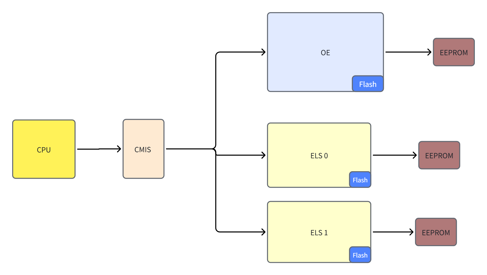

Separate Mode: The host can directly access the EEPROMs of the OE/ELS devices.

Separate Mode is not a hardware-specific concept; it is irrelevant to whether the hardware includes an MCU or whether OE/ELS control is MCU-based.

We introduce Separate Mode to require vendors to provide independent OE access interfaces based on the standard CMIS specification, and independent ELS access interfaces based on the standard CMIS ELSFP specification.

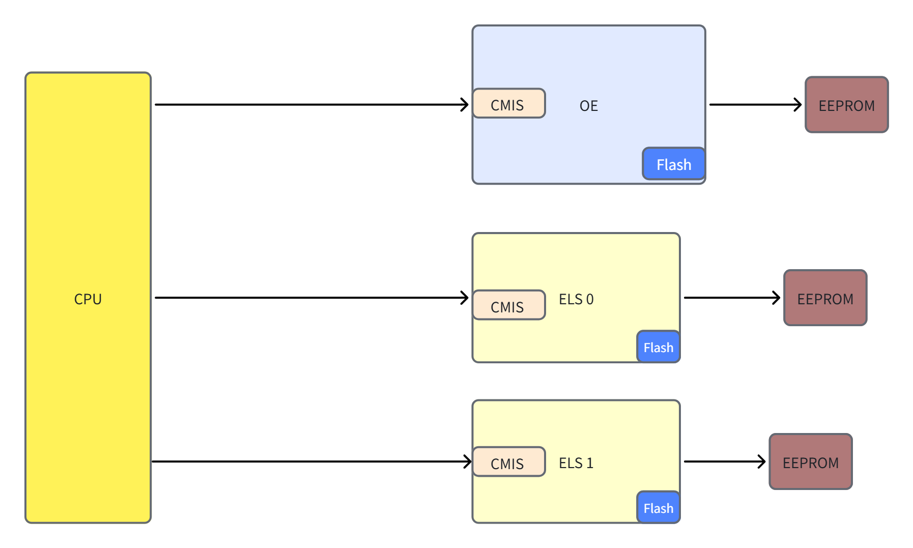

 This design only describes how Separate Mode CPO is adapted to SONiC; Joint Mode CPO is not within the scope of this design.

## 5. Requirements

The management of CPO switches based on the community xcvrd framework mainly involves the following aspects:

1. CPO devices are managed by mapping OE/ELS to the CMIS memory map. The OE part is CMIS general registers, and no special handling is required in the community code. However, the ELS memory map (proposed in accordance with the latest CMIS standard) is not yet implemented in the community code. Therefore, it is necessary to add ELS-related management interfaces.
2. CPO devices use multiple banks in the CMIS memory map. However, there is currently no multi-bank processing logic in the community code.
   Therefore, it is necessary to add a multi-bank management logic.
3. There is a many-to-one mapping relationship between CPO device ports and OEs or ELSs. Vendors need to maintain the mapping entries between ports and OE/ELS when adapting devices.
4. Community xcvrd management is triggered based on module plug-in/plug-out events; CPO devices do not trigger traditional plug-in/plug-out events, so the presence detection logic needs to be redesigned (e.g., based on ELS module insertion/removal events)


**Vendor Requirements:**

In addition to the requirements mentioned above that this design aims to fulfill, the following requirements apply to each hardware component vendor:

**OE Vendors** must provide management interfaces compliant with CMIS Specification and disclose their register mappings to ensure identification, status monitoring, and basic control.

**ELS Vendors** must strictly implement the OIF-ELSFP-CMIS-01.0 Specification, ensuring all specified registers, state machines, and functions (e.g., channel control, fiber check flags, save/restore) are available.

**Switch Vendors** must provide accessible paths for both ELS and OE so that CPU can access them independently.  as well as completing the configuration files or vendor-specific instantiation code mentioned in this design.

## 6. High-Level Design

### 6.1. Problem Statement

To meet the above requirements at the software level, the current SONiC components have the following limitations:

| **SONiC Repo & Class** | **Limitation**                                                                                                         |
| ---------------------------- | ---------------------------------------------------------------------------------------------------------------------------- |
| platform.json                | No cpo related config  schema                                                                                                |
| SfpOptoeBase                 | No CPO related attribute: bank id, oe id, ...<br />The mapping relation of oe, els and sfp is not simply one to one any more |
| ChassisBase                  | No cpo related config                                                                                                        |
| CmisMemmap                   | Do not support ELS memory map<br />Do not support bank                                                                       |
| Cmisapi                      | Do not support ELS related api                                                                                               |
| XcvrApiFactory               | Do not support  create api with more than one eeprom                                                                         |
| CmisManagerTask              | Do not support new functional items added for CPO.                                                                          |
| SfpStateUpdateTask           | No ELS-related information is reported (the OE information uses the original SONiC fields).                                  |
| DomInfoUpdateTask            | No ELS-related information is reported (the OE information uses the original SONiC fields).                                  |
| optoe                        | Do not support bank switching, only support page switching                                                                   |


### 6.2. New Approach

To address the issues encountered when adapting various SONiC components to CPO devices, this design has made corresponding revisions to each component.

Main revised components are as follows:

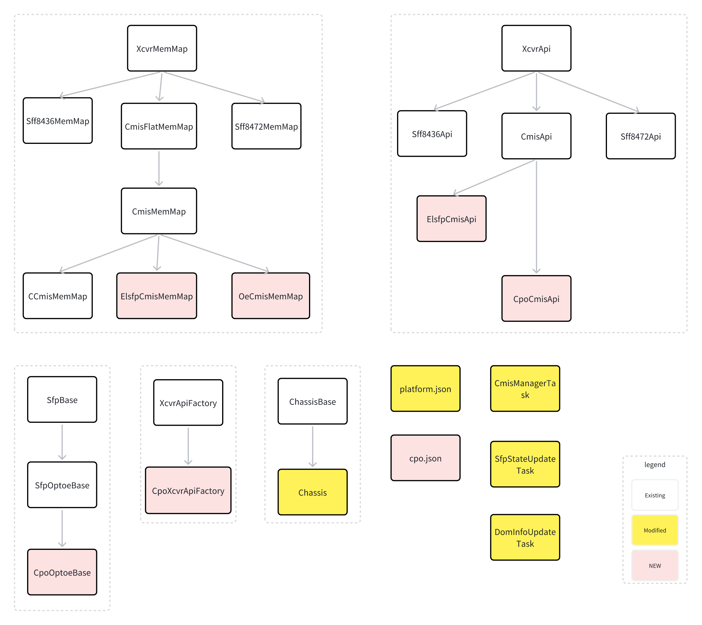

| Original Module    | Revised/New Module | Type     | Description                                                                                                                                                                                                                                                                       |
| :----------------- | ------------------ | -------- | --------------------------------------------------------------------------------------------------------------------------------------------------------------------------------------------------------------------------------------------------------------------------------- |
| platform.json      | platform.json      | Modified | The mapping relationships between ports and OE/ELS, as well as bank‑based configuration references.<br />Switch Vendors are required to config it.                                                                                                                               |
| Na                 | cpo.json           | New      | OE/ELS-related configuration information<br />Switch Vendors are required to config it.                                                                                                                                                                                           |
| SfpOptoeBase       | CpoOptoeBase       | New      | It is an abstract port management class, used for port management by the xcvrd framework.<br /> It mainly provides EEPROM access interfaces for OE and ELS.<br />Switch Vendors are required to instantiate it and use it with revisions to the platform.json configuration file. |
| ChassisBase        | Chassis            | Modified | It is an original vendor-implemented class, used during initialization to determine<br />whether a port uses the CpoOptoeBase type or the original OptoeBase type.<br />Switch Vendors are required to instantiate it.                                                            |
| CmisMemMap         | ElsfpCmisMemMap    | New      | Provides the EEPROM memory map address for ELS, based on the OIF-ELSFP-CMIS-01.0 standard,<br />and offers multi-bank functionality.                                                                                                                                              |
| CmisMemMap         | OeCmisMemMap       | New      | Extends the multi-bank functionality based on the original CmisMemMap.                                                                                                                                                                                                            |
| CmisApi            | CpoCmisApi         | New      | The universal API access interface for CPO includes ELS functions and OE function access interfaces.<br /> It provides unified external management, and the original optical module API call process remains unchanged.                                                           |
| CmisApi            | ElsfpCmisApi       | New      | Provide an access API for the ELS module;<br />The CpoCmisApi can also call this class to achieve simultaneous operation of OE/ELS.                                                                                                                                               |
| XcvrApiFactory     | CpoXcvrApiFactory  | New      | Considering that the EEPROM access for ELS and OE can be separated,<br />split the EEPROM instances of OE and ELS based on the original XcvrApiFactory.                                                                                                                           |
| optoe driver       | optoe driver       | Modified | Adds multi-bank memory map.                                                                                                                                                                                                                                                       |
| CmisManagerTask    | CmisManagerTask    | Modified | Revise CmisManagerTask for CPO-specific function management.                                                                                                                                                                                                                      |
| SfpStateUpdateTask | SfpStateUpdateTask | Modified | When SfpStateUpdateTask detects an ELS module insertion event, it needs to write the ELS-related information into the database of the corresponding port.                                                                                                                         |
| DomInfoUpdateTask  | DomInfoUpdateTask  | Modified | DomInfoUpdateTask needs to periodically report ELS-specific attributes to the corresponding database.                                                                                                                                                                             |

#### 6.2.1. platform.json

Add the mapping relationships between ports and OE/ELS, and include CPO bank‑based configuration information.

Revisions to this file need to be implemented by the switch vendor.

The main revisions are as follows:

1. Under the original `interfaces` configuration, each Ethernet port is bound to its corresponding OE, oe_bank, and ELS, els_bank information.
2. Add a new `fiber_loss_threshold` configuration section. Unit: dB. Used to initialize the threshold for the fiber dirty check judgment.If the measured value is greater than this threshold, the ELS-to-OE path is considered abnormal. If the measured value is less than this threshold, the path is considered normal.

```
{
    "interfaces": {
        "Ethernet1": {
            "index": "0,0,0,0,0,0,0,0",
            "lanes": "41,42,43,44,45,46,47,48",
            "fec_modes": {},
            "breakout_modes": {
                "1x800G": ["Eth1"],
                "2x400G": ["Eth1/1", "Eth1/2"],
                "2x200G": ["Eth1/1", "Eth1/2"],
                "2x100G": ["Eth1/1", "Eth1/2"]
            },
            "oe_id":0,         // start at 0 (global OE ID)
            "oe_bank_id":0,    // start at 0 (OE local bank ID)
            "els_id":0,        // start at 0 (global ELS ID)
            "els_bank_id":0,   // start at 0 (ELS local bank ID)
            "fiber_loss_threshold": 5
        },
        ...
        "Ethernet64": {
            "index": "63,63,63,63,63,63,63,63",
            "lanes": "465,466,467,468,469,470,471,472",
            "fec_modes": {},
            "breakout_modes": {
                "1x800G": ["Eth64"],
                "2x400G": ["Eth64/1", "Eth64/2"],
                "2x200G": ["Eth64/1", "Eth64/2"],
                "2x100G": ["Eth64/1", "Eth64/2"]
            },
            "oe_id":7,
            "oe_bank_id":7,
            "els_id":15,
            "els_bank_id":3,
            "fiber_loss_threshold": 5
        }
    }
}
```

A corresponding key needs to be added to the PORT table in the CONFIG_DB database. Non‑CPO ports correspond to a database field of None and remain unaffected.

The specific format for the new database entry is as follows:

```
CONFIG_DB: PORT table
key                              = PORT|ifname         ; information for module on port
; field                          = value
oe_id                            INTEGER               ; OE ID corresponding to the current port (global)
oe_bank_id                       INTEGER               ; Bank ID of the OE corresponding to the current port (OE local)
els_id                           INTEGER               ; ELS ID corresponding to the current port (global)
fiber_loss_threshold             INTEGER               ; Threshold (dBm) for fiber dirty check (abnormal if measured loss > threshold)
```

#### 6.2.2. cpo.json

Add CPO device OE/ELS-related configuration.

Revisions to this file need to be implemented by the switch vendor.

`cpo.json `will be located in `/usr/share/sonic/device/<platform>/`, alongside `platform.json`

The main revisions are as follows:

1. Add a new `oes` configuration section in cpo.json to obtain information such as the OE bank count and OE CMIS driver access file path.The CMIS driver access file paths  differs depending on the OE/ELS.
2. Add a new `elss` configuration section in cpo.json  to provide information such as ELS bank count, ELS CMIS driver access file path,ELS presence.

```
   "oes":{
        "oe0": {  // start with OE 0
            "index": 0,
            "oe_bank_count": 8, 
            "oe_cmis_path": "/sys/bus/i2c/devices/i2c-24/24-0050/",
        },
         ...
        "oe7": {
            "index": 7,
            "oe_bank_count": 8,
            "oe_cmis_path": "/sys/bus/i2c/devices/i2c-31/31-0050/",
    },
    "elss" :{
        "els0": {  // start with ELS 0
            "index": 0,
            "els_bank_count": 4,
            "els_cmis_path": "/sys/bus/i2c/devices/i2c-32/32-0050/",
            "els_presence": {
                "presence_file": "/dev/fpga1",
                "presence_offset": "0x64",
                "presence_bit": "8",
                "presence_value": "0"
            }
        },
        ...
        "els15": {
            "index": 15,
            "els_bank_count": 4,
            "els_cmis_path": "/sys/bus/i2c/devices/i2c-47/47-0050/",
            "els_presence": {
                "presence_file": "/dev/fpga1",
                "presence_offset": "0x64",
                "presence_bit": "31",
                "presence_value": "0"
            }
        }
    },
```

Schema of cpo.jsom

```
OEs schema
key                              = oe|oe_id         ; information for oes
; field                          = value
index                            INTEGER            ; OE ID of current OE
oe_bank_count                    INTEGER            ; The bank count corresponding to the current OE
oe_cmis_path                     1*255VCHAR         ; The CMIS driver access file path corresponding to the current OE
```

```
ELSs schema
key                              = els|els_id         ; information for elss
; field                          = value
index                            INTEGER              ; ELS ID of current ELS
els_bank_count                   INTEGER              ; The bank count corresponding to the current ELS
els_cmis_path                    1*255VCHAR           ; The CMIS driver access file path corresponding to the current ELS
els_presence|presence_file       1*255VCHAR           ; The linux file path use to check whether the ELS is plug-in or not
els_presence|presence_offset     1*255VCHAR           ; The offset of the presence_file use to check whether the ELS is plug-in or not
els_presence|presence_bit        1*255VCHAR           ; The bit of the presence_file in presence_offset use to check whether the ELS is plug-in or not
els_presence|presence_value      1*255VCHAR           ; Bit value (0/1) indicating ELS presence: 0 = unplugged, 1 = plugged (or reverse per vendor)”；
```

#### 6.2.3. SfpOptoeBase

Since the instantiation of CMIS is in the `SfpOptoeBase` class, this design puts the management of CMIS multi-bank under `SfpOptoeBase` class.

Define the community CPO public class:  `CpoOptoeBase`, which inherits from the `SfpOptoeBase` class. It is used for port management by the xcvrd framework. 

Switch vendors need to inherit the CpoOptoeBase class, instantiate the corresponding VendorCpoOptoe class, and implement the relevant functions. 

Below are some sample implementations of functions.

The main revisions are as follows:

1. During instantiation, save the corresponding port, oe_id, oe_bank_id, els_id, els_bank_id according to the configuration file, and provide query interfaces.
2. The original member variable self._xcvr_api_factory needs to be re-initialized in the subclass according to oe_bank_id，oe eeprom function and ELS eeprom function.
3. Provide a new port presence detection method based on ELS status: get_els_presence
4. Provide separate EEPROM access interfaces for OE and ELS.

```
class CpoOptoeBase(SfpOptoeBase):  # new
    def get_oe_bank_id(self):
        return self._oe_bank_id
    def get_oe_id(self):
        return self._oe_id
    def get_els_bank_id(self):
        return self._els_bank_id
    def get_els_id(self):
        return self._els_id

    @abc.abstractmethod
    def get_oe_eeprom_path(self, oe):
        """
        Get oe cmis eeprom file path
        """
        ...

    @abc.abstractmethod
    def read_oe_eeprom(self, offset, num_bytes):
        """
        Read oe eeprom
        """
        ...

    @abc.abstractmethod
    def write_oe_eeprom(self, offset, num_bytes, write_buffer):
        """
        Write oe eeprom
        """
        ...

    @abc.abstractmethod
    def get_els_eeprom_path(self, els_id):
        """
        Get els cmis eeprom file path
        """
        ...

    @abc.abstractmethod
    def read_els_eeprom(self, offset, num_byte):
        """
        Read els eeprom
        """
        ...

    @abc.abstractmethod
    def write_els_eeprom(self, offset, num_bytes, write_buffer):
        """
        Write els eeprom
        """
        ...

    @abc.abstractmethod
    def get_els_presence(self, els_id):
        """
        Get els presence state
        """
        ...

    @abc.abstractmethod
    def check_fiber_dirty(self):
        """
        Check whether the fiber is dirty.
        """
        ...

    @abc.abstractmethod
    def check_calibration(self):
        """
        Check whether the calibration such as oe power sufficient.
        """
        ...

    @abc.abstractmethod
    def is_els_power_sufficient(self):
        """
        Check whether els power sufficient.
        """
        ...

    @abc.abstractmethod
    def is_calibration_checked(self):
        """
        Check whether the calibration such as oe power sufficient detection has been completed.
        """
        ...

    @abc.abstractmethod
    def is_fiber_checked(self):
        """
        Check whether the fiber detection has been completed.
        """
        ...

    @abc.abstractmethod
    def is_els_tx_on(self):
        """
        Check the ELS TX status to see if it is emitting light normally.
        """
        ...

    @abc.abstractmethod
    def is_els_tx_enabled(self):
        """
        Check whether the ELS TX enable has been set.
        """
        ...

# switch vendors to instantiate it
class VendorCpoOptoe(CpoOptoeBase):  # new
    def __init__(self, index，oe_id, oe_bank_id,  els_id, els_bank_id, chassis: "Chassis"):
        CpoOptoeBase.__init__(self)
        self._chassis = chassis
        self._port_id = index
        self._oe_id = oe_id
        self._oe_bank_id= oe_bank_id
        self._els_id = els_id
        self._els_bank_id= els_bank_id
        self._xcvr_api_factory = CpoXcvrApiFactory(self.read_oe_eeprom, self.write_oe_eeprom,
            self.read_els_eeprom, self.write_els_eeprom, self._oe_bank_id, self._els_bank_id)

    def get_oe_bank_id(self):
        return self._bank_id
    def get_oe_id(self):
    def get_els_bank_id(self):
    def get_els_id(self):

    def get_oe_eeprom_path(self, oe):
        cpo_bus = self._chassis.get_oes_config()[self._oe_id].get("oe_cmis_path", None)
        return cpo_bus + "eeprom" 
    def read_oe_eeprom(self, offset, num_bytes):
        oe_id = self._oe_id
        oe_bus_path = self.get_oe_eeprom_path(oe_id)
        # read from oe_bus_path file
    def write_oe_eeprom(self, offset, num_bytes, write_buffer):

    def get_els_eeprom_path(self, els_id):
        cpo_bus = self._chassis.get_elss_config()[self._els_id].get("els_cmis_path", None)
        return cpo_bus + "eeprom" 
    def read_els_eeprom(self, offset, num_byte):
        els_id = self._els_id
        cpo_bus_path = self.get_els_eeprom_path(els_id)
        # read from cpo_bus_path file
    def write_els_eeprom(self, offset, num_bytes, write_buffer):

    def get_els_presence(self, els_id):
        els_presence = self._chassis.get_elss_config()[els_id].get("els_presence", None)
        # get from ELS presence file
    def get_presence(self):
        return self.get_els_presence(self.get_els_id())
    def check_fiber_dirty(self):
        for lane in lane_count:
            els_power = get_elsfp_power_lane(lane) # page:0x1b,offset:200-201+lane*2
            oe_input_power = get_oe_input_power_lane(lane)  # VDM:type:84 value
            fiber_loss_threshold = get_fiber_loss_threshold() # platform.json file
            if els_power  - oe_input_power < fiber_loss_threshold:
                set_output_fiberChecked_flag(lane) # page:0x1a, offset: 223; lane0-7:bit0-7
            else:
                # print error log
    def check_calibration((self):
        oe_input_power_flag = get_oe_input_power_flag()  # VDM:type:84 flag all lane
        if oe_input_power_flag is not None:
            oe_input_power = get_oe_input_power()  # VDM:type:84 value all lane
            oe_input_power_halarm_threshold  = get_oe_input_power_halarm_threshold()  # VDM:type:84 lalarm threshold all lane
            oe_input_power_lalarm_threshold = get_oe_input_power_lalarm_threshold()  # VDM:type:84 lalarm threshold all lane
            oe_input_power_hwarn_threshold = get_oe_input_power_hwarn_threshold()  # VDM:type:84 hwarn threshold all lane
            oe_input_power_lwarn_threshold = get_oe_input_power_lwarn_threshold()  # VDM:type:84 lwarn threshold all lane
            # print error log
    def is_els_power_sufficient(self):
    def is_calibration_checked((self):
    def is_fiber_checked((self):
    def is_els_tx_on(self):
    def is_els_tx_enabled((self):
    ...

```

#### 6.2.4. ChassisBase

Switch vendors inherit the `ChassisBase` class in sonic_platform to implement the instantiation of `CpoOptoeBase`.

The main revisions are as follows:

1. Get the CPO configuration and its corresponding port configuration from platform.json.If no OE configuration exists, continue to use the previous SfpOptoeBase-type object.
2. During instantiation, set the OE/ELS optoe driver’s bank count based on the configuration file.
3. Instantiation of `CpoOptoeBase` requires passing port, oe_id, oe_bank_id, els_id, els_bank_id and Chassis object as arguments.

```
class Chassis(ChassisBase):
    def __init__(self):
        ChassisBase.__init__(self)
        self._ports_config = self._get_port_config_from_config_file()     # port config from platform.json
        self._oes_config = self._get_oe_config_from_config_file()         # oe_config from cpo.json
        if self.is_cpo_device():
            self._elss_config = self._get_els_config_from_config_file()   # ELS from cpo.json
            self._init_oe_bank_count()
        self._init_port_mappings()

    def is_cpo_device(self):
        return self._oes_config is not None and len(self._oes_config) > 0
    def _init_oe_bank_count(self):
        for oe_name, oe_config in self._oes_config.items():
            oe_bus_path = oe_config.get("oe_cmis_path", None)
            bank_count_bus_path = oe_bus_path + "bank_count"
            oe_bank_count = oe_config.get("oe_bank_count", None)
            if oe_bank_count == None:
                return
            # write oe_bank_count into bank_count_bus_path file

    def _init_els_bank_count(self):
        for els_name, els_config in self._elss_config.items():
            els_bus_path = els_config.get("els_cmis_path", None)
            bank_count_bus_path = els_bus_path + "bank_count"
            els_bank_count = els_config.get("els_bank_count", None)
            if els_bank_count == None:
                return
            # write els_bank_count into bank_count_bus_path file

    def _init_port_mappings():
        self._sfp_list = []
        interfaces = self.get_all_ports_config()
        for eth_name, eth_info in interfaces.items():
            port_id = eth_info.get("index", 0).split(",")[0]
            oe_id = eth_info.get("oe_id", None)
            if oe_id != None:
                oe_bank_id= eth_info.get("oe_bank_id", None)
                els_id = eth_info.get("els_id", None)
                els_bank_id = eth_info.get("els_bank_id", None)
                self._sfp_list.append(CpoOptoeBase(port_id, oe_id, oe_bank_id, els_id, els_bank_id, self))
            else:
                self._sfp_list.append(SfpOptoeBase(port_id))

    def _get_port_config_from_config_file(self):
         port_json_file = os.path.join(platform_dir, PLATFORM_JSON)
         # read port info from json file
    def _get_oe_config_from_config_file(self):
    def _get_els_config_from_config_file(self):

    def get_ports_config(self):
        return self._ports_config
    def get_elss_config(self):
        return self._elss_config
    def get_oes_config(self):
        return self._oes_config

```

#### 6.2.5. CmisMemMap

The current memory map related to OE is consistent with the original community's CmisMemMap, but adds multi-bank handling. The memory map for ELS needs to add ELS-specific content on the basis of the original CmisMemMap.

This design references the following ELSFP CMIS standard for the memory map.

[OIF-ELSFP-CMIS-01.0.pdf](https://www.oiforum.com/wp-content/uploads/OIF-ELSFP-CMIS-01.0.pdf)

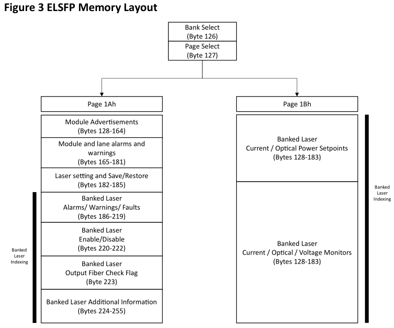

The following shows the memory map implemented according to the standard ELSFP protocol.

The main revisions are as follows:

1. ElsfpCmisMemMap added some ELS-related memory map access functions. It includes the content of the previous CmisMemMap, as well as newly added ELSFP-exclusive content, and revises getaddr to enable multi-bank access.
2. Add multi-bank handling support to OeCmisMemMap.

```
PAGES_PER_BANK  = 240
class ElsfpCmisMemMap(CmisMemMap):   # new
    def __init__(self, codes, bank):
        super().__init__(codes)
        self._bank = bank
        self.ELSFP_ADVERTISEMENTS = RegGroupField(consts.ADVERTISEMENTS_FIELD,
            HexRegField(consts.MaxOpticalPower, self.getaddr(0x1a, 128), size=2),
            HexRegField(consts.MinOpticalPower, self.getaddr(0x1a, 130), size=2), **kwargs)
        self.ELSFP_THRESHOLDS = RegGroupField(consts.ELSFP_THRESHOLDS ,
            NumberRegField(consts.ELSFP_TX_BIAS_HIGH_ALARM_FIELD, self.getaddr(0x1a, 141), size=2, format=">H", scale=100.0),
            NumberRegField(consts.ELSFP_TX_BIAS_LOW_ALARM_FIELD, self.getaddr(0x1a, 143), size=2, format=">H", scale=100.0),
            NumberRegField(consts.ELSFP_TX_BIAS_HIGH_WARNING_FIELD, self.getaddr(0x1a, 145), size=2, format=">H", scale=100.0),
            NumberRegField(consts.ELSFP_TX_BIAS_LOW_WARNING_FIELD, self.getaddr(0x1a, 147), size=2, format=">H", scale=100.0),
            ...
        )

        self.ELSFP_TX_BIAS_ALARM_FLAGS = RegGroupField(consts.ELSFP_TX_BIAS_ALARM_FLAGS_FIELD,
            RegGroupField(consts.ELSFP_TX_BIAS_HIGH_ALARM_FLAG,
                *(NumberRegField("%s%d" % (consts.ELSFP_TX_BIAS_HIGH_ALARM_FLAG, lane), self.getaddr(0x1a, 186),
                    RegBitField("Bit%d" % (lane-1), (lane-1))
                ) for lane in range(1, 9))
            ),
           ...
        )
        ...
    def getaddr(self, page, offset, page_size=128):
        if 0 <= page <= 0xf:
            bank_id = 0
        else:
            bank_id = self._bank
        return (bank_id * PAGES_PER_BANK + page) * page_size + offset;

class OeCmisMemMap(CmisMemMap):   # new
    def __init__(self, codes, bank):
        super().__init__(codes)
        self._bank = bank

    def getaddr(self, page, offset, page_size=128):
        if 0 <= page <= 0xf:
            bank_id = 0
        else:
            bank_id = self._bank
        return (bank_id * PAGES_PER_BANK + page) * page_size + offset
```

The kernel address mapping is as follows (detailed in optoe driver chapters):

```
                    +-------------------------------+
                    |        Lower Page             |
                    +-------------------------------+
                    |  Upper Page (Bank 0, Page 0h) |
                    +-------------------------------+
                    |  Upper Page (Bank 0, Page 1h) |
                    +-------------------------------+
                    |             ...               |
                    +-------------------------------+
                    | Upper Page (Bank 0, Page FFh) |
                    +-------------------------------+
                    | Upper Page (Bank 1, Page 10h) |
                    +-------------------------------+
                    |             ...               |
                    +-------------------------------+
                    | Upper Page (Bank 1, Page FFh) |
                    +-------------------------------+
                    | Upper Page (Bank 2, Page 10h) |
                    +-------------------------------+
                    |             ...               |
                    +-------------------------------+
                    | Upper Page (Bank 2, Page FFh) |
                    +-------------------------------+
                    |             ...               |
                         (continued for more banks)
```

#### 6.2.6. CmisApi

This design uses two independent APIs (CMIS for OE, ELSFP for ELS) to manage the two hardware components.

The hardware must notify the software of its state and communicate required policies, enabling the software to manage and monitor the hardware effectively. 

Similarly, the corresponding `CmisApi` class also needs to be revised. This design integrates OE's API with ELS's API, and provides only one API object externally. The original optical module API call process remains unchanged.

The main revisions are as follows:

1. ElsfpCmisApi inherits all APIs from CmisApi and adds ELS-specific API interfaces.
2. CpoCmisApi is based on the original CmisApi to implement direct access to the original OE functions.
3. CpoCmisApi adds a new member variable `_els_api` that instantiates ElsfpCmisApi, used to implement the same functional interfaces for ELS and OE. Since the functions are identical, ELS needs to be renamed before being exposed externally.

```
class CmisApi(XcvrApi):   # Existing

class ElsfpCmisApi(CmisApi): 
    def __init__(self, xcvr_eeprom, cdb_fw_hdlr=None):
        super(ElsfpCmisApi, self).__init__(xcvr_eeprom)
    def get_elsfp_advertisements(self):
        return self._elsfp_eeprom.read(consts.ELSFP_ADVERTISEMENTS)
    def get_elsfp_thresholds(self):
        return self._elsfp_eeprom.read(consts.ELSFP_THRESHOLDS)
    def get_elsfp_bias_alarm_flag(self):
        return self._elsfp_eeprom.read(consts.ELSFP_TX_BIAS_ALARM_FLAGS)
    def tx_enable(self):
    def set_output_fiber_checked_flag(self):
    ...

class CpoCmisApi(CmisApi):   # new
    def __init__(self, oe_xcvr_eeprom, els_xcvr_eeprom, cdb_fw_hdlr=None):
        super(CpoCmisApi, self).__init__(oe_xcvr_eeprom)
        self._els_api = ElsfpCmisApi(oe_xcvr_eeprom, els_xcvr_eeprom, cdb_fw)

    # New functions of elsfp
    def get_elsfp_advertisements(self):
        return self._els_api.get_elsfp_advertisements()
    def get_elsfp_thresholds(self):
        return self._els_api.read(consts.ELSFP_THRESHOLDS)
    def get_elsfp_bias_alarm_flag(self):
        return self._els_api.read(consts.ELSFP_TX_BIAS_ALARM_FLAGS)
 
    # The CmisApi already has functions, while the elsfp needs to modify the interface name
    def get_elsfp_manufacturer(self):
        return self._els_api.get_manufacturer()
    def get_elsfp_serial(self):
        return self._els_api.get_serial()
    def get_elsfp_transceiver_info(self):
        return self._els_api.get_transceiver_info()

    # The original setting interface performs linked settings.
    def set_lpmode(self, lpmode, wait_state_change = True):
        super().set_lpmode(lpmode, wait_state_change)         # set OE lpmode
        self._els_api.set_lpmode(lpmode, wait_state_change) # set ELS lpmode
    def elsfp_tx_enable(self):
    def elsfp_set_output_fiber_checked_flag(self):
    ...
```

#### 6.2.7. XcvrApiFactory

The CpoXcvrApiFactory class inherits from the original XcvrApiFactory class to initialize CPO OE/ELS EEPROM and the CpoCmisApi.

The main revisions are as follows:

1. Add EEPROM read/write callback functions for OE and ELS as parameters, which are used to initialize OE EEPROM and ELS EEPROM management objects separately.
2. Add bank parameters as initialization parameters for CpoCmisMemMap.
3. Initialize EEPROM management objects for OE and ELS.
4. Initialize CpoCmisApi based on the OE/ELS EEPROM management objects, provide a unified external interface, and keep the original xcvrd framework unchanged.

```
#xcvr_api_factory.py
class CpoXcvrApiFactory(XcvrApiFactory):
    def __init__(self, oe_reader, oe_writer, els_reader, els_writer, oe_bank=0, els_bank=0):
        self._oe_reader = oe_reader
        self._oe_writer = oe_writer
        self._oe_bank = oe_bank
        self._els_reader = els_reader
        self._els_writer = els_writer
        self._els_bank = els_bank

    def _create_cpo_cmis_api(self):  # new
        oe_xcvr_eeprom = XcvrEeprom(self._oe_reader, self._oe_writer, OeCmisMemMap(CmisCodes, self._oe_bank))
        els_xcvr_eeprom = XcvrEeprom(self._els_reader, self._els_writer, ElsfpCmisMemMap(CmisCodes, self._els_bank))
        api = CpoCmisApi(oe_xcvr_eeprom, els_xcvr_eeprom, cdb_fw)
        return api
    def create_xcvr_api(self):
        return self._create_cpo_cmis_api()
```

#### 6.2.8. CmisManagerTask

Add a new CpoCmisManagerTask class that inherits from the original CmisManagerTask for adding fiber check and power sufficient functions.

The main revisions are as follows:

1. Create a CpoCmisManagerTask management thread for CPO device. The CpoCmisManagerTask manages only the CPO port objects(Determine based on whether oe_id is configured for interfaces in the platform.json configuration file).
2. CpoCmisManagerTask reuses the basic task_worker management logic from the original CmisManagerTask process, and adds CPO‑specific processing logic in specific state machines. See the subsequent flowchart for details of the specific process changes.
3. Retain the original CmisManagerTask process for managing non‑CPO ports. During initialization, port_dict retains only non‑CPO ports.

```
class CpoCmisManagerTask(CmisManagerTask):    # new
    def __init__(self, namespaces, port_mapping, main_thread_stop_event, skip_cmis_mgr=False):
        CmisManagerTask.__init__(self)
        self.port_dict = {}    # only save the ports which are cpo port
    def task_worker(self):

class CmisManagerTask(threading.Thread): # modify
    def __init__(self, namespaces, port_mapping, main_thread_stop_event, skip_cmis_mgr=False):
        self.port_dict = # only save the ports which are not cpo port

class DaemonXcvrd(daemon_base.DaemonBase):
    def run(self):
        if not self.skip_cmis_mgr:
            if platform_chassis.is_cpo_device()
                not_cpo_ports =  # get from port_mapping_data which port has no oe_id
                if not_cpo_ports:
                    cmis_manager = CmisManagerTask(self.namespaces, not_cpo_ports, self.stop_event, self.skip_cmis_mgr)
                # Multi-threading can be implemented in the future.
                cpo_ports =  # get from port_mapping_data port which has oe_id
                cpo_cmis_manager = CpoCmisManagerTask(self.namespaces, cpo_ports, self.stop_event, self.skip_cmis_mgr)
        else:
            cmis_manager = CmisManagerTask(self.namespaces, port_mapping_data, self.stop_event, self.skip_cmis_mgr)


```

#### 6.2.9. SfpStateUpdateTask

When SfpStateUpdateTask detects an ELS module insertion event, it needs to write the ELS-related information into the database of the corresponding port.

The information to be added is as follows:

Basic information of ELS:

```
Transceiver info Table
; Defines Transceiver information for a port
key                              = TRANSCEIVER_INFO|ifname          ; information for module on port
; field                          = value
els_type                         INTEGER                            ; the XCVR_IDENTIFIERS
els_type_abbrv_name              INTEGER                            ; the XCVR_IDENTIFIER_ABBRV
els_hardware_rev                 1*255VCHAR                         ; the module hardware revision
els_serial                       1*255VCHAR                         ; the module serial number
els_manufacturer                 1*255VCHAR                         ; the manufacturer of the module
els_model                        1*255VCHAR                         ; the part number of the module
els_connector                    INTEGER                            ; the xcvr CONNECTORS
els_ext_identifier               1*255VCHAR                         ; the power_class and max_power of the module
els_cable_length                 1*255VCHAR                         ; the cable assembly link length
els_vendor_date                  1*255VCHAR                         ; the vendor date of the module
els_vendor_oui                   1*255VCHAR                         ; the vendor oui of the module
els_cable_type                   1*255VCHAR                         ; the cable type of the module
els_media_interface_technology   INTEGER                            ; the media lane technology
els_vendor_rev                   1*255VCHAR                         ; the revision level for part number provided by vendor
els_cmis_rev                     1*255VCHAR                         ; the CMIS version the module complies to
els_vdm_supported                BOOLEAN                            ; whether VDM is supported
```

DOM threshold infomation:

```
TRANSCEIVER_DOM_THRESHOLD info Table
key                              = TRANSCEIVER_DOM_THRESHOLD|ifname ; information for module on port
; field                          = value
els_temphighalarm                FLOAT                              ; Thresholds for internally measured temperature monitor
els_templowalarm                 FLOAT                              ; Thresholds for internally measured temperature monitor
els_temphighwarning              FLOAT                              ; Thresholds for internally measured temperature monitor
els_templowwarning               FLOAT                              ; Thresholds for internally measured temperature monitor
els_vcchighalarm                 FLOAT                              ; Thresholds for internally measured 3.3 volt input supply voltage
els_vcclowalarm                  FLOAT                              ; Thresholds for internally measured 3.3 volt input supply voltage
els_vcchighwarning               FLOAT                              ; Thresholds for internally measured 3.3 volt input supply voltage
els_vcclowwarning                FLOAT                              ; Thresholds for internally measured 3.3 volt input supply voltage
els_txpowerhighalarm             FLOAT                              ; TX Power High Alarm 
els_txpowerlowalarm              FLOAT                              ; TX Power Low Alarm 
els_txpowerhighwarning           FLOAT                              ; TX Power High Warning
els_txpowerlowwarning            FLOAT                              ; TX Power Low Warning
els_txbiashighalarm              FLOAT                              ; Tx Bias High Alarm 
els_txbiaslowalarm               FLOAT                              ; Tx Bias Low Alarm 
els_txbiashighwarning            FLOAT                              ; Tx Bias High Warning
els_txbiaslowwarning             FLOAT                              ; Tx Bias Low Warning
```

VDM threshold infomation:

```
TRANSCEIVER_VDM_XXX_THRESHOLD info Table
key                              = TRANSCEIVER_VDM_XXX_THRESHOLD|ifname ; information for module on port
; field                          = value
vcc1p8_voltage                   FLOAT                                  ; Thresholds for internally measured 1.8 volt input supply voltage
vcc1p2_voltage                   FLOAT                                  ; Thresholds for internally measured 1.2 volt input supply voltage
vcc0p7a_voltage                  FLOAT                                  ; Thresholds for internally measured 0.75 volt input supply voltage
els_input_power                  FLOAT                                  ; ELS Input Power (Lane=Laser ID)
laser_age                        FLOAT                                  ; Laser Age (0% at BOL, 100% EOL) (Media Lane)
laser_frequency_err              FLOAT                                  ; Laser Frequency Error (Media Lane)
laser_temperature                FLOAT                                  ; Laser Temperature (Media Lane)
```

#### 6.2.10. DomInfoUpdateTask

DomInfoUpdateTask needs to periodically report ELS-specific attributes to the corresponding database.

The information to be added is as follows:

```
TRANSCEIVER_DOM_SENSOR
key                              = TRANSCEIVER_DOM_SENSOR|ifname    ; information for module on port
; field                          = value
els_temperature                  FLOAT                              ; module temperature in Celsius
els_voltage                      FLOAT                              ; supply voltage in mV
els_tx<n>bias                    FLOAT                              ; TX Bias Current in mA, n is the channel number
els_tx<n>voltage                 FLOAT                              ; Laser voltage in mV, n is the channel number
els_tx<n>power                   FLOAT                              ; TX output power in mW, n is the channel number
```

```
TRANSCEIVER_DOM_FLAG
key                              = TRANSCEIVER_DOM_FLAG|ifname          ; information for module on port
; field                          = value
els_tx_power_high_alarm          BOOLEAN                                ; High optical power alarm on indexed lane n 
els_tx_power_low_alarm           BOOLEAN                                ; Low optical power alarm on indexed lane n 
els_tx_power_high_warn           BOOLEAN                                ; High optical power warning on indexed lane n 
els_tx_power_low_warn            BOOLEAN                                ; Low optical power warning on indexed lane n 
els_tx_bias_high_alarm           BOOLEAN                                ; High bias alarm on indexed lane n
els_tx_bias_low_alarm            BOOLEAN                                ; High bias alarm on indexed lane n
els_tx_bias_high_warn            BOOLEAN                                ; High bias warning on indexed lane n 
els_tx_bias_low_warn             BOOLEAN                                ; Low bias warning on indexed lane n
```

```
TRANSCEIVER_STATUS
key                              = TRANSCEIVER_STATUS|ifname          ; information for module on port
; field                          = value
els_module_state                 INTEGER                              ; module state
els_module_fault_cause           INTEGER                              ; module fault cause
```

```
TRANSCEIVER_STATUS_FLAG
key                              = TRANSCEIVER_STATUS_FLAG|ifname          ; information for module on port
; field                          = value
els_fault_flag_lane<n>           BOOLEAN                                   ; ELSFP Fault code for indexed lane
els_warn_flag_lane<n>            BOOLEAN                                   ; ELSFP Warning code for indexed lane
els_lane_state_flag<n>           INTEGER                                   ; ELSFP Lane Output state for indexed lane 
```

```
TRANSCEIVER_VDM_REAL_VALUE
key                              = TRANSCEIVER_VDM_REAL_VALUE|ifname    ; information for module on port
; field                          = value
vcc1p8_voltage                   FLOAT                                  ; Thresholds for internally measured 1.8 volt input supply voltage
vcc1p2_voltage                   FLOAT                                  ; Thresholds for internally measured 1.2 volt input supply voltage
vcc0p7a_voltage                  FLOAT                                  ; Thresholds for internally measured 0.75 volt input supply voltage
els_input_power                  FLOAT                                  ; ELS Input Power (Lane=Laser ID)
laser_age                        FLOAT                                  ; Laser Age (0% at BOL, 100% EOL) (Media Lane)
laser_frequency_err              FLOAT                                  ; Laser Frequency Error (Media Lane)
laser_temperature                FLOAT                                  ; Laser Temperature (Media Lane)
```

```
TRANSCEIVER_VDM_XXX_FLAG
key                              = TRANSCEIVER_VDM_XXX_FLAG|ifname         ; information for module on port
; field                          = value
vcc1p8_voltage                   BOOLEAN                                   ; Thresholds for internally measured 1.8 volt input supply voltage
vcc1p2_voltage                   BOOLEAN                                   ; Thresholds for internally measured 1.2 volt input supply voltage
vcc0p7a_voltage                  BOOLEAN                                   ; Thresholds for internally measured 0.75 volt input supply voltage
els_input_power                  BOOLEAN                                   ; ELS Input Power (Lane=Laser ID)
laser_age                        BOOLEAN                                   ; Laser Age (0% at BOL, 100% EOL) (Media Lane)
laser_frequency_err              BOOLEAN                                   ; Laser Frequency Error (Media Lane)
laser_temperature                BOOLEAN                                   ; Laser Temperature (Media Lane)
```

#### 6.2.11. Show interfaces transceiver CLI

Displays diagnostic monitoring information of the transceivers.

The parameters of the **show interfaces transceiver** command have not been revised; only when displaying INFO, DOM, and Status does it need to show ELS-related information corresponding to the current port. The OE information corresponding to the port will still use the original name for display without revision.

Revised display examples are as follows:

Example (Decode and display module information of the ELS connected to Ethernet0):

```
admin@sonic:~$ show interfaces transceive info Ethernet0
Ethernet0: SFP EEPROM detected
        Application Advertisement: {1: {'host_electrical_interface_id': '400GAUI-8 C2M (Annex 120E)', 'module_media_interface_id': '400ZR, DWDM, amplified', 'media_lane_count': 1, 'host_lane_count': 8, 'host_lane_assignment_options': 1}, 2: {'host_electrical_interface_id': '400GAUI-8 C2M (Annex 120E)', 'module_media_interface_id': '400ZR, Single Wavelength, Unamplified', 'media_lane_count': 1, 'host_lane_count': 8, 'host_lane_assignment_options': 1}, 3: {'host_electrical_interface_id': '100GAUI-2 C2M (Annex 135G)', 'module_media_interface_id': '400ZR, DWDM, amplified', 'media_lane_count': 1, 'host_lane_count': 2, 'host_lane_assignment_options': 85}}
        Connector: LC
        Encoding: N/A
        Extended Identifier: Power Class 8 (20.0W Max)
        Extended RateSelect Compliance: N/A
        Identifier: QSFP-DD Double Density 8X Pluggable Transceiver
        Length Cable Assembly(m): 0.0
        Nominal Bit Rate(100Mbs): 0
        Specification compliance: sm_media_interface
        Vendor Date Code(YYYY-MM-DD Lot): 2020-01-01
        Vendor Name: XXXX
        Vendor OUI: xx-xx-xx
        Vendor PN: XXX
        Vendor Rev: XXX
        Vendor SN: 0123456789

        ELS Connector: LC
        ELS Encoding: N/A
        ELS Extended Identifier: Power Class 8 (20.0W Max)
        ELS Extended RateSelect Compliance: N/A
        ELS Identifier: QSFP-DD Double Density 8X Pluggable Transceiver
        ELS Length Cable Assembly(m): 0.0
        ELS Nominal Bit Rate(100Mbs): 0
        ELS Specification compliance: sm_media_interface
        ELS Vendor Date Code(YYYY-MM-DD Lot): 2020-01-01
        ELS Vendor Name: XXXX
        ELS Vendor OUI: xx-xx-xx
        ELS Vendor PN: XXX
        ELS Vendor Rev: XXX
        ELS Vendor SN: 0123456789
```

Example (Decode and display dom information of the transceiver connected to Ethernet0):

```
admin@sonic:~$ show interfaces transceive eeprom --dom Ethernet0
Ethernet0: SFP EEPROM detected
'''Skip the above information'''
        ChannelMonitorValues:
                RX1Power: -infdBm
                RX2Power: -infdBm
                RX3Power: -infdBm
                RX4Power: -infdBm
                RX5Power: -infdBm
                RX6Power: -infdBm
                RX7Power: -infdBm
                RX8Power: -infdBm
                TX1Bias: 0.0mA
                TX1Power: -10.0dBm
                TX2Bias: 0.0mA
                TX2Power: -infdBm
                TX3Bias: 0.0mA
                TX3Power: -infdBm
                TX4Bias: 0.0mA
                TX4Power: -infdBm
                TX5Bias: 0.0mA
                TX5Power: -infdBm
                TX6Bias: 0.0mA
                TX6Power: -infdBm
                TX7Bias: 0.0mA
                TX7Power: -infdBm
                TX8Bias: 0.0mA
                TX8Power: -infdBm

                ELS Lane1Bias: 0.0mA
                ELS Lane1Power: -10.0dBm
                ELS Lane2Bias: 0.0mA
                ELS Lane2Power: -infdBm
                ELS Lane3Bias: 0.0mA
                ELS Lane3Power: -infdBm
                ELS Lane4Bias: 0.0mA
                ELS Lane4Power: -infdBm
                ELS Lane5Bias: 0.0mA
                ELS Lane5Power: -infdBm
                ELS Lane6Bias: 0.0mA
                ELS Lane6Power: -infdBm
                ELS Lane7Bias: 0.0mA
                ELS Lane7Power: -infdBm
                ELS Lane8Bias: 0.0mA
                ELS Lane8Power: -infdBm
        ChannelThresholdValues:
                RxPowerHighAlarm  : 2.0dBm
                RxPowerHighWarning: 0.0dBm
                RxPowerLowAlarm   : -20.01dBm
                RxPowerLowWarning : -20.0dBm
                TxBiasHighAlarm   : 0.0mA
                TxBiasHighWarning : 0.0mA
                TxBiasLowAlarm    : 0.0mA
                TxBiasLowWarning  : 0.0mA
                TxPowerHighAlarm  : 0.0dBm
                TxPowerHighWarning: -2.0dBm
                TxPowerLowAlarm   : -18.013dBm
                TxPowerLowWarning : -16.003dBm

                ELS LaneBiasHighAlarm   : 0.0mA
                ELS LaneBiasHighWarning : 0.0mA
                ELS LaneBiasLowAlarm    : 0.0mA
                ELS LaneBiasLowWarning  : 0.0mA
                ELS LanePowerHighAlarm  : 0.0dBm
                ELS LanePowerHighWarning: -2.0dBm
                ELS LanePowerLowAlarm   : -18.013dBm
                ELS LanePowerLowWarning : -16.003dBm
        ModuleMonitorValues:
                Temperature: 57.0C
                Vcc: 3.329Volts

                ELS Temperature: 0.0C
                ELS Vcc: 0Volts
        ModuleThresholdValues:
                TempHighAlarm  : 80.0C
                TempHighWarning: 75.0C
                TempLowAlarm   : -5.0C
                TempLowWarning : 15.0C
                VccHighAlarm   : 3.465Volts
                VccHighWarning : 3.432Volts
                VccLowAlarm    : 3.135Volts
                VccLowWarning  : 3.168Volts

                ELS TempHighAlarm  : 80.0C
                ELS TempHighWarning: 75.0C
                ELS TempLowAlarm   : -5.0C
                ELS TempLowWarning : 15.0C
                ELS VccHighAlarm   : 3.465Volts
                ELS VccHighWarning : 3.432Volts
                ELS VccLowAlarm    : 3.135Volts
                ELS VccLowWarning  : 3.168Volts
```

Example (Display status of transceiver connected to Ethernet0):

```
admin@sonic:~$ show interfaces transceiver status Ethernet0
Ethernet0:
'''Skip the old information'''
ELS Module State : Ready
ELS Module Fault Cause : No Fault detected
ELS Module Firmware Fault : False
ELS Module State Changed : False
ELS Temperature High Alarm : False
ELS Temperature High Warning : False
ELS Temperature Low Alarm : False
ELS Temperature Low Warning : False
ELS Vcc High Alarm : False
ELS Vcc High Warning : False
ELS Vcc Low Alarm : False
ELS Vcc Low Warning : False
ELS Lane Power High Alarm : False   # dom lane  flag
ELS Lane Power High Warning : False
ELS Lane Power Low Alarm : False
ELS Lane Power Low Warning : False
ELS Lane Bias High Alarm : False
ELS Lane Bias High Warning : False
ELS Lane Bias Low Alarm : False
ELS Lane Bias Low Warning : False
ELS Tx fault flag on lane 1
ELS Tx fault flag on lane 2
ELS Tx fault flag on lane 3
ELS Tx fault flag on lane 4
ELS Tx fault flag on lane 5
ELS Tx fault flag on lane 6
ELS Tx fault flag on lane 7
ELS Tx fault flag on lane 8
ELS Tx warn flag on lane 1
ELS Tx warn flag on lane 2
ELS Tx warn flag on lane 3
ELS Tx warn flag on lane 4
ELS Tx warn flag on lane 5
ELS Tx warn flag on lane 6
ELS Tx warn flag on lane 7
ELS Tx warn flag on lane 8
ELS Tx lane state flag on lane 1
ELS Tx lane state flag on lane 2
ELS Tx lane state flag on lane 3
ELS Tx lane state flag on lane 4
ELS Tx lane state flag on lane 5
ELS Tx lane state flag on lane 6
ELS Tx lane state flag on lane 7
ELS Tx lane state flag on lane 8
```

#### 6.2.12. optoe driver

The current optoe driver does not yet support bank switching. It is certainly possible to handle bank and page switching at the upper-layer interface, using locks to prevent conflicts.

However, this approach introduces additional complexity in both implementation and usage:every read and write from the upper software layer would need to perform explicit bank and page switching, and the locking and unlocking logic would be difficult to standardize.

A better approach is to have the driver itself manage bank and page switching, along with the associated locking operations, thereby avoiding unnecessary complexity for the upper software layers. So the driver code needs to be updated to accommodate this new feature.

We can use the revisions from the following PR to enable bank switching support in the optoe driver.

> https://github.com/sonic-net/sonic-linux-kernel/pull/473

This PR contains the following issues that need to be addressed.

1) The algorithm in the optoe_translate_offset function may contain issues and needs to be fixed. This has already been discussed in the PR. This issue was resolved by applying special handling to getaddr within the CmisMemMap class.

It is recommended  to use the driver that supports bank switching in optoe. If there are unavoidable special requirements, also may choose not to load the optoe driver and instead load the standard at24 driver. In that case, the upper-layer software would need to handle bank and page switching on its own, as well as manage conflict avoidance.

### 6.3. Implementation Flow

#### 6.3.1. Chassis Init Flow

Initialize the `DaemonXcvrd` global variable platform_chassis according to the newly defined `CpoOptoeBase` class and `platform.json`.

platform_chassis = sonic_platform.platform.Platform().get_chassis()

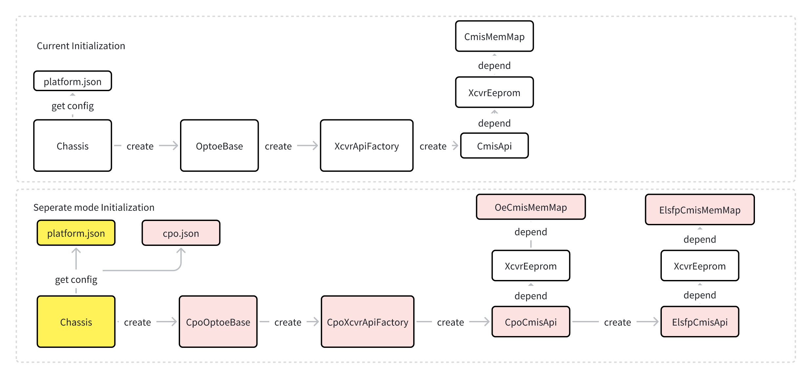

#### 6.3.2. Module Presence Flow

CPO has no module plug-in scenario, but the original community module plug-in event can be triggered through the presence of ELS.

Customize the module presence interface through the platform-inherited class `Chassis(ChassisBase): get_transceiver_change_event`.

In the custom `Chassis(ChassisBase)` class get_transceiver_change_event interface, call the get_presence interface whose inheritance relationship is `CpoOptoeBase(OptoeBase)`.

This part of the logic is consistent with that of ordinary optical modules. In the get_presence interface of `CpoOptoeBase`, it is necessary to query the corresponding ELS information according to the port. Then, obtain its presence information according to els_id.

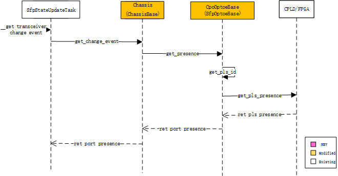

#### 6.3.3.  API Call Flow

The current community CMIS API call sequence diagram is as follows (taking set_lpmode as an example):

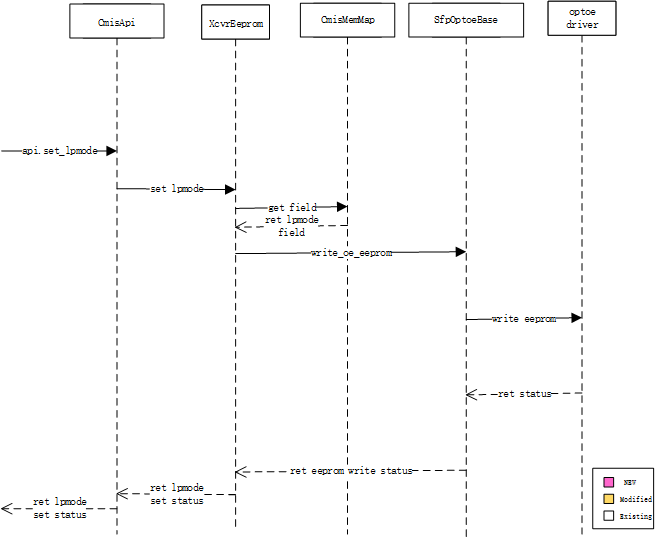

The CPO CMIS API call flow is basically the same as the original flow，except that the used class  is replaced with the newly added class.

The following uses setting lpmode as examples to illustrate the API call flow of the current design.

lpmode setting flow:

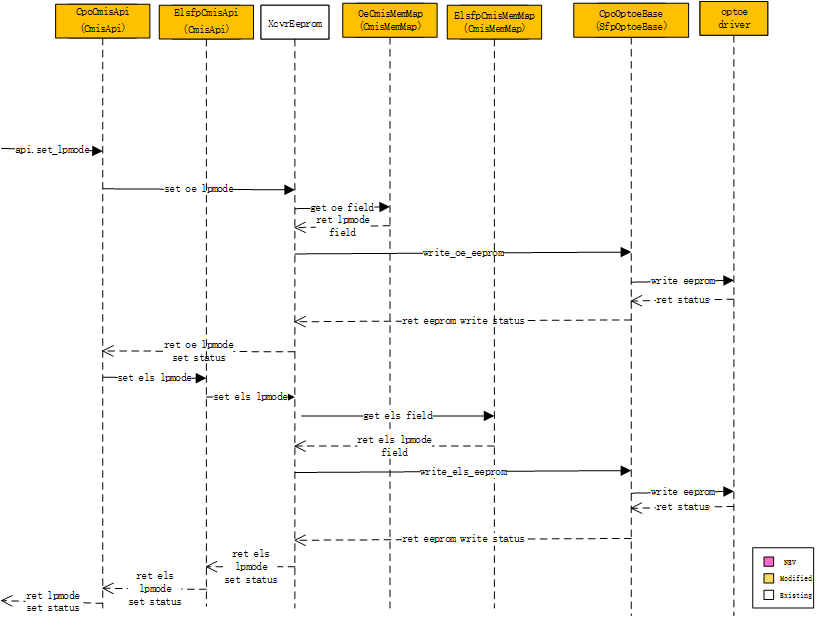

#### 6.3.4.  CmisManagerTask State Machine

The new CpoCmisManagerTask is for CPO ports. If the device still has non-CPO ports, the original CmisManagerTask must be retained to handle the state machine processing for those non‑CPO ports.

The specific processing flow is similar to the original, except that some logic needs to be revised and CPO‑specific logic handling must be added.

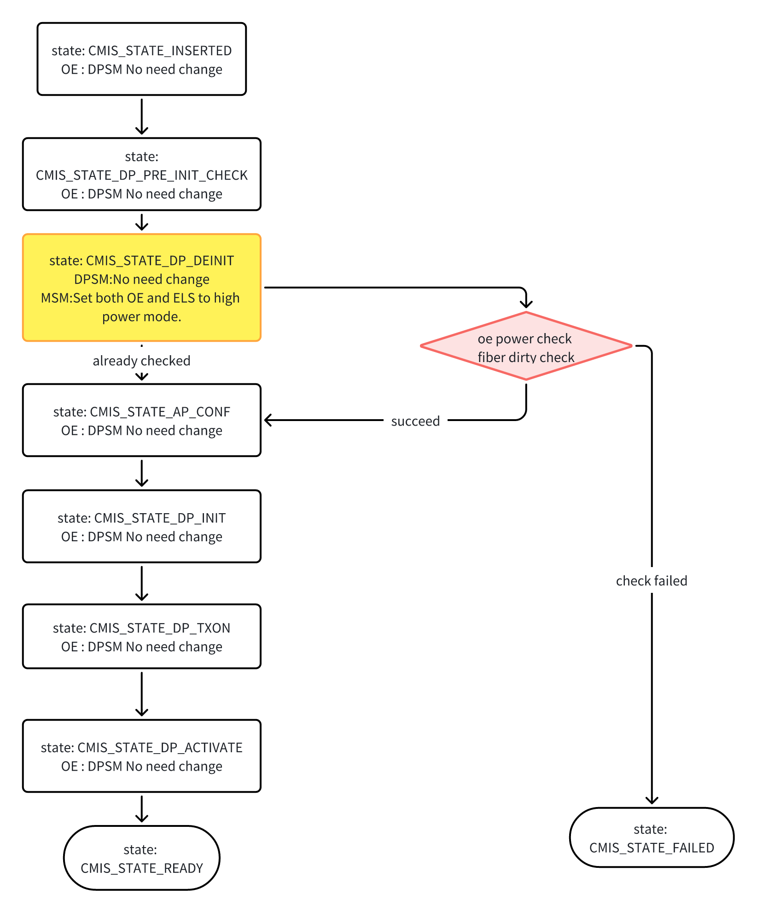

Detailed procedures for OE power check and fiber dirty check:

Among these, the OE power check is performed in the sfp.check_calibration interface, which can also be used to add other query‑type validations.

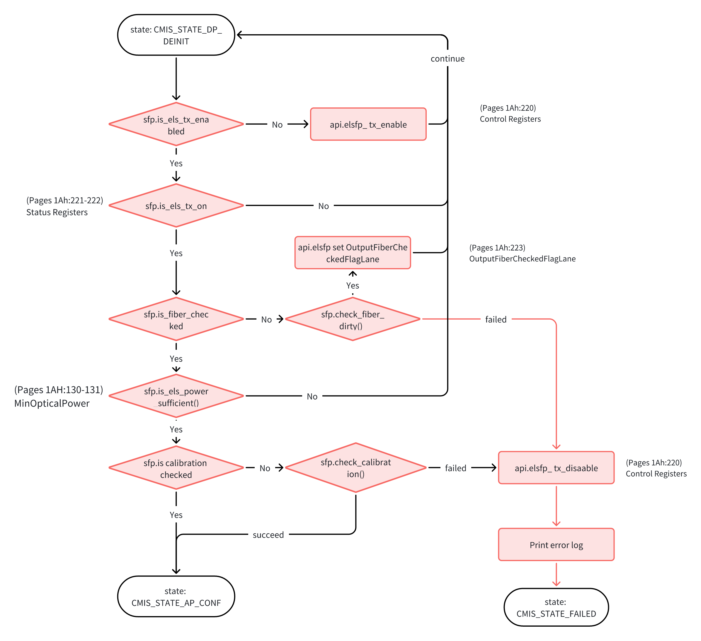

Detailed procedures for  fiber dirty check:

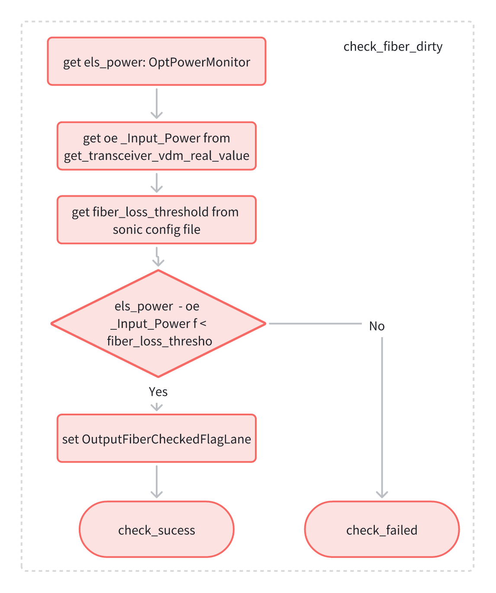

Detailed procedures for OE power check：

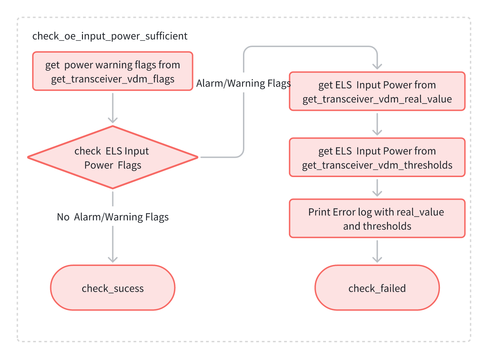

### 6.4. Unit Test cases

1. CPO device identification interface testing
2. Parsing tests for each configuration parameter in `platform.json`
3. Parsing tests for each configuration parameter in `cpo.json`
4. Function tests for each function of the newly added `CpoOptoeBase` class
5. Function tests for each function of the newly added `CpoCmisApi` class
6. Function tests for each function of the newly added `ElsfpCmisApi` class
7. Function tests corresponding to the newly added `ElsfpCmisMemMap` class
8. Function tests corresponding to the newly added `OeCmisMemMap` class
9. Testing of newly added logic for `CmisManagerTask`,` DomInfoUpdateTask`, `SfpStateUpdateTask`, etc.

### 6.5. Open/Action items - if any

1. This design has provided a basic OE/ELS access framework; OE/ELS firmware upgrade will be reflected in subsequent HLD documents.
