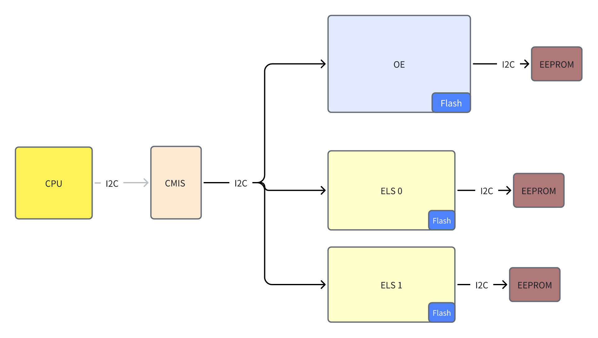
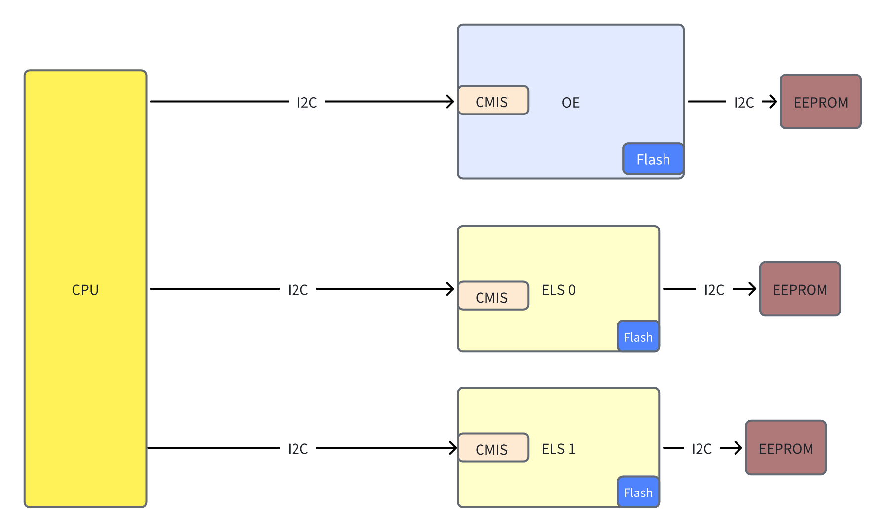
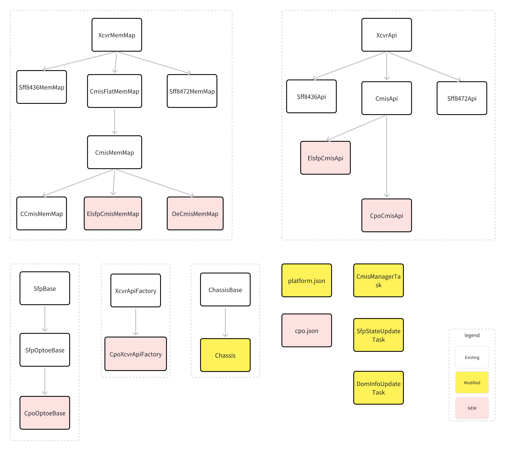
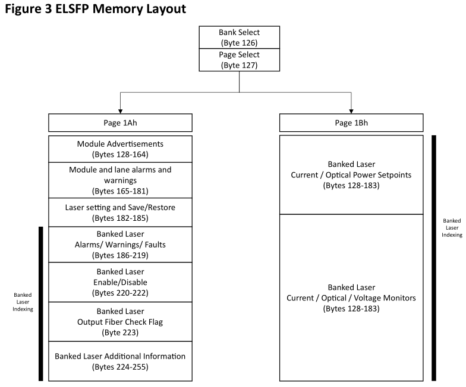
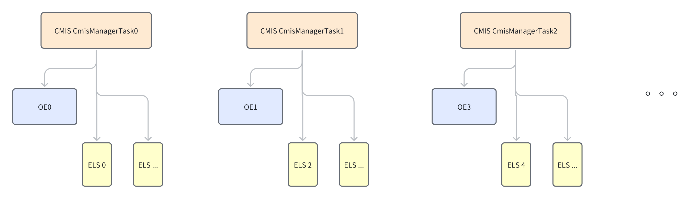
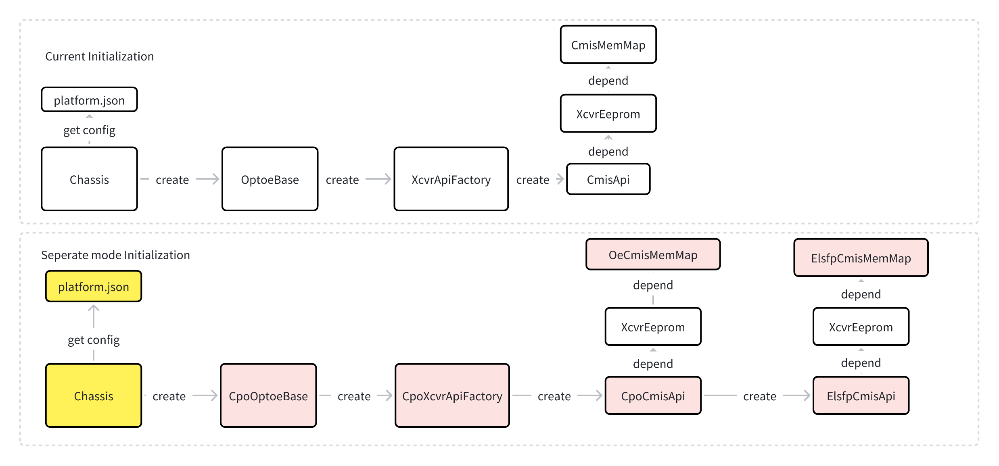
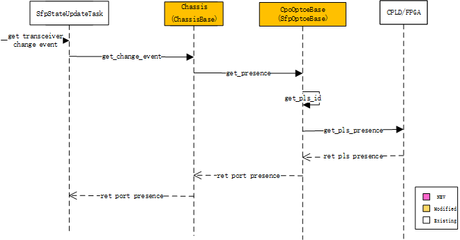
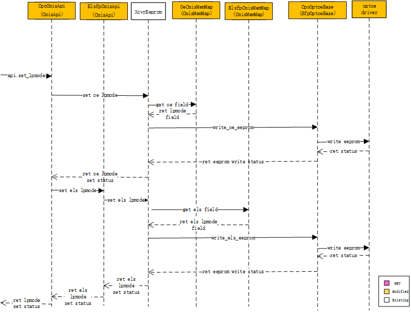
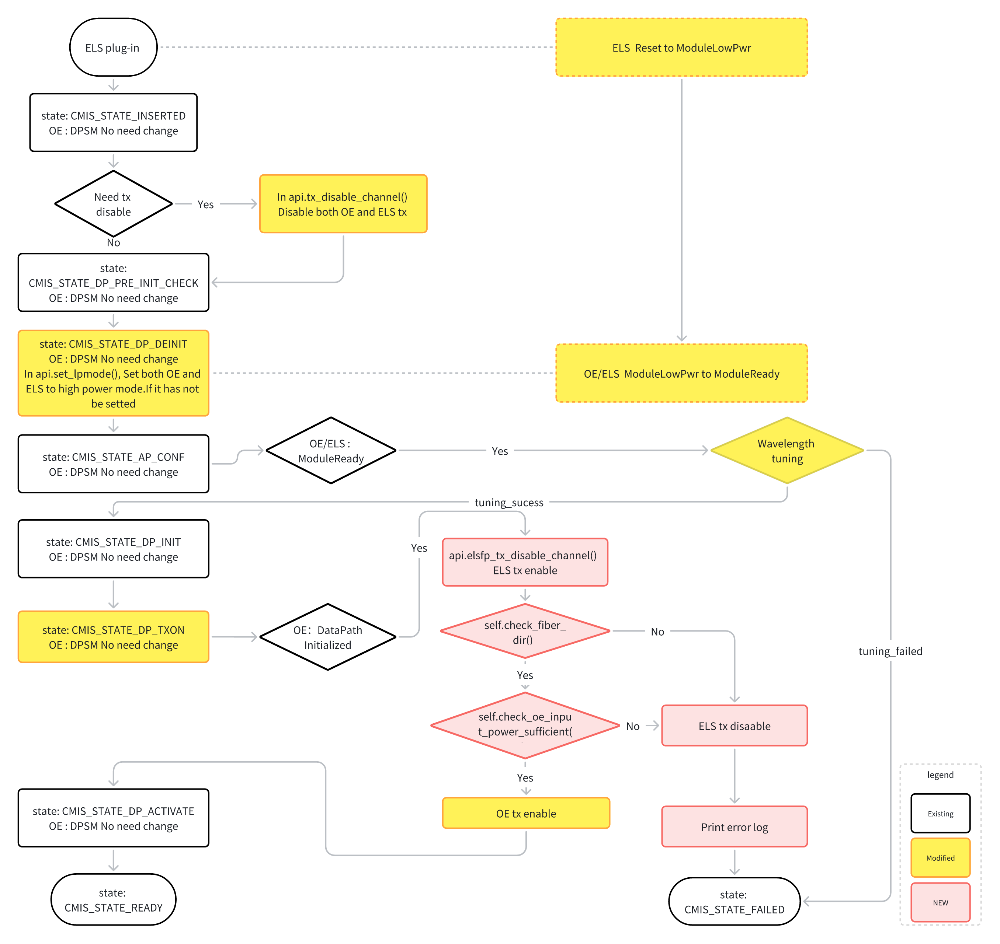

# CPO support in SONiC

## Table of Content

## 1. Revision

| Rev |     Date     | Author | Change Description                                                                                                                                                                                                                                                                                                                                                                                                                                                                                                                  |
| :-: | :----------: | :----: | ----------------------------------------------------------------------------------------------------------------------------------------------------------------------------------------------------------------------------------------------------------------------------------------------------------------------------------------------------------------------------------------------------------------------------------------------------------------------------------------------------------------------------------- |
| 1.0 |   Dec 2025   | Kroos | Initial version                                                                                                                                                                                                                                                                                                                                                                                                                                                                                                                     |
| 1.1 | Jan 20 2026 | Kroos | 1.Modify the HLD name<br />2.Optimize content descriptions: clarify the meaning of Separate Modeand update the schematic diagram<br />3.Add multi-thread processing for CmisManagerTask, and implement new features for CPO including Fiber Dirty Check and OE Sufficient Input Power<br />4.Add reporting of ELS-related information in DomInfoUpdateTask<br />5.Add reporting of ELS-related information in SfpStateUpdateTask<br />6.Optimize configuration files by adding a standalone cpo.json configuration file separately. |

## 2. Scope

This section describes the implementation of CPO in community frame.

Firmware upgrade is not within the scope of this design description.

The design of the CLI is not covered in this document. The existing CLI supports the management of OE, while the CLI for ELS-related management will be described in subsequent design documentation.

## 3. Definitions/Abbreviations

OE: Optical Engine

CPO: Co-packaged optics

CMIS ： Common Management Interface Specification

ELSFP : External Laser Small Form Factor Pluggable

ELS :External Laser Sources

## 4. Overview

CPO primarily adds new OE and ELS devices. At the software level, control of the OE/ELS devices is mainly achieved by accessing their EEPROMs. The host has two main ways to access the EEPROMs of the OE/ELS devices

Joint Mode: The host does not directly access the EEPROMs of the OE/ELS devices. Instead, a CMIS controller merges the EEPROMs of the OE and ELS into a single unit, allowing the host board to access them indirectly.And the figure is for illustration only since the number of ELSs and OEs per CPO module may vary by vendor.



Separate Mode: The host can directly access the EEPROMs of the OE/ELS devices via independent I²C.

Separate mode is not a hardware concept — it has no relationship with whether the hardware has an MCU, or whether OE/ELS is controlled based on an MCU.
We introduce Separate mode to require vendors to provide independent OE access interfaces based on the standard CMIS specification, and independent ELS access interfaces based on the standard CMIS ELSFP specification.



This design takes Separate Mode as an example to introduce the EEPROM specifications for standard OE and ELS. It integrates the control of the relevant OE and ELS with the traditional optical module control flow of the SONiC community, and explains how to implement the functions of traditional optical modules by controlling the OE and ELS.

Joint Mode is mainly reflected in the inconsistency of CmisMemMap addresses mapped by the OE and ELS. The differing parts may require vendors to reimplement CmisMemMap. The rest of the content can be shared with this design.

## 5. Requirementsd

The management of CPO switches based on the community xcvrd framework mainly involves the following aspects:

1. CPO devices are managed by mapping OE/ELS to the CMIS memory map.The OE part is CMIS general registers, and no special handling is required in the community code. However, the ELS memory map (proposed in accordance with the latest CMIS standard) is not yet implemented in the community code. Therefore, it is necessary to add ELS-related management interfaces.
2. CPO devices use multiple banks in the CMIS memory map. However, there is currently no multi-bank processing logic in the community code.
   Therefore, it is necessary to add a multi-bank management logic.
3. There is a many-to-one mapping relationship between CPO device ports and OEs or ELSs. Vendors need to maintain the mapping entries between ports and OE/ELS when adapting devices.
4. Community xcvrd management is triggered based on module plug-in/plug-out events; CPO has no plug-in/plug-out events,so the presence logic needs to be redesigned.

## 6. High-Level Design

### 6.1. Problem Statement

1. The ELS memory map, proposed based on the latest CMIS standard, has no relevant implementation in the current community code.
2. The current community code has no CMIS multi-bank processing logic.
3. Traditional ports have a one-to-one correspondence with optical modules, which cannot meet the processing logic of CPO devices (where multiple ports correspond to one OE/ELS).
4. There are no plug-in/plug-out events of CPO port modules.

### 6.2. New Approach

Our design uses two independent APIs (CMIS for OE, ELSFP for ELS) to manage the two hardware components.

The hardware must notify the software of its state and communicate required policies, enabling the software to manage and monitor the hardware effectively. If rapid response is needed, the firmware may handle it first, but the software must still process the event, implement corresponding policies.

**Vendor Requirements:**

**OE Vendors** must provide management interfaces compliant with industry standards (e.g., CMIS) and disclose their register mappings to ensure identification, status monitoring, and basic control via I2C.

**ELS Vendors** must strictly implement the OIF-ELSFP-CMIS-01.0 protocol, ensuring all specified registers, state machines, and functions (e.g., channel control, fiber check flags, save/restore) are available.

**Switch Manufacturers** must provide accessible paths for both ELS and OE so that CPU can access them independently.

Main revised components are as follows:



| Original Module    | Revised Module     | Type     | Description                                                                                                                                                                                                                                                                |
| :----------------- | ------------------ | -------- | -------------------------------------------------------------------------------------------------------------------------------------------------------------------------------------------------------------------------------------------------------------------------- |
| platform.json      | platform.json      | Modified | The mapping relationships between ports and OE/ELS, as well as bank‑based configuration references.                                                                                                                                                                       |
| Na                 | cpo.json           | New      | OE/ELS-related configuration information                                                                                                                                                                                                                                   |
| SfpOptoeBase       | CpoOptoeBase       | New      | It is an abstract port management class, used for port management by the xcvrd framework.<br /> It mainly provides EEPROM access interfaces for OE and ELS.<br />Vendors are required to instantiate it and use it with revisions to the platform.json configuration file. |
| ChassisBase        | Chassis            | Modified | It is an original vendor-implemented class, used during initialization to determine<br />whether a port uses the CpoOptoeBase type or the original OptoeBase type.                                                                                                         |
| CmisMemMap         | ElsfpCmisMemMap    | New      | Provides the EEPROM memory map address for ELS, based on the OIF-ELSFP-CMIS-01.0 standard,<br />and offers multi-bank functionality.                                                                                                                                       |
| CmisMemMap         | OeCmisMemMap       | New      | Extends the multi-bank functionality based on the original CmisMemMap.                                                                                                                                                                                                     |
| CmisApi            | CpoCmisApi         | New      | The universal API access interface for CPO includes ELS functions and OE function access interfaces.<br /> It provides unified external management, and the original optical module API call process remains unchanged.                                                    |
| XcvrApiFactory     | CpoXcvrApiFactory  | New      | Considering that the EEPROM access for ELS and OE can be separated,<br />split the EEPROM instances of OE and ELS based on the original XcvrApiFactory.                                                                                                                    |
| optoe driver       | optoe driver       | Modified | Adds multi-bank memory map.                                                                                                                                                                                                                                                |
| CmisManagerTask    | CmisManagerTask    | Modified | Revise CmisManagerTask for CPO-specific function management and extend it to a multi-threaded management mechanism based on OE.                                                                                                                                            |
| SfpStateUpdateTask | SfpStateUpdateTask | Modified | When SfpStateUpdateTask detects an ELS module insertion event, it needs to write the ELS-related information into the database of the corresponding port.                                                                                                                  |
| DomInfoUpdateTask  | DomInfoUpdateTask  | Modified | DomInfoUpdateTask needs to periodically report ELS-specific attributes to the corresponding database.                                                                                                                                                                      |

#### 6.2.1. platform.json

Add the mapping relationships between ports and OE/ELS, and include CPO bank‑based configuration information.

The main revisions are as follows:

1. Under the original `interfaces` configuration, each Ethernet port is bound to its corresponding OE, oe_bank, and ELS, els_bank information.Similarly, in Joint Mode, els_bank_id does not need to be configured.
2. Add a new `fiber_loss_threshold` configuration section. Unit: dB. Used to initialize the threshold for the fiber dirty check judgment.If the measured value is greater than this threshold, the ELS-to-OE path is considered abnormal. If the measured value is less than this threshold, the path is considered normal.

```
{
    "interfaces": {
        "Ethernet1": {
            "index": "0,0,0,0,0,0,0,0",
            "lanes": "41,42,43,44,45,46,47,48",
            "fec_modes": {},
            "breakout_modes": {
                "1x800G": ["Eth1"],
                "2x400G": ["Eth1/1", "Eth1/2"],
                "2x200G": ["Eth1/1", "Eth1/2"],
                "2x100G": ["Eth1/1", "Eth1/2"]
            },
            "oe_id":0,         # start at 0
            "oe_bank_id":0,    # start at 0
            "els_id":0,        # start at 0
            "els_bank_id":0,   # start at 0
            "configured_freq": 100
        },
        ...
        "Ethernet64": {
            "index": "63,63,63,63,63,63,63,63",
            "lanes": "465,466,467,468,469,470,471,472",
            "fec_modes": {},
            "breakout_modes": {
                "1x800G": ["Eth64"],
                "2x400G": ["Eth64/1", "Eth64/2"],
                "2x200G": ["Eth64/1", "Eth64/2"],
                "2x100G": ["Eth64/1", "Eth64/2"]
            },
            "oe_id":7,
            "oe_bank_id":7,
            "els_id":15,
            "els_bank_id":3
            "configured_freq": 100
        }
    }
}


```

#### 6.2.2. cpo.json

Add CPO device OE/ELS-related configuration.

The main revisions are as follows:

1. Add a new `oes` configuration section in cpo.json to obtain information such as the OE bank count and OE I2C bus.According to the CMIS protocol, the Optoe driver accesses the device at address 0x50 for all cases; only the I2C bus number differs depending on the OE/ELS.
2. Add a new `elss` configuration section in cpo.json  to provide information such as ELS bank count, ELS I2C bus,ELS presence. In Joint Mode, when ELS and OE share a common CMIS I2C, the els_i2c_path and oe_i2c_path must be identical, and els_bank_count cannot be configured. Otherwise, it will overwrite the previous OE configuration.

```
   "oes":{
        "oe0": {  # start with oe 0
            "oe_bank_count": 8, 
            "oe_i2c_path": "/sys/bus/i2c/devices/i2c-24/24-0050/",
            "fiber_loss_threshold": 5
        },
         ...
        "oe7": {
            "oe_bank_count": 8,
            "oe_i2c_path": "/sys/bus/i2c/devices/i2c-31/31-0050/",
    },
    "elss" :{
        "els0": {  # start with els 0
            "els_bank_count": 4,
            "els_i2c_path": "/sys/bus/i2c/devices/i2c-32/32-0050/",
            "els_presence": {
                "presence_file": "/dev/fpga1",
                "presence_offset": "0x64",
                "presence_bit": "8",
                "presence_value": "0"
            }
        }
        ...
        "els15": {
            "els_bank_count": 4,
            "els_i2c_path": "/sys/bus/i2c/devices/i2c-47/47-0050/",
            "els_presence": {
                "presence_file": "/dev/fpga1",
                "presence_offset": "0x64",
                "presence_bit": "31",
                "presence_value": "0"
            }
        }
    },
```

#### 6.2.3. SfpOptoeBase

Since the instantiation of CMIS is in the `SfpOptoeBase` class, this design puts the management of CMIS multi-bank under `SfpOptoeBase` class.

Define the community CPO public class:  `CpoOptoeBase`, which inherits from the `SfpOptoeBase` class. It is used for port management by the xcvrd framework. It mainly provides EEPROM access interfaces for OE and ELS. It requires vendors to instantiate it and use it with revisions to the platform.json configuration file.

The main revisions are as follows:

1. During instantiation, save the corresponding port, oe_id, oe_bank_id, els_id, els_bank_id according to the configuration file, and provide query interfaces.
2. The original member variable self._xcvr_api_factory needs to be re-initialized in the subclass according to oe_bank_id，oe eeprom function and ELS eeprom function.
3. Provide a new port presence detection method based on ELS status: get_els_presence
4. Provide separate EEPROM access interfaces for OE and ELS.

```
I2C_PAGE_SIZE=128
class CpoOptoeBase(SfpOptoeBase):  # new
    def __init__(self, index，oe_id, oe_bank_id,  els_id, els_bank_id, chassis: "Chassis"):
        SfpOptoeBase.init(self)
        self._chassis = chassis
        self._port_id = index
        self._oe_id = oe_id
        self._oe_bank_id= oe_bank_id
        self._els_id = els_id
        self._els_bank_id= els_bank_id
        self._xcvr_api_factory = CpoXcvrApiFactory(self.read_oe_eeprom, self.write_oe_eeprom,
            self.read_els_eeprom, self.write_els_eeprom, self._oe_bank_id, self._els_bank_id)

    def get_oe_bank_id(self):
        return self._bank_id
    def get_oe_id(self):
    def get_els_bank_id(self):
    def get_els_id(self):

    def get_oe_eeprom_path(self, oe):
        cpo_bus = self._chassis.get_oes_config()[self._oe_id].get("oe_i2c_path", None)
        return cpo_bus + "eeprom" 
    def read_oe_eeprom(self, offset, num_bytes):
        oe_id = self._oe_id
        oe_bus_path = self.get_oe_eeprom_path(oe_id)
        # read from oe_bus_path file
    def write_oe_eeprom(self, offset, num_bytes, write_buffer):

    def get_els_eeprom_path(self, els_id):
        cpo_bus = self._chassis.get_elss_config()[self._els_id].get("els_i2c_path", None)
        return cpo_bus + "eeprom" 
    def read_els_eeprom(self, offset, num_byte):
        els_id = self._els_id
        cpo_bus_path = self.get_els_eeprom_path(els_id)
        # read from cpo_bus_path file
    def write_els_eeprom(self, offset, num_bytes, write_buffer):

    def get_els_presence(self, els_id):
        els_presence = self._chassis.get_elss_config()[els_id].get("els_presence", None)
        # get from els presence file
    def get_presence(self)
        return self.get_els_presence(self.get_els_id())
    ...

```

#### 6.2.4. ChassisBase

Manufacturers inherit the `ChassisBase` class in sonic_platform to implement the instantiation of `CpoOptoeBase`.

The main revisions are as follows:

1. Get the CPO configuration and its corresponding port configuration from platform.json.If no OE configuration exists, continue to use the previous SfpOptoeBase-type object.
2. During instantiation, set the oe/ELS optoe driver’s bank count based on the configuration file.
3. Instantiation of `CpoOptoeBase` requires passing port, oe_id, oe_bank_id, els_id, els_bank_id and Chassis object as arguments.In Joint Mode, since els_bank_id is absent, it does not need to be used.

```
class Chassis(ChassisBase):
    def __init__(self):
        ChassisBase.__init__(self)
        self._ports_config = self._get_port_config_from_config_file()     # port config from platform.json
        self._oes_config = self._get_oe_config_from_config_file()         # oe_config from cpo.json
        if self.is_cpo():
            self._elss_config = self._get_els_config_from_config_file()   # ELS from cpo.json
            self._init_oe_bank_count()
        self._init_port_mappings()

    def is_cpo():
        return self._oes_config is not None and len(self._oes_config) > 0
    def _init_oe_bank_count(self):
        for oe_name, oe_config in self._oes_config.items():
            oe_bus_path = oe_config.get("oe_i2c_path", None)
            bank_count_bus_path = oe_bus_path + "bank_count"
            oe_bank_count = oe_config.get("oe_bank_count", None)
            if oe_bank_count == None:
                return
            # write oe_bank_count into bank_count_bus_path file

    def _init_els_bank_count(self):
        for els_name, els_config in self._elss_config.items():
            els_bus_path = els_config.get("els_i2c_path", None)
            bank_count_bus_path = els_bus_path + "bank_count"
            els_bank_count = els_config.get("els_bank_count ", None)
            if els_bank_count == None:
                return
            # write els_bank_count into bank_count_bus_path file

    def _init_port_mappings():
        self._sfp_list = []
        interfaces = self.get_all_ports_config()
        for eth_name, eth_info in interfaces.items():
            port_id = eth_info.get("index", 0).split(",")[0]
            oe_id = eth_info.get("oe_id", None)
            if oe_id != None:
                oe_bank_id= eth_info.get("oe_bank_id", None)
                els_id = eth_info.get("els_id ", None)
                els_bank_id = eth_info.get("els_bank_id ", None)
                self._sfp_list.append(CpoOptoeBase(port_id, oe_id, oe_bank_id, els_id, els_bank_id, self))
            else:
                self._sfp_list.append(SfpOptoeBase(port_id))

    def _get_port_config_from_config_file(self):
         port_json_file = os.path.join(platform_dir, PLATFORM_JSON)
         # read port info from json file
    def _get_oe_config_from_config_file(self):
    def _get_els_config_from_config_file(self):

    def get_ports_config(self):
        return self._ports_config
    def get_elss_config(self):
        return self._elss_config
    def get_oes_config(self):
        return self._oes_config

```

#### 6.2.5. CmisMemMap

The current memory map related to OE is consistent with the original community's CmisMemMap, but adds multi-bank handling. The memory map for ELS needs to add ELS-specific content on the basis of the original CmisMemMap.

This design references the following ELSFP CMIS standard for the memory map.

[OIF-ELSFP-CMIS-01.0.pdf](https://www.oiforum.com/wp-content/uploads/OIF-ELSFP-CMIS-01.0.pdf)



The following shows the memory map implemented according to the standard ELSFP protocol.

The main revisions are as follows:

1. ElsfpCmisMemMap added some ELS-related memory map access functions. It includes the content of the previous CmisMemMap, as well as newly added ELSFP-exclusive content, and revises getaddr to enable multi-bank access.
2. Add multi-bank handling support to OeCmisMemMap.

```
PAGES_PER_BANK  = 240
class ElsfpCmisMemMap(CmisMemMap):   # new
    def __init__(self, codes, bank):
        super(CmisMemMap, self).__init__(codes)
        self._bank = bank
        self.ELSFP_ADVERTISEMENTS = RegGroupField(consts.ADVERTISEMENTS_FIELD,
            HexRegField(consts.MaxOpticalPower, self.getaddr(0x1a, 128), size=2),
            HexRegField(consts.MinOpticalPower, self.getaddr(0x1a, 130), size=2), **kwargs)
        self.ELSFP_THRESHOLDS = RegGroupField(consts.ELSFP_THRESHOLDS ,
            NumberRegField(consts.ELSFP_TX_BIAS_HIGH_ALARM_FIELD, self.getaddr(0x1a, 141), size=2, format=">H", scale=100.0),
            NumberRegField(consts.ELSFP_TX_BIAS_LOW_ALARM_FIELD, self.getaddr(0x1a, 143), size=2, format=">H", scale=100.0),
            NumberRegField(consts.ELSFP_TX_BIAS_HIGH_WARNING_FIELD, self.getaddr(0x1a, 145), size=2, format=">H", scale=100.0),
            NumberRegField(consts.ELSFP_TX_BIAS_LOW_WARNING_FIELD, self.getaddr(0x1a, 147), size=2, format=">H", scale=100.0),
            ...
        )

        self.ELSFP_TX_BIAS_ALARM_FLAGS = RegGroupField(consts.ELSFP_TX_BIAS_ALARM_FLAGS_FIELD,
            RegGroupField(consts.ELSFP_TX_BIAS_HIGH_ALARM_FLAG,
                *(NumberRegField("%s%d" % (consts.ELSFP_TX_BIAS_HIGH_ALARM_FLAG, lane), self.getaddr(0x1a, 186),
                    RegBitField("Bit%d" % (lane-1), (lane-1))
                ) for lane in range(1, 9))
            ),
           ...
        )
        ...
    def getaddr(self, page, offset, page_size=128):
        if 0 <= page <= 0xf:
            bank_id = 0
        else:
            bank_id = self._bank
        return ((bank_id * PAGES_PER_BANK + page) * page_size + offset;

class OeCmisMemMap(CmisMemMap):   # new
    def __init__(self, codes, bank):
        super().__init__(codes)
        self._bank = bank

    def getaddr(self, page, offset, page_size=128):
        if 0 <= page <= 0xf:
            bank_id = 0
        else:
            bank_id = self._bank
        return ((bank_id * PAGES_PER_BANK + page) * page_size + offset;
```

The kernel address mapping is as follows (detailed in subsequent chapters):

```
                    +-------------------------------+
                    |        Lower Page             |
                    +-------------------------------+
                    |  Upper Page (Bank 0, Page 0h) |
                    +-------------------------------+
                    |  Upper Page (Bank 0, Page 1h) |
                    +-------------------------------+
                    |             ...               |
                    +-------------------------------+
                    | Upper Page (Bank 0, Page FFh) |
                    +-------------------------------+
                    | Upper Page (Bank 1, Page 10h) |
                    +-------------------------------+
                    |             ...               |
                    +-------------------------------+
                    | Upper Page (Bank 1, Page FFh) |
                    +-------------------------------+
                    | Upper Page (Bank 2, Page 10h) |
                    +-------------------------------+
                    |             ...               |
                    +-------------------------------+
                    | Upper Page (Bank 2, Page FFh) |
                    +-------------------------------+
                    |             ...               |
                         (continued for more banks)
```

#### 6.2.6. CmisApi

Similarly, the corresponding `CmisApi` class also needs to be revised. This design integrates OE's API with ELS's API, and provides only one API object externally. The original optical module API call process remains unchanged.

The main revisions are as follows:

1. ElsfpCmisApi inherits all APIs from CmisApi and adds ELS-specific API interfaces.
2. CpoCmisApi is based on the original CmisApi to implement direct access to the original OE functions.
3. CpoCmisApi adds a new member variable `_els_api` that instantiates ElsfpCmisApi, used to implement the same functional interfaces for ELS and OE. Since the functions are identical, ELS needs to be renamed before being exposed externally.

```
class CmisApi(XcvrApi):   # Existing

class ElsfpCmisApi(CmisApi): 
    def __init__(self, xcvr_eeprom, cdb_fw_hdlr=None):
        super(ElsfpCmisApi, self).__init__(xcvr_eeprom)
    def get_elsfp_advertisements(self):
        return self._elsfp_eeprom.read(consts.ELSFP_ADVERTISEMENTS)
    def get_elsfp_thresholds(self):
        return self._elsfp_eeprom.read(consts.ELSFP_THRESHOLDS)
    def get_elsfp_bias_alarm_flag(self):
        return self._elsfp_eeprom.read(consts.ELSFP_TX_BIAS_ALARM_FLAGS)
    ...

class CpoCmisApi(CmisApi):   # new
    def __init__(self, oe_xcvr_eeprom, els_xcvr_eeprom, cdb_fw_hdlr=None):
        super(CpoCmisApi, self).__init__(oe_xcvr_eeprom)
        self._els_api = ElsfpCmisApi(oe_xcvr_eeprom, els_xcvr_eeprom, cdb_fw)

    # New functions of elsfp
    def get_elsfp_advertisements(self):
        return self._els_api.get_elsfp_advertisements()
    def get_elsfp_thresholds(self):
        return self._els_api.read(consts.ELSFP_THRESHOLDS)
    def get_elsfp_bias_alarm_flag(self):
        return self._els_api.read(consts.ELSFP_TX_BIAS_ALARM_FLAGS)
 
    # The CmisApi already has functions, while the elsfp needs to modify the interface name
    def get_elsfp_manufacturer(self):
        return self._els_api.get_manufacturer()
    def get_elsfp_serial(self):
        return self._els_api.get_serial()
    def get_elsfp_transceiver_info(self):
        return self._els_api.get_transceiver_info()

    # The original setting interface performs linked settings.
    def set_lpmode(self, lpmode, wait_state_change = True):
        super().set_lpmode(lpmode, wait_state_change)         # set oe lpmode
        self._els_api.set_lpmode(lpmode, wait_state_change) # set ELS lpmode
    ...
```

#### 6.2.7. XcvrApiFactory

The CpoXcvrApiFactory class inherits from the original XcvrApiFactory class to initialize CPO OE/ELS EEPROM and the CpoCmisApi.

The main revisions are as follows:

1. Add EEPROM read/write callback functions for OE and ELS as parameters, which are used to initialize OE EEPROM and ELS EEPROM management objects separately.
2. Add bank parameters as initialization parameters for CpoCmisMemMap.
3. Initialize EEPROM management objects for OE and ELS.
4. Initialize CpoCmisApi based on the OE/ELS EEPROM management objects, provide a unified external interface, and keep the original xcvrd framework unchanged.

```
#xcvr_api_factory.py
class CpoXcvrApiFactory(XcvrApiFactory):
    def __init__(self, oe_reader, oe_writer, els_reader, els_writer, oe_bank=0, els_bank=0):
        self._oe_reader = oe_reader
        self._oe_writer = oe_writer
        self._oe_bank = oe_bank
        self._els_reader = els_reader
        self._els_writer = els_writer
        self._els_bank = els_bank

    def _create_cpo_cmis_api(self):  # new
        oe_xcvr_eeprom = XcvrEeprom(self._oe_reader, self._oe_writer, OeCmisMemMap(CmisCodes, self._oe_bank))
        els_xcvr_eeprom = XcvrEeprom(self._els_reader, self._els_writer, ElsfpCmisMemMap(CmisCodes, self._els_bank))
        api = CpoCmisApi(oe_xcvr_eeprom, els_xcvr_eeprom, cdb_fw)
        return api
    def create_xcvr_api(self):
        return self._create_cpo_cmis_api()
```

#### 6.2.8. CmisManagerTask

Revise CmisManagerTask for CPO-specific function management and extend it to a multi-threaded management mechanism based on OE.



The main revisions are as follows:

1. Create a CmisManagerTask management thread for each OE. Each CmisManagerTask manages only the port objects under its corresponding OE, and may correspond to one or more ELS instances. The mapping relationships are bound at initialization according to the port configuration file.
2. Reuse the basic task worker management logic from the original CmisManagerTask thread, and add CPO-specific processing logic in specific state machines. See the subsequent flowchart for details of the specific process changes.
3. The CmisManagerTask thread must retain the original processing logic for non-CPO ports.

```

class CmisManagerTask(CmisManagerTask):   
    def __init__(self, namespaces, port_mapping, main_thread_stop_event, skip_cmis_mgr=False，oe_id=-1):
        CmisManagerTask.__init__(self)
        self._oe_id = oe_id
        self.port_dict = # only save the ports which are not cpo port
        if self._oe_id ！= -1：
            self.name = "CmisManagerTask_" + oe_id
            self._oe_state = OE_STATE_UNINIT
            self._oe_els_state_dict = {}
            self._init_oe_els_port_dict()
            self.port_dict = # save the ports which are cpo port
            self._init_oe_els_port_dict()
        else:
            self.port_dict = # only save the ports which are not cpo port

    def _init_oe_els_port_dict(self):
    def set_els_state(self, els_state):
    def set_oe_state(self, oe_state):class CPO_OE_STATE(Enum):
    def wavelength_tuning(self):
    def check_oe_input_power_sufficient(self):
    def check_fiber_dirty(self):


class CmisManagerTask(threading.Thread): # modify
    def __init__(self, namespaces, port_mapping, main_thread_stop_event, skip_cmis_mgr=False):
            self.port_dict = # only save the ports which are not cpo port

class DaemonXcvrd(daemon_base.DaemonBase):
    def run(self):
        if not self.skip_cmis_mgr:
            cmis_manager = CmisManagerTask(self.namespaces, port_mapping_data, self.stop_event, self.skip_cmis_mgr, oe)
            self.threads.append(cmis_manager)
            oes = platform_chassis.get_elss_config()
            for oe in oes
                cpo_cmis_manager = CpoCmisManagerTask(self.namespaces, port_mapping_data, self.stop_event, self.skip_cmis_mgr, oe)
                self.threads.append(cpo_cmis_manager )

```

#### 6.2.9. SfpStateUpdateTask

When SfpStateUpdateTask detects an ELS module insertion event, it needs to write the ELS-related information into the database of the corresponding port.

The information to be added is as follows:

```
Transceiver info Table
; Defines Transceiver information for a port
key                              = TRANSCEIVER_INFO|ifname          ; information for module on port
; field                          = value
els_type                         INTEGER                            ; the XCVR_IDENTIFIERS
els_type_abbrv_name              INTEGER                            ; the XCVR_IDENTIFIER_ABBRV
els_hardware_rev                 1*255VCHAR                         ; the module hardware revision
els_serial                       1*255VCHAR                         ; the module serial number
els_manufacturer                 1*255VCHAR                         ; the manufacturer of the module
els_model                        1*255VCHAR                         ; the part number of the module
els_connector                    INTEGER                            ; the xcvr CONNECTORS
els_ext_identifier               1*255VCHAR                         ; the power_class and max_power of the module
els_cable_length                 1*255VCHAR                         ; the cable assembly link length
els_vendor_date                  1*255VCHAR                         ; the vendor date of the module
els_vendor_oui                   1*255VCHAR                         ; the vendor oui of the module
els_cable_type                   1*255VCHAR                         ; the cable type of the module
els_media_interface_technology   INTEGER                            ; the media lane technology
els_vendor_rev                   1*255VCHAR                         ; the revision level for part number provided by vendor
els_cmis_rev                     1*255VCHAR                         ; the CMIS version the module complies to
els_vdm_supported                BOOLEAN                            ; whether VDM is supported
```

#### 6.2.10. DomInfoUpdateTask

DomInfoUpdateTask needs to periodically report ELS-specific attributes to the corresponding database.

The information to be added is as follows:

```
TRANSCEIVER_DOM_SENSOR
key                              = TRANSCEIVER_DOM_SENSOR|ifname    ; information for module on port
; field                          = value
els_temperature                  FLOAT                              ; module temperature in Celsius
els_voltage                      FLOAT                              ; supply voltage in mV
els_tx<n>bias                    FLOAT                              ; TX Bias Current in mA, n is the channel number,for example, tx2bias stands for tx bias of channel 2.
els_tx<n>voltage                 FLOAT                              ; Laser voltage in mV, n is the channel number,for example, tx2voltage stands for tx voltage of channel 2.
els_tx<n>power                   FLOAT                              ; TX output power in mW, n is the channel number,for example, tx2power stands for tx power of channel 2.
```

```
TRANSCEIVER_DOM_FLAG
key                              = TRANSCEIVER_DOM_FLAG|ifname          ; information for module on port
; field                          = value
els_tx_power_high_alarm          BOOLEAN                                ; High optical power alarm on indexed lane n 
els_tx_power_low_alarm           BOOLEAN                                ; Low optical power alarm on indexed lane n 
els_tx_power_high_warn           BOOLEAN                                ; High optical power warning on indexed lane n 
els_tx_power_low_warn            BOOLEAN                                ; Low optical power warning on indexed lane n 
els_tx_bias_high_alarm           BOOLEAN                                ; High bias alarm on indexed lane n
els_tx_bias_low_alarm            BOOLEAN                                ; High bias alarm on indexed lane n
els_tx_bias_high_warn            BOOLEAN                                ; High bias warning on indexed lane n 
els_tx_bias_low_warn             BOOLEAN                                ; Low bias warning on indexed lane n
```

```
TRANSCEIVER_STATUS
key                              = TRANSCEIVER_STATUS|ifname          ; information for module on port
; field                          = value
els_module_state                 INTEGER                              ; module state
els_module_fault_cause           INTEGER                              ; module fault cause
```

```
TRANSCEIVER_STATUS_FLAG
key                              = TRANSCEIVER_STATUS_FLAG|ifname          ; information for module on port
; field                          = value
els_fault_flag_lane<n>           BOOLEAN                                   ; ELSFP Fault code for indexed lane
els_warn_flag_lane<n>            BOOLEAN                                   ; ELSFP Warning code for indexed lane
els_lane_state_flag<n>           INTEGER                                   ; ELSFP Lane Output state for indexed lane 
```

#### 6.2.11. optoe driver

The current optoe driver does not yet support bank switching. It is certainly possible to handle bank and page switching at the upper-layer interface, using locks to prevent conflicts.

However, this approach introduces additional complexity in both implementation and usage:every read and write from the upper software layer would need to perform explicit bank and page switching, and the locking and unlocking logic would be difficult to standardize.

A better approach is to have the driver itself manage bank and page switching, along with the associated locking operations, thereby avoiding unnecessary complexity for the upper software layers. So the driver code needs to be updated to accommodate this new feature.

We can use the revisions from the following PR to enable bank switching support in the optoe driver.

> https://github.com/sonic-net/sonic-linux-kernel/pull/473

This PR contains the following issues that need to be addressed.

1) The algorithm in the optoe_translate_offset function may contain issues and needs to be fixed. This has already been discussed in the PR. This issue was resolved by applying special handling to getaddr within the CmisMemMap class.

It is recommended  to use the driver that supports bank switching in optoe. If there are unavoidable special requirements, also may choose not to load the optoe driver and instead load the standard at24 driver. In that case, the upper-layer software would need to handle bank and page switching on its own, as well as manage conflict avoidance.

### 6.3. Implementation Flow

#### 6.3.1. Chassis Init Flow

Initialize the `DaemonXcvrd` global variable platform_chassis according to the newly defined `CpoOptoeBase` class and `platform.json`.

platform_chassis = sonic_platform.platform.Platform().get_chassis()



#### 6.3.2. Module Presence Flow

CPO has no module plug-in scenario, but the original community module plug-in event can be triggered through the presence of ELS.

Customize the module presence interface through the platform-inherited class `Chassis(ChassisBase): get_transceiver_change_event`.

In the custom `Chassis(ChassisBase)` class get_transceiver_change_event interface, call the get_presence interface whose inheritance relationship is `CpoOptoeBase(OptoeBase)`.

This part of the logic is consistent with that of ordinary optical modules. In the get_presence interface of `CpoOptoeBase`, it is necessary to query the corresponding ELS information according to the port. Then, obtain its presence information according to els_id.



#### 6.3.3.  API Call Flow

The API call flow is basically the same as the original flow，except that the used class  is replaced with the newly added class.

The following uses setting lpmode as examples to illustrate the API call flow of the current design.

lpmode setting flow:



#### 6.3.4.  CmisManagerTask State Machine

If the new CmisManagerTask is for a CPO port, it will only handle port events related to the current OE. As a result, the execution efficiency of the state machine will be significantly improved.

Additionally, if the device still has non-CPO ports, the original CmisManagerTask must be retained to handle the state machine processing for those non‑CPO ports.

The specific processing flow is similar to the original, except that some logic needs to be revised and CPO‑specific logic handling must be added.



### 6.4. Unit Test cases

1. CPO device identification interface testing
2. Parsing tests for each configuration parameter in `platform.json`
3. Parsing tests for each configuration parameter in `cpo.json`
4. Function tests for each function of the newly added `CpoOptoeBase` class
5. Function tests for each function of the newly added `CpoCmisApi` class
6. Function tests for each function of the newly added `ElsfpCmisApi` class
7. Function tests corresponding to the newly added `ElsfpCmisMemMap` class
8. Function tests corresponding to the newly added `OeCmisMemMap` class
9. Testing of newly added logic for `CmisManagerTask`,` DomInfoUpdateTask`, `SfpStateUpdateTask`, etc.

### 6.5. Open/Action items - if any

1. This design has provided a basic OE/ELS access framework; the upper-layer CLI design will be reflected in subsequent HLD (High-Level Design) documents.
2. This design has provided a basic OE/ELS access framework; OE/ELS firmware upgrade will be reflected in subsequent HLD documents.
