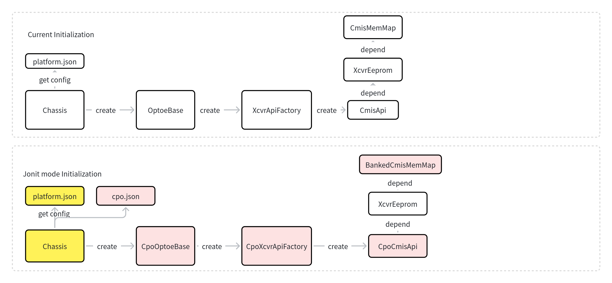

# Bailly CPO support in SONiC

## Table of Contents

- [Bailly CPO support in SONiC](#bailly-cpo-support-in-sonic)
  - [Table of Contents](#table-of-contents)
  - [1. Revision](#1-revision)
  - [2. Scope](#2-scope)
  - [3. Definitions/Abbreviations](#3-definitionsabbreviations)
  - [4. Overview](#4-overview)
  - [5. Requirements](#5-requirements)
  - [6. High-Level Design](#6-high-level-design)
    - [6.1. Problem Statement](#61-problem-statement)
    - [6.2. New Approach](#62-new-approach)
      - [6.2.1. platform.json](#621-platformjson)
      - [6.2.2. cpo.json](#622-cpojson)
      - [6.2.3. SfpOptoeBase](#623-sfpoptoebase)
      - [6.2.4. ChassisBase](#624-chassisbase)
      - [6.2.5. CmisMemMap](#625-cmismemmap)
      - [6.2.6. CmisApi](#626-cmisapi)
      - [6.2.7. XcvrApiFactory](#627-xcvrapifactory)
      - [6.2.8. CmisManagerTask](#628-cmismanagertask)
      - [6.2.9. SfpStateUpdateTask](#629-sfpstateupdatetask)
      - [6.2.10. DomInfoUpdateTask](#6210-dominfoupdatetask)
      - [6.2.11. Show interfaces transceiver CLI](#6211-show-interfaces-transceiver-cli)
      - [6.2.12. optoe driver](#6212-optoe-driver)
    - [6.3. Implementation Flow](#63-implementation-flow)
      - [6.3.1. Chassis Init Flow](#631-chassis-init-flow)
      - [6.3.2. Module Presence Flow](#632-module-presence-flow)
      - [6.3.3.  API Call Flow](#633--api-call-flow)
      - [6.3.4.  CmisManagerTask State Machine](#634--cmismanagertask-state-machine)
    - [6.4. Unit Test cases](#64-unit-test-cases)
    - [6.5. Open/Action items - if any](#65-openaction-items---if-any)

## 1. Revision

| Rev |      Date      | Author | Change Description |
| :-: | :------------: | :----: | ------------------ |
| 1.0 | April 14 2025 | Kroos | Initial version    |
|    |                |        |                    |

## 2. Scope

This document is based on the Micas CPO overall design document:[CPO support in SONiC by KroosMicas · Pull Request #2152 · sonic-net/SONiC](https://github.com/sonic-net/SONiC/pull/2152/)， and details how Broadcom Bailly CPO is adapted based on the overall design.

## 3. Definitions/Abbreviations

| Term  | Definition                                 |
| ----- | ------------------------------------------ |
| OE    | Optical Engine                             |
| CPO   | Co-packaged optics                         |
| CMIS  | Common Management Interface Specification  |
| ELSFP | External Laser Small Form Factor Pluggable |
| ELS   | External Laser Sources                     |
| optoe | Optical Transceiver Open EEPROM driver     |
| VDM   | Versatile Diagnostics Monitoring           |
| I2C   | Inter-Integrated Circuit                   |
| SPI   | Serial Peripheral Interface                |
| ASIC  | Application-Specific Integrated Circuit    |

## 4. Overview

This low-level design document describes the support for Broadcom Bailly Co-packaged Optics (CPO) in SONiC.

Broadcom Bailly CPO is implemented in the form of vmodule, which means platform management is consistent with that of regular optical modules, and no special revisions for CPO are required. On the basis of implementing the basic functions of CPO ports through vmodule, this document supplements the method for obtaining additional debugging information of CPO (i.e., the external exposure of Bailly's custom debug register interface).

## 5. Requirements

The overall design document is adopted as-is. This document mainly illustrates how Broadcom Bailly CPO implements the following functions:

1. Mapping between ports and OE/ELS
2. Mapping of Broadcom Bailly CPO CMIS memory map
3. How Broadcom Bailly CPO reuses the xcvrd module management framework

## 6. High-Level Design

### 6.1. Problem Statement

The overall design document is adopted as-is. Adaptation for Broadcom Bailly CPO is required.

### 6.2. New Approach

Main revised components are as follows:

Compared with the overall design, many functions of Broadcom Bailly CPO are modified through MCU linkage, so not all components mentioned in the overall design need to be modified. The specific components that need to be modified are explained as follows:

| Original Module    | Revised/New Module | Type     | Description                                                                                                                                                                                                                                                                       |
| :----------------- | ------------------ | -------- | --------------------------------------------------------------------------------------------------------------------------------------------------------------------------------------------------------------------------------------------------------------------------------- |
| platform.json      | platform.json      | Modified | The mapping relationships between ports and OE/ELS, as well as bank‑based configuration references.<br />Switch Vendors are required to config this file.                                                                                                                       |
| Na                 | cpo.json           | New      | OE/ELS-related configuration information<br />Switch Vendors are required to config this file.                                                                                                                                                                                   |
| SfpOptoeBase       | CpoOptoeBase       | New      | An abstract port management class used by the xcvrd framework for port management.<br />It mainly provides EEPROM access interfaces for OE and ELS.<br />Switch vendors are required to instantiate this class and use it with revisions to the platform.json configuration file. |
| ChassisBase        | Chassis            | Modified | An original vendor-implemented class used during initialization to determine<br />whether a port uses the CpoOptoeBase type or the original OptoeBase type.<br />Switch vendors are required to instantiate this class.                                                           |
| CmisMemMap         | BankedCmisMemMap   | New      | Broadcom Bailly CPO adopts the joint mode, and ELS-related information is obtained through BankedCmisMemMap                                                                                                                                                                       |
| CmisApi            | CpoCmisApi         | New      | Some APIs are unavailable; additional APIs are added based on BaillyCmisMemMap                                                                                                                                                                                                    |
| XcvrApiFactory     | CpoXcvrApiFactory  | New      | Add initialization of CmisApi and CmisMemMap for Joint Mode.                                                                                                                                                                                                                      |
| optoe driver       | optoe driver       | Modified | Adds multi-bank memory map support.                                                                                                                                                                                                                                               |
| SfpStateUpdateTask | SfpStateUpdateTask | Modified | As specified in the overall design, some information cannot be obtained from Broadcom Bailly CPO                                                                                                                                                                                  |
| DomInfoUpdateTask  | DomInfoUpdateTask  | Modified | As specified in the overall design, some information cannot be obtained from Broadcom Bailly CPO                                                                                                                                                                                  |

#### 6.2.1. platform.json

Consistent with the HLD design, but Broadcom Bailly CPO does not require configuration of fields such as "els_bank_id".

Ports are abstracted by bank, and each port supports 8 lanes. Other port forms can be implemented through splitting without special handling.

```
{
    "interfaces": {
        "Ethernet1": {
            "index": "0,0,0,0,0,0,0,0",
            "lanes": "41,42,43,44,45,46,47,48",
            "fec_modes": {},
            "breakout_modes": {
                "1x800G": ["Eth1"],
                "2x400G": ["Eth1/1", "Eth1/2"],
                "2x200G": ["Eth1/1", "Eth1/2"],
                "2x100G": ["Eth1/1", "Eth1/2"]
            },
            "oe_id":0,         // start at 0 (global OE ID)
            "oe_bank_id":0,    // start at 0 (OE local bank ID)
            "els_id":0,        // start at 0 (global ELS ID)

        },
        ...
        "Ethernet64": {
            "index": "63,63,63,63,63,63,63,63",
            "lanes": "465,466,467,468,469,470,471,472",
            "fec_modes": {},
            "breakout_modes": {
                "1x800G": ["Eth64"],
                "2x400G": ["Eth64/1", "Eth64/2"],
                "2x200G": ["Eth64/1", "Eth64/2"],
                "2x100G": ["Eth64/1", "Eth64/2"]
            },
            "oe_id":7,
            "oe_bank_id":7,
            "els_id":15,
        }
    }
}
```

#### 6.2.2. cpo.json

Consistent with the overall design, but Broadcom Bailly CPO does not require configuration of fields such as "els_cmis_path". The field "cpo_eeprom_mode":"joint" is added to support both separate mode and joint mode compatibility.

In addition, the "base_page": "0xb0" field is added to the elss section, which is used to directly access addresses through the combined oe_cmis_path in joint mode. This eliminates the need to repeatedly write Bailly's CmisMemMap even if one OE corresponds to multiple ELSs.

```
   "cpo_eeprom_mode":"joint" 
   "oes":{
        "oe0": {  // start with OE 0
            "index": 0,
            "oe_cmis_path": "/sys/bus/i2c/devices/i2c-24/24-0050/",
        },
         ...
        "oe7": {
            "index": 7,
            "oe_cmis_path": "/sys/bus/i2c/devices/i2c-31/31-0050/",
    },
    "elss" :{
        "els0": {  // start with ELS 0
            "index": 0,
            "base_page": "0xb0",
            "els_presence": {
                "presence_file": "/dev/fpga1",
                "presence_offset": "0x64",
                "presence_bit": "8",
                "presence_value": "0"
            }
        },
        ...
        "els15": {
            "index": 15,
            "base_page": "0xb4",
            "els_presence": {
                "presence_file": "/dev/fpga1",
                "presence_offset": "0x64",
                "presence_bit": "31",
                "presence_value": "0"
            }
        }
    },
```

#### 6.2.3. SfpOptoeBase

Consistent with the overall design, but when Broadcom Bailly CPO initializes _xcvr_api_factory, the "cpo_eeprom_mode" field is added to the input parameters to support both separate mode and joint mode compatibility.

In addition, self._vendor_specific_eeprom is defined to handle access to vendor-specific custom field information. For example, querying and setting vendor-specific registers such as pages 0xb0-0xb3 of Bailly CPO. This document describes how to query and set vendor-specific fields using the example of overloading the method for obtaining ELS information.

The platform common code is as follows. It defines ELS-related interface functions, prioritizing the use of vendor-specific EEPROM. If the vendor-specific EEPROM is empty, the implementation method of CpoCmisApi is called.

```
class CpoOptoeBase(SfpOptoeBase):
    def __init__(self):
        SfpOptoeBase.__init__(self)
        self._oe_bank_id = -1
        self._oe_id = -1
        self._els_id = -1
        self._els_bank_id = -1
        """
        When a vendor instantiates the CpoOptoeBase class, if there are custom registers beyond the CmisMemMap,
        these custom register mappings must be initialized into the eeprom member variable. For example:
        self._vendor_sepcific_eeprom = XcvrEeprom(self.read_eeprom, self.write_eeprom, 
            BaillyCmisMemMap(CmisCodes, self._oe_bank)
        """ 
        self._vendor_specific_eeprom = None
        self._xcvr_api_factory = CpoXcvrApiFactory(self.read_oe_eeprom, self.write_oe_eeprom,
            self.read_els_eeprom, self.write_els_eeprom, self._oe_bank_id, self._els_bank_id, "separate")

    def get_elsfp_cmis_rev(self):
        '''
        This function returns the CMIS version the module complies to
        '''
        # Give priority to reading from the vendor's dedicated EEPROM
        if self._vendor_specific_eeprom:
            try:
                major = self._vendor_specific_eeprom.read(consts.ELSFP_CMIS_MAJOR_REVISION)
                minor = self._vendor_specific_eeprom.read(consts.ELSFP_CMIS_MINOR_REVISION)
                if major is not None and minor is not None:
                    return f"{major}.{minor}"
            except (AttributeError, TypeError, IOError):
                pass
        # If no custom EEPROM from vendor, use generic API to retrieve data.
        api = self.get_xcvr_api()
        if api:
            try:
                return api.get_elsfp_cmis_rev()
            except Exception:
                return None
  
        return None
  
    def get_elsfp_vendor_rev(self):
        '''
        This function returns the revision level for part number provided by vendor
        '''
        # Give priority to reading from the vendor's dedicated EEPROM
        if self._vendor_specific_eeprom:
            try:
                return self._strip_str(self._vendor_specific_eeprom.read(consts.ELSFP_VENDOR_REV_FIELD))
            except (AttributeError, TypeError, IOError):
                pass
        # If no custom EEPROM from vendor, use generic API to retrieve data.
        api = self.get_xcvr_api()
        if api:
            try:
                return api.get_elsfp_vendor_rev()
            except Exception:
                return None
  
        return None
  
    def get_elsfp_transceiver_info(self):
  
        # Give priority to reading from the vendor's dedicated EEPROM
        if self._vendor_specific_eeprom:
            admin_info = self._vendor_specific_eeprom.read(consts.ELSFP_ADMIN_INFO_FIELD)
            if admin_info is None:
                return None

            ext_id = admin_info[consts.ELSFP_EXT_ID_FIELD]
            power_class = ext_id[consts.ELSFP_POWER_CLASS_FIELD]
            max_power = ext_id[consts.ELSFP_MAX_POWER_FIELD]
            xcvr_info = copy.deepcopy(self._get_xcvr_info_default_dict())
            xcvr_info.update({
                "type": admin_info[consts.ELSFP_ID_FIELD],
                "type_abbrv_name": admin_info[consts.ELSFP_ID_ABBRV_FIELD],
                "serial": self._strip_str(admin_info[consts.ELSFP_VENDOR_SERIAL_NO_FIELD]),
                "manufacturer": self._strip_str(admin_info[consts.ELSFP_VENDOR_NAME_FIELD]),
                "model": self._strip_str(admin_info[consts.ELSFP_VENDOR_PART_NO_FIELD]),
                "connector": admin_info[consts.ELSFP_CONNECTOR_FIELD],
                "ext_identifier": "%s (%sW Max)" % (power_class, max_power),
                "cable_length": float(admin_info[consts.ELSFP_LENGTH_ASSEMBLY_FIELD]),
                "vendor_date": self._strip_str(admin_info[consts.ELSFP_VENDOR_DATE_FIELD]),
                "vendor_oui": admin_info[consts.ELSFP_VENDOR_OUI_FIELD],
                "vendor_rev": self._strip_str(self.get_elsfp_vendor_rev()),
                "cmis_rev": self.get_elsfp_cmis_rev(),
            })
            apsel_dict = self.get_active_apsel_hostlane()
            for lane in range(1, self.NUM_CHANNELS + 1):
                xcvr_info["%s%d" % ("active_apsel_hostlane", lane)] = \
                apsel_dict["%s%d" % (consts.ACTIVE_APSEL_HOSTLANE, lane)]
            if None in xcvr_info.values():
                return None
            else:
                return xcvr_info
        # If no custom EEPROM from vendor, use generic API to retrieve data.
        api = self.get_xcvr_api()
        if api:
            try:
                return api.get_elsfp_vendor_rev()
            except Exception:
                return None
  
        return None

```

Vendors need to inherit this class and instantiate it. Key points include instantiating the vendor-specific EEPROM:

`        self._vendor_sepcific_eeprom = XcvrEeprom(self.read_eeprom, self.write_eeprom, BaillyCmisMemMap(CmisCodes, self._oe_bank, chassis.get_elsfp_base_page_by_id(els_id)))`

And instantiating the platform common ApiFactory:

`         self._xcvr_api_factory = CpoXcvrApiFactory(self.read_eeprom, self.write_eeprom, None, None, self._oe_bank_id, self._els_bank_id, cpo_eeprom_mode)`

#### 6.2.4. ChassisBase

Consistent with the overall design, Broadcom Bailly CPO adds the function interface: get_cpo_eeprom_mode, which is used to obtain the device EEPROM mode to support both separate mode and joint mode compatibility.

#### 6.2.5. CmisMemMap

The design idea is consistent with the overall design. Specific mapping: general registers adopt the CMIS5.2 standard, with added multi-bank processing; all other parts fully inherit the community CmisMap, as shown in BankedCmisMemMap below.

Broadcom Bailly CPO adds mappings for vendor-specific custom registers, such as pages 0xb0-0xb3, as shown in BaillyCmisMemMap below. This code is located in the switch vendor directory and is not part of the platform code.

Platform common map:

```
# sonic_platform_base/sonic_xcvr/mem_maps/public/cpo_cmis.py
class BankedCmisMemMap(CmisMemMap):   
    def __init__(self, codes, bank):
        super().__init__(codes)
        self._bank = bank

    def getaddr(self, page, offset, page_size=128):
        if 0 <= page <= 0xf:
            bank_id = 0
        else:
            bank_id = self._bank
        return (bank_id * PAGES_PER_BANK + page) * page_size + offset
```

Switch vendor-specific map: Only need to implement vendor-specific content beyond CmisMemMap, such as Bailly's pages 0xb0-0xb3. This content is implemented by the vendor in their own PD (Platform Driver) section and is not part of the platform code.

```
PAGES_PER_BANK  = 240
class BaillyCmisMemMap(XcvrMemMap):   # new
    def __init__(self, codes, bank, base_page=0):
        super().__init__(codes)
        self._bank = bank
        self._base_page = base_page
        self.ELSFP_XCVR_IDENTIFIERS = CodeRegField(consts.ELSFP_ID_FIELD, self.getaddr(0x0, 0), self.codes.XCVR_IDENTIFIERS),

    def getaddr(self, page, offset, page_size=128):
        page = self._base_page + page
        if 0 <= page <= 0xf:
            bank_id = 0
        else:
            bank_id = self._bank
        return (bank_id * PAGES_PER_BANK + page) * page_size + offset
```

#### 6.2.6. CmisApi

The design idea is consistent with the overall design. The platform uniformly inherits the original CmisApi and implements the overall API entry: CpoCmisApi, as well as the internal member ElsfpCmisApi of CpoCmisApi.

Queries and settings for OE-related information can directly use the original CmisApi.

ELSFP-related functions are divided into two categories: if the interface already exists in the original CmisApi, it can be directly passed through the member variable: self._els_api.

If the interface is not included in the original CmisApi, it needs to be re-implemented in ElsfpCmisApi. Specific examples are shown below:

```
class CmisApi(XcvrApi):   # Existing

class ElsfpCmisApi(CmisApi): 
    def __init__(self, xcvr_eeprom, cdb_fw_hdlr=None):
        super(ElsfpCmisApi, self).__init__(xcvr_eeprom)
    def elsfp_set_output_fiber_checked_flag(self):
        return NotImplementedError
    def elsfp_tx_enable(self):
        return NotImplementedError
    def elsfp_is_tx_enabled(self):
        return NotImplementedError
    def elsfp_is_tx_on(self):
        return NotImplementedError
    def elsfp_get_opt_power_monitor(self):
        return NotImplementedError
    def elsfp_get_min_optical_power(self):
        return NotImplementedError
    def elsfp_get_max_optical_power(self):
        return NotImplementedError
    ...

class CpoCmisApi(CmisApi):   # new
    def __init__(self, oe_xcvr_eeprom, els_xcvr_eeprom, cdb_fw_hdlr=None):
        super(CpoCmisApi, self).__init__(oe_xcvr_eeprom)
        self._els_api = ElsfpCmisApi(els_xcvr_eeprom, cdb_fw_hdlr) if els_xcvr_eeprom else None
  
    # The CmisApi already has functions, while the elsfp needs to modify the interface name
    def get_elsfp_manufacturer(self):
        return self._els_api.get_manufacturer() if self._els_api else None
    def get_elsfp_serial(self):
        return self._els_api.get_serial() if self._els_api else None
    def get_elsfp_transceiver_info(self):
        return self._els_api.get_transceiver_info() if self._els_api else None

    # New functions of elsfp
    def elsfp_set_output_fiber_checked_flag(self):
        return self._els_api.elsfp_set_output_fiber_checked_flag() if self._els_api else None
    def elsfp_tx_enable(self):
        return self._els_api.elsfp_tx_enable() if self._els_api else None
    def elsfp_is_tx_enabled(self):
        return self._els_api.elsfp_is_tx_enabled() if self._els_api else None
    def elsfp_is_tx_on(self):
        return self._els_api.elsfp_is_tx_on() if self._els_api else None
    def elsfp_get_opt_power_monitor(self):
        return self._els_api.elsfp_get_opt_power_monitor() if self._els_api else None
    def elsfp_get_min_optical_power(self):
        return self._els_api.elsfp_get_min_optical_power() if self._els_api else None
    def elsfp_get_max_optical_power(self):
        return self._els_api.elsfp_get_max_optical_power() if self._els_api else None
    ...
```

#### 6.2.7. XcvrApiFactory

The design idea is consistent with the overall design. Judgment is made through cpo_eeprom_mode, and a joint mode initialization branch is added to support both separate mode and joint mode compatibility.

```
BankedCmisMemMapclass CpoXcvrApiFactory(XcvrApiFactory):
    def __init__(self, oe_reader, oe_writer, els_reader, els_writer, oe_bank=0, els_bank=0, cpo_eeprom_mode="joint"):
        self._oe_reader = oe_reader
        self._oe_writer = oe_writer
        self._oe_bank = oe_bank
        self._els_reader = els_reader
        self._els_writer = els_writer
        self._els_bank = els_bank
        self._cpo_eeprom_mode = cpo_eeprom_mode

    def _create_cpo_cmis_api(self):  # new
        els_xcvr_eeprom = None
        oe_xcvr_eeprom = XcvrEeprom(self._oe_reader, self._oe_writer, BankedCmisMemMap(CmisCodes, self._oe_bank)) # BankedCmisMemMap == jointCmisMemMap/OeCmisMemMap
        if self._cpo_eeprom_mode == "separate":
            els_xcvr_eeprom = XcvrEeprom(self._els_reader, self._els_writer, ElsfpCmisMemMap(CmisCodes, self._els_bank))
        api = CpoCmisApi(oe_xcvr_eeprom, els_xcvr_eeprom)
        return api
    def create_xcvr_api(self):
        return self._create_cpo_cmis_api()
```

#### 6.2.8. CmisManagerTask

The CMIS state machine of Broadcom Bailly CPO is consistent with that of regular optical modules, and no revision to the management process is required. ELS-related logic is modified through MCU linkage.

#### 6.2.9. SfpStateUpdateTask

The design idea is consistent with the overall design. The information that can be obtained from Broadcom Bailly CPO is as follows:

```
Transceiver info Table
; Defines Transceiver information for a port
key                              = TRANSCEIVER_INFO|ifname          ; information for module on port
; field                          = value
els_type                         INTEGER                            ; the XCVR_IDENTIFIERS
els_hardware_rev                 1*255VCHAR                         ; the module hardware revision
els_serial                       1*255VCHAR                         ; the module serial number
els_manufacturer                 1*255VCHAR                         ; the manufacturer of the module
els_model                        1*255VCHAR                         ; the part number of the module
els_connector                    INTEGER                            ; the xcvr CONNECTORS
els_ext_identifier               1*255VCHAR                         ; the power_class and max_power of the module
els_cable_length                 1*255VCHAR                         ; the cable assembly link length
els_vendor_date                  1*255VCHAR                         ; the vendor date of the module
els_vendor_oui                   1*255VCHAR                         ; the vendor oui of the module
els_media_interface_technology   INTEGER                            ; the media lane technology
els_vendor_rev                   1*255VCHAR                         ; the revision level for part number provided by vendor
els_cmis_rev                     1*255VCHAR                         ; the CMIS version the module complies to
```

DOM threshold infomation:

```
TRANSCEIVER_DOM_THRESHOLD info Table
key                              = TRANSCEIVER_DOM_THRESHOLD|ifname ; information for module on port
; field                          = value
els_temphighalarm                FLOAT                              ; Thresholds for internally measured temperature monitor
els_templowalarm                 FLOAT                              ; Thresholds for internally measured temperature monitor
els_temphighwarning              FLOAT                              ; Thresholds for internally measured temperature monitor
els_templowwarning               FLOAT                              ; Thresholds for internally measured temperature monitor
els_vcchighalarm                 FLOAT                              ; Thresholds for internally measured 3.3 volt input supply voltage
els_vcclowalarm                  FLOAT                              ; Thresholds for internally measured 3.3 volt input supply voltage
els_vcchighwarning               FLOAT                              ; Thresholds for internally measured 3.3 volt input supply voltage
els_vcclowwarning                FLOAT                              ; Thresholds for internally measured 3.3 volt input supply voltage
els_txpowerhighalarm             FLOAT                              ; TX Power High Alarm 
els_txpowerlowalarm              FLOAT                              ; TX Power Low Alarm 
els_txpowerhighwarning           FLOAT                              ; TX Power High Warning
els_txpowerlowwarning            FLOAT                              ; TX Power Low Warning
els_txbiashighalarm              FLOAT                              ; Tx Bias High Alarm 
els_txbiaslowalarm               FLOAT                              ; Tx Bias Low Alarm 
els_txbiashighwarning            FLOAT                              ; Tx Bias High Warning
els_txbiaslowwarning             FLOAT                              ; Tx Bias Low Warning
```

VDM-related information of Broadcom Bailly CPO cannot be obtained.

#### 6.2.10. DomInfoUpdateTask

The design idea is consistent with the overall design. The information that can be obtained from Broadcom Bailly CPO is as follows:

```
TRANSCEIVER_DOM_SENSOR
key                              = TRANSCEIVER_DOM_SENSOR|ifname    ; information for module on port
; field                          = value
els_temperature                  FLOAT                              ; module temperature in Celsius
els_voltage                      FLOAT                              ; supply voltage in mV
```

```
TRANSCEIVER_STATUS
key                              = TRANSCEIVER_STATUS|ifname          ; information for module on port
; field                          = value
els_module_state                 INTEGER                              ; module state
els_module_fault_cause           INTEGER                              ; module fault cause
```

The following fields are implemented differently; Broadcom Bailly CPO has corresponding registers. The method of obtaining through VDM specified in the overall design is not supported:

```
key                              = TRANSCEIVER_VDM_XXX_FLAG|ifname         ; information for module on port
; field                          = value
vcc1p8_voltage                   BOOLEAN                                   ; Thresholds for internally measured 1.8 volt input supply voltage
vcc1p2_voltage                   BOOLEAN                                   ; Thresholds for internally measured 1.2 volt input supply voltage
vcc0p7a_voltage                  BOOLEAN                                   ; Thresholds for internally measured 0.75 volt input supply voltage
```

#### 6.2.11. Show interfaces transceiver

The design idea is consistent with the overall design. For details of the information that can be obtained through the Broadcom Bailly CPO CLI, refer to SfpStateUpdateTask and DomInfoUpdateTask above. This section is only a display example and does not mean that all corresponding data can be obtained.

#### 6.2.12. optoe driver

Consistent with the overall design, the following multi-bank solution is still used:

> https://github.com/sonic-net/sonic-linux-kernel/pull/473

### 6.3. Implementation Flow

#### 6.3.1. Chassis Init Flow

Consistent with the overall design. Bailly CPO initializes CpoCmisApi and BankedCmisMemMap in joint mode.



#### 6.3.2. Module Presence Flow

Consistent with the overall design. For details, refer to the overall design document.

#### 6.3.3.  API Call Flow

Consistent with the original community framework, only the class names are changed.

#### 6.3.4.  CmisManagerTask State Machine

No revision is required.

### 6.4. Unit Test cases

1. Function tests for each function of the newly added `CpoOptoeBase` class
2. Function tests for each function of the newly added `CpoCmisApi` class
3. Function tests corresponding to the newly added `BankedCmisMemMap` class
4. Testing of newly added logic for ` DomInfoUpdateTask`, `SfpStateUpdateTask`, etc.

### 6.5. Open/Action items - if any

1. This design has provided a basic OE/ELS access framework; OE/ELS firmware upgrade will be reflected in subsequent HLD documents.
