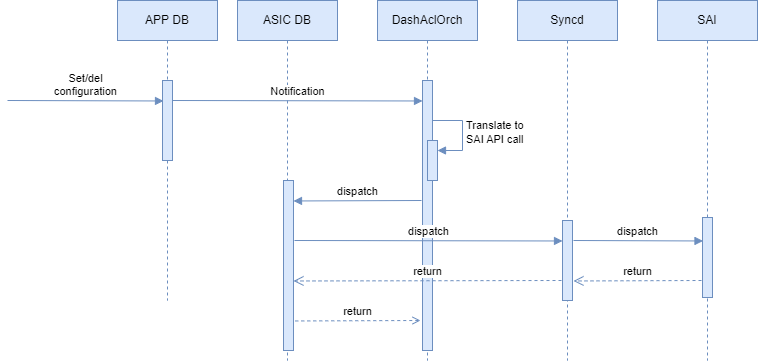

# DASH ACL Tags #

# Table of Content

- [DASH ACL Tags](#dash-acl-tags)
- [Table of Content](#table-of-content)
- [Revision](#revision)
- [Scope](#scope)
- [Definitions/Abbreviations](#definitionsabbreviations)
- [Overview](#overview)
- [Requirements](#requirements)
  - [Functional requirements for stage 1](#functional-requirements-for-stage-1)
  - [CLI requirements](#cli-requirements)
  - [Warm/fast boot requirements](#warmfast-boot-requirements)
  - [Scaling requirements](#scaling-requirements)
- [Architecture Design](#architecture-design)
- [High-Level Design](#high-level-design)
  - [APP DB Schema](#app-db-schema)
    - [DASH\_PREFIX\_TAG\_TABLE](#dash_prefix_tag_table)
    - [DASH\_ACL\_RULE\_TABLE](#dash_acl_rule_table)
  - [SWSS](#swss)
  - [DashAclOrch](#dashaclorch)
    - [Requirements](#requirements-1)
    - [Configuration flow](#configuration-flow)
    - [Detailed flow](#detailed-flow)
    - [Runtime](#runtime)
    - [Tags handling](#tags-handling)
    - [ACL rules handling](#acl-rules-handling)
- [SAI API](#sai-api)
- [Configuration and management](#configuration-and-management)
  - [CLI/YANG model Enhancements](#cliyang-model-enhancements)
  - [Config DB Enhancements](#config-db-enhancements)
- [Warmboot and Fastboot Design Impact](#warmboot-and-fastboot-design-impact)
- [Restrictions/Limitations](#restrictionslimitations)
- [Testing Requirements/Design](#testing-requirementsdesign)
  - [Unit Test cases](#unit-test-cases)
  - [System Test cases](#system-test-cases)
- [Open/Action items - if any](#openaction-items---if-any)


# Revision

|  Rev  | Date  |       Author       | Change Description                             |
| :---: | :---: | :----------------: | ---------------------------------------------- |
|  0.1  |       | Oleksandr Ivantsiv | Initial version. ACL tags stage 1 (SONiC only) |

# Scope

# Definitions/Abbreviations

| **Term** | **Meaning**                        |
| -------- | ---------------------------------- |
| DASH     | Disaggregated APIs for SONiC Hosts |
| SAI      | Switch Abstraction Interface       |
| LPM      | Longest Prefix Match               |
| ACL      | Access Control List                |

# Overview

In a DASH SONiC, a service tag represents a group of IP address prefixes from a given service. The controller manages the address prefixes encompassed by the service tag and automatically updates the service tag as addresses change, minimizing the complexity of frequent updates to network security rules. Mapping a prefix to a tag can reduce the repetition of prefixes across different ACL rules and optimize memory usage

The implementation of the ACL tags feature shall be split into two stages:
1. Stage 1. Software-only implementation. SWSS shall support ACL tags configuration. The ACL tags shall be expanded to the list of prefixes for ACL rules creation.
2. Stage 2. Full ACL tags support. SWSS shall support ACL tags creation over SAI API. ACL tags shall be used for ACL rules creation.

# Requirements

## Functional requirements for stage 1

- The orchagent shall support ACL tags configuration.
- A prefix can belong to multiple tags
- Prefixes can be added or removed from a tag at any time
- The orchagent shall expand ACL tags to a list of prefixes for ACL rule creation.

## CLI requirements
No new CLI commands are required.

## Warm/fast boot requirements
Warm and fast reboots are not supported in the DASH SONiC

## Scaling requirements

| Item                    | Expected value |
| ----------------------- | -------------- |
| Total tags              | 4k*            |
| Max prefixes per tag    | 24k            |
| Max tags in an ACL rule | 4k             |

# Architecture Design

No SONiC architecture changes are required. The ACL tags feature is an extension of the existing ACL implementation.

# High-Level Design

Changes shall be made to sonic-swss sub-module to support this feature.

## APP DB Schema

The following are the schema changes.

### DASH_PREFIX_TAG_TABLE
A new `DASH_PREFIX_TAG_TABLE` table will be added to the APP DB schema.
```
DASH_PREFIX_TAG_TABLE:{{tag_name}}
    "ip_version": {{ipv4/ipv6}}
    "prefix_list": {{list of prefix}}
```

```
tag_name                  = STRING; unique tag name
ip_version                = IP version (IPv4/IPv6)
prefix_list               = list of ip prefixes ',' separated. It is valid to have empty list of prefixes.
                            If the prefix is empty, no packets will be assigned to this TAG.
```

### DASH_ACL_RULE_TABLE
The existing `DASH_ACL_RULE_TABLE` will be extended with a new `src_tag` and `dst_tag` optional attributes.
```
DASH_ACL_RULE_TABLE:{{group_id}}:{{rule_num}}
    "priority": {{priority}}
    "action": {{action}}
    "terminating": {{bool}}
    "protocol": {{list of protocols}} (OPTIONAL)
    "src_tag": {{list of tag name}} (OPTIONAL)
    "dst_tag": {{list of tag name}} (OPTIONAL)
    "src_addr": {{list of prefix}} (OPTIONAL)
    "dst_addr": {{list of prefix}} (OPTIONAL)
    "src_port": {{list of range of ports}} (OPTIONAL)
    "dst_port": {{list of range of ports}} (OPTIONAL)
```
```
key                      = DASH_ACL_RULE_TABLE:group_id:rule_num ; unique rule num within the group.
; field                  = value
priority                 = INT32 value  ; priority of the rule, lower the value, higher the priority
action                   = allow/deny
terminating              = true/false   ; if true, stop processing further rules
protocols                = list of INT ',' separated; E.g. 6-tcp, 17-udp; if not provided, match on all protocols
src_tag                  = list of source tag name ',' separated; if not provided, match on ANY tag or NO tag.
dst_tag                  = list of destination tag name ',' separated; if not provided, match on ANY tag or NO tag.
src_addr                 = list of source ip prefixes ',' separated; if not provided, match on all source IPs.
dst_addr                 = list of destination ip prefixes ',' separated; if not provided, match on all destination IPs.
src_port                 = list of range of source ports ',' separated;  if not provided, match on all source ports.
dst_port                 = list of range of destination ports ',' separated;  if not provided, match on all destination ports.
```

## SWSS

The following components of orchagent shall be modified.

## DashAclOrch

### Requirements

- Provide support for adding new ACL tags with the list of prefixes in the DASH_PREFIX_TAG_TABLE APP DB table.
- Provide support for updating list of prefixes for ACL tags. 
- Provide support for removing ACL tags. ACL tag can be removed only if it is not attached to any ACL rules.
- Provide support for multiple source and destination ACL tags for ACL rules in DASH_ACL_RULE_TABLE.
- Provide support for support for TAGs and list prefixes configuration for ACL rules in DASH_ACL_RULE_TABLE.

### Configuration flow



### Detailed flow

DashAclOrch is responsible for DASH ACL support and should be extended to support ACL tags. DashAclOrch subscribes to DASH_PREFIX_TAG_TABLE and DASH_ACL_RULE_TABLE updates from APP_DB, processes the configuration updates, and transforms them into SAI API calls.

### Runtime

When an update for the DASH_PREFIX_TAG_TABLE or DASH_ACL_RULE_TABLE table is received DashAclOrch will understand the operation type. The supported operation types are create, update, and remove.

### Tags handling


**Add new ACL tag**

If the operation is to create a new ACL tag in DASH_PREFIX_TAG_TABLE DashAclOrch will do the following
- Validate the tag configuration
- Store the tag configuration

**Remove ACL tag**

If the operation is to remove the ACL tag from DASH_PREFIX_TAG_TABLE DashAclOrch will do the following
- If the tag is attached to the rules
    - Return status "retry" to postpone tag removal
- Remove the tag

**Update ACL tag**

If the operation is to update the list of prefixes in the ACL tag in DASH_PREFIX_TAG_TABLE DashAclOrch will do the following
  - Based on the list of ACL rules that uses the tag get list of affected ACL groups
  - For each affected ACL group
  - If group is bound to the ENI
    - Create new ACL group
    - For each ACL rule from the original ACL group
      - Copy original ACL rule attributes
      - Update attributes if required
      - Create new ACL rule and attach it to the new ACL group
    - Bind new ACL group to the ENI
    - Remove all old ACL rules
    - Remove old ACL group
  - Else (if ACL group is not bound)
    - For each ACL rule that uses the tag
      - Update ACL rules

### ACL rules handling


**ACL rule creation flow**

If the operation is to create a new ACL rule in DASH_ACL_RULE_TABLE DashAclOrch will do the following
- If tags are specified in the configuration
    - For each configured tag
        - Check if the tags exists in `DASH_PREFIX_TAG_TABLE`. If the tag doesn't exist return status "retry" to postpone rule creation.
    - If all tags are available
      - Expand all tags to a list of prefixes
      - Create ACL rule

**Remove ACL rule**

If the operation is to remove the existing ACL rule from DASH_ACL_RULE_TABLE DashAclOrch will do the following
- Remove rule

**Update ACL rule**

If the operation is to update the existing ACL rule in DASH_ACL_RULE_TABLE DashAclOrch will do the following
- if the ACL group to which the ACL rule belongs is bound to the ENI
  - Create a new ACL group
  - For each ACL rule from the original ACL group
    - Copy original ACL rule attributes
    - Update attributes if required
    - Create a new ACL rule and attach it to the new ACL group
- Else
  - For each changed attribute
    - Update attribute configuration

# SAI API

Stage 1 implementation does not require SAI API.

# Configuration and management

## CLI/YANG model Enhancements

No CLI/YANG enhancements required.

## Config DB Enhancements

No Config DB Enhancements required

# Warmboot and Fastboot Design Impact
DPU SONiC doesn't support warm/fast boot

# Restrictions/Limitations

# Testing Requirements/Design

## Unit Test cases

The existing sonic-swss/tests/test_dash_acl.py unit tests shall be extended with the following test cases
| Test case synopsis                                       | Expected results                                        |
| -------------------------------------------------------- | ------------------------------------------------------- |
| Create ACL rule with a single source and single destination tags | Verify that ACL rule with correct attributes is created |
| Create ACL rule with multiple source and multiple destination tags | Verify that ACL rule with correct attributes is created |
| Create ACL rule with multiple source and multiple destination tags and list of source and destination prefixes | Verify that ACL rule with correct attributes is created |
| Update ACL tag used by ACL rule from ACL group not bound to ENI | Verify that ACL rule with is updated with correct attributes |
|Update ACL tag used by ACL rule from ACL group bound to the ENI | Verify the following <br />- new ACL group is created <br /> - all ACL rules are copied to the new group <br /> - appropriate rule is updated <br /> - new ACL group is bound to the ENI <br /> - old ACL rules are removed <br /> - old ACL group is removed |
|Create tag with missing mandatory fields|Verify that error message is sent to syslog|
|Create tag with incorrect data | Verify that error message is sent to syslog|
|Create ACL rule with not existing tag |Verify that rule is not created|
|Create ACL rule with not existing tag than create a tag |Verify that rule is created after the tag is added|

## System Test cases
The test plan will be prepared and presented in a separate document.

# Open/Action items - if any
- DASH_PREFIX_TABLE scope. It the table global or should it be per ENI?