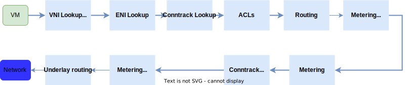
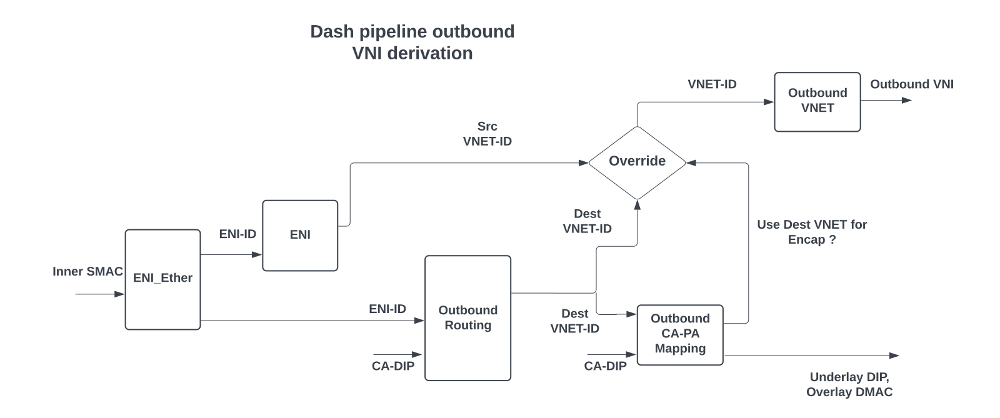
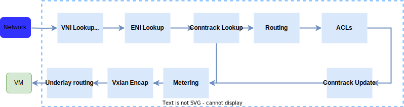
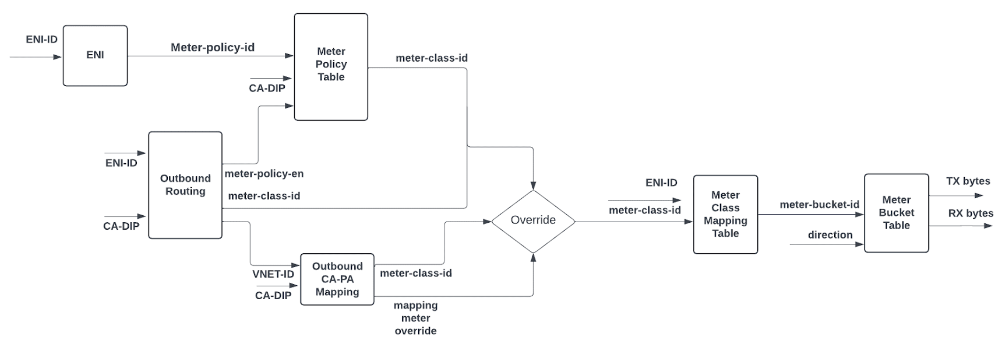
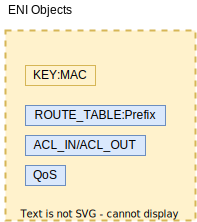
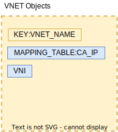

# SONiC-DASH HLD
## High Level Design Document
### Rev 2.0

# Table of Contents

  * [Revision](#revision)

  * [About this Manual](#about-this-manual)

  * [Definitions/Abbreviation](#definitionsabbreviation)
 
  * [1 Requirements Overview](#1-requirements-overview)
    * [1.1 Functional requirements](#11-functional-requirements)
    * [1.2 CLI requirements](#12-cli-requirements)
    * [1.3 Warm Restart requirements ](#13-warm-restart-requirements)
    * [1.4 Scaling requirements ](#14-scaling-requirements)
    * [1.5 Metering requirements ](#15-metering-requirements)
    * [1.6 Design considerations ](#16-design-considerations)
    * [1.7 ACL requirements ](#17-acl-requirements)
  * [2 Packet Flows](#2-packet-flows)
  * [3 Modules Design](#3-modules-design)
    * [3.1 Config DB](#31-config-db)
    * [3.2 Dash DB](#32-dash-app-db)
    * [3.3 Module Interaction](#33-module-interaction)
    * [3.4 CLI](#34-cli)
    * [3.5 Test Plan](#35-test-plan)
    * [3.6 Example Configuration](#36-example-configuration)

###### Revision

|  Rev  |    Date    |       Author        | Change Description                        |
| :---: | :--------: | :-----------------: | :---------------------------------------- |
|  0.1  | 02/01/2022 |    Prince Sunny     | Initial version                           |
|  0.2  | 03/09/2022 |    Prince Sunny     | Packet Flows/DB Objects                   |
|  0.3  | 05/24/2022 |      Oleksandr      | Memory Footprints                         |
|  0.4  | 06/01/2022 |    Prince Sunny     | Design Considerations                     |
|  0.5  | 06/13/2022 |    Chris Sommers    | Schema Relationships                      |
|  0.6  | 08/05/2022 | Mukesh M Velayudhan | Outbound VNI derivation in pipeline       |
|  0.7  | 08/09/2022 |    Prince Sunny     | Add Inbound Routing rules                 |
|  0.6  | 04/20/2022 |   Marian Pritsak    | APP_DB to SAI mapping                     |
|  0.8  | 09/30/2022 |   Prabhat Aravind   | Update APP_DB table names                 |
|  1.0  | 10/10/2022 |    Prince Sunny     | ST and PL scenarios                       |
|  1.1  | 01/09/2023 |    Prince Sunny     | Underlay Routing and ST/PL clarifications |
|  1.2  | 02/12/2023 |  Vijay Srinivasan   | Metering schema and description           |
|  1.3  | 04/12/2023 |     Ze Gan          | AppDB protobuf design                     |
|  1.4  | 05/03/2023 |    Prince Sunny     | ACL Tagging, ACL Requirements             |
|  1.5  | 05/22/2023 | Oleksandr Ivantsiv  | Update configuration examples             |
|  1.6  | 06/01/2023 |    Prince Sunny     | Added FastPath                            |
|  1.7  | 02/20/2024 |    Prince Sunny     | Introduce Route Group Table               |
|  2.0  | 04/08/2024 |    Prince Sunny     | Schema updates for PL, PL-NSG, metering   |

# About this Manual
This document provides more detailed design of DASH APIs, DASH orchestration agent, Config and APP DB Schemas and other SONiC buildimage changes required to bring up SONiC image on an appliance card. General DASH HLD can be found at [dash_hld](https://github.com/sonic-net/DASH/tree/main/documentation/general/dash-high-level-design.md).

# Definitions/Abbreviation
###### Table 1: Abbreviations
|       |                                                     |
| ----- | --------------------------------------------------- |
| DASH  | Disaggregated APIs for SONiC Hosts                  |
| VNI   | Vxlan Network Identifier                            |
| VTEP  | Vxlan Tunnel End Point                              |
| VNET  | Virtual Network                                     |
| ENI   | Elastic Network Interface                           |
| gNMI  | gRPC Network Management Interface                   |
| vPORT | VM's NIC. Eni, Vnic, VPort are used interchangeably |
| ST    | Service Tunnel                                      |
| PL    | Private Link                                        |

# 1 Requirements Overview

## 1.1 Functional requirements

At a high level the following should be supported:
  
- Bringup SONiC image for DEVICE_METADATA subtype - `Appliance`
- Bringup Swss/Syncd containers for switch_type - `dpu`
- Able to program DASH objects configured via gRPC client to appliance card via SAI DASH API

  Phase 1
    - Vnet-Vnet scenario
    - Route/LPM support
    - Underlay IPv4 and IPv6
    - Stateful ACL support
    - TCP state tracking on flows
    - Telemetry and Monitoring
    - Private Link
    - Private Link NSG

  Phase 2
    - Service Tunnel
    - Overlay IPv6 
  

## 1.2 CLI requirements
Initial support is only for `show` and `clear` commands

- User shall be able to show the DASH configured objects
- User shall be able to clear state of ENI, VNET or all

## 1.3 Warm Restart requirements
Warm-restart support is not considered in Phase 1. TBD

## 1.4 Scaling requirements
Following are the minimal scaling requirements

| Item                          | Expected value                |
| ----------------------------- | ----------------------------- |
| VNETs                         | 1024*                         |
| ENI                           | 32 Per Card                   |
| Outbound Routes per ENI       | 100k                          |
| Inbound Routes per ENI        | 10k**                         |
| NSGs per ENI                  | 10***                         |
| ACL rules per NSG             | 1000                          |
| ACL prefixes per ENI          | 10x100k                       |
| Max prefixes per rule         | 8k                            |
| ACL ports per ENI             | 10x10k SRC/DST ports          |
| Total tags per ENI            | 4k                            |
| Max prefixes per tag          | 24k                           |
| Max tags one prefix belong to | 512                           |
| Max tags in an ACL rule       | 4k                            |
| CA-PA Mappings                | 8M Per Card                   |
| Active Connections/ENI        | 1M (Bidirectional TCP or UDP) |
| Total active connections      | 32M (Bidirectional)           |
| Metering Buckets per ENI      | 4000                          |
| CPS                           | 3M                            |

\* Number of VNET is a software limit as VNET by itself does not take hardware resources. This shall be limited to number of VNI hardware can support

\** Support 10K peering in-region/cross-region

\*** 10 stages per ENI, prefix list can be optimized by tagging or other similar approach and reuse it for multiple ACLs/stages within the card thereby optimizing memory usage

Detailed scaling requirements can be found [here](https://github.com/sonic-net/DASH/blob/main/documentation/general/program-scale-testing-requirements-draft.md)

## 1.5 Metering requirements
Metering is essential for billing the customers and below are the high-level requirements. Metering/Bucket in this context is related to byte counting for billing purposes and not related to traffic policer or shaping. 
- Billing shall be at per ENI level and shall be able to query metering packet bytes per ENI
- All metering buckets must be UINT64 size and start from value 0 and shall be counting number of bytes. A bucket contains 2 counters; 1 inbound (Rx) and 1 outbound (Tx) from an ENI perspective.
- Implementation (a.k.a H/W pipeline implementation) must support metering at the following levels:
	- Policy based metering. - E.g. For specific destinations (prefix) that must be billed separately, say action_type 'direct'
	- Route table based metering - E.g. For Vnet peering cases.
	- Mapping table based metering - E.g For specific destinations within the mapping table that must be billed separately     
- Policy in the metering context refers to metering policy associated to Route tables. This is not related to ACL policy or any ACL packet counters.  
- If packet flow hits multiple metering buckets, order of priority shall be **Policy->Route->Mapping**
- User shall be able to override the precedence between Routing/Policy and Mapping buckets by setting an _override_ flag. When policy is enabled for a route, it takes higher precedence than routing and mapping metering bucket unless _override_ flag is set in which case Mapping takes precedence
- Implementation shall aggregate the counters on an "_ENI+Metering Bucket_" combination for billing:
	- 	All traffic from an ENI to a Peered VNET
	- 	All traffic from an ENI to a Private Link destination
	- 	All traffic from an ENI to an internet destination
	- 	All traffic from an ENI to cross-AZ destination (within the same VNET)
	- 	All traffic from an ENI to cross-region destination (towards the peer VNET)
	- 	All outbound metered traffic from an ENI
	- 	All inbound metered traffic towards an ENI
- Customer is billed based on number of bytes sent/received separately. A distinct counter must be supported for outbound vs inbound traffic of each category.
- Outbound and Inbound bytes are from ENI perspective and not based on where the traffic is initiated. Any traffic from ENI to outbound is treated as TX bytes and towards ENI inbound is RX bytes. 
- For outbound flow and associated metering bucket, created as part of VM initiated traffic, the metering bucket shall account for outbound (Tx) bytes. Based on this outbound flow, pipeline shall also create a unified inbound flow. The same metering bucket shall account for the inbound (Rx) bytes for the return traffic to VM that matches this flow. 
- Application shall utilize the metering hardware resource in an optimized manner by allocating meter id and deallocating when not-in-use
- Application shall bind all associated metering buckets to an ENI. During ENI deletion, all associated metering bucket binding should be auto-removed.
- Inbound metering: It is similar to outbound pipeline. A route rule table can have a metering bucket or a meter policy association for explicitly accounting the inbound traffic for an ENI. If inbound route rule points to a vnet, and mapping has a bucket id, it should be used for metering while creating the unified flow. 

_Open Items_
- Can we avoid explicit dependency between ENI's and mappings? 
- Bucket id integer to be associated to an optional metadata string?

## 1.6 Design Considerations

DASH Sonic implementation is targeted for appliance scenarios and must handles millions of updates. As such, the implementation is performance and scale focussed as compared to traditional switching and routing based solutions. The following are the design considerations.

1. Implementation must support single and bulk update of LPM and CA-PA Mapping tables. 
2. During startup, it is possible to have scaled configurations applied successively. Implementation must support such bulk updates
3. In normal operation, mapping updates can occur as much as 100 mappings/sec
4. In normal operation, route updates can occur every 30 sec. 
5. An add or delete of VM translates to updating ENI and routes in bulk context
6. ACL operations (rules adding/deleting) per group for a stage must be handled atomically and should not have transient drop/forward cases within the group. When a  rule is modified, controller shall send entire rules in the group and Sonic implementation replaces the old set with new set of rules.
7. Implementation must support ability to get all ACL rules/groups based on guid. 
8. In normal operation, mappings churn often followed by routes and least for ACLs.
9. ENIs shall have an admin-state that enables normal connections and forwarding only *after* all configurations for an ENI is applied during initial creation. When the ENI is admin-state down, the packets destined to this ENI shall be dropped. Order of operation/configuration shall be enforced by the controller. Sonic implementation shall honor the state set by controller and ENI shall accept and forward traffic only if the admin-state is set to 'up'. 
10. ENI must support 1M active bi-directional TCP connections or UDP flows however the connection pool can be oversubscribed. An oversubscription of 2:1 would be expected, so the connection pool can be more optimal if executed as one large table where ENI can be a part of the key.
11. During VNET or ENI delete, implementation must support ability to delete all *mappings* or *routes* in a single API call.
12. Add and Delete APIs are idempotent. As an example, deleting an object that doesn't exists shall not return an error. 
13. During a delete operation, if there is a dependency (E.g. mappings still present when a VNET is deleted), implementation shall return *error* and shall not perform any force-deletions or delete dependencies implicitly. 
14. During a bulk operation, if any part/subset of API fails, implementation shall return *error* for the entire API. Sonic implementation shall validate the entire API as pre-checks before applying and return accordingly.
15. Implementation must have flexible memory allocation for ENI and not reserve max scale during initial create (e.g 100k routes). This is to allow oversubscription.
16. Implementation must not have silent failures for APIs. E.g accepting an API from controller, returning success and failing in the backend. This is orthogonal to the idempotency of APIs described above for ADD and Delete operations. Intent is to ensure SDN controller and Sonic implementation is in-sync

## 1.7 ACL requirements

ACL is essential for NSGs and have different stages. In the current model, there are two stages for Azure and VNET level and another three stages for customer. The following are some of the key requirements and considerations:
- ACL binding to ENI must be atomic. 
- User can add/remove rules in a group as long as it is not currently bound to an ENI
- It is not permitted to modify rules within a group that is currently bound to an ENI. For such scenario, a new group shall be created by application with the modified set of rules which could then be bind to ENI. An exception is if tags are expanded to individual prefixes in an ACL rule. In such cases, if tags are modified, application shall update the corresponding rule by adding/removing a prefix. 
- No requirement to modify an existing rule except for the case above. For e.g change action of a rule from permit to deny or vice-versa
- ACL Tagging
	- Mapping a prefix to a tag can reduce the repetition of prefixes across different ACL rules and optimize memory usage
	- Tagging is implemented as list in Orchagent and SAI layers
	- A prefix can belong to multiple tags
	- Prefixes can be added or removed from a tag at any time 
	- SAI implementation shall return a capability for the list size. A '0' return value shall be treated as no-tag support. 
	- An example tag list is as below. 
		-  Tag1 - 10.1.1.0/24, 20.1.1.0/24
		-  Tag2 - 10.1.0.0/8, 20.1.1.0/24, 50.1.1.1/32 
		-  Tag8 - Empty
		-  SAI_SRC_TAG_ENTRY_ATTR_TAG_MAP: 10.1.1.0/24 -> "Tag1, Tag2", 20.1.1.0/24 -> "Tag1, Tag2", 10.1.0.0/8 -> "Tag2". Note that orchagent shall extend the tag map to include all subnet to allow an LPM based lookup. In this case, tags for 10.1.1.0/24 shall also include the tag for 10.1.0.0/8.  
		-  SAI_DASH_ACL_RULE_ATTR_SRC_TAG: This shall be a list of tags to match. 
		-  If a packet arrives with src ip of 10.1.1.1, the corresponding derived src tag list shall be "Tag1, Tag2". It shall be then matched against the ACL_RULE Tag list
		-  If the tag field is empty, ACL rule must match ANY tag or NO tag. 
	- The tag list size depends on the SAI implementation capability. It is fixed during initialization based on the capability value returned by SAI implementation. 
- Deleting ACL group is permitted as long as it is not bind to an ENI. It is not expected for application to delete individual rules prior to deleting a group. Implementation is expected to delete/free all resources when application triggers an ACL group delete.
- ACL rules are not expected to have both tags and prefixes of same type configured in the same rule. For e.g, same rule shall not have both src tag and src prefix configured, but it is possible to have src tag and dst prefix or vice-versa
- Counters can be attached to ACL rules optionally for retrieving the number of connections/flows. It is not required to get the packet/byte counter as in the traditional model. A new SAI counter type shall be required for this.

# 2 Packet Flows
	
The following section captures at a high-level on the VNET packet flow. Detailed lookup and pipeline behavior can be referenced *here*.

## 2.1 Outbound packet processing pipeline
	
  
	
Based on the incoming packet's VNI matched against the reserved VNI assigned for VM->Appliance, the pipeline shall set the direction as TX(Outbound) and using the inner src-mac, maps to the corresponding ENI.The incoming packet will always be VXLAN encapsulated and outer dst-ip is the appliance VIP. The pipeline shall parse the VNI, and for VM traffic, the VNI shall be a special reserved VNI. Everything else shall be treated as as network traffic(RX). Pipeline shall use VNI to differentiate the traffic to be VM (Inbound) or Network (Outbound).

In the outbound flow, the appliance shall assume it is the first appliance to apply policy. It applies the outbound ACLs in three stages (VNIC, Subnet and VNET), processed in order, with the outcome being the most restrictive of the three ACLs combined. 

After the ACL stage, it does LPM routing based on the inner dst-ip and applies the respective action (encap, subsequent CA-PA mapping). Finally, update the connection tracking table for both inbound and outbound.

After the connection tracking update, the packet proceeds to the "underlay routing" stage. Based on the destination IP address (outer dst-ip), the underlay routing block decides how the packet should be forwarded towards its destination.

The figure below shows how the VNI to be encapsulated in the outgoing packet is derived based on the ENI, outbound routing and outbound CA-PA mapping table lookup in the Dash outbound packet processing pipeline.

  
	
## 2.2 Inbound packet processing pipeline
	
   

Based on the incoming packet's VNI, if it does not match against any reserved VNI, the pipeline shall set the direction as RX(Inbound) and using the inner dst-mac, maps to the corresponding ENI. In the inbound flow, Priority based "Routing Rule" lookup happens based on VNI and optionally SRC PA prefix and maps to a VNET. In other words, the VNET is derived from a VNI key or a combination of VNI key and SRC PA based on the routing rule entry. It is possible that in some cases, two VNETs in different region can have the same VNI key and hence Inbound routing rule shall have both SRC PA prefix and VNI key to uniquely determine the VNET. Using the derived VNET's mapping tables, source PA address is validated against the list of mappings. If the check passes, decap action is performed, else dropped. Note that, PA validation is conditional and routing rule shall specify (say, by a flag) whether to perform PA validation or not as there are some cases like SLB traffic for which PA validation is not required. After route lookup is the three stage ACL, processed in order. ACLs can have multiple src/dst IP ranges or port ranges as match criteria. After the connection tracking update, the packet proceeds to the "underlay routing" stage. Based on the destination IP address (outer dst-ip), the underlay routing block decides how the packet should be forwarded towards its destination.
	
It is worth noting that CA-PA mapping table shall be used for both encap and decap process

## 2.3 Service Tunnel (ST) and Private Link (PL) packet processing pipelines

ST/PL is employed for scenarios like multiple different customers want to access a common shared resource (e.g storage). This shall not fall into the regular Vnet packet path or Vnet peering path and hence a Private Endpoint is assigned for such accesses, as part of ENI routing or VNET's mapping tables. The lookup happens as described in the above sections, but actions are different. For ST/PL, actions include IPv4 to IPv6 transpositions and special routing/mapping lookups for encapsulation. By having packet transpositions, Service Tunnel feature provides the capability of encoding “region id”, “vnet id”, “subnet id” etc via packet transformation. IPv6 transformation includes last 32 bits of the IPv6 packet as IPv4 address, while the remaining 96 bits of the IPv6 packet is used for encoding. Private Link feature is an extension to Service Tunnel feature and enables customers to access public facing shared services via their private IP addresses within their vnet. More details on traffic flow is captured in the example section.
**ST/PL Inbound flow**: Using the outbound unified flow, the reverse transposition (inbound unified flow) is created. If no inbound flow is created, the packet shall be dropped if it does not match any existing inbound routing rule. There is no inbound policy based lookup expected for ST/PL scenarios. When FastPath kicks in, the respective outbound and inbound unified flows shall be modified accordingly. 

ST encap shall be either nvgre or vxlan. The same encapsulation is expected on the inbound flow. 
	
## 2.4 Metering

- Network traffic is metered through configuration of route table entries, mapping entries, and meter policy rules with metering class IDs
- An (ENI, meter-class-id) entry is created to associate a specific ENI with a meter class ID
- The (ENI, meter-class-id) entry must be deleted when traffic is no longer metered OR the ENI is deleted
- Meter statistics for each ENI can be obtained through GET request on (ENI, meter-class-id) or (ENI, *)
- Each (ENI, meter-class-id) is mapped to a meter bucket counter in the pipeline
- The meter bucket counter tracks the number of transmitted and received bytes (number of packets is optional)

### 2.4.1 Meter Policy

- A meter policy consists of a set of metering rules
- Each meter rule consists of an IP prefix mapped to meter-class-id
- Each meter rule can have a priority configured and the priority will be used to break the tie in case of prefix overlap across the rules
- Meter policy is applied to an ENI and can be shared across ENIs

### 2.4.2 Outbound Traffic metering behavior

It is possible that a given packet can get a hit in route table and/or mapping table and/or meter policy. Described below is the scheme to pick the final metering class:
- If the route table entry has the metering policy lookup enabled and if an entry in meter policy is a hit (based on priority of the rule), then the corresponding policy metering class is picked over the route table entry's. If subsequent mapping lookup also gives a metering class then the mapping metering class takes precedence ONLY if the override flag is set on the mapping entry.
- If the route table entry has the metering policy lookup disabled then the metering policy lookup is skipped and the route table entry metering class is picked. If subsequent mapping lookup also gives a metering class then the mapping metering class takes precedence ONLY if the override flag is set on the mapping entry.


  

## 2.5 FastPath

This section captures the Sonic-Dash specifics of FastPath use-case. Detailed document on FastPath is captured here ([FastPath](https://github.com/sonic-net/DASH/blob/main/documentation/load-bal-service/fast-path-icmp-flow-redirection.md))

The following are the salient points and requirements. Detailed design for FastPath feature shall come as a separate PR. FastPath redirect packets shall be handled by a standalone application and use SAI APIs to update the appliance/dpu flows. 
- FastPath kicks in when appliance receives an ICMP redirect that matches an existing unified flow
- Each ICMP redirect shall only update one side of the flow.
- ICMP packet is generated only for TCP. It is not generated for UDP traffic. 
- FastPath example for Service Tunnel. *Notice that this is an example scenario and can be extended later for other packet formats*
	- After the first SYN pkt, appliance shall create two flows (one Outbound and another Inbound)
	- Original Outbound packet shall have an inner IPv6 header and outer IPv4 (Src VIP-A and Dst VIP-B)
	- After an ICMP redirect is received from VIP-B hosting MUX, the Outbound flow shall be fixed-up to have outer IPV4 dst address to use the Redirect IP of VIP-B. Same fixup for Inbound flow to change VIP-B to Redirect IP
	- After an ICMP redirect is received from VIP-A hosting MUX, the Outbound flow shall be fixed-up to have outer IPV4 src address to use the Redirect IP of VIP-A. Same fixup for Inbound flow to change VIP-A to Redirect IP

# 3 Modules Design

The following are the schema changes. The NorthBound APIs shall be defined as sonic-yang in compliance to [yang-guideline](https://github.com/Azure/SONiC/blob/master/doc/mgmt/SONiC_YANG_Model_Guidelines.md).

For DASH objects, the proposal is to use the existing APP_DB instance and objects are prefixed with "DASH". DASH APP_DB objects are preserved only during warmboots and isolated from regular configurations that are persistent in the appliance across reboots. All the DASH objects are programmed by SDN and hence treated differently from the existing Sonic L2/L3 'switch' DB objects. Status of the configured objects shall be reflected in the corresponding STATE_DB entries. 

Reference Yang model for DASH Vnet is [here](https://github.com/sonic-net/sonic-buildimage/blob/master/src/sonic-yang-models/yang-models/sonic-dash.yang).

## 3.1 Config DB

### 3.1.1 DEVICE Metadata Table

```
"DEVICE_METADATA": {
    "localhost": {
        "subtype": "Appliance",
        "type": "SonicHost",
        "switch_type": "dpu",
        "sub_role": "None"
     }
}
```

## 3.2 DASH APP DB

Following diagram captures the object reference model.

      

### 3.2.1 VNET
  
```
DASH_VNET_TABLE:{{vnet_name}}
    "vni": {{vni}} 
    "guid": {{"string"}}
    "address_spaces": {{[list of addresses]}} (OPTIONAL)
    "peer_list": {{vnet_name_list}} (OPTIONAL)
```

### 3.2.2 QOS
  
```
DASH_QOS_TABLE:{{qos_name}}
    "qos_id": {{string}}
    "bw": {{bw}} 
    "cps": {{cps}}
    "flows": {{flows}}
```
```
key                      = DASH_QOS_TABLE:qos_name ; Qos name as key
; field                  = value 
bw                       = bandwidth in kbps
cps                      = Number of connection per second
flows                    = Number of flows
```

### 3.2.3 ENI
  
```
DASH_ENI_TABLE:{{eni}}
    "eni_id": {{string}}
    "mac_address": {{mac_address}} 
    "qos": {{qos_name}}
    "underlay_ip": {{ip_addr}}
    "admin_state": {{enabled/disabled}}
    "vnet": {{vnet_name}}
    "pl_sip_encoding": {{ip_prefix}} (OPTIONAL) (OBSOLETED)
    "pl_underlay_sip": {{ip_addr}} (OPTIONAL)
    "v4_meter_policy_id": {{string}} (OPTIONAL)
    "v6_meter_policy_id": {{string}} (OPTIONAL)
    "disable_fast_path_icmp_flow_redirection": {{bool}} (OPTIONAL)
```
```
key                      = DASH_ENI_TABLE:eni ; ENI MAC as key
; field                  = value 
mac_address              = MAC address as string
qos                      = Associated Qos profile
underlay_ip              = PA address for Inbound encapsulation to VM
admin_state              = Enabled after all configurations are applied. 
vnet                     = Vnet that ENI belongs to
pl_sip_encoding          = Private Link encoding for IPv6 SIP transpositions; Format "field_value/full_mask" where both field_value and `full_mask` must be given as IPv6 addresses. field_value must be used as a replacement to the
			   first (128-len(full_mask)) bits of pl_sip. Last 32 bits are reserved for the IPv4 CA. Logic: ((pl_sip & !full_mask) | field_value). (Obsoleted - Will use overlay transpositions from mapping tables)
pl_underlay_sip          = Underlay SIP (ST GW VIP) to be used for all private link transformation for this ENI
v4_meter_policy_id	     = IPv4 meter policy ID
v6_meter_policy_id	     = IPv6 meter policy ID
disable_fast_path_icmp_flow_redirection     = Disable handling fast path ICMP flow redirection packets
```

### 3.2.4 TAG

```
DASH_PREFIX_TAG_TABLE:{{tag_name}}
    "ip_version": {{ipv4/ipv6}}
    "prefix_list": {{list of prefix}}
```

```
tag_name                  = STRING; unique tag name
addresses                 = list of ip prefixes ',' separated. valid to have empty list of prefixes.
                            If the prefix is empty, no packet will be assigned to this TAG.
```

### 3.2.5 ACL

```
DASH_ACL_IN_TABLE:{{eni}}:{{stage}}
    "v4_acl_group_id": {{group_id}} (OPTIONAL)
    "v6_acl_group_id": {{group_id}} (OPTIONAL)
```
```
DASH_ACL_OUT_TABLE:{{eni}}:{{stage}}
    "v4_acl_group_id": {{group_id}} (OPTIONAL)
    "v6_acl_group_id": {{group_id}} (OPTIONAL)
```

```
key                      = DASH_ACL_IN_TABLE:eni:stage ; ENI name and stage as key; ACL stage can be {1, 2, 3 ..}
; field                  = value
v4_acl_group_id             = IPv4 ACL group ID
v6_acl_group_id             = IPv6 ACL group ID
```

```
DASH_ACL_GROUP_TABLE:{{group_id}}
    "ip_version": {{ipv4/ipv6}}
    "guid": {{string}}
```

```
DASH_ACL_RULE_TABLE:{{group_id}}:{{rule_num}}
    "priority": {{priority}}
    "action": {{action}}
    "terminating": {{bool}}
    "protocol": {{list of protocols}} (OPTIONAL)
    "src_tag": {{list of tag name}} (OPTIONAL)
    "dst_tag": {{list of tag name}} (OPTIONAL)
    "src_addr": {{list of prefix}} (OPTIONAL)
    "dst_addr": {{list of prefix}} (OPTIONAL)
    "src_port": {{list of range of ports}} (OPTIONAL)
    "dst_port": {{list of range of ports}} (OPTIONAL)
    
```

```
key                      = DASH_ACL_RULE_TABLE:group_id:rule_num ; unique rule num within the group.
; field                  = value 
priority                 = INT32 value  ; priority of the rule, lower the value, higher the priority
action                   = allow/deny
terminating              = true/false   ; if true, stop processing further rules
protocols                = list of INT ',' separated; E.g. 6-tcp, 17-udp; if not provided, match on all protocols
src_tag                  = list of source tag name ',' separated; if not provided, match on ANY tag or NO tag.
dst_tag                  = list of destination tag name ',' separated; if not provided, match on ANY tag or NO tag.
src_addr                 = list of source ip prefixes ',' separated; if not provided, match on all source IPs.
dst_addr                 = list of destination ip prefixes ',' separated; if not provided, match on all destination IPs.
src_port                 = list of range of source ports ',' separated;  if not provided, match on all source ports.
dst_port                 = list of range of destination ports ',' separated;  if not provided, match on all destination ports.
```

### 3.2.6 ROUTING TYPE
	
```
DASH_ROUTING_TYPE_TABLE:{{routing_type}}: [
        "action_name":{{string}}
        "action_type": {{action_type}} 
        "encap_type": {{encap type}} (OPTIONAL)
        "vni": {{vni}} (OPTIONAL)
    ]
```

```
key                      = DASH_ROUTING_TYPE_TABLE:routing_type; routing type can be {direct, vnet, vnet_direct, vnet_encap, appliance, privatelink, servicetunnel, drop}; actions can be a list of action_types
; field                  = value
action_name              = action name as string
action_type              = action_type can be {maprouting, direct, staticencap, appliance, 4to6, mapdecap, decap, drop}
encap_type               = encap type depends on the action_type - {vxlan, nvgre}
vni                      = vni value to be used as the key for encapsulation. Applicable if encap_type is specified. 
```

### 3.2.7 ROUTING APPLIANCE
	
```
DASH_ROUTING_APPLIANCE_TABLE:{{appliance_id}}:
        "appliance_guid":{{string}}
        "addresses": {{list of addresses}} 
        "encap_type": {{encap type}}
        "vni": {{vni}}
```

```
key                      = DASH_ROUTING_APPLIANCE_TABLE:appliance_id; Used for PL NSG
; field                  = value
addresses                = list of addresses used for ECMP across appliances
encap_type               = encap type depends on the action_type - {vxlan, nvgre}
vni                      = vni value associated with the corresponding action.
```

### 3.2.8 APPLIANCE
	
```
DASH_APPLIANCE_TABLE:{{appliance_id}}
    "sip": {{ip_address}}
    "vm_vni": {{vni}}
```

```
key                      = DASH_APPLIANCE_TABLE:id ; attributes specific for the appliance
; field                  = value 
sip                      = source ip address, to be used in encap
vm_vni                   = VM VNI that is used for setting direction. Also used for inbound encap to VM
```

### 3.2.9 ROUTE LPM TABLE - OUTBOUND

```
DASH_ENI_ROUTE_TABLE:{{eni}}
    "group_id": {{group_id}} 
```

```
key                      = DASH_ENI_ROUTE_TABLE:eni ; ENI name as key; ENI can bind to a route group table atomically (Overwrites any old bindings)
; field                  = value 
group_id                 = Route Group Table Id (contains both IPv4 and IPv6 routes)
```

```
DASH_ROUTE_GROUP_TABLE:{{group_id}}
    "guid": {{string}}
    "version": {{string}}
```

``` 
DASH_ROUTE_TABLE:{{group_id}}:{{prefix}} 
    "action_type": {{routing_type}} 
    "vnet":{{vnet_name}} (OPTIONAL)
    "appliance":{{appliance_id}} (OPTIONAL)
    "overlay_ip":{{ip_address}} (OPTIONAL)
    "overlay_sip_prefix":{{ip_prefix}} (OPTIONAL)
    "overlay_dip_prefix":{{ip_prefix}} (OPTIONAL)
    "underlay_sip":{{ip_address}} (OPTIONAL)
    "underlay_dip":{{ip_address}} (OPTIONAL)
    "metering_policy_en": {{bool}} (OPTIONAL)  (OBSOLETED)
    "metering_class_or": {{uint32}} (OPTIONAL)
    "metering_class_and": {{uint32}} (OPTIONAL)
```
  
```
key                      = DASH_ROUTE_TABLE:group_id:prefix ; Route route table with CA prefix for packet Outbound
; field                  = value 
action_type              = routing_type              ; reference to routing type
vnet                     = vnet name                 ; destination vnet name if routing_type is {vnet, vnet_direct}, a vnet other than eni's vnet means vnet peering
appliance                = appliance id              ; appliance id if routing_type is {appliance} 
overlay_ip               = ip_address                ; overly_ip to lookup if routing_type is {vnet_direct}, use dst ip from packet if not specified
overlay_sip_prefix       = ip_prefix                 ; overlay ipv6 src ip if routing_type is {servicetunnel}, transform last 32 bits from packet (src ip)
overlay_dip_prefix       = ip_prefix                 ; overlay ipv6 dst ip if routing_type is {servicetunnel}, transform last 32 bits from packet (dst ip) 
underlay_sip             = ip_address                ; underlay ipv4 src ip if routing_type is {servicetunnel,privatelink}; this is the ST GW VIP (for ST traffic) or custom VIP. If specified, overrides pl_underlay_sip from DASH_ENI_TABLE
underlay_dip             = ip_address                ; underlay ipv4 dst ip to override if routing_type is {servicetunnel}, use dst ip from packet if not specified
metering_policy_en	 = bool                      ; Metering policy lookup enable (optional), default = false  (OBSOLETED). If aggregated or/and bits is 0, metering policy is applied
metering_class_or        = uint32                    ; Metering class-id 'or' bits
metering_class_and       = uint32                    ; Metering class-id 'and' bits
```

### 3.2.10 ROUTE RULE TABLE - INBOUND

``` 
DASH_ROUTE_RULE_TABLE:{{eni}}:{{vni}}:{{prefix}} 
    "action_type": {{routing_type}} 
    "priority": {{priority}}
    "protocol": {{protocol_value}} (OPTIONAL)
    "vnet":{{vnet_name}} (OPTIONAL)
    "pa_validation": {{bool}} (OPTIONAL)
    "metering_class_or": {{uint32}} (OPTIONAL)
    "metering_class_and": {{uint32}} (OPTIONAL)
    "region": {{region_id}} (OPTIONAL)
```
  
```
key                      = DASH_ROUTE_RULE_TABLE:eni:vni:prefix ; ENI Inbound route table with VNI and optional SRC PA prefix
; field                  = value 
action_type              = routing_type              ; reference to routing type, action can be decap or drop
priority                 = INT32 value               ; priority of the rule, lower the value, higher the priority
protocol                 = INT32 value               ; protocol value of incoming packet to match; 0 (any)
vnet                     = vnet name                 ; mapped VNET for the key vni/pa
pa_validation            = true/false                ; perform PA validation in the mapping table belonging to vnet_name. Default is set to true 
metering_class_or        = uint32                    ; Metering class-id 'or' bits
metering_class_and       = uint32                    ; Metering class-id 'and' bits
region                   = region_id                 ; optional region_id which the vni/prefix belongs to as a string for any vendor optimizations
```

### 3.2.11 VNET MAPPING TABLE

``` 
DASH_VNET_MAPPING_TABLE:{{vnet}}:{{ip_address}} 
    "routing_type": {{routing_type}} 
    "underlay_ip":{{ip_address}}
    "mac_address":{{mac_address}} (OPTIONAL) 
    "metering_class_or": {{uint32}} (OPTIONAL)
    "use_dst_vni": {{bool}} (OPTIONAL)
    "use_pl_sip_eni": {{bool}} (OPTIONAL)
    "overlay_sip_prefix":{{ip_prefix}} (OPTIONAL)
    "overlay_dip_prefix":{{ip_prefix}} (OPTIONAL)
    "routing_appliance_id": {{uint32}} (OPTIONAL) (OBSOLETED)
    "tunnel": {{string}} (OPTIONAL)
```
```
key                      = DASH_VNET_MAPPING_TABLE:vnet:ip_address ; CA-PA mapping table for Vnet
; field                  = value 
action_type              = routing_type              ; reference to routing type
underlay_ip              = ip_address                ; PA address for the CA
mac_address              = MAC address as string     ; Inner dst mac
metering_class_or        = uint32                    ; metering class 'or' bits
use_dst_vni              = bool                      ; if true, use the destination VNET VNI for encap. If false or not specified, use source VNET's VNI
overlay_sip_prefix       = ip_prefix                 ; overlay src ip prefix if routing_type is {privatelink}, transform last 32 bits from packet if mask is 96
overlay_dip_prefix       = ip_prefix                 ; overlay dst ip prefix if routing_type is {privatelink} 
routing_appliance_id     = uint32                    ; ID of routing appliance to use if routing_type is {privatelinknsg} (OBSOLETED)
tunnel                   = string                    ; Nexthop tunnel for privatelink nsg for additional encapsulation. 
```

### 3.2.12 METER

```
DASH_METER_POLICY:{{meter_policy_id}} 
    "ip_version": {{ipv4/ipv6}}
```

```
key                      = DASH_METER_POLICY:meter_policy_id ; policy_id as key
; field                  = value 
ip_version               = IP version (IPv4/IPv6)
```


```
DASH_METER_RULE:{{meter_policy_id}}:{{rule_num}}
    "priority": {{priority}}
    "ip_prefix": {{ip_prefix}}
    "metering_class": {{class_id}}
```

```
key                      = DASH_METER_RULE:meter_policy_id:rule_num ; unique rule num within the policy.
; field                  = value 
priority                 = INT32 value  ; priority of the rule: lower the value, higher the priority
ip_prefix                = ip_prefix    ; ip prefix for matching
metering_class           = class_id     ; metering class-id
```


```
DASH_METER:{{eni}}:{{metering_class_id}}
    “metadata”: {{string}} (OPTIONAL)
    "tx_counter": {{uint64}}
    "rx_counter": {{uint64}} 
```

```
key                = DASH_METER:eni:metering_class_id ; metering class id table per (ENI)
; field            = value
metadata           = string   ; Optional metadata string
tx_counter         = uint64   ; Number of transmitted bytes (read-only)
rx_counter         = uint64   ; Number of received bytes (read-only)
```

### 3.2.13 Underlay SRC IP (PA) Validation
	
```
DASH_PA_VALIDATION_TABLE:{{vni}}
        "addresses": {{list of underlay addresses}} 
```

```
key                      = DASH_PA_VALIDATION_TABLE:vni; ENI and VNI as key;
; field                  = value
addresses                = list of addresses used for validating underlay source ip of incoming packets. 
```

### 3.2.14 DASH tunnel table

```
DASH_TUNNEL_TABLE:{{tunnel_name}}
    "endpoints": {{ip_addresses}}
    "encap_type": {{encap_type}}
    "vni": {{vni}}
    "metering_class_or": {{uint32}} (OPTIONAL)
```

```
key                      = DASH_TUNNEL_TABLE:tunnel_name; tunnel name used for referencing in mapping table
; field                  = value
endpoints                = list of addresses for ecmp tunnel
encap_type               = vxlan or nvgre
vni                      = vni value for encap
metering_class_or        = uint32
```

### 3.2.15 DASH orchagent (Overlay)

| APP_DB Table          | Key          | Field           | SAI Attributes/*objects*                        | Comment                                       |
| --------------------- | ------------ | --------------- | ----------------------------------------------- | --------------------------------------------- |
| DASH_APPLIANCE_TABLE  |              |                 |                                                 |                                               |
|                       | appliance_id |                 |                                                 |                                               |
|                       |              | sip             | sai_vip_entry_t.vip                             |                                               |
|                       |              | vm_vni          | sai_direction_lookup_entry_t.VNI                |                                               |
| DASH_VNET_TABLE       |              |                 | *SAI_OBJECT_TYPE_VNET*                          |                                               |
|                       | vnet_name    |                 |                                                 |                                               |
|                       |              | vxlan_tunnel    |                                                 | VxLAN tunnel won't be used                    |
|                       |              | vni             | SAI_VNET_ATTR_VNI                               |                                               |
|                       |              | guid            |                                                 | Not relevant                                  |
|                       |              | address_spaces  |                                                 |                                               |
|                       |              | peer_list       |                                                 |                                               |
| DASH_QOS_TABLE        |              |                 |                                                 |                                               |
|                       | qos_name     |                 |                                                 |                                               |
|                       |              | qos_id          |                                                 |                                               |
|                       |              | bw              | SAI_ENI_ATTR_PPS                                |                                               |
|                       |              | cps             | SAI_ENI_ATTR_CPS                                |                                               |
|                       |              | flows           | SAI_ENI_ATTR_FLOWS                              |                                               |
| DASH_ENI_TABLE        |              |                 | *SAI_OBJECT_TYPE_ENI*                           |                                               |
|                       | eni          |                 |                                                 |                                               |
|                       |              | eni_id*         | SAI_ENI_ETHER_ADDRESS_MAP_ENTRY_ATTR_ENI_ID     |                                               |
|                       |              | mac_address*    | sai_eni_ether_address_map_entry_t.address       |                                               |
|                       |              | eni_id**        | sai_outbound_eni_to_vni_entry_t.ENI             |                                               |
|                       |              | qos             |                                                 |                                               |
|                       |              | vnet**          | SAI_ENI_ATTR_VNET_ID                            | VNET object ID                                |
| DASH_ACL_V4_IN_TABLE  |              |                 |                                                 | Same for V6                                   |
|                       | eni          |                 |                                                 |                                               |
|                       |              | stage           | SAI_ENI_ATTR_INBOUND_V4_stage_DASH_ACL_GROUP_ID | STAGE1..STAGE5                                |
|                       |              | acl_group_id    | SAI_ENI_ATTR_INBOUND_V4_stage_DASH_ACL_GROUP_ID |                                               |
| DASH_ACL_GROUP_TABLE  |              |                 | *SAI_OBJECT_TYPE_DASH_ACL_GROUP*                |                                               |
|                       | group_id     |                 |                                                 |                                               |
|                       |              | ip_version      | SAI_DASH_ACL_GROUP_ATTR_IP_ADDR_FAMILY          |                                               |
| DASH_ACL_RULE_TABLE   |              |                 | *SAI_OBJECT_TYPE_DASH_ACL_RULE*                 |                                               |
|                       | group_id     |                 | SAI_DASH_ACL_RULE_ATTR_GROUP_ID                 |                                               |
|                       | rule_num     |                 |                                                 |                                               |
|                       |              | priority        | SAI_DASH_ACL_RULE_ATTR_PRIORITY                 |                                               |
|                       |              | action          | SAI_DASH_ACL_RULE_ATTR_ACTION                   |                                               |
|                       |              | terminating     | SAI_DASH_ACL_RULE_ATTR_ACTION                   | AND_CONTINUE if not terminating               |
|                       |              | protocol        | SAI_DASH_ACL_RULE_ATTR_PROTOCOL                 |                                               |
|                       |              | src_addr        | SAI_DASH_ACL_RULE_ATTR_SIP                      |                                               |
|                       |              | dst_addr        | SAI_DASH_ACL_RULE_ATTR_DIP                      |                                               |
|                       |              | dst_port        | SAI_DASH_ACL_RULE_ATTR_DST_PORT                 |                                               |
|                       |              | src_port        | SAI_DASH_ACL_RULE_ATTR_SRC_PORT                 |                                               |
| DASH_ROUTE_TABLE      |              |                 |                                                 |                                               |
|                       | eni          |                 | sai_outbound_routing_entry_t.ENI                |                                               |
|                       | prefix       |                 | sai_outbound_routing_entry_t.destination        |                                               |
|                       |              | action_type     |                                                 | Need action type for future cases             |
|                       |              | vnet            | SAI_OUTBOUND_ROUTING_ENTRY_ATTR_DEST_VNET_VNI   | VNI value taken from DASH_VNET table          |
|                       |              | appliance       |                                                 | Not supported yet                             |
|                       |              | overlay_ip      | SAI_OUTBOUND_ROUTING_ENTRY_ATTR_OVERLAY_IP      |                                               |
|                       |              | underlay_ip     |                                                 | Not supported yet                             |
|                       |              | overlay_sip     |                                                 | Not supported yet                             |
|                       |              | underlay_dip    |                                                 | Not supported yet                             |
|                       |              | customer_addr   |                                                 | Not supported yet                             |
|                       |              | metering_bucket | SAI_OUTBOUND_ROUTING_ENTRY_ATTR_COUNTER_ID      |                                               |
| DASH_MAPPING_TABLE    |              |                 |                                                 |                                               |
|                       | vnet         |                 | sai_outbound_ca_to_pa_entry_t.dest_vni          | VNET's VNI                                    |
|                       | ip_address   |                 | sai_outbound_ca_to_pa_entry_t.dip               |                                               |
|                       |              | routing_type    |                                                 |                                               |
|                       |              | underlay_ip     | SAI_OUTBOUND_CA_TO_PA_ENTRY_ATTR_UNDERLAY_DIP   |                                               |
|                       |              | mac_address     | SAI_OUTBOUND_CA_TO_PA_ENTRY_ATTR_OVERLAY_DMAC   |                                               |
|                       |              | metering_bucket | SAI_OUTBOUND_CA_TO_PA_ENTRY_ATTR_COUNTER_ID     |                                               |
|                       | vnet*        |                 | sai_pa_validation_entry_t.vnet_id               | VNET's VNI                                    |
|                       |              | underlay_ip*    | sai_pa_validation_entry_t.sip                   | SAI_PA_VALIDATION_ENTRY_ATTR_ACTION is permit |
| DASH_ROUTE_RULE_TABLE |              |                 |                                                 |                                               |
|                       | eni          |                 | sai_inbound_routing_entry_t.eni_id              |                                               |
|                       | vni          |                 | sai_inbound_routing_entry_t.vni                 |                                               |
|                       | prefix       |                 | sai_inbound_routing_entry_t.prefix              |                                               |
|                       |              | action_type     |                                                 |                                               |
|                       |              | priority        | sai_inbound_routing_entry_t.priority            |                                               |
|                       |              | protocol        |                                                 |                                               |
|                       |              | vnet            | SAI_INBOUND_ROUTING_ENTRY_ATTR_SRC_VNET_ID      |                                               |
|                       |              | pa_validation   | SAI_INBOUND_ROUTING_ENTRY_ATTR_ACTION           | use PA_VALIDATE if true                       |
|                       |              | metering_bucket |                                                 |                                               |

### 3.2.16 Protobuf encoding

For saving memory consumption([AppDBMemoryEstimation.xlsx](https://github.com/sonic-net/DASH/blob/main/documentation/general/data/AppDBMemoryEstimation.xlsx)), the DASH table of APP_DB could be encoded as protobuf.

``` text
key: text, Same as the original design
field_name: fixed text "pb"
field_value: binary array of protobuf message

E.G.

127.0.0.1:6379> hgetall "DASH_VNET_TABLE:vnet1"
1) "pb"
2) "\n\x010\x12$b6d54023-5d24-47de-ae94-8afe693dd1fc\x1a\x17\n\x12\x12\x10\r\xc0-\xdd\x82\xa3\x88;\x0fP\x84<\xaakc\x16\x10\x80\x01\x1a\x17\n\x12\x12\x10-\x0e\xf2\x7f\n~c_\xd8\xb7\x10\x84\x81\xd6'|\x10\x80\x01\x1a\x17\n\x12\x12\x10\x1bV\x89\xc8JW\x06\xfb\xad\b*fN\x9e(\x17\x10\x80\x01\x1a\x17\n\x12\x12\x107\xf9\xbc\xc0\x8d!s\xccVT\x88\x00\xf8\x9c\xce\x90\x10\x80\x01\x1a\x17\n\x12\x12\x10\tEb\x11Mf]\x12\x17x\x99\x80\xea\xd1u\xb4\x10\x80\x01\x1a\x17\n\x12\x12\x10\x1f\xd3\x1c\x89\x99\x16\xe7\x18\x91^0\x81\xb1\x04\x8c\x1e\x10\x80\x01\x1a\x17\n\x12\x12\x10\x06\x9e55\xdb\xb5&\x93\x99\xfaC\x81\x16P\xdc\x1d\x10\x80\x01\x1a\x17\n\x12\x12\x10&]U\x96e4\xf4\xd2'&\x04i\xdf\x8dA\x9f\x10\x80\x01\x1a\x17\n\x12\x12\x108\xd5\xa3*\xe7\x80\xdc\x1e\x80f\x94\xb7\xb6\x86~\xcd\x10\x80\x01\x1a\x17\n\x12\x12\x101\xf0@F\nu+}\x1e\"\\\\\xdb\x01\xe3\x82\x10\x80\x01\"\x05vnet1\"\x05vnet2\"\x05vnet1\"\x05vnet2\"\x05vnet2\"\x05vnet1\"\x05vnet2\"\x05vnet2\"\x05vnet1\"\x05vnet1"
```

* Pre-defined Type

```protobuf
message IpAddress {
  oneof ip {
    fixed32 ipv4 = 1; // Network byte order (big-endian)
    bytes ipv6 = 2; // Network byte order (big-endian)
  }
}

message IpPrefix {
  IpAddress ip = 1;
  IpAddress mask = 2;
}

message Range {
  uint32 min = 1;
  uint32 max = 2;
}

message ValueOrRange {
oneof value_or_range {
  uint32 value = 1;
  Range range = 2;
}
}

enum IpVersion {
  IP_VERSION_IPV4 = 0;
  IP_VERSION_IPV6 = 1;
}
```

* Type mapping

| Table type   | Protobuf type |
| ------------ | ------------- |
| bool         | bool          |
| string       | string        |
| int          | uint32        |
| object id    | string        |
| mac address  | bytes         |
| ip address   | IpAddress     |
| ip prefix    | IpPrefix      |
| vni          | uint32        |
| l4 protocol  | RangeOrValue  |
| l4 port      | RangeOrValue  |
| Enumerations | enum          |
| list *       | repeated *    |

* Here is an example for AclRule

```protobuf
message AclRule {
    uint32 priority = 1;
    acl.Action action = 2;
    bool terminating = 3;
    repeated uint32 protocol = 4;
    repeated string src_tag = 9;
    repeated string dst_tag = 10;
    repeated types.IpPrefix src_addr  = 5;
    repeated types.IpPrefix dst_addr  = 6;
    repeated types.ValueOrRange src_port = 7;
    repeated types.ValueOrRange dst_port = 8;
}
```

## 3.3 Module Interaction

A high-level module interaction is captured in the following diagram.

  


### 3.3.1 DASH Schema Relationships
The [figure below](#schema_relationships) illustrates the various schema and their transformations into the various SONiC layers, including:
* gNMI northbound API, which uses YANG to specify schema
* Redis APP_DB, which uses [ABNF](https://github.com/Azure/SONiC/blob/master/doc/mgmt/Management%20Framework.md#12-design-overview) schema definition language. Redis objects can be directly manipulated using [SAI-redis](https://github.com/Azure/sonic-sairedis) clients.
* JSON import/export formats
* [SAI](https://github.com/sonic-net/DASH/tree/main/SAI) table and attribute objects

#### Canonical Test Data and schema transformations
For testing purposes, it is convenient to express test configurations in a single canonical format, and use this to drive the different API layers to verify correct behavior. A tentative JSON format for representing DASH service configurations is described in [Reference configuration example (JSON)](https://github.com/sonic-net/DASH/blob/main/documentation/gnmi/dash-reference-config-example.md). Test drivers can accept this input, transform it into different schemas and drive the associated interfaces. For example, a JSON representation of an ACL rule can be transformed into gNMI API calls, SAI-redis calls, SAI-thrift calls, etc.

### Figure - Schema Relationships


### 3.3.2 SONiC host containers

The following containers shall be enabled for SONiC host and part of the image. Switch specific containers shall be disabled for the image built for the appliance card.
  
| Container/Feature Name | Is Enabled? |
| ---------------------- | ----------- |
| SNMP                   | Yes         |
| Telemetry              | Yes         |
| LLDP                   | Yes         |
| Syncd                  | Yes         |
| Swss                   | Yes         |
| Database               | Yes         |
| BGP                    | Yes         |
| Teamd                  | No          |
| Pmon                   | Yes         |
| Nat                    | No          |
| Sflow                  | No          |
| DHCP Relay             | No          |
| Radv                   | No          |
| Macsec                 | No          |
| Resttapi               | No          |
| gNMI                   | Yes         |

### 3.3.3 DASHOrch (Overlay)
A new orchestration agent "dashorch" shall be implemented that subscribes to DASH APP DB objects and programs the ASIC_DB via the SAI DASH API. DASHOrch shall have sub-orchestrations to handle ACLs, Routes, CA-PA mappings. DASH orchestration agent shall write the state of each tables to STATEDB that applications shall utilize to fetch the programmed status of configured objects.
  
DASH APIs shall be exposed as gNMI interface and part of the SONiC gNMI container. Clients shall configure the SONiC via gRPC get/set calls. gNMI container has the config backend to translate/write DASH objects to CONFIG_DB and/or DASH APP_DB.

### 3.3.4 SWSS Lite (Underlay)
SONiC for DASH shall have a lite swss initialization without the heavy-lift of existing switch based orchestration agents that SONiC currently have. The initialization shall be based on switch_type "dpu". For the underlay support, the following SAI APIs are expected to be supported:
  
| Component      | SAI attribute                                    |
| -------------- | ------------------------------------------------ |
| Host Interface | SAI_HOSTIF_ATTR_NAME                             |
|                | SAI_HOSTIF_ATTR_OBJ_ID                           |
|                | SAI_HOSTIF_ATTR_TYPE                             |
|                | SAI_HOSTIF_ATTR_OPER_STATUS                      |
|                | SAI_HOSTIF_TABLE_ENTRY_ATTR_CHANNEL_TYPE         |
|                | SAI_HOSTIF_TABLE_ENTRY_ATTR_HOST_IF              |
|                | SAI_HOSTIF_TABLE_ENTRY_ATTR_TRAP_ID              |
|                | SAI_HOSTIF_TABLE_ENTRY_ATTR_TYPE                 |
|                | SAI_HOSTIF_TRAP_ATTR_PACKET_ACTION               |
|                | SAI_HOSTIF_TRAP_ATTR_TRAP_GROUP                  |
|                | SAI_HOSTIF_TRAP_ATTR_TRAP_PRIORITY               |
|                | SAI_HOSTIF_TRAP_ATTR_TRAP_TYPE                   |
|                | SAI_HOSTIF_TRAP_GROUP_ATTR_POLICER               |
|                | SAI_HOSTIF_TRAP_GROUP_ATTR_QUEUE                 |
| Neighbor       | SAI_NEIGHBOR_ENTRY_ATTR_DST_MAC_ADDRESS          |
| Nexthop        | SAI_NEXT_HOP_ATTR_IP                             |
|                | SAI_NEXT_HOP_ATTR_ROUTER_INTERFACE_ID            |
|                | SAI_NEXT_HOP_ATTR_TYPE                           |
| Nexthop Group  | SAI_NEXT_HOP_GROUP_TYPE_ECMP                     |
|                | SAI_NEXT_HOP_GROUP_MEMBER_ATTR_NEXT_HOP_ID       |
|                | SAI_NEXT_HOP_GROUP_MEMBER_ATTR_NEXT_HOP_GROUP_ID |
| Packet         | SAI_PACKET_ACTION_FORWARD                        |
|                | SAI_PACKET_ACTION_TRAP                           |
|                | SAI_PACKET_ACTION_DROP                           |
| Policer        | SAI_POLICER_ATTR_CBS                             |
|                | SAI_POLICER_ATTR_CIR                             |
|                | SAI_POLICER_ATTR_COLOR_SOURCE                    |
|                | SAI_POLICER_ATTR_GREEN_PACKET_ACTION             |
|                | SAI_POLICER_ATTR_METER_TYPE                      |
|                | SAI_POLICER_ATTR_MODE                            |
|                | SAI_POLICER_ATTR_PBS                             |
|                | SAI_POLICER_ATTR_PIR                             |
|                | SAI_POLICER_ATTR_RED_PACKET_ACTION               |
|                | SAI_POLICER_ATTR_YELLOW_PACKET_ACTION            |
| Port           | SAI_PORT_ATTR_ADMIN_STATE                        |
|                | SAI_PORT_ATTR_ADVERTISED_AUTO_NEG_MODE           |
|                | SAI_PORT_ATTR_ADVERTISED_FEC_MODE                |
|                | SAI_PORT_ATTR_ADVERTISED_INTERFACE_TYPE          |
|                | SAI_PORT_ATTR_ADVERTISED_MEDIA_TYPE              |
|                | SAI_PORT_ATTR_ADVERTISED_SPEED                   |
|                | SAI_PORT_ATTR_AUTO_NEG_MODE                      |
|                | SAI_PORT_ATTR_FEC_MODE                           |
|                | SAI_PORT_ATTR_HW_LANE_LIST                       |
|                | SAI_PORT_ATTR_INTERFACE_TYPE                     |
|                | SAI_PORT_ATTR_MTU                                |
|                | SAI_PORT_ATTR_OPER_SPEED                         |
|                | SAI_PORT_ATTR_OPER_STATUS                        |
|                | SAI_PORT_ATTR_SPEED                              |
|                | SAI_PORT_ATTR_SUPPORTED_SPEED                    |
| RIF            | SAI_ROUTER_INTERFACE_ATTR_ADMIN_V4_STATE         |
|                | SAI_ROUTER_INTERFACE_ATTR_ADMIN_V6_STATE         |
|                | SAI_ROUTER_INTERFACE_ATTR_MTU                    |
|                | SAI_ROUTER_INTERFACE_ATTR_PORT_ID                |
|                | SAI_ROUTER_INTERFACE_ATTR_SRC_MAC_ADDRESS        |
|                | SAI_ROUTER_INTERFACE_ATTR_TYPE                   |
|                | SAI_ROUTER_INTERFACE_ATTR_VIRTUAL_ROUTER_ID      |
| Route          | SAI_ROUTE_ENTRY_ATTR_NEXT_HOP_ID                 |
|                | SAI_ROUTE_ENTRY_ATTR_PACKET_ACTION               |
| Switch         | SAI_SWITCH_ATTR_CPU_PORT                         |
|                | SAI_SWITCH_ATTR_DEFAULT_TRAP_GROUP               |
|                | SAI_SWITCH_ATTR_DEFAULT_VIRTUAL_ROUTER_ID        |
|                | SAI_SWITCH_ATTR_DEFAULT_VLAN_ID                  |
|                | SAI_SWITCH_ATTR_ECMP_DEFAULT_HASH_SEED           |
|                | SAI_SWITCH_ATTR_INIT_SWITCH                      |
|                | SAI_SWITCH_ATTR_PORT_LIST                        |
|                | SAI_SWITCH_ATTR_PORT_NUMBER                      |
|                | SAI_SWITCH_ATTR_PORT_STATE_CHANGE_NOTIFY         |
|                | SAI_SWITCH_ATTR_SHUTDOWN_REQUEST_NOTIFY          |
|                | SAI_SWITCH_ATTR_SRC_MAC_ADDRESS                  |
|                | SAI_SWITCH_ATTR_SWITCH_ID                        |
|                | SAI_SWITCH_ATTR_TYPE                             |
|                | SAI_SWITCH_ATTR_VXLAN_DEFAULT_PORT               |
|                | SAI_SWITCH_ATTR_VXLAN_DEFAULT_ROUTER_MAC         |

### 3.3.5 Underlay Routing
DASH Appliance shall establish BGP session with the connected Peer and advertise the prefixes (VIP PA). In turn, the Peer (e.g, Network device or SmartSwitches) shall advertise default route to appliance. With two Peers connected, the appliance shall have route with gateway towards both Peers and does ECMP routing. Orchagent install the route and resolves the neighbor (GW) mac and programs the underlay route/nexthop and neighbor.
Underlay attributes on a DASH appliance shall be programmed similar to Sonic switch. RIF entries shall be created first using SAI_ROUTER_INTERFACE APIs with IP2ME routes installed using SAI_ROUTE_ENTRY APIs. Based on neighbor learned from peer(e.g, Network device or SmartSwitches), neighbor and next-hop entries shall be programmed using SAI_NEIGHBOR_ENTRY and SAI_NEXT_HOP APIs. Finally underlay routes learned via BGP shall be programmed with regular or ECMP next-hops via SAI underlay APIs as mentioned above.

Note that *only* default route is expected from the peer BGP and appliance is _not_ expected to allocate an LPM resource for underlay. Implementation can choose whether to forward the packet on the same port it is received or do forwarding based on route and next-hop entry. Same is applicable for ECMP where the implementation can perform 5-tuple hashing or forward the "return" traffic on the same port it has received the original packet. 

### 3.3.6 Encap behavior
Default DSCP behavior for vxlan or nvgre encap shall be "uniform" model (similar to SAI_TUNNEL_DSCP_MODE_UNIFORM_MODEL) and TTL behavior for encap shall be "pipe" model (similar to SAI_TUNNEL_TTL_MODE_PIPE_MODEL). However for DSCP, pipeline must copy the DSCP value to the new encap outer header from the original incoming packet *before* decap was done and not from the customer packet header. Appliance shall not modify the DSCP or TTL values in the inner packet (customer packet) during an encap and shall ensure outer header values are independent of the customer generated headers. Similarly, for routing action type "direct", for e.g internet traffic, the DSCP value shall be reset to original header's DSCP value even-if original packet arrives with a non-zero value effectively ensuring all outbound traffic from the appliance is transmitted with same value that is received in the original outer header. Outer TTL value shall be default set to 64. 

### 3.3.7 Memory footprints

#### 3.3.7.1 SONiC  memory usage

| Running components                 | Memory usage |
| ---------------------------------- | ------------ |
| Base Debian OS                     | 159MB        |
| Base Debian OS + docker containers | 1.3GB        |

#### 3.3.7.2 SONiC docker containers memory usage

| Container | Memory usage |
| --------- | ------------ |
| snmp      | 52.5MB       |
| telemetry | 88.38MB      |
| lldp      | 57.07MB      |
| syncd\*   | 36.36MB      |
| swss      | 53.5MB       |
| bgp       | 74.66MB      |
| pmon\*    | 108.1MB      |
| database  | 83.56MB      |

\* These containers have vendor-specific components. Their memory usage will vary from vendor to vendor.

## 3.4 CLI

The following commands shall be added :

```
	- show dash eni <eni>
	- show dash eni <eni> routes all
	- show dash eni <eni> acls stage <ingress/egress/all>
	- show dash vnet <vnet>
	- show dash vnet <vnet> mappings
	- show dash route-types
	- show dash qos
	- show dash vnet brief
	- sonic-clear dash all
	- sonic-clear dash eni <eni>
	- sonic-clear dash vnet <vnet>
```

## 3.5 Test Plan

Refer DASH documentation for the test plan. 

## 3.6 Example configuration

### 3.6.1 VNET - VNET

```
[
    {
        "DASH_VNET_TABLE:Vnet1": {
            "vni": "45654",
            "guid": "559c6ce8-26ab-4193-b946-ccc6e8f930b2"
        },
        "OP": "SET"
    },
    {
        "DASH_ENI_TABLE:F4939FEFC47E": {
	    "eni_id": "497f23d7-f0ac-4c99-a98f-59b470e8c7bd",
	    "mac_address": "F4-93-9F-EF-C4-7E",
	    "underlay_ip": "25.1.1.1",
	    "admin_state": "enabled",
	    "vnet": "Vnet1",
	    "v4_meter_policy_id": "245bea34-1000-0000-0000-0000082764ac"
        },
        "OP": "SET"
    },
    {
        "DASH_ROUTING_TYPE_TABLE:vnet": {
            "name": "action1",
            "action_type": "maprouting"
        },
        "OP": "SET"
    },
    {
        "DASH_ROUTING_TYPE_TABLE:vnet_direct": {
            "name": "action1",
            "action_type": "maprouting"
        },
        "OP": "SET"
    },
    {
        "DASH_ROUTING_TYPE_TABLE:vnet_encap": {
             "name": "action1",
             "action_type": "staticencap",
             "encap_type": "vxlan"
        },
        "OP": "SET"
    },
    {
        "DASH_ENI_ROUTE_TABLE:F4939FEFC47E": {
	    "group_id":"group_id_1"
        },
        "OP": "SET"
    },
    {
        "DASH_ROUTE_GROUP_TABLE:group_id_1": {
	    "guid":"group_id_1-test",
            "version":"1"
        },
        "OP": "SET"
    },
    {
        "DASH_ROUTE_TABLE:group_id_1:10.1.0.0/16": {
	    "prefix":"10.1.0.0/16",
            "action_type":"vnet",
            "vnet":"Vnet1"
        },
        "OP": "SET"
    },
    {
        "DASH_ROUTE_TABLE:group_id_1:200.1.0.0/16": {
	    "prefix":"200.1.0.0/16",
            "action_type":"vnet",
            "vnet":"Vnet200"
        },
        "OP": "SET"
    },
    {
        "DASH_ROUTE_TABLE:group_id_1:10.1.0.0/24": {
            "action_type":"vnet_direct",
            "vnet":"Vnet1",
            "overlay_ip":"10.0.0.6"
        },
        "OP": "SET"
    },
    {
        "DASH_ROUTE_TABLE:group_id_1:30.0.0.0/16": {
            "action_type":"direct",
            "metering_policy_en":"false",
            "metering_class":"1000"
        },
        "OP": "SET"
    },
    {
        "DASH_ROUTE_TABLE:group_id_1:40.0.0.0/16": {
            "action_type":"direct",
            "metering_policy_en":"true",
            "metering_class":"1000"
        },
        "OP": "SET"
    },
    {
        "DASH_ROUTE_TABLE:group_id_1:10.2.5.0/24": {
            "action_type":"drop"
        },
        "OP": "SET"
    },
    {
        "DASH_VNET_MAPPING_TABLE:Vnet1:10.0.0.6": {
                "routing_type":"vnet_encap",
                "underlay_ip":"100.1.2.2",
                "mac_address":"A9-22-83-99-22-A2"
                "metering_class":"1002"
        },
        "OP": "SET"
    },
    {
        "DASH_VNET_MAPPING_TABLE:Vnet1:10.0.0.5": {
            "routing_type":"vnet_encap",
            "underlay_ip":"100.1.2.3",
            "mac_address":"B9-22-83-99-22-A2"
        },
        "OP": "SET"
    },
    {
        "DASH_VNET_MAPPING_TABLE:Vnet1:10.1.1.1": {
            "routing_type":"vnet_encap",
            "underlay_ip":"101.1.2.4",
            "mac_address":"C9-22-83-99-22-A2",
	    "metering_class":"1001"
        },
        "OP": "SET"
    },
    {
        "DASH_VNET_MAPPING_TABLE:Vnet2:200.1.0.6": {
                "routing_type":"vnet_encap",
                "underlay_ip":"2601:12:7a:1::1234",
                "mac_address":"20-10-83-99-22-A2"
        },
        "OP": "SET"
    },
    {
        "DASH_ROUTE_RULE_TABLE:F4939FEFC47E:45654:101.1.2.3/32: {
            "action_type":"decap",
            "priority": 1,
            "protocol": "0",
            "vnet":"Vnet1",
            "pa_validation": true
        },
        "OP": "SET"
    },
    {
        "DASH_ROUTE_RULE_TABLE:F4939FEFC47E:45654: {
            "action_type":"decap",
            "priority": 2,
            "protocol": "0",
            "vnet":"Vnet2",
            "pa_validation": true
        },
        "OP": "SET"
    },
    {
        "DASH_METER_POLICY: {
        "meter_policy_id": "245bea34-1000-0000-0000-0000082764ac",
        "ip_version": "ipv4"
        },
        "OP": "SET"
    },
    {
        "DASH_METER_RULE: {
            "meter_policy_id": "245bea34-1000-0000-0000-0000082764ac",
            "rule_num": "1",
            "prioirty": "0",
            "ip_prefix": "40.0.0.1/32",
            "metering_class":"20000"
        },
        "OP": "SET"
    },
    {
        "DASH_METER:497f23d7-f0ac-4c99-a98f-59b470e8c7bd:1000": {
            "metadata":"ROUTE_DIRECT_VNET1",
        },
        "OP": "SET"
    },
    {
        "DASH_METER:497f23d7-f0ac-4c99-a98f-59b470e8c7bd:1001": {
            "metadata":"MAPPING_VNET1_10010101",
        },
        "OP": "SET"
    },
    {
        "DASH_METER:497f23d7-f0ac-4c99-a98f-59b470e8c7bd:1002": {
            "metadata":"MAPPING_VNET1_10000006",
        },
        "OP": "SET"
    },
    {
        "DASH_METER:497f23d7-f0ac-4c99-a98f-59b470e8c7bd:20000": {
            "metadata":"ROUTE_DIRECT_POLICY_40000001",
        },
        "OP": "SET"
    },
]

```

For the example configuration above, the following is a brief explanation of lookup behavior in the outbound direction:

	1. Packet destined to 10.1.1.1:
		a. LPM lookup hits for entry 10.1.0.0/16
		b. The action in this case is "vnet" and the routing type for "vnet" is "maprouting"
		c. Next lookup shall happen on the "mapping" table for Vnet "Vnet1"
		d. Mapping table for 10.1.1.1 shall be hit and it takes the action "vnet_encap". 
		e. Encap action shall be performed and use PA address as specified by "underlay_ip
		f. Metering:
                    - LPM route does not have a metering bucket configured
                    - Metering policy lookup is not enabled
                    - Metering class 1001 from mapping entry 10.1.1.1 is used for accounting the traffic
	2. Packet destined to 10.1.0.1:
		a. LPM lookup hits for entry 10.1.0.0/24
		b. The action in this case is "vnet_direct" and the routing type for "vnet" is "maprouting", with overlay_ip specified
		c. Next lookup shall happen on the "mapping" table for Vnet "Vnet1", but for overlay_ip 10.0.0.6
		d. Mapping table for 10.0.0.6 shall be hit and it takes the action "vnet_encap". 
		e. Encap action shall be performed and use PA address as specified by "underlay_ip"
		f. Metering:
                    - LPM route does not have a metering bucket configured
                    - Metering policy lookup is not enabled
                    - Metering class 1002 from mapping entry 10.0.0.6 is used for accounting the traffic
	3. Packet destined to 30.0.0.1
		a. LPM lookup hits for entry 30.0.0.0/16
		b. The action in this case is "direct". 
		c. Direct routing happens without any further encapsulation
		d. Metering:
                    - LPM route has metering class 1000 configured
                    - Metering policy lookup is not enabled
                    - Metering class 1000 from routing entry 30.0.0.0/16 is used for accounting the traffic
	4. Packet destined to 10.2.5.1
		a. LPM lookup hits for entry 10.2.5.0/24
		b. The action in this case is "drop". 
		c. Packets gets dropped
	5. Packet destined to 40.0.0.1
		a. LPM lookup hits for entry 40.0.0.0/16
		b. The action in this case is "direct"
		c. Direct routing happens without any further encapsulation
		d. Metering:
                    - LPM route has metering class 1000 configured
                    - Metering policy lookup is enabled
                    - Metering policy 245bea34-1000-0000-0000-0000082764ac is looked up. Metering rule_num 1 is hit
                    - Metering class 20000 from metering rule_num 1 is used for accounting the traffic

For the inbound direction, after Route/ACL lookup, pipeline shall use the "underlay_ip" as specified in the ENI table to VXLAN encapsulate the packet and VNI shall be the ```vm_vni``` specified in the APPLIANCE table 
	
	5. Inbound packet destined to 10.1.1.1 with source PA 101.1.2.3 and VNI 45654
		a. After setting direction to inbound, the Route Rule table is looked up based on priority
		b. First Inbound rule gets hit as PR prefix and VNI key match
		c. PA validation is set to true and Vnet is given as Vnet1. 
		d. PA 101.1.2.3 is matched against Vnet1's mapping table and it is a hit. (Validation succeeds)
		e. Action is to decap the packet

### 3.6.2 Service Tunnel

```
[
    {
        "DASH_ROUTING_TYPE_TABLE:servicetunnel": [ 
        {
            "name": "action1",
            "action_type": "4to6",
        },
        { 
            "name": "action2",
            "action_type": "staticencap",
            "encap_type": "nvgre"
            "vni":"100"
        } ],         
        "OP": "SET"
    },
    {
        "DASH_ENI_ROUTE_TABLE:F4939FEFC47E": {
	    "group_id":"group_id_2"
        },
        "OP": "SET"
    },
    {
        "DASH_ROUTE_GROUP_TABLE:group_id_2": {
	    "guid":"group_id_2-test",
            "version":"1.1"
        },
        "OP": "SET"
    },
    {
        "DASH_ROUTE_TABLE:group_id_2:50.1.2.0/24": {
            "action_type":"servicetunnel",
            "overlay_sip_prefix":"fd00:108:0:d204:0:200::0/96",
            "overlay_dip_prefix":"2603:10e1:100:2::0/96",
            "underlay_sip":"40.1.2.1",
            "metering_policy_en":"false",
            "metering_class":"50000"
        },
        "OP": "SET"
    },
    {
        "DASH_ROUTE_TABLE:group_id_2:60.1.2.1/32": {
            "action_type":"servicetunnel",
            "overlay_sip_prefix":"fd00:108:0:d204:0:200::0/96",
            "overlay_dip_prefix":"2603:10e1:100:2::0/96",
            "underlay_sip":"30.1.2.1",
            "underlay_dip":"25.1.2.1"
        },
        "OP": "SET"
    },
    {
        "DASH_ROUTE_TABLE:group_id_2:70.1.2.0/24": {
            "action_type":"servicetunnel",
            "overlay_sip_prefix":"fd00:108:0:d204:0:200::0/96",
            "overlay_dip_prefix":"2603:10e1:100:2::4601:203/128",
            "underlay_sip":"34.1.2.1"
        },
        "OP": "SET"
    },
    {
        "DASH_METER:497f23d7-f0ac-4c99-a98f-59b470e8c7bd:50000" {
            "metadata":"SERVICE_TUNNEL_ROUTE_50010200",
	}
	"OP": "SET"
    },
]
```

    
For the example configuration above, the following is a brief explanation of lookup behavior in the outbound direction:

	1. Packet destined to 50.1.2.1 from 10.1.1.1:
		a. LPM lookup hits for entry 50.1.2.0/24
		b. The action in this case is "servicetunnel"
		c. First Action for "servicetunnel" is 4to6 transposition
		d. Packet gets transformed as: Overlay SIP fd00:108:0:d204:0:200::a01:101, Overlay DIP 2603:10e1:100:2::3201:201
		e. Second Action is Static NVGRE encap. 
		f. Since underlay dip is not specified in the LPM table, It shall use Dst IP (overlay) from packet, i.e 50.1.2.1 and underlay Src IP as 40.1.2.1
		g. Metering:
                    - LPM route has metering bucket 50000 configured
                    - Metering policy lookup is not enabled
                    - Metering class 50000 from the route entry is used for accounting the traffic
	
	2. Packet destined to 60.1.2.1 from 10.1.1.1:
		a. LPM lookup hits for entry 60.1.2.1/32
		b. The action in this case is "servicetunnel"
		c. First Action for "servicetunnel" is 4to6 transposition
		d. Packet gets transformed as: Overlay SIP fd00:108:0:d204:0:200::0a01:101, Overlay DIP 2603:10e1:100:2::3c01:201
		e. Second Action is Static NVGRE encap. 
		f. Since underlay sip/dip is specified in the LPM table, It shall use Dst IP (25.1.2.1), Src IP (30.1.2.1)
		g. Thus the packet is sent with two headers - One Inner IPv6 and another Outer IPv4
		h. Inbound packet for this flow:
			h.1 The return packet for the above flow shall land on an SLB MUX (30.1.2.1) as NVGRE packet
			h.2 SLB MUX (30.1.2.1) shall encapsulate this to another header with standard GRE key, say 100 and forwards to Appliance PA
			h.3 Appliance PA is the unique IP advertised by the Appliance card, say via BGP for reachability. 
			h.4 Appliance shall first decapsulate the outer header and map it to a flow
			h.5 Second header's dst mac shall correspond to ENI MAC, as overwritten by SLB MUX
			h.6 Third header shall be the transpositioned IPv6 header
		i. Note: This flow fixup shall be done when FastPath kicks in with ICMP Redirect, and packets ingress with two headers. 		

	3. Packet destined to 70.1.2.1 from 10.1.1.1:
		a. LPM lookup hits for entry 70.1.2.0/24
		b. The action in this case is "servicetunnel"
		c. First Action for "servicetunnel" is 4to6 transposition
		d. Packet gets transformed as: Overlay SIP fd00:108:0:d204:0:200::0a01:101, since overlay DIP is fully provided, it shall be 2603:10e1:100:2::4601:203
		e. Second Action is Static NVGRE encap. 
		f. Since underlay dip is not specified in the LPM table, It shall use Dst IP from packet, i.e 70.1.2.1 and underlay Src IP as 34.1.2.1

### 3.6.3 Private Link 

```
[
    {
        "DASH_ROUTING_TYPE_TABLE:privatelink": [ 
        {
            "name": "action1",
            "action_type": "4to6",
        },
        { 
            "name": "action2",
            "action_type": "staticencap",
            "encap_type": "nvgre",
            "vni":"100"
        } ],         
        "OP": "SET",
    },
    {
        DASH_ROUTING_APPLIANCE_TABLE:22: {
            "appliance_guid":"497f23d7-f0ac-4c99",
            "addresses": "100.8.1.2", 
            "encap_type": "vxlan",
            "vni": 101
        },
        "OP": "SET"
    },
    {
        "DASH_ENI_TABLE:F4939FEFC47E": {
	    "eni_id": "497f23d7-f0ac-4c99-a98f-59b470e8c7bd",
	    "mac_address": "F4-93-9F-EF-C4-7E",
	    "underlay_ip": "25.1.1.1",
	    "admin_state": "enabled",
	    "vnet": "Vnet1",
	    "pl_underlay_sip": "55.1.2.3"
        },
        "OP": "SET"
    },
    {
        "DASH_ENI_ROUTE_TABLE:F4939FEFC47E": {
	    "group_id":"group_id_3"
        },
        "OP": "SET"
    },
    {
        "DASH_ROUTE_GROUP_TABLE:group_id_3": {
	    "guid":"group_id_3-test",
            "version":"1"
        },
        "OP": "SET"
    },
    {
        "DASH_ROUTE_TABLE:group_id_3:10.1.0.8/32": {
            "action_type":"vnet",
            "vnet":"Vnet1",
            "metering_class_or":"0x60"
            "metering_class_and":"0x77"
        },
        "OP": "SET"
    },
    {
        "DASH_VNET_MAPPING_TABLE:Vnet1:10.1.0.8": {
            "routing_type":"privatelink",
            "mac_address":"F9-22-83-99-22-A2",
            "underlay_ip":"50.1.2.3",
            "overlay_sip_prefix":"fd41:108:20:d204::0/96",
            "overlay_dip_prefix":"2603:10e1:100:2::3401:203/128",
            "metering_class_or":"0x06",
        },
        "OP": "SET"
    },
    {
        "DASH_ROUTE_TABLE:group_id_3:10.2.0.0/24": {
            "action_type":"vnet",
            "vnet":"Vnet1"
        },
        "OP": "SET"
    },
    {
        "DASH_VNET_MAPPING_TABLE:Vnet1:10.2.0.6": {
            "routing_type":"privatelink",
            "mac_address":"F9-22-83-99-22-A2",
            "underlay_ip":"50.2.2.6",
            "overlay_sip_prefix":"fd41:108:20:d204::200::0/96",
            "overlay_dip_prefix":"2603:10e1:100:2::3402:206/128",
        },
        "OP": "SET"
    },
    {
        "DASH_VNET_MAPPING_TABLE:Vnet1:10.2.0.9": {
            "routing_type":"privatelink",
            "mac_address":"F9-22-83-99-22-A2",
            "underlay_ip":"50.2.2.6",
            "overlay_sip_prefix":"fd41:108:20:d204::200::0/96",
            "overlay_dip_prefix":"2603:10e1:100:2::3402:206/128",
            "tunnel":"nsg_tunnel_1"
        },
        "OP": "SET"
    },
    {
        "DASH_METER:497f23d7-f0ac-4c99-a98f-59b470e8c7bd:0x66": {
            "metadata":"ROUTE_VNET1_10010008"
        },
        "OP": "SET"
    },
    {
        "DASH_METER:497f23d7-f0ac-4c99-a98f-59b470e8c7bd:0x77": {
            "metadata":"PRIVATE_LINK_VNET1_10010008",
        }
        "OP": "SET"
    },
    {
        "DASH_TUNNEL_TABLE:"nsg_tunnel_1": {
            "endpoints":"100.8.1.2",
            "encap_type":"vxlan",
            "vni":101
        }
        "OP": "SET"
    },
]
```
    
For the example configuration above, the following is a brief explanation of lookup behavior in the outbound direction:

	1. Packet destined to 10.1.0.8 from 10.1.1.1:
		a. LPM lookup hits for entry 10.1.0.8/32
		b. The action in this case is "vnet"
		c. Next lookup is in the mapping table and mapping table action here is "privatelink"
		d. First Action for "privatelink" is 4to6 transposition
		e. Packet gets transformed as: 
		 	For Overlay SIP, use Overlay SIP prefix -> Overlay SIP fd41:108:20:d204::a01:101 using the following logic:
			result = overlay_sip_prefix | 10.1.1.1 (insert source CA to last 32 bits)
			Overlay DIP 2603:10e1:100:2::3401:203 (No transformation, provided as part of mapping)
		f. Second Action is Static NVGRE encap with GRE key '100'. 
		g. Underlay DIP shall be 50.1.2.3 (from mapping), Underlay SIP shall be 55.1.2.3 (from ENI)
		h. Metering:
                    - LPM route has metering bits configured
                    - Aggregated OR - 0x66
		    - Aggregated AND - 0x77
                    - Metering class is derived from (Agreggated OR & Agreggated AND) -> 0x66 used for accounting the traffic

	2. Packet destined to 10.2.0.6 from 10.1.1.2:
		a. LPM lookup hits for entry 10.2.0.0/24
		b. The action in this case is "vnet"
		c. Next lookup is in the mapping table and mapping table action here is "privatelink"
		d. First Action for "privatelink" is 4to6 transposition
		e. Packet gets transformed as: 
		 	For Overlay SIP, use Overlay SIP prefix -> Overlay SIP fd41:108:20:d204::200:a02:6;	
			Overlay DIP 2603:10e1:100:2::3402:206 (No transformation, provided as part of mapping)
		f. Second Action is Static NVGRE encap with GRE key '100'. 
		g. Underlay DIP shall be 50.2.2.6 (from mapping), Underlay SIP shall be 55.1.2.3 (from ENI)

	3. Packet destined to 10.2.0.9 from 10.1.1.2:
		a. LPM lookup hits for entry 10.2.0.0/24
		b. The action in this case is "vnet"
		c. Next lookup is in the mapping table and mapping table action here is "privatelink"
		d. First Action for "privatelink" is 4to6 transposition
		e. Packet gets transformed as: 
		 	For Overlay SIP, use Overlay SIP prefix -> Overlay SIP fd41:108:20:d204::200:a02:9;	
			Overlay DIP 2603:10e1:100:2::3402:206 (No transformation, provided as part of mapping)
		f. Second Action is Static NVGRE encap with GRE key '100'. 
		g. Underlay DIP shall be 50.2.2.6 (from mapping), Underlay SIP shall be 55.1.2.3 (from ENI)
		h. Mapping gives the tunnel info for final encap - nsg_tunnel_1
		i. Packet shall be encapsulated with Outer DIP as 100.8.1.2 and SIP as VIP of this originating appliance card with VNI of 101. 
		j. Inbound flow shall be similar to PL and outer encap shall be of the SLB MUX and not of the NSG appliance.
