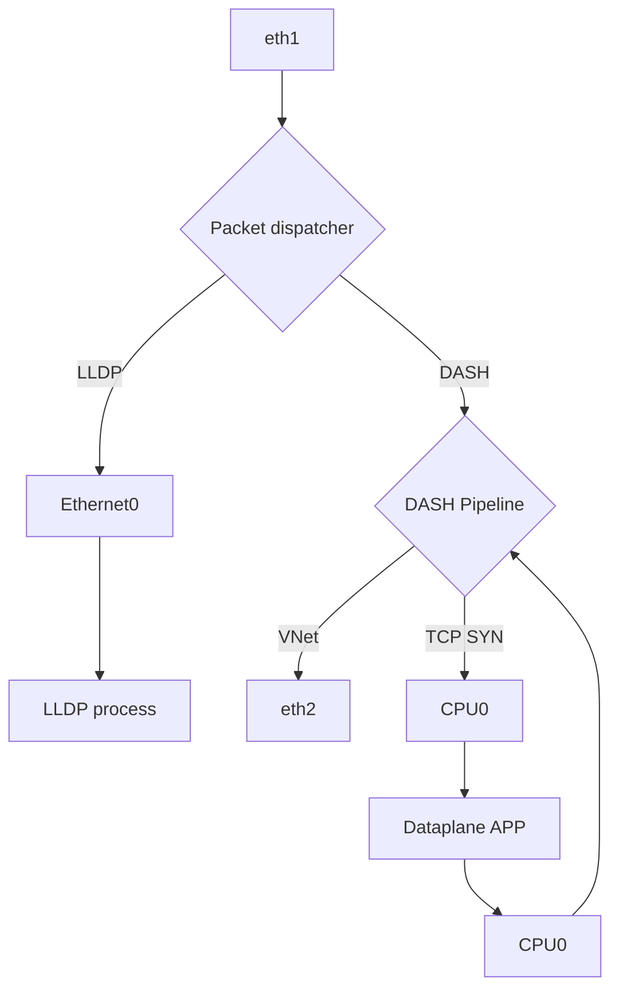

<!-- omit from toc -->
# DASH SONiC KVM

<!-- omit from toc -->
# Table of contents

- [1 Motivation](#1-motivation)
- [2 Architecture](#2-architecture)
- [3 Modules](#3-modules)
  - [3.1 BMv2 (dataplane engine)](#31-bmv2-dataplane-engine)
  - [3.2 Dataplane APP](#32-dataplane-app)
  - [3.3 SAIRedis](#33-sairedis)
  - [3.4 SWSS](#34-swss)
  - [3.5 GNMI/APP DB](#35-gnmiapp-db)
  - [3.6 Other SONiC Services](#36-other-sonic-services)
- [4 Dataflow](#4-dataflow)
  - [4.1 Data plane](#41-data-plane)
  - [4.2 Control plane](#42-control-plane)

# 1 Motivation

1. Provide a Proof of Concept (POC) for development and collaboration. Utilizing the typical SONiC workflow, we can leverage this virtual switch image to construct a virtual testbed, eliminating the need for a complete hardware device. This virtual DPU image enables the creation of a mixed hardware-software testbed or a software-only testbed, applicable to both the control plane and the data plane.
2. Enable Continuous Integration(CI) via Azure Pipelines (Azp) for SONiC repositories, like sonic-buildimage, sonic-swss and so on.

# 2 Architecture

# 3 Modules

## 3.1 BMv2 (dataplane engine)

This component is the original P4 BMv2 container image, which serves as the data plane implementation - usually in hardware.
It attaches three types of interfaces: system port(Ethernet), line port(eth), and DPDK port(CPU).
- Ethernet is used as the system port. Protocol services like BGP and LLDP perform send/receive operations on these interfaces.
- eth is used as the line port. These are native interfaces in KVM for communication between the inside and outside. The eth port and Ethernet port is one-to-one mapping.
- CPU is used for the DPDK port. The dataplane APP directly manipulates the traffic on these ports.

## 3.2 Dataplane APP

Due to the P4 and BMv2 limitation, such as flow creation, flow resimulation and etc, in this virtual DPU, our implementation is based on the VPP framework with the CPU interface to enhance the dataplane engine for these extra functions in the dataplane app module. Meanwhile, this dataplane APP loads the generated shared library, saidash, which communicates with BMv2 via GRPC. For the SAI APIs that will not be used by DASH/DPU SONiC, the SAI implementation will be mocked, as long as SWSS could work, e.g. DTEL. Additionally, this component connects with sairedis through a shim SAI agent(dashsai server - remote dashsai client).

We will have a dedicated doc on the data plane app for more details.

## 3.3 SAIRedis

In the original virtual SONiC, SAIRedis will load the saivs. However, in the new SONiC DASH virtual DPU, it will load the remote dashsai client mentioned above.

## 3.4 SWSS

The SWSS on this virtual DPU is almost the same as the one used in the physical DPU. We don't need to make any special changes to it.

## 3.5 GNMI/APP DB

The GNMI and APP DB are identical to the physical device. However, in this virtual image, we support two modes: DPU mode and single device mode. The details of these two modes will be described in the following section.

## 3.6 Other SONiC Services

We plan to keep the other services, such as BGP, LLDP, and others. these services will be kept, so the KVM runs the same way as how SONiC runs on the real DPU.

# 4 Dataflow
## 4.1 Data plane

All data plane traffic will enter the BMv2 simple switch and be forwarded to the target port based on the P4 logic imported on BMv2.

Here is an example about the data plane

## 4.2 Control plane

In the physical SmartSwitch, configuration is forwarded via GNMI in the NPU. So, in the virtual SONiC environment, the SWSS module is capable of receiving configuration from an external GNMI service through the management port, eth-midplane. However, in the single device mode, the GNMI service can also be run within the KVM and directly forward the configuration to the local SWSS module.

