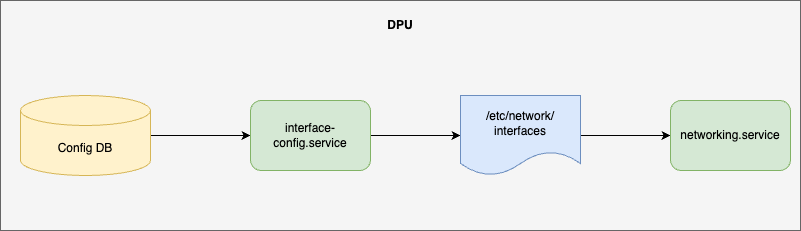

# Smart Switch chassis platform management #

## Table of Content 

### Revision  

|  Rev  | Date  |       Author       | Change Description                             |
| :---: | :---: | :----------------: | ---------------------------------------------- |
|  0.1  |       | Oleksandr Ivantsiv | Initial version. IP address assigment |


### Scope  

This document provides a high-level design for Smart Switch platform chassis management. The initial version of the document covers NPU/DPU control plane interconnection and will be extended with additional chassis management functionality and features.

### Definitions/Abbreviations 

| Term | Meaning                       |
| -------- | ---------------------------------- |
| NPU | network processing unit |
| DPU | data processing unit|
| PCIe | PCI Express (Peripheral Component Interconnect Express) |

### Overview 

A DASH smart switch is a merging of a datacenter switch and one or more DPUs into an integrated device. The "front-panel" network interfaces of the DPU(s) are wired directly into the switching fabric instead of being presented externally, saving cabling, electronics, space and power. There can also be some consolidation of software stacks, for example see SONiC Multi-ASIC for how this is accomplished in standard SONiC multi-ASIC devices.


 The interconnection between control planes in the NPU and DPUs is organized via PCIe interfaces. For each DPU there is a pair of PCIe interfaces. One endpoint is on the NPU side and the other endpoint is on the DPU side. For each PCIe endpoint, there is a netdev representation in the Linux Kernel.


 
#### Virtual Smart Switch

The Virtual Smart Switch simulates the Smart Switch and allows work on the development and verification of the feature in a similar environment.


The Virtual Smart Switch consists of a switch and external DPUs. The switch and DPUs are connected via dataplane interfaces. The dataplane interfaces are used for exchanging both controlplane and dataplane traffic.

### Requirements

#### IP address assigment requirements

- Uniform procedure for assigning IP addresses on DPUs and Switch side interfaces​
- Deterministic behavior​
- Stateless operation of DPU​
- All logic is kept on switch side​
- Compatibility with network boot scenarios, like OOB PXE on DPU

### Architecture Design 
 
To implement a uniform procedure of IP address assignment for DPUs in the smart switch the DHCP server on the switch side shall be used. The DHCP server allows keeping the IP address assignment logic on the switch side and makes DPU IP address assignment implementation stateless from the DPU point of view. The IP address assignment shall be port-based which guarantees the deterministic behavior, the same DPU shall always receive the same IP address on request. The feature requires different implementation for the switch and DPUs platforms. However, it fits into the existing SONiC architecture. The feature shall reuse the existing DHCP server container introduced in the [PR](https://github.com/sonic-net/SONiC/pull/1282). To support the PCI interface configuration the existing functionality of the network interface shall be extended. DHCP-based address assignment provides compatibility with the network boot scenarios (like PXE) when the static IP address assignment can not be utilized.

To organize the DPU PCIe interfaces on the switch side and provide the single source of the configuration for all the DPU PCIe interfaces the bridge interface ("midplane bridge") shall be used for the Smart Switch case. To organize communication between the NPU and DPUs the link-local subnet shall be used. The IPv4 link-local subnetwork is chosen because it is a relatively unused network that is used for communication with directly connected hosts. This allows us to assume that it shall not interfere with the other advertised networks.  
To maintain the same behavior the VLAN interface shall be used for the Virtual Smart Switch case. Dataplane interfaces connected to the DPUs shall be added as members to the VLAN interface. 

To implement the switch side functionality the following changes shall be done:
- HW SKU schema shall be extended to include the following information optional information
  - Midplane bridge configuration with the bridge address and list of the DPU PCIe interfaces that should be added to the bridge for the Smart Switch case.
  - VLAN interface configuration with the IP address and list of the dataplane interfaces that should be added as members for the Virtual Smart Switch case. 
  - DPU modules available on the platform.
  - DPU to netdev mapping
  - IP address of the DPU
- sonic-cfggen utility shall be extended to handle the new HW SKU configuration and transfer it to the Config DB and generate DHCP server configuration based on it.
-  service shall be extended to create a midplane bridge with the corresponding configuration in the Linux Kernel
- DHCP server container should be included into the switch image. DHCP server feature should be enabled by default

The midplane bridge configuration and DHCP server configuration shall be generated by sonic-cfggen utility. No user involvement is required.

Sample HW SKU configuration is the following:

#### Smart Switch

```
    "MID_PLANE_BRIDGE" {
        "bridge" : "bridge_midplane",
        "address": "169.254.200.254/16",
        "members" {
            ["dpu_pci0", "dpu_pci1", "dpu_pci2", "dpu_pci3"]
        }
        "bridge_vlan_aware": "no"
    }

	"DPUs": {
        "DPU1" {
            "type":    "BF3",
            "netdev":  "dpu_pci0",
            "address": "169.254.200.1",
 
        },
        "DPU2" {
            "type":    "BF3",
            "netdev":  "dpu_pci1",
            "address": "169.254.200.2",
        },
        "DPU3" {
            "type":    "BF3",
            "netdev":  "dpu_pci2",
            "address": "169.254.200.3",
        }, 
        "DPU4" {
            "type":    "BF3",
            "netdev":  "dpu_pci3",
            "address": "169.254.200.4",
        }, 
    }
```

#### Virtual Smart Switch

```
    "MID_PLANE_BRIDGE" {
        "vlan" : "4094",
        "address": "169.254.200.254/16",
        "members" {
            ["Ethernet224", "Ethernet232", "Ethernet240", "Ethernet248"]
        }
        "bridge_vlan_aware": "no"
    }

	"DPUs": {
        "DPU1" {
            "type":    "BF3",
            "netdev":  "Ethernet224",
            "address": "169.254.200.1",
 
        },
        "DPU2" {
            "type":    "BF3",
            "netdev":  "Ethernet232",
            "address": "169.254.200.2",
        },
        "DPU3" {
            "type":    "BF3",
            "netdev":  "Ethernet240",
            "address": "169.254.200.3",
        }, 
        "DPU4" {
            "type":    "BF3",
            "netdev":  "Ethernet248",
            "address": "169.254.200.4",
        }, 
    }
```

#### Midplane bridge configuration flow for the Smart Switch case


1. sonic-cfggen utility reads the hwsku.json file.
2. sonic-cfggen utility processes the configuration from the hwsku.json and pushes the midplane bridge into the Config DB.
3. Interface-config service when started consumes configuration from the config DB.
4. Interface-config service renders interfaces configuration file that includes configuration for midplane bridge.
5. Networking service consumes the interface configuration and configures the networking subsystem

After the transformations performed by the interface-config service the interfaces configuration will have the following entries:
```
auto bridge_midplane
iface bridge_midplane inet static
        bridge_ports dpu_pci0 dpu_pci1 dpu_pci2 dpu_pci3
		address 169.254.200.254
    	netmask 255.255.0.0
    	network 169.254.0.0
		broadcast 169.254.255.255
```

#### VLAN interface configuration flow for the Virtual Smart Switch case


1. sonic-cfggen utility reads the hwsku.json file.
2. sonic-cfggen utility processes the configuration from the hwsku.json and pushes the midplane bridge into the Config DB.

Sample of the VLAN interface configuration generated by the sonic-cfggen utility is the following:

```
    "VLAN": {
        "Vlan4094": {
            "vlanid": "4094"
        }
    },
    "VLAN_INTERFACE": {
        "Vlan4094": {},
        "Vlan4094|169.254.0.1/16": {}
    },
    "VLAN_MEMBER": {
        "Vlan4094|Ethernet224": {
            "tagging_mode": "untagged"
        },
        "Vlan4094|Ethernet232": {
            "tagging_mode": "untagged"
        },
        "Vlan4094|Ethernet240": {
            "tagging_mode": "untagged"
        },
        "Vlan4094|Ethernet248": {
            "tagging_mode": "untagged"
        }
    }
```


#### IP assigment flow


- (1) sonic-cfggen utility reads the hwsku.json file.
- (2) sonic-cfggen utility processes the configuration from the hwsku.json and pushes DHCP server configuration into the Config DB.
- (3) DhcpServd when starts consumes DHCP configuration from the Config DB that includes configuration for DPU interfaces.
- (4) DhcpServd renders configuration for DHCP server.
- (5) DhcpServd starts DHCP server
- (8-9) DPU request IP address from the DHCP server

The resulting sample DHCP server configuration generate by the sonic-cfggen utility shall be the following:

Smart Switch
```
{
  "DHCP_SERVER_IPV4": {
      "bridge_midplane": {
          "gateway": "169.254.200.254",
          "lease_time": "infinite",
          "mode": "PORT",
          "netmask": "255.255.0.0",
          "state": "enabled"
      }
  },
 
  "DHCP_SERVER_IPV4_RANGE": {
      "pcie": {
          "ranges": [
              "169.254.200.1",
              "169.254.200.4"
          ]
      }
  },
 
  "DHCP_SERVER_IPV4_PORT": {
      "bridge_midplane|dpu_pci0": {
          "ips": [
              "169.254.200.1"
          ]
      },
 
      "bridge_midplane|dpu_pci1": {
          "ips": [
              "169.254.200.2"
          ]
      },
 
       "bridge_midplane|dpu_pci2": {
          "ips": [
              "169.254.200.3"
          ]
      },
 
      "bridge_midplane|dpu_pci3": {
          "ips": [
              "169.254.200.4"
          ]
      },
  }
}
```

Virtual Smart Switch

```
{
  "DHCP_SERVER_IPV4": {
      "Vlan4094": {
          "gateway": "169.254.200.254",
          "lease_time": "infinite",
          "mode": "PORT",
          "netmask": "255.255.0.0",
          "state": "enabled"
      }
  },
 
  "DHCP_SERVER_IPV4_RANGE": {
      "pcie": {
          "ranges": [
              "169.254.200.1",
              "169.254.200.4"
          ]
      }
  },
 
  "DHCP_SERVER_IPV4_PORT": {
      "Vlan4094|Ethernet224": {
          "ips": [
              "169.254.200.1"
          ]
      },
 
      "Vlan4094|Ethernet232": {
          "ips": [
              "169.254.200.2"
          ]
      },
 
       "Vlan4094|Ethernet240": {
          "ips": [
              "169.254.200.3"
          ]
      },
 
      "Vlan4094|Ethernet248": {
          "ips": [
              "169.254.200.4"
          ]
      },
  }
}
```

#### DPU

The management interface IP address assignment flow is the following:



- The interface-config.service consumes entries from Config DB `MGMT_INTERFACE` table.
- It processes the entries and renders the network interface configuration file.
- networking.service processes the configuration file and applies the configuration in Kernel.

On the DPU side, the IP address for the NPU to DPU communication channel in both Start Switch and Virtual Smart Switch cases shall be requested from the DHCP server that is running on the NPU. 


In the Smart Switch case:
- The only management interface used by the DPU shall be the PCIe interface. The IP address for the iterface shall be requiested from the DHCP server running on the switch.

In the Virtual Smart Switch case, two interfaces shall be used:
- The regular management interface (`eth0`) shall be used to perform the basic operation with the DPU (access the DPU, upgrade image, etc.). The IP address assigment and allocation depends on the management network configuration and usually is configured statically.
- The dataplane interface shall be used for the control plane traffic exchange with the DASH agents running on the switch. The IP address for the iterface shall be requiested from the DHCP server running on the switch.


To implement the described funtionality the following shall be done:
- MGMT_INTERFACE table shall allow configuring more than one management interface.
- MGMT_INTERFACE configuration schema in the Config DB shall be extended to allow to interfaces to query IP configuration from the DHCP server.
- Interface-config.service shall be extended to support DHCP configuration on the interfaces.

With the exising implementation the `interface-config.service` requests the IP address configuration for the `eth0` interface only when the `MGMT_INTERFACE` is empty. This behavior shall be extended to allow requesting IP address configuration from the DHCP server explicitly. 
The `MGMT_INTERFACE` table shall be extended to allow specifying the `dhcp` or `dhcp6` keywords for the interfaces instead of the static IP address configuration. The `dhcp` keyword and static IP address are mutually exclusive per interface per IP address version. It shall not be possible to configure both static IPv4 address and `dhcp` for the same interface. But it shall be possible to configure the IPv4 address and `dhcp6` or wise-versa:

```
MGMT_INTERFACE": {
    "eth0|192.168.0.100/24": {
        "gwaddr": "192.168.0.1"
    },
    "eth0|dhcp6": {}
}
```
The new implementation should have full backward compatibility with the existing behavior.

The management interface configuration flow implemented in interface-config.service shall be the following:

**TODO**

Configuration sample for the Smart Switch is the following:
```
MGMT_INTERFACE": {
    "dpu_pci0|dhcp": {}
}
```

Configuration sample for the Virtual Smart Switch is the following:
```
MGMT_INTERFACE": {
    "eth0|192.168.0.100/24": {
        "gwaddr": "192.168.0.1"
    },
    "Ethernet0|dhcp": {}
}
```


### High-Level Design

Changes shall be added to sonic-buildimages and sonic-cfggen repositories.

#### sonic-cfggen


#### Interfaces-config.service


This section covers the high level design of the feature/enhancement. This section covers the following points in detail.
		
	- Is it a built-in SONiC feature or a SONiC Application Extension?
	- What are the modules and sub-modules that are modified for this design?
	- What are the repositories that would be changed?
	- Module/sub-module interfaces and dependencies. 
	- SWSS and Syncd changes in detail
	- DB and Schema changes (APP_DB, ASIC_DB, COUNTERS_DB, LOGLEVEL_DB, CONFIG_DB, STATE_DB)
	- Sequence diagram if required.
	- Linux dependencies and interface
	- Warm reboot requirements/dependencies
	- Fastboot requirements/dependencies
	- Scalability and performance requirements/impact
	- Memory requirements
	- Docker dependency
	- Build dependency if any
	- Management interfaces - SNMP, CLI, RestAPI, etc.,
	- Serviceability and Debug (logging, counters, trace etc) related design
	- Is this change specific to any platform? Are there dependencies for platforms to implement anything to make this feature work? If yes, explain in detail and inform community in advance.
	- SAI API requirements, CLI requirements, ConfigDB requirements. Design is covered in following sections.

### SAI API 

N/A

### Configuration and management 

All Config DB configurations shall be generated based on the `hwsku.json` file. No new CLI commands are required.

#### CLI/YANG model Enhancements 

This sub-section covers the addition/deletion/modification of CLI changes and YANG model changes needed for the feature in detail. If there is no change in CLI for HLD feature, it should be explicitly mentioned in this section. Note that the CLI changes should ensure downward compatibility with the previous/existing CLI. i.e. Users should be able to save and restore the CLI from previous release even after the new CLI is implemented. 
This should also explain the CLICK and/or KLISH related configuration/show in detail.
https://github.com/sonic-net/sonic-utilities/blob/master/doc/Command-Reference.md needs be updated with the corresponding CLI change.

#### Config DB Enhancements  

Two new tables shall be added to the HW SKU config and Config DB schema in order to add suport of the feature from the switch side:
- `MID_PLANE_BRIDGE` - Describes midplane bridge configuration.
- `DPUs` - Describes DPUs and their capabilities.

Configuration example:
```
    "MID_PLANE_BRIDGE" {
        "bridge" : "bridge_midplane",
        "address": "169.254.200.254/16",
        "members" {
            ["dpu_pci0", "dpu_pci1", "dpu_pci2", "dpu_pci3"]
        }
        "bridge_vlan_aware": "no"
    }

	"DPUs": {
        "DPU1" {
            "type":    "BF3",
            "netdev":  "dpu_pci0",
            "address": "169.254.200.1",
 
        },
        "DPU2" {
            "type":    "BF3",
            "netdev":  "dpu_pci1",
            "address": "169.254.200.2",
        },
        "DPU3" {
            "type":    "BF3",
            "netdev":  "dpu_pci2",
            "address": "169.254.200.3",
        }, 
        "DPU4" {
            "type":    "BF3",
            "netdev":  "dpu_pci3",
            "address": "169.254.200.4",
        }, 
    }
```

`MGMT_INTERFACE` table shall be extended to provide a possibility to explisitly request IPv4 or IPv6 configuration from the DHCP server.

```
    "MGMT_INTERFACE": {
        "dpu_pci|dhcp": {},
        "eth0|dhcpv7": {}
    }
```

### Warmboot and Fastboot Design Impact  

The feature has no impact on the warmboot and fastboot.

### Memory Consumption
This sub-section covers the memory consumption analysis for the new feature: no memory consumption is expected when the feature is disabled via compilation and no growing memory consumption while feature is disabled by configuration. 
### Restrictions/Limitations  

### Testing Requirements/Design  
Explain what kind of unit testing, system testing, regression testing, warmboot/fastboot testing, etc.,
Ensure that the existing warmboot/fastboot requirements are met. For example, if the current warmboot feature expects maximum of 1 second or zero second data disruption, the same should be met even after the new feature/enhancement is implemented. Explain the same here.
Example sub-sections for unit test cases and system test cases are given below. 

#### Unit Test cases 

#### System Test cases

Sysmet tests test plan shall be added in a separate document.

### Open/Action items - if any 

N/A