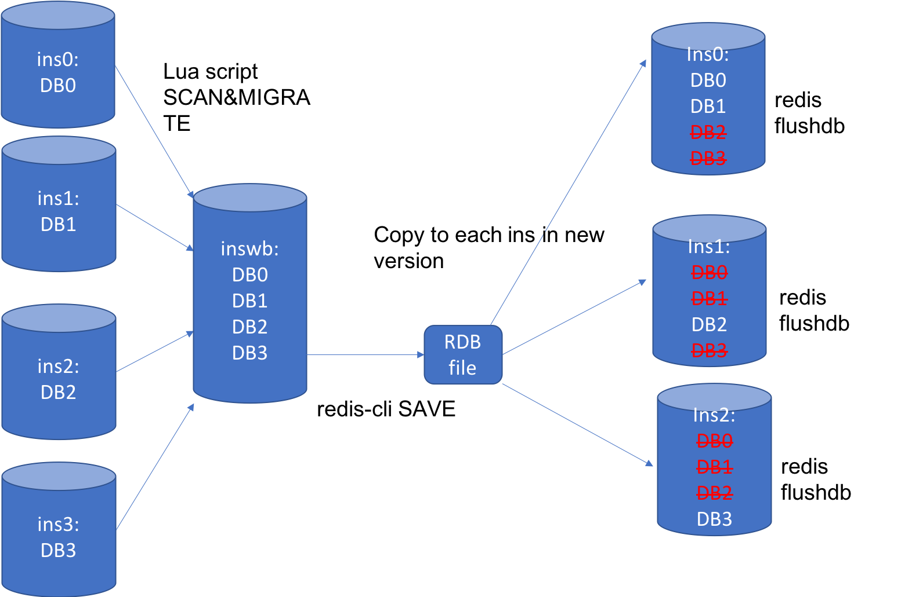

# Support Multiple user-defined redis database instances

## Motivation

​        Today SONiC only has one redis database instance created and all the databases use this unique database instance, like APPL\_DB, ASIC\_DB, CONF\_DB and so on.  We found when there are huge writes operations during a short time period (like huge routes created), this only database instance is very busy. We tried to create two database instances and separate the huge write into two database instances. The test result shows the performance (time) improved 20-30%. Also creating multiple database instances help us to separate the databases based on their operation frequency or their role in the whole SONiC system, for example, like state database and loglevel database are not key features, we can avoid them affecting read and write APPL\_DB or ASIC\_DB  via multiple database instances.

## Current implementation

* Single Redis database instance for all databases
* All database configuration files (supervisord.conf, redis.conf, redis.sock. redis.pid and etc.) are generated at compilation. They cannot be modified at runtime.


DUT try to load a new images


1. * [x] if configuration at /etc/sonic/ exists, copy /etc/sonic/ to /host/old\_config
2. rc.local service
    * [x] if /host/old\_config/ exists, copy /host/old\_config/ to /etc/sonic/
    * [x] if no folder /host/old\_config/, copy some default xmls and etc.
3. database service
    * [x] [database.sh](http://database.sh) start and docker start according to the configuration
    * [x] check if database is running
4. updategraph service
    * [x] depends on rc.local and database
    * [x] restore selected files in /etc/sonic/old\_config to /etc/sonic/, if any
    * [x] if no folder /etc/sonic/old\_config/, generate config\_db.json based on xml and etc.

## New Design of Database Startup

* We introduce a new configuration file.

* This file contains how many redis instances and databases , also the configration of each database , including instance, dbid, separator.

    ```json
    {
        "INSTANCES": {
            "redis":{
                "hostname" : "127.0.0.1",
                "port" : 6379,
                "unix_socket_path" : "/var/run/redis/redis.sock"
            }
        },
        "DATABASES" : {
            "APPL_DB" : {
                "id" : 0,
                "separator": ":",
                "instance" : "redis"
            },
            "ASIC_DB" : {
                "id" : 1,
                "separator": ":",
                "instance" : "redis"
            },
            "COUNTERS_DB" : {
                "id" : 2,
                "separator": ":",
                "instance" : "redis"
            },
            "LOGLEVEL_DB" : {
                "id" : 3,
                "separator": ":",
                "instance" : "redis"
            },
            "CONFIG_DB" : {
                "id" : 4,
                "separator": "|",
                "instance" : "redis"
            },
            "PFC_WD_DB" : {
                "id" : 5,
                "separator": ":",
                "instance" : "redis"
            },
            "FLEX_COUNTER_DB" : {
                "id" : 5,
                "separator": ":",
                "instance" : "redis"
            },
            "STATE_DB" : {
                "id" : 6,
                "separator": "|",
                "instance" : "redis"
            },
            "SNMP_OVERLAY_DB" : {
                "id" : 7,
                "separator": "|",
                "instance" : "redis"
            }
        },
        "VERSION" : "1.0"
    }
    ```

* By default, each image has one default startup database\_config.json file in SONiC file system at /etc/default/sonic-db/.

* The users is able to use the customized database configration, what needs to do is creating a database\_config.josn file and place it at /etc/sonic/

* We changed the database Docker ENTRYPOINT to docker-database-init.sh which is new added.

* We also change supervisord.conf into j2 template mode, since we want to generate supervisord.conf using database\_config.json on runtime

Detail steps as below:
1. DUT try to load an images (no changes)
    * [x] if configuration at /etc/sonic/ exists, copy /etc/sonic/ to /host/old\_config as usual
2. rc.local service (no changes)
    * [x] if /host/old\_config/ exists, copy /host/old\_config/ to /etc/sonic/ as usual
    * [x] if no folder /host/old\_config/, copy some default xmls and etc. as usual
3. **database service**
    * [x] **database docker start, entrypoint docker-database-init.sh**
    * [x] **if database\_config.json is found at /ect/sonic/, that means there is customized database config, we copy this config file to /var/run/redis/sonic-db/, which is the running database config file location, all the applications will read databse information from this file**
    * [x] **if database\_config.json is NOT found at /ect/sonic/, that means there is no customized database config, we copy this config file at /etc/default/ to /var/run/redis/sonic-db/, this is the default startuo config in the image itself.**
    * [x] **using supervisord.conf.j2 to generate supervisord.conf**
    * [x] **execute the previous entrypoint program /usr/bin/supervisord, then all the services will start based on the new supervisord.conf, which including starting how many redis instances**
    * [x] **check if redis instances are running or NOT via ping_pong_db_insts script**
4. updategraph service (no changes)
    * [x] depends on rc.local and database
    * [x] restore selected files /etc/sonic/old\_config to /etc/sonic/, if any
    * [x] if no folder /etc/sonic/old\_config/, generate config\_db.json based on xml and etc.

## Potential Redis Cluster Solution

​        Could we use cluster feature on single instance to split the databases across different nodes instead of creating multiple single redis instances mentioned in this Design Document ?

__What is the goals of Redis Cluster?__

​        Redis Cluster is a distributed implementation of Redis with the following goals, in order of importance in the design:

1. High performance and linear scalability up to 1000 nodes. There are no proxies, asynchronous replication is used, and no merge operations are performed on values.
2. Acceptable degree of write safety: the system tries (in a best-effort way) to retain all the writes originating from clients connected with the majority of the master nodes. Usually there are small windows where acknowledged writes can be lost. Windows to lose acknowledged writes are larger when clients are in a minority partition.
3. Availability: Redis Cluster is able to survive partitions where the majority of the master nodes are reachable and there is at least one reachable slave for every master node that is no longer reachable. Moreover using replicas migration, masters no longer replicated by any slave will receive one from a master which is covered by multiple slaves.

__Clients and Servers roles in the Redis Cluster protocol__

​        In Redis Cluster nodes are responsible for holding the data, and taking the state of the cluster, including mapping keys to the right nodes. Cluster nodes are also able to auto-discover other nodes, detect non-working nodes, and promote slave nodes to master when needed in order to continue to operate when a failure occurs.

​        To perform their tasks all the cluster nodes are connected using a TCP bus and a binary protocol, called the Redis Cluster Bus. Every node is connected to every other node in the cluster using the cluster bus. Nodes use a gossip protocol to propagate information about the cluster in order to discover new nodes, to send ping packets to make sure all the other nodes are working properly, and to send cluster messages needed to signal specific conditions. The cluster bus is also used in order to propagate Pub/Sub messages across the cluster and to orchestrate manual failovers when requested by users (manual failovers are failovers which are not initiated by the Redis Cluster failure detector, but by the system administrator directly).


__Redis Cluster Main Components :__

__KEYs distribution model :__

​        HASH\_SLOT = CRC16(key) mod 16384

__Cluster nodes attributes :__

​        Every node has a unique name in the cluster. The node name is the hex representation of a 160 bit random number, obtained the first time a node is started (usually using /dev/urandom).

​        Every node maintains the following information about other nodes that it is aware of in the cluster: The node ID, IP and port of the node, a set of flags, what is the master of the node if it is flagged as slave, last time the node was pinged and the last time the pong was received, the current configuration epoch of the node (explained later in this specification), the link state and finally the set of hash slots served.

```shell
$ redis-cli cluster nodes
d1861060fe6a534d42d8a19aeb36600e18785e04 127.0.0.1:6379 myself - 0 1318428930 1 connected 0-1364
3886e65cc906bfd9b1f7e7bde468726a052d1dae 127.0.0.1:6380 master - 1318428930 1318428931 2 connected 1365-2729
d289c575dcbc4bdd2931585fd4339089e461a27d 127.0.0.1:6381 master - 1318428931 1318428931 3 connected 2730-4095
```

__The Cluster bus :__

​        Every Redis Cluster node has an additional TCP port for receiving incoming connections from other Redis Cluster nodes. This port is at a fixed offset from the normal TCP port used to receive incoming connections from clients. To obtain the Redis Cluster port, 10000 should be added to the normal commands port. For example, if a Redis node is listening for client connections on port 6379, the Cluster bus port 16379 will also be opened.

__The fact we cannot use redis cluster to split all databases across different nodes:__

1. TCP + PORT must be used in cluster, we cannot use unix socket.
2. Mapping KEY to hash slot is not decided by us. It is hard to generate the same hash value/slot for all the different KEYs in one database in order to split the databases across nodes.
3. Also, in cluster mode, each redis instance only has one database, we cannot apply two or more databases on the same redis instance.
4. We need to use new c++/python cluster client library instead of current c/python redis library.
5. For warm reboot, we cannot restore the data form current saved backup file to start the redis cluster mode unless we don't want to support it.

__TCP + PORT v.s. Unix Socket Benchmark Performance results :__

```bash
root@ASW5:/# redis-benchmark -q -n 100000 -c 1 -p 6379
PING_INLINE: 10899.18 requests per second
PING_BULK: 11138.34 requests per second
SET: 9280.74 requests per second
GET: 10922.99 requests per second
INCR: 9668.37 requests per second
LPUSH: 9483.17 requests per second
RPUSH: 9541.07 requests per second
LPOP: 9373.83 requests per second
RPOP: 9725.73 requests per second
SADD: 11249.86 requests per second
SPOP: 11332.73 requests per second
LPUSH (needed to benchmark LRANGE): 9508.42 requests per second
LRANGE_100 (first 100 elements): 4695.06 requests per second
LRANGE_300 (first 300 elements): 2391.43 requests per second
LRANGE_500 (first 450 elements): 1740.13 requests per second
LRANGE_600 (first 600 elements): 1434.54 requests per second
MSET (10 keys): 4568.50 requests per second

root@ASW5:/# redis-benchmark -q -n 100000 -c 1 -s /var/run/redis/redis.sock
PING_INLINE: 18076.64 requests per second
PING_BULK: 18804.06 requests per second
SET: 14361.63 requests per second
GET: 18426.39 requests per second
INCR: 15260.19 requests per second
LPUSH: 14293.88 requests per second
RPUSH: 14686.44 requests per second
LPOP: 14108.35 requests per second
RPOP: 14427.93 requests per second
SADD: 17838.03 requests per second
SPOP: 18008.28 requests per second
LPUSH (needed to benchmark LRANGE): 14537.00 requests per second
LRANGE_100 (first 100 elements): 6383.25 requests per second
LRANGE_300 (first 300 elements): 2669.09 requests per second
LRANGE_500 (first 450 elements): 1868.22 requests per second
LRANGE_600 (first 600 elements): 1496.40 requests per second
MSET (10 keys): 5550.62 requests per second
```

​        __So I don't think redis cluster is a good way to solve the problem of splitting databases into multiple redis instances
in SONiC.__

## New Design of C++ Interface :  DBConnector()

Today there are two APIs to create DBConnector object which depends on socket OR port number as input:

```c++
DBConnector(int dbId, const std::string &hostname, int port, unsigned int timeout);
DBConnector(int dbId, const std::string &unixPath, unsigned int timeout);
```

The new design introduce a new class SonicDBConfig which is used to read database\_config.json file and store the database configuration information.

Also we introduce new APIs to create DBConnector object without socket/port parameter. The socket/port will be decided via lookup function in SonicDBConfig class.

dbconnector.h

```c++
class SonicDBConfig
{
public:
    static void initialize(const std::string &file = DEFAULT_SONIC_DB_CONFIG_FILE);
    static std::string getDbInst(const std::string &dbName);
    static int getDbId(const std::string &dbName);
    static std::string getDbSock(const std::string &dbName);
    static std::string getDbHostname(const std::string &dbName);
    static int getDbPort(const std::string &dbName);
    static bool isInit() { return m_init; };

private:
    static constexpr const char *DEFAULT_SONIC_DB_CONFIG_FILE = "/var/run/redis/sonic-db/database_config.json";
    // { instName, { unix_socket_path, {hostname, port} } }
    static std::unordered_map<std::string, std::pair<std::string, std::pair<std::string, int>>> m_inst_info;
    // { dbName, {instName, dbId} }
    static std::unordered_map<std::string, std::pair<std::string, int>> m_db_info;
    static bool m_init;
};


class DBConnector
{
public:
    static constexpr const char *DEFAULT_UNIXSOCKET = "/var/run/redis/redis.sock";

    /*
     * Connect to Redis DB wither with a hostname:port or unix socket
     * Select the database index provided by "db"
     *
     * Timeout - The time in milisecond until exception is been thrown. For
     *           infinite wait, set this value to 0
     */
    DBConnector(int dbId, const std::string &hostname, int port, unsigned int timeout);
    DBConnector(int dbId, const std::string &unixPath, unsigned int timeout);
    DBConnector(const std::string &dbName, unsigned int timeout, bool isTcpConn = false);

    ~DBConnector();

    redisContext *getContext() const;
    int getDbId() const;

    static void select(DBConnector *db);

    /* Create new context to DB */
    DBConnector *newConnector(unsigned int timeout) const;

private:
    redisContext *m_conn;
    int m_dbId;
};

```

When we having these APIs , we need to replace all the places where using the old DBConnector() with the new DBConnector() API.

dbconnector.cpp

```c++
//swss::DBConnector db(ASIC_DB, DBConnector::DEFAULT_UNIXSOCKET, 0);
swss::DBConnector db("ASIC_DB", 0);

DBConnector::DBConnector(const string& dbName, unsigned int timeout, bool isTcpConn) :
    m_dbId(SonicDBConfig::getDbId(dbName))
{
    struct timeval tv = {0, (suseconds_t)timeout * 1000};

    if (timeout)
    {
        if (isTcpConn)
            m_conn = redisConnectWithTimeout(SonicDBConfig::getDbHostname(dbName).c_str(), SonicDBConfig::getDbPort(dbName), tv);
        else
            m_conn = redisConnectUnixWithTimeout(SonicDBConfig::getDbSock(dbName).c_str(), tv);
    }
    else
    {
        if (isTcpConn)
            m_conn = redisConnect(SonicDBConfig::getDbHostname(dbName).c_str(), SonicDBConfig::getDbPort(dbName));
        else
            m_conn = redisConnectUnix(SonicDBConfig::getDbSock(dbName).c_str());
    }

    if (m_conn->err)
        throw system_error(make_error_code(errc::address_not_available),
                           "Unable to connect to redis");

    select(this);
}
```

## New Design of Python Interface: DBConnector()

Python DBConnector() is auto generated via C++ Codes. No need to change.

## New Design of Python Interface: SonicV2Connector()

Today the usage is to accept parameter in SonicV2Connector()->init() and then call connect() to create connection to default redis instance.

```python
 self.appdb = SonicV2Connector(host="127.0.0.1")
 self.appdb.connect(self.appdb.APPL_DB)
```

The new design is similar to what we did for C++. We introduce a new class SonicDBConfig which is used to read database\_config.json file and store the database configuration information.

Then we modify the existing class SonicV2Connector, we use SonicDBConfig to get the database inforamtion in SonicV2Connector before we connect the redis instances.

interface.py

```python
class SonicDBConfig(object):
    SONIC_DB_CONFIG_FILE = "/var/run/redis/sonic-db/database_config.json"
    _sonic_db_config_init = False
    _sonic_db_config = {}

    @staticmethod
    def load_sonic_db_config(sonic_db_file_path=SONIC_DB_CONFIG_FILE):
        """
        Get multiple database config from the database_config.json
        """
        if SonicDBConfig._sonic_db_config_init == True:
            return

        try:
            if os.path.isfile(sonic_db_file_path) == False:
                msg = "'{}' is not found, it is not expected in production devices!!".format(sonic_db_file_path)
                logger.warning(msg)
                sonic_db_file_path = os.path.join(os.path.dirname(os.path.abspath(__file__)), 'config', 'database_config.json')
            with open(sonic_db_file_path, "r") as read_file:
                SonicDBConfig._sonic_db_config = json.load(read_file)
        except (OSError, IOError):
            msg = "Could not open sonic database config file '{}'".format(sonic_db_file_path)
            logger.exception(msg)
            raise RuntimeError(msg)
        SonicDBConfig._sonic_db_config_init = True

    @staticmethod
    def db_name_validation(db_name):
        if SonicDBConfig._sonic_db_config_init == False:
            SonicDBConfig.load_sonic_db_config()
        if db_name not in SonicDBConfig._sonic_db_config["DATABASES"]:
            msg = "{} is not a valid database name in configuration file".format(db_name)
            logger.exception(msg)
            raise RuntimeError(msg)

    @staticmethod
    def inst_name_validation(inst_name):
        if SonicDBConfig._sonic_db_config_init == False:
            SonicDBConfig.load_sonic_db_config()
        if inst_name not in SonicDBConfig._sonic_db_config["INSTANCES"]:
            msg = "{} is not a valid instance name in configuration file".format(inst_name)
            logger.exception(msg)
            raise RuntimeError(msg)

    @staticmethod
    def get_dblist():
        if SonicDBConfig._sonic_db_config_init == False:
            SonicDBConfig.load_sonic_db_config()
        return SonicDBConfig._sonic_db_config["DATABASES"].keys()

    @staticmethod
    def get_instance(db_name):
        if SonicDBConfig._sonic_db_config_init == False:
            SonicDBConfig.load_sonic_db_config()
        SonicDBConfig.db_name_validation(db_name)
        inst_name = SonicDBConfig._sonic_db_config["DATABASES"][db_name]["instance"]
        SonicDBConfig.inst_name_validation(inst_name)
        return SonicDBConfig._sonic_db_config["INSTANCES"][inst_name]

    @staticmethod
    def get_socket(db_name):
        if SonicDBConfig._sonic_db_config_init == False:
            SonicDBConfig.load_sonic_db_config()
        SonicDBConfig.db_name_validation(db_name)
        return SonicDBConfig.get_instance(db_name)["unix_socket_path"]

    @staticmethod
    def get_hostname(db_name):
        if SonicDBConfig._sonic_db_config_init == False:
            SonicDBConfig.load_sonic_db_config()
        SonicDBConfig.db_name_validation(db_name)
        return SonicDBConfig.get_instance(db_name)["hostname"]

    @staticmethod
    def get_port(db_name):
        if SonicDBConfig._sonic_db_config_init == False:
            SonicDBConfig.load_sonic_db_config()
        SonicDBConfig.db_name_validation(db_name)
        return SonicDBConfig.get_instance(db_name)["port"]

    @staticmethod
    def get_dbid(db_name):
        if SonicDBConfig._sonic_db_config_init == False:
            SonicDBConfig.load_sonic_db_config()
        SonicDBConfig.db_name_validation(db_name)
        return SonicDBConfig._sonic_db_config["DATABASES"][db_name]["id"]

    @staticmethod
    def get_separator(db_name):
        if SonicDBConfig._sonic_db_config_init == False:
            SonicDBConfig.load_sonic_db_config()
        SonicDBConfig.db_name_validation(db_name)
        return SonicDBConfig._sonic_db_config["DATABASES"][db_name]["separator"]

class SonicV2Connector(DBInterface):
    def __init__(self, use_unix_socket_path=False, **kwargs):
        super(SonicV2Connector, self).__init__(**kwargs)
        self.use_unix_socket_path = use_unix_socket_path
        for db_name in self.get_db_list():
            # set a database name as a constant value attribute.
            setattr(self, db_name, db_name)

    def connect(self, db_name, retry_on=True):
        if self.use_unix_socket_path:
            self.redis_kwargs["unix_socket_path"] = self.get_db_socket(db_name)
            self.redis_kwargs["host"] = None
            self.redis_kwargs["port"] = None
        else:
            self.redis_kwargs["host"] = self.get_db_hostname(db_name)
            self.redis_kwargs["port"] = self.get_db_port(db_name)
            self.redis_kwargs["unix_socket_path"] = None
        db_id = self.get_dbid(db_name)
        super(SonicV2Connector, self).connect(db_id, retry_on)

    def close(self, db_name):
        db_id = self.get_dbid(db_name)
        super(SonicV2Connector, self).close(db_id)

    def get_db_list(self):
        return SonicDBConfig.get_dblist()

    def get_db_instance(self, db_name):
        return SonicDBConfig.get_instance(db_name)

    def get_db_socket(self, db_name):
        return SonicDBConfig.get_socket(db_name)

    def get_db_hostname(self, db_name):
        return SonicDBConfig.get_hostname(db_name)

    def get_db_port(self, db_name):
        return SonicDBConfig.get_port(db_name)

    def get_dbid(self, db_name):
        return SonicDBConfig.get_dbid(db_name)

    def get_db_separator(self, db_name):
        return SonicDBConfig.get_separator(db_name)

    def get_redis_client(self, db_name):
        db_id = self.get_dbid(db_name)
        return super(SonicV2Connector, self).get_redis_client(db_id)

    def publish(self, db_name, channel, message):
        db_id = self.get_dbid(db_name)
        return super(SonicV2Connector, self).publish(db_id, channel, message)

    def expire(self, db_name, key, timeout_sec):
        db_id = self.get_dbid(db_name)
        return super(SonicV2Connector, self).expire(db_id, key, timeout_sec)

    def exists(self, db_name, key):
        db_id = self.get_dbid(db_name)
        return  super(SonicV2Connector, self).exists(db_id, key)

    def keys(self, db_name, pattern='*', *args, **kwargs):
        db_id = self.get_dbid(db_name)
        return super(SonicV2Connector, self).keys(db_id, pattern, *args, **kwargs)

    def get(self, db_name, _hash, key, *args, **kwargs):
        db_id = self.get_dbid(db_name)
        return super(SonicV2Connector, self).get(db_id, _hash, key, *args, **kwargs)

    def get_all(self, db_name, _hash, *args, **kwargs):
        db_id = self.get_dbid(db_name)
        return super(SonicV2Connector, self).get_all(db_id, _hash, *args, **kwargs)

    def set(self, db_name, _hash, key, val, *args, **kwargs):
        db_id = self.get_dbid(db_name)
        return super(SonicV2Connector, self).set(db_id, _hash, key, val, *args, **kwargs)

    def delete(self, db_name, key, *args, **kwargs):
        db_id = self.get_dbid(db_name)
        return super(SonicV2Connector, self).delete(db_id, key, *args, **kwargs)

    def delete_all_by_pattern(self, db_name, pattern, *args, **kwargs):
        db_id = self.get_dbid(db_name)
        super(SonicV2Connector, self).delete_all_by_pattern(db_id, pattern, *args, **kwargs)

    pass

```

For this part, the current code where uses parameters in SonicV2Connector(port/socket) is not necessary anymore.

```python
 # self.appdb = SonicV2Connector(host="127.0.0.1")
 self.appdb = SonicV2Connector()
 self.appdb.connect(self.appdb.APPL_DB)
```

## Golang:  initialize DB connection Design

Today we create all database connection at init time using default redis instance and later we just use it.

```go
// Client package prepare redis clients to all DBs automatically
func init() {
    db_init()
    for dbName, dbn := range spb.Target_value {
        if dbName != "OTHERS" {
            // DB connector for direct redis operation
            var redisDb *redis.Client
            redisDb = redis.NewClient(&redis.Options{
                        Network:     "unix",
                        Addr:        Default_REDIS_UNIXSOCKET,
                        Password:    "", // no password set
                        DB:          int(dbn),
                        DialTimeout: 0,
                })
                Target2RedisDb[dbName] = redisDb
        }
    }
}
```

In the new Design, we added a new package at sonic\_db\_config/db\_config.go, which parse database\_config.json file and provided get APIs.

Similar to C++ changes, when new package imported, database\_config.json file information is read and stored.

Later we use these get API to get the information when we want to use it.

sonic\_db\_config/db\_config.go

```go
package dbconfig

import (
    "encoding/json"
    "fmt"
    "strconv"
    io "io/ioutil"
)

const (
    SONIC_DB_CONFIG_FILE string = "/var/run/redis/sonic-db/database_config.json"
)

var sonic_db_config = make(map[string]interface{})
var sonic_db_init bool

func GetDbList()(map[string]interface{}) {
    if !sonic_db_init {
        DbInit()
    }
    db_list, ok := sonic_db_config["DATABASES"].(map[string]interface{})
    if !ok {
        panic(fmt.Errorf("DATABASES' is not valid key in database_config.json file!"))
    }
    return db_list
}

func GetDbInst(db_name string)(map[string]interface{}) {
    if !sonic_db_init {
        DbInit()
    }
    db, ok := sonic_db_config["DATABASES"].(map[string]interface{})[db_name]
    if !ok {
        panic(fmt.Errorf("database name '%v' is not valid in database_config.json file!", db_name))
    }
    inst_name, ok := db.(map[string]interface{})["instance"]
    if !ok {
        panic(fmt.Errorf("'instance' is not a valid field in database_config.json file!"))
    }
    inst, ok := sonic_db_config["INSTANCES"].(map[string]interface{})[inst_name.(string)]
    if !ok {
        panic(fmt.Errorf("instance name '%v' is not valid in database_config.json file!", inst_name))
    }
    return inst.(map[string]interface{})
}

func GetDbSeparator(db_name string)(string) {
    if !sonic_db_init {
        DbInit()
    }
    db_list := GetDbList()
    separator, ok := db_list[db_name].(map[string]interface{})["separator"]
    if !ok {
        panic(fmt.Errorf("'separator' is not a valid field in database_config.json file!"))
    }
    return separator.(string)
}

func GetDbId(db_name string)(int) {
    if !sonic_db_init {
        DbInit()
    }
    db_list := GetDbList()
    id, ok := db_list[db_name].(map[string]interface{})["id"]
    if !ok {
        panic(fmt.Errorf("'id' is not a valid field in database_config.json file!"))
    }
    return int(id.(float64))
}

func GetDbSock(db_name string)(string) {
    if !sonic_db_init {
        DbInit()
    }
    inst := GetDbInst(db_name)
    unix_socket_path, ok := inst["unix_socket_path"]
    if !ok {
        panic(fmt.Errorf("'unix_socket_path' is not a valid field in database_config.json file!"))
    }
    return unix_socket_path.(string)
}

func GetDbHostName(db_name string)(string) {
    if !sonic_db_init {
        DbInit()
    }
    inst := GetDbInst(db_name)
    hostname, ok := inst["hostname"]
    if !ok {
        panic(fmt.Errorf("'hostname' is not a valid field in database_config.json file!"))
    }
    return hostname.(string)
}

func GetDbPort(db_name string)(int) {
    if !sonic_db_init {
        DbInit()
    }
    inst := GetDbInst(db_name)
    port, ok := inst["port"]
    if !ok {
        panic(fmt.Errorf("'port' is not a valid field in database_config.json file!"))
    }
    return int(port.(float64))
}

func GetDbTcpAddr(db_name string)(string) {
    if !sonic_db_init {
        DbInit()
    }
    hostname := GetDbHostName(db_name)
    port := GetDbPort(db_name)
    return hostname + ":" + strconv.Itoa(port)
}

func DbInit() {
    if sonic_db_init {
        return
    }
    data, err := io.ReadFile(SONIC_DB_CONFIG_FILE)
    if err != nil {
        panic(err)
    } else {
        err = json.Unmarshal([]byte(data), &sonic_db_config)
        if err != nil {
            panic(err)
        }
        sonic_db_init = true
    }
}

func init() {
    sonic_db_init = false
}

```

When we having these APIS, we need to replace the hard coded socket/port with these get APIs.

db\_client.go

```go
// Client package prepare redis clients to all DBs automatically
func init() {
	for dbName, dbn := range spb.Target_value {
		if dbName != "OTHERS" {
			// DB connector for direct redis operation
			var redisDb *redis.Client

			redisDb = redis.NewClient(&redis.Options{
				Network:     "unix",
				Addr:        sdcfg.GetDbSock(dbName),
				Password:    "", // no password set
				DB:          int(dbn),
				DialTimeout: 0,
			})
			Target2RedisDb[dbName] = redisDb
		}
	}
}
```

## New Design of Script:   mimic redis-cli cmd , we added a new sonic-db-cli cmd which accept DB name as first parameter

For the script, today we just use the default redis instance and there is no -p/-s option.

The scripts is used in shell, python, c and c++ system call, we need to change all these places.

We added a new sonic-db-cli which is written in python, the function is the same as redis-cli, the only difference is to accept db name as the first parameter instead of '-n x' for redis-cli.

Form the db name, we can using exising python swsssdk library to look up the db information and use them. This new sonic-db-cli is in swsssdk as well and will be installed where ever swsssdk is installed.

swsssdk/src/script/sonic-db-cli
```python
#!/usr/bin/python
import sys
import swsssdk

argc = len(sys.argv)
if argc == 2 and sys.argv[1] == '-h':
    print("""
Example 1: sonic-db-cli CONFIG_DB keys *
Example 2: sonic-db-cli APPL_DB HGETALL VLAN_TABLE:Vlan10
Example 3: sonic-db-cli APPL_DB HGET VLAN_TABLE:Vlan10 mtu
Example 4: sonic-db-cli APPL_DB EVAL "return {KEYS[1],KEYS[2],ARGV[1],ARGV[2]}" 2 k1 k2 v1 v2
""")
elif argc < 3:
    msg = "'Usage: sonic-db-cli <db_name> <cmd> [arg [arg ...]]'. See 'sonic-db-cli -h' for detail examples."
    print >> sys.stderr, msg
else:
    dbname = sys.argv[1]
    dbconn = swsssdk.SonicV2Connector(use_unix_socket_path=False)
    try:
        dbconn.connect(dbname)
    except RuntimeError:
        msg = "Invalid database name input : '{}'".format(sys.argv[1])
        print >> sys.stderr, msg
    else:
        client = dbconn.get_redis_client(dbname)
        args = sys.argv[2:]
        resp = client.execute_command(*args)
        """
        sonic-db-cli output format mimic the non-tty mode output format from redis-cli
        based on our usage in SONiC, None and list type output from python API needs to be modified
        with these changes, it is enough for us to mimic redis-cli in SONiC so far since no application uses tty mode redis-cli output
        """
        if resp is None:
            print ""
        elif isinstance(resp, list):
            print "\n".join(resp)
        else:
            print resp
```

The replacement examples :

Shell e.g.:

```shell
arp_to_host_flag=$(echo $(redis-cli -n 4 hget "ARP|arp2host" enable) | tr [a-z][A-Z])
```

```shell
arp_to_host_flag=$(echo $(sonic-db-cli CONFIG_DB hget "ARP|arp2host" enable) | tr [a-z][A-Z])
```

python e.g.:

```python
proc = Popen("docker exec -i database redis-cli -n 2 KEYS *CRM:ACL_TABLE_STATS*", stdout=PIPE, stderr=PIPE, shell=True
```

```python
proc = Popen("sonic-db-cli COUNTERS_DB KEYS *CRM:ACL_TABLE_STATS*", stdout=PIPE, stderr=PIPE, shell=True
```

C/C++ e.g.:

```c++
//string redis_cmd_db = "redis-cli -p -n ";
string redis_cmd_db = "sonic-db-cli ";

//redis_cmd_db += std::to_string(CONFIG_DB) + " ";
redis_cmd_db += "CONFIG_DB ";

redis_cmd = redis_cmd_db + " KEYS " + redis_cmd_keys;
redis_cmd += " | xargs -n 1  -I %   sh -c 'echo \"%\"; ";
redis_cmd += redis_cmd_db + "hgetall \"%\" | paste -d '='  - - | sed  's/^/$/'; echo'";

EXEC_WITH_ERROR_THROW(cmd, res);
```

## Programming Language

One suggestion during SONiC meeting discussion is to write one DB_ID <-> DB_INST mapping function in C++, and then to generate the codes in Python and Go, which could avoid introduce the same mapping function for all the programming languages.

## Warm-reboot

### *Current implementation*

We know that warm-reboot is supported in SONiC now.
Today the single database instance is using "redis-cli save" in fast-reboot script to store data as RDB file.
Then restore it when database instance is up.


### *Proposed new implementation*

The redis instances & databases mapping may change between versions, that means before warmboot, we may have, for example, 3 redis instances and after warmboot, the number of redis instances may be, for example, 2 or 4. This makes the original 3 saved rdb files CANNOT restore the 2 or 4 redis instances directly.  We need to do something to restore data based on the new redis instances & database mapping.

Today we already assigned each database name with a unique number (APPL_DB 0, ASIC_DB 1, ...) and assign them into different redis instances in design. This makes it possible to migrate all data in all redis instances into one redis instance without any conflicts. Then we can handle this single redis instance the same as what we did today, since today we are only use single redis instance. So the poposed new idea is as below steps:

1. When we normally start multiple redis instances, besides all the necessary and used redis isntances, we add one more unused/spare redis instance configration in database_config.json. This unused/spare redis instance is not accessed by any application and it is empty.
2. In the shutdown stage of warmboot, we migrate the data on all used redis instances into the unused/spare/empty redis instance. In this way all the data are in one redis instance and we can issue "redis-cli save" now to generate a single rdb file containing all the data. After this point, everything is the same as what we did today for single redis instance,  copying rdb file to WARM_DIR and so on.
3. When loading new images during warmboot, we copy the single full data rdb file to each instance's rdb file path as what we did today. Then all the instances have the full data after startup, each instance can access the data as usual based on the redis instances & databases mapping in database_config.json. The unused data could be deleted via "redis-cli flushdb".
4. At this point, all the data are restored based on the new redis instance & database mapping. In this way, we don't need to find the delta between configurations and could handle all redis instances&database mapping cases.

Below shows an example:

- [x] Before warmboot, there are four redis instances and the mapping as shown.
- [x] During warmboot, migrating all data into one redis intance and save rdb file.
- [x] In new image, there are only three instances and after startup, each instances has full data. But ins0 only use DB0&DB1 based on configration in database_config.json, DB2&DB3 are never used and we can flushdb them.



Now we see, the extra step for the new implementation is migrating all data into one redis instance and the "flushdb" operations after new redis instances started.

- For "flushdb" operations, it takes ~0.3 second. If we want to save this time as well , we can delay this operations until warmboot is done, otherwise we can add these operations during warmboot.

- For the data migration, I did some test on local.
  
   The CPU on my local setup is as below, better CPU may have better performance:

  ```shell
  admin@ASW-7005:~$ lscpu
  Architecture:        x86_64
  CPU op-mode(s):      32-bit, 64-bit
  Byte Order:          Little Endian
  Address sizes:       36 bits physical, 48 bits virtual
  CPU(s):              4
  On-line CPU(s) list: 0-3
  Thread(s) per core:  1
  Core(s) per socket:  4
  Socket(s):           1
  NUMA node(s):        1
  Vendor ID:           GenuineIntel
  CPU family:          6
  Model:               77
  Model name:          Intel(R) Atom(TM) CPU  C2558  @ 2.40GHz
  Stepping:            8
  CPU MHz:             2393.975
  CPU max MHz:         2400.0000
  CPU min MHz:         1200.0000
  BogoMIPS:            4787.94
  Virtualization:      VT-x
  L1d cache:           24K
  L1i cache:           32K
  L2 cache:            1024K
  NUMA node0 CPU(s):   0-3
  ```
  
  - [x] Third part script like redis-dump/load is very slow, usually takes **~23s** when data size is **~40K**, TCP and UNIX SOCKET connections almost take the same time.
  - [x] redis-cli cmd shown as below works better, takes **~3s** when data size is **~40K**, TCP and UNIX SOCKET connections almost take the same time.
  
  ```shell
  redis-cli -n 3 --raw KEYS '*' | xargs redis-cli -n 3 MIGRATE 127.0.0.1 6380 "" 1 5000 KEYS
  ```

  - [x] I also tried lua script as below, this way is the best, it takes about **~1s** when data size is **~40K** and **~2s** when data size is **~100K**, TCP and UNIX SOCKET connections almost take the same time. Sample codes migratedb as below:

  ```python
  #!/usr/bin/python
  from __future__ import print_function
  import sys
  import swsssdk
  import redis
  
  dblists = swsssdk.SonicDBConfig.get_dblist()
  for dbname in dblists:
      dbsocket = swsssdk.SonicDBConfig.get_socket(dbname)
      #dbport = swsssdk.SonicDBConfig.get_port(dbname)
      dbid = swsssdk.SonicDBConfig.get_dbid(dbname)
      dbhost = swsssdk.SonicDBConfig.get_hostname(dbname)

      r = redis.Redis(host=dbhost, unix_socket_path=dbsocket, db=dbid)
  
      script = """
          local cursor = 0;
          repeat
              local  dat = redis.call('SCAN', cursor, 'COUNT', 7000);
  	          cursor = dat[1];
              redis.call('MIGRATE', KEYS[1], KEYS[2], '', KEYS[3], 5000, 'REPLACE', 'KEYS', unpack(dat[2]));
          until cursor == '0';
      """
      r.eval(script, 3, '127.0.0.1', 6381, dbid)

  ```
  
  we can loop on instances as well and operate each database inside lua script, the perfoemacne is the same as we did in the above script.
  
  ```python
  #!/usr/bin/python
  from __future__ import print_function
  import sys
  import swsssdk
  import redis
  
  instlists = swsssdk.SonicDBConfig.get_instancelist()
  for k, v in instlists.items():
      instsocket = v['unix_socket_path']
      r = redis.Redis(unix_socket_path=instsocket)
  
      script = """
          local lines = redis.call('INFO', 'keyspace')
          for line in lines:gmatch("([^\\n\\r]+)") do
              local dbid = line:match("(%d+)")
              if dbid ~= nil then
                  local cursor = 0;
                  redis.call('SELECT', dbid)
                  repeat
                      local  dat = redis.call('SCAN', cursor, 'COUNT', 7000);
                      cursor = dat[1];
                      redis.call('MIGRATE', KEYS[1], KEYS[2], '', dbid, 5000, 'COPY', 'REPLACE', 'KEYS', unpack(dat[2]));
                  until cursor == '0';
              end
          end
      """
      r.eval(script, 2, '127.0.0.1', 6382)
  ```
  
  Of course, we can preload the lua script to redis server to improve the performance, but from the test result, it is not helping, almost the same performance as we don't preload since the lua script is very simple and short.
  
  
  
  For example, migrating below four instances into one instance, total **data size ~100K, costs ~2.1s**. TCP and UNIX SOCKET connections almost take the same time.
  
  ```shell
  admin@ASW-7005:~$ redis-cli -p 6379 info | grep Keyspace -A 10
  # Keyspace
  db0:keys=40012,expires=0,avg_ttl=0
  db4:keys=99,expires=0,avg_ttl=0
  db5:keys=3145,expires=0,avg_ttl=0
  db6:keys=365,expires=0,avg_ttl=0
  
  admin@ASW-7005:~$ redis-cli -p 6380 info | grep Keyspace -A 10
  # Keyspace
  db1:keys=42834,expires=0,avg_ttl=0
  
  admin@ASW-7005:~$ redis-cli -p 6381 info | grep Keyspace -A 10
  # Keyspace
  
  admin@ASW-7005:~$ redis-cli -p 6382 info | grep Keyspace -A 10
  # Keyspace
  db2:keys=7191,expires=0,avg_ttl=0
  
  admin@ASW-7005:~$ redis-cli -p 6383 info | grep Keyspace -A 10
  # Keyspace
  db3:keys=103,expires=0,avg_ttl=0
  
  admin@ASW-7005:~$ date +"%T.%N" ; sudo /etc/sonic/migratedb ;  date +"%T.%N"
  23:15:08.350089582
  23:15:10.486322265
  
  admin@ASW-7005:~$ redis-cli -p 6381 info | grep Keyspace -A 10
  # Keyspace
  db0:keys=40012,expires=0,avg_ttl=0
  db1:keys=42834,expires=0,avg_ttl=0
  db2:keys=7191,expires=0,avg_ttl=0
  db3:keys=103,expires=0,avg_ttl=0
  db4:keys=99,expires=0,avg_ttl=0
  db5:keys=3145,expires=0,avg_ttl=0
  db6:keys=365,expires=0,avg_ttl=0
  ```

So this method is good for warmboot database backup, we just need to add above python script to merge all data into one redis isntance and save data. The other changes are minor like copying files ....

## Platform VS

platform vs is not changed at this moment. For the vs tests, they are still using one database instance since platform vs database configuration is different from that at database-docker. We provided database\_config.json in vs docker at /var/run/redis/sonic-db/, hence all the application can read database information. For vs test, it is enough to use on database instance at this moment.

From the feedback in SONiC meeting, docker platform vs is suggested to have multiple database instances as well.

## Other unit testing

SONiC has many unit testing runing when building images or after submmitting PR. Those test cases are not running under database docker environment, hence for those local test cases, we add some static database\_config.josn under each tests directory or isntalled via library(swss and swsssdk). These database\_config.json files are used for testing only.

## DUT Testing

We apply this changes on our local switches at labs. All the database are assigned to different database instances based on configuration.  So far, for the real traffic things looks great, all the tables , entries work properly. We will keep doing tests and running with traffic and see. Also all the vs tests passed.

