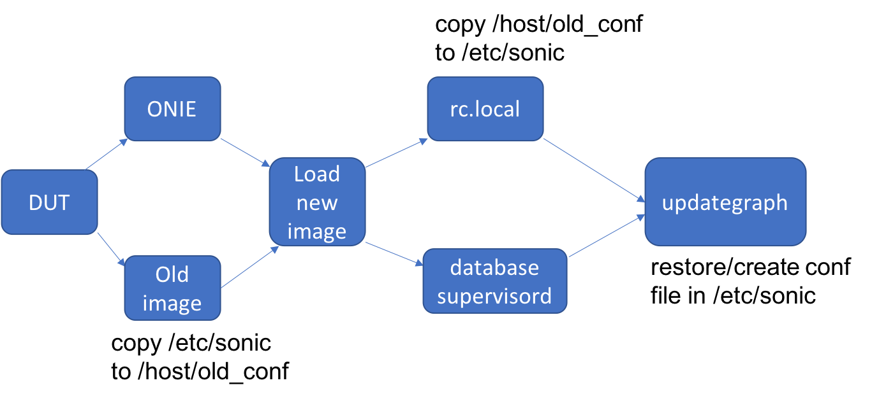
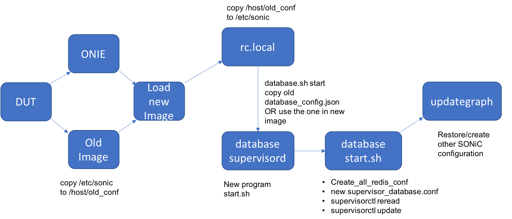

# Support Multiple user-defined redis database instances

## Current implementation

- Single redis database instance for all database tables
- All database configuration files (supervisord.conf, redis.conf, redis.sock. redis.pid and etc.) are generated at compilation. They cannot be modified at runtime
- 

1. DUT try to load a new images
   - [x] if configuration at /etc/sonic/ exists, copy /etc/sonic/ to /host/old_config
2. rc.local service
   - [x] if /host/old_config/ exists, copy /host/old_config/ to /etc/sonic/
   - [x] if no folder /host/old_config/, copy some default xmls and etc.
3. database service
   - [x] database.sh start and docker start according to the configuration
   - [x] check if database is running
4. updategraph service
   - [x] depends on rc.local and database
   - [x] restore /etc/sonic/old_config to /etc/sonic/, if any
   - [x] if no folder /etc/sonic/old_config/, generate config_db.json based on xml and etc.

## New Design

- New Schema used in config_db.json

- 
- DO NOT change the original single redis database instance implementation
  - [x] If we don't have any DATABASE configuration in config_db.json, the default redis database instance is there and behaves the same as what it does today
  - [x] If we have some DATABASE configuration in config_db.json,  besides the default redis database instance, we create these extra database instances, later the users can choose which database instances they want to use according to their configuration in config_db.json (this is the next plan after this, database table related).

- Create required redis database instances based on configuration in config_db.json
- All database related configuration(supervisord.conf, redis.conf, redis.sock, redis.pid and etc.) should be generated at runtime
- 

1. DUT try to load a new images (no changes)
   - [x] if configuration at /etc/sonic/ exists, copy /etc/sonic/ to /host/old_config as usual
2. rc.local service (no changes)
   - [x] if /host/old_config/ exists, copy /host/old_config/ to /etc/sonic/ as usual
   - [x] if no folder /host/old_config/, copy some default xmls and etc. as usual
3. **database service**
   - [x] **make database service depends on rc.local service since database needs to access old_config/config_db.json to get DATABASE configuration earlier**
   - [x] **database.sh start**
     - [x] **access and copy /etc/sonic/old_config/config_db.json earlier into /etc/sonic/**
     - [x] **If there is no old_config folder, we take it as no extra DATABASE requirement  and create a empty "{}" config_db.json to pass.**
     - [x] **generate corresponding runtime ping/PONG check script as well to check if database instances are running later**
   - [x] **docker ENTRYPOINT : docker_init.sh**
     - [x] **at this point, we know the DATABASE configuration in config_db.json**
     - [x] **generate supervisord.conf and all redis.conf before database docker start**
     - [x] **exec supervisord**
   - [x] **supervisord**
     - [x] **start database programs after all runtime configuration are generated**
   - [x] **check if database instances are running via ping/PONG check script**
4. updategraph service (no changes)
   - [x] depends on rc.local and database
   - [x] restore /etc/sonic/old_config to /etc/sonic/, if any
   - [x] if no folder /etc/sonic/old_config/, generate config_db.json based on xml and etc.
   - [x] config_db.json file, if any, created via database service will be overwritten here

## Next Step After Above Design

If above design is OK, later we will add database table information in DATABASE entry for each redis instances along with the port. For application level, we will create a new API/Class to return corresponding database instance information if input table name/id is given. Then we use this database instance information for all existing database construction codes like DBConnector() for both Python and C++. Will post detail if above design has no problem.