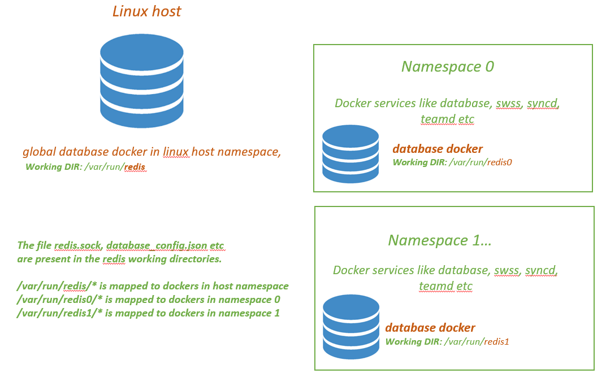

# Support redis databases in multiple namespaces

## Design

The existing Multi-DB design approach needs to be extended to address the cases where a sonic device will have multiple ASICs( NPUs ). Each NPU will have a network namespace created in linux host and services like database, swss, syncd etc running in the namespace.

## The Multi NPU/namespace architecture 

In the mulit NPU architecture, there is a database docker service started in the linux host, we call this the "global DB" service. The redis database spawned by this service is run in the linux host network namespace and stores the system wide attributes like AAA, syslog, ASIC to interface name mapping etc. There will be additional network namespaces created and it would match the number of NPU's in the system. Each namespace will have the services to create docker instances for database, swss, syncd, teamd, bgp etc.

There will be a config_db.json file per database service, the naming would be config_db.json for the "global DB" and config_db{NS}.json for the database service in the {NS} namespace.

## Enhancements to Multi-DB design to support Multiple namespaces
In the current multi-DB approach, the file database_config.json contains the startup configuration used to dictate the redis server host/port/unix_socket configurations + various available databases ( eg: APP_DB, CONFIG_DB ).

With the introduction of multiple namespaces, there is a need for separate database_config.json per namespace. This config file is created in the "working redis directories" by the database docker service startup sequence. 

The database docker service for namespace {NS} will use the /var/run/redis{NS} as the "working redis directory" to create the various files like redis.sock, sonic-db/database_config.json etc. For "globalDB" database service it would be /var/run/redis.
	


Following are the major design changes

* The startup config file database_config.json is modified to have 'local' DB instances + external references to the database instances present (if any) in database dockers running in other network namesapces. There are a few new attributes viz. 

	* "EXT_DB_REFS" to store external database_config.json file references. Each EXT_DB_REFS entry will contain the 
	  "namespaceID" along with the "path" attributue which is the file location of database_config.json. 
	  The EXT_DB_REFS attribute will be generated from the database_config.json.j2 template file at run time based on 
	  the number of namespaces created in the device.

	* "MAX_NS_INSTANCES" to store the maximum number of external database config file references.

This is an example of the database_config.json with 3 external DB references in 3 namespaces refered with namespaceID "0", "1" & "2".

    ```jinja
    {
        "INSTANCES": {
            "redis":{
                "hostname" : "127.0.0.1",
                "port" : 6379,
                "unix_socket_path" : "/var/run/redis/redis.sock"
            }
        },
        "DATABASES" : {
        "APPL_DB" : {
            "id" : 0,
            "separator": ":",
            "instance" : "redis"
        },
        "ASIC_DB" : {
            "id" : 1,
            "separator": ":",
            "instance" : "redis"
        },
        .......
        },
	"MAX_NS_INSTANCES" : 3,
	"EXT_DB_REFS" : {
            "0" : {
                "path": "/var/run/redis0/sonic-db/database_config.json"
                   },
            "1" : {
                "path": "/var/run/redis1/sonic-db/database_config.json"
                   },
            "2" : {
                "path": "/var/run/redis2/sonic-db/database_config.json"
                   } 
            },
        "VERSION" : "1.1"
    }
    ```

* The database_config.json is made as a j2 template file with namespaceID and EXT_DB_REF count as arguments.

{NS} is the namespaceID and will be passed as argument to docker create in the /usr/bin/database.sh systemd startup script. This ID is passed to the docker ENTRYPOINT "docker-database-init.sh".

The other argument we pass is the DB_REF_CNT for the EXT redis server references. It is significant for the "global DB" database service running in the linux host namespace, the DB_REF_CNT will be equal to the number of namespaces in the device. Currently we have a ASIC:namespace mapping of 1:1, and hence we pass the DB_REF count to be the number of NPU's.

     ```jinja
    {
        "INSTANCES": {
            "redis":{
                "hostname" : "127.0.0.1",
                "port" : 6379,
                "unix_socket_path" : "/var/run/redis{NS}/redis.sock"
            }
        },
        "DATABASES" : {
        "APPL_DB" : {
            "id" : 0,
            "separator": ":",
            "instance" : "redis"
        },
        "ASIC_DB" : {
            "id" : 1,
            "separator": ":",
            "instance" : "redis"
        },
        .......
        },
       
       
           "MAX_NS_INSTANCE" : {{db_ref}},
           "EXT_DB_REFS" : {
       
           "{{ns}}" : {
               "path": "/var/run/redis{{ns}}/sonic-db/database_config.json"
           },
       
    },
    
        "VERSION" : "1.0"
    }
    ```

* In the database Docker ENTRYPOINT script "docker-database-init.sh", the database_config.json file is generated using the above j2 template and saved into the "working redis directory" /var/run/redis{NS}/sonic-db/. 

* The users can specify a customized database startup config, for which they need to create a database_config{NS}.json file in /etc/sonic/ directory. {NS} would be the namespace ID. If this file is present, it would be copied to /var/run/redis{NS}/sonic-db/ instead of generating it from j2 template.

## New Design of Python Interface: SonicDBConfig()

The SonicDBConfig object needs to be enhanced to parse the new attributes EXT_DB_REFS, MAX_NS_INSTANCES added to database_config.json. The _sonic_db_config is made into a dictionary. All the functions this class provides will have a new argument "ns_instance" which is the namespace ID. 

The load_db_config() will load the database_config.json specified at SONIC_DB_CONFIG_FILE, save the DB instance's defined locally in instance 'local', and the database_config.json's defined in EXT_DB_REFS in the namespaceID instances.

```python

class SonicDBConfig(object):
    _sonic_db_config_init = False
    _sonic_db_config = {}
    _sonic_db_connections = 0

    @staticmethod
    def load_sonic_db_config():
        """
        Parse and load the database_config.json
        The attributes 'INSTANCES' and 'DATABASES' will be considered as 'local'
        The attribute 'EXT_DB_REFS' will be parsed and the corresponding database_config.json ill be loaded at the 
        namespace ID specfied.
        """
        SONIC_DB_CONFIG_FILE = "/var/run/redis/sonic-db/database_config.json"
        if SonicDBConfig._sonic_db_config_init == True:
            return

        try:
            if os.path.isfile(SONIC_DB_CONFIG_FILE) == False:
                msg = "'{}' is not found, it is not expected in production devices!!".format(SONIC_DB_CONFIG_FILE)
                logger.warning(msg)
                SONIC_DB_CONFIG_FILE = os.path.join(os.path.dirname(os.path.abspath(__file__)), 'config', 'database_config.json')
            with open(SONIC_DB_CONFIG_FILE, "r") as read_file:
                SonicDBConfig._sonic_db_config['local'] = json.load(read_file)
                if 'EXT_DB_REFS' in SonicDBConfig._sonic_db_config['local'].keys():
                    ext_dbs = SonicDBConfig._sonic_db_config['local']['EXT_DB_REFS']
                    for ref in ext_dbs:
                        db_config_file = ext_dbs[ref]['path']
                        SonicDBConfig._sonic_db_config[ref] = None
                        if os.path.isfile(db_config_file) == False:
                            msg = "'{}' is not found, it is not expected in production devices!!".format(db_config_file)
                            logger.warning(msg)
                        with open(db_config_file, "r") as read_file:
                            SonicDBConfig._sonic_db_config[ref] = json.load(read_file)
                    SonicDBConfig._sonic_db_connections = SonicDBConfig._sonic_db_config['local']['MAX_NS_INSTANCE']
        except (OSError, IOError):
            msg = "Could not open sonic database config file '{}'".format(SONIC_DB_CONFIG_FILE)
            logger.exception(msg)
            raise RuntimeError(msg)

        SonicDBConfig._sonic_db_config_init = True

   @staticmethod
    def db_name_validation(db_name, ns_instance):
        if SonicDBConfig._sonic_db_config_init == False:
            SonicDBConfig.load_sonic_db_config()
        data=SonicDBConfig._sonic_db_config[ns_instance]["DATABASES"]
        if db_name not in data.keys():
            msg = "{} is not a valid database name in configuration file".format(db_name)
            logger.exception(msg)
            raise RuntimeError(msg)

    @staticmethod
    def inst_name_validation(inst_name, ns_instance):
        if SonicDBConfig._sonic_db_config_init == False:
            SonicDBConfig.load_sonic_db_config()
        if inst_name not in SonicDBConfig._sonic_db_config[ns_instance]["INSTANCES"]:
            msg = "{} is not a valid instance name in configuration file".format(inst_name)
            logger.exception(msg)
            raise RuntimeError(msg)

    @staticmethod
    def get_dblist(ns_instance):
        if SonicDBConfig._sonic_db_config_init == False:
            SonicDBConfig.load_sonic_db_config()
        return SonicDBConfig._sonic_db_config[ns_instance]["DATABASES"].keys()

    # This will return the number of external db connections 
    @staticmethod
    def get_dbNumConnections():
        if SonicDBConfig._sonic_db_config_init == False:
            SonicDBConfig.load_sonic_db_config()
        return SonicDBConfig._sonic_db_connections

```

## New Design of Python Interface: SonicV2Connector()

The SonicV2Connector class will be extended to handle multiple DB connections by storing the DBInterface objects and redis clients as dictionaries. An additional parameter "namespace" is added to  SonicV2Connector API's.

The "namespace" argument is the namespace instance ID and will take the following values
	* "local", it connects to the local instance of "db_name".
	* <0...n>, any value between 0 and n, it connects to "db_name" instance in that namespace as per the EXT_DB_REFs.
	* "all", [default] it connects to all "db_name" databases both local and in all namespaces added in EXT_DB_REFs.
    
The changes to SonicV2Connector is made in such a way that, if we don't pass any arguments in connect(), the current behaviour of connecting to the localDB instances will be maintained. The use_unix_socket_path is set to True by default.

```python
class SonicV2Connector(DBInterface):
    def __init__(self, use_unix_socket_path=True, **kwargs):
        self.db_intfs = {}
        self.clients = {}
        self.connections = self.get_db_num_connections()

        if self.check_instance_valid('local'):
            self.db_intfs['local'] = DBInterface(**kwargs)

        for i in range(self.connections):
            if self.check_instance_valid(str(i)):
                self.db_intfs[str(i)] = DBInterface(**kwargs)
            else:
                self.db_intfs[str(i)] = None

        self.use_unix_socket_path = use_unix_socket_path

        """
        Commenting this out as I am not seeing the benefit now in case of multiple instance
        for db_name in self.get_db_list():
            #set a database name as a constant value attribute.
            setattr(self, db_name, db_name)
        """

    def db_connect(self, db_name, retry_on=True, instance='all'):
        if self.check_instance_valid(instance) == False:
            self.clients[instance] = None
            return

        if self.use_unix_socket_path:
            self.db_intfs[instance].redis_kwargs["unix_socket_path"] = self.get_db_socket(db_name, instance)
            self.db_intfs[instance].redis_kwargs["host"] = None
            self.db_intfs[instance].redis_kwargs["port"] = None
        else:
            self.db_intfs[instance].redis_kwargs["host"] = self.get_db_hostname(db_name, instance)
            self.db_intfs[instance].redis_kwargs["port"] = self.get_db_port(db_name, instance)
            self.db_intfs[instance].redis_kwargs["unix_socket_path"] = None

        db_id = self.get_dbid(db_name, instance)
        self.db_intfs[instance].connect(db_id, retry_on)
        self.clients[instance] = self.db_intfs[instance].get_redis_client(db_id)

    """
    Connect to the DB instance specified by the namespace parameter in database_config.json file.
    if namespace="local", it connects to the local instance of "db_name".
    if namespace=<0...n>, any value between 0 and n,
                          it connects to "db_name" instance in that namespace as per the EXT_DB_REFs.
    if namespace="all", it connects to the global instance of "db_name" + namespace <0..n> as present in EXT_DB_REFs.
    """
    def connect(self, db_name, retry_on=True, namespace='all'):
        if namespace == 'all':
	    # Explicitly connect to the 'local' db instance and the ones if present in EXT_DB_REF
            self.db_connect(db_name, retry_on, 'local')
            for ns_idx in range(self.connections):
                self.db_connect(db_name, retry_on, str(ns_idx))
        else:
            self.db_connect(db_name, retry_on, namespace)

    def get_db_separator(self, db_name, namespace):
        return SonicDBConfig.get_separator(db_name, namespace)

    # This will return the number of external db connections 
    def get_db_num_connections(self):
        return SonicDBConfig.get_dbNumConnections()

    def get_redis_client(self, db_name, namespace):
        db_id = self.get_dbid(db_name, namespace)
        return self.db_intfs[namespace].get_redis_client(db_id)

    def get_redis_clients(self):
        return self.clients

    def get_redis_client_instances(self):
        return self.clients.keys()

```
    
## New Design of Python Interface: ConfigDBConnector()

The ConfigDBConnector class inherits the enhanced SonicV2Connector class. The API's here will be enhanced to loop through all the redis clients for various operations like get/set/mod/delete. An additional parameter "namespace" is added to ConfigDBConnector API's

The "namespace" argument is the namespace instance ID and will take the following values
	* "local", it connects to the local instance of "db_name".
	* <0...n>, any value between 0 and n, it connects to "db_name" instance in that namespace as per the EXT_DB_REFs.
	* "all", [default] it connects to all "db_name" databases both local and in all namespaces added in EXT_DB_REFs.

The changes to ConfigDBConnector is made in such a way that, if we don't pass any arguments in connect(), the current behaviour of connecting to the localDB instances will be maintained. The use_unix_socket_path is set to True by default.

```python
class ConfigDBConnector(SonicV2Connector):

    INIT_INDICATOR = 'CONFIG_DB_INITIALIZED'
    KEY_SEPARATOR = '|'

    # The table/key separator for different connections.
    separators = {}

    def __init__(self, **kwargs):
        # By default, connect to Redis through TCP, which does not requires root.
        if len(kwargs) == 0:
            kwargs['host'] = '127.0.0.1'
        super(ConfigDBConnector, self).__init__(use_unix_socket_path=True, **kwargs)
        self.handlers = {}

    def __wait_for_db_init(self):
        instances = self.get_redis_client_instances()
        for instance in instances:
            client = self.get_redis_client(self.db_name, instance)
            if client == None:
                continue;

            pubsub = client.pubsub()
            initialized = client.get(self.INIT_INDICATOR)
            if not initialized:
                pattern = "__keyspace@{}__:{}".format(self.get_dbid(self.db_name, instance), self.INIT_INDICATOR)
                pubsub.psubscribe(pattern)
                for item in pubsub.listen():
                    if item['type'] == 'pmessage':
                        key = item['channel'].split(':', 1)[1]
                        if key == self.INIT_INDICATOR:
                            initialized = client.get(self.INIT_INDICATOR)
                            if initialized:
                                break
                pubsub.punsubscribe(pattern)

    def cfg_db_connect(self, dbname, wait_for_init=False, retry_on=False, namespace='all'):
        self.db_name = dbname

        # Set the separators for 'local' instances as well are that for EXT_DB_REFs as per database_config file.
        if(SonicV2Connector.check_instance_valid(self, 'local')):
            ConfigDBConnector.separators['local'] = self.get_db_separator(self.db_name, 'local')
        for ns_idx in range(self.connections):
            if(SonicV2Connector.check_instance_valid(self, str(ns_idx))):
                ConfigDBConnector.separators[str(ns_idx)] = self.get_db_separator(self.db_name, str(ns_idx))
            else:
                ConfigDBConnector.separators[str(ns_idx)] = '|'

        SonicV2Connector.connect(self, self.db_name, retry_on, namespace)
        if wait_for_init:
            self.__wait_for_db_init()

    """
    Connect to the DB instance specified by the namespace parameter in database_config.json file.
    if namespace="local", it connects to the local instance of "db_name".
    if namespace=<0...n>, any value between 0 and n,
                          it connects to "db_name" instance in that namespace as per the EXT_DB_REFs.
    if namespace="all", it connects to the global instance of "db_name" + namespace <0..n> as present in EXT_DB_REFs.
    """
    def connect(self, wait_for_init=True, retry_on=False, namespace='all'):
        self.cfg_db_connect('CONFIG_DB', wait_for_init, retry_on, namespace)

    def get_entry(self, table, key, namespace='all'):
        """Read a table entry from config db.
        Args:
            table: Table name.
            key: Key of table entry, or a tuple of keys if it is a multi-key table.
        Returns: 
            Table row data in a form of dictionary {'column_key': 'value', ...}
            Empty dictionary if table does not exist or entry does not exist.
        """
        got_data = {}
        instances = []
        if namespace == 'all':
            instances = self.get_redis_client_instances()
        else:
            instances.append(namespace)

        for instance in instances:
            key = self.serialize_key(key, instance)
            _hash = '{}{}{}'.format(table.upper(), ConfigDBConnector.separators[instance], key)
            client = self.get_redis_client(self.db_name, instance)
            if client == None:
                continue;

            data = self.__raw_to_typed(client.hgetall(_hash))
            if data:
               got_data.update(data)

        return got_data

```

## Sonic unitilities change

The tools like sonic-cfggen will have an additional argument "--namespace" for passing the namespace instance ID.

```python

   parser.add_argument("-ns", "--namespace", help="namespace instance")
    args = parser.parse_args()

    platform = get_platform_info(get_machine_info())

    db_kwargs = {}
    if args.redis_unix_sock_file != None:
        db_kwargs['unix_socket_path'] = args.redis_unix_sock_file

    namespace='local'
    if args.namespace != None:
        namespace = args.namespace

    ........
    
    if args.write_to_db:
        configdb = ConfigDBConnector(**db_kwargs)
        configdb.connect(False, namespace=namespace)
        configdb.mod_config(FormatConverter.output_to_db(data), namespace)

```
Note: There are many other utilities which needs this additional parameter, will be updated in a similar fashion.

## Design of C++ Interface :  DBConnector()
The C++ DBConnector interface is mainly used in the process context of swss/syncd etc in the dockers in their respective namespaces. In the namespaces currently we don't have any external DB refereces, hence not planning to extend the C++ DBConnector to handle multiple database_config.json files.

Will be taken up as the next phase activity to get this class also at par with the python SonicDBConfig/SonicV2Connector modules.
