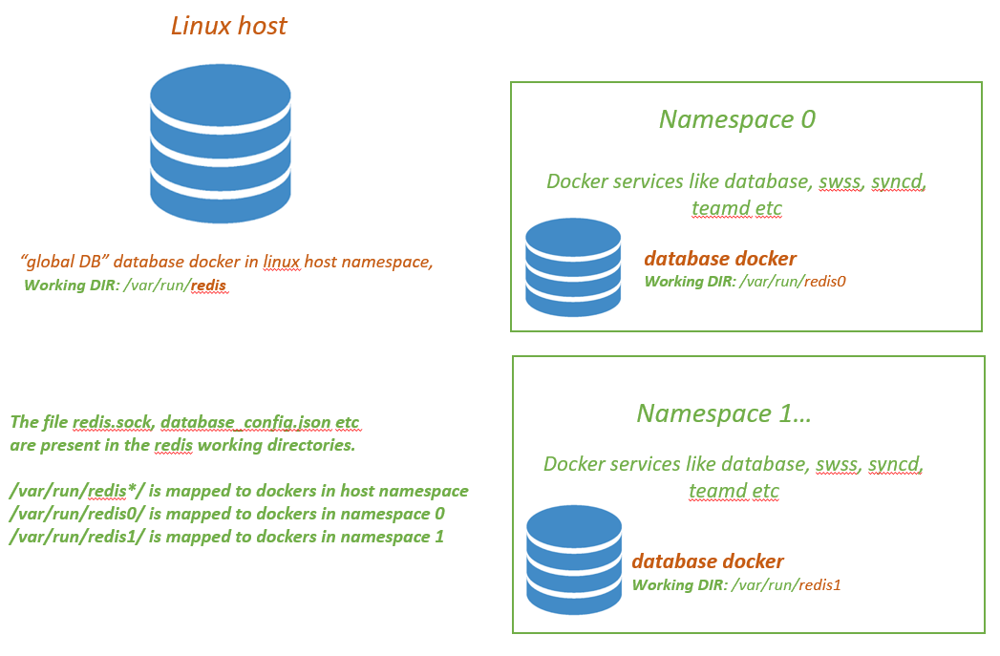

# Support redis databases in multiple namespaces

## Design

The existing Multi-DB design approach needs to be extended to take care of cases where a sonic device have multiple ASICs (NPUs). Each NPU will have a "namespaces" exclusively created and services like database, swss, syncd etc running in that namespace. 

## The Multi NPU/namespace architecture 

In the Multi NPU devices, the services could be broadly classified into

*  Global services like database, snmp, pmon, telemetry running in the dockers running in the linux "host".
   We call it "global" namespace.
	
*  NPU specific services like database, swss, syncd, bgp, teamd, lldp etc which runs in a separate "namespace" created. The method used currently to seggregate services per NPU is "linux network namespace" and there is a one-to-one mapping between the number of NPUs and linux network namesapces created. We call it "NPU" namespace.

The database docker in the "global" namespace can be called the "global DB" service. The redis databases available here (decided by contents of database_config.json) would be APPL_DB, CONFIG_DB used to store the system wide attributes like AAA, syslog, ASIC to interface name mapping etc. 

There are also database docker in the "NPU" namespace. The redis databases there will include all the DB's viz. APPL_DB, CONFIG_DB, ASIC_DB, COUNTERS_DB etc and is used to store the interface/counters/state etc specific to the interfaces/features on that NPU.

This approach is backward compatible to the Sonic devices with single NPU. The "globalDB" service could be considered equivalent to the database docker started in the linux "host" network namespace in single NPU device. We will discuss more on the design details of database docker service in this document.

There will be a config_db.json file per database service, it will be named "/etc/sonic/config_db.json" for the "global DB" and /etc/sonic/config_db{NS}.json for the database service in the {NS} namespace.

## Enhancements to Multi-DB design to support Multiple namespaces

The file database_config.json contains the startup configuration which dictates the redis server host/port/unix_socket configurations + various available databases ( eg: APP_DB, CONFIG_DB ) etc. With the introduction of multiple namespaces, there is a need for separate database_config.json per namespace. This config file is created in the "working redis directories" during the database docker service startup. 

The database service for a NPU linux namespace {NS} will use "/var/run/redis_{NS}" as the "working redis directory" to create the various files like redis.sock, database_config.json etc. The "globalDB" database service would use "/var/run/redis" as the working directory.
	


Following are the major design changes

* A new file **database_global.json** is introduced. It will contain the details of all the namespaces and the corresponsing database_config.json files. This file would be created by the "globalDB" service in the directory "/var/run/redis/sonic-db/". In the below example, we consider a SONIC device with 3 NPUS's and hence have 3 namespaces referred as "asic0", "asic1", "asic2". The first entry refers to the database_config.json file used by database docker running in linux host.

```json
{
    "INCLUDES" : [
        {
            "include" : "../redis/sonic-db/database_config.json"
        },
        {
            "namespace" : "asic0",
            "include" : "../redis0/sonic-db/database_config.json"
        },
        {
            "namespace" : "asic1",
            "include" : "../redis1/sonic-db/database_config.json"
        },
        {
            "namespace" : "asic2",
            "include" : "../redis2/sonic-db/database_config.json"
        }
    ],
    "VERSION" : "1.0"
}
```

* The startup config file **database_config.json** file will have the "INSTANCES"/"DATABASES". 
  The below example is for NPU namespace "asic3".

```json
{
    "INSTANCES": {
        "redis":{
            "hostname" : "127.0.0.1",
            "port" : 6379,
            "unix_socket_path" : "/var/run/redis3/redis.sock"
        }
    },
    "DATABASES" : {
        "APPL_DB" : {
            "id" : 0,
            "separator": ":",
            "instance" : "redis"
        },
        "ASIC_DB" : {
            "id" : 1,
            "separator": ":",
            "instance" : "redis"
        },
        "COUNTERS_DB" : {
            "id" : 2,
            "separator": ":",
            "instance" : "redis"
        },
        "LOGLEVEL_DB" : {
            "id" : 3,
            "separator": ":",
            "instance" : "redis"
        },
        "CONFIG_DB" : {
            "id" : 4,
            "separator": "|",
            "instance" : "redis"
        },
        "PFC_WD_DB" : {
            "id" : 5,
            "separator": ":",
            "instance" : "redis"
        },
        "FLEX_COUNTER_DB" : {
            "id" : 5,
            "separator": ":",
            "instance" : "redis"
        },
        "STATE_DB" : {
            "id" : 6,
            "separator": "|",
            "instance" : "redis"
        },
        "SNMP_OVERLAY_DB" : {
            "id" : 7,
            "separator": "|",
            "instance" : "redis"
        }
    },
    "VERSION" : "1.0"
}
```

* The database_global.json and database_config.json will be j2 template files as shown below. There are certain variables used to generate the json file at runtime. These will be passed as environment variable to docker create in the /usr/bin/database.sh systemd startup script.

   	* {NS} is the namespaceID and will have values ranging "", "0" ..."n" depending on the number of namespaces 
	  in the device. For "global" namespace the ID is empty string. 
	  	  
	* {NS_PREFIX} is the namespace prefix. Currently it is "asic", but could be changes easily as it is being passed 
	  as an environment string on docker create.
	   
	* {NS_REF_CNT} is the count of EXT database docker service references. It is significant for "global DB" service running in 
	  the linux host namespace, the NS_REF_CNT will be equal to the number of namespaces in the device. Currently we have a 
	  NPU:namespace mapping of 1:1, hence we pass the NS_REF_CNT to be the number of NPU's.

  Additional variables to be introduced in future to make this more flexible like creating more redis INSTANCES, assosiating DATABASES to different redis instances etc.

**database_global.json**

```jinja
{ % set ns_ref = NS_REF_CNT|int % }
{
    "INCLUDES" : [ 
        {
            "include" : "../redis/sonic-db/database_config.json"
        },


        {
            "namespace" : "{{PREFIX}}{{ns}}",
            "include" : "../redis{{ns}}/sonic-db/database_config.json"

        }

        },


    ],
    "VERSION" : "1.0"
}

```

**database_config.json**

```jinja
{
    "INSTANCES": {
        "redis":{
            "hostname" : "127.0.0.1",
            "port" : 6379,
            "unix_socket_path" : "/var/run/redis{{NS}}/redis.sock"
        }
    },
    "DATABASES" : {
        "APPL_DB" : {
            "id" : 0,
            "separator": ":",
            "instance" : "redis"
        },

        "ASIC_DB" : {
            "id" : 1,
            "separator": ":",
            "instance" : "redis"
        },
        "COUNTERS_DB" : {
            "id" : 2,
            "separator": ":",
            "instance" : "redis"
        },
        "LOGLEVEL_DB" : {
            "id" : 3,
            "separator": ":",
            "instance" : "redis"
        },

        "CONFIG_DB" : {
            "id" : 4,
            "separator": "|",
            "instance" : "redis"
        },

        "PFC_WD_DB" : {
            "id" : 5,
            "separator": ":",
            "instance" : "redis"
        },
        "FLEX_COUNTER_DB" : {
            "id" : 5,
            "separator": ":",
            "instance" : "redis"
        },

        "STATE_DB" : { 
            "id" : 6,
            "separator": "|",
            "instance" : "redis"
        },
        "SNMP_OVERLAY_DB" : {
            "id" : 7,
            "separator": "|",
            "instance" : "redis"
        }   
    },  
    "VERSION" : "1.0"
}
```

* The redis instance unix socket path is kept unique system wide, so that the applications running in the "host" namespace will be able to talk to DB instances running in any "namespace". The hostname:port is kept local to the "namespace" where the database_config.json belongs and hence the applications running on a different namespace or host cannot talk to the local DB using TCP connect.

* In the database Docker ENTRYPOINT script (docker-database-init.sh), the database_config.json file is generated using the above j2 template and is saved into the "working redis directory" /var/run/redis_{NS}/sonic-db/. 

* The users can specify a customized database startup config, for which they need to create a database_config{NS}.json file in /etc/sonic/ directory. If this file is present, it would be copied to /var/run/redis_{NS}/sonic-db/ instead of generating it from j2 template.

## New Design of Python Interface: SonicDBConfig()

The SonicDBConfig object needs to be enhanced to parse the new attributes to incorporate the namespace approach. The _sonic_db_config is made into a dictionary. All the functions this class provides will have a new argument "namespace". 

There is a few APIs introduced viz. load_sonic_global_db_config(), namespace_validation() etc. The load_sonic_global_db_config() is used to parse the database_global.json file, the namespace_validation() API validates the given namespace using the data populated by load_sonic_global_db_config().

The namespace '' (empty string) is used to refer the local namespace.

```python

class SonicDBConfig(object):
    SONIC_DB_GLOBAL_CONFIG_FILE = "/var/run/redis/sonic-db/database_global.json"
    SONIC_DB_CONFIG_FILE = "/var/run/redis/sonic-db/database_config.json"
    _sonic_db_config_dir = "/var/run/redis/sonic-db"
    _sonic_db_global_config_init = False
    _sonic_db_config_init = False
    _sonic_db_config = {}

    """This is the database_global.json parse and load API. This file has the namespace name and
       the corresponsing database_config.json file. The global file is significant for the
       applications running in the linux host namespace, like eg: config/show cli, snmp etc which
       needs to connect to databases running in other namesacpes. If the "namespace" attribute is not
       specified for an "include" attribute, it referes to the linux host namespace.
    """
    @staticmethod
    def load_sonic_global_db_config(global_db_file_path=SONIC_DB_GLOBAL_CONFIG_FILE):
        """
        Parse and load the global database config json file
        """
        if SonicDBConfig._sonic_db_global_config_init == True:
            return

        if os.path.isfile(global_db_file_path) ==  True:
            global_db_config_dir = os.path.dirname(global_db_file_path)
            with open(global_db_file_path, "r") as read_file:
                all_ns_dbs = json.load(read_file)
                for entry in all_ns_dbs['INCLUDES']:
                    if 'namespace' not in entry.keys():
                        ns = ''
                    else:
                        ns = entry['namespace']

                    # Check if _sonic_db_config already have this namespace present
                    if ns in SonicDBConfig._sonic_db_config:
                       msg = "The database_config for this namespace '{}' is already parsed. !!".format(ns)
                        logger.warning(msg)
                        continue

                    db_include_file = os.path.join(global_db_config_dir, entry['include'])

                    # Not finding the database_config.json file for the namespace
                    if os.path.isfile(db_include_file) == False:
                        msg = "'{}' file is not found !!".format(db_include_file)
                        logger.warning(msg)
                        continue

                    with open(db_include_file, "r") as inc_file:
                        SonicDBConfig._sonic_db_config[ns] = json.load(inc_file)

        SonicDBConfig._sonic_db_global_config_init = True

    @staticmethod
    def load_sonic_db_config(sonic_db_file_path=SONIC_DB_CONFIG_FILE):
        """
        Get multiple database config from the database_config.json
        """
        if SonicDBConfig._sonic_db_config_init == True:
            return

        try:
            if os.path.isfile(sonic_db_file_path) == False:
                msg = "'{}' is not found, it is not expected in production devices!!".format(sonic_db_file_path)
                logger.warning(msg)
                sonic_db_file_path = os.path.join(os.path.dirname(os.path.abspath(__file__)), 'config', 'database_config.json')
            with open(sonic_db_file_path, "r") as read_file:
                # The database_config.json is loaded into the '' index, which referes to the local namespace.
                SonicDBConfig._sonic_db_config[''] = json.load(read_file)
        except (OSError, IOError):
            msg = "Could not open sonic database config file '{}'".format(sonic_db_file_path)
            logger.exception(msg)
            raise RuntimeError(msg)
        SonicDBConfig._sonic_db_config_init = True

    @staticmethod
    def namespace_validation(namespace):
        # Load global config if the namespace is an external one.
        if namespace != '' and SonicDBConfig._sonic_db_global_config_init == False:
            SonicDBConfig.load_sonic_global_db_config()
        if SonicDBConfig._sonic_db_config_init == False:
            SonicDBConfig.load_sonic_db_config()
        if namespace not in SonicDBConfig._sonic_db_config:
            msg = "{} is not a valid namespace name in configuration file".format(namespace)
            logger.warning(msg)
            raise RuntimeError(msg)

    @staticmethod
    def db_name_validation(db_name, namespace=''):
        if SonicDBConfig._sonic_db_config_init == False:
            SonicDBConfig.load_sonic_db_config()
        SonicDBConfig.namespace_validation(namespace)
        db=SonicDBConfig._sonic_db_config[namespace]["DATABASES"]
        if db_name not in db:
            msg = "{} is not a valid database name in configuration file".format(db_name)
            logger.warning(msg)
            raise RuntimeError(msg)
```

## New Design of Python Interface: SonicV2Connector()

The SonicV2Connector class will be extended to connect to the Database in a particular namespace. The additional argument "namespace" can be passed while creating the class instance. The default value is '', if the user didn't specify a namespace explicitly and it connects to the DB in the local namespace (namespace where we are running the script which uses this class )

The changes to SonicV2Connector is made in such a way that, if we don't pass any namespace argument, the existing behaviour is maintained. The use_unix_socket_path is set to False by default.

```python

class SonicV2Connector(DBInterface):
    def __init__(self, use_unix_socket_path=False, namespace='', **kwargs):
        super(SonicV2Connector, self).__init__(**kwargs)
        self.use_unix_socket_path = use_unix_socket_path
        self.namespace = namespace

        """If the user don't give the namespace as input, it takes the default value of ''
           '' (empty string) referes to the local namespace where this class is used.
           (It could be a network namespace or linux host namesapce)
        """
        if not isinstance(namespace, str):
            msg = "{} is not a valid namespace name".format(namespace)
            logger.warning(msg)
            raise RuntimeError(msg)

        # The TCP connection to a DB in another namespace in not supported.
        if namespace != '' and use_unix_socket_path == False:
            message = "TCP connectivity to the DB instance in a different namespace is not implemented!"
            raise NotImplementedError(message)

        for db_name in self.get_db_list():
            # set a database name as a constant value attribute.
            setattr(self, db_name, db_name)
```

## New Design of Python Interface: ConfigDBConnector()

The ConfigDBConnector class will also be be extended to connect to the Database in a particular namespace. The additional argument "namespace" can be passed while creating the class instance. This will be used to init the parent class SonicV2Connector for the required namespace. The default value is '', if the user didn't specify a namespace explicitly and it connects to the DB in the local namespace.

## Updates to the sonic-utilities

The sonic-utilities like sonic-db-cli, sonic-cfggen, db_migrator etc and the scripts which is used in the show/config commands eg: portconfig needs to support the namespace as an argument. A sample change as shown below.

If the user specifies a namespace, this utility uses the unix_socket_path and connects to the database instance in that namespace, else it uses the TCP socket to connect to a local DB.

```git
+            if args.namespace is None:
+                dbconn = swsssdk.SonicV2Connector()
+            else:
+                dbconn = swsssdk.SonicV2Connector(use_unix_socket_path=True, namespace=args.namespace)
+            dbconn.connect(args.database)
+        except RuntimeError:
+            msg = "Invalid database name input : {}".format(args.database)
+            print >> sys.stderr, msg

```

## Design of C++ Interface :  DBConnector()
The C++ DBConnector interface needs to be extended to parse the database_global.json file to get the mapping of namespaces to their respective database_config.json files.

## Upgrade, Downgrade

The database_config.json file would be created on bootup based on various parameters like the namespace, number of NPUs etc. Hence it should not dependent on the earlier version of database_config.json file on upgrade/downgrade.
