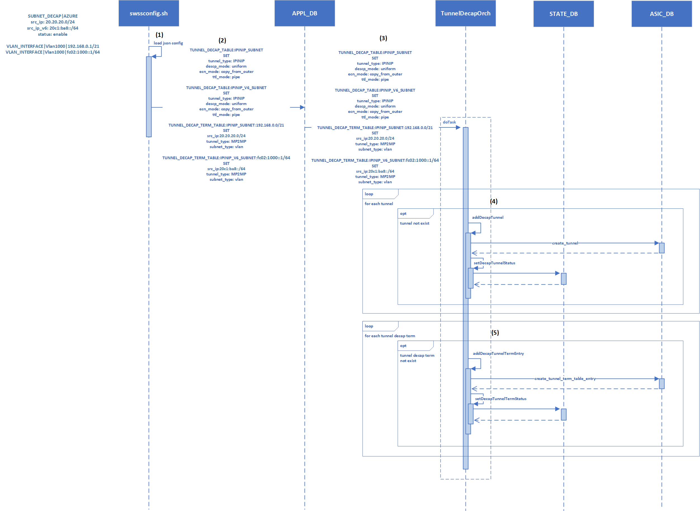
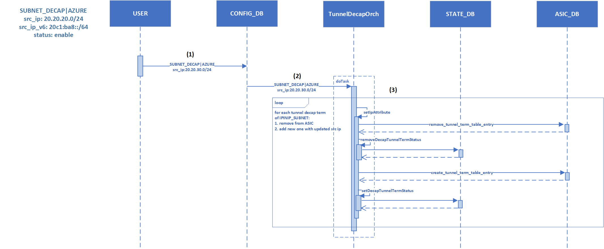

# Subnet Decapsulation with SONiC

## High Level Design Document

## Table of Content

- [Subnet Decapsulation with SONiC](#subnet-decapsulation-with-sonic)
  - [High Level Design Document](#high-level-design-document)
  - [Table of Content](#table-of-content)
  - [1 Revision](#1-revision)
  - [2 Scope](#2-scope)
  - [3 Definitions/Abbreviations](#3-definitionsabbreviations)
  - [4 Overview](#4-overview)
  - [5 Requirement](#5-requirement)
    - [5.1 Functional Requirements](#51-functional-requirements)
    - [5.2 Scalability Requirements](#52-scalability-requirements)
  - [6 Module Design](#6-module-design)
    - [6.1 Tunnel Specification](#61-tunnel-specification)
    - [6.2 DB Schema](#62-db-schema)
      - [6.2.1 CONFIG\_DB](#621-config_db)
      - [6.2.2 APPL\_DB](#622-appl_db)
      - [6.2.3 STATE\_DB](#623-state_db)
    - [6.3 Orchestration Agent](#63-orchestration-agent)
    - [6.4 VLAN Subnet Decap](#64-vlan-subnet-decap)
      - [6.4.1 VLAN Subnet Decap Rule Generation](#641-vlan-subnet-decap-rule-generation)
      - [6.4.2 Dual-ToR Considerations](#642-dual-tor-considerations)
      - [6.4.3 Netscan VLAN Subnet Probing](#643-netscan-vlan-subnet-probing)
    - [6.5 Subnet Decap Configuration Workflow](#65-subnet-decap-configuration-workflow)
    - [6.6 CLI](#66-cli)
  - [7 Warm Reboot Support](#7-warm-reboot-support)
  - [8 Test Plan](#8-test-plan)

## 1 Revision

|  Rev  |    Date    |    Author     | Change Description |
| :---: | :--------: | :-----------: | ------------------ |
|  0.1  | 03/30/2024 | Longxiang Lyu | Initial version    |

## 2 Scope

This document describes the subnet decapsulation feature on T0 SONiC that allows Netscan to probe VLAN subnet IP addresses.

## 3 Definitions/Abbreviations

| Term    | Meaning                                       |
| ------- | --------------------------------------------- |
| VLAN    | virtual local area network                    |
| DIP     | destination IP                                |
| SIP     | source IP                                     |
| Netscan | Azure service to detect network path failures |

## 4 Overview

In Azure, Netscan probes the network paths/devices by sending IPinIP traffic. The IPinIP packet crafted by the Netscan sender has the outer DIP equals the destination device Loopback address, and the inner DIP equals the IP address of the Netscan sender. When the IPinIP packet is routed to/received by the destination device, they will be decapsulated and the inner packet will be routed back to the Netscan sender. With this probing, the Netscan sender has the awareness of any network link/device issues in the probe path by checking the receivement of the inner packets.
As of today, Netscan uses this IP-decap based probing to detect route blackholes in the Azure network. The limitation is that Netscan is only able to probe the networking switches without the capability to detect any route blackholes for host nodes, especially VLAN subnet IPs. Due to the fact that the host nodes don’t have native IP-decap functionality, it is more appropriate to implement the IP-decap functionality on T0 SONiC as SONiC supports IPinIP decapsulation, and T0 SONiC will respond to the Netscan probes on behalf of the host nodes to decapsulate the Netscan IPinIP probe packets with DIP as any VLAN subnet IPs.
In this design, subnet decap is introduced to enhance SONiC with the capability to generate the decap rules for the VLAN subnet so IPinIP packets from Netscan with DIP as either VLAN subnet IPs could be decapsulated and forwarded back to the Netscan sender to allow Netscan to have the awareness of any possible route blackholes to those destinations.

## 5 Requirement

### 5.1 Functional Requirements

High level requirements:

- T0 SONiC shall allow Netscan to probe with IPinIP packets with DIP as any local VLAN subnet IP by adding IP decap rules for the VLAN subnet.

### 5.2 Scalability Requirements

| Component          | Expected Value |
| ------------------ | -------------- |
| Tunnel             | N/A            |
| Tunnel Decap Terms | N/A            |

## 6 Module Design

To support the Netscan probing over VLAN subnet, SONiC needs to generate decapsulation rules to decapsulate IPinIP packets with DIP as any IP address in VLAN subnet. The decapsulation rules will be generated based on the configured VLAN subnet.
In this design, we propose the subnet decap feature that has workflow to enable SONiC to add/remove those decapsulation rules based on the configured VLAN subnets on the T0 SONiC.

### 6.1 Tunnel Specification

The tunnels in this design will be generated with the following attributes:
| Attribute       | Value                             | Note                             |
| --------------- | --------------------------------- | -------------------------------- |
| name            | IPINIP_SUBNET or IPINIP_V6_SUBNET | One IPv4 tunnel, one IPv6 tunnel |
| tunnel type     | IPinIP                            |                                  |
| decap ECN mode  | copy_from_outer or standard       |                                  |
| decap TTL mode  | pipe                              |                                  |
| decap DSCP mode | uniform                           |                                  |

The decapsulation termination entry will be created with the following attributes:
| Attribute       | Value                               | Note                                                                                                                     |
| --------------- | ----------------------------------- | ------------------------------------------------------------------------------------------------------------------------ |
| term entry type | MP2MP                               | multi-point to multi-point                                                                                               |
| dest IP         | the VLAN subnet                     |                                                                                                                          |
| dest IP mask    | the vlan subnet mask                |                                                                                                                          |
| source IP       | Netscan privately-owned subnet      | IPinIP packets that have source IP in the subnet can be safely assumed to be Netscan traffic instead of customer traffic |
| source IP mask  | Netscan privately-owned subnet mask |                                                                                                                          |

### 6.2 DB Schema

#### 6.2.1 CONFIG_DB

```
### SUBNET_DECAP
    ; Stores subnet based decapsulation configurations
    key                 = SUBNET_DECAP|config_name
    status              = "enable"/"disable"                            ; status of subnet based decapsulation
    src_ip              = source IP prefix                              ; source IP prefix used for tunnel
    src_ip_v6           = source IP prefix                              ; source IPv6 prefix used for tunnel_v6
    vlan                = list of enable VLAN                           ; comma separated list of VLANs to enable
                                                                        ; subnet decap, if status is enable and this
                                                                        ; list is empty, subnet decap will apply to
                                                                        ; all VLANs
```

#### 6.2.2 APPL_DB

```
### TUNNEL_DECAP_TABLE
    ; Stores a list of decap tunnels
    key                 = TUNNEL_DECAP_TABLE:tunnel_name                ; tunnel name as key
    tunnel_type         = "IPINIP"                                      ; tunnel type
    dscp_mode           = "uniform"/"pipe"
    ecn_mode            = "copy_from_outer"/"standard"
    ttl_mode            = "uniform"/"pipe"
    encap_ecn_mode      = "standard"

### TUNNEL_DECAP_TERM_TABLE
    ; Stores a list of decap terms.
    key                 = TUNNEL_DECAP_TERM_TABLE:tunnel_name:dst_ip    ; tunnel name:dst IP prefix as key
    term_type   	      = "P2P"/"P2MP"/"MP2MP"                          ; tunnel decap term type
    src_ip              = source IP prefix                              ; for decap terms of subnet decap, the
                                                                        ; source IP is omitted
    subnet_type         = "vlan"/"vip"                                  ; the subnet type of the dst IP prefix, present
                                                                        ; if this is a subnet decap term
```

#### 6.2.3 STATE_DB

```
### TUNNEL_DECAP_TABLE
    ; Stores a list of created decap tunnels
    key                 = TUNNEL_DECAP_TABLE:tunnel_name                ; tunnel name as key
    tunnel_type         = "IPINIP"                                      ; tunnel type
    dscp_mode           = "uniform"/"pipe"
    ecn_mode            = "copy_from_outer"/"standard"
    ttl_mode            = "uniform"/"pipe"
    encap_ecn_mode      = "standard"

### TUNNEL_DECAP_TERM_TABLE
    ; Stores a list of created decap terms.
    key                 = TUNNEL_DECAP_TERM_TABLE:tunnel_name:dst_ip    ; tunnel name:dst IP prefix as key
    term_type           = "P2P"/"P2MP"/"MP2MP"                          ; tunnel decap term type
    src_ip              = source IP prefix
    subnet_type         = "vlan"/"vip"                                  ; the subnet type of the dst IP prefix, present
                                                                        ; if this is a subnet decap term
```

### 6.3 Orchestration Agent

The following orchestration agents shall be modified:
TunnelDecapOrch:

- TunnelDecapOrch shall subscribe to TUNNEL_DECAP_TABLE and create/remove the decap tunnels.

- TunnelDecapOrch shall subscribe to TUNNEL_DECAP_TERM_TABLE and create/remove the decap term entries.

- TunnelDecapOrch shall subscribe to SUBNET_DECAP and handle the tunnel decapsulation termination entry source IP changes.

### 6.4 VLAN Subnet Decap

#### 6.4.1 VLAN Subnet Decap Rule Generation



The VLAN subnet decap workflow is presented in the above figure. The extra tunnels and decap rules are templated-out and pushed to APPL_DB by swssconfig service if VLAN subnet decap is enabled. TunnelDecapOrch subscribes to both TUNNEL_DECAP_TABLE and TUNNEL_DECAP_TERM_TABLE and processes the request to program the decap rules to SYNCD accordingly.

#### 6.4.2 Dual-ToR Considerations

For Dual-ToR, both ToRs are configured with the same VLAN setup, so they all have the same decap rules. As the downstream traffic from T1s are ECMPed to either ToR, the IPinIP packets to VLAN subnet IPs from Netscan received by either ToR could be decapsulated and forwarded back to the Netscan sender.

#### 6.4.3 Netscan VLAN Subnet Probing


### 6.5 Subnet Decap Configuration Workflow

TunnelDecapOrch subscribes to the SUBNET_DECAP table and reacts to subnet decap configuration change. Currently, only source IP and source IPv6 prefix change are supported and TunnelDecapOrch will change the decapsulation termination entry source IP according to the configuration change.

The following picture describes the workflow:



### 6.6 CLI

* `show tunnel brief`: lists out the tunnels created.

```
# show tunnel
Tunnel Name       Type    Dscp Mode    ECN Mode         TTL Mode
----------------  ------  -----------  ---------------  ----------
IPINIP_TUNNEL     IPINIP  uniform      copy_from_outer  pipe
IPINIP_V6_TUNNEL  IPINIP  uniform      copy_from_outer  pipe
IPINIP_SUBNET     IPINIP  uniform      copy_from_outer  pipe
IPINIP_V6_SUBNET  IPINIP  uniform      copy_from_outer  pipe
```

* `show tunnel decap`: lists out the tunnel decap terms created.

```
Dst IP         Src IP         Tunnel Name    Decap Term Type
-------------  -------------  -------------  -----------------
192.168.0.1    N/A            IPINIP_TUNNEL  P2MP
10.10.10.0/24  20.20.20.0/24  IPINIP_SUBNET  MP2MP
```

## 7 Warm Reboot Support

Currently, SONiC doesn’t load `ipinip.json` after warm-reboot. As two new subnet decap tunnels (`IPINIP_SUBNET` and `IPINIP_V6_SUBNET`) are introduced by this design, `swssconfig.sh` shall be enhanced to write only those two extra tunnel entries from `ipinip.json` to APPL_DB TUNNEL_DECAP_TABLE without making duplicated writes to existing tunnels after warm-reboot.

## 8 Test Plan

The test plan will be added later based on the requirement.
