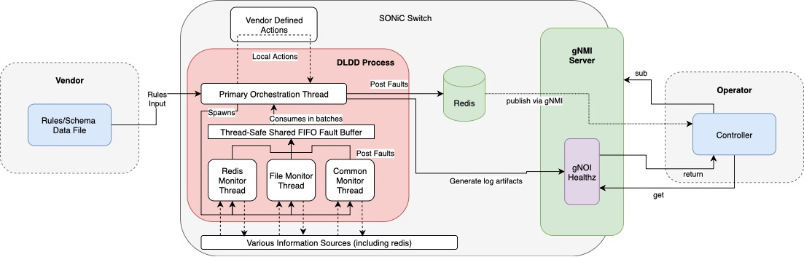

# Device Local Diagnosis Service HLD

## Table of Contents

- [Document History](#document-history)
- [Scope](#scope)
- [Terminology](#terminology)
- [Requirements](#requirements)
- [High-Level Design](#high-level-design)
- [Detailed Design](#detailed-design)
- [Telemetry and Diagnostics](#telemetry-and-diagnostics)
- [Configuration Management](#configuration-management)
- [File Management and Rule Updates](#file-management-and-rule-updates)
- [Integration Points](#integration-points)
- [Testing and Validation](#testing-and-validation)
- [Restrictions and Limitations](#restrictions-and-limitations)
- [References](#references)

## Introduction

The Device Local Diagnosis (DLD) Service is a daemon running on SONiC switches that consumes vendor-provided rules, executes platform-specific data collection, correlates events, and posts validated faults to the controller. It is the on-device implementation partner to the `vendor-rules-schema-hld.md` document and provides the runtime that evaluates those rules using data source extensions (DSE), direct data sources, and vendor defined actions. 

The service provides:
- **Configurable Monitoring**: Rule-driven fault detection across multiple data sources
- **Periodic Polling**: Configurable polling intervals with threshold-based fault detection as defined by vendor rules
- **Remote Integration**: Integration with OpenConfig to publish fault information to remote controllers in a standard manner
- **Multi-Signal Rules**: Support for complex fault conditions combining multiple data sources within a single rule evaluation

## Document History

| Revision | Date | Author | Description |
|----------|------|--------|-------------|
| 0.1 | 2025-09-24 | Gregory Boudreau | Initial draft of DLDD HLD |

## Scope

This document describes the Device Local Diagnosis Daemon (DLDD) implementation on SONiC platforms. It covers how vendor-provided rules are ingested, evaluated, and converted into telemetry for remote controllers. The following items are **not** covered: individual vendor rule authoring, OpenConfig schema specifications, or controller-side workflows.

## Terminology

| Term / Abbreviation | Description |
|----------------------|-------------|
| **DLDD** | Device Local Diagnosis Daemon running on the switch |
| **DSE** | Data Source Extension used to resolve abstract rule identifiers |
| **FIFO** | First-In, First-Out queue used for fault buffering |
| **gNMI** | gRPC Network Management Interface used for telemetry publication |
| **gNOI** | gRPC Network Operations Interface used for Healthz artifact exchange |
| **PMON** | Platform Monitor service family already present on SONiC |
| **Signal** | Data input evaluated by DLDD when processing a rule event |
| **Thread-Safe Shared FIFO Fault Buffer** | Central queue where monitor threads enqueue fault events for batch consumption by the primary orchestration thread |
| **Fault Signature** | Complete rule definition including metadata, conditions, and actions |
| **Multi-Event Rule** | Rule that combines multiple signals/events within its condition block for complex fault detection |
| **Primary Orchestration Thread** | DLDD thread responsible for rule ingestion, spawning monitor threads, consuming the FIFO buffer, executing vendor actions, and publishing telemetry |
| **Vendor Defined Actions** | Local remediation actions supplied with the rules package and executed by the primary thread |
| **Vendor Rules Source** | YAML or JSON file conforming to the schema defined in `vendor-rules-schema-hld.md`, containing signatures, conditions, and actions |
| **ACTION_\* Escalations** | Controller-driven remediation steps contained by the rules schema and defined in OpenConfig (for example `ACTION_RESEAT`, `ACTION_COLD_REBOOT`, `ACTION_POWER_CYCLE`, `ACTION_FACTORY_RESET`, `ACTION_REPLACE`) |

## Requirements

### Functional Requirements
This section describes the SONiC requirements for the Device Local Diagnosis Daemon (DLDD).
- Monitor multiple data sources: Redis, platform APIs, sysfs, i2c, CLI, files
- Resolve vendor Data Source Extensions (DSE) defined in the rules schema into executable data collection operations
- Support complex fault logic with multi-event rules that evaluate within a single rule definition
- Provide polling-based fault detection with configurable intervals
- Integrate with existing SONiC platform monitoring infrastructure without disrupting existing PMON services
- Support remote rule updates without service restart and keep golden backups for rollback
- Generate telemetry data for remote controller consumption through gNMI or redis directly
- Implement vendor-defined local remediation actions and escalate requests for remotely executed ACTION_* 

## High-Level Design



*Figure 1. DLDD runtime architecture showing vendor rules ingestion, monitor thread dispatch, FIFO buffering, and telemetry publication path.*

DLDD is a multithreaded SONiC daemon that implements vendor-agnostic, rule-driven hardware fault detection and remediation. The service operates as a polling-based monitoring engine that ingests vendor-provided fault signatures, evaluates hardware health against defined conditions, and publishes actionable telemetry to remote controllers.

At startup, DLDD loads vendor-provided fault rules from `/usr/share/sonic/device/<platform>/dld_rules.yaml`, validates schema compatibility, and resolves Data Source Extensions (DSE) into concrete data collection paths. It then builds execution plans that map rules to appropriate monitor threads based on transport type (Redis, Platform API, I2C, CLI, file). Rules that fail validation are tracked as broken and excluded from execution, with diagnostics published to the controller.

During runtime, the **primary orchestration thread** manages the lifecycle of specialized monitor threads and consumes fault events from a shared FIFO buffer. The **monitor threads** (Redis, File, Common) periodically sample their assigned data sources using standardized adapters that abstract transport differences through a uniform interface (`validate()`, `get_value()`, `get_evaluator()`, `run_evaluation()`, `collect()`). When rule conditions are violated (fault detected), monitor threads evaluate the results on-thread and enqueue `FaultEvent` objects to the FIFO. In case of a failure (not a rule violation), per-rule failure counters track consecutive errors and trigger state transitions (`OK` → `DEGRADED` → `BROKEN|FATAL`) based on configurable thresholds stored in CONFIG_DB.

Confirmed faults are published to the Redis `FAULT_INFO` table for gNMI subscription by the controller. DLDD executes vendor-defined local actions (log collection, component resets) as specified in the rules and escalates `ACTION_*` requests (RESEAT, COLD_BOOT, REPLACE) to the controller when local remediation is insufficient. The service maintains a heartbeat via `DLDD_STATUS|process_state` with a 120-second TTL, publishing both service health and broken rule diagnostics to provide full observability.

Operators control the service through standard SONiC mechanisms: the `FEATURE` table in CONFIG_DB enables or disables DLDD (`config feature state dldd enabled/disabled`), while the `DLDD_CONFIG` table allows dynamic threshold tuning without service restart. Controllers _can_ push updated rules via gNOI File service, with a systemd timer monitoring for changes and triggering validation and reload. The design prioritizes graceful degradation—when individual rules fail, the service continues operating with the remaining functional rules, and catastrophic errors trigger automatic fallback to a golden backup.

## Detailed Design

### Core Components

#### Primary Orchestration Engine (Primary Thread)
- **Rule Management Pipeline**: Parses signatures from `vendor-rules-schema-hld.md`, validates schema compatibility, resolves DSE references into concrete transport specifications (determining whether an event becomes I2C, Redis, Platform API, CLI, or file-based), and materializes execution plans that map events to monitor thread capabilities.
- **Thread Coordinator**: Owns the lifecycle of all monitor threads, instantiating them from a common `MonitorThread` base class, injecting the resolved event plan, and distributing work items to the appropriate monitor based on transport type.
- **Fault Processing & Actions**: Consumes `FaultEvent` objects already evaluated by monitor threads, tracks per-rule failure counts, executes vendor local actions, and raises ACTION_* escalations to the controller.
- **Telemetry Publisher**: Emits confirmed fault and service-state records into redis STATE_DB, and orchestrates gNOI Healthz artifact creation.

#### Internal Data Structures

DLDD uses three primary data structures for inter-thread communication and execution coordination:

**MonitorWorkItem** - Work assignment from orchestrator to monitor threads
- **Rule ID**: Unique identifier for the rule being evaluated
- **Event Definition**: Resolved event specification with concrete transport details (Redis key, I2C address, file path, CLI command, etc.)
- **Transport Type**: Classification determining which monitor thread handles the work (Redis, File, Common)
- **DSE Bindings**: Resolved Data Source Extension mappings for abstract identifiers
- **Evaluator Metadata**: Condition type (mask, comparison, string, boolean) and threshold values

**EvaluationResult** - Output of adapter evaluation within monitor threads
- **Violation Status**: Boolean indicating if the rule condition was violated (fault detected)
- **Collected Value**: Raw value retrieved from the data source (formatted per value_configs)
- **Evaluator**: The evaluation logic that was applied (type and threshold)
- **Timestamp**: When the evaluation occurred
- **Exception Details**: Error information if the evaluation failed (used for failure tracking)
- **State Transition**: Whether this result triggers OK → DEGRADED or DEGRADED → BROKEN|FATAL transition

**FaultEvent** - Message enqueued to FIFO when rule conditions are violated or evaluation failures occur
- **Rule Metadata**: Rule ID, component info (type, name, serial), error type, severity, symptom
- **Evaluation Context**: The `EvaluationResult` that triggered this event
- **Failure Tracking**: Current consecutive failure count for this rule, current state (OK/DEGRADED/BROKEN)
- **Action Context**: List of local actions taken (if any), repair actions available for controller escalation
- **Temporal Data**: Timestamp of original detection, time window for condition persistence
- **Telemetry Payload**: Pre-formatted data ready for publication to `FAULT_INFO` Redis table

These structures maintain type consistency across the service. The orchestrator creates `MonitorWorkItem` objects, monitors produce `EvaluationResult` objects via adapters, and package them into `FaultEvent` objects for the FIFO, which the orchestrator consumes to act and publish telemetry.

#### Monitor Thread Architecture

- **Shared Interface**: Every monitor inherits the common `MonitorThread` contract (`get_query_path()`, `get_path_value()`, `generate_queue_object()`, `push_queue_object()`), guaranteeing uniform behavior regardless of underlying transport.
- **Typed Adapters**: Each monitor thread composes the appropriate `DataSourceAdapter` (Redis, Platform API, CLI, I2C, File, etc.) which implements `validate()`, `get_value()`, `get_evaluator()`, `run_evaluation()`, and `collect()`.
- **On-Thread Evaluation**: Logic and evaluation are executed inside the monitor threads; each `collect()` call resolves the value, evaluator, and produces an `EvaluationResult` before packaging a `FaultEvent`.
- **Structured Output**: When a rule condition is violated or state changes, monitors emit a normalized `FaultEvent` that encapsulates the rule, event metadata, value, evaluator outcome, and timestamps before enqueuing to the shared FIFO.

**Data Collection Strategy**:
- **Redis Monitor**: Polls all assigned Redis-based rules on a configurable interval (default: 60 seconds) by querying specific keys defined in rules
- **File Monitor**: Polls all assigned file-based rules on a configurable interval (default: 60 seconds)
- **Common Monitor**: Polls all assigned Platform API/I2C/CLI rules on a configurable interval (default: 60 seconds)
- Each monitor thread has an independent polling interval configured via CONFIG_DB `DLDD_CONFIG` table; per-rule polling intervals are not currently supported

#### Shared Data Contracts
- **Execution Plan Artifacts**: Orchestrator and monitors exchange `MonitorWorkItem` descriptors (rule ID, resolved event definition with concrete transport details, adapter binding). Orchestrator may modify the execution plan at runtime to add or remove rules from monitor threads as a result of failure states.
- **FaultEvent Queue Objects**: The FIFO carries serialized `FaultEvent` dataclasses between threads with consistent schema including rule metadata, evaluation results, timestamps, and exception details for broken rule tracking.


### Process Model

```
DLDD Process (PID: main)
└─ Primary Orchestration Thread
   ├─ Maintains rule execution plan and DSE bindings
   ├─ Manages shared FIFO of `FaultEvent` objects
   └─ Invokes ACTION_* escalations and telemetry publishers

   ╰─ Monitor Thread Pool (instances of the shared MonitorThread base class)
      ├─ Redis Monitor (uses RedisAdapter → MonitorThread interface)
      ├─ File Monitor (uses FileAdapter → MonitorThread interface)
      └─ Common Monitor (uses PlatformAPI/CLI/I2C adapters → MonitorThread interface)

         ↳ Each monitor produces `FaultEvent` objects with identical schema
            and enqueues them to the FIFO for orchestration consumption.
```

- **Monitor Thread Interface Enforcement**: All monitors are instantiated from the same base class, guaranteeing consistent callback signatures for value retrieval, evaluation, and queueing.
- **Inter-Thread Payloads**: Communication between threads relies exclusively on the `MonitorWorkItem` descriptors (from orchestrator → monitor) and `FaultEvent` objects (monitor → orchestrator), keeping the data flow self-describing and serialization-friendly.
- **Deterministic Ordering**: The FIFO buffer preserves chronological ordering of `FaultEvent` payloads. If multiple faults on the same component and symptom are received, the pushed fault is determined first by the severity and then by priority (lower numeric priority takes precedence). If component instance, symptom, severity, and priority are the same, the pushed fault is based on first received fault.

### Rule Evaluation Workflow

1. **Rule ingestion**: Primary thread loads the vendor rules source, validates schema versions, resolves DSE references, and stores the resulting execution plans.
2. **Monitor thread provisioning**: Based on the rule metadata, the primary thread spawns or reconfigures monitor threads to cover the necessary data sources and DSE bindings.
3. **Event sampling**: Monitor threads collect data from Redis, platform APIs, sysfs, CLI, I2C, and file sources, applying per-event evaluations defined in the rules schema.
4. **Fault buffering**: Events that violate rule conditions generate fault evidence that is enqueued into the thread-safe shared FIFO buffer, preserving ordering and batching semantics.
5. **Fault processing and actions**: The primary thread consumes buffered events in batches, tracks failure counts, executes vendor defined local actions when thresholds are met, and triggers remote ACTION_* sequences through the controller interface.
6. **Telemetry publication**: Confirmed faults are written to Redis `FAULT_INFO`, exported via gNMI, and associated log artifacts are pushed into gNOI Healthz bundles.

### Vendor Rule Lifecycle Coordination

- **Schema Compatibility**: DLDD verifies that the `schema_version` provided in the rules source is supported by the on-device schema layout definitions before activating signatures.
- **Signature Distribution**: Each signature's metadata drives monitor thread assignments (for example, events referencing DSE paths are dispatched to the thread that can resolve the DSE binding).
- **Action Interface Enforcement**: Local actions are required to follow the `{type, command}` structure defined in the rules schema. Supported executors include `dse`, `cli`, `i2c`, and `file`.
- **Escalation Handling**: Remote actions are propagated as ACTION_* enums defined by the rules schema and surfaced to the controller through gNMI/gNOI.
- **Log Collection Alignment**: DLDD consumes the `log_collection` queries specified in the rules schema to populate gNOI Healthz artifacts.

### Data Intake Pathways

### Priority Order
Data collection should follow a priority hierarchy optimized for performance and a focus on minimizing resource usage and simplicity of use:

1. **Redis Database** - Primary source when available
   - Lowest latency access
   - Leverages already captured data
   - Structured data format
   - Native SONiC integration
   - Examples: `STATE_DB`, `COUNTERS_DB`, `APPL_DB`

2. **Platform APIs** - Platform abstraction layer
   - Hardware-agnostic interface
   - Vendor-specific implementations through common SONiC APIs
   - Examples: PSU status, fan speeds, thermal readings, chassis object, etc.

3. **Sysfs Paths** - Direct filesystem access
   - Kernel-exposed hardware data
   - Low-level sensor access
   - Requires path knowledge
   - Examples: `/sys/class/hwmon/`, `/sys/bus/i2c/`

4. **CLI Commands** - Linux/SONiC Command Line Access
   - Standard SONiC/Linux command execution
   - Human-readable output requires parsing
   - Examples: `show platform npu ?`(vendor CLIs), `dmesg`, `lspci`, `sensors`

5. **I2C Commands** - Direct hardware communication
   - Last resort for unavailable data
   - Requires detailed hardware knowledge
   - Examples: Direct sensor register reads via i2c

### Data Source Interfaces

#### Shared Interface Contract

Every rule references a `DataSourceAdapter` that implements a common contract. The adapter receives a resolved event specification (DSE references are already converted to concrete transport details by the primary thread during rule ingestion). All adapters expose the same surface area to the rule engine:

```python
class DataSourceAdapter(Protocol):
    def validate(self, event: RuleEvent) -> None:
        """Raise on unsupported configuration prior to activation."""

    def get_value(self, event: RuleEvent) -> CollectedValue:
        """Fetch the raw value from the underlying transport."""

    def get_evaluator(self, event: RuleEvent) -> Evaluator:
        """Produce a callable or structure that encapsulates the evaluation logic."""

    def run_evaluation(self, value: CollectedValue, evaluator: Evaluator) -> EvaluationResult:
        """Return the boolean outcome plus any metadata (timestamps, values, etc.)."""

    def collect(self, event: RuleEvent) -> EvaluationResult:
        """Convenience wrapper that orchestrates value retrieval and evaluation."""
```

#### Method Responsibilities
The below is provided to help provide a better idea of where functionality takes place in the common data source adapter interface.

**`validate(event: RuleEvent) -> None`**
- **Purpose**: Pre-flight check executed once during rule ingestion, before any monitor thread starts sampling.
- **Behavior**: Inspects the event configuration (path structure, evaluation type, DSE references) and raises an exception if the adapter cannot support it.
- **Example**: An I2CAdapter would verify that the bus/chip addresses are syntactically valid and that the requested operation (`get`/`set`) is supported. A RedisAdapter would confirm the database name exists in the SONiC schema.
- **Failure Impact**: If validation fails, the rule is marked as broken and excluded from the execution plan; the service continues with remaining valid rules.

**`get_value(event: RuleEvent) -> CollectedValue`**
- **Purpose**: Fetch the raw data from the underlying transport (I2C register, Redis key, CLI stdout, file content, etc.).
- **Behavior**: Executes the transport operation using the already-resolved event specification and returns the unprocessed value (bytes, string, integer, JSON blob, etc.). DSE resolution has already occurred in the primary thread.
- **Example**: For an I2C event with resolved bus/chip addresses, this reads the chip register and returns the raw byte/word. For Redis with a concrete database/table/key path, it performs `HGET` and returns the field value. For CLI with the final command string, it executes and returns stdout.

**`get_evaluator(event: RuleEvent) -> Evaluator`**
- **Purpose**: Build the evaluation logic based on the `evaluation` block from the rules schema.
- **Behavior**: Parses the evaluation type (`mask`, `comparison`, `string`, `boolean`) and constructs a callable or data structure that can be applied to the collected value.
- **Example**: For a mask evaluation with `logic: '&'` and `value: '10000000'`, returns an evaluator that performs bitwise AND. For a comparison evaluation with `operator: '>'` and `value: 50.0`, returns a greater-than checker.
- **Reusability**: The evaluator can be cached and reused across multiple `get_value()` calls if the evaluator is static and not dynamically generated (a DSE reference as the value would require a new evaluator each time as the underlying may change/is not hardcoded).

**`run_evaluation(value: CollectedValue, evaluator: Evaluator) -> EvaluationResult`**
- **Purpose**: Execute the evaluation logic and return the boolean outcome plus any metadata (actual value read, expected threshold, etc.).
- **Behavior**: Applies the evaluator to the value and packages the result into an `EvaluationResult` object that includes violation status, timestamps, and diagnostic information.
- **Example**: For a temperature threshold check, returns `EvaluationResult(violated=True, value=55.2, threshold=50.0, unit='celsius')` if the sensor reads above the limit.
- **Usage**: This is typically called by `collect()` but can be invoked independently for testing or batch evaluation scenarios.

- **Purpose**: Convenience method that chains the full evaluation workflow in a single call.
- **Behavior**: Internally calls `get_value(event)`, `get_evaluator(event)` (if necessary), and `run_evaluation(value, evaluator)`, then returns the final `EvaluationResult`.
- **Usage**: Monitor threads call this method in their main sampling loop. It simplifies the common case where the thread wants a complete evaluation without needing to manage intermediate steps.
- **Example**: `result = adapter.collect(event)` → fetches I2C register, applies mask, returns violation status in one operation.

#### Type-Specific Adapter Expectations
Below are some examples of how type specific adapters will function:
- **RedisAdapter**: Resolves database/table/key/path (or DSE aliases) and performs `HGET`/`JSON` extraction using the shared `collect()` entry point.
- **PlatformAPIAdapter**: Uses the platform chassis object obtained from the DSE resolver, executes the requested method on the component, and returns structured results.
- **I2CAdapter**: Converts logical bus/chip identifiers provided by the rule (or DSE) into physical addresses, applies the requested operation (`get`/`set`), and returns the response of size specified by the rule.
- **CLIAdapter**: Executes vendor CLI commands with standard timeout handling, normalizes stdout to the expected format, and returns parsed content.
- **FileAdapter**: Reads file paths or glob patterns, normalize data into buffer for later comparison as defined in the rules.

Each adapter adheres to the same lifecycle hooks (`validate()`, `collect()`, etc.), which keeps the evaluation pipeline agnostic to the underlying transport while still allowing vendor-specific implementations behind the interface.

### Error Handling and Recovery

#### Exception Handling Strategy

DLDD uses exception-based error handling at both the primary orchestration thread and monitor thread levels. All failures are caught, logged, tracked, and escalated appropriately based on severity and persistence. The system maintains isolation between rules so that failures in one rule do not effect others.

#### Primary Thread Error Handling

**Rule Ingestion Phase**

During rule ingestion, the primary thread processes each signature from the vendor rules source sequentially. For each signature, the thread performs schema validation and DSE rule conversion. If any of these steps raise an exception:

- The failure is logged with the rule name and error details
- The rule is added to a `broken_rules` collection with metadata (rule name, version, failure reason)
- Processing continues with the next rule in the source
- The broken rule is excluded from the execution plan

After all rules are processed, the primary thread publishes the complete list of broken rules to the service state telemetry (Redis `DLDD_STATUS|process_state`). This allows the remote controller to detect which rules failed to load and why.

**Primary Thread Fault Consumption**

During fault consumption, the primary thread consumes batches of `FaultEvent` objects from the shared FIFO buffer and evaluates signature logic. If exceptions occur:

- **Action Execution Errors**: Logged, but the fault is still published to telemetry with an action failure annotation. The controller receives notification that the fault was detected but remediation failed.

If the `FaultEvent` pushed by a monitor thread has a value that signifies a broken rule, the primary thread will add the rule to the `broken_rules` table and track number of instances. Once the rule reaches a number of failures that exceeds the `max_failures` threshold, the rule will be excluded from the execution plan and the primary thread will modify the rules that the monitor thread is using to remove the broken rule from any further attempts.

The primary thread never terminates due to individual rule or action failures—it continues operating with the subset of functional rules.

#### Monitor Thread Error Handling

**Per-Rule Failure Tracking**

Each monitor thread maintains per-rule state tracking:

- **Failure count**: Number of consecutive transport or evaluation exceptions for each rule
- **Last success timestamp**: Most recent successful evaluation for each rule

This per-rule tracking ensures that one failing rule does not block evaluation of other rules assigned to the same monitor thread.

**Sampling Loop Behavior**

During each sampling cycle, the monitor thread iterates through its assigned work items (rules). For each rule:

1. **Collection Attempt**: Invoke `adapter.collect(event)` which may raise exceptions
2. **Success Path**: If collection succeeds, set internal tracker to new state, update last success timestamp, and enqueue a `FaultEvent` if the rule condition was violated or broken. Also enqueue a `FaultEvent` if the rule condition was OK and the rule was previously broken or violated to inform the primary thread of this state change.
3. **Exception Path**: If collection raises an exception, handle based on exception type. Push the rule into the shared buffer with a `FaultEvent` with the exception details.

**Evaluation Exception Handling**

Evaluation exceptions (evaluator type mismatch, invalid logic) indicate permanent configuration errors. When caught:

- Log an error into system logs.
- Notify the primary thread immediately for removal from the execution plan and addition to the `broken_rules` list with fatal reason for this rule.

Evaluation failures are considered fatal for the rule because they indicate a schema or DSE resolution issue that cannot be fixed by retrying.

#### Failure Classification Summary

| Failure Type | Detection Point | Recovery Strategy | Impact | Telemetry |
|--------------|----------------|-------------------|--------|--------|
| **Schema Validation Error** | Primary thread during rule ingestion | Skip rule, continue with others | Rule excluded from execution plan | Included in `broken_rules` list |
| **DSE Resolution Error** | Primary thread during rule ingestion | Skip rule, continue with others | Rule excluded from execution plan | Included in `broken_rules` list |
| **Adapter Validation Error** | Primary thread during rule ingestion | Skip rule, continue with others | Rule excluded from execution plan | Included in `broken_rules` list |
| **Query Error** | Monitor thread during `collect()` | Mark broken, attempt further retries until primary thread removes from execution plan | Rule excluded from execution plan upon decision from primary thread | Added to `broken_rules` immediately |
| **Evaluation Error** | Monitor thread during `collect()` | Mark broken immediately, no retry | Rule permanently disabled until re-ingestion | Added to `broken_rules` immediately |
| **Action Execution Error** | Primary thread during local action execution, this includes the post action requery | Log error, publish fault with failure annotation | Fault reported despite action failure | Fault includes action failure metadata |

#### Broken Rule Reporting

Broken rules are published to the service state telemetry:

```json
{
  "DLDD_STATUS|process_state": {
    "expireat": 1746122880.1234567,
    "ttl": 120,
    "type": "hash",
    "value": {
      "state": "DEGRADED",
      "running_schema": "0.0.1",
      "individual_max_failure_threshold": 4,
      "broken_rules_max_threshold": 5,
      "broken_rules": [
        {
          "rule": "PSU_OV_FAULT",
          "version": "1.0.0",
          "reason": "query_error: I2C bus 6 not responding",
          "failure_count": 3,
          "state": "DEGRADED",
          "last_attempt": 1735678901.234
        },
        {
          "rule": "TEMP_THRESHOLD_CHECK",
          "version": "1.0.2",
          "reason": "evaluation_error: evaluator type mismatch",
          "failure_count": 1,
          "state": "BROKEN",
          "last_attempt": 1735678905.678
        }
      ],
      "reason": "1 rule(s) [PSU_OV_FAULT] degraded, 1 rule(s) [TEMP_THRESHOLD_CHECK] broken"
    }
  }
}
```

**Schema Fields**:

**Top-Level Fields**:
- **`expireat`**: Unix timestamp when the key expires. DLDD refreshes this every 120 seconds.
- **`ttl`**: Time-to-live in seconds (default: 120). If DLDD fails to update this key within the TTL window, the controller can assume the service is unresponsive.
- **`type`**: Redis data structure type (always `"hash"`).

**Value Object Fields**:
- **`state`**: Service health status. Values:
  - `"OK"`: All rules functional, no broken rules
  - `"DEGRADED"`: Some rules broken but service operational (broken rule count < `broken_rules_max_threshold`)
  - `"BROKEN|FATAL"`: Critical failure, service non-functional (broken rule count ≥ `broken_rules_max_threshold` or fatal service error)
- **`running_schema`**: Version of the vendor rules schema currently loaded (e.g., `"0.0.1"`).
- **`individual_max_failure_threshold`**: Configurable threshold for how many consecutive failures a single rule can experience before being marked `"BROKEN"` and removed from execution plan.
- **`broken_rules_max_threshold`**: Configurable threshold for how many total broken rules will trigger the service `state` to become `"BROKEN|FATAL"`.
- **`broken_rules`**: Array of rules that failed validation or exceeded runtime failure thresholds. Empty array when `state` is `"OK"`.
- **`reason`**: Human-readable explanation of the current state. Empty when `state` is `"OK"`.

**Broken Rule Object Fields**:
- **`rule`**: Rule identifier from the signature metadata.
- **`version`**: Rule version from the signature metadata.
- **`reason`**: Detailed failure cause with error type prefix (`"query_error:"`, `"evaluation_error:"`, `"schema_error:"`, `"dse_error:"`, `"validation_error:"`).
- **`failure_count`**: Number of consecutive failures observed for this rule.
- **`state`**: Rule-level health status. Values:
  - `"DEGRADED"`: Rule experiencing failures but still in execution plan (failure count < `individual_max_failure_threshold`)
  - `"BROKEN"`: Rule removed from execution plan due to exceeding failure threshold or fatal error (evaluation errors)
- **`last_attempt`**: Unix timestamp of the most recent evaluation attempt for this rule.

### Service Configuration

#### Enable/Disable Service

DLDD follows the standard SONiC pattern for service management using the `FEATURE` table in CONFIG_DB. This ensures consistent behavior with other SONiC services.

**CONFIG_DB FEATURE Table**:

```json
{
  "FEATURE": {
    "dldd": {
      "state": "enabled",
      "auto_restart": "enabled",
      "has_timer": "false",
      "has_global_scope": "true",
      "has_per_asic_scope": "false"
    }
  }
}
```

**CLI Commands**:

```bash
# Enable DLDD service (persistent across reboots)
sudo config feature state dldd enabled

# Disable DLDD service
sudo config feature state dldd disabled

# Check service status
show feature status dldd
```

#### Threshold Configuration

The failure thresholds (`individual_max_failure_threshold` and `broken_rules_max_threshold`) control when rules and the service transition between health states. These are stored in CONFIG_DB under the `DLDD_CONFIG` table.

**CONFIG_DB DLDD_CONFIG Table**:

```json
{
  "DLDD_CONFIG": {
    "global": {
      "individual_max_failure_threshold": "10",
      "broken_rules_max_threshold": "5",
      "redis_monitor_polling_interval": "60",
      "file_monitor_polling_interval": "60",
      "common_monitor_polling_interval": "60"
    }
  }
}
```

**Vendor Defaults**:

Vendors can provide platform-specific defaults in `/usr/share/sonic/device/<platform>/dldd-config.yaml`. On service start, these are loaded into CONFIG_DB if no `DLDD_CONFIG` entry exists.

```yaml
dldd_config:
  individual_max_failure_threshold: 10
  broken_rules_max_threshold: 5
  redis_monitor_polling_interval: 60
  file_monitor_polling_interval: 60
  common_monitor_polling_interval: 60
```

**Default Values**:

If `DLDD_CONFIG` is not present in CONFIG_DB or vendor defaults are not provided, DLDD uses hardcoded defaults:
- `individual_max_failure_threshold`: 10 (rule marked `BROKEN|FATAL` after 10 consecutive failures)
- `broken_rules_max_threshold`: 5 (service marked `BROKEN|FATAL` after 5 rules broken)
- `redis_monitor_polling_interval`: 60 seconds
- `file_monitor_polling_interval`: 60 seconds
- `common_monitor_polling_interval`: 60 seconds

Below the threshold, rules/service will be considered in a `DEGRADED` state and will continue to run.

**Operator Configuration**:

Operators modify thresholds and polling intervals via SONiC `config` commands, which write to CONFIG_DB:

```bash
# Set individual rule failure threshold
sudo config dldd threshold individual-max-failure 15

# Set service-level broken rules threshold
sudo config dldd threshold broken-rules-max 8

# Set monitor polling intervals (in seconds)
sudo config dldd polling-interval redis 30
sudo config dldd polling-interval file 120
sudo config dldd polling-interval common 60

# View current configuration
show dldd config
```

DLDD subscribes to `DLDD_CONFIG` changes via Redis SUBSCRIBE and applies updates dynamically without requiring a service restart. The currently active thresholds are published in the `DLDD_STATUS|process_state` telemetry, allowing the controller to understand the service's failure tolerance.

**Configuration Precedence**:

1. CONFIG_DB `DLDD_CONFIG` table (highest priority - operator configuration)
2. Vendor platform defaults (`/usr/share/sonic/device/<platform>/dldd-config.yaml`)
3. Hardcoded service defaults (fallback)

#### Controller Actions

- **Key expired or missing**: DLDD likely crashed; attempt service restart or more aggressive restart
- **`state: "DEGRADED"`**: Review `broken_rules`, consider pushing updated rule definitions or adjusting thresholds via CONFIG_DB. Can be considered a NO-OP
- **`state: "BROKEN|FATAL"`**: For the service state: critical failure (too many broken rules, rules file corrupted, all DSE resolution failed); escalate to vendor. For the rule state: isolated failure; continue to monitor and potentially escalate to vendor.
- **Persistent failures**: Consistent service or rule degradation doesn't particularly point to HW issue. Investigate rules source and thresholds.

## Integration Points

### Platform Monitor Integration
- **Non-Interference**: DLDD monitoring should not disrupt existing PMON daemons
- **Data Sharing**: Leverage existing sensor data collection where possible, limits redundant data collection
- **Resource Sharing**: DLDD will execute all operations within a thread serially, any underlying potential resource contention should be handled by layers below DLDD or within the vendor DSE hooks.

### Additional Vendor Log Collection Location
- **Fault Storage**: Beyond Healthz artifacts, vendor log hooks are allowed to log in any location.
- **Example of Vendor Log Location**: A vendor may want to put limited data into OBFL for long term storage, this would happen within the query defined under `log_collection` in the rules schema

### gNOI Healthz Integration
- **Artifact Generation**: On fault detection, DLDD executes all `log_collection` queries defined in the triggered rule, capturing diagnostic data (logs, register dumps, CLI outputs) and packaging them into timestamped artifacts
- **Artifact Lifecycle**: Healthz maintains these artifacts with configurable retention policies, ensuring recent fault diagnostics are available for controller `get` operations while managing storage limits
- **Structured Bundling**: Artifacts include fault metadata (rule ID, timestamp, component info) alongside the collected diagnostic data, providing full context for post-mortem analysis
- **Remote Access**: Controllers retrieve artifacts via gNOI Healthz `get` operations, enabling centralized log aggregation without requiring direct device access or custom file transfer mechanisms

## Telemetry and Diagnostics

### Redis Fault Reporting
Fault information is published to Redis `FAULT_INFO` table in the STATE_DB. Conversion into OpenConfig is handled by UMF. 

```json
{
  "FAULT_INFO|PSU_0|SYMPTOM_OVER_THRESHOLD": {
    "expireat": 1745614218.6978462,
    "ttl": -0.001,
    "type": "hash",
    "value": {
      "rule": "PSU_OV_FAULT",
      "component_info": {
        "component": "PSU",
        "name": "PSU 0",
        "serial_number": "<serial of associated component or parent, lowest available>"
      },
      "error_type": "POWER",
      "events": [
        {
          "id": 1,
          "value_read": "0b10000000",
          "value_configs": {
            "type": "binary",
            "unit": "N/A"
          },
          "condition": {
            "type": "mask",
            "value": "0b10000000",
            "value_configs": {
              "type": "binary",
              "unit": "N/A"
            }
          }
        }
      ],
      "time_window": 86400,
      "repair_actions": ["ACTION_RESEAT", "ACTION_COLD_REBOOT", "ACTION_POWER_CYCLE", "ACTION_FACTORY_RESET", "ACTION_REPLACE"],
      "actions_taken": ["PSU:reset_output_power()"],
      "severity": "MINOR_ALARM",
      "symptom": "SYMPTOM_OVER_THRESHOLD",
      "first_seen_timestamp": 1745614206.0123456, #first instance of failure
      "timestamp": 1745614206.0123456, #current timestamp of failure
      "current_state": false, #added to track CURRENT state of failure (true being is fault)
      "description": "An over voltage fault has occurred on the output feed from the PSU to the chassis."
    }
  }
}
```

**Field Descriptions**:
- **Key Format**: `FAULT_INFO|<COMPONENT_NAME>|<SYMPTOM>` where spaces in component names are replaced with underscores (e.g., "PSU 0" becomes "PSU_0", resulting in key `FAULT_INFO|PSU_0|SYMPTOM_OVER_THRESHOLD`)
- **`rule`**: Rule identifier from the vendor rules schema that triggered this fault
- **`component_info`**: Object containing component identification details
  - **`component`**: Component type (PSU, FAN, ASIC, TRANSCEIVER, etc.)
  - **`name`**: Human-readable component name as reported by platform API or defined in rule instance
  - **`serial_number`**: Serial number of the associated component or parent component, lowest available in hierarchy
- **`error_type`**: High-level error category (POWER, THERMAL, TRANSCEIVER, MEMORY, etc.) from rule metadata
- **`events`**: Array of event objects representing the data points and conditions evaluated for this fault (only includes events that triggered the fault)
  - **`id`**: ID taken from the rule schema associated with the originating event
  - **`value_read`**: Raw value read from the data source for this event, formatted according to `value_configs.type`
  - **`value_configs`**: Metadata about the value format
    - **`type`**: Data type of `value_read` (binary, hex, int, string, float, etc.)
    - **`unit`**: Unit of measurement for the value (millivolts, celsius, RPM, N/A, etc.)
  - **`condition`**: The evaluation condition that triggered the fault for this event
    - **`type`**: Evaluation type (mask, comparison, string, boolean) from rule
    - **`value`**: Expected/threshold value that triggered the fault
    - **`value_configs`**: Format metadata for the condition value
- **`time_window`**: Time window in seconds from the rule within which the fault condition must persist
- **`repair_actions`**: List of escalation actions from the rule that the controller can execute (ACTION_RESEAT, ACTION_COLD_REBOOT, ACTION_POWER_CYCLE, ACTION_FACTORY_RESET, ACTION_REPLACE)
- **`actions_taken`**: List of local actions already executed by DLDD to protect device health; ["NONE"] if no local actions taken
- **`severity`**: Fault severity level from rule metadata (MINOR_ALARM, MAJOR_ALARM, CRITICAL_ALARM, etc.)
- **`symptom`**: OpenConfig-defined symptom enum that categorizes the fault for standardized controller processing
- **`timestamp`**: Unix timestamp when the fault was originally detected by DLDD monitor thread
- **`description`**: Human-readable fault description from the rule metadata


## File Management and Rule Updates

### Critical Files
- **Rules Source**: `/usr/share/sonic/device/<platform>/dld_rules.yaml` (vendor-provided, remotely updatable via gNOI File service)
- **Golden Backup**: `/usr/share/sonic/device/<platform>/dld_rules_golden.yaml` (fallback configuration)
- **DSE Configuration**: `/usr/share/sonic/device/<platform>/dld_dse.yaml` (platform-specific Data Source Extension mappings for abstract identifiers)
- **State Data**: `/var/lib/sonic/dld_state.json` (persistent issue tracking across service restarts)

### State Persistence

DLDD maintains persistent state in `/var/lib/sonic/dld_state.json` to track rule and service failures across service restarts and reboots. Only failing, degraded, or broken rules are persisted — rules in OK state are not tracked.

**Persisted Data**:
- **Failing rule counters**: Consecutive failure counts for rules currently experiencing issues (DEGRADED or BROKEN|FATAL state only)
- **Degraded/Broken rule list**: Rules currently in DEGRADED or BROKEN|FATAL state, with their failure counts and state
- **Service failure count**: Number of broken rules contributing to service-level DEGRADED or BROKEN|FATAL state
- **Rule source checksum**: Hash of the active rules file to detect rule source changes

**State Recovery**: On service start, DLDD loads the state file and:
1. Validates the rule source checksum—if changed, clears all state and starts fresh
2. Restores failure counters only for rules still present and still failing
3. Re-applies broken rule exclusions to avoid re-evaluating known bad rules
4. Creates a new state file if none exists (fresh install or corruption recovery)

**State Reset**: The state file is automatically reset when:
- Rules source file (`dld_rules.yaml`) is modified or replaced
- User triggered restart of the service via `systemctl restart dldd` will reset the state file

**State Updates**: The state file is updated after each batch of fault processing, but only for rules that have entered or remain in DEGRADED/BROKEN states. Once a rule is no longer in DEGRADED/BROKEN state, it will be removed from the state file after 5 minutes of no further failures, this is to ensure that a potentially flaky rule does not get removed from the state file prematurely.

### Rule Update Process
1. **Remote Delivery**: Controller pushes updated rules via gNOI File service
2. **File Monitoring**: Systemd timer (`dldd-rules-watch.timer`) checks file every 5 minutes
3. **Validation**: DLDD validates schema and DSE references before activation
4. **Reload**: Service reload (`systemctl reload dldd`) re-ingests rules without full restart
5. **Rollback**: Automatic fallback to golden backup on validation errors

### Runtime File Monitoring
- **Checksum Validation**: Watcher detects file modifications and triggers reload
- **Absent File Handling**: If rules file disappears, watcher stops service, restores golden backup, and restarts
- **Golden Backup Maintenance**: Controller should update golden backup after successful rule validation


## Testing and Validation

### Schema Validation Utility

DLDD provides a built-in validation utility for offline testing and schema validation of rules files before deployment. This allows vendors and operators to validate rules without requiring a full service restart or service impact.

**CLI Interface**:

```bash
# Validate a rules file against the current schema
sudo dldd validate-rules --file /path/to/dld_rules.yaml

# Validate with verbose output (show all DSE resolutions and evaluator checks)
sudo dldd validate-rules --file /path/to/dld_rules.yaml --verbose

# Validate and show JSON output for automation
sudo dldd validate-rules --file /path/to/dld_rules.yaml --json
```

**Validation Checks**:
- **Schema Version Compatibility**: Verifies the rules file `schema_version` is supported by the daemon
- **YAML Syntax**: Validates well-formed YAML structure and required fields
- **Schema Structure**: Ensures all mandatory fields are present in rules and instances according to the schema definition
- **DSE Resolution**: Attempts to resolve all Data Source Extension references against the platform DSE configuration file (`dld_dse.yaml`)
- **Field Type Validation**: Validates data types for all fields (strings, integers, enums, etc.)
- **Enum Validation**: Checks that repair_actions use only supported ACTION_* values, evaluation types are valid (mask/comparison/string/boolean), severity levels are recognized

**Output Format Example**:

```
Schema version: 1.0
Rules parsed successfully: 43
Rules failed validation: 2
  - PSU_TEMP_THRESHOLD: Missing required field 'severity' in rule metadata
  - FAN_SPEED_CHECK: DSE reference 'UNKNOWN_DSE' not found in platform config
Result: FAILED
```

**Implementation Notes**:
- Validation runs in dry-run mode without starting monitor threads, querying data sources, or testing evaluator logic
- Validation does NOT test whether evaluators will work correctly at runtime or whether data sources are accessible
- Validation results include line numbers and field paths for error localization
- Exit code 0 for success, non-zero for validation failures

### Unit Testing

**Adapter Testing with Mocked Libraries**:

Each adapter type (Redis, Platform API, I2C, CLI, File) requires comprehensive unit tests with mocked underlying libraries to validate the adapter interface implementation without hardware dependencies.

All adapters must pass conformance tests for the DataSourceAdapter interface using mock data sources to validate the underlying logic without hardware dependencies. Tests must verify that `validate()` correctly identifies invalid configurations, `get_value()` returns properly formatted values matching `value_configs` specifications, `get_evaluator()` constructs correct evaluation logic from rule definitions, `run_evaluation()` produces EvaluationResult objects with correct violation status, and `collect()` chains the full workflow while handling exceptions appropriately.

### Integration Testing

Integration tests validate the complete rule execution pipeline from ingestion through telemetry publication using mock hardware and synthetic data sources. Tests must cover both successful fault detection scenarios and various failure modes to validate the service's graceful degradation behavior and telemetry accuracy.

**Healthy System Testing**: Load a rules file with multiple rules across different data sources (Redis, Platform API, I2C, CLI, File) and inject synthetic data that does not violate any conditions. Verify that `DLDD_STATUS|process_state` shows `state: OK` with empty `broken_rules` array, no fault entries are published to the `FAULT_INFO` table, and the heartbeat TTL refreshes every 120 seconds.

**Fault Detection Testing**: Deploy rules that detect actual faults, such as temperature threshold violations or power supply anomalies. When synthetic data is injected that violates rule conditions, verify that `FaultEvent` objects are correctly enqueued with violation status, faults are published to `FAULT_INFO` with complete telemetry payloads (including rule, component_info, events array with value_read/condition pairs, severity, symptom), and any local actions defined in the rules are executed. Confirm that `process_state` remains in `state: OK` since the service itself is healthy despite detecting hardware faults.

**Rule Failure State Transitions**: Test the progression through DEGRADED and BROKEN states by simulating transient and persistent adapter failures. For transient failures, force I2C "timeout" exceptions for several consecutive polling cycles and verify that per-rule failure counters increment correctly, the rule enters DEGRADED state but remains in the execution plan, and `process_state` reflects the degraded rules list.

**Service-Level State Testing**: Validate service-level BROKEN|FATAL state by loading a rules file with multiple rules and simulating failures that cause enough rules to break to exceed default `broken_rules_max_threshold` (default: 5). Verify that `process_state` transitions to `state: BROKEN|FATAL`, the service continues running but publishes critical state to the controller, and all broken rules are listed with diagnostics in the `process_state.broken_rules` array.

**Configuration Error Handling**: Test schema validation failures by loading rules with invalid evaluation logic or missing required fields and verifying that affected rules are marked broken at ingestion time with appropriate diagnostics (e.g., "evaluation_error" or "schema_validation_error"). Test DSE resolution failures by loading rules with invalid DSE references (e.g., `@UNKNOWN_DSE`) and confirming rules are marked broken during execution plan materialization with "dse_resolution_error" diagnostics. In both cases, verify the service starts successfully and continues evaluating a valid rule.

### Platform Testing

Platform testing validates DLDD behavior on actual hardware with vendor-provided rules and DSE configurations, leveraging the SONiC management (sonic-mgmt) test framework for automated validation. If the vendor-specific rules file is available on target hardware, verify that all rules execute without adapter failures, confirming that DSE references correctly resolve to hardware paths such as I2C buses, Redis keys, and platform API methods. On a per adapter basis, select a rule from the rules file and hook into the underlying APIs for more targeted validation of the APIs. Test DLDD CLI commands to validate the service is running and to view the current state of the service.

## Restrictions and Limitations

**Service Limitations**:
- DLDD does not perform active hardware remediation beyond vendor-defined local actions specified in rules
- Remote `ACTION_*` escalations must be executed by controllers; DLDD only publishes the request
- No support for per-rule polling intervals; all rules within a monitor thread currently share the same polling interval

**Rule Limitations**:
- Rules must conform to the schema defined in `vendor-rules-schema-hld.md`
- DSE references must be defined in the platform-specific DSE configuration file (`/usr/share/sonic/device/<platform>/dld_dse.yaml`)

**Platform Dependencies**:
- Requires vendor-provided rules file at `/usr/share/sonic/device/<platform>/dld_rules.yaml`
- Any rule that uses DSE to hook into a platform API relies on said API being implemented by the vendor.

---

*This document defines the Device Local Diagnosis Service implementation. For details on the rules schema format, refer to the companion Vendor Rules Schema HLD document.*

## References

- `vendor-rules-schema-hld.md`
