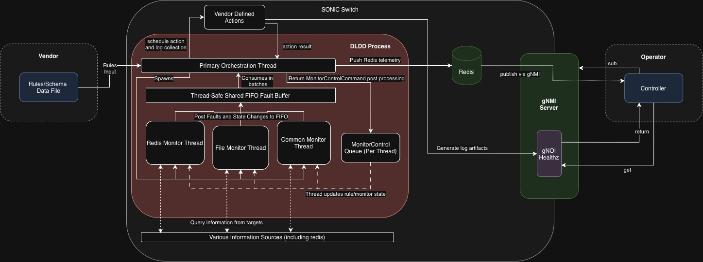
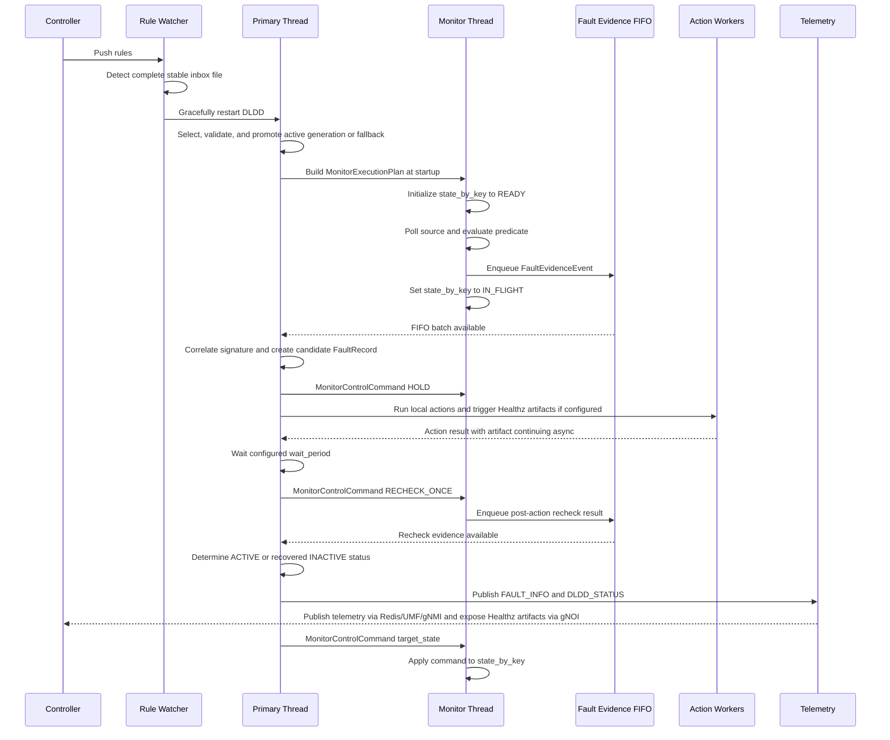

# Device Local Diagnosis Service HLD

## Table of Contents

- [Document History](#document-history)
- [Scope](#scope)
- [Terminology](#terminology)
- [Requirements](#requirements)
- [High-Level Design](#high-level-design)
- [Detailed Design](#detailed-design)
- [Telemetry and Diagnostics](#telemetry-and-diagnostics)
- [Service Configuration](#service-configuration)
- [File Management and Rule Updates](#file-management-and-rule-updates)
- [Integration Points](#integration-points)
- [Testing and Validation](#testing-and-validation)
- [Restrictions and Limitations](#restrictions-and-limitations)
- [References](#references)

## Introduction

The Device Local Diagnosis Daemon (DLDD) is a host service running on SONiC switches that consumes vendor-provided rules, executes platform-specific data collection, correlates events, and posts validated faults to the controller. It is the on-device implementation partner to the `vendor-rules-schema-hld.md` document and provides the runtime that evaluates those rules using data source extensions (DSE), direct data sources, and vendor-defined actions.

The service provides:
- **Configurable Monitoring**: Rule-driven fault detection across multiple data sources
- **Periodic Polling**: Configurable polling intervals with threshold-based fault detection as defined by vendor rules
- **Remote Integration**: Integration with OpenConfig to publish fault information to remote controllers in a standard manner
- **Multi-Event Rules**: Support for complex fault conditions combining multiple rule events within a single rule evaluation

## Document History

| Revision | Date | Author | Description |
|----------|------|--------|-------------|
| 0.1 | 2025-09-24 | Gregory Boudreau | Initial draft of DLDD HLD |

## Scope

This document describes the Device Local Diagnosis Daemon (DLDD) implementation on SONiC platforms. It covers how vendor-provided rules are ingested, evaluated, and converted into telemetry for remote controllers. The following items are **not** covered: individual vendor rule authoring, OpenConfig schema specifications, or controller-side workflows.

## Terminology

| Term / Abbreviation | Description |
|----------------------|-------------|
| **DLDD** | Device Local Diagnosis Daemon running on the switch |
| **DSE** | Data Source Extension used to resolve abstract rule identifiers |
| **FIFO** | First-In, First-Out queue used for fault buffering |
| **gNMI** | gRPC Network Management Interface used for telemetry publication |
| **gNOI** | gRPC Network Operations Interface used for Healthz artifact exchange |
| **PMON** | Platform Monitor service family already present on SONiC |
| **Event** | Rule-defined data input and evaluator used by DLDD when processing a fault signature |
| **Thread-Safe Shared FIFO Fault Evidence Buffer** | Central queue where monitor threads enqueue fault evidence, clear notifications, and source/rule failure notifications for batch consumption by the primary orchestration thread |
| **Fault Signature** | Complete rule definition including metadata, conditions, and actions |
| **Multi-Event Rule** | Rule that combines multiple events within its condition block for complex fault detection |
| **Host Service** | A systemd-managed service running directly on the SONiC host, outside PMON and outside SONiC Docker containers |
| **Primary Orchestration Thread** | DLDD thread responsible for rule ingestion, monitor lifecycle, signature correlation, FIFO consumption, vendor action coordination, and telemetry publication |
| **FaultEvidenceEvent** | FIFO payload emitted by monitor threads only when an event predicate matches, a previously matched predicate clears, source availability changes, collection fails, or evaluation fails |
| **Correlation Key** | Stable runtime key used to serialize ownership for one rule/event/component/source instance without blocking unrelated rules or components |
| **Single-Flight Fault Evidence Ownership** | Runtime policy where a monitor pauses or suppresses duplicate evidence for a correlation key after enqueueing a `FaultEvidenceEvent` until the primary thread explicitly resumes, holds, rechecks, or suspends that key |
| **MonitorControlCommand** | Immutable in-memory Python command object sent by the primary thread through a monitor-owned `Queue` so the monitor can apply per-key state transitions such as `HOLD`, `RESUME`, `RECHECK_ONCE`, or `SUSPEND` |
| **FaultRecord** | Primary-thread-owned correlated fault state created after signature logic is satisfied and published to `FAULT_INFO` only after the rule's publication gates complete |
| **Source Availability State** | Runtime state describing whether a data source is available, intentionally suspended, unavailable, or recovered without treating source absence as a hardware fault |
| **Action Worker** | Asynchronous worker context used for vendor local actions and log collection so long-running actions do not block the primary orchestration thread |
| **Vendor-Defined Actions** | Local remediation actions supplied with the rules package and executed according to vendor-defined semantics |
| **Vendor Rules Source** | YAML or JSON file conforming to the schema defined in `vendor-rules-schema-hld.md`, containing signatures, conditions, and actions |
| **ACTION_\* Escalations** | Controller-driven remediation steps contained by the rules schema and defined in OpenConfig (for example `ACTION_RESEAT`, `ACTION_COLD_REBOOT`, `ACTION_POWER_CYCLE`, `ACTION_FACTORY_RESET`, `ACTION_REPLACE`) |

## Requirements

### Functional Requirements
This section describes the SONiC requirements for the Device Local Diagnosis Daemon (DLDD).
- Monitor multiple data sources: Redis, platform APIs, sysfs, i2c, CLI, files
- Resolve vendor Data Source Extensions (DSE) defined in the rules schema into executable data collection operations
- Support complex fault logic with multi-event rules that evaluate within a single rule definition
- Provide polling-based fault detection with configurable intervals
- Integrate with existing SONiC platform monitoring infrastructure without disrupting existing PMON services
- Support remote rule updates through staged validation, controlled service restart, and golden backups for rollback
- Generate telemetry data for remote controller consumption through gNMI or redis directly
- Implement vendor-defined local remediation actions and escalate requests for remotely executed ACTION_* 

## High-Level Design



*Figure 1. DLDD logical runtime architecture. Monitor threads emit fault evidence and state-change notifications; the primary thread owns signature correlation, fault lifecycle, action scheduling, and telemetry publication.*

DLDD is a multithreaded SONiC host service that implements vendor-agnostic, rule-driven hardware fault detection and remediation. The service operates as a polling-based monitoring engine that ingests vendor-provided fault signatures, evaluates hardware health against defined conditions, and publishes actionable telemetry to remote controllers.

DLDD runs directly on the host as a systemd-managed service, not inside PMON and not inside any SONiC Docker container. This placement is intentional: crashes or restarts of PMON, swss, syncd, or other non-database SONiC containers must not directly stop the DLDD process. The database Docker is an explicit dependency because DLDD uses Redis for configuration, Redis-backed source data, service status, and local fault publication. gNMI and gNOI are remote export/artifact dependencies: when Redis is available, DLDD can still publish local `FAULT_INFO` and `DLDD_STATUS` telemetry even if remote gNMI export or gNOI Healthz artifact retrieval is unavailable.

At startup, DLDD selects a rules generation before loading monitor work. It first checks for a stable remotely delivered inbox candidate and the current packaged platform rules/DSE pair, then compares those candidates against the existing active copy. The daemon does not blindly prefer `/var/lib/sonic/dldd/rules/dld_rules.active.yaml` if a stable inbox update is pending, if the packaged platform rules supersede the active copy after an image/platform update, or if the active copy is incompatible with the current schema or DSE configuration. The rules watcher only detects stable inbox changes and restarts DLDD gracefully; DLDD itself owns candidate selection, validation, active-copy promotion, golden fallback, and rollback decisions. After selecting and validating the generation, DLDD resolves Data Source Extensions (DSE) into concrete data collection paths and builds execution plans that map rules to appropriate monitor threads based on transport type (Redis, Platform API, I2C, CLI, sysfs, file). Rules that fail rule-level materialization are tracked as broken during ingestion, are not materialized into monitor `items_by_key`, and have diagnostics published to the controller. If no usable rules remain after materialization for the current platform, activation fails and DLDD keeps or restores the previous active generation or fallback.

During runtime, the **primary orchestration thread** manages specialized monitor threads and consumes `FaultEvidenceEvent` objects from a shared FIFO buffer. The **monitor threads** (Redis, File, Common) periodically sample their assigned data sources using standardized adapters that abstract transport differences through a uniform interface (`validate()`, `get_value()`, `get_evaluator()`, `run_evaluation()`, `collect()`). Monitor threads evaluate individual positive fault predicates on-thread and do not enqueue normal non-matching samples. They enqueue only fault evidence, clear notifications, source availability transitions, collection errors, or evaluator errors. After a monitor enqueues a `FaultEvidenceEvent`, it marks that correlation key as in-flight and stops normal polling for that key until the primary thread returns a `MonitorControlCommand`. This single-flight ownership prevents duplicate match/clear races while allowing unrelated rules, events, and component instances to keep running. The primary thread owns signature-level correlation, multi-event logic, action scheduling, target-state decisions, recheck requests, and telemetry publication. The monitor thread owns writes to `state_by_key` during runtime and applies primary decisions from its control queue. In case of a source failure or unevaluable event, DLDD records source availability state separately from hardware fault state.

Confirmed faults are published to the Redis `FAULT_INFO` table for UMF/gNMI subscription by the controller. If a rule defines local actions, DLDD holds the candidate fault, runs the vendor-defined local action sequence, waits the configured `wait_period`, rechecks the affected signature, and then publishes `FAULT_INFO`. If the recheck clears, DLDD publishes the fault as `INACTIVE` with local action metadata so the controller can observe that DLDD recovered the condition. If the fault remains active, DLDD publishes the fault as `ACTIVE` with its `ACTION_*` remote remediation recommendations (RESEAT, COLD_REBOOT, REPLACE, and so on). When a rule defines log collection, DLDD triggers Healthz artifact generation and publishes the artifact identifier with the fault; artifact content collection may continue asynchronously and does not block the fault report. The service maintains a heartbeat via `DLDD_STATUS|process_state` with a 120-second TTL, publishing both service health and broken rule diagnostics to provide full observability.

Operators control the service through standard SONiC mechanisms: the `FEATURE` table in CONFIG_DB enables or disables DLDD (`config feature state dldd enabled/disabled`), while the `DLDD_CONFIG` table allows dynamic threshold tuning without service restart. Controllers _can_ push updated rules via gNOI File service into a staging location, with a systemd timer monitoring for stable file changes and gracefully restarting DLDD. The restarted DLDD process validates candidates, promotes a versioned active copy when appropriate, or falls back to the previous active/golden generation before monitor work starts. Non-database container crashes are treated as data-source availability events, not DLDD lifecycle events. The design prioritizes graceful degradation: when individual rules fail, the service continues operating with the remaining functional rules, and catastrophic errors or zero-rule activation results trigger fallback to the last known good active copy or golden backup.

### Example End-to-End Rule Flow

The following example shows a single vendor rule from creation through runtime fault publication. It uses a Redis-backed PSU rule for clarity; rules backed by I2C, file, CLI, or platform APIs follow the same shape but are assigned to a different monitor.


```mermaid
sequenceDiagram
  participant C as Controller
  participant W as Rule Watcher
  participant P as Primary Thread
  participant M as Monitor Thread
  participant Q as Fault Evidence FIFO
  participant A as Action Workers
  participant T as Telemetry

  C->>W: Push rules
  W->>W: Detect complete stable inbox file
  W->>P: Gracefully restart DLDD
  P->>P: Select, validate, and promote active generation or fallback
  P->>M: Build MonitorExecutionPlan at startup
  M->>M: Initialize state_by_key to READY
  M->>M: Poll source and evaluate predicate
  M->>Q: Enqueue FaultEvidenceEvent
  M->>M: Set state_by_key to IN_FLIGHT
  Q-->>P: FIFO batch available
  P->>P: Correlate signature and create candidate FaultRecord
  P->>M: MonitorControlCommand HOLD
  P->>A: Run local actions and trigger Healthz artifacts if configured
  A-->>P: Action result with artifact continuing async
  P->>P: Wait configured wait_period
  P->>M: MonitorControlCommand RECHECK_ONCE
  M->>Q: Enqueue post-action recheck result
  Q-->>P: Recheck evidence available
  P->>P: Determine ACTIVE or recovered INACTIVE status
  P->>T: Publish FAULT_INFO and DLDD_STATUS
  T-->>C: Publish telemetry via Redis/UMF/gNMI and expose Healthz artifacts via gNOI
  P->>M: MonitorControlCommand target_state
  M->>M: Apply command to state_by_key
```

*Figure 2. Example lifecycle for one Redis-backed rule. The primary thread decides the next lifecycle state and sends a `MonitorControlCommand`; the monitor thread applies that command to its own `state_by_key`. The primary thread does not directly mutate monitor-local dictionaries during runtime.*

## Detailed Design

### Core Components

#### Primary Orchestration Engine (Primary Thread)
- **Rule Management Pipeline**: Parses signatures from `vendor-rules-schema-hld.md`, validates schema compatibility, resolves DSE references into concrete transport specifications (determining whether an event becomes I2C, Redis, Platform API, CLI, sysfs, or file-based), and materializes execution plans that map events to monitor thread capabilities.
- **Thread Coordinator**: Owns the lifecycle of all monitor threads, instantiating them from a common `MonitorThread` base class, injecting the resolved event plan, distributing work items to the appropriate monitor based on transport type, and sending `MonitorControlCommand` objects to monitor-owned control queues for in-flight work.
- **Fault Processing & Actions**: Consumes `FaultEvidenceEvent` objects already evaluated by monitor threads, tracks per-rule failure counts, evaluates signature-level logic, schedules vendor local actions asynchronously, suppresses duplicate action execution for an active fault lifetime, and raises ACTION_* escalations to the controller.
- **Telemetry Publisher**: Emits confirmed fault and service-state records into Redis STATE_DB for UMF/gNMI export, and orchestrates gNOI Healthz artifact creation.

#### Internal Data Structures

DLDD uses the following primary runtime structures. The distinction between monitor-level fault evidence and primary-thread fault state is intentional: monitor threads never decide that a multi-event signature is active, never enqueue routine healthy samples, and never preformat a `FAULT_INFO` record.

**MonitorExecutionPlan** - Per-monitor runtime container built by the primary thread and owned by one monitor thread
- **Monitor Identity**: Stable `monitor_id`, monitor type (`redis`, `file`, or `common`), polling interval, and adapter set.
- **Work Items**: `items_by_key`, an immutable dictionary keyed by correlation key with `MonitorWorkItem` values. The monitor does not pop items out of this dictionary during fault handling.
- **Work State**: `state_by_key`, a monitor-owned mutable dictionary keyed by the same correlation keys with `MonitorWorkStateRecord` values.
- **Control Mailbox**: The thread-safe queue where the primary thread sends `MonitorControlCommand` objects for keys owned by this monitor.
- **Plan Generation**: Active rules checksum or generation ID used to discard stale control commands after rule activation or service restart.

The plan is intentionally simple: no separate ready queue, no shared mutable rule list, and no primary-thread mutation of monitor-local state. During a poll cycle, the monitor iterates `items_by_key` in stable order and checks `state_by_key[correlation_key]` to decide whether that key is eligible to collect.

**MonitorWorkItem** - Work assignment from orchestrator to monitor threads
- **Signature Identity**: Rule name, numeric ID, version, severity, priority, symptom, error type, and component metadata from the signature.
- **Event Identity**: Event ID, instance binding, and correlation key used by the primary thread to join event history for one affected component instance.
- **Resolved Source**: Concrete transport details after DSE resolution, such as Redis database/table/key/path, I2C bus/chip/register, file path, sysfs path, CLI `argv`, or platform API binding.
- **Adapter Binding**: Transport classification determining which monitor thread handles the work (Redis, File, Common) and which `DataSourceAdapter` instance is used.
- **Evaluator Specification**: Normalized evaluator definition, including type, operator, expected value, units/value formatting, `match_count`, and `match_period`.
- **Source Policy**: Source identifier, retry behavior, and graceful-maintenance handling used when the source is unavailable or intentionally suspended.

**MonitorWorkState** - Monitor-local runtime state for one correlation key
- **State**: `READY`, `IN_FLIGHT`, `HELD_BY_PRIMARY`, `RECHECK_REQUESTED`, `DEGRADED`, `BROKEN`, or `SUSPENDED`.
- **In-Flight Metadata**: Last enqueued FIFO sequence number, enqueue timestamp, work-state generation, primary command generation, and lease deadline.
- **Last Sample State**: Last successful `MATCH`/`NO_MATCH`/source status observed by the monitor before the key was held.
- **Suppression Policy**: Duplicate match, clear, and source-status notifications for this key are not emitted while the key is `IN_FLIGHT` or `HELD_BY_PRIMARY`; the monitor either skips normal polling for the key or performs a primary-requested one-shot recheck.
- **Recovery Policy**: If the primary thread does not acknowledge or command the key before the lease expires, the monitor reports a service diagnostic and returns the key to `READY`. The next normal poll samples current state. A key marked `BROKEN` is excluded from polling until a fresh process/rule generation fully reevaluates the rule.

`state_by_key` is monitor-owned runtime state. The primary thread decides lifecycle outcomes, but it communicates those decisions by enqueueing `MonitorControlCommand` objects into the monitor's control mailbox. The monitor thread drains that mailbox and applies state changes locally before polling. This keeps the polling loop free of shared mutable dictionary writes from the primary thread. A lock-safe direct-write API is possible, but it is not the baseline design because it would turn `state_by_key` into shared mutable state across threads.

| Monitor Work State | Written By | Origin or Cause | Polling Behavior |
|--------------------|------------|-----------------|------------------|
| `READY` | Monitor initialization, monitor applying primary `RESUME`, or monitor lease recovery | New valid work item, processed evidence, recovered key, or stale ownership lease expiry | Eligible for normal polling |
| `IN_FLIGHT` | Monitor thread | Monitor enqueued a `FaultEvidenceEvent` or one-shot recheck result and is waiting for the primary decision | Skipped until a command is applied |
| `HELD_BY_PRIMARY` | Monitor applying primary `HOLD` | Primary is correlating candidate or active fault state, running/waiting for local actions, or preparing a controlled recheck | Skipped during normal polling |
| `RECHECK_REQUESTED` | Monitor applying primary `RECHECK_ONCE` | Primary needs exactly one fresh sample after action wait, before clear, before escalation, or after source recovery | Eligible for one collection cycle, then returns to `IN_FLIGHT` when evidence is enqueued |
| `DEGRADED` | Monitor applying primary command with `target_state=DEGRADED` | Runtime source, collection, or evaluation failures are at or below the broken threshold and should continue retrying | Eligible for polling according to source policy |
| `BROKEN` | Monitor applying primary `SUSPEND` with `target_state=BROKEN` | Fatal evaluator/configuration failure or runtime failure count exceeds `individual_max_failure_threshold` | Skipped until a fresh DLDD process start or rule generation fully reevaluates the rule |
| `SUSPENDED` | Monitor applying primary `SUSPEND` with `target_state=SUSPENDED` | Intentional maintenance, feature disablement, config reload, service stop, or operator/controller suspension | Skipped until primary sends `RESUME` |

**RuleRuntimeStatus** - Monitor-produced rule/key status update consumed by the primary thread
- **Status State**: `OK`, `DEGRADED`, or `BROKEN` for the affected rule/key.
- **Correlation Fields**: Rule identity, event identity, component instance, source identifier, and correlation key.
- **Failure Details**: Error category, human-readable reason, failure count, last success timestamp, last attempt timestamp, and whether the failure is retryable.
- **Telemetry Intent**: Indicates whether the primary thread should update only process/rule status telemetry, send a monitor control command, or both.

**EvaluationResult** - Output of adapter evaluation within monitor threads
- **Result Type**: `MATCH`, `NO_MATCH`, `SOURCE_UNAVAILABLE`, `SOURCE_RECOVERED`, `COLLECTION_ERROR`, or `EVALUATION_ERROR`.
- **Collected Value**: Raw and normalized value retrieved from the data source, formatted according to `value_configs` when applicable.
- **Evaluator Outcome**: Evaluator type, operator, expected value, comparison result, and any type conversion details needed for diagnostics.
- **Timestamps**: Collection start time, evaluation completion time, and source timestamp if provided by the underlying data source.
- **Source Status**: Available/suspended/unavailable state and graceful-maintenance metadata when collection could not produce a valid value.
- **Exception Details**: Structured error information if collection or evaluation failed, including failure classification and whether the error is retryable.

**FaultEvidenceEvent** - Message enqueued to FIFO by monitor threads
- **Correlation Fields**: Signature ID, event ID, component instance, source identifier, and event timestamp.
- **Evidence State**: The `EvaluationResult` and transition type, such as predicate match, predicate clear, source unavailable, source recovered, collection error, or fatal evaluator error.
- **Evidence Snapshot**: Collected value, evaluator metadata, and source metadata required by the primary thread to build event history.
- **Failure Context**: Consecutive failure count known to the monitor, retryability, and error category. The primary thread is still authoritative for rule and service state transitions.
- **Runtime Status**: Optional `RuleRuntimeStatus` when the payload represents source availability, degraded rule state, or broken rule state rather than hardware fault evidence.
- **Ownership Metadata**: Correlation key, monitor identity, work-state generation, and whether the event came from normal polling or a primary-requested recheck.
- **Queue Metadata**: Monotonic enqueue sequence number and enqueue timestamp. FIFO order is useful for processing, but signature correlation is based on event timestamps.

**FaultRecord** - Primary-thread-owned correlated fault state
- **Fault Identity**: `FAULT_INFO|<component>|<symptom>` key, signature identity, component identity, and current OpenConfig Healthz status.
- **Event History**: Per-event match/clear history for the affected component instance, including `match_count`, `match_period`, and `logic_lookback_time` evaluation state.
- **Lifecycle State**: `ACTIVE` or `INACTIVE`, origin time, last detection time, occurrence count, inactive retention deadline, and stale-source annotations.
- **Action State**: Local action/log collection execution state, action worker status, wait-period timer, action suppression state for the current active lifetime, and controller-visible remediation list.
- **Publication State**: Last published checksum/version so DLDD can avoid unnecessary Redis churn while still refreshing service liveness telemetry.

**MonitorControlCommand** - Immutable in-memory Python message sent by the primary thread to one monitor thread
- **Delivery Path**: Written by the primary thread to the owning monitor's `queue.Queue[MonitorControlCommand]`; drained and applied by the monitor thread.
- **Scope**: Applies to one `correlation_key` in one monitor plan generation.
- **Decision Ownership**: The primary thread chooses `command` and `target_state`; the monitor thread validates generation/key ownership and then applies `target_state` to `state_by_key`.
- **Not Shared State**: The command is not a Redis object, not a callback, and not direct mutation of the monitor's dictionary.

```python
from dataclasses import dataclass, field
from enum import Enum
from queue import Queue
import time


class MonitorCommandType(str, Enum):
    RESUME = "RESUME"
    HOLD = "HOLD"
    RECHECK_ONCE = "RECHECK_ONCE"
    SUSPEND = "SUSPEND"


class MonitorWorkState(str, Enum):
    READY = "READY"
    IN_FLIGHT = "IN_FLIGHT"
    HELD_BY_PRIMARY = "HELD_BY_PRIMARY"
    RECHECK_REQUESTED = "RECHECK_REQUESTED"
    DEGRADED = "DEGRADED"
    BROKEN = "BROKEN"
    SUSPENDED = "SUSPENDED"


@dataclass(frozen=True, slots=True)
class MonitorControlCommand:
    command_id: str
    monitor_id: str
    plan_generation: str
    correlation_key: str
    command: MonitorCommandType
    target_state: MonitorWorkState
    reason: str
    expected_work_state_generation: int | None = None
    evidence_sequence: int | None = None
    recheck_not_before: float | None = None
    hold_deadline: float | None = None
    created_at: float = field(default_factory=time.time)


@dataclass(slots=True)
class MonitorWorkStateRecord:
    state: MonitorWorkState
    work_state_generation: int = 0
    last_evidence_sequence: int | None = None
    last_enqueue_timestamp: float | None = None
    ack_deadline: float | None = None
    hold_deadline: float | None = None
    last_sample_state: str | None = None
    last_success_timestamp: float | None = None
    consecutive_failure_count: int = 0


@dataclass
class MonitorExecutionPlan:
    monitor_id: str
    monitor_type: str
    polling_interval: float
    plan_generation: str
    items_by_key: dict[str, "MonitorWorkItem"]
    state_by_key: dict[str, MonitorWorkStateRecord]
    control_queue: Queue[MonitorControlCommand]
```

These structures maintain type consistency across the service. The orchestrator creates one `MonitorExecutionPlan` per monitor thread, each plan contains immutable `MonitorWorkItem` objects and monitor-owned `MonitorWorkStateRecord` objects, monitors produce `EvaluationResult` objects via adapters, package fault evidence or `RuleRuntimeStatus` updates into `FaultEvidenceEvent` objects for the FIFO, and the primary thread consumes those events to update `FaultRecord`, process/rule telemetry, and service-status state before returning `MonitorControlCommand` objects.

**Dataclass Contracts**:
- `MonitorExecutionPlan.plan_generation` is the active rule generation. Monitors reject commands whose `plan_generation` does not match the current plan.
- `MonitorWorkStateRecord.work_state_generation` increments whenever the monitor changes state for the correlation key, including enqueueing evidence, applying a primary command, lease recovery, or marking the key `BROKEN`.
- `MonitorControlCommand.expected_work_state_generation` is set when the primary is responding to a specific evidence event. If the monitor has already advanced the key generation, the command is stale and must be rejected without mutating `state_by_key`.
- `MonitorExecutionPlan.items_by_key` is immutable for the lifetime of the process/rule generation. Rule updates and full reevaluation happen through a fresh process/rule generation, not by mutating the live plan.
- The FIFO and monitor control queues are in-memory process state. They are never persisted, restored, or replayed across `systemctl restart dldd`, `config reload`, process crash, or rule activation.

#### Monitor Thread Architecture

- **Shared Interface**: Every monitor inherits the common `MonitorThread` contract (`get_query_path()`, `get_path_value()`, `generate_queue_object()`, `push_queue_object()`), guaranteeing uniform behavior regardless of underlying transport.
- **Typed Adapters**: Each monitor thread composes the appropriate `DataSourceAdapter` (Redis, Platform API, CLI, I2C, sysfs, File, etc.) which implements `validate()`, `get_value()`, `get_evaluator()`, `run_evaluation()`, and `collect()`.
- **Plan Ownership**: Each monitor owns exactly one `MonitorExecutionPlan`. The primary thread may replace the whole plan only during service startup or rule activation restart; at runtime it sends commands through the plan's control mailbox.
- **On-Thread Event Evaluation**: Event-level data collection and evaluation are executed inside the monitor threads; each `collect()` call resolves the value, evaluator, and produces an `EvaluationResult` for a single event.
- **Structured Output**: When an event predicate is satisfied, clears, recovers, or fails, monitors emit a normalized `FaultEvidenceEvent` that encapsulates the rule, event metadata, value, evaluator outcome, source state, and timestamps before enqueuing to the shared FIFO. A successful non-matching sample updates monitor-local state but is not enqueued unless it clears a previously reported match or recovers a previously unavailable source.
- **Single-Flight Ownership**: After enqueueing a `FaultEvidenceEvent`, the monitor transitions that correlation key to `IN_FLIGHT`. The immutable `MonitorWorkItem` remains in the monitor's assignment set, but the key is skipped during normal polling until the primary thread commands `RESUME`, `HOLD`, `RECHECK_ONCE`, or `SUSPEND`.
- **Primary-Requested Recheck**: A `RECHECK_ONCE` command temporarily makes a held key eligible for exactly one collection/evaluation cycle. The resulting `MATCH`, `CLEAR`, source-status, or evaluator-error evidence is enqueued with the command generation and the key returns to `IN_FLIGHT` until the primary thread processes the result.

**Data Collection Strategy**:
- **Redis Monitor**: Polls all eligible Redis-based work keys (`READY`, `DEGRADED`, or `RECHECK_REQUESTED`) on a configurable interval (default: 60 seconds) by querying specific keys defined in rules
- **File Monitor**: Polls all eligible file-based work keys (`READY`, `DEGRADED`, or `RECHECK_REQUESTED`) on a configurable interval (default: 60 seconds)
- **Common Monitor**: Polls all eligible Platform API/I2C/CLI/sysfs work keys (`READY`, `DEGRADED`, or `RECHECK_REQUESTED`) on a configurable interval (default: 60 seconds). Sysfs is handled by the common monitor because it is a host-local platform data source with the same scheduling and error-handling model as Platform API, I2C, and CLI collection.
- Each monitor thread has an independent polling interval configured via CONFIG_DB `DLDD_CONFIG` table; per-rule polling intervals are not currently supported

**Minimal Monitor Plan Shape**:

```text
MonitorExecutionPlan
  monitor_id
  monitor_type
  polling_interval
  plan_generation
  control_queue
  items_by_key: dict[correlation_key, MonitorWorkItem]
  state_by_key: dict[correlation_key, MonitorWorkStateRecord]
```

The monitor loop uses the plan directly:

```text
while running:
  drain control_queue and update state_by_key
  if polling interval elapsed:
    for correlation_key, work_item in items_by_key:
      state = state_by_key[correlation_key]
      if state is READY, DEGRADED, or RECHECK_REQUESTED:
        collect and evaluate work_item
        if stateful evidence is produced:
          set state_by_key[correlation_key] to IN_FLIGHT
          enqueue FaultEvidenceEvent
```

#### Shared Data Contracts
- **Execution Plan Artifacts**: Orchestrator and monitors exchange immutable `MonitorExecutionPlan` and `MonitorWorkItem` descriptors (rule ID, resolved event definition with concrete transport details, adapter binding). Rules file changes are activated through a controlled service restart, so in-memory monitor queues are ephemeral process state and are not preserved across rule changes. Within a running process, each monitor owns its plan and mutable per-key state; the primary thread does not mutate monitor-local dictionaries.
- **Correlation Key Scope**: The correlation key must distinguish one independently held work item without becoming broader than necessary. At minimum it includes signature/rule identity, event identity, resolved component instance, symptom, and source identity when the same event can resolve to multiple sources. It must not include volatile timestamps, FIFO sequence numbers, or collected values.
- **FaultEvidenceEvent Queue Objects**: The FIFO carries serialized `FaultEvidenceEvent` dataclasses between threads with consistent schema including correlation fields, evaluation results, source state, timestamps, and exception details for rule/source tracking.
- **MonitorControlCommand Objects**: The primary thread returns per-key commands to the owning monitor through a thread-safe command mailbox (`queue.Queue`). Commands include the correlation key, plan generation, expected work-state generation when applicable, target state, optional recheck deadline, and reason. The primary thread decides the target state; the monitor thread applies it to `state_by_key` only after generation/key validation.
- **Primary-Owned Fault Records**: Only the primary thread constructs and mutates `FaultRecord` objects. `FAULT_INFO` publication, fault clear behavior, occurrence counting, action scheduling, and Healthz translation inputs are derived from these records, not directly from monitor-thread payloads.


### Process Model

```
DLDD Process (PID: main)
└─ Primary Orchestration Thread
   ├─ Maintains rule execution plan and DSE bindings
   ├─ Manages shared FIFO of `FaultEvidenceEvent` objects
   ├─ Owns per-signature event history and `FaultRecord` state
   ├─ Sends `MonitorControlCommand` objects for HOLD/RESUME/RECHECK/SUSPEND
   └─ Schedules async local action workers, ACTION_* escalations, and telemetry publishers

   ╰─ Monitor Thread Pool (instances of the shared MonitorThread base class)
      ├─ Redis Monitor (uses RedisAdapter → MonitorThread interface)
      ├─ File Monitor (uses FileAdapter → MonitorThread interface)
      └─ Common Monitor (uses PlatformAPI/CLI/I2C/sysfs adapters → MonitorThread interface)

         ↳ Each monitor produces `FaultEvidenceEvent` objects with identical schema
            and enqueues only fault evidence, runtime status, or failure notifications to the FIFO.
            Each monitor also keeps per-key `MonitorWorkState` to avoid duplicate
            evidence while the primary thread owns an in-flight key.
```

- **Monitor Thread Interface Enforcement**: All monitors are instantiated from the same base class, guaranteeing consistent callback signatures for value retrieval, evaluation, and queueing.
- **Inter-Thread Payloads**: Communication between threads relies on `MonitorWorkItem` descriptors (orchestrator to monitor), `FaultEvidenceEvent` objects (monitor to orchestrator), and `MonitorControlCommand` objects (orchestrator to monitor), keeping the data flow self-describing and serialization-friendly. Runtime `state_by_key` changes are applied by the owning monitor thread after it drains its command queue.
- **Deterministic Ordering**: The FIFO buffer preserves enqueue ordering of `FaultEvidenceEvent` payloads. Signature correlation uses event timestamps, not enqueue order. OpenConfig requires a singular fault instance per component/symptom, so DLDD publishes at most one `FAULT_INFO|<component>|<symptom>` record. If multiple signatures are active for the same component and symptom, the published fault is determined first by rule severity and then by priority (lower numeric priority takes precedence). If component instance, symptom, severity, and priority are the same, the published fault is based on first detected fault. Non-winning active signatures remain in DLDD internal event history and may become the published record if the current winning signature clears while they remain active.

### Rule Evaluation Workflow

1. **Rule ingestion**: Primary thread loads the active rules copy, validates schema versions, resolves DSE references, and stores the resulting execution plans.
2. **Monitor thread provisioning**: Based on the rule metadata, the primary thread spawns monitor threads to cover the necessary data sources and DSE bindings.
3. **Event sampling**: Monitor threads collect data from Redis, platform APIs, sysfs, CLI, I2C, and file sources for eligible work keys in `READY`, `DEGRADED`, or `RECHECK_REQUESTED` state, applying per-event evaluations defined in the rules schema.
4. **Fault evidence buffering**: Predicate matches, clear notifications, source availability transitions, degraded/broken runtime status, and rule execution errors are enqueued as `FaultEvidenceEvent` objects into the thread-safe shared FIFO fault evidence buffer with event timestamps and source status. Routine successful non-matching samples are not enqueued.
5. **Single-flight hold**: After enqueueing evidence, the monitor marks that correlation key `IN_FLIGHT` and excludes it from normal polling. Other keys in the same monitor continue running.
6. **Fault correlation and actions**: The primary thread consumes buffered evidence in batches, updates per-signature event history, evaluates signature logic, tracks failure counts, and creates or updates candidate `FaultRecord` state. If local actions are configured, the primary sends `HOLD`, schedules the local action sequence, waits the configured `wait_period`, and requests recheck before controller-visible fault publication.
7. **Telemetry publication**: Confirmed fault state is written to Redis `FAULT_INFO` only after the rule's publication gate completes. The normative publication order for local actions, post-action recheck, recovered `INACTIVE` records, and asynchronous Healthz artifacts is defined in [Vendor Action and Log Semantics](#vendor-action-and-log-semantics). Service state and in-progress local action state are written to `DLDD_STATUS|process_state`, OpenConfig fault telemetry is exported via UMF/gNMI from `FAULT_INFO`, and associated Healthz log artifacts are made available through gNOI when artifact generation completes.
8. **Primary command return**: After action handling and telemetry publication reach the appropriate lifecycle point, the primary sends a `MonitorControlCommand` to `RESUME` normal polling, request `RECHECK_ONCE`, or `SUSPEND` a broken/unavailable key. The monitor applies the command to `state_by_key`.

### Concurrency and Correlation Ownership

The primary thread is the single owner of signature-level state. Monitor threads own transport polling and per-event evaluation only. This split avoids divergent interpretations of multi-event logic and avoids shared mutable rule state between the primary thread and monitor threads.

- **Execution plan updates**: Rules file changes are activated through a service restart, so the daemon starts with a clean in-memory execution plan. Runtime rule disablement, suspension, or recovery is decided by the primary thread and communicated through `MonitorControlCommand`; monitor threads do not mutate the shared plan directly.
- **Event history**: The primary thread maintains per-signature, per-event, per-instance history keyed by event timestamp. `match_count` is evaluated within `match_period` for each event. The `conditions.logic` expression is evaluated per resolved diagnosis instance within `logic_lookback_time`: explicit `instances` and DSE selectors that expand to component instances are joined by matching component instance, while events without explicit or implicit instances are common predicates available to each instance group.
- **Ordering**: FIFO order is used for processing efficiency, but correlation uses event timestamps rather than enqueue order. Late events outside their configured windows are discarded and counted in service diagnostics.
- **Single-flight ownership**: A monitor never removes the immutable `MonitorWorkItem` from its plan; it marks the key ineligible for normal polling while the key is `IN_FLIGHT` or `HELD_BY_PRIMARY`. This prevents a clear notification from overtaking an unprocessed match and prevents repeated matches from flooding the FIFO while the primary thread owns the lifecycle.
- **Clear behavior**: A fault is cleared only after the primary thread observes that the signature logic is no longer satisfied for the affected component/instance. Clear evidence can come from normal polling after `RESUME` or from a primary-requested `RECHECK_ONCE`. If match and clear evidence for the same key are already in the FIFO, they are processed in FIFO order; a clear never erases earlier unprocessed fault evidence.
- **Action suppression**: Local actions are executed at most once per `FaultRecord` active lifetime within durable fault state known to DLDD. Repeated matches while the fault remains active refresh event history, but do not start another identical action sequence or update `last_detection_time` unless they represent a fault state change. On restart, suppression is recovered only from published `FAULT_INFO` action metadata for the same rule/component/symptom and active rules checksum; pre-publication candidate action state is process-local and may be rerun after bootstrap recheck if no durable action result exists.
- **Recheck ownership**: While local actions are `RUNNING` or `WAITING_FOR_RECHECK`, the affected key or keys remain held by the primary thread. For a multi-event signature, the primary rechecks enough contributing event keys to determine the full per-instance signature state, including any common non-instanced predicates required by the expression. If the recheck clears the signature, DLDD publishes an `INACTIVE` recovered-fault record with local action metadata. If the recheck still satisfies the signature, DLDD publishes the active fault and remote ACTION_* remediation recommendations.
- **Lease timeout**: `fault_evidence_ack_timeout` applies to keys in `IN_FLIGHT` that are waiting for the first primary acknowledgement or command. Once the primary intentionally moves a key to `HELD_BY_PRIMARY` for local actions, wait periods, or post-action recheck, the `MonitorControlCommand` must include an explicit `hold_deadline` derived from the action timeout, `wait_period`, recheck budget, and implementation safety margin. The monitor reports stale ownership only if that explicit hold deadline expires without a follow-up command. The next normal poll samples current state, preventing a lost command from permanently disabling monitoring for a key without treating expected long recovery actions as stale ownership.

### Vendor Rule Lifecycle Coordination

- **Schema Compatibility**: DLDD verifies that the `schema_version` provided in the rules source is supported by the on-device schema layout definitions before activating signatures.
- **Signature Distribution**: Each signature's metadata drives monitor thread assignments (for example, events referencing DSE paths are dispatched to the thread that can resolve the DSE binding).
- **Action Interface Enforcement**: Local actions are required to follow the type-specific structure defined in the rules schema. Supported executors include `dse`, `cli`, direct `i2c`, and explicit vendor-supported action types; CLI actions use `argv` instead of shell command strings, while direct I2C actions use the schema-defined target `path`. Local actions run with the same privilege as the DLDD service and are vendor-defined. The vendor rule package owns the requirement that local actions are non-disruptive to traffic.
- **Escalation Handling**: Remote actions are propagated as ACTION_* enums defined by the rules schema and surfaced to the controller through Redis/UMF/gNMI fault telemetry only after any configured local actions have completed. They are controller-actionable only when the published fault status is `ACTIVE`; when DLDD recovers the condition locally, the fault is published as `INACTIVE` with local action metadata.
- **Log Collection Alignment**: DLDD triggers the `log_collection` queries specified in the rules schema at the normative action/log trigger point in [Vendor Action and Log Semantics](#vendor-action-and-log-semantics), obtains a Healthz artifact identifier, and lets artifact content collection complete asynchronously.

### Vendor Action and Log Semantics

Local action behavior, wait periods, and log collection scope are vendor-defined because vendors understand the hardware-specific requirements for their platforms. DLDD validates that actions and log queries conform to the schema and then schedules them according to the rule definition. This section is the normative runtime order for local action gating, post-action recheck, `FAULT_INFO` publication, and Healthz artifact triggering.

Normative publication order:
1. Signature correlation creates a candidate `FaultRecord`.
2. If the rule has `local_actions`, DLDD holds the correlation keys needed to re-evaluate the affected per-instance signature, runs the ordered local action sequence, and records action results.
3. DLDD triggers Healthz artifact generation when `log_collection` is configured. The generated artifact identifier is attached to the fault metadata as soon as the artifact request is accepted; artifact content collection continues asynchronously and does not block action result, post-action recheck, or `FAULT_INFO` publication.
4. DLDD waits the rule's `wait_period`, requests the required one-shot rechecks, and evaluates the complete per-instance signature state.
5. DLDD publishes `FAULT_INFO` after the recheck. If the signature cleared, the record is published as `INACTIVE` with local action and artifact metadata. If the signature still matches, the record is published as `ACTIVE` with local action metadata, artifact metadata, and remote ACTION_* recommendations.
6. DLDD returns monitor control commands to resume, hold for a follow-up recheck, or suspend affected keys according to the final lifecycle decision.

- **Async execution**: Local actions and log collection run on asynchronous worker context. A long `wait_period` is represented as action state or a timer and must not block the primary thread from processing fault evidence, updating telemetry, or monitoring unaffected rules.
- **Action timeouts**: Each local action may override the default timeout from the rules source. If omitted, DLDD applies the top-level `local_action_default_timeout` from the active rules source. A timeout marks the action failed, records the result in DLDD status/audit telemetry, releases the worker, triggers Healthz artifact collection when configured, and allows the primary thread to continue to the post-action recheck path without waiting for artifact completion.
- **Wait periods**: A long `wait_period` is a vendor diagnostic/remediation choice, not a DLDD error. DLDD should expose action state in telemetry so operators can distinguish an intentional vendor wait from a hung service.
- **Single execution per active fault**: Once local actions are scheduled for an active `FaultRecord`, DLDD suppresses duplicate local action runs for that same rule/component/symptom lifetime. A new local action run is allowed only after the record has cleared to `INACTIVE` and later becomes `ACTIVE` again, unless a later schema version adds explicit retry semantics.
- **Post-action recheck**: The primary thread owns post-action rechecks. It sends `RECHECK_ONCE` after the vendor `wait_period` to the contributing keys needed to evaluate the complete per-instance signature.
- **Log timing and scope**: DLDD triggers rule-defined logs and queries at the normative trigger point above. Artifact generation runs independently from the local action result and post-action recheck. Vendors should define log collection narrowly around the affected fault where possible. DLDD does not reinterpret the vendor's declared diagnostic scope.
- **Service liveness**: While a vendor action or log collection sequence is in progress, DLDD should continue publishing service status that reflects the in-progress work and should continue monitoring unaffected rules when practical. For a single-event signature this usually means one held correlation key; for a multi-event signature, DLDD may hold and recheck multiple contributing keys plus common predicates required to evaluate that affected per-instance signature. Unrelated rules, components, and instances should remain eligible for normal polling.

### Data Intake Pathways

### Priority Order
Data collection should follow a preferred hierarchy optimized for performance, lower resource usage, and reuse of existing SONiC/platform state. This hierarchy is guidance for rule authors, not a validation constraint. Vendors own the rule definitions and may choose the data source that best represents their hardware state.

1. **Redis Database** - Primary source when available
   - Lowest latency access
   - Leverages already captured data
   - Structured data format
   - Native SONiC integration
   - Examples: `STATE_DB`, `COUNTERS_DB`, `APPL_DB`

2. **Platform APIs** - Platform abstraction layer
   - Hardware-agnostic interface
   - Vendor-specific implementations through common SONiC APIs
   - Examples: PSU status, fan speeds, thermal readings, chassis object, etc.

3. **Sysfs Paths** - Direct filesystem access
   - Kernel-exposed hardware data
   - Low-level sensor access
   - Requires path knowledge
   - Examples: `/sys/class/hwmon/`, `/sys/bus/i2c/`

4. **CLI Commands** - Linux/SONiC Command Line Access
   - Standard SONiC/Linux command execution
   - Human-readable output requires parsing
   - Examples: `show platform npu ?`(vendor CLIs), `dmesg`, `lspci`, `sensors`

5. **I2C Commands** - Direct hardware communication
   - Last resort for unavailable data
   - Requires detailed hardware knowledge
   - Examples: Direct sensor register reads via i2c

### Data Source Interfaces

#### Shared Interface Contract

Every rule references a `DataSourceAdapter` that implements a common contract. The adapter receives a resolved event specification (DSE references are already converted to concrete transport details by the primary thread during rule ingestion). All adapters expose the same surface area to the rule engine:

```python
class DataSourceAdapter(Protocol):
    def validate(self, event: RuleEvent) -> None:
        """Raise on unsupported configuration prior to activation."""

    def get_value(self, event: RuleEvent) -> CollectedValue:
        """Fetch the raw value from the underlying transport."""

    def get_evaluator(self, event: RuleEvent) -> Evaluator:
        """Produce a callable or structure that encapsulates the evaluation logic."""

    def run_evaluation(self, value: CollectedValue, evaluator: Evaluator) -> EvaluationResult:
        """Return the boolean outcome plus any metadata (timestamps, values, etc.)."""

    def collect(self, event: RuleEvent) -> EvaluationResult:
        """Convenience wrapper that orchestrates value retrieval and evaluation."""
```

#### Method Responsibilities
The below is provided to help provide a better idea of where functionality takes place in the common data source adapter interface.

**`validate(event: RuleEvent) -> None`**
- **Purpose**: Pre-flight check executed once during rule ingestion, before any monitor thread starts sampling.
- **Behavior**: Inspects the event configuration (path structure, evaluation type, DSE references) and raises an exception if the adapter cannot support it.
- **Example**: An I2CAdapter would verify that the bus/chip addresses are syntactically valid and that direct monitoring uses the read-only `get` operation. Direct I2C local actions use the rules-schema action path contract and are validated as local actions, not as monitoring events. A RedisAdapter would confirm the database name exists in the SONiC schema.
- **Failure Impact**: If validation fails, the rule is marked as broken during ingestion and is not materialized into any monitor `items_by_key`; the service continues with remaining valid rules.

**`get_value(event: RuleEvent) -> CollectedValue`**
- **Purpose**: Fetch the raw data from the underlying transport (I2C register, Redis key, CLI stdout, file content, etc.).
- **Behavior**: Executes the transport operation using the already-resolved event specification and returns the unprocessed value (bytes, string, integer, JSON blob, etc.). DSE resolution has already occurred in the primary thread.
- **Example**: For an I2C event with resolved bus/chip addresses, this reads the chip register and returns the raw byte/word. For Redis with a concrete database/table/key path, it performs `HGET` and returns the field value. For CLI with the final `argv`, it executes the command without a shell and returns stdout.

**`get_evaluator(event: RuleEvent) -> Evaluator`**
- **Purpose**: Build the evaluation logic based on the `evaluation` block from the rules schema.
- **Behavior**: Parses the evaluation type (`mask`, `comparison`, `string`, `boolean`, `dse`) and constructs a callable or data structure that can be applied to the collected value. When `evaluation.type` is `dse`, DLDD uses the vendor DSE hook to resolve either an expected value used by a DLDD operator or a complete vendor-defined comparator contract.
- **Example**: For a mask evaluation with `logic: '&'` and `value: "0b10000000"`, returns an evaluator that performs bitwise AND. For a comparison evaluation with `operator: '>'` and `value: 50.0`, returns a greater-than checker.
- **Reusability**: The evaluator can be cached and reused across multiple `get_value()` calls if the evaluator is static and not dynamically generated (a DSE reference as the value would require a new evaluator each time as the underlying may change/is not hardcoded).

**`run_evaluation(value: CollectedValue, evaluator: Evaluator) -> EvaluationResult`**
- **Purpose**: Execute the evaluation logic and return the boolean outcome plus any metadata (actual value read, expected threshold, etc.).
- **Behavior**: Applies the evaluator to the value and packages the result into an `EvaluationResult` object that includes violation status, timestamps, and diagnostic information.
- **Example**: For a temperature threshold check, returns `EvaluationResult(violated=True, value=55.2, threshold=50.0, unit='celsius')` if the sensor reads above the limit.
- **Usage**: This is typically called by `collect()` but can be invoked independently for testing or batch evaluation scenarios.

**`collect(event: RuleEvent) -> EvaluationResult`**
- **Purpose**: Convenience method that chains the full evaluation workflow in a single call.
- **Behavior**: Internally calls `get_value(event)`, `get_evaluator(event)` (if necessary), and `run_evaluation(value, evaluator)`, then returns the final `EvaluationResult`.
- **Usage**: Monitor threads call this method in their main sampling loop. It simplifies the common case where the thread wants a complete evaluation without needing to manage intermediate steps.
- **Example**: `result = adapter.collect(event)` → fetches I2C register, applies mask, returns violation status in one operation.

#### Type-Specific Adapter Expectations
Below are some examples of how type specific adapters will function:
- **RedisAdapter**: Resolves database/table/key/path (or DSE aliases) and performs `HGET`/`JSON` extraction using the shared `collect()` entry point.
- **PlatformAPIAdapter**: Uses the platform chassis object obtained from the DSE resolver, executes the requested method on the component, and returns structured results.
- **I2CAdapter**: Converts logical bus/chip identifiers provided by the rule (or DSE) into physical addresses. Direct `event.type: i2c` monitoring is read-only and supports `get` operations only. I2C writes belong in vendor DSE operations or explicitly defined local actions where the vendor owns the side-effect contract.
- **CLIAdapter**: Executes vendor CLI commands through the schema-defined `argv` structure without invoking a shell, normalizes stdout to the expected format, and returns parsed content.
- **SysfsAdapter**: Reads sysfs paths exposed by the host kernel and normalizes numeric or text values according to the rule's path and `value_configs` metadata. Sysfs work is scheduled by the common monitor.
- **FileAdapter**: Reads file paths or glob patterns, normalizes data into a buffer for later comparison as defined in the rules.

Each adapter adheres to the same lifecycle hooks (`validate()`, `collect()`, etc.), which keeps the evaluation pipeline agnostic to the underlying transport while still allowing vendor-specific implementations behind the interface.

### Error Handling and Recovery

#### Exception Handling Strategy

DLDD uses exception-based error handling at both the primary orchestration thread and monitor thread levels. All failures are caught, logged, tracked, and escalated appropriately based on severity and persistence. The system maintains isolation between rules so that failures in one rule do not affect others.

#### Fault, Unavailable, and Broken State

DLDD distinguishes between a hardware fault, an unavailable data source, and a broken rule:

- **Fault active**: The data source returned a valid value and the rule evaluator determined that the configured fault condition is satisfied.
- **Source unavailable or unevaluable**: The source cannot currently be sampled, such as during a graceful service stop, config reload, Redis/database unavailability, missing transient key, or adapter timeout. This is not itself a hardware fault. DLDD should not create a new `ACTIVE` `FAULT_INFO` record solely because a source is unavailable. If a fault was already active, DLDD preserves the prior fault state and annotates the source as unavailable/stale until a valid sample clears or reasserts the condition.
- **Broken rule**: The rule, DSE binding, adapter configuration, or evaluator contract is invalid or persistently fails outside an expected graceful-maintenance window. During ingestion, invalid rules are not materialized into monitor plans. At runtime, broken rules remain represented in the immutable monitor plan but affected keys are marked `BROKEN` in `state_by_key` and reported through `broken_rules` service telemetry. `SUSPENDED` is reserved for intentional maintenance, feature disablement, or controller/operator suspension.

Graceful shutdown and reload signals from SONiC service state, database state, config reload sequencing, or explicit feature disablement should put affected sources/rules into `SUSPENDED` or `UNAVAILABLE` service state. They should not increment broken-rule counters unless the source remains unavailable after the expected maintenance window.

#### Source Availability Policy

Source availability is tracked independently from hardware fault state. A missing source may indicate a graceful service transition, a producer outage, Redis/database loss, a platform API outage, or a real communication problem. DLDD must not infer a hardware fault from absence of data alone unless a vendor rule explicitly models absence as a fault, such as a rule that checks an OpenConfig component-present leaf or a platform API that returns an explicit "component missing" state.

| Source State | Meaning | Counter Behavior | Fault Behavior |
|--------------|---------|------------------|----------------|
| `AVAILABLE` | Source sampled successfully during the most recent attempt | Reset source-unavailable failure tracking for that work item | Event result may match or clear according to the evaluator |
| `SUSPENDED` | Source is intentionally unavailable due to config reload, feature disable, service stop, reboot sequencing, or a controller/operator maintenance action | Do not increment broken-rule counters while the suspension is active | Do not create a new active fault solely from suspension; existing active faults remain active with stale-source annotation |
| `UNAVAILABLE` | Source could not be sampled and no active graceful suspension is known, or the graceful window expired | Increment source failure counters according to `individual_max_failure_threshold` after `source_unavailable_grace_period` expires | Do not create a new active fault solely from unavailability; existing active faults remain active until a valid sample clears or reasserts |
| `RECOVERED` | Source transitioned from `SUSPENDED` or `UNAVAILABLE` to successful sampling | Reset source failure counters after successful collection | Primary thread reevaluates signature logic using the recovered sample and publishes clear or active state as appropriate |

DLDD determines graceful source handling from local service context, not from the vendor rule file:
- During `config reload`, `FEATURE|dldd` disablement, host service stop, or planned reboot sequencing, DLDD marks affected sources `SUSPENDED` before stopping monitor work where possible.
- During database Docker/Redis unavailability, Redis-backed collection, CONFIG_DB subscription, local status publication, and `FAULT_INFO` publication are unavailable. DLDD preserves local in-memory state where possible and records diagnostics to syslog until Redis returns, but Redis remains the required local publication boundary for controller-visible telemetry.
- During producer container restart, missing Redis keys or stale Redis tables are treated as source availability events for rules that depend on those keys. DLDD should use SONiC service state when available; otherwise it falls back to the configured grace period and consecutive failure thresholds.
- During platform API, I2C, CLI, sysfs, or file errors, DLDD uses adapter error classification. Retryable transport errors become source availability events; evaluator contract errors become broken-rule events.

The default grace policy is:
- `source_unavailable_grace_period`: 300 seconds before unexpected source unavailability contributes to broken-rule counters.
- `source_recovery_samples`: 1 successful sample before a source transitions to `RECOVERED`.
- `inactive_fault_retention_period`: 3600 seconds before an inactive `FAULT_INFO` record is deleted.

These defaults are intentionally conservative. They avoid false positives during normal SONiC service churn while still surfacing persistent source loss as service degradation. Vendors may tune them through `DLDD_CONFIG` for platforms with slower service reloads or longer hardware polling intervals.

#### Primary Thread Error Handling

**Rule Ingestion Phase**

During rule ingestion, DLDD applies the validation model defined in `vendor-rules-schema-hld.md`:

- File-level failures are syntactic or file-structural failures: malformed YAML/JSON, missing or unsupported `schema_version`, invalid top-level structure, duplicate rule identity, or any error that prevents deterministic parsing of the rules file. DLDD rejects the candidate generation before processing individual signatures.
- Rule-level materialization failures are localized to one signature or rule key after the file-level gate passes: unresolved DSE references, unexposed paths for the platform, invalid source path bindings, invalid action/query contracts, invalid evaluator semantics, or product/software mismatch. The failure is logged with the rule name and error details, the rule is added to `broken_rules`, processing continues with the next rule, and the broken rule is not materialized into any monitor `items_by_key`.
- If materialization leaves zero usable rules for the current platform, activation fails. DLDD keeps or restores the previous active generation or fallback rather than starting monitor work with an empty execution plan.

After all rules are processed, the primary thread publishes the complete list of broken rules to the service state telemetry (Redis `DLDD_STATUS|process_state`). This allows the remote controller to detect which rules failed to load and why.

**Primary Thread Fault Consumption**

During fault evidence consumption, the primary thread consumes batches of `FaultEvidenceEvent` objects from the shared FIFO buffer and evaluates signature logic. If exceptions occur:

- **Action Execution Errors**: Logged and published in DLDD status/audit telemetry. The primary still triggers configured Healthz artifact collection and performs the post-action recheck; artifact completion does not block the action result or recheck. If the recheck shows the signature active, the fault is published to `FAULT_INFO` as `ACTIVE` with the failed action result. If the recheck clears, DLDD publishes the fault to `FAULT_INFO` as `INACTIVE` with the failed action result and recovered-state metadata.

If the `FaultEvidenceEvent` pushed by a monitor thread indicates a runtime rule failure, the primary thread updates the `broken_rules` table, tracks affected instances, and publishes rule/process status telemetry. While `failure_count <= individual_max_failure_threshold`, the primary sends a command with `target_state=DEGRADED` so the affected key may continue retrying according to source policy. Once `failure_count > individual_max_failure_threshold`, the primary thread marks the rule/key `BROKEN` in telemetry and sends `SUSPEND` with `target_state=BROKEN` to the affected monitor. The monitor does not mutate `items_by_key`; it applies the command to `state_by_key` so the broken key is skipped during normal polling until a fresh process/rule generation fully reevaluates it.

For every consumed `FaultEvidenceEvent`, the primary thread must eventually return a `MonitorControlCommand` for the same correlation key. The command is part of the fault lifecycle contract, not an optional optimization:

- `RESUME`: Evidence is processed and the key may return to normal polling. Typical `target_state` is `READY` or `DEGRADED`.
- `HOLD`: Evidence is retained in candidate or active fault state and the key remains under primary ownership. Typical `target_state` is `HELD_BY_PRIMARY`.
- `RECHECK_ONCE`: The monitor should perform exactly one collection/evaluation cycle for the key and enqueue the result. Typical `target_state` is `RECHECK_REQUESTED`.
- `SUSPEND`: The key is skipped during normal polling. Typical `target_state` is `BROKEN` for runtime rule, evaluator, or persistent source failures, and `SUSPENDED` for intentional maintenance, feature disablement, or controller/operator suspension.

The primary thread controls the lifecycle decision but does not directly write `state_by_key` at runtime. It constructs an immutable `MonitorControlCommand`, enqueues it to the owning monitor's control mailbox, and the monitor thread applies the command before its next polling pass. This avoids taking locks around the monitor's normal `items_by_key` iteration and keeps all runtime writes to `state_by_key` on one thread.

The primary thread never terminates due to individual rule or action failures—it continues operating with the subset of functional rules.

#### Monitor Thread Error Handling

**Per-Rule Failure Tracking**

Each monitor thread maintains per-key state tracking inside its `MonitorExecutionPlan.state_by_key` map:

- **Failure count**: Number of consecutive transport or evaluation exceptions for each correlation key
- **Last success timestamp**: Most recent successful evaluation for each correlation key

This per-key tracking ensures that one failing rule/component/source instance does not block evaluation of other work assigned to the same monitor thread.

**Sampling Loop Behavior**

During each sampling cycle, the monitor thread drains its control mailbox, validates command generation and correlation key ownership, updates `state_by_key`, and then iterates through `items_by_key`. For each correlation key:

1. **Ownership Check**: Skip work keys in `IN_FLIGHT`, `HELD_BY_PRIMARY`, `BROKEN`, or `SUSPENDED` state. A `READY`, `DEGRADED`, or `RECHECK_REQUESTED` key is eligible for collection/evaluation.
2. **Collection Attempt**: Invoke `adapter.collect(event)` which may raise exceptions.
3. **Success Path**: If collection succeeds, set internal tracker to the new state and update last success timestamp. Enqueue a `FaultEvidenceEvent` only when the event predicate matches, clears a previously reported match, or recovers from unavailable/broken state.
4. **Single-Flight Transition**: After enqueueing a `FaultEvidenceEvent`, transition the key to `IN_FLIGHT` and start the acknowledgement deadline from `fault_evidence_ack_timeout`. Do not enqueue another match, clear, or source-status event for that key until the primary thread commands the next state.
5. **Exception Path**: If collection raises an exception, handle based on exception type. Push a source-status or broken-rule `FaultEvidenceEvent` containing `RuleRuntimeStatus` details so the primary thread can decide whether to keep the key `DEGRADED`, mark it `BROKEN`, publish process/rule telemetry, or command `SUSPEND`.
6. **Lease Recovery**: If a key remains `IN_FLIGHT` beyond `fault_evidence_ack_timeout` without receiving the first primary command, publish a service diagnostic, reset the key to `READY`, and continue monitoring other keys. If a key is intentionally `HELD_BY_PRIMARY`, stale ownership is determined by the explicit `hold_deadline` in the primary command. The next normal poll samples current state. Lease recovery is monitor-local because it protects the monitor from a lost primary command.

**Evaluation Exception Handling**

Evaluation exceptions caused by evaluator type mismatch, invalid logic, or invalid DSE/evaluator contracts indicate permanent configuration errors. When caught:

- Log an error into system logs.
- Notify the primary thread immediately with a broken-rule `FaultEvidenceEvent` so the primary can publish rule/process status telemetry and send `SUSPEND` for the affected key.

Evaluation failures are considered fatal for the rule only when they indicate a schema, DSE resolution, or evaluator contract issue that cannot be fixed by retrying. An event that is unevaluable because a source is intentionally unavailable follows the source unavailable path instead.

#### Failure Classification Summary

| Failure Type | Detection Point | Recovery Strategy | Impact | Telemetry |
|--------------|----------------|-------------------|--------|--------|
| **File-Level Syntax or Structure Error** | DLDD startup/activation before signature materialization | Reject candidate generation; keep or restore previous active generation or fallback | Candidate is not promoted or loaded for monitor work | Activation failure, audit/syslog, `BROKEN|FATAL` if no fallback can run |
| **Rule-Level Materialization Error** | DLDD startup/activation while materializing a specific signature | Skip affected rule, continue with others when at least one usable rule remains | Rule not materialized into monitor `items_by_key` | Included in `broken_rules` list |
| **DSE Resolution Error** | DLDD startup/activation while materializing a specific signature | Skip affected rule, continue with others when at least one usable rule remains | Rule not materialized into monitor `items_by_key` | Included in `broken_rules` list |
| **Adapter Validation Error** | DLDD startup/activation while materializing a specific signature | Skip affected rule, continue with others when at least one usable rule remains | Rule not materialized into monitor `items_by_key` | Included in `broken_rules` list |
| **Zero Usable Rules** | DLDD startup/activation after rule materialization | Treat activation as failed; keep or restore previous active generation or fallback | Empty execution plan is not accepted as a successful active generation | Activation failure, audit/syslog, `BROKEN|FATAL` if no fallback can run |
| **Graceful Source Unavailable** | Monitor thread during `collect()` or service-state observation | Suspend affected source/rule during maintenance window | No new hardware fault; existing active fault retained with stale/unavailable annotation | Service/source status, not `broken_rules` |
| **Unexpected Query Error** | Monitor thread during `collect()` | Retry and track consecutive failures; mark `DEGRADED` while failure count is less than or equal to threshold and `BROKEN` once it exceeds threshold outside graceful-maintenance windows | Affected keys remain in immutable monitor plan but are skipped when `BROKEN`; intentionally paused keys use `SUSPENDED` | Added to `broken_rules` after threshold is exceeded |
| **Evaluation Error** | Monitor thread during `collect()` | Mark broken immediately if caused by invalid evaluator/schema/DSE contract | Affected keys remain in immutable monitor plan but are marked `BROKEN` until fresh process start or rule generation reevaluation | Added to `broken_rules` immediately |
| **Action Execution Error** | Async action worker during local action execution or primary thread during post-action recheck | Log error, trigger Healthz artifacts when configured, continue to post-action recheck, and publish fault state with failure annotation | Fault is reported after the local-action gate completes; status is `ACTIVE` if the signature still matches or `INACTIVE` if DLDD recovered the condition despite the action failure. Artifact completion does not block this fault report. | Fault includes action failure metadata |

#### Broken Rule Reporting

Rule health failures are published to the service state telemetry:

The Redis examples in this document use a `redis-dump` style representation. The `expireat`, `ttl`, and `type` attributes describe Redis key metadata around the hash value and are not fields written into the hash by `HSET`. DLDD writes hash fields and manages key expiration separately, for example by issuing `EXPIRE`/`EXPIREAT` after `HSET` or by wrapping `HSET` and `EXPIRE` in a Redis transaction when atomic publication with a TTL is required.

```json
{
  "DLDD_STATUS|process_state": {
    "expireat": 1746122880.1234567,
    "ttl": 120,
    "type": "hash",
    "value": {
      "state": "DEGRADED",
      "running_schema": "0.0.1",
      "active_rules_file": "/var/lib/sonic/dldd/rules/dld_rules.active.yaml",
      "active_rules_checksum": "sha256:3d235f8e...",
      "individual_max_failure_threshold": 4,
      "broken_rules_max_threshold": 5,
      "source_unavailable_grace_period": 300,
      "source_recovery_samples": 1,
      "inactive_fault_retention_period": 3600,
      "fault_evidence_ack_timeout": 120,
      "active_fault_recheck_interval": 60,
      "local_action_default_timeout": 300,
      "broken_rules": [
        {
          "rule": "PSU_OV_FAULT",
          "version": "1.0.0",
          "correlation_key": "1000001:1:PSU0:SYMPTOM_OVER_THRESHOLD",
          "reason": "query_error: I2C bus 6 unavailable outside maintenance window",
          "failure_count": 3,
          "state": "DEGRADED",
          "last_attempt": 1735678901.234
        },
        {
          "rule": "TEMP_THRESHOLD_CHECK",
          "version": "1.0.2",
          "correlation_key": "1000002:1:ASIC 0:SYMPTOM_OVER_THRESHOLD",
          "reason": "evaluation_error: evaluator type mismatch",
          "failure_count": 1,
          "state": "BROKEN",
          "last_attempt": 1735678905.678
        }
      ],
      "source_status": [
        {
          "source": "redis:STATE_DB:PSU_INFO",
          "state": "UNAVAILABLE",
          "reason": "producer service restarting during config reload",
          "graceful": true,
          "since": 1735678880.000,
          "grace_deadline": 1735679180.000,
          "last_success": 1735678840.000,
          "failure_count": 1,
          "affected_rules": ["PSU_STATUS_CHECK"],
          "stale_faults": ["FAULT_INFO|PSU0|SYMPTOM_OVER_THRESHOLD"]
        }
      ],
      "inflight_fault_evidence": [
        {
          "correlation_key": "1000001:1:PSU0:SYMPTOM_OVER_THRESHOLD",
          "state": "HELD_BY_PRIMARY",
          "reason": "local_action_wait",
          "since": 1745614206.1123456,
          "hold_deadline": 1745614626.1123456,
          "owning_monitor": "common",
          "local_action_state": {
            "state": "WAITING_FOR_RECHECK",
            "worker_id": "action-PSU_OV_FAULT-1735678901",
            "started_at": 1745614206.1123456,
            "wait_until": 1745614266.1123456,
            "last_error": ""
          }
        }
      ],
      "reason": "1 rule(s) [PSU_OV_FAULT] degraded, 1 rule(s) [TEMP_THRESHOLD_CHECK] broken"
    }
  }
}
```

**Schema Fields**:

**Top-Level Fields**:
- **`expireat`**: Unix timestamp when the key expires. DLDD refreshes this before the 120-second TTL window expires.
- **`ttl`**: Time-to-live in seconds (default: 120). If DLDD fails to update this key within the TTL window, the controller can assume the service is unresponsive.
- **`type`**: Redis data structure type (always `"hash"`).

**Value Object Fields**:
- **`state`**: Service health status. Values:
  - `"OK"`: All rules functional, no broken rules, no unresolved source unavailability
  - `"DEGRADED"`: Some rules broken or sources unavailable, but service operational (broken rule count <= `broken_rules_max_threshold`)
  - `"BROKEN|FATAL"`: Critical failure, service non-functional (broken rule count > `broken_rules_max_threshold` or fatal service error)
- **`running_schema`**: Version of the vendor rules schema currently loaded (e.g., `"0.0.1"`).
- **`active_rules_file`**: Active rules file loaded by this process.
- **`active_rules_checksum`**: Local checksum of the active rules file. This identifies the rule generation used for state recovery and controller audit; it is not a remote trust guarantee.
- **`individual_max_failure_threshold`**: Configurable threshold for how many consecutive runtime failures a single rule/key can experience before being marked `"BROKEN"` in rule telemetry and in monitor `state_by_key`.
- **`broken_rules_max_threshold`**: Configurable threshold for how many total broken rules will trigger the service `state` to become `"BROKEN|FATAL"`.
- **`source_unavailable_grace_period`**: Seconds of unexpected source unavailability tolerated before source failures contribute to broken-rule counters.
- **`source_recovery_samples`**: Number of consecutive successful samples required before a source transitions from unavailable/suspended to recovered.
- **`inactive_fault_retention_period`**: Seconds to retain an inactive `FAULT_INFO` record before deleting it.
- **`fault_evidence_ack_timeout`**: Seconds a monitor may keep a key `IN_FLIGHT` while waiting for the first primary acknowledgement or command before publishing stale ownership diagnostics and returning the key to `READY`. Intentional primary holds use an explicit `hold_deadline` supplied by `MonitorControlCommand` rather than this generic acknowledgement timeout.
- **`active_fault_recheck_interval`**: Default interval in seconds for primary-owned rechecks of active or held faults when no local action `wait_period` is currently driving a more specific recheck time.
- **`local_action_default_timeout`**: Default timeout in seconds loaded from the active rules source for local actions that do not specify a per-action timeout. Omitted or empty when the rules source does not define a default and every local action declares its own timeout.
- **`broken_rules`**: Array of rules or rule keys that failed ingestion validation, are currently degraded, or exceeded runtime failure thresholds. The field name is retained for compatibility and operator clarity, but the array intentionally includes both `DEGRADED` and `BROKEN` rule health records. Empty array when `state` is `"OK"`.
- **`source_status`**: Array of source availability records for Redis, platform, I2C, CLI, sysfs, file, or DSE sources that are currently unavailable or suspended. These records are separate from `broken_rules` so graceful service transitions do not look like hardware faults or invalid rules.
- **`inflight_fault_evidence`**: Array of correlation keys currently owned by the primary thread or waiting for a primary command. Empty array when there are no held or in-flight keys.
- **`reason`**: Human-readable explanation of the current state. Empty when `state` is `"OK"`.

**Broken Rule Object Fields**:
- **`rule`**: Rule identifier from the signature metadata.
- **`version`**: Rule version from the signature metadata.
- **`correlation_key`**: Present for runtime failures when the degraded/broken state applies to a specific rule/event/component/source key. Omitted for ingestion-time validation failures that never entered a monitor plan.
- **`reason`**: Detailed failure cause with error type prefix (`"query_error:"`, `"evaluation_error:"`, `"schema_error:"`, `"dse_error:"`, `"validation_error:"`).
- **`failure_count`**: Number of consecutive failures observed for this rule.
- **`state`**: Rule-level health status. Values:
  - `"DEGRADED"`: Rule experiencing failures but still in execution plan (failure count <= `individual_max_failure_threshold`)
  - `"BROKEN"`: Rule/key exceeded runtime failure threshold or encountered a fatal evaluator/configuration error and is marked `BROKEN` in monitor work state
- **`last_attempt`**: Unix timestamp of the most recent evaluation attempt for this rule.

**Source Status Object Fields**:
- **`source`**: Source identifier in a transport-specific format such as `redis:STATE_DB:PSU_INFO`, `i2c:bus6:0x58`, or `dse:PSU:get_status()`.
- **`state`**: Source state (`UNAVAILABLE`, `SUSPENDED`, or `RECOVERED`).
- **`reason`**: Human-readable reason for the source state.
- **`graceful`**: Boolean indicating whether DLDD believes the source is unavailable due to an expected service reload, feature disable, or maintenance window.
- **`since`**: Unix timestamp in seconds when this source state began.
- **`grace_deadline`**: Unix timestamp in seconds when unexpected source unavailability begins contributing to broken-rule counters. Empty or omitted for indefinite operator-controlled suspension.
- **`last_success`**: Unix timestamp in seconds of the most recent successful sample from this source.
- **`failure_count`**: Consecutive unavailable or failed samples after the current source-state transition.
- **`affected_rules`**: Rules whose evaluation depends on this source.
- **`stale_faults`**: Existing active faults whose current status is retained while the source is unavailable. These records are not new faults caused by source unavailability.

**In-Flight Fault Evidence Object Fields**:
- **`correlation_key`**: Stable key for the held rule/event/component/symptom/source instance.
- **`state`**: Monitor work state (`IN_FLIGHT`, `HELD_BY_PRIMARY`, `RECHECK_REQUESTED`, `BROKEN`, or `SUSPENDED`; `READY` and `DEGRADED` keys are normally omitted from this array unless included for diagnostics).
- **`reason`**: Human-readable reason the key is held, such as `fifo_pending`, `signature_candidate`, `local_action_running`, `local_action_wait`, `post_action_recheck`, or `broken_rule`.
- **`since`**: Unix timestamp in seconds when the key entered the current state.
- **`hold_deadline`**: Unix timestamp in seconds when an intentional primary hold should be treated as stale. For local-action holds, this deadline is derived from the action timeout, `wait_period`, recheck budget, and an implementation safety margin.
- **`owning_monitor`**: Monitor thread responsible for the key (`redis`, `file`, or `common`).
- **`local_action_state`**: Optional in-progress local action or wait state for candidate faults held before `FAULT_INFO` publication. This is where `RUNNING` and `WAITING_FOR_RECHECK` are exposed.

### Service Configuration

#### Host Service Placement

DLDD is deployed as a host-level systemd service (`dldd.service`). It is not a PMON daemon and is not supervised inside any SONiC Docker container. This separation is required so failures, restarts, or reloads of PMON and other SONiC containers do not directly terminate DLDD.

The service should be integrated with SONiC service management as a host service:
- `dldd.service` is started and stopped by systemd on the host.
- The database Docker/Redis service is a required dependency because DLDD uses Redis for `FEATURE`/`DLDD_CONFIG`, Redis-sourced rule data, service status, and `FAULT_INFO` publication. `dldd.service` should start after and require the SONiC database service, using the appropriate host systemd dependency for the platform. If Redis is unavailable after startup, DLDD cannot publish controller-visible local telemetry and should report through syslog until the dependency recovers.
- gNMI/UMF and gNOI Healthz are remote export and artifact dependencies. A gNMI/gNOI outage should not prevent DLDD from publishing local Redis telemetry when Redis is available, but it prevents remote subscription/artifact retrieval until those services recover.
- `FEATURE|dldd` controls whether the service is enabled.
- Non-database peer service or container failures are treated as source-specific runtime failures. For example, if a Redis table is temporarily unavailable because a producer container restarted, only rules that depend on that Redis source should enter unavailable/degraded state according to DLDD thresholds.
- A deliberate `config reload`, feature disable, reboot, or operator service action may stop or restart DLDD according to the lifecycle matrix below; peer container crashes must not.

#### Enable/Disable Service

DLDD follows the standard SONiC pattern for service management using the `FEATURE` table in CONFIG_DB. This ensures consistent enable/disable behavior with other SONiC services while keeping DLDD outside Docker and PMON process supervision.

**CONFIG_DB FEATURE Table**:

```json
{
  "FEATURE": {
    "dldd": {
      "state": "enabled",
      "auto_restart": "enabled",
      "delayed": "true",
      "has_global_scope": "true",
      "has_per_asic_scope": "false"
    }
  }
}
```

DLDD is a global diagnostic host service and should participate in the normal SONiC config reload service sequencing when the system intentionally reloads configuration. During `config reload`, DLDD is restarted through its host systemd unit so it can reconnect to Redis and reload runtime configuration from a clean state. Explicit `systemctl restart dldd` follows the same clean-start behavior: in-memory monitor queues are discarded and broken-rule state is fully reevaluated from the active rules and current sources. Setting `delayed` to `"true"` allows SONiC service management to start DLDD after the reload has reached a stable point, avoiding transient faults caused by partially repopulated Redis state. This deliberate config-reload restart is separate from peer Docker failure handling: a container crash or restart must not stop `dldd.service`.

Multi-ASIC systems are not explicitly modeled by the initial schema/runtime. DLDD should not reject a platform solely because it is multi-ASIC, but the base schema does not provide generic namespace fanout or ASIC disambiguation. Vendors that deploy DLDD on multi-ASIC platforms are responsible for defining rule paths, DSE mappings, Redis DB references, and component names that resolve to the intended namespace or component.

**CLI Commands**:

```bash
# Enable DLDD service (persistent across reboots)
sudo config feature state dldd enabled

# Disable DLDD service
sudo config feature state dldd disabled

# Check service status
show feature status dldd
```

#### Threshold Configuration

The failure thresholds (`individual_max_failure_threshold` and `broken_rules_max_threshold`) control when rules and the service transition between health states. Source grace and retention settings control how DLDD handles temporary source loss and inactive fault records. These are stored in CONFIG_DB under the `DLDD_CONFIG` table.

**CONFIG_DB DLDD_CONFIG Table**:

```json
{
  "DLDD_CONFIG": {
    "global": {
      "individual_max_failure_threshold": "10",
      "broken_rules_max_threshold": "5",
      "redis_monitor_polling_interval": "60",
      "file_monitor_polling_interval": "60",
      "common_monitor_polling_interval": "60",
      "source_unavailable_grace_period": "300",
      "source_recovery_samples": "1",
      "inactive_fault_retention_period": "3600",
      "fault_evidence_ack_timeout": "120",
      "active_fault_recheck_interval": "60",
      "rules_inbox_settle_time": "30"
    }
  }
}
```

**Vendor Defaults**:

Vendors can provide platform-specific defaults in `/usr/share/sonic/device/<platform>/dldd-config.yaml`. This file is an on-disk fallback. On service start, DLDD reads it when no `DLDD_CONFIG` entry exists or when explicit fallback behavior is needed. DLDD applies the values to the running process but does not write vendor defaults into CONFIG_DB at runtime; persistent operator configuration remains in CONFIG_DB.

```yaml
dldd_config:
  individual_max_failure_threshold: 10
  broken_rules_max_threshold: 5
  redis_monitor_polling_interval: 60
  file_monitor_polling_interval: 60
  common_monitor_polling_interval: 60
  source_unavailable_grace_period: 300
  source_recovery_samples: 1
  inactive_fault_retention_period: 3600
  fault_evidence_ack_timeout: 120
  active_fault_recheck_interval: 60
  rules_inbox_settle_time: 30
```

**Default Values**:

If `DLDD_CONFIG` is not present in CONFIG_DB or vendor defaults are not provided, DLDD uses hardcoded defaults:
- `individual_max_failure_threshold`: 10 (rule/key marked `BROKEN` and skipped once consecutive runtime failures exceed 10)
- `broken_rules_max_threshold`: 5 (service marked `BROKEN|FATAL` once broken rule count exceeds 5)
- `redis_monitor_polling_interval`: 60 seconds
- `file_monitor_polling_interval`: 60 seconds
- `common_monitor_polling_interval`: 60 seconds
- `source_unavailable_grace_period`: 300 seconds
- `source_recovery_samples`: 1 successful sample
- `inactive_fault_retention_period`: 3600 seconds
- `fault_evidence_ack_timeout`: 120 seconds
- `active_fault_recheck_interval`: 60 seconds
- `rules_inbox_settle_time`: 30 seconds

At or below the configured threshold, rules/service will be considered in a `DEGRADED` state and will continue to run. `BROKEN` is reached only when the configured threshold is exceeded, or immediately for fatal evaluator/schema/DSE contract errors.

**Operator Configuration**:

Operators modify thresholds and polling intervals via SONiC `config` commands, which write to CONFIG_DB:

```bash
# Set individual rule failure threshold
sudo config dldd threshold individual-max-failure 15

# Set service-level broken rules threshold
sudo config dldd threshold broken-rules-max 8

# Set monitor polling intervals (in seconds)
sudo config dldd polling-interval redis 30
sudo config dldd polling-interval file 120
sudo config dldd polling-interval common 60

# Set source availability and inactive fault retention behavior
sudo config dldd source-unavailable-grace-period 300
sudo config dldd source-recovery-samples 1
sudo config dldd inactive-fault-retention-period 3600
sudo config dldd fault-evidence-ack-timeout 120
sudo config dldd active-fault-recheck-interval 60
sudo config dldd rules-inbox-settle-time 30

# View current configuration
show dldd config
```

#### TODO: Operational Show Commands

DLDD should add dedicated show commands for service state and diagnostics. The exact CLI syntax is TBD, but the command surface should cover:
- Service state and heartbeat age from `DLDD_STATUS|process_state`
- Active rule generation, schema version, and active rules checksum
- Broken rules and failure reasons
- Active and inactive `FAULT_INFO` records by component/symptom

DLDD subscribes to `DLDD_CONFIG` changes via Redis SUBSCRIBE and applies runtime-safe updates dynamically without requiring a service restart. Thresholds, polling intervals, source grace periods, inactive fault retention periods, fault evidence ack timeout, and active fault recheck interval are runtime-safe. `rules_inbox_settle_time` is consumed by the rules watcher and takes effect on the next watcher cycle. The active rules source owns `local_action_default_timeout`; changing that default requires rules activation so action validation and timeout behavior stay tied to the same rule generation. The currently active configuration and rules-source timeout default are published in the `DLDD_STATUS|process_state` telemetry, allowing the controller to understand the service's failure tolerance, source-availability policy, and local action timeout policy.

**Configuration Precedence**:

1. CONFIG_DB `DLDD_CONFIG` table (highest priority - operator configuration)
2. Vendor platform defaults (`/usr/share/sonic/device/<platform>/dldd-config.yaml`)
3. Hardcoded service defaults (fallback)

#### Controller Actions

- **Key expired or missing**: Check `FEATURE|dldd` first. If DLDD is disabled, absence of `DLDD_STATUS` is expected configuration state. If enabled, DLDD likely crashed or cannot reach Redis; attempt service restart or more aggressive restart
- **`state: "DEGRADED"`**: Review `broken_rules`, consider pushing updated rule definitions or adjusting thresholds via CONFIG_DB. Can be considered a NO-OP
- **`state: "BROKEN|FATAL"`**: For the service state: critical failure (too many broken rules, rules file corrupted, activation produced zero usable rules, or no fallback generation can run); escalate to vendor. For the rule state: isolated failure; continue to monitor and potentially escalate to vendor.
- **Persistent failures**: Consistent service or rule degradation doesn't particularly point to HW issue. Investigate rules source and thresholds.

## Integration Points

### Platform Monitor Integration
- **Non-Interference**: DLDD monitoring should not disrupt existing PMON daemons
- **Data Sharing Preference**: DLDD should prefer already-published Redis/platform state where it accurately represents the vendor rule requirement. This is a recommendation for rule authors, not a DLDD validation rule; vendors may choose direct platform APIs, sysfs, CLI, I2C, or DSE paths when required for their hardware.
- **Source Failure Isolation**: PMON or non-database Docker failures are treated as data-source availability events. DLDD remains running and suspends, retries, or degrades only the rules that depend on the affected sources.
- **Resource Sharing**: DLDD executes operations within a monitor thread serially. Underlying resource contention should be handled by platform APIs, lower-level drivers, or vendor DSE hooks. Vendors are responsible for defining source paths and action semantics that are safe for their hardware.

### Additional Vendor Log Collection Location
- **Fault Storage**: Beyond Healthz artifacts, vendor log hooks may write to vendor-defined locations required for their hardware or field diagnostics.
- **Scope Guidance**: Log collection should normally be scoped to the affected component and fault so artifacts remain relevant and manageable. DLDD does not reinterpret vendor-defined log requirements.
- **Example of Vendor Log Location**: A vendor may want to put limited data into OBFL for long term storage, this would happen within the query defined under `log_collection` in the rules schema.

### gNOI Healthz Integration
- **Artifact Generation**: At the normative trigger point defined in [Vendor Action and Log Semantics](#vendor-action-and-log-semantics), if the triggered rule defines `log_collection`, DLDD schedules the configured logs and queries on async worker context, obtains or creates a Healthz artifact identifier, and publishes that identifier with the fault metadata. Artifact content collection and packaging continue asynchronously and are not part of the local action result; they do not block post-action recheck or final controller-visible `FAULT_INFO` publication. If `log_collection` is omitted, DLDD still publishes `FAULT_INFO` without rule-defined artifacts once the fault reaches the normal controller-visible publication point.
- **Artifact Lifecycle**: Healthz maintains these artifacts with configurable retention and size policies, ensuring recent fault diagnostics are available for controller `get` operations while managing storage limits
- **Structured Bundling**: Artifacts include fault metadata (rule ID, timestamp, component info) alongside the collected diagnostic data, providing full context for post-mortem analysis
- **Remote Access**: Controllers retrieve artifacts via gNOI Healthz `get` operations, enabling centralized log aggregation without requiring direct device access or custom file transfer mechanisms

### Security Assumptions and Trust Boundaries

DLDD treats vendor-provided rules and DSE mappings as trusted vendor diagnostic definitions after they pass schema and DSE validation. DLDD is not intended to prove that a vendor-defined rule, query, local action, I2C operation, or log collection path is non-disruptive for the vendor hardware. The vendor owns operational safety, side effects, and platform-specific risk classification for those definitions. Vendor-defined local actions are required to be non-disruptive to traffic. DLDD validates shape, supported execution mode, DSE resolvability, evaluator contracts, and timeout presence/defaulting. The design makes these boundaries explicit:

- **Remote write authorization**: gNOI File writes to the rules inbox are expected to be protected by the platform's existing authenticated and authorized management plane. DLDD records update metadata when available, but the authentication decision belongs to the gNOI/File service.
- **Vendor DSE hooks**: Executable DSE hook code is trusted platform/vendor code installed on the device. Rule and DSE data select vendor-defined hooks and parameters; they should not be treated as arbitrary Python or shell code evaluated by DLDD.
- **Local action privilege**: Local actions run under the same privilege context as the DLDD service, which is root for the host service design. The rules schema and DSE binding identify vendor-defined actions; the vendor owns ensuring those actions are safe for the platform and non-disruptive to traffic.
- **CLI execution**: CLI collection and CLI log queries use schema-defined `argv` objects and execute without a shell. Pipelines, redirection, command substitution, and shell parsing are not part of DLDD CLI execution. The vendor owns the safety and expected output of the selected executable and arguments.
- **I2C execution**: Direct I2C monitoring events are read-only. I2C writes are allowed only through vendor DSE or explicit local action definitions where the vendor owns the side-effect contract.
- **Log collection bounds**: DLDD follows the schema and declared query timeout rules for log collection. Query timeouts are optional; if omitted, DLDD does not synthesize a schema-level timeout. Healthz owns artifact retention and storage bounds for generated diagnostic artifacts. Long-running or failed artifact generation is reflected in artifact/audit status and does not block fault telemetry publication.
- **Remote ACTION_* handling**: DLDD publishes remote remediation actions as controller-visible recommendations. Controller policy decides whether to execute disruptive actions such as reboot, power cycle, factory reset, or replacement workflow.
- **Audit**: Rule activation, validation failure, rollback, local action execution result, Healthz artifact creation, and service state changes should be recorded in syslog and reflected in DLDD status/audit telemetry where practical.

## Telemetry and Diagnostics

### Redis Fault Reporting
Fault information is published to Redis `FAULT_INFO` table in the STATE_DB. Conversion into OpenConfig is handled by UMF. Redis field names are chosen to remain clear when operators inspect Redis directly; they are not required to match OpenConfig leaf names one-to-one.

The following example is shown in `redis-dump` style. `expireat`, `ttl`, and `type` are Redis key metadata for the `FAULT_INFO|...` hash and are not part of the hash fields consumed by UMF.

The `value` object below is the canonical DLDD logical payload for `FAULT_INFO`. UMF owns translation from this Redis source structure into OpenConfig paths, but DLDD must keep the logical payload fields and nested object shape stable across vendors for a given schema version. If the implementation stores the payload as a Redis hash, nested objects and arrays are stored as JSON-encoded hash field values while preserving the logical structure shown here. Vendors should not publish different logical field shapes for the same schema version.

```json
{
  "FAULT_INFO|PSU0|SYMPTOM_OVER_THRESHOLD": {
    "expireat": -1,
    "ttl": -1,
    "type": "hash",
    "value": {
      "rule": "PSU_OV_FAULT",
      "rule_id": 1000001,
      "rule_version": "1.0.0",
      "schema_version": "0.0.1",
      "active_rules_checksum": "sha256:3d235f8e...",
      "component_info": {
        "component": "PSU",
        "name": "PSU0",
        "serial_number": "<serial of associated component or parent, lowest available>"
      },
      "error_type": "POWER",
      "events": [
        {
          "id": 1,
          "value_read": "0b10000000",
          "value_configs": {
            "type": "binary",
            "unit": "N/A",
            "scaling": "N/A",
            "encoding": "N/A"
          },
          "condition": {
            "type": "mask",
            "value": "0b10000000",
            "value_configs": {
              "type": "binary",
              "unit": "N/A",
              "scaling": "N/A",
              "encoding": "N/A"
            }
          }
        }
      ],
      "remote_action_time_window": 86400,
      "repair_actions": [
        {
          "action": "ACTION_RESEAT"
        },
        {
          "action": "ACTION_COLD_REBOOT"
        },
        {
          "action": "ACTION_POWER_CYCLE"
        },
        {
          "action": "ACTION_FACTORY_RESET"
        },
        {
          "action": "ACTION_REPLACE"
        }
      ],
      "actions_taken": [
        {
          "type": "dse",
          "command": "PSU:reset_output_power()",
          "status": "SUCCESS"
        }
      ],
      "local_action_state": {
        "state": "COMPLETED",
        "correlation_key": "1000001:1:PSU0:SYMPTOM_OVER_THRESHOLD",
        "worker_id": "action-PSU_OV_FAULT-1735678901",
        "started_at": 1745614206.1123456,
        "completed_at": 1745614266.1123456,
        "action_suppressed": true,
        "last_error": ""
      },
      "healthz_artifact": {
        "artifact_id": "dldd-PSU_OV_FAULT-PSU0-1745614266",
        "state": "REQUESTED",
        "requested_at": 1745614266.1123456,
        "completed_at": null,
        "last_error": ""
      },
      "severity": "CRITICAL",
      "symptom": "SYMPTOM_OVER_THRESHOLD",
      "status": "ACTIVE",
      "origin_time": 1745614206.0123456,
      "last_detection_time": 1745614206.0123456,
      "occurrences": 1,
      "description": "An over voltage fault has occurred on the output feed from the PSU to the chassis."
    }
  }
}
```

**Field Descriptions**:
- **Key Format**: `FAULT_INFO|<COMPONENT_NAME>|<SYMPTOM>` where `COMPONENT_NAME` is the canonical vendor/platform component name for the affected instance. If an implementation escapes separators or whitespace for Redis key safety, the mapping must be reversible and UMF must translate it back to the canonical component name.
- **`rule`**: Rule identifier from the vendor rules schema that triggered this fault
- **`rule_id`**: Numeric rule identifier from the vendor rules schema
- **`rule_version`**: Rule version from the vendor rules schema
- **`schema_version`**: Vendor rules schema version used to interpret the rule that produced this fault
- **`active_rules_checksum`**: Local checksum of the active rules generation that produced this fault. DLDD uses this with rule identity during boot reconciliation to distinguish current-generation faults from stale records.
- **`component_info`**: Object containing component identification details
  - **`component`**: Component type (PSU, FAN, ASIC, TRANSCEIVER, etc.)
  - **`name`**: Canonical vendor/platform component name as reported by platform API or defined in the rule instance; UMF uses this value when translating the Redis structure into OpenConfig component paths
  - **`serial_number`**: Serial number of the associated component or parent component, lowest available in hierarchy
- **`error_type`**: High-level error category from rule metadata, using OpenConfig-aligned fault category values where available and DLDD/vendor-defined categories where an OpenConfig identity is not available
- **`events`**: Array of event objects representing the data points and conditions evaluated for this fault (only includes events that triggered the fault)
  - **`id`**: ID taken from the rule schema associated with the originating event
  - **`value_read`**: Raw value read from the data source for this event, formatted according to sibling `value_configs.type`
  - **`value_configs`**: Metadata about the value format. If the rule and DSE do not supply metadata, DLDD publishes `N/A` defaults.
    - **`type`**: Data type of `value_read`, using the `value_configs.type` enum defined in the rules schema
    - **`unit`**: Unit of measurement for the value (millivolts, celsius, RPM, N/A, etc.)
    - **`scaling`**: Scale factor used for raw-to-display conversion, or `N/A`
    - **`encoding`**: Encoding hint for string or byte values, or `N/A`
  - **`condition`**: The evaluation condition that triggered the fault for this event
    - **`type`**: Evaluation type (mask, comparison, string, boolean, dse) from rule
    - **`value`**: Expected/threshold value that triggered the fault
    - **`value_configs`**: Format metadata for the condition value. If the rule and DSE do not supply metadata, DLDD publishes `N/A` defaults.
- **`remote_action_time_window`**: Time window in seconds from the rule used by the controller for remote escalation decisions
- **`repair_actions`**: Ordered list of controller-visible remediation recommendations from the rule. List position is the remediation index for OpenConfig translation. In schema version `0.0.1`, rule entries contain only an `action`; UMF uses `component_info.name` as the OpenConfig remediation target. A later schema revision may add an explicit target override if remediation target and affected component need to differ.
- **`actions_taken`**: Local actions already executed by DLDD according to vendor rule definitions; empty array if no local actions were taken
- **`local_action_state`**: Final DLDD-local action state at the time `FAULT_INFO` is published. Values include `IDLE`, `COMPLETED`, `FAILED`, and `SUPPRESSED`. In-progress states such as `RUNNING` or `WAITING_FOR_RECHECK` are published through `DLDD_STATUS|process_state` while the candidate fault is held and are not controller-visible `FAULT_INFO` states. When a fault is active and actions have already been scheduled, `action_suppressed: true` indicates that repeated matches for the same active lifetime will not start another identical local action sequence. This metadata is also present on recovered `INACTIVE` records when DLDD local action clears the condition. It is DLDD diagnostic metadata and is not a native Healthz leaf.
- **`healthz_artifact`**: Optional Healthz artifact request metadata for rule-defined `log_collection`. `artifact_id` is published once DLDD successfully triggers artifact generation, even if the artifact content is still being collected asynchronously. `state` tracks the artifact request lifecycle (`REQUESTED`, `RUNNING`, `COMPLETED`, or `FAILED`) when DLDD has that status available. Artifact state does not gate local action result, post-action recheck, or `FAULT_INFO` publication.
- **`severity`**: Fault severity level from rule metadata. This is rule-derived DLDD metadata and is not a native OpenConfig Healthz fault leaf.
- **`symptom`**: OpenConfig-defined symptom enum that categorizes the fault for standardized controller processing
- **`status`**: OpenConfig fault status (`ACTIVE`, `INACTIVE`, or `UNSPECIFIED`). A local-action rule that clears on post-action recheck is published as `INACTIVE`, not hidden, so controllers can observe that DLDD detected and recovered the condition.
- **`origin_time`**: Unix epoch timestamp in seconds, optionally fractional, when the fault first became active for this fault lifetime. UMF converts this value to OpenConfig nanoseconds.
- **`last_detection_time`**: Unix epoch timestamp in seconds, optionally fractional, when DLDD last detected a fault state change for this record, including the assertion to `ACTIVE` or the clear observation to `INACTIVE`. UMF converts this value to OpenConfig nanoseconds.
- **`occurrences`**: Count of `INACTIVE` to `ACTIVE` transitions for this fault; starts at 1 when the fault is first added
- **`description`**: Human-readable fault description from the rule metadata

#### OpenConfig Healthz Translation

UMF translates `FAULT_INFO` into the OpenConfig platform Healthz fault model. The model is documented at [OpenConfig platform healthz fault](https://openconfig.net/projects/models/schemadocs/yangdoc/openconfig-platform.html).

| DLDD field | OpenConfig path |
|------------|-----------------|
| `component_info.name` | `/components/component[name]` |
| `symptom` | `/components/component/healthz/faults/fault[symptom]/state/symptom` |
| `status` | `/components/component/healthz/faults/fault/state/status` |
| `origin_time` | `/components/component/healthz/faults/fault/state/origin-time` after seconds-to-nanoseconds conversion |
| `last_detection_time` | `/components/component/healthz/faults/fault/state/last-detection-time` after seconds-to-nanoseconds conversion |
| `occurrences` | `/components/component/healthz/faults/fault/state/counters/occurrences` |
| `description` | `/components/component/healthz/faults/fault/state/description` |
| `repair_actions[*]` list position | `/components/component/healthz/faults/fault/remediations/remediation[index]/state/index` |
| `repair_actions[*].action` | `/components/component/healthz/faults/fault/remediations/remediation[index]/state/action` |
| `component_info.name` default target | `/components/component/healthz/faults/fault/remediations/remediation[index]/state/target` |

The following fields are DLDD/SONiC diagnostic metadata and are not native Healthz leaves unless a SONiC extension, OpenConfig identity mapping, or separate OpenConfig alarms mapping is added: `rule`, `rule_id`, `rule_version`, `schema_version`, `active_rules_checksum`, `error_type`, `events`, `actions_taken`, `local_action_state`, `healthz_artifact`, `severity`, and `remote_action_time_window`.

#### Fault Lifecycle and TTL

Active faults should remain present in `FAULT_INFO` while `status` is `ACTIVE`; DLDD should not expire active fault keys. On fresh process start, DLDD first selects and validates the active rules generation, builds the current execution plan, and then reconciles existing DLDD-owned active `FAULT_INFO` records before normal publication. For each active record, DLDD matches the rule identity, component, symptom, `schema_version`, and `active_rules_checksum` against the current execution plan. If the rule still exists and can be materialized, DLDD rebuilds minimal `FaultRecord` state, marks the matching monitor `state_by_key` entries for bootstrap recheck, and resumes the normal recheck/publication flow from current source data. If the rule no longer exists, no longer applies, or cannot map to current monitor work, DLDD updates the record to `INACTIVE` with a stale-rule/source reason and retains it for `inactive_fault_retention_period`.

When the signature logic clears, DLDD updates the existing record with `status: INACTIVE`, updates `last_detection_time` to the clear-observation time, preserves `origin_time` for that fault lifetime, and retains the record for `inactive_fault_retention_period` before deletion. The retention period avoids excessive create/delete churn and aligns with the OpenConfig guidance that faults should not be deleted immediately after the underlying condition clears. If the same component/symptom becomes active again after an inactive interval, DLDD increments `occurrences` and starts a new active interval while preserving the fault identity.


## File Management and Rule Updates

### Critical Files
- **Packaged Rules**: `/usr/share/sonic/device/<platform>/dld_rules.yaml` (vendor-provided image/platform default)
- **Rules Inbox**: `/var/lib/sonic/dldd/inbox/dld_rules.yaml` (runtime delivery path for remotely supplied rules via gNOI File service)
- **Active Rules Copy**: `/var/lib/sonic/dldd/rules/dld_rules.active.yaml` (DLDD-owned, validated copy used at service start)
- **Versioned Rules Copies**: `/var/lib/sonic/dldd/rules/dld_rules.<generation>.yaml` (validated historical copies used for rollback and audit; generation may be a timestamp plus checksum prefix)
- **Golden Backup**: `/usr/share/sonic/device/<platform>/dld_rules_golden.yaml` (fallback configuration)
- **DSE Configuration**: `/usr/share/sonic/device/<platform>/dld_dse.yaml` (platform-specific Data Source Extension mappings for abstract identifiers)
- **State Data**: `/var/lib/sonic/dld_state.json` (persistent broken-rule execution tracking; does not store active fault records or in-memory queues)
- **Update Lock**: `/var/lib/sonic/dldd/rules/.dldd-rules-update.lock` (advisory lock used to serialize watcher-triggered restarts, DLDD startup validation/promotion, and any manual activation command)

**Startup Rule Selection**:
1. DLDD first determines whether a stable rules inbox candidate exists. The watcher may have restarted DLDD because a stable inbox file appeared, but DLDD is the process that validates and decides whether that inbox file is usable.
2. DLDD validates the packaged rules file and DSE configuration for the current image/platform when present. Candidate comparison uses local generation identity, including checksum and source class (`inbox`, `packaged`, `active`, or `golden`). If the selected candidate is not the same generation as the existing active copy, or if the active copy references an incompatible schema/DSE/platform generation, DLDD promotes the selected candidate into a versioned generation and updates `dld_rules.active.yaml` before service evaluation. If the selected candidate has the same checksum as the active copy, DLDD may reuse the active copy without moving files.
3. If `dld_rules.active.yaml` exists after candidate comparison and passes activation validation against the current schema and DSE configuration, DLDD loads it.
4. If no active copy exists, DLDD validates the packaged rules file and promotes it into the active rules path.
5. If packaged rules are absent or invalid, DLDD validates and promotes the golden backup.
6. If no valid rules file exists, or every candidate materializes zero usable rules for the current platform, DLDD starts in `BROKEN|FATAL` service state with an empty execution plan, publishes diagnostics when Redis is available, and continues running so operators/controllers can recover the device by supplying valid rules.

The active copy is therefore a validated runtime generation, not an unconditional override of packaged platform rules or a pending gNOI-delivered candidate.

**Golden Backup Dependency**:
- The golden backup is the last-resort platform/vendor recovery rules file. It is used when the active copy is missing/invalid and the packaged default is absent/invalid, or when rollback has no previous valid active generation.
- Platforms should ship either a valid packaged rules file or a valid golden backup. If neither is present and no active copy can be recovered, DLDD must start with an empty execution plan in `BROKEN|FATAL` state rather than silently disabling diagnosis.
- The golden backup should be treated as a trusted platform fallback, not as a normal remote update target. If a deployment supports updating it, update should require successful activation of the candidate rules plus explicit operator/controller acceptance.
- Generation retention must not delete the active generation, the most recent previous valid generation, or the golden backup.

### State Persistence

DLDD maintains persistent state in `/var/lib/sonic/dld_state.json` only for broken rule execution state: rules or rule keys that failed ingestion, raised evaluator/DSE/adapter exceptions, or exceeded runtime execution failure thresholds. The state file does not track hardware faults, active fault lifetimes, `FaultRecord` contents, `origin_time`, `occurrences`, local action suppression, event history, monitor queues, or any other in-memory process queue. A rule whose predicate matches a hardware fault is not persisted here unless the rule itself is broken or errored.

**Persisted Data**:
- **Broken rule counters**: Consecutive execution failure counts for rules or rule keys that reached `BROKEN` state
- **Broken rule list**: Rules or rule keys currently in `BROKEN` state, with their failure counts and failure reason
- **Service broken count**: Number of broken rules contributing to service-level `DEGRADED` or `BROKEN|FATAL` state
- **Rule source checksum**: Locally computed hash of the active rules file, used as a change identifier to detect when persisted rule state must be discarded

**State Recovery**: On non-clean recovery paths where the implementation elects to reuse persisted broken-rule diagnostics, DLDD loads the state file and:
1. Compares the persisted rule source checksum to the active rules copy. If changed, clears all broken-rule state and starts fresh.
2. Restores only persisted `BROKEN` rule/key state that still corresponds to the active rules generation and the same rule identity.
3. Re-applies restored `BROKEN` rule/key state by initializing `state_by_key` after plans are built, avoiding re-evaluation of known bad runtime keys without mutating `items_by_key`.
4. Creates a new state file if none exists.

Explicit clean starts, including `systemctl restart dldd`, `config reload`, and rule activation restart, clear the state file before evaluation. In-memory monitor queues are not restored because they are process-local execution state. After a clean start, DLDD selects and validates the active rules generation, builds monitor plans, reconciles existing DLDD-owned active `FAULT_INFO` records against that plan, and schedules bootstrap rechecks for records that still map to current monitor work before normal publication.

**State Reset and Retention**:

| Lifecycle Event | Active Rules Copy | State File Behavior |
|-----------------|-------------------|---------------------|
| Non-database Docker/PMON crash or restart | Unchanged | Preserve state; affected sources enter unavailable/degraded handling per rule |
| Database Docker/Redis unavailable | Unchanged | Preserve in-memory state if possible; record to syslog and suspend Redis-dependent collection/publication until Redis returns |
| `systemctl restart dldd` | Revalidated against stable inbox, packaged rules, active copy, and current DSE | Clear state file, fully reevaluate broken rules, and reconcile existing active `FAULT_INFO` records through bootstrap recheck |
| `config reload` | Usually unchanged | Restart host service through SONiC sequencing; clear state file and fully reevaluate |
| Rule update activation | Changed | Discard broken-rule state tied to the previous active rules checksum; start fresh for the new active rules copy and reconcile existing active `FAULT_INFO` records against the new execution plan |
| Feature disable/enable | Unchanged | Feature state is switch configuration. If enable starts a fresh DLDD process, broken-rule state is reevaluated from current active rules and sources |
| Cold/warm/fast reboot | Revalidated against stable inbox, packaged rules, active copy, and current DSE | Start from selected active rules and sources; stale broken-rule state is ignored if it does not match the active generation; existing active `FAULT_INFO` records are reconciled by bootstrap recheck or marked inactive if no longer mappable |
| Explicit clear-state command | Any | Clear state as an audited operator action |

If the state file is corrupted, incompatible with the daemon state schema, or references an active rules checksum that is no longer available, DLDD starts with fresh broken-rule state and records the reason in service telemetry and syslog.

**State Updates**: The state file is updated after batches that mark a rule/key `BROKEN` or clear a previously persisted broken rule/key during a fresh process/rule generation. `DEGRADED` runtime counters below the broken threshold are process-local and are not persisted. Hardware fault state is represented in `FAULT_INFO`, not in `/var/lib/sonic/dld_state.json`.

### Rule Update Process
1. **Remote Delivery**: Controller pushes updated rules via gNOI File service to the rules inbox path.
2. **File Monitoring**: Systemd timer (`dldd-rules-watch.timer`) checks the inbox file every 5 minutes and only reacts to a complete, stable file.
3. **Watcher Restart Ownership**: The watcher records the stable inbox checksum and gracefully restarts DLDD. The watcher does not choose the active generation, validate rules, promote files, or decide golden fallback.
4. **DLDD Startup Lock**: On startup, DLDD takes the update lock so candidate selection, validation, active-copy promotion, and fallback handling cannot overlap another activation attempt.
5. **Candidate Staging and Selection**: DLDD stages the stable inbox candidate when present, evaluates packaged rules, existing active rules, and golden fallback, then chooses the candidate using the startup rule selection policy above.
6. **Validation and Materialization**: DLDD applies the validation model from `vendor-rules-schema-hld.md`. File-level syntactic or structural failures reject the candidate. Rule-level resolution/path/materialization failures are retained as broken-rule diagnostics when at least one usable rule remains. A candidate that materializes zero usable rules is an activation failure.
7. **Versioned Commit and Promotion**: If the selected candidate is a new valid generation, DLDD renames the staged file into a versioned generation path, records its local SHA-256 checksum, and atomically updates `dld_rules.active.yaml` either by replacing the file or by swapping a symlink according to the implementation choice.
8. **Fallback and Rollback**: On validation, materialization, or promotion failure, DLDD keeps the previous active generation when it is still valid. If the previous active generation cannot be used, DLDD falls back to packaged rules or golden backup. If no usable generation exists, DLDD starts in `BROKEN|FATAL` with an empty execution plan.
9. **Monitor Startup**: DLDD builds monitor plans only after a generation is selected and activation validation completes. The process starts from clean in-memory queues and reevaluates broken-rule state for the selected generation.
10. **Watcher Verification**: After the graceful restart, the watcher may verify that `DLDD_STATUS|process_state.active_rules_checksum` matches the selected active generation and that DLDD published a heartbeat within the expected TTL window. Verification failure is reported as service/update telemetry; fallback decisions remain DLDD-owned.
11. **Audit**: Each update records the versioned filename, local checksum, validation result, activation result, fallback/rollback result when applicable, active generation before/after, zero-usable-rule failures, and source metadata when available.

Validation for activation is the schema validation model defined in `vendor-rules-schema-hld.md`: file-level gate, rule-level materialization gate, and zero-usable-rule activation guard. This daemon document treats that schema validation model as normative and describes only DLDD runtime consequences. Validation does not prove that every vendor-defined runtime action is non-disruptive or that every hardware source will be available at runtime; those outcomes are handled by runtime rule failure tracking.

#### Rule Update Atomicity and Complete-File Detection

Remote file delivery and local promotion are separate concerns. DLDD does not assume that the rules inbox file is complete merely because it exists.

**Complete-file detection**:
- Preferred controller behavior is write-to-temporary-path followed by rename into `/var/lib/sonic/dldd/inbox/dld_rules.yaml`.
- If the delivery service writes directly to the inbox path, the watcher processes the file only after size and modification time are stable for `rules_inbox_settle_time`.
- The watcher may reject obviously empty files or files that exceed platform-defined size limits before requesting a restart. YAML/JSON parsing, `schema_version` checks, and all schema validation are performed by DLDD during startup activation.
- The local checksum is computed only after the watcher has accepted the file as complete. This checksum identifies the local generation and detects repeated inbox content; it is not a cryptographic trust proof for remote delivery.

**Atomic promotion**:
- DLDD performs validation against an immutable staged copy, not the live inbox path.
- The previous active generation is recorded before promotion.
- Promotion must use an atomic filesystem operation (`rename` on the same filesystem, or an equivalent symlink swap if the implementation chooses symlinks). The directory containing the active path should be fsync'ed where supported so power loss does not leave an ambiguous active path.
- The active copy must never be partially overwritten. At every point, the active path should refer either to the previous valid generation or to the newly validated generation.

**Restart and rollback**:
- DLDD restart is part of activation because rule changes replace the in-memory execution plan, DSE bindings, event history, monitor queues, and action scheduling state. These are process-local and are not persisted across restart.
- Restart success is not equivalent to activation success. DLDD reports the selected active checksum, validation result, and fallback decision in `DLDD_STATUS|process_state`; the watcher may observe that status after it requested the graceful restart.
- If validation, promotion, or materialization fails, DLDD restores or keeps the previous active generation when possible, otherwise falls back to packaged rules or golden backup.
- If fallback also fails, DLDD remains in `BROKEN|FATAL` state with audit records and syslog entries identifying both the failed activation and failed fallback.

**Concurrency**:
- The watcher uses the update lock only to serialize restart requests and stable-inbox bookkeeping. DLDD holds the update lock during startup candidate selection, validation, promotion, and fallback.
- Manual `dldd validate-rules` can run concurrently only in read-only mode. Manual activation commands, if implemented, must use the same update lock and the same DLDD-owned activation path.
- While an activation is in progress, additional inbox changes are coalesced: the next watcher cycle processes the latest stable inbox content.

### Runtime File Monitoring
- **Checksum Tracking**: Watcher detects file modifications by comparing the local checksum of the stable inbox file against the last processed inbox checksum. The checksum is not a trust mechanism because there may be no reference checksum from the delivery service.
- **Schema Gate**: The validation model in `vendor-rules-schema-hld.md` is the authority for whether a staged rules file can be promoted. File-level syntactic/structural failures reject the candidate. Rule-level resolution/path/materialization failures become broken-rule telemetry for affected rules when at least one usable rule remains. Zero usable rules is an activation failure.
- **Absent File Handling**: If the inbox file disappears, watcher leaves DLDD running on the existing active generation. If the active copy disappears or fails validation, DLDD startup chooses packaged rules or golden backup according to the startup rule selection policy.
- **Golden Backup Maintenance**: The golden backup is the platform/vendor fallback and should be protected from normal generation retention cleanup. If a deployment allows updating it, update should happen only after successful activation and operator/controller acceptance, not merely after parsing validation.
- **Generation Retention**: DLDD should retain a bounded number of previous valid generations and failed activation candidates for audit and rollback. Retention policy should be storage-aware and must not delete the active generation, the most recent previous valid generation, or the golden backup.


## Testing and Validation

### Schema Validation Utility

DLDD provides a built-in validation utility for offline testing and schema validation of rules files before deployment. This allows vendors and operators to validate rules without requiring a full service restart or service impact.

**CLI Interface**:

```bash
# Validate a rules file against the current schema
sudo dldd validate-rules --file /path/to/dld_rules.yaml

# Validate with verbose output (show all DSE resolutions and evaluator checks)
sudo dldd validate-rules --file /path/to/dld_rules.yaml --verbose

# Validate and show JSON output for automation
sudo dldd validate-rules --file /path/to/dld_rules.yaml --json
```

**Validation Checks**:
- **Schema Version Compatibility**: Verifies the rules file `schema_version` is supported by the daemon
- **YAML Syntax**: Validates well-formed YAML structure and required fields
- **Schema Structure**: Ensures all mandatory fields are present in rules and instances according to the schema definition
- **DSE Resolution**: Attempts to resolve all Data Source Extension references against the platform DSE configuration file (`dld_dse.yaml`)
- **Field Type Validation**: Validates data types for all fields (strings, integers, enums, etc.)
- **Enum Validation**: Checks that repair_actions use only supported ACTION_* values, evaluation types are valid (mask/comparison/string/boolean/dse), severity levels are recognized
- **Action and Log Schema Validation**: Checks that local actions, remote actions, and optional log collection use type-specific schemas, including per-action timeout overrides. CLI actions and CLI log queries must use `argv` and must not rely on shell parsing. Local action timeout defaults are validated from the active rules source `local_action_default_timeout`; log query timeouts are optional and are not defaulted by schema validation.
- **Evaluator Contract Validation**: Confirms each event can produce a deterministic evaluator. DSE evaluations must resolve either an expected value plus operator or a complete comparator contract.
- **Validation Tier Classification**: Classifies failures as file-level activation failures or rule-level materialization failures.

**Validation Modes**:
- **`static-schema`**: Parses YAML/JSON, validates schema version, field presence, field types, enums, path schemas, evaluation schemas, and logic references. This mode does not touch hardware or external services.
- **`dse-resolve`**: Performs `static-schema` validation and resolves DSE references against the platform DSE configuration. This mode is useful for vendor diagnostics but is not sufficient by itself for activation.
- **`activation-dry-run`**: Performs `static-schema`, DSE resolution, evaluator contract validation, action/log schema validation, and compatibility checks without starting monitor threads or executing local remediation actions. This is the minimum activation gate for promoted rules. File-level failures reject activation; rule-level failures are reported as broken-rule candidates when at least one usable rule remains. Zero usable rules is reported as an activation failure.
- **`hardware-probe`**: Optionally attempts non-disruptive source availability checks. This mode is useful for platform testing but is not required for activation because vendors may intentionally target sources that are unavailable until a fault condition or component state exists.
- **`e2e-execute`**: Test mode for vendor/platform validation. It may execute collection paths using controlled test inputs and should not be used by normal remote update activation unless explicitly requested by the operator.

**Output Format Example**:

```
Schema version: 0.0.1
Rules parsed successfully: 43
Rules failed validation: 2
  - PSU_TEMP_THRESHOLD: Missing required field 'severity' in rule metadata
  - FAN_SPEED_CHECK: DSE reference '{fan*}:{get_speed_fault()}' not found in platform config
File-level result: PASSED
Rule-level result: DEGRADED
```

**Implementation Notes**:
- Activation validation runs in dry-run mode without starting monitor threads or executing local remediation actions
- Activation validation verifies DSE resolution, evaluator construction, action/log schema contracts, and compatibility checks, but does not guarantee runtime data-source availability or vendor action safety
- Validation results include line numbers and field paths for error localization
- Exit code 0 when the file-level activation gate passes and at least one usable rule materializes, even if some rule-level failures are reported for broken-rule telemetry. Exit code non-zero when the candidate has a file-level activation failure or materializes zero usable rules.

### Unit Testing

**Adapter Testing with Mocked Libraries**:

Each adapter type (Redis, Platform API, I2C, CLI, sysfs, File) requires comprehensive unit tests with mocked underlying libraries to validate the adapter interface implementation without hardware dependencies.

All adapters must pass conformance tests for the DataSourceAdapter interface using mock data sources to validate the underlying logic without hardware dependencies. Tests must verify that `validate()` correctly identifies invalid configurations, `get_value()` returns properly formatted values matching `value_configs` specifications, `get_evaluator()` constructs correct evaluation logic from rule definitions, `run_evaluation()` produces EvaluationResult objects with correct violation status, and `collect()` chains the full workflow while handling exceptions appropriately.

### Integration Testing

Integration tests validate the complete rule execution pipeline from ingestion through telemetry publication using mock hardware and synthetic data sources. Tests must cover both successful fault detection scenarios and various failure modes to validate the service's graceful degradation behavior and telemetry accuracy.

**Healthy System Testing**: Load a rules file with multiple rules across different data sources (Redis, Platform API, I2C, CLI, sysfs, File) and inject synthetic data that does not violate any conditions. Verify that `DLDD_STATUS|process_state` shows `state: OK` with empty `broken_rules` array, no fault entries are published to the `FAULT_INFO` table, and the heartbeat TTL refreshes comfortably before the 120-second expiry window.

**Fault Detection Testing**: Deploy rules that detect actual faults, such as temperature threshold violations or power supply anomalies. When synthetic data is injected that satisfies event predicates, verify that `FaultEvidenceEvent` objects are correctly enqueued, the primary thread correlates the evidence into a candidate or active `FaultRecord`, and faults are published to `FAULT_INFO` with complete telemetry payloads (including rule, component_info, events array with value_read/condition pairs, severity, symptom) only when the fault reaches its controller-visible publication point. For rules without local actions, publication may happen after signature confirmation. For rules with local actions, verify that `FAULT_INFO` is not published until local action completion and post-action recheck complete. Verify that configured Healthz artifact collection is triggered but does not block recheck or `FAULT_INFO` publication. If recheck clears, verify the record is published as `INACTIVE` with local action metadata; if recheck still matches, verify the record is published as `ACTIVE` with remote remediation recommendations. Also verify that normal non-matching samples do not enqueue FIFO payloads and that clear samples enqueue clear notifications only after prior fault evidence was reported. Confirm that once a monitor enqueues evidence for a correlation key, duplicate match/clear evidence for that same key is suppressed until the primary thread returns `RESUME`, `HOLD`, `RECHECK_ONCE`, or `SUSPEND`; unrelated keys in the same monitor continue polling. Confirm that `process_state` remains in `state: OK` since the service itself is healthy despite detecting hardware faults.

**Monitor Plan Testing**: Build a monitor plan with multiple correlation keys assigned to the same monitor. Verify that `items_by_key` is not mutated when one key transitions through `READY`, `IN_FLIGHT`, `HELD_BY_PRIMARY`, `RECHECK_REQUESTED`, and back to `READY`; only `state_by_key` changes. Verify that control commands with stale `plan_generation` or stale work-state generation are rejected and acknowledged without changing the current key state.

**Action Lifecycle Testing**: Deploy a rule with `local_actions.wait_period` and hold the fault condition active across multiple monitor polling intervals. Verify that DLDD runs the local action sequence once for the candidate fault lifetime, sets `local_action_state` to `RUNNING` and then `WAITING_FOR_RECHECK` in `DLDD_STATUS|process_state.inflight_fault_evidence`, holds the affected correlation key or multi-event contributing keys out of normal polling with explicit `hold_deadline` values, and does not publish `FAULT_INFO` while local action state is in progress. Verify that rule-defined Healthz logs and queries are triggered from the local action path, that a Healthz artifact identifier is attached to `FAULT_INFO` when log collection is requested, and that artifact completion or failure does not block action result, recheck, or `FAULT_INFO` publication. After `wait_period`, verify that the primary thread sends the required `RECHECK_ONCE` requests to evaluate the full per-instance signature, the monitor returns match or clear results, and repeated matches do not start another identical local action sequence unless the fault first transitions to `INACTIVE` and then becomes `ACTIVE` again. If the recheck clears, verify that `FAULT_INFO` is published as `INACTIVE` with final local action state (`COMPLETED` or `FAILED`) and recovery metadata. If the recheck still matches, verify that `FAULT_INFO` is published as `ACTIVE` with final local action state and remote remediation recommendations. Also verify generic lease recovery by withholding the first primary command past `fault_evidence_ack_timeout`, and separately verify intentional hold recovery by allowing an explicit `hold_deadline` to expire.

**Startup and Reconciliation Testing**: Test fresh process start with matching active rules and existing active `FAULT_INFO`, and verify DLDD rebuilds minimal `FaultRecord` state, marks matching `state_by_key` entries for bootstrap recheck, and avoids duplicate publication before reconciliation completes. Test startup with a stable inbox candidate, packaged rules, active copy, and golden fallback to verify DLDD owns validation, promotion, and fallback selection after the watcher-requested graceful restart, and promotes a selected candidate only when it is a different generation from the active copy. Test a candidate that passes file-level validation but materializes zero usable rules and verify DLDD treats activation as failed and keeps or restores a usable generation when available. Test stale active `FAULT_INFO` whose `schema_version` or `active_rules_checksum` no longer matches the selected execution plan, and verify DLDD marks it `INACTIVE` with a stale-rule/source reason instead of treating it as a current active fault.

**Rule Failure State Transitions**: Test the progression through DEGRADED and BROKEN states by simulating transient and persistent adapter failures. For transient failures, force I2C "timeout" exceptions for several consecutive polling cycles and verify that per-rule failure counters increment correctly, the rule enters DEGRADED state but remains in the execution plan, and `process_state` reflects the degraded rules list.

**Source Availability Testing**: Simulate graceful producer restarts, config reload, and Redis key absence for Redis-backed rules. Verify that DLDD publishes `source_status` with `UNAVAILABLE` or `SUSPENDED`, does not create a new `ACTIVE` `FAULT_INFO` record solely because the source is unavailable, and does not increment broken-rule counters during the expected maintenance window.

**Service-Level State Testing**: Validate service-level BROKEN|FATAL state by loading a rules file with multiple rules and simulating failures that cause enough rules to break to exceed default `broken_rules_max_threshold` (default: 5). Verify that `process_state` transitions to `state: BROKEN|FATAL` only when the broken-rule count is greater than the configured threshold, the service continues running but publishes critical state to the controller, and all broken rules are listed with diagnostics in the `process_state.broken_rules` array.

**Configuration Error Handling**: Test file-level failures by loading malformed YAML/JSON, missing `schema_version`, unsupported schema versions, invalid top-level `signatures`, or duplicate rule IDs, and verify the candidate is rejected or fallback is selected rather than publishing the errors as individual broken rules. Test rule-level materialization failures by loading rules with localized invalid evaluator contracts, missing per-rule fields that can be attributed to one signature, invalid source paths, or invalid DSE references (e.g., `{fan*}:{get_speed_fault()}`), and confirm affected rules are marked broken during execution plan materialization with appropriate diagnostics while valid rules continue running. Also test a candidate where every rule fails materialization and verify activation fails as zero usable rules.

### Platform Testing

Platform testing validates DLDD behavior on actual hardware with vendor-provided rules and DSE configurations, leveraging the SONiC management (sonic-mgmt) test framework for automated validation. If the vendor-specific rules file is available on target hardware, verify that all rules execute without adapter failures, confirming that DSE references correctly resolve to hardware paths such as I2C buses, Redis keys, and platform API methods. On a per adapter basis, select a rule from the rules file and hook into the underlying APIs for more targeted validation of the APIs. Test DLDD CLI commands to validate the service is running and to view the current state of the service.

## Restrictions and Limitations

**Service Limitations**:
- DLDD does not perform active hardware remediation beyond vendor-defined local actions specified in rules
- Remote `ACTION_*` escalations must be executed by controllers; DLDD only publishes the request
- No support for per-rule polling intervals; all rules within a monitor thread currently share the same polling interval

**Rule Limitations**:
- Rules must conform to the schema defined in `vendor-rules-schema-hld.md`
- DSE references must be defined in the platform-specific DSE configuration file (`/usr/share/sonic/device/<platform>/dld_dse.yaml`)

**Platform Dependencies**:
- Requires the SONiC database Docker/Redis service for configuration, Redis-sourced data collection, service-status publication, and `FAULT_INFO` publication
- Requires gNMI/UMF for remote telemetry export and gNOI Healthz for diagnostic artifact retrieval. DLDD can still publish local Redis telemetry when these remote export paths are unavailable.
- Requires at least one recoverable rules source: a validated active rules copy at `/var/lib/sonic/dldd/rules/dld_rules.active.yaml`, a packaged/vendor fallback rules file at `/usr/share/sonic/device/<platform>/dld_rules.yaml`, or a golden backup at `/usr/share/sonic/device/<platform>/dld_rules_golden.yaml`
- Any rule that uses DSE to hook into a platform API relies on said API being implemented by the vendor.

---

*This document defines the Device Local Diagnosis Service implementation. For details on the rules schema format, refer to the companion Vendor Rules Schema HLD document.*

## References

- `vendor-rules-schema-hld.md`
