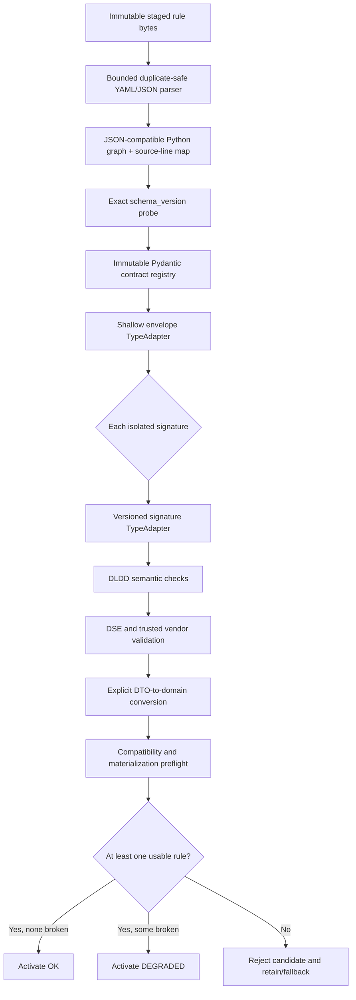

# DLDD Pydantic Rule Validation Design

## Status and Intent

This document proposes the detailed design for making Pydantic v2 the sole runtime structural validator for Device Local Diagnosis Daemon (DLDD) vendor rules.

It supplements:

- `vendor-rules-schema-hld.md`, which defines the vendor-facing rule contract.
- `device-local-diagnosis-daemon.md`, which defines validation, activation, execution, telemetry, and lifecycle behavior.
- `pydantic-validation-plan.md`, which defines the implementation sequence and acceptance gates.

The design is intentionally narrow: Pydantic replaces the current Draft-7/`fastjsonschema` structural checks and typed input construction. It does not replace bounded parsing, DLDD business semantics, platform compatibility, DSE resolution, vendor-hook discovery, materialization, runtime scheduling, or lifecycle fallback.

## Executive Decision

The authoritative contract for each supported `schema_version` will be an installed set of immutable, exact-version Pydantic model classes.

Runtime validation will not load, compile, or execute a JSON Schema file. A JSON Schema may be generated from the authoritative Pydantic models for vendor tooling and documentation, but that generated artifact is derivative and is not a runtime authority.

The validation path remains two-stage:

1. Validate a shallow file envelope at file scope.
2. Validate each isolated signature independently at rule scope.

This preserves the established behavior that one invalid rule does not poison valid rules in the same candidate generation.

## Assumptions and Resolved Ambiguities

### Python baseline

The deployed SONiC system reports CPython 3.13.5. The design therefore targets Pydantic v2 on CPython 3.13. SONiC build variants that still use another supported Python 3 version must also be qualified before integration.

### Schema `0.0.1` is not released

Schema `0.0.1` may be changed in place during this implementation because it has not been released. This one-time pre-release decision permits:

- Replacing Draft-7 runtime authority with Pydantic authority.
- Tightening unknown-field behavior for core objects.
- Adding optional event-level `sampling_interval`.
- Correcting inconsistent or ambiguous validation behavior.

After the first release, exact-version behavior is immutable. A behavioral contract change then requires an appropriate new schema version and explicit registry entry.

### Unknown fields

The current pre-release JSON Schema broadly permits additional properties. The first released Pydantic contract will instead use this deliberate policy:

- Core DLDD objects are closed and reject unknown fields.
- Explicit vendor extension envelopes allow and preserve bounded JSON-compatible vendor fields.
- Built-in types cannot use vendor fallback to bypass a malformed built-in contract.

All available vendor rules and fixtures must be audited before cutover so that a field currently relying on permissive behavior is either modeled explicitly or moved into a documented extension point.

### Optional event timing

`sampling_interval` belongs to an event, not an entire signature. It is optional, expressed in seconds, and must be a strict integer from 1 through `0xFFFFFFFF` when present.

- Omitted means inherit the current effective default for the materialized source's monitor.
- Explicit `null` is invalid.
- Zero, booleans, floats, and numeric strings are invalid.
- Pydantic stores omission as unresolved; it does not read CONFIG_DB or inject a literal default.
- DLDD does not persist cadence across restart. Every eligible work item starts due, then resumes normal cadence.

`sampling_interval` is independent of `match_period`, `logic_lookback_time`, action `wait_period`, operation `timeout`, and `active_fault_recheck_interval`.

## Goals

- Maintain one authoritative structural contract instead of parallel Python and JSON Schema definitions.
- Produce typed validated data without manually repeating required/type/range/enum checks.
- Preserve exact schema-version selection.
- Preserve file-versus-rule error isolation.
- Preserve stable operator-facing diagnostics.
- Preserve trusted vendor extension points.
- Keep the runtime planner, correlator, action system, and telemetry independent of Pydantic.
- Generate a machine-readable schema for vendors from the same authoritative models.
- Fail closed on package/model registry defects.

## Non-Goals

- Accepting a schema, Python module, model name, or validator supplied by uploaded YAML.
- Inferring compatibility between semantic versions.
- Making Pydantic responsible for hardware access or runtime source availability.
- Replacing the current duplicate-safe and resource-bounded parser.
- Passing Pydantic models throughout all DLDD runtime subsystems.
- Persisting event scheduling timestamps across process restarts.
- Treating generated JSON Schema as a second runtime validation authority.

## Architecture



### Failure boundaries

| Stage | Failure scope |
|---|---|
| Decode, syntax, duplicate keys, aliases, document limits | File |
| Missing, non-string, or unsupported `schema_version` | File |
| Invalid root, top-level fields, signatures collection, or wrapper shape | File |
| Duplicate rule name or ID across the candidate | File |
| Invalid field within an isolatable signature | Rule |
| Invalid rule logic, references, or cross-field semantics | Rule |
| Missing DSE binding, vendor hook, or adapter configuration | Rule |
| Zero usable rules after validation/materialization | Candidate activation failure |
| Corrupt contract registry or unexpected validator exception | Package/service failure |

Pydantic ingestion failures are not transient runtime monitor failures and must not increment runtime source-failure counters.

## Source of Truth and Version Registry

### Static installed registry

The registry is Python code installed with DLDD:

```python
@dataclass(frozen=True)
class RuleContract:
    version: str
    envelope: TypeAdapter
    signature: TypeAdapter
    document: TypeAdapter
    envelope_model: type[BaseModel]
    signature_model: type[BaseModel]
    document_model: type[BaseModel]
    to_domain: Callable


CONTRACTS = MappingProxyType({
    "0.0.1": RuleContract(
        version="0.0.1",
        envelope=TypeAdapter(EnvelopeV001),
        signature=TypeAdapter(SignatureWrapperV001),
        document=TypeAdapter(RulesDocumentV001),
        envelope_model=EnvelopeV001,
        signature_model=SignatureWrapperV001,
        document_model=RulesDocumentV001,
        to_domain=signature_v001_to_domain,
    ),
})
```

Context-free, version-specific semantics are model validators inside the
registered Pydantic types. After explicit DTO-to-domain conversion, the
existing `materialize_signature()` stage consumes only version-neutral,
immutable domain objects. Keeping that domain stage outside `RuleContract`
avoids a redundant version dispatch and keeps future wire versions decoupled
from monitor/runtime code.

The exact class and function names may vary, but the following behavior is mandatory:

- Lookup is exact; `0.0.2` never falls back to `0.0.1`.
- The mapping is immutable after module initialization.
- A rule file cannot add or change a registry entry.
- No registry entry contains a URL or untrusted filesystem path.
- A model's `schema_version` uses `Literal` and must match its registry key.
- Registry/model mismatch or adapter construction failure is an installation failure.
- A newer version receives an explicit registry entry even when it intentionally reuses an existing implementation.

### Model organization

```text
dldd/rule_schema/
  __init__.py
  base.py
  errors.py
  registry.py
  v0_0_1.py
  generate.py
```

Version-specific wire models stay in the version module. Shared helpers may live in `base.py`, but a later version must not silently inherit constraints merely because they happen to be implemented in a shared class.

## Parser Boundary

Pydantic receives an already parsed Python graph. It does not receive untrusted bytes or directly parse YAML/JSON.

The existing parser remains responsible for:

- Maximum source size: 4 MiB.
- UTF-8 decoding.
- A single YAML or JSON document.
- Safe YAML loading and rejection of Python/custom tags.
- Duplicate keys at every mapping level.
- YAML aliases and recursive structures.
- Non-finite numbers.
- Maximum document depth: 64.
- Maximum document nodes: 100,000.
- Maximum entries in a collection: 10,000.
- Maximum scalar string size: 1 MiB.
- Maximum signatures: 1,024.
- Maximum events per signature: 1,000.
- Logic and regular-expression resource limits.
- Source-line mapping for diagnostics.

The call boundary is:

```python
adapter.validate_python(parsed_value, strict=True)
```

`model_validate_json()` is not used for ingress because it would bypass DLDD's duplicate-key, alias, source-line, and application-specific resource controls. Strict behavior also differs in some JSON-mode conversions.

Direct internal callers of `validate_document()` still receive document-limit checks and strict Pydantic validation; they cannot bypass the contract by passing a preconstructed mapping.

## Base Model Policy

Core models inherit a shared configuration equivalent to:

```python
class ContractModel(BaseModel):
    model_config = ConfigDict(
        strict=True,
        extra="forbid",
        validate_default=True,
        allow_inf_nan=False,
        frozen=True,
        hide_input_in_errors=True,
        loc_by_alias=True,
        revalidate_instances="always",
    )
```

Important consequences:

- Numeric strings are not converted to numbers.
- Booleans are not accepted as integers.
- Unknown core fields do not disappear silently.
- Default values are themselves validated.
- NaN and infinities are not accepted through direct Python calls.
- Error rendering does not include full rule payloads.
- Models are assignment-frozen, but nested immutability is not assumed.

Pydantic's `frozen=True` is not deep immutability. Successful validation DTOs are converted explicitly into the existing tuple- and `MappingProxyType`-based domain dataclasses before runtime use.

## Type and Constraint Policy

Reusable constrained aliases make the contract readable:

```python
NonEmptyString = Annotated[str, Field(min_length=1)]
RuleId = Annotated[int, Field(ge=1_000_000, le=9_999_999)]
EventId = Annotated[int, Field(ge=1, le=999)]
PositiveSeconds = Annotated[int, Field(ge=1, le=0xFFFFFFFF)]
NonNegativeSeconds = Annotated[int, Field(ge=0, le=0xFFFFFFFF)]
SamplingInterval = PositiveSeconds
JsonInteger = Annotated[int, Field(ge=-(2**63), le=2**64 - 1)]
```

Every list constraint applies to both the list and, where needed, its item type. Every wire-level mapping uses string keys. Arbitrary Python types are forbidden in input models.

Priority and `max_output_bytes` use the unsigned 32-bit range. Integer-valued
JSON/vendor data, comparison/scaling values, and numeric mask values use the
serialization-safe range -2^63 through 2^64-1. Mask integer strings are
limited to 256 characters before parsing and must resolve into that same
range. Float fields require an actual finite float; an oversized integer may
not fall through a float union branch and lose precision.

Vendor data uses a recursive JSON-compatible value type rather than `Any`:

```text
JSON scalar: string | bounded integer (-2^63..2^64-1) | finite float | boolean | null
JSON value: scalar | list[JSON value] | dict[string, JSON value]
```

Parser and document limits apply recursively to vendor payloads before model validation.

## Shallow Envelope Model

The runtime envelope intentionally does not type the complete signature body:

```python
class ShallowSignatureWrapperV001(ContractModel):
    signature: dict


class EnvelopeV001(ContractModel):
    schema_version: Literal["0.0.1"]
    local_action_default_timeout: PositiveSeconds = omitted_non_null_field()
    signatures: Annotated[
        list[ShallowSignatureWrapperV001],
        Field(min_length=1, max_length=1024),
    ]
```

The bounded, duplicate-safe parser has already made the raw signature body
safe to retain. The shallow model intentionally checks only that `signature`
is a mapping; it does not recursively type its contents. Nested core fields,
string keys, and explicit vendor `JsonValue` envelopes are enforced by the
independent per-signature adapter, preserving rule-level isolation for YAML
scalars such as timestamps and dates.

`omitted_non_null_field()` uses a default factory with default validation
disabled for the internal omitted value. The declared annotation remains
non-null, so an explicitly supplied `null` still enters validation and fails.
`model_fields_set` remains the authoritative record when conversion needs to
distinguish omission from a supplied value.

The shallow wrapper makes these errors file-scoped because they prevent deterministic isolation:

- `signatures` is not a list.
- A list item is not an object.
- A wrapper lacks `signature`.
- `signature` is not an object.
- A wrapper contains unknown core fields.

The signature body remains raw until the independent per-rule loop.

A separate fully nested `RulesDocumentV001` may be defined for generated JSON Schema and positive contract tests. It must not be used as the runtime activation gate.

## Signature Models

`SignatureWrapperV001` contains a fully typed `SignatureV001`, which contains:

- `MetadataV001`.
- `ConditionsV001`.
- `ActionsV001`.

Structural requirements such as required fields, primitive types, ranges, string patterns, enums, list bounds, and wrapper shapes belong in model fields.

Cross-field constraints local to a model belong in `field_validator` or `model_validator` functions when that keeps the contract clear. Examples include:

- `match_period == 0` requires `match_count == 1`.
- Event IDs are unique within one signature.
- The condition expression references only declared event IDs.
- A log collection has at least one log or query.
- A direct I2C write includes a value.
- A local action has a timeout or can inherit the file default.
- A DSE evaluation without an operator must later resolve comparator semantics.

Validators remain deterministic, side-effect-free, and bounded. They do not read Redis, files, hardware, network services, or execute configured commands.

## Typed Event and Evaluation Dispatch

Built-in types use discriminated unions keyed by the existing `type` field.

Conceptually:

```python
BuiltinEventV001 = Annotated[
    RedisEventV001
    | FileEventV001
    | SysfsEventV001
    | CliEventV001
    | I2CEventV001
    | DSEEventV001
    | PlatformApiEventV001,
    Field(discriminator="type"),
]
```

Each event subtype owns its path shape. Each evaluation subtype owns the fields valid for its evaluation type. Untagged Pydantic smart unions are not used for behavior-bearing objects because their selection rules are less explicit and may evolve between Pydantic minor versions.

The generated schema consequently describes the built-in variants, required fields, and discriminator values directly from the same models used at runtime.

## Built-In and Vendor Extension Dispatch

### Trust model

Rule content may select only a type name. It never selects a module, class, function, model path, package, or URL.

Installed and trusted platform code advertises vendor types before activation. The registry is frozen before validating the candidate generation.

### Dispatch rule

For each source, evaluator, action, or query type:

```text
reserved built-in name
    → exact built-in Pydantic model

advertised vendor name
    → generic vendor envelope
    → vendor Pydantic adapter or side-effect-free validation hook

anything else
    → unsupported-type rule error
```

A malformed object with `type: cli`, `type: dse`, or `type: i2c` must fail its built-in model. It must never fall through and become a vendor operation.

### Vendor wire representation

For compatibility with the current rule shape, vendor operation fields may remain adjacent to `type` and standard fields. Only explicit vendor envelope models, including vendor operations and `platform_api` hook paths, use `extra="allow"`; their annotated Pydantic extras are restricted to bounded `JsonValue` and converted losslessly to immutable domain mappings.

Reserved fields such as `type`, `timeout`, `path`, `command`, `argv`, and `max_output_bytes` cannot be shadowed through vendor extras.

Where a vendor provides a Pydantic adapter, DLDD passes only the bounded vendor payload to it and converts its errors into DLDD-owned diagnostics. The vendor output is revalidated or converted into a trusted internal binding before planner use.

### Side-effect boundary

Vendor validation may inspect configuration and construct bindings, but it must not:

- Import a name from the rule file.
- Read hardware or a monitored Redis value.
- Execute CLI or I2C operations.
- Run remediation actions or diagnostic queries.
- Access a network service.

Unexpected exceptions from trusted extension code are package/platform failures and abort candidate activation. Declared validation errors remain localized to the affected rule.

## Omitted, Null, Defaults, and Inheritance

Pydantic distinguishes required fields from fields with defaults, but a nullable annotation also permits explicit `null`. DLDD therefore defines and tests the following states separately:

| Input state | Meaning |
|---|---|
| Omitted | Optional, or eligible for an explicitly defined default/inheritance rule |
| Explicit `null` | Invalid unless the exact field contract explicitly says nullable |
| Zero or false | Explicit value; never treated as omitted |
| Empty string/list | Accepted only when the exact field constraints permit it |

Omitted-but-non-nullable fields use the reusable non-null annotation/default-
factory pattern above. `model_fields_set` or an equivalent presence record is
used when later conversion must distinguish omission.

The generated JSON Schema must describe the same behavior. A field that is omissible but rejects explicit `null` must be emitted as an optional non-null property. The version module or schema generator must use a reviewed reusable annotation/sentinel or generated-schema customization for this purpose; it must not publish a nullable schema merely because the DTO stores an internal `None` or unset marker. Runtime-versus-generated-schema parity tests are mandatory for every such field.

### Static model defaults

Defaults that are part of schema `0.0.1` may be applied to the validation DTO, for example:

- Metadata priority defaults to `5`.
- String evaluation case sensitivity defaults to `true`.
- Value representation fields use their documented `N/A` values when omitted.

The raw parsed document is never mutated.

### File-level timeout inheritance

An omitted local-action timeout is resolved from `local_action_default_timeout` during version-specific semantic conversion. If both are omitted, the affected rule fails. Log-query timeouts remain optional and are not inherited unless the HLD explicitly changes that behavior.

### Monitor-default sampling inheritance

An omitted event sampling interval stays unresolved through Pydantic validation and domain conversion. The planner resolves it after DSE expansion and monitor assignment because one abstract event may materialize into sources assigned to different monitors.

## Event Sampling Contract

Example:

```yaml
events:
  - event:
      id: 1
      type: redis
      sampling_interval: 86400
      path:
        database: STATE_DB
        table: TEMPERATURE_INFO
        key: ASIC
        path: temperature
      evaluation:
        type: comparison
        operator: ">"
        value: 95
      match_count: 1
      match_period: 0
```

`sampling_interval: 86400` requests one normal collection attempt per day while the correlation key is eligible for normal polling.

When omitted, the materialized work item inherits:

| Assigned monitor | Effective default source |
|---|---|
| Redis | `DLDD_CONFIG|global.redis_monitor_polling_interval` |
| File | `DLDD_CONFIG|global.file_monitor_polling_interval` |
| Common/vendor | `DLDD_CONFIG|global.common_monitor_polling_interval` |

The normal configuration precedence remains CONFIG_DB, then vendor defaults, then hardcoded defaults.

Runtime representation should distinguish explicit from inherited timing:

```python
@dataclass(frozen=True)
class MonitorWorkItem:
    # existing fields...
    sampling_interval: float
    sampling_interval_is_explicit: bool


@dataclass
class MonitorWorkStateRecord:
    # existing fields...
    next_sample_due: float | None = None
```

Scheduling rules:

- Use monotonic time for due calculations.
- Initialize each eligible key due at daemon/plan startup.
- After a normal attempt, schedule `attempt_time + effective_interval`.
- Coalesce missed intervals; do not generate catch-up bursts.
- `IN_FLIGHT`, held, suspended, and broken states take precedence over normal cadence.
- An eligible `RECHECK_ONCE` request bypasses the normal sampling interval.
- A CONFIG_DB update affects only inherited items.
- When a default becomes shorter, pull an inherited item's next due time forward if appropriate.
- When a default becomes longer, do not cancel an already nearer due attempt; use the new interval after that attempt.
- Explicit event intervals do not change when CONFIG_DB monitor defaults change.

`match_period` remains an evidence-history window. It does not schedule samples.

## DTO-to-Domain Conversion and Runtime Usage

Pydantic models are short-lived validation DTOs. Existing DLDD domain dataclasses remain the interface to planning, correlation, actions, and telemetry.

Conversion is explicit and version-specific:

```python
def signature_v001_to_domain(
    wrapper: SignatureWrapperV001,
    *,
    local_action_default_timeout: int | None,
) -> Signature:
    ...
```

The conversion function:

- Applies only authorized defaults and inheritance.
- Converts lists to tuples.
- Recursively freezes mappings and vendor options.
- Preserves `sampling_interval` as an optional event field.
- Does not use `model_dump()` as an unreviewed catch-all conversion.
- Does not attach callables from rule data.
- Produces the existing `Metadata`, `Evaluation`, `Event`, `Operation`, `Actions`, and `Signature` domain objects.

DSE resolution and materialization later attach trusted comparator, source, adapter, and executor bindings. These callables are never fields of an untrusted Pydantic input model.

## Semantic Validation Boundary

Pydantic owns structural and context-free semantic rules. Regular DLDD code continues to own context-dependent behavior.

| Concern | Owner |
|---|---|
| Required fields, primitive types, enums, ranges, patterns | Pydantic model fields |
| Type-specific path/evaluation/action/query shape | Pydantic discriminated models |
| Local cross-field invariants | Pydantic validators |
| Logic tokenization/tree construction and event reference checks | Bounded DLDD helper called by a model validator or semantic stage |
| Duplicate rule name/ID across the file | File gate |
| File timeout inheritance | Version-specific semantic conversion |
| Product/software compatibility | Materialization preflight |
| DSE resolution and expansion | Trusted DSE materialization |
| Advertised vendor type availability | Trusted extension registry |
| Adapter configuration validity | Side-effect-free activation preflight |
| Source value availability | Runtime monitor, not activation validation |

Moving a helper behind a Pydantic model validator does not make unbounded or side-effecting behavior acceptable. Logic, regular expressions, DSE references, and vendor payloads retain explicit complexity limits.

## Diagnostics

Raw Pydantic errors are never emitted directly into logs, Redis telemetry, CLI JSON, or controller-visible state.

### Normalization

Each `ValidationError.errors()` entry is normalized into DLDD's existing `ValidationIssue` fields:

- Stable DLDD issue code.
- File or rule scope.
- Canonical JSON-style path.
- Source line from the parser map.
- Rule name and ID when safely identifiable.
- Bounded human-readable message.

The normalizer calls Pydantic error APIs with raw input, documentation URLs, and unnecessary context excluded.

Representative mapping:

| Pydantic error type | DLDD issue code family |
|---|---|
| `missing` | `missing_field` |
| `dict_type`, `list_type`, `string_type`, `int_type`, `bool_type`, `float_type` | `invalid_type` |
| `extra_forbidden` | `unknown_field` |
| `literal_error`, `enum` | `unsupported_value` |
| `greater_than*`, `less_than*` | `out_of_range` |
| `too_short`, `too_long` | `invalid_length` |
| `string_pattern_mismatch` | `invalid_format` |
| `union_tag_not_found`, `union_tag_invalid` | `unsupported_type` |
| DLDD `PydanticCustomError` | Explicit stable DLDD semantic code |

Pydantic may include internal model or union-branch names in error locations. The normalizer removes those implementation details, uses wire aliases, prepends the signature index, and produces paths such as:

```text
$.signatures[2].signature.conditions.events[0].event.sampling_interval
```

### Stability and bounds

Diagnostics are sorted deterministically by path and code. Repeated validation of identical bytes must produce identical DLDD issue metadata.

The implementation must cap:

- Issues returned per rule.
- Issues returned for the complete candidate.
- Individual message bytes.
- Total serialized diagnostic bytes.

When a cap is reached, DLDD emits one stable truncation issue rather than using unbounded memory. Exact limits belong in implementation constants and tests.

Schema `0.0.1` uses 64 normalized Pydantic issues per rule, 4,096 issues
across a candidate, 1,024 bytes per message, 2,048 bytes per published path,
and a 1 MiB compact serialized diagnostic budget. Long paths and diagnostic
identities retain a short SHA-256 suffix so truncation cannot merge distinct
fields. The candidate budget reserves room for at least one truncation marker
for every broken signature. Activation-preflight hook/adapter failures use the
same bounded representation.

Pydantic documents `type` as the stable field for programmatic error handling; message, context, and location formatting may change across minor releases. Exact dependency pins and DLDD normalization prevent that churn from becoming an operator-facing API change.

## Generated JSON Schema

DLDD continues publishing a machine-readable schema for vendor authoring, editor integration, and external validation tools.

Generation uses the fully nested version model:

```bash
python3 -m dldd.rule_schema.generate --version 0.0.1 --output PATH
python3 -m dldd.rule_schema.generate --version 0.0.1 --check PATH
```

Generated artifact requirements:

- Draft 2020-12, matching Pydantic v2 output.
- Stable `$id` and title.
- Exact rule schema version.
- A warning that the file is generated and must not be hand-edited.
- Deterministic formatting with the pinned Pydantic release.
- Packaged for vendor/offline tooling.
- CI check that regeneration matches the committed artifact.
- Constraints that Draft 2020-12 cannot express without changing runtime
  semantics carry a stable
  `x-dldd-runtime-constraint` annotation and remain enforced by the
  authoritative Pydantic model. These include Python's strict `int` versus
  `float` distinction (JSON Schema treats `50` and `50.0` as the same
  mathematical integer) and the parsed numeric range of a mask string.

The daemon does not open this file. Removing the generated artifact from an installed test environment must not change runtime validation behavior.

Schema layout JSON remains optional extraction metadata for external version-neutral consumers. It is not a validation authority and is not part of contract lookup.

## Package Integrity and Dependency Policy

### Candidate dependency

As of 2026-07-06, Pydantic 2.13.4 is the latest stable release and is the initial qualification candidate. Its compatible `pydantic-core` release and all transitive dependencies must be pinned from the resolved package metadata.

No alpha, beta, release candidate, floating range, or unpinned core dependency is acceptable for the SONiC image.

### Required qualification

- Update the Python requirement declared by `sonic-host-services` from `>=3.8` to at least `>=3.9`, matching the selected Pydantic v2 release. A branch that intentionally supports only current SONiC Python may declare a stricter baseline after build-owner review.
- CPython 3.13 wheel availability on the deployed architecture.
- Wheel availability on every supported SONiC architecture and Python build variant.
- No unexpected Rust/source compilation in the image build.
- Reproducible wheel hashes.
- `pip check` in build and final images.
- Native extension import and linkage inspection.
- Full `sonic-host-services` test execution.
- Full SONiC image build.
- License, SBOM, and vulnerability review.
- Startup latency and resident-memory comparison.
- Conflict review with every other host Python package.

Failure to import compatible `pydantic-core` is an image-construction failure, not an error deferred until DLDD starts.

## Implementation File Map

| Repository file | Planned responsibility |
|---|---|
| `sonic-host-services/dldd/rule_schema/base.py` | Strict base configuration, constrained aliases, bounded JSON value type, and reusable omission/null helpers |
| `sonic-host-services/dldd/rule_schema/v0_0_1.py` | Complete authoritative `0.0.1` envelope, signature, event, evaluation, action, query, and generated-document models |
| `sonic-host-services/dldd/rule_schema/registry.py` | Immutable exact-version `RuleContract` mapping and startup integrity checks |
| `sonic-host-services/dldd/rule_schema/errors.py` | Pydantic-to-DLDD error normalization, path cleanup, redaction, sorting, and limits |
| `sonic-host-services/dldd/rule_schema/generate.py` | Deterministic Draft 2020-12 publication artifact generation and `--check` mode |
| `sonic-host-services/dldd/validation.py` | Existing bounded parser, file/rule isolation, semantic stages, source-line mapping, and orchestration of Pydantic adapters |
| `sonic-host-services/dldd/models.py` | Deeply immutable domain models; adds optional event sampling interval |
| `sonic-host-services/dldd/planner.py` | Resolves explicit versus per-monitor inherited intervals after source materialization |
| `sonic-host-services/dldd/runtime.py` | Carries effective interval/source and per-key next-due scheduling state |
| `sonic-host-services/dldd/monitor.py` | Per-key due scheduling, startup behavior, dynamic default updates, and one-shot recheck precedence |
| `sonic-host-services/dldd/schema_registry.py` | Removed after cutover |
| `sonic-host-services/dldd/schemas/dld-rules-0.0.1.json` | Regenerated Draft 2020-12 vendor artifact; no runtime reads |
| `sonic-host-services/dldd/schemas/schema-layout-0.0.1.json` | Optional external extraction metadata only |
| `sonic-host-services/setup.py` | Direct Pydantic dependency and truthful Python baseline |
| `sonic-host-services/tests/dldd/test_validation.py` | Positive/negative rule contracts, semantic conversion, and vendor/DSE behavior |
| `sonic-host-services/tests/dldd/test_schema_validation_security.py` | Strictness, parser limits, exact registry, isolation, diagnostics, and no-runtime-schema-I/O tests |
| `sonic-host-services/tests/dldd/test_runtime.py` | Event cadence and effective work-item interval tests |
| `sonic-host-services/tests/dldd/test_orchestrator.py` | Hold/recheck/restart interactions with event cadence |
| `sonic-buildimage/files/build/versions-public/.../versions-py3` | Exact Pydantic/core/transitive version locks for build and host image targets |
| `sonic-buildimage/files/build_templates/sonic_debian_extension.j2` | Explicit binary-wheel installation for the Debian host-image path whose package metadata does not provide a usable RECORD |
| `whitebox-sonic-buildimage/files/build_templates/sonic_debian_extension.j2` | Same host-image dependency installation on the Cisco/whitebox integration branch |
| `SONiC/doc/device_local_diagnosis/vendor-rules-schema-hld.md` | Normative vendor wire contract and validation semantics |
| `SONiC/doc/device_local_diagnosis/device-local-diagnosis-daemon.md` | Runtime validation, activation, scheduling, telemetry, and test behavior |

## Security Properties

The Pydantic design must maintain or improve these properties:

- No network schema retrieval.
- No schema URI, module, class, or callable selected by rule content.
- No duplicate-key ambiguity.
- No YAML object construction.
- No silent core-field dropping.
- No lax numeric or boolean coercion.
- No non-finite numeric values.
- Bounded source, document, logic, regex, vendor payload, and diagnostic complexity.
- No source reads or side effects during normal activation.
- No raw rule payload included in validation errors.
- No mutable vendor data reaches runtime execution structures.
- No malformed built-in operation accepted through vendor fallback.
- No unsupported exact schema version accepted by proximity.

The generated JSON Schema does not weaken these guarantees because it is never executed by the daemon.

## Validation Modes

Public CLI modes remain compatible:

### `static-schema`

The name is retained for compatibility. It now means:

- Bounded safe parsing.
- Exact Pydantic contract selection.
- Shallow envelope validation.
- Independent per-signature Pydantic validation.
- Context-free semantic checks.

It performs no platform extension discovery or hardware/external access.

### `dse-resolve`

Adds DSE and vendor extension resolution and evaluator construction without sampling sources.

### `activation-dry-run`

Adds compatibility checks, full materialization, trusted hook discovery, and side-effect-free adapter configuration validation. It remains the normal promotion gate.

### `hardware-probe` and `e2e-execute`

Remain explicit qualification modes. Their behavior is unaffected by the schema-engine replacement.

## File-Level and Rule-Level Processing

Illustrative control flow:

```python
def validate_document(document, context, materialize=True):
    enforce_document_limits(document)
    version = probe_exact_version(document)
    contract = CONTRACTS.require_exact(version)

    try:
        envelope = contract.envelope.validate_python(document, strict=True)
    except ValidationError as error:
        return file_failure(normalize(error, base_path="$"))

    identity_issues = validate_cross_rule_identities(envelope)
    if identity_issues:
        return file_failure(identity_issues)

    valid = []
    broken = []
    materialized_rules = []

    for index, shallow in enumerate(envelope.signatures):
        try:
            dto = contract.signature.validate_python(
                {"signature": shallow.signature},
                strict=True,
            )
            domain = contract.to_domain(
                dto,
                local_action_default_timeout=(
                    envelope.local_action_default_timeout
                ),
            )
            result = (
                materialize_signature(domain, context)
                if materialize
                else None
            )
        except ExpectedRuleValidationError as error:
            broken.append(to_broken_rule(index, error))
            continue

        valid.append(domain)
        if result is not None:
            materialized_rules.append(result)

    return ValidationResult(...)
```

The real implementation must distinguish expected validation failures from unexpected programming/package exceptions. A broad `except Exception` that converts every validator defect into a broken vendor rule is non-conforming.

## Test Design

### Contract tests

- Every positive HLD example validates.
- Every required field rejects omission.
- Every constrained field tests lower boundary, upper boundary, and one value beyond each.
- Every enum and discriminator tests all valid and representative invalid values.
- Generated schema is deterministic and current.
- Registry version and model literal are consistent.

### Strictness matrix

Test, where applicable:

- `1`, `1.0`, `"1"`, `true`, and `false`.
- `"true"` versus `true`.
- List versus tuple.
- String versus bytes.
- YAML timestamp/date objects versus strings.
- Plain dictionary versus custom mapping.
- Finite versus non-finite floats.

### Presence/default matrix

For every optional or defaulted field:

- Omitted.
- Explicit `null`.
- Zero or false.
- Empty string or list.
- Valid explicit value.

Verify both accepted output and `model_fields_set`/presence semantics.

### Extra-field matrix

Inject an unknown field into every core model and verify rejection. Inject bounded vendor fields at every documented extension point and verify exact round-trip preservation into frozen runtime options.

### Union and vendor matrix

- Every built-in source, evaluation, action, and query type.
- Missing discriminator.
- Non-string discriminator.
- Unknown discriminator.
- Malformed built-in carrying vendor-like fields.
- Advertised vendor type.
- Unadvertised vendor type.
- Vendor hook invalid payload.
- Vendor hook unexpected exception.

### Isolation and lifecycle matrix

| Candidate | Expected result |
|---|---|
| Unsupported schema version | File rejection |
| One good, one broken | Activate one rule as `DEGRADED` |
| Two broken | Zero-usable activation failure and fallback/retention |
| Two good | Activate both as `OK` |
| Duplicate rule ID/name | File rejection |
| One DSE resolution failure, one usable | `DEGRADED` |

### Parser/security tests

Retain current duplicate-key, alias, unsafe-tag, source-size, depth, node, collection, scalar, signature, event, recursive-object, and non-finite-number tests. Add boundary and boundary-plus-one cases where missing.

### Timing tests

- Explicit event interval.
- Omitted interval for Redis, file, and common monitors.
- Mixed explicit and inherited events in the same monitor.
- One DSE event expanding to sources assigned to different monitors.
- CONFIG_DB update affecting inherited work only.
- Restart making every eligible work item due.
- No catch-up burst after a delayed cycle.
- Holds, suspension, `IN_FLIGHT`, and `RECHECK_ONCE` precedence.

### Packaging tests

- Import exact Pydantic/core versions under Python 3.13.
- Run on every image architecture.
- Verify wheel contents and generated schema package data.
- Verify runtime does not open the generated schema.
- Run `pip check`, host-service tests, and full image build.

## Migration from the Current Implementation

### Retained

- Bounded parsing and source-line mapping in `dldd/validation.py`.
- Cross-rule identity checks.
- Logic parsing and bounded expression handling.
- Compatibility matching.
- DSE and vendor registries.
- Evaluator construction.
- Immutable models in `dldd/models.py`.
- Materialization and planner integration.
- `ValidationResult`, `BrokenRule`, and telemetry behavior.
- Lifecycle fallback and zero-usable guard.
- Pinned `regex` runtime evaluation deadline.

### Replaced or removed

- `dldd/schema_registry.py` Draft-7 file loading and compilation.
- Runtime loading of `dld-rules-0.0.1.json`.
- `$id`, `$ref`, dialect, and external-reference enforcement that exists only because runtime executes JSON Schema.
- `fastjsonschema` imports and DLDD dependency pins.
- Separate static-schema issue generation.
- Manual required/type/range/enum checks duplicated by the versioned models.

### Retained as derived documentation

- Generated `dld-rules-0.0.1.json`, now Draft 2020-12 and generated from Pydantic.
- `schema-layout-0.0.1.json` when external consumers still need stable extraction paths.

## Required HLD Reconciliation

Before implementation is considered complete, the existing HLDs must be updated in these areas.

### `vendor-rules-schema-hld.md`

- Replace the independent static JSON Schema authority with exact-version Pydantic model authority.
- Replace the trusted Draft-7 schema registry section with the installed model registry.
- Remove runtime `$id`, `$ref`, dialect, and compilation requirements.
- Describe strict coercion, omitted/null, default, and unknown-field behavior.
- Describe the generated Draft 2020-12 artifact as derivative.
- Preserve two-stage validation, failure scopes, vendor hooks, and side-effect boundaries.
- Add event-level `sampling_interval` and clearly separate it from correlation windows.

### `device-local-diagnosis-daemon.md`

- Replace Draft-7/`fastjsonschema` implementation notes.
- Redefine `static-schema` without renaming the public mode.
- Replace JSON Schema-specific tests with Pydantic contract and registry tests.
- Describe per-work-item due scheduling and CONFIG_DB inheritance.
- Remove the statement that per-rule/event polling intervals are unsupported.

## Risks and Mitigations

| Risk | Mitigation |
|---|---|
| Native `pydantic-core` wheel unavailable on an architecture | Qualify every target before cutover; disallow accidental source builds |
| Lax coercion changes accepted input | Strict config plus strict call flag and coercion matrix |
| Unknown fields silently dropped | Explicit `extra` on every model; never use default ignore behavior |
| Generated schema changes after dependency upgrade | Exact dependency pins and CI regeneration diff |
| Raw Pydantic error format changes | Normalize only stable error types into DLDD-owned diagnostics |
| One invalid rule rejects the complete document | Shallow envelope plus per-signature adapters |
| Malformed built-in falls through to vendor type | Reserve built-in tags and dispatch them before vendor fallback |
| Vendor model performs side effects | Contractual side-effect boundary and tests with fail-fast execution methods |
| DTO and domain model drift | Explicit versioned converter tests comparing every field |
| Event cadence changes fault correlation unexpectedly | Keep sampling, match period, and logic lookback independent and test timing interactions |

## Acceptance Criteria

The design is implemented correctly when:

1. Pydantic models are the only runtime structural rule authority.
2. Runtime behavior does not depend on opening a JSON Schema file.
3. Parser security and document bounds remain intact.
4. Exact version lookup rejects every unregistered version.
5. One broken rule does not prevent other valid rules from activating.
6. Zero usable rules rejects the candidate and preserves a usable generation when available.
7. Core unknown fields fail and vendor extension data is preserved only at explicit extension points.
8. Pydantic coercion cannot turn an invalid wire value into a valid rule value.
9. DLDD diagnostics remain stable, scoped, source-located, deterministic, and bounded.
10. Vendor and DSE validation remain trusted, advertised, and side-effect-free.
11. Runtime subsystems consume deeply immutable domain objects, not mutable input DTOs.
12. Event sampling intervals are optional, event-specific, and inherit per-monitor CONFIG_DB defaults only when omitted.
13. DLDD restart makes all eligible work immediately due and persists no cadence state.
14. Generated Draft 2020-12 schema and optional layouts are available for vendor tooling.
15. Python 3.13 and every supported SONiC architecture pass dependency, unit, image, and live-device qualification.

## References

- [Pydantic JSON Schema](https://docs.pydantic.dev/latest/concepts/json_schema/)
- [Pydantic strict mode](https://docs.pydantic.dev/latest/concepts/strict_mode/)
- [Pydantic models and extra data](https://docs.pydantic.dev/latest/concepts/models/#extra-data)
- [Pydantic discriminated unions](https://docs.pydantic.dev/latest/concepts/unions/#discriminated-unions)
- [Pydantic validators](https://docs.pydantic.dev/latest/concepts/validators/)
- [Pydantic TypeAdapter](https://docs.pydantic.dev/latest/concepts/type_adapter/)
- [Pydantic version policy](https://docs.pydantic.dev/latest/version-policy/)
- [Pydantic installation and native core dependency](https://docs.pydantic.dev/latest/install/)
- [Pydantic package releases](https://pypi.org/project/pydantic/)
