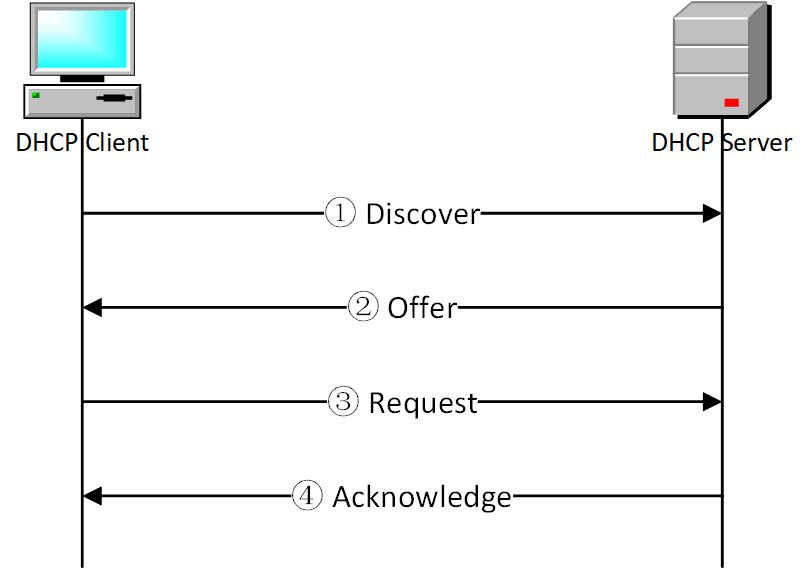
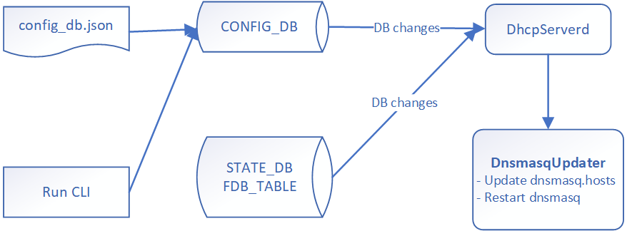
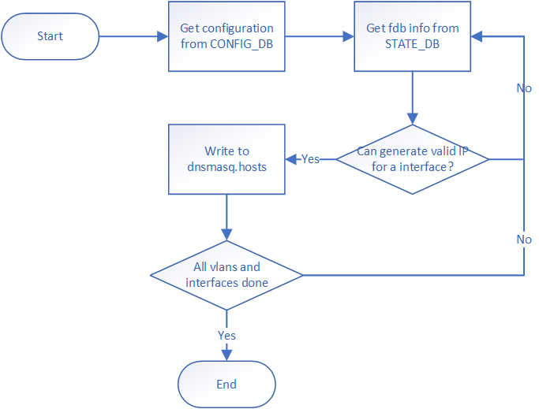
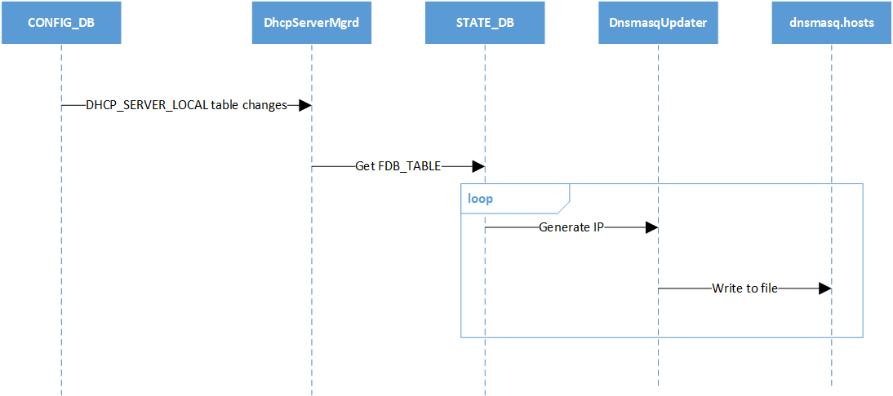
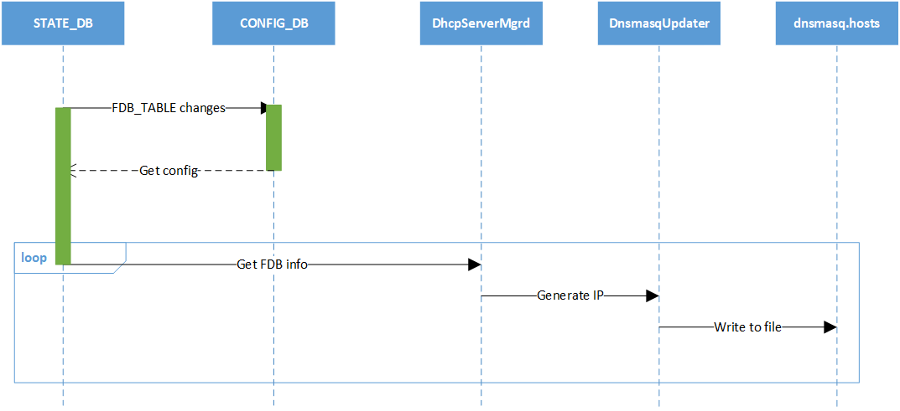

# DHCP_SERVER in SONiC
# High Level Design Document
#### Rev 0.1

# Table of Contents
  * [Revision](#revision)
  * [About this Manual](#about-this-manual)
  * [Scope](#scope)
  * [Definitions/Abbreviations](#definitionsabbreviations)
  * [1 Requirements Overview](#1-requirements-overview)
    * [1.1 Functional Requirements](#11-functional-requirements)
    * [1.2 Configuration and Management Requirements](#12-configuration-and-management-requirements)
  * [2 Functionality](#2-functionality)
  * [3 Design](#3-design)
    * [3.1 Design Overview](#31-design-overview)
    * [3.2 DB Changes](#32-db-changes)
      * [3.2.1 Config DB](#321-config-db)
        * [3.2.1.1 DHCP_SERVER_LOCAL Table](#3211-dhcp_server_local-table)
      * [3.2.2 State DB](#322-state-db)
        * [3.2.2.1 DHCP_SERVER_COUNTER Table](#3221-dhcp_server_counter-table)
    * [3.3 Switch State Service Design](#33-switch-state-service-design)
      * [3.3.1 DhcpServerMgr daemon](#331-dhcpservermgr-daemon)
      * [3.3.2 DnsmasqUpdater](#332-dnsmasqupdater)
    * [3.4 Flow Diagrams](#34-flow-diagrams)
      * [3.4.1 CONFIG_DB change flow](#341-config_db-change-flow)
      * [3.4.2 STATE_DB change flow](#342-state_db-change-flow)
    * [3.5 CLI](#35-cli)
      * [3.5.1 Config CLI](#351-config-cli)
      * [3.5.2 Show CLI](#352-show-cli)
      * [3.5.3 Clear CLI](#353-clear-cli)
    * [3.6 Configuration](#36-configuration)
  * [4 Unit test](#4-unit-test)
# Revision

| Rev |     Date    |       Author       | Change Description                  |
|:---:|:-----------:|:-------------------|:-----------------------------------|
| 0.1 |  2023/02/08 | Yaqiang Zhu, <br> Jing Kan       | Initial version                     |

# About this Manual

This document describes the design details of DHCP SERVER feature.
Dynamic Host Configuration Protocol (DHCP) server is used to centrally manage and configure IP addresses of clients dynamically. When server receive requests from DHCP-enabled clients, it would supply information to client about IP address, subnet mask, gateway etc.

# Scope
This document describes the high level design details about how DHCP server works.

# Definitions/Abbreviations
###### Table 1: Abbreviations
| Abbreviation             | Full form                        |
|--------------------------|----------------------------------|
| DHCP                      | Dynamic Host Configuration Protocol      |

# 1 Requirements Overview
## 1.1 Functional Requirements
The requirements for DHCP server are: 

1.0 DHCP is standardized through RFC 1541, RFC 2131, RFC 2132.

2.0 Provide the ability to manage IP addresses.

2.1 Provide the ability to map client to IP address without conflicts, and mapping methods should be configurable.

2.2 Netmask, gateway, lease period of DHCP should be configurable per Vlan.

3.0 Provide counter of different type of DHCP packets to monitor whether DHCP server works well.

3.1 Provide ability to clear DHCP packets counter.

## 1.2 Configuration and Management Requirements
Configuration of DHCP server feature can be done via:
* JSON config input
* SONiC CLI

# 2 Functionality
DHCP server listens to port 68 and waits for messages from client. DHCP server and DHCP client complete IP address assignment through four-step packet interaction:
1. Discover
DHCP client requesting DHCP IP for the first time does not know the IP address of DHCP server, and sends a DHCP DISCOVER packet in broadcast mode.
2. Offer
DHCP server performs matching after receiving the DHCP DISCOVER packet, selects an available IP address for allocation according to the configuration, and sends a DHCP OFFER packet.
3. Request
After DHCP client receives the OFFER packet, it sends a DHCP REQUEST packet in the form of broadcast, which contains information such as the DHCP server identifier and client address selected by the client.
4. Acknowledge
After receiving the REQUEST packet from the client, the DHCP server responds with a DHCP ACK, indicating that the IP address requested in the REQUEST packet has been allocated successfully.




# 3 Design
## 3.1 Design Overview
The design overview at a high level is as below. The details are explained in the following subsections.
- Configuration tables for the DHCP server entries.
- Design is centered around the dnsmasq insides dhcp_relay container.
- Configuration file for dnsmasq is generated by related configuration tables.

## 3.2 DB Changes
### 3.2.1 Config DB
Following table changes are done in Config DB.

#### 3.2.1.1 DHCP_SERVER_LOCAL Table
New table is introduced to specify configuration of DHCP Server.
```
DHCP_SERVER_LOCAL|VLAN-i|mode|"PORT"
DHCP_SERVER_LOCAL|VLAN-i|lease_period|"180"
DHCP_SERVER_LOCAL|VLAN-i|gateway|"192.168.0.1"
DHCP_SERVER_LOCAL|VLAN-i|netmask|"255.255.255.0"
DHCP_SERVER_LOCAL|VLAN-i|ports|port-0|"192.168.0.2"
DHCP_SERVER_LOCAL|VLAN-i|ports|port-1|"192.168.0.3"
```

### 3.2.2 State DB
Following table changes are done in State DB.

#### 3.2.2.1 DHCP_SERVER_COUNTER Table
New table is introduced to count different type of DHCP packet.
```
DHCP_SERVER_COUNTER|VLAN-i|Recover|"0"
DHCP_SERVER_COUNTER|VLAN-i|Offer|"0"
DHCP_SERVER_COUNTER|VLAN-i|Request|"0"
DHCP_SERVER_COUNTER|VLAN-i|Ack|"0"
```

## 3.3 Switch State Service Design
### 3.3.1 DhcpServerMgr daemon
DhcpServerd gets the DHCP_SERVER_LOCAL config changes from CONFIG_DB and FDB_TABLE changes from STATE_DB. DhcpServerd is responseible for calling DnsmasqUpdater to refresh dnsmasq.host file and restart dnsmasq process while detecting DHCP_SERVER_LOCAL or FDB_TABLE change.


### 3.3.2 DnsmasqUpdater
DnsmasqUpdater's job is to update dnsmasq.host file and restart dnsmasq process. 


## 3.4 Flow Diagrams
### 3.4.1 CONFIG_DB change flow

### 3.4.2 STATE_DB change flow


## 3.5 CLI
### 3.5.1 Config CLI
|     Command           |                Description                                 |Parameters|
|:----------------------|:-----------------------------------------------------------|----------|
| config dhcp_server {vlan} mode {"PORT"}| Use this command to config mode of DHCP server | --lease_period: required, lease period of IP <br> --use_vlan_inft: not required if gateway and netmask are given, declare to use first vlan intf as gateway and netmask <br> --gateway: not required if use_vlan_inft is given, gateway <br> --netmask: not required if use_vlan_inft is given, netmask of IP |
| config dhcp_server {vlan} port {port} {ip} | Use this command to config IP of each interface in vlan | N/A |
| config dhcp_server del {vlan} | Use this command to remove dhcp server config |

### 3.5.2 Show CLI
|     Command           |                Description                                 |
|:----------------------|:-----------------------------------------------------------|
| show dhcp_server info {vlan} | Use this command to show all dhcp_server information |
| shwo dhcp_server counter {vlan} | Use this command to show dhcp_server counter |

Example:
```
Router# show dhcp_server info Vlan1000

Mode      Gateway         Netmask        Lease period   IPs
--------  -------------  --------------  -------------  ----------------------
PORT      192.168.0.1     255.255.255.0  180            Ethernet1 192.168.0.2
                                                        Ethernet2 192.168.0.3
                                                        Ethernet3 192.168.0.4
--------  -------------  --------------  -------------  ----------------------


Router# show dhcp_server counter Vlan1000

Discover      .........   5
Offer         .........   5
Request       .........   5
Acknowledge   .........   5
```

### 3.5.3 Clear CLI
|     Command           |                Description                                 |
|:----------------------|:-----------------------------------------------------------|
| sonic-clear dhcp-server counter {vlan} | Use this command to clear dhcp_server counter of a vlan |

## 3.6 Configuration
ConfigDB objects:
```JSON
{
  "DHCP_SERVER_LOCAL": {
    "Vlan1000": {
      "gateway": "192.168.0.1",
      "lease_period": "180",
      "mode": "PORT",
      "netmask": "255.255.255.0",
      "ports": {
        "Ethernet1": "192.168.0.2",
        "Ethernet2": "192.168.0.3",
      }
    }
  }
}
```

# 4 Unit test
The Unit test case are as below:
| No |                Test case summary                          |
|:----------------------|:-----------------------------------------------------------|
| 1 | Verify that the change of DHCP_SERVER_LOCAL configuration from CONFIG_DB are received by dhcpservermgrd |
| 2 | Verify that the change of FDB_TABLE from STATE_DB are received by dhcpservermgrd |
| 3 | Verify that config/show/clear CLI for DHCP Server can work well |
| 4 | Verify that host file dnsmasq.host can be generated successfully |
| 5 | Verify that dnsmasq can work well |
| 6 | Verify counter of DHCP packets |
