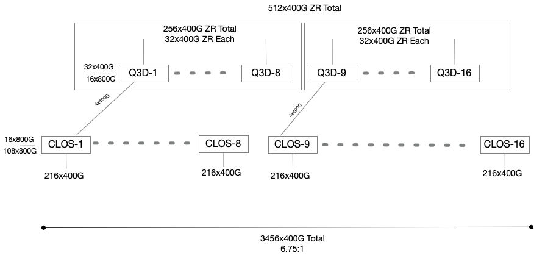
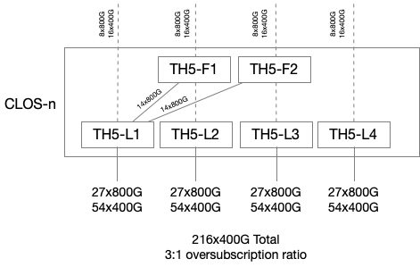
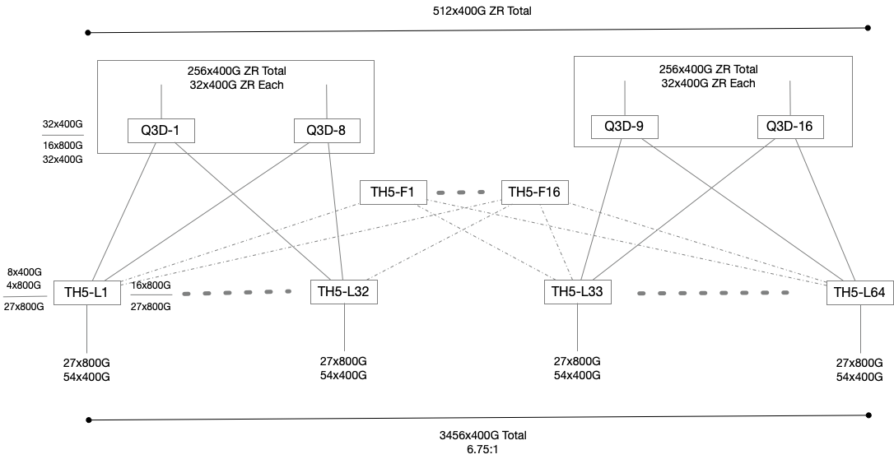
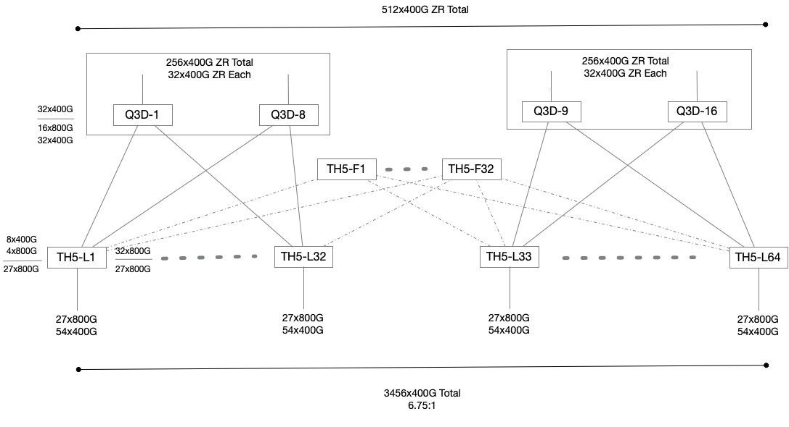

# Routing Design for Disaggregated Spine

#### Rev 0.4


| Rev |     Date    |       Author(s)       | Change Description |
|:---:|:--------------:|:------------------:|--------------------|
| 0.1 | Feb-13 2025 | [azure-team@nexthop.ai](mailto:azure-team@nexthop.ai) (Nexthop Systems) | Initial Version |
| 0.2 | Mar-13 2025 | gulv@microsoft.com (Microsoft), ritahui@microsoft.com (Microsoft), mohannanduri@microsoft.com (Microsoft), ivlee@microsoft.com (Microsoft), arlakshm@microsoft.com (Microsoft), [azure-team@nexthop.ai](mailto:azure-team@nexthop.ai) (Nexthop Systems) | With migration requirements |here as well [azure-team@nexthop.ai](mailto:azure-team@nexthop.ai) (Nexthop Systems) | With migration requirements |
| 0.3 | May-19 2025 | ritahui@microsoft.com (Microsoft),  arlakshm@microsoft.com (Microsoft),arielmoshe@microsoft.com (Microsoft), [azure-team@nexthop.ai](mailto:azure-team@nexthop.ai) (Nexthop Systems) | Reverting changes and adding mesh description |
## Scope

This document describes the routing design for the new disaggregated spine. The current Tier-2 layer, which comprises of chassis systems, will be broken up into a layer of Upper-layer Tier-2 (or UT2) and Lower-layer Tier-2 (or LT2) single chip fixed-system units.  The combination of UT2 and LT2 will replace the current Tier-2 layer as the disaggregated spine.  

## BGP ASN Allocation for Disaggregated Spine

In keeping with the practice of BGP ASN allocation within the datacenter, each layer or tier will continue to maintain a unique ASN per group of Tier-1 and Tier-2 devices.  Each Tier-0 will continue to have a unique ASN as per the current deployment.


Disaggregation allows for the separation of features and capabilities between the UT2 and LT2 layers and as such large-buffers, MACSec and 400G/1.6T ZR will be present in the UT2 layer whereas the high-bandwidth low oversubscription needs will be met in the LT2 layer.

In the initial proposal, the UT2 and LT2 layers were separated as shown below.  



In this design, the LT2 device was built to support 216x400G ports towards Tier-1 and 32x400G ports towards the UT2 layer, mimicking the current chassis port count.   This would maintain the current oversubscription ratio of 6.75:1.  Each CLOS block would further comprise of 6x 51.2T switches in order to meet the current chassis port count. 




If we use a 64x800G system to construct a LT2 device, we would need to arrange 6x such systems to maintain the required port count for a current Tier-2 device. However, using the upcoming 102.4T chipsets, we can construct a 64x1.6T or a 128x800G or 256x400G using a system with a single ASIC.  In the future, it is likely that the LT2 device will take shape in the form of 128x800G and be equipped with 2x400G transceivers to provide 256x400G ports.


Keeping the evolution of the LT2 in mind, we should strive to minimize the number of ASNs used in the LT2 layer and maintain a single ASN for the entire LT2 layer. In order to support a single ASN for LT2, the 6x 64x800G systems in the CLOS block for each LT2 will use iBGP peering with some additional features.  


## Lower Tier-2 (LT2) Peering Options

### A. Matching Current Chassis Port Counts

Within a 6x 64x800G LT2 CLOS block, we can use iBGP within the block:

- iBGP peering will only be configured between the leaf and fabric nodes within the CLOS block.
- leaf-fabric nodes will be configured as route-reflectors and will set the next-hop-self attribute allowing the leaf-fabric devices to provide transit paths between the leaf nodes.
- leaf interface subnets facing Tier-1 devices will be redistributed so that leaf-fabric nodes can resolve learned routes. 


Ln - leaf nodes  Fn - fabric nodes

The above configuration has been tested and is supported in FRR.


```
!
router bgp 65002
 neighbor 10.0.5.1 remote-as 65002
 neighbor 10.0.6.1 remote-as 65002
 !
 address-family ipv4 unicast
  neighbor 10.0.5.1 route-reflector-client
  neighbor 10.0.5.1 next-hop-self force
  neighbor 10.0.6.1 route-reflector-client
  neighbor 10.0.6.1 next-hop-self force
  neighbor 10.0.6.1 route-map LOOPBACKS_ONLY out
 exit-address-family
exit
!

```
iBGP peering will only occur within the LT2 block while eBGP peering will continue to be used outside of LT2.


### B. Full Mesh Fabric

In this design, we remove the constraints of creating blocks of 216x400G ports and instead create a larger mesh with a common LT2 fabric. The number of fabric switches in the LT layer control the oversubscription ratio for east-west traffic within the datacenter.


With 16 fabric switches, the east-west oversubscription ratio is (27/16) or 1.7.



With 32 fabric switches, the east-west oversubscription ratio becomes (27/32) or 1.




In both mesh designs, the oversubscription ration to/from the RNG remains at (27/4) or 6.75.


## Peering Between Lower Tier-2 (LT2) and Upper Tier-2 (UT2)

The current plan of record is to proceed with the full mesh design which provides a single LT2 fabric across the IDF. The number of LT2 fabric switches will be selected based on the desirable oversubscription ratio for east-west traffic. The LT2 switches and and the LT2-Fabric switches will use iBGP peering.  However, the LT2 fabric switches will be required to be configured as route-reflectors in order to propagate routes within the LT2 layer (configuration snippet shown below)


```
!
router bgp 65002
 neighbor 10.0.5.1 remote-as 65002
 neighbor 10.0.6.1 remote-as 65002
 !
 address-family ipv4 unicast
  neighbor 10.0.5.1 route-reflector-client
  neighbor 10.0.5.1 next-hop-self force
  neighbor 10.0.6.1 route-reflector-client
  neighbor 10.0.6.1 next-hop-self force
  neighbor 10.0.6.1 route-map LOOPBACKS_ONLY out
 exit-address-family
exit
!

```
  

There are two considerations that need to be addressed with this mesh design.

- When migrating from chassis Tier-2 spines to UT2 and LT2 disaggregated spines, there will be an additional ASN received by the Tier-1 and RNG nodes (since UT2 and LT2 both have their own unique ASNs).  It will be neccessary to plan for this and use pre-pend policies before the migration so that both the legacy and disaggregated Tier-2 layers appear as equal paths to the Tier-1 and RNG nodes.

- When migrating from chassis Tier-2 spines to UT2 and LT2 disaggregated spines, it is also desirebale that the RNG and Tier-1 layers have minimal configuration changes.  Depending on whether we decide to allocate the current Tier-2 ASN to either the UT2 or LT2 layer, either the RNG or Tier-1 devices will require their BGP peer ASN configuration statements to be updated.


### References:
[RFC6996](https://datatracker.ietf.org/doc/html/rfc6996)
[RFC7938](https://datatracker.ietf.org/doc/html/rfc7938)