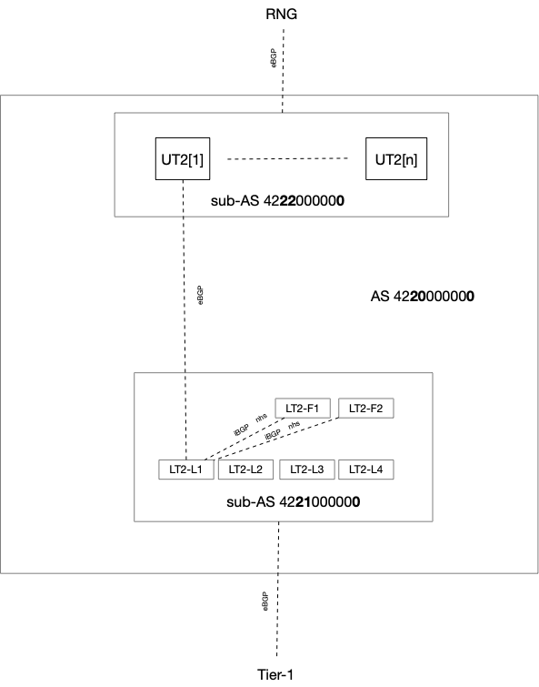

# Routing Design for Disaggregated Spine

#### Rev 0.2


| Rev |     Date    |       Author(s)       | Change Description |
|:---:|:-----------:|:------------------:|--------------------|
| 0.1 | Feb-13 2025 | [azure-team@nexthop.ai](mailto:azure-team@nexthop.ai) (Nexthop Systems) | Initial Version |
| 0.2 | Mar-13 2025 | gulv@microsoft.com (Microsoft), ritahui@microsoft.com (Microsoft), mohannanduri@microsoft.com (Microsoft), ivlee@microsoft.com (Microsoft), arlakshm@microsoft.com (Microsoft), [azure-team@nexthop.ai](mailto:azure-team@nexthop.ai) (Nexthop Systems) | With migration requirements |here as well [azure-team@nexthop.ai](mailto:azure-team@nexthop.ai) (Nexthop Systems) | With migration requirements |


## Scope

This document builds on the existing Azure 3-tier datacenter properties.  We will take the current tier-2 layer and break it up further into upper-layer tier-2 (or UT2) and lower-layer tier-2 (or LT2).  The combination of UT2 and LT2 will replace the current tier-2 layer as the disaggregated spine.  Sample configuration snippets will be included where neccessary.


## BGP ASN Allocation for Disaggregated Spine

In keeping with the practice of BGP ASN allocation within the datacenter, each layer or tier will maintain a unique ASN per group of tier-1 and tier-2 devices.  Each tier-0 will continue to have a unique ASN.

The disaggregated spine design introduces the upper tier-2 (UT2) and lower tier-2 (LT2) layers. Separating the tier-2 layers allows us to optimize for larger radix chipsets in the LT2 layer while keeping features such as MACSec and 400G/800G/1.6T ZR support in the UT2 layer only.  EBGP will be used between the LT2 and UT2 layers.


In order to support the current required radix, a LT2 device will need to have 216x400G ports towards tier-1 and 32x400G ports towards the UT2 layer.   This would maintain the current oversubscription ratio of 6.75:1.  The oversubscription ratio can be improved as the chipsets evolve at both the LT2 and UT2 layers.  

If we use a 64x800G system to contruct a LT2 device, we would need to arrange 6x such systems to maintain the required port count for a current tier-2 device. Using the upcoming 102.4T chipsets, we can construct a 64x1.6T or a 128x800G or 256x400G system. A single chip system can therefore be used to support the required port count with a lower over-subscription ratio.  It is likely that the LT2 device will take shape in the form of 128x800G and be equipped with 2x400G transceivers to provide a 256x400G system.


Keeping the evolution of the LT2 in mind, we should strive to minimize the number of ASNs used in the T2 layer and start with iBGP for the 6x 64x800G systems in the CLOS block for each LT2 and the UT2.  


## Lower tier-2 (LT2) Peering

Within a 6x 64x800G LT2 CLOS block, we can use iBGP within the block:

- iBGP peering will only be configured between the leaf and fabric nodes within the CLOS block.
- Leaf-fabric nodes will be configured as route-reflectors and will set the next-hop-self attribute allowing the leaf-fabric devices to provide transit paths between the leaf nodes.
- Leaf interface subnets facing tier-1 devices will be redistributed so that leaf-fabric nodes can resolve learned routes. 


Ln - leaf nodes  Fn - fabric nodes

The above configuration has been tested and is supported in FRR.


```
!
router bgp 65002
 neighbor 10.0.5.1 remote-as 65002
 neighbor 10.0.6.1 remote-as 65002
 !
 address-family ipv4 unicast
  neighbor 10.0.5.1 route-reflector-client
  neighbor 10.0.5.1 next-hop-self force
  neighbor 10.0.6.1 route-reflector-client
  neighbor 10.0.6.1 next-hop-self force
  neighbor 10.0.6.1 route-map LOOPBACKS_ONLY out
 exit-address-family
exit
!

```


## Peering Between Lower tier-2 (LT2) and Upper tier-2 (UT2)

There are two requirements that need to be met which influence how BGP peering will be configured between UT2 and LT2:

- When migrating from chassis tier-2 spines to UT2 and LT2 disaggregated spines, it is desirable that the layers above and below the tier-2 see the tier-2 layer as a single ASN.  If the UT2 and LT2 layers appear as two ASNs, the tier-1 and RNG layers will view the disaggregated spine paths as being less attractive when compared to the single ASN that exists today with the tier-2 chassis spine.  Having unique ASNs for LT2 and UT2 therefore introduce an operational burden during chassis tier-2 to disaggregated tier-2 migration.  The requirement is to have LT2 and UT2 appear as a single ASN.

- When migrating from chassis tier-2 spines to UT2 and LT2 disaggregated spines, it is also desirebale that the RNG and tier-1 layers have minimal configuration changes.  If the disagg-spine maintains the same single, and unique ASN that currently represents the chassis tier-2, then minimal configuration changes will be applied to the tier-1 and RNG devices peering with the disaggregated spine.

The requirements above can be met in two ways:

- Using IBGP peering between the LT2 and UT2 layers while maintaining a single ASN for the disaggregated spine layers or
- Using BGP confederations which allow for the UT2 and LT2 to remain within their own sub-ASNs, while appearing as a single ASN to the RNG and tier-1 layers.

While both these methods would work, BGP confederations is a more natural fit since there is EBGP peering between the UT2 and LT2 sub-ASNs.  With BGP confederations, next-hops are automatically set and routes are also exchanged between LT2 and UT2 EBGP peers (without any policies).  With IBGP, every UT2 device would also have to be configured as a route-reflector and a next-hop-self policy applied outbound.  This is similar to what we need to do in the CLOS block mentioned above for the multi-chip 51.2T CLOS block.  Using IBGP has one benefit though - it prevents unneccessary routes from being populated on the F1, F2 routers.  However, this additional route burden can be controlled with policies if needed.  In summary, BGP confederations offer a more natural design while meeting our requirements.


## BGP Confederation for UT2 and LT2


The configuration for LT2 will have to be slightly modied as well.


```
!
router bgp 200
 # Confederation Identifier (Public AS Number)
 bgp confederation identifier 65002
 # Confederation Peers (Private AS Numbers)
 bgp confederation peers 300
 # Confederation eBGP Neighbor (within confederation)
 neighbor 10.0.1.0 remote-as 300
 # External eBGP Neighbor (outside confederation)
 neighbor 10.0.3.1 remote-as 65003
 # iBGP neighbor within same sub-AS
 neighbor 10.0.5.0 remote-as 200
 !
 address-family ipv4 unicast
  redistribute connected
  neighbor 10.0.1.0 soft-reconfiguration inbound
  neighbor 10.0.3.1 soft-reconfiguration inbound
  neighbor 10.0.5.0 soft-reconfiguration inbound
 exit-address-family
exit
!

```


. this image needs to be updated


### References:
[RFC6996](https://datatracker.ietf.org/doc/html/rfc6996)
[RFC7938](https://datatracker.ietf.org/doc/html/rfc7938)