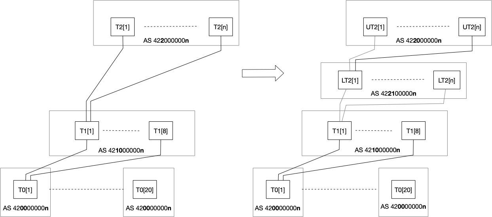
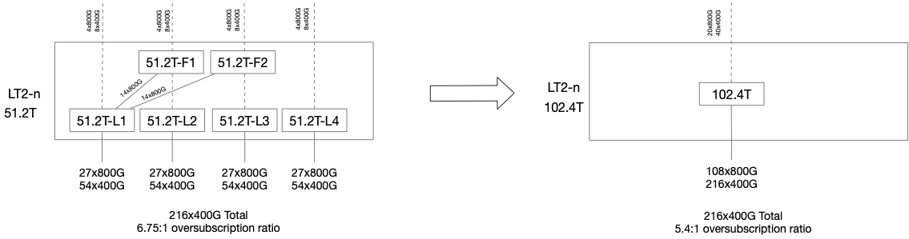
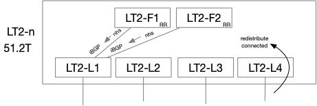
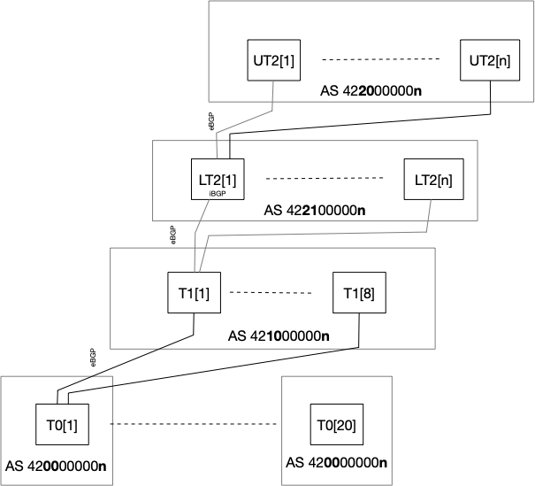

# Routing Design for Disaggregated Spine

#### Rev 0.1


| Rev |     Date    |       Author       | Change Description |
|:---:|:-----------:|:------------------:|--------------------|
| 0.1 | Feb-13 2025 | [azure-team@nexthop.ai](mailto:azure-team@nexthop.ai) (Nexthop Systems) | Initial Version |


## Scope

This document builds on the existing Azure 3-tier datacenter properties.  We will take the current tier-2 layer and break it up further into upper-layer tier-2 (or UT2) and lower-layer tier-2 (or LT2).  The combination of UT2 and LT2 will replace the current tier-2 layer as the disaggregated spine.  Sample configuration snippets will be included where neccessary.


## BGP ASN Allocation for Disaggregated Spine

In keeping with the practice of BGP ASN allocation within the datacenter, each layer or tier will maintain a unique ASN per group of tier-1 and tier-2 devices.  Each tier-0 will continue to have a unique ASN.

The disaggregated spine design introduces the upper tier-2 (UT2) and lower tier-2 (LT2) layers. Separating the tier-2 layers allows us to optimize for larger radix chipsets in the LT2 layer while keeping features such as MACSec and 400G/800G/1.6T ZR support in the UT2 layer only.  EBGP will be used between the LT2 and UT2 layers.




In order to support the current required radix, a LT2 device will need to have 216x400G ports towards tier-1 and 32x400G ports towards the UT2 layer.   This would maintain the current oversubscription ratio of 6.75:1.  The oversubscription ratio can be improved as the chipsets evolve at both the LT2 and UT2 layers.  

If we use a 64x800G system to contruct a LT2 device, we would need to arrange 6x such systems to maintain the required port count for a current tier-2 device. Using the upcoming 102.4T chipsets, we can construct a 64x1.6T or a 128x800G or 256x400G system. A single chip system can therefore be used to support the required port count with a lower over-subscription ratio.  It is likely that the LT2 device will take shape in the form of 128x800G and be equipped with 2x400G transceivers to provide a 256x400G system.





Keeping the evolution of the LT2 in mind, we should stive to minimize the number of ASNs used in the LT2 layer and start with iBGP for the 6x 64x800G systems in the CLOS block for each LT2.  


## Lower tier-2 (LT2) Peering

Within a 6x 64x800G LT2 CLOS block, we can use iBGP within the block:

- iBGP peering will only be configured between the leaf and fabric nodes within the CLOS block.
- Leaf-fabric nodes will be configured as route-reflectors and will set the next-hop-self attribute allowing the leaf-fabric devices to provide transit paths between the leaf nodes.
- Leaf interface subnets facing tier-1 devices will be redistributed so that leaf-fabric nodes can resolve learned routes. 



Ln - leaf nodes  Fn - fabric nodes

The above configuration has been tested and is supported in FRR.


```
!
router bgp 65002
 neighbor 10.0.5.1 remote-as 65002
 neighbor 10.0.6.1 remote-as 65002
 !
 address-family ipv4 unicast
  neighbor 10.0.5.1 route-reflector-client
  neighbor 10.0.5.1 next-hop-self force
  neighbor 10.0.6.1 route-reflector-client
  neighbor 10.0.6.1 next-hop-self force
  neighbor 10.0.6.1 route-map LOOPBACKS_ONLY out
 exit-address-family
exit
!

```
iBGP peering will only occur within the LT2 blocks with eBGP peering between layers.




### References:
[RFC6996](https://datatracker.ietf.org/doc/html/rfc6996)  
[RFC7938](https://datatracker.ietf.org/doc/html/rfc7938)