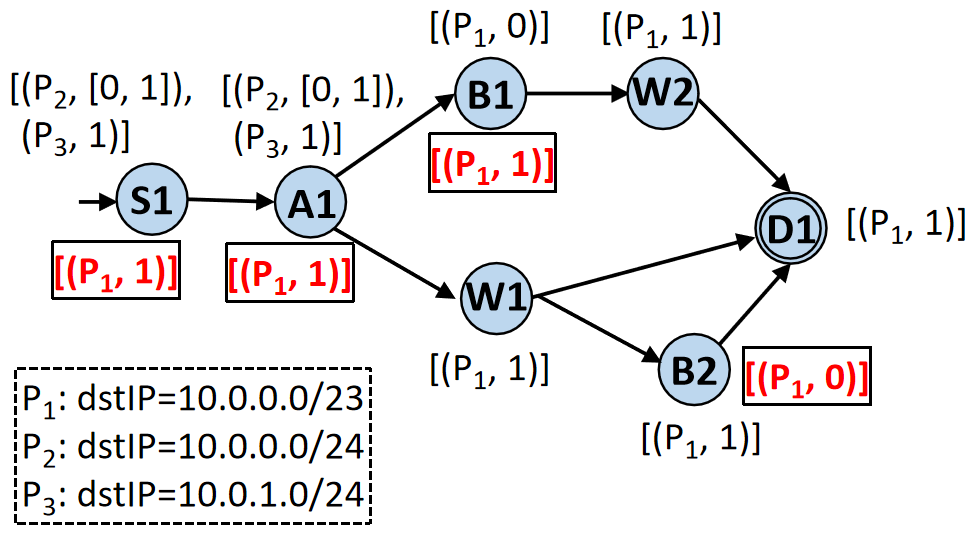
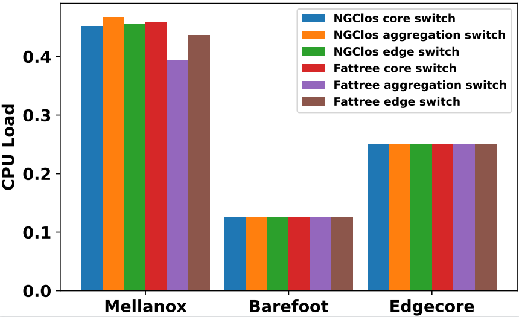

# Distributed Data Plane Verification
# High Level Design Document
#### Rev 0.2

# Table of Contents
TBD in Markdown with links

# Revision

| Rev   | Date  | Author | Change Description |
| ---- | ---------- | -----------| ------------------|
| v0.1 | 02/24/2022 | Qiao Xiang, Chenyang Huang, Ridi Wen, Yuxin Wang, Jiwu Shu@Xiamen University, China| Initial version |
| v0.2 | 09/09/2022 | Qiao Xiang, Chenyang Huang, Ridi Wen, Yuxin Wang, Jiwu Shu@Xiamen University, China| Add details |

# Scope
This document describes the high-level design of the distributed data plane verification feature.

# Definitions/Abbreviations
###### Table 1: Abbreviations
| Abbreviation |          Full form          |
| ------------ | --------------------------- |
| FIB          | Forwarding Information Base |
| CLI          | Command Line Interface      |
| LEC          | Local Equivalence Class     |
| DPV          | Data plane verification     |

# Overview

<!-- Network errors such as forwarding loops, undesired blackholes and waypoint violations are the outcome of various
issues (e.g., software bugs, faulty hardware, protocol misconfigurations, and oversight negligence). They can happen in
all types of networks (e.g., enterprise networks, wide area networks and data center networks), and have both disastrous
financial and social consequences. Data plane verification (DPV) is important for finding such network errors. 
Current DPV tools employ a centralized architecture, where a server collects the data planes of all devices and verifies them. 
Despite substantial efforts on accelerating DPV, this centralized architecture is inherently unscalable because (1) it requires a highly available management network, which is hard build itself; and (2) the server becomes the performance bottleneck and a single point of failure.  -->

<!-- In this HLD, to tackle the scalability challenge of DPV, we propose a distributed
data plane verification feature, which circumvents the scalability bottleneck
of centralized design and performs data plane checking on commodity network
devices.  Our key insight is that DPV can be transformed into a counting problem
on a directed acyclic graph called DVNet, which can be naturally decomposed into lightweight
tasks executed at network devices, enabling scalability. To be concrete, this
feature provides: -->

In this HLD, we propose a distributed
data plane verification feature, which allows devices equipped with SONiC to verify their data planes efficiently and enable fast in-network verification. Instead of doing verification at the centralized server, we offload verification tasks to SONiC switches and thus provide good scalibility. Not only can a scalable DPV
tool quickly find network errors in large networks, it can
also support novel services such as fast rollback and switching
among multiple data planes [1], and data plane
verification across administrative domains [2].

Our key insight is that DPV can be transformed into a counting problem on a directed acyclic graph called DVNet, which can be naturally decomposed into lightweight
tasks executed at network devices, enabling scalability. 

To be concrete, this
feature provides:

* A declarative requirement specification language that allows operators to
  flexibly specify common requirements studied by existing DPV tools (e.g.,
reachability, blackhole free, waypoint and isolation), and more advanced, yet
understudied requirements (e.g., multicast, anycast, no-redundant-delivery and
all-shortest-path availability).
* A verification planner that takes the operator specified requirement as input,
  and systematically decomposes the global verification into lightweight,
on-device computation tasks.
* A distributed verification (DV) protocol that specifies how on-device
  verifiers communicate task results efficiently to collaboratively verify the
requirements.

The picture below demonstrates the architecture and workflow of distributed data plane verification.

A series of demos of the proposed feature  can be found at [distributeddpvdemo.tech](DDPV-Demos). All demos are conducted on a small testbed of commodity switches installed with SONiC or ONL. A technical report of the detailed design of DDPV can be found at [https://arxiv.org/abs/2205.07808](arXiv).

# Requirements
* The ddpv container needs to have access to the device data plane (i.e., FIB and ACL) stored in the database container.
* The ddpv container at neighboring switches needs to use sockets to exchange verification messages.
* The ddpv container will be developed in Java, and will need a Java Runtime Environment (JRE).
* New CLI commands need to be added to allow the ddpv container to receive the counting tasks from the verification planner and show related information, e.g., verification results, counting numbers, and status.
*  For devices without an on-device verifier, off-device instance (e.g., VM)  can be assigned that plays as a verifier to collect the data plane from the
device and exchange messages with other verifiers based on DVNet.
*  A computing device (e.g., a server) is needed to serve as a planner, which is responsible for managing devices,inputting topologies, distrbuting tasks and getting verification results. This is similar as the process of configuring routing protocols.

# Functionality
## Functionality Description
Distributed data plane verification detects a wide range of network errors (e.g., switch operating system errors) by checking the actual 
data plane on the network device, so that the operator can detect the network error in time, take relevant 
measures to correct the error, and reduce the loss as much as possible. Distributed data plane verification can efficiently validate a 
wide range of network forwarding requirements of operators in different scenarios. If the current network 
status does not meet the operator's network forwarding requirements, then prompt the operator network error.
Distributed data plane verification generates a directed acyclic graph called DVnet based on the network topology and requirements, 
and performs a reverse counting process on DVnet, finally determines whether the network is wrong.

# Design

The ddpv container runs two daemon processes: lecbuilderd and vagentd. We give a
brief view of the key classes and the main functionalities of each process.

## lecbuilderd
The core of lecbuilderd is the LECBuilder class.

- LECBuilder

  This class is responsible for converting the data plane (e.g., FIB and ACL) of the residing device to local equivalence classes (LECs).  LECBuilder needs to have **READ** access to the Application-DB table[5] (APPL_DB) which stores FIB and ACL, and seats within the redis-engine of the database container.
  Given a device X, a local equivalence class is a set of packets whose actions are identical at X.
  LECBuilder stores the LECs of its residing device using a data structure called binary decision diagram (BDD).
  The major methods in LECBuilder are: 
    
  - `buildLEC()`: read the database container to get the data plane of the device,
    and build the LECs.
  - `updateLEC()`: get the updates of data plane from the database container and update the LECs incrementally.

## vagentd
The vagentd process uses a dispatch-worker thread pool design.

### Dispatcher

 Each SONiC device is connected to a planner who sends verification tasks through sockets using TCP protocol  with port 5108. The Dispatcher class receives the computation task configurations from the planner and spawns
Worker threads correspondingly. It also establishes socket connections with neighboring devices using TCP protocol with port 5109, dispatches received messages to corresponding Worker threads and sends the messages from Worker threads to corresponding neighbor devices. Both port 5108 and port 5109 are unused ports according to IETF documentation.

The main methods in Dispatcher include:

  - `receiveInstruction()`: receive instructions on computation tasks from the planner, and spawn corresponding Worker threads. This method is only invoked when the system starts or the planner updates the computation tasks based on operators' instructions. 
  - `receiveMessage()`: receive the verification messages from neighboring devices and dispatch them to the corresponding workers.
  - `receiveLECUpdate()`: receive the updates of LECs from lecbuilderd and dispatch them to corresponding workers.
  - `sendMessage()`: receive the sendResult requests
    from workers and send them to corresponding devices.
  - `sendAlert()`: if a worker specifies in its sendResult request that the result indicates a violation of an
operator-specified requirement, the dispatcher sends an alert to the operators.

  
### Worker

This class executes the lightweight computation tasks specified by the planner. 
  Each node in DVNet corresponds to a worker thread. 
  The running state of workers is controlled by the thread pool.
  The main methods in Worker include:
  - `receiveMessage()`: receive the verification message from the dispatcher, and execute the computation task incrementally.
  - `receiveLECUpdate()`: receive the updates of LECs from the dispatcher, and execute the computation task incrementally.
  - `sendResult()`: send the result of the computation task to the dispatcher, which either forwards it to a corresponding neighbor device or sends an alert to the operators, depending on whether a violation of an operator-specified requirement is found by the worker.

# Use Case Examples

We use two examples to demonstrates how the DDPV feature works. More
illustrations can be found at [distributeddpvdemo.tech](DDPV-Demos). The first
example is in a network in Figure 2. 

 
Figure 2. An example topology and requirement.

</dive>

After the operator specifies the requirement in Figure 2, the verification
planner decides the on-device tasks for each device in the network by
constructing a data structure called DVNet.  Informally, DVNet is a DAG that
compactly represents all valid paths in the topology that satisfy an
operator-specified requirement, and is independent of the actual data plane of
the network. Figure 3 gives the computed DVNet of the example in Figure 2. 

 
Figure 3. The DVNet and the counting process.

</dive>

Note the devices in the network and the nodes in DVNet have a
1-to-many mapping. For each node u in DVNet, we assign a unique identifier, which is a concatenation of u.dev and an integer.
For example, device W in the network is mapped to two nodes B1 and B2 in DVNet, because the regular expression
allows packets to reach D via [B,W,D] or [W,B,D].

### Example 1-1: Green Start

 
Figure 4. The network data plane.

</dive>

We first show how DDPV works in the scenario of green start, i.e., all forwarding rules are
installed to corresponding switches all at once. Consider the network data plane
in Figure 4. For simplicity, we use P1, P2, P3 to represent the packet spaces with destination IP
prefixes of 10.0.0.0/23, 10.0.0.0/24, and 10.0.1.0/24, respectively. Note that P2 ∩ P3 = ∅ and P1 = P2 ∪ P3. Each u in DVNet
initializes a packet space → count mapping, (P1, 0), except for D1 that initializes the mapping as (P1, 1) (i.e., one copy of 
any packet in P1 will be sent to the correct external ports). Afterwards, we traverse all the nodes in DVNet in reverse topological 
order to update their mappings. Each node u checks the data plane of u.dev to find the set of next-hop devices 
u.dev will forward P1 to. If the action of forwarding to this next-hop set is of ALL-type, the mapping at u can be updated by adding up the 
count of all downstream neighbors of u whose corresponding device belongs to the set of next-hops of u.dev for forwarding P1. For example, 
node W1 updates its mapping to (P1, 1) and node W2 updates its mapping to (P1, 1) because device W forwards to D, but node B1’s mapping 
is still (P1, 0) because B does not forward P1 to W. Similarly, although W1 has two downstream neighbors B2 and D1, each with an updated 
mapping (P1, 1). At its turn, we update its mapping to (P1, 1) instead of (P1, 2), because device W only forwards P1 to D, not B.

Consider the mapping update at A1. A would forward P2 to either B or W. A forwards P2 to B, the mapping at A1 is (P2, 0), because 
B1’s updated mapping is (P1, 0) and P2 ⊂ P1.  A forwards P2 to W , the mapping at A1 is (P2, 1) because W1’s updated mapping is (P1, 1). 
Therefore, the updated mapping for P2 at A1 is (P2, [0, 1]). In the end, the updated mapping of S1 [(P2, [0, 1]), (P3, 1)] reflects the final 
counting results, indicating that the data plane in Figure 3 does not satisfy the requirements in Figure 2. In other words, the network 
data plane is erroneous.
### Example 1-2: Incremental Update
Consider another scenario in Figure 2, where B updates its data plane to forward P1 to W , instead of to D. The changed mappings of different 
nodes are circled with boxes in Figure 4. In this case, device B locally updates the task results of B1 and B2 to [(P1, 1)] and [(P1, 0)], 
respectively, and sends corresponding updates to the devices of their upstream neighbors, i.e., [(P1, 1)] sent to A following the opposite 
of (A1, B1) and [(P1, 0)] sent to W following the opposite of (W 1, B2).

Upon receiving the update, W does not need to update its mapping for node W1, 
because W does not forward any packet to B. As such, W does not need to send any update to A along the opposite of (A1,W1). In contrast, 
A needs to update its task result for node A1 to [(P1, 1)] because (1) no matter whether A forwards packets in P2 to B or W , 1 copy of 
each packet will be sent to D, and (2) P2 ∪ P3 = P1. After
updating its local result, A sends the update to S along the opposite of (S1,A1). Finally, S updates its local result for S1 to [(P1, 1)], 
i.e., the requirement is satisfied after the update.

### Example 2: Verifying RCDC Local Contracts
In the second example, we show how DDPV verifies the local contracts of the
all-shortest-path availability in Azure RCDC [4]. All-shortest-path availability
requires all pairs of ToR devices in a Clos-based data center should reach each
other along a shortest path, and all ToR-to-ToR shortest paths should be
available in the data plane.  

<dive>

 
Figure 5: An example datacenter.

</dive>

We first explain what ToR contracts are using the example in Figure 5, we show that
RCDC is a special case of DDPV.. Each ToR has a default contract with next
hops set to its neighboring leaf devices. For example, the default
contract for ToR1 specifies {A1,A2,A3,A4} as the next hops.
Each ToR has a specific contract for every prefix hosted in the
datacenter besides the prefix that it is configured to announce, and
the next hops are set to its neighboring leaf devices. For example,
ToR1 has specific contracts for Prefix_B, Prefix_C
, and Prefix_D with next hops set to {A1,A2,A3,A4}. 
Aggregation contracts and core contracts are similar to ToR contracts.

<dive>

 
Figure 6: Example illustrating local contracts.

</dive>

<!-- We select three devices (one edge like ToR1, one aggregation like A1 and one
core like D1)  in a 48-ary Fattree and another operational Clos-based topology
called  NGClos, respectively, and verify their local contracts on three
commodity switches. Figure 7 shows that all local contracts are verified on
commodity switches in less than 320ms, with a CPU load (i.e., CPU time /(total
time * number of cores)) ≤ 0.47 and a maximal memory ≤ 15.2MB.  These results
show that it is feasible to run DDPV on commodity devices to verify local
contracts of data centers.

(a) Total time.

(b) Maximal memory.

(c) CPU load.

Figure 7: Time and overhead of verifying all-shortest-path availability in DC networks from green start on commodity network devices. -->

# Evaluation on commodity switches

We run extensive microbenchmarks to measure the overhead of distributed data plane verifiers. The datasets contain 13 networks, which are of different types, such as LAN, WAN and datacenter network. The information about these datasets is shown in the chart below. The first four are public datasets and the others are synthesized with public topologies. Fattree is a 48-ary fattree. NGClos is a real, large, Clos-based DC.
<dive>

 
Figure 7: Datasets statistics

</dive>

We use switches from four vendors. Mellanox, Edgecore and Centec switches run SONiC , while the Barefoot switch runs ONL. The information about these switches is shown in the chart below.
<dive>

 
Figure 8: Devices in the testbed.

</dive>

### Initialization overhead

<dive>

 
Figure 9: Initialization overhead.

</dive>

For each of 414 devices from WAN
/ LAN and 6 devices from NGClos/Fattree (one edge, aggregation and core switch, respectively), we measure the overhead
of its initialization phase in burst update (i.e., computing
the initial LEC and CIB), in terms of total time, maximal
memory and CPU load, on the three switch models in our
testbed. The CPU load is computed as CPU time /(total time
× number of cores). Figure 7 plots their CDFs. On all three
switches, all devices in the datasets complete initialization
in ≤ 1.5s, with a CPU load ≤ 0.48, and a maximal memory
≤ 19.6MB.

### DV UPDATE message processing overhead

<dive>

 
Figure 10: DV UPDATE message processing overhead.

</dive>

For each of
the same set of devices in the datasets, we collect the trace
of their received DV UPDATE messages during burst update
and incremental update experiments, replay the traces consecutively on each of the three switches, and measure the
message processing overhead in terms of total time, maximal memory, CPU load and per message processing time.
Figure 8 shows their CDFs. For 90% of devices, all three
switches process all UPDATE messages in ≤ 2.29s, with a
maximal memory ≤ 32.08MB, and a CPU load ≤ 0.20. And
for 90% of all 835.2k UPDATE messages, the switches can
process it in ≤ 4ms.

    

# References
[1] S. Choi, B. Burkov, A. Eckert, T. Fang, S. Kazemkhani,
R. Sherwood, Y. Zhang, and H. Zeng. Fboss: Building switch
software at scale. In Proceedings of the 2018 Conference of the ACM
Special Interest Group on Data Communication, pages 342–356,
2018.

[2]A. Dhamdhere, D. D. Clark, A. Gamero-Garrido, M. Luckie, R. K.
Mok, G. Akiwate, K. Gogia, V. Bajpai, A. C. Snoeren, and K. Claffy.
Inferring persistent interdomain congestion. In Proceedings of the
2018 Conference of the ACM Special Interest Group on Data
Communication, pages 1–15, 2018.

[3] Karthick Jayaraman, Nikolaj Bjørner, Jitu Padhye, Amar Agrawal,
Ashish Bhargava, Paul-Andre C Bissonnette, Shane Foster, Andrew
Helwer, Mark Kasten, Ivan Lee, et al. 2019. Validating Datacenters
at Scale. In Proceedings of the ACM Special Interest Group on Data
Communication. 200–213.

[4] Qiao Xiang, Ridi Wen, Chenyang Huang, Yuxin Wang, Jiwu Shu, Franck Le, 2022. Switch as a
Verifier: Toward Scalable Data Plane Checking via Distributed, On-Device
Verification. (A shorter version has been accepted by HotNets'22.) https://arxiv.org/abs/2205.07808

[5] SONiC architecture. https://github.com/sonic-net/SONiC/wiki/Architecture

