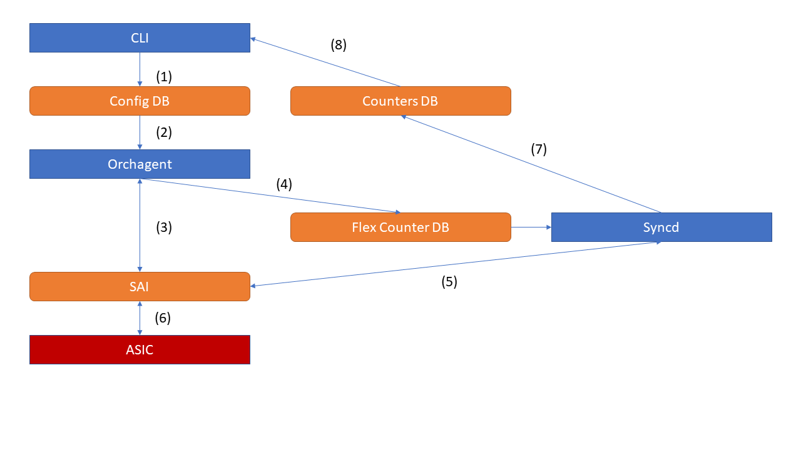

# Configurable Drop Counters in SONiC

# High Level Design Document
#### Rev 1.0

# Table of Contents
* [List of Tables](#list-of-tables)
* [List of Figures](#list-of-figures)
* [Revision](#revision)
* [About this Manual](#about-this-manual)
* [Scope](#scope)
* [Defintions/Abbreviation](#definitionsabbreviation)
* [1 Overview](#1-overview)
    - [1.1 Use Cases](#11-use-cases)
        - [1.1.1 A flexible "drop filter"](#111-a-flexible-"drop-filter")
        - [1.1.2 A helpful debugging tool](#112-a-helpful-debugging-tool)
        - [1.1.3 More sophisticated monitoring schemes](#113-more-sophisticated-monitoring-schemes)
* [2 Requirements](#2-requirements)
    - [2.1 Functional Requirements](#21-functional-requirements)
    - [2.2 Configuration and Management Requirements](#22-configuration-and-management-requirements)
    - [2.3 Scalability Requirements](#23-scalability-requirements)
    - [2.4 Supported Debug Counters](#24-supported-debug-counters)
* [3 Design](#3-design)
    - [3.1 CLI (and usage example)](#31-cli-and-usage-example)
        - [3.1.1 Displaying available counter capabilities](#311-displaying-available-counter-capabilities)
        - [3.1.2 Displaying current counter configuration](#312-displaying-current-counter-configuration)
        - [3.1.3 Displaying the current counts](#313-displaying-the-current-counts)
        - [3.1.4 Clearing the counts](#314-clearing-the-counts)
        - [3.1.5 Configuring counters from the CLI](#315-configuring-counters-from-the-CLI)
    - [3.2 Config DB](#32-config-db)
        - [3.2.1 DEBUG_COUNTER Table](#321-debug_counter-table)
        - [3.2.2 PACKET_DROP_COUNTER_REASON Table](#322-packet_drop_counter_reason-table)
    - [3.3 State DB](#33-state-db)
        - [3.3.1 DEBUG_COUNTER_CAPABILITIES Table](#331-debug-counter-capabilities-table)
        - [3.3.2 SAI APIs](#332-sai-apis)
    - [3.4 Counters DB](#34-counters-db)
    - [3.5 SWSS](#35-swss)
        - [3.5.1 SAI APIs](#351-sai-apis)
    - [3.6 syncd](#34-syncd)
* [4 Flows](#4-flows)
    - [4.1 General Flow](#41-general-flow)
* [5 Warm Reboot Support](#5-warm-reboot-support)
* [6 Unit Tests](#6-unit-tests)
* [7 Platform Support](#7-platform-support)
    - [7.1 Known Limitations](#7.1-known-limitations)
* [8 Open Questions](#8-open-questions)
* [9 Acknowledgements](#9-acknowledgements)
* [10 References](#10-references)

# List of Tables
* [Table 1: Abbreviations](#definitionsabbreviation)

# List of Figures
* [Figure 1: General Flow](#41-general-flow)

# Revision
| Rev | Date     | Author      | Change Description        |
|:---:|:--------:|:-----------:|---------------------------|
| 0.1 | 07/30/19 | Danny Allen | Initial version           |
| 0.2 | 09/03/19 | Danny Allen | Review updates            |
| 0.3 | 09/19/19 | Danny Allen | Community meeting updates |
| 1.0 | 11/19/19 | Danny Allen | Code review updates       |

# About this Manual
This document provides an overview of the implementation of configurable packet drop counters in SONiC.

# Scope
This document describes the high level design of the configurable drop counter feature.

# Definitions/Abbreviation
| Abbreviation | Description     |
|--------------|-----------------|
| RX           | Receive/ingress |
| TX           | Transmit/egress |

# 1 Overview
The main goal of this feature is to provide better packet drop visibility in SONiC by providing a mechanism to count and classify packet drops that occur due to different reasons.

The other goal of this feature is for users to be able to track the types of drop reasons that are important for their scenario. Because different users have different priorities, and because priorities change over time, it is important for this feature to be easily configurable.

We will accomplish both goals by adding support for SAI debug counters to SONiC.
* Support for creating and configuring port-level and switch-level debug counters will be added to orchagent and syncd.
* A CLI tool will be provided for users to manage and configure their own drop counters

## 1.1 Use Cases
There are a couple of potential use cases for these drop counters.

### 1.1.1 A flexible "drop filter"
One potential use case is to use the drop counters to create a filter of sorts for the standard STAT_IF_IN/OUT_DISCARDS counters. Say, for example:
- Packets X, Y, and Z exist in our system
- Our switches should drop X, Y, and Z when they receive them

We can configure a drop counter (call it "EXPECTED_DROPS", for example) that counts X, Y, and Z. If STAT_IF_IN_DISCARDS = EXPECTED_DROPS, then we know our switch is healthy and that everything is working as intended. If the counts don't match up, then there may be a problem.

### 1.1.2 A helpful debugging tool
Another potential use case is to configure the counters on the fly in order to help debug packet loss issues. For example, if we're consistently experiencing packet loss in your system, we might try:
- Creating a counter that tracks L2_ANY and a counter that tracks L3_ANY
- L2_ANY is incrementing, so we delete these two counters and create MAC_COUNTER that tracks MAC-related reasons (SMAC_EQUALS_DMAC, DMAC_RESERVED, etc.), VLAN_COUNTER that tracks VLAN related reasons, (INGRESS_VLAN_FILTER, VLAN_TAG_NOT_ALLOWED), and OTHER_COUNTER that tracks everything else (EXCEEDS_L2_MTU, FDB_UC_DISCARD, etc.)
- OTHER_COUNTER is incrementing, so we delete the previous counters and create a counter that tracks the individual reasons from OTHER_COUNTER
- We discover that the EXCEEDS_L2_MTU counter is increasing. There might be an MTU mismatch somewhere in our system!

### 1.1.3 More sophisticated monitoring schemes
Some have suggested other deployment schemes to try to sample the specific types of packet drops that are occurring in their system. Some of these ideas include:
- Periodically (e.g. every 30s) cycling through different sets of drop counters on a given device
- "Striping" drop counters across different devices in the system (e.g. these 3 switches are tracking VLAN drops, these 3 switches are tracking ACL drops, etc.)
- An automatic version of [1.1.2](#112-a-helpful-debugging-tool) that adapts the drop counter configuration based on which counters are incrementing

# 2 Requirements

## 2.1 Functional Requirements
1. CONFIG_DB can be configured to create debug counters
2. STATE_DB can be queried for debug counter capabilities
3. Users can access drop counter information via a CLI tool
    1. Users can see what capabilities are available to them
        1. Types of counters (i.e. port-level and/or switch-level)
        2. Number of counters
        3. Supported drop reasons
    2. Users can see what types of drops each configured counter contains
    3. Users can add and remove drop reasons from each counter
    4. Users can read the current value of each counter
    5. Users can assign aliases to counters
    6. Users can clear counters

## 2.2 Configuration and Management Requirements
Configuration of the drop counters can be done via:
* config_db.json
* CLI

## 2.3 Scalability Requirements
Users must be able to use all debug counters and drop reasons provided by the underlying hardware.

Interacting with debug counters will not interfere with existing hardware counters (e.g. portstat). Likewise, interacting with existing hardware counters will not interfere with debug counter behavior.

## 2.4 Supported Debug Counters
* PORT_INGRESS_DROPS: port-level ingress drop counters
* PORT_EGRESS_DROPS: port-level egress drop counters
* SWITCH_INGRESS_DROPS: switch-level ingress drop counters
* SWITCH_EGRESS_DROPS: switch-level egress drop counters

# 3 Design

## 3.1 CLI (and usage example)
The CLI tool will provide the following functionality:
* See available drop counter capabilities: `show dropcounters capabilities`
* See drop counter config: `show dropcounters configuration`
* Show drop counts: `show dropcounters counts`
* Clear drop counters: `sonic-clear dropcounters`
* Initialize a new drop counter: `config dropcounters install`
* Add drop reasons to a drop counter: `config dropcounters add_reasons`
* Remove drop reasons from a drop counter: `config dropcounters remove_reasons`
* Delete a drop counter: `config dropcounters delete`

### 3.1.1 Displaying available counter capabilities
```
admin@sonic:~$ show dropcounters capabilities
Counter Type            Total
--------------------  -------
PORT_INGRESS_DROPS          3
SWITCH_EGRESS_DROPS         2

PORT_INGRESS_DROPS:
      L2_ANY
      SMAC_MULTICAST
      SMAC_EQUALS_DMAC
      INGRESS_VLAN_FILTER
      EXCEEDS_L2_MTU
      SIP_CLASS_E
      SIP_LINK_LOCAL
      DIP_LINK_LOCAL
      UNRESOLVED_NEXT_HOP
      DECAP_ERROR

SWITCH_EGRESS_DROPS:
      L2_ANY
      L3_ANY
      A_CUSTOM_REASON
```

### 3.1.2 Displaying current counter configuration
```
admin@sonic:~$ show dropcounters configuration
Counter   Alias     Group  Type                 Reasons              Description
--------  --------  -----  ------------------   -------------------  --------------
DEBUG_0   RX_LEGIT  LEGIT  PORT_INGRESS_DROPS   SMAC_EQUALS_DMAC     Legitimate port-level RX pipeline drops
                                                INGRESS_VLAN_FILTER
DEBUG_1   TX_LEGIT  None   SWITCH_EGRESS_DROPS  EGRESS_VLAN_FILTER   Legitimate switch-level TX pipeline drops

admin@sonic:~$ show dropcounters configuration -g LEGIT
Counter   Alias     Group  Type                 Reasons              Description
--------  --------  -----  ------------------   -------------------  --------------
DEBUG_0   RX_LEGIT  LEGIT  PORT_INGRESS_DROPS   SMAC_EQUALS_DMAC     Legitimate port-level RX pipeline drops
                                                INGRESS_VLAN_FILTER
```

### 3.1.3 Displaying the current counts

```
admin@sonic:~$ show dropcounters counts
    IFACE    STATE    RX_ERR    RX_DROPS    TX_ERR    TX_DROPS   RX_LEGIT
---------  -------  --------  ----------  --------  ----------  ---------
Ethernet0        U        10         100         0           0         20
Ethernet4        U         0        1000         0           0        100
Ethernet8        U       100          10         0           0          0

DEVICE  TX_LEGIT
------  --------
sonic       1000

admin@sonic:~$ show dropcounters counts -g LEGIT
    IFACE    STATE    RX_ERR    RX_DROPS    TX_ERR    TX_DROPS   RX_LEGIT
---------  -------  --------  ----------  --------  ----------  ---------
Ethernet0        U        10         100         0           0         20
Ethernet4        U         0        1000         0           0        100
Ethernet8        U       100          10         0           0          0

admin@sonic:~$ show dropcounters counts -t SWITCH_EGRESS_DROPS
DEVICE  TX_LEGIT
------  --------
sonic       1000
```

### 3.1.4 Clearing the counts
```
admin@sonic:~$ sonic-clear dropcounters
Cleared drop counters
```

### 3.1.5 Configuring counters from the CLI
```
admin@sonic:~$ sudo config dropcounters install DEBUG_2 PORT_INGRESS_DROPS [EXCEEDS_L2_MTU,DECAP_ERROR] -d "More port ingress drops" -g BAD -a BAD_DROPS
admin@sonic:~$ sudo config dropcounters add_reasons DEBUG_2 [SIP_CLASS_E]
admin@sonic:~$ sudo config dropcounters remove_reasons DEBUG_2 [SIP_CLASS_E]
admin@sonic:~$ sudo config dropcounters delete DEBUG_2
```

## 3.2 Config DB
Two new tables will be added to Config DB:
* DEBUG_COUNTER to store general debug counter metadata
* DEBUG_COUNTER_DROP_REASON to store drop reasons for debug counters that have been configured to track packet drops

### 3.2.1 DEBUG_COUNTER Table
Example:
```
{
    "DEBUG_COUNTER": {
        "DEBUG_0": {
            "alias": "PORT_RX_LEGIT",
            "type": "PORT_INGRESS_DROPS",
            "desc": "Legitimate port-level RX pipeline drops",
            "group": "LEGIT"
        },
        "DEBUG_1": {
            "alias": "PORT_TX_LEGIT",
            "type": "PORT_EGRESS_DROPS",
            "desc": "Legitimate port-level TX pipeline drops"
            "group": "LEGIT"
        },
        "DEBUG_2": {
            "alias": "SWITCH_RX_LEGIT",
            "type": "SWITCH_INGRESS_DROPS",
            "desc": "Legitimate switch-level RX pipeline drops"
            "group": "LEGIT"
        }
    }
}
```

### 3.2.2 DEBUG_COUNTER_DROP_REASON Table
Example:
```
{
    "DEBUG_COUNTER_DROP_REASON": {
        "DEBUG_0|SMAC_EQUALS_DMAC": {},
        "DEBUG_0|INGRESS_VLAN_FILTER": {},
        "DEBUG_1|EGRESS_VLAN_FILTER": {},
        "DEBUG_2|TTL": {},
    }
}
```

## 3.3 State DB
State DB will store information about:
* What types of drop counters are available on this device
* How many drop counters are available on this device
* What drop reasons are supported by this device

### 3.3.1 DEBUG_COUNTER_CAPABILITIES Table
Example:
```
{
    "DEBUG_COUNTER_CAPABILITIES": {
        "SWITCH_INGRESS_DROPS": {
            "count": "3",
            "reasons": "[L2_ANY, L3_ANY, SMAC_EQUALS_DMAC]"
        },
        "SWITCH_EGRESS_DROPS": {
            "count": "3",
            "reasons": "[L2_ANY, L3_ANY]"
        }
    }
}
```

This information will be populated by the orchestrator (described later) on startup.

### 3.3.2 SAI APIs
We will use the following SAI APIs to get this information:
* `sai_query_attribute_enum_values_capability` to query support for different types of counters
* `sai_object_type_get_availability` to query the amount of available debug counters

## 3.4 Counters DB
The contents of the drop counters will be added to Counters DB by flex counters.

Additionally, we will add a mapping from debug counter names to the appropriate port or switch stat index called COUNTERS_DEBUG_NAME_PORT_STAT_MAP and COUNTERS_DEBUG_NAME_SWITCH_STAT_MAP respectively.

## 3.5 SWSS
A new orchestrator will be created to handle debug counter creation and configuration. Specifically, this orchestrator will support:
* Creating a new counter
* Deleting existing counters
* Adding drop reasons to an existing counter
* Removing a drop reason from a counter

### 3.5.1 SAI APIs
This orchestrator will interact with the following SAI Debug Counter APIs:
* `sai_create_debug_counter_fn` to create/configure new drop counters.
* `sai_remove_debug_counter_fn` to delete/free up drop counters that are no longer being used.
* `sai_get_debug_counter_attribute_fn` to gather information about counters that have been configured (e.g. index, drop reasons, etc.).
* `sai_set_debug_counter_attribute_fn` to re-configure drop reasons for counters that have already been created.

## 3.6 syncd
Flex counter will be extended to support switch-level SAI counters.

# 4 Flows
## 4.1 General Flow

The overall workflow is shown above in figure 1.

(1) Users configure drop counters using the CLI. Configurations are stored in the DEBUG_COUNTER Config DB table.

(2) The debug counts orchagent subscribes to the Config DB table. Once the configuration changes, the orchagent uses the debug SAI API to configure the drop counters.

(3) The debug counts orchagent publishes counter configurations to Flex Counter DB.

(4) Syncd subscribes to Flex Counter DB and sets up flex counters. Flex counters periodically query ASIC counters and publishes data to Counters DB.

(5) CLI uses counters DB to satisfy CLI requests.

(6) (not shown) CLI uses State DB to display hardware capabilities (e.g. how many counters are available, supported drop reasons, etc.)

# 5 Warm Reboot Support
On resource-constrained platforms, debug counters can be deleted prior to warm reboot and re-installed when orchagent starts back up. This is intended to conserve hardware resources during the warm reboot. This behavior has not been added to SONiC at this time, but can be if the need arises.

# 6 Unit Tests
This feature comes with a full set of virtual switch tests in SWSS.
```
=============================================================================================== test session starts ===============================================================================================
platform linux2 -- Python 2.7.15+, pytest-3.3.0, py-1.8.0, pluggy-0.6.0 -- /usr/bin/python2
cachedir: .cache
rootdir: /home/daall/dev/sonic-swss/tests, inifile:
collected 14 items

test_drop_counters.py::TestDropCounters::test_deviceCapabilitiesTablePopulated remove extra link dummy
PASSED                                                                                                                       [  7%]
test_drop_counters.py::TestDropCounters::test_flexCounterGroupInitialized PASSED                                                                                                                            [ 14%]
test_drop_counters.py::TestDropCounters::test_createAndRemoveDropCounterBasic PASSED                                                                                                                        [ 21%]
test_drop_counters.py::TestDropCounters::test_createAndRemoveDropCounterReversed PASSED                                                                                                                     [ 28%]
test_drop_counters.py::TestDropCounters::test_createCounterWithInvalidCounterType PASSED                                                                                                                    [ 35%]
test_drop_counters.py::TestDropCounters::test_createCounterWithInvalidDropReason PASSED                                                                                                                     [ 42%]
test_drop_counters.py::TestDropCounters::test_addReasonToInitializedCounter PASSED                                                                                                                          [ 50%]
test_drop_counters.py::TestDropCounters::test_removeReasonFromInitializedCounter PASSED                                                                                                                     [ 57%]
test_drop_counters.py::TestDropCounters::test_addDropReasonMultipleTimes PASSED                                                                                                                             [ 64%]
test_drop_counters.py::TestDropCounters::test_addInvalidDropReason PASSED                                                                                                                                   [ 71%]
test_drop_counters.py::TestDropCounters::test_removeDropReasonMultipleTimes PASSED                                                                                                                          [ 78%]
test_drop_counters.py::TestDropCounters::test_removeNonexistentDropReason PASSED                                                                                                                            [ 85%]
test_drop_counters.py::TestDropCounters::test_removeInvalidDropReason PASSED                                                                                                                                [ 92%]
test_drop_counters.py::TestDropCounters::test_createAndDeleteMultipleCounters PASSED                                                                                                                        [100%]

=========================================================================================== 14 passed in 113.65 seconds ===========================================================================================
```

A separate test plan will be uploaded and review by the community. This will consist of system tests written in pytest that will send traffic to the device and verify that the drop counters are updated correctly.

# 7 Platform Support
In order to make this feature platform independent, we rely on SAI query APIs (described above) to check for what counter types and drop reasons are supported on a given device. As a result, drop counters are only available on platforms that support both the SAI drop counter API as well as the query APIs, in order to preserve safety.

# 7.1 Known Limitations
* BRCM SAI:
    - ACL_ANY, DIP_LINK_LOCAL, SIP_LINK_LOCAL, and L3_EGRESS_LINK_OWN are all based on the same underlying counter in hardware, so enabling any one of these reasons on a drop counter will (implicitly) enable all of them.

* MLNX SAI:
    - Any individual drop reason can only be added to at most **one** counter.

# 8 Open Questions
- How common of an operation is configuring a drop counter? Is this something that will usually only be done on startup, or something people will be updating frequently?

# 9 Acknowledgements
I'd like to thank the community for all their help designing and reviewing this new feature! Special thanks to Wenda, Ying, Prince, Guohan, Joe, Qi, Renuka, and the team at Microsoft, Madhu and the team at Aviz, Ben, Vissu, Salil, and the team at Broadcom, Itai, Matty, Liat, Marian, and the team at Mellanox, and finally Ravi, Tony, and the team at Innovium.

# 10 References
[1] [SAI Debug Counter Proposal](https://github.com/itaibaz/SAI/blob/a612dd21257cccca02cfc6dab90745a56d0993be/doc/SAI-Proposal-Debug-Counters.md)
