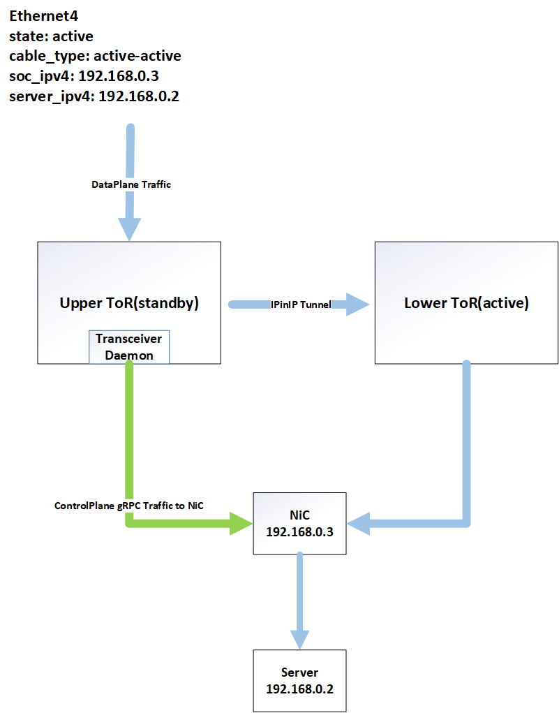

# Active-Active Dual ToR

Active-active dual ToR link manager is an evolution of active-standby dual ToR link manager. Both ToRs are expected to handle traffic in normal scenarios. For consistency, we will keep using the term "standby" to refer inactive links or ToRs. 

## Revision

|  Rev  |   Date   |    Author     | Change Description             |
| :---: | :------: | :-----------: | ------------------------------ |
|  0.1  | 05/23/22 |  Jing Zhang   | Initial version                |
|  0.2  | 12/02/22 | Longxiang Lyu | Add Traffic Forwarding section |
|  0.3  | 12/08/22 | Longxiang Lyu | Add BGP update delay section   |

## Scope 
This document provides the high level design of SONiC dual toR solution, supporting active-active setup. 

## Content
[1 Cluster Topology](#active_active_hld.md#1-cluster-topology)  

[2 Requrement Overview](#2-requrement-overview)  
  - [2.1 Server Requirements](#21-server-requirements)
  - [2.2 SONiC Requirements](#22-sonic-requirements)  

[3 SONiC ToR Controlled Solution](#3-sonic-tor-controlled-solution)  
  - [3.1 IP Routing](#31-ip-routing)
    - [3.1.1 Normal Scenario](#311-normal-scenario)
    - [3.1.2 Server Uplink Issue](#312-server-uplink-issue)
    - [3.1.3 ToR Failure](#313-tor-failure)
    - [3.1.4 Comparison to Active-Standby ](#314-comparison-to-active-standby)
  - [3.2 DB Schema Changes](#32-db-schema-changes)
    - [3.2.1 Config DB](#321-config-db)
    - [3.2.2 App DB](#322-app-db)
    - [3.2.3 State DB](#323-state-db)
  - [3.3 Linkmgrd](#33-linkmgrd)
    - [3.3.1 Link Prober](#331-link-prober)
    - [3.3.2 Link State](#332-link-state)
    - [3.3.3 Forwarding State](#333-forwarding-state)
    - [3.3.4 Acitve-Active State Machine](#334-acitve-active-state-machine)
    - [3.3.5 Default route to T1](#335-default-route-to-t1)
    - [3.3.6 Incremental Featrues](#336-incremental-featrues)
  - [3.4 Orchagent](#34-orchagent)
    - [3.4.1 IPinIP tunnel](#341-ipinip-tunnel)
    - [3.4.2 Flow Diagram and Orch Components](#342-flow-diagram-and-orch-components)
  - [3.5 Transceiver Daemon](#35-transceiver-daemon)
    - [3.5.1 Cable Control through gRPC](#351-cable-control-through-grpc)
  - [3.6 State Transition Flow](#36-state-transition-flow)
  - [3.7 Traffic Forwarding](#37-traffic-forwarding)
    - [3.7.1 Special Cases of Traffic Forwarding](#371-special-cases-of-traffic-forwarding)
      - [3.7.1.1 gRPC Traffic to the NiC IP](#3711-grpc-traffic-to-the-nic-ip)
  - [3.8 Further Enhancement](#38-further-enhancement)
    - [3.8.1 Advertise updated routes to T1](#381-advertise-updated-routes-to-t1)
    - [3.8.2 Server Servicing & ToR Upgrade](#382-server-servicing--tor-upgrade)
    - [3.8.3 BGP update delay](#383-bgp-update-delay)
  - [3.9 Command Line](#39-command-line)

[4 Warm Reboot Support](#4-warm-reboot-support)

## 1 Cluster Topology 
There are a certain number of racks in a row, each rack will have 2 ToRs, and each row will have 8 Tier One (T1s) network devices. Each server will have a NIC connected to 2 ToRs with 100 Gbps DAC cables. 

In this design:
* Both upper ToR (labeled as UT0) and lower ToR (labeled as LT0) will advertise same IP to upstream T1s, each T1 will see 2 available next hops for the VLAN. 
* Both UT0 and LT0 are expected to carry traffic in normal scenarios. 
* The software stack on server host will see 200 Gbps NIC. 


## 2 Requrement Overview
### 2.1 Server Requirements
In our cluster setup, as smart y-cable is replaced, some complexity shall be transferred to server NIC. 

Note that, this complexity can be handled by active-active smart cables, or any other deployments, as long as long it meets the requirements below. 

1. Server NIC is responsible to deliver southbound (tier 0 device to server) traffic from either uplinks to applications running on server host.
   * ToRs are presenting same IP, same MAC to server on both links.
1. Server NIC is responsible to dispense northbound (server to tier 0) traffic between two active links: at IO stream (5 tuples) level. Each stream will be dispatched to one of the 2 uplinks until link state changes. 
1. Server should provide support for ToR to control traffic forwarding, and follow this control when dispensing traffic. 
    * gRPC is introduced for this requirement. 
    * Each ToR will have a well-known IP. Server NIC should dispatch gRPC replies towards these IPs to the corresponding uplinks.
1. Server NIC should avoid sending traffic through unhealthy links when detecting a link state down. 
1. Server should replicate these northbound traffic to both ToRs:
    * Specified ICMP replies (for probing link health status)
    * ARP propagation
    * IPv6 router solicitation, neighbor solicitation and neighbor advertisements
    
    Check pseudo code below for details of IO scheduling contract. 
    ```
    // gRPC Response
    if (ethertype == IPv4 && DestIP == Loopback3_Port0_IPv4) or (ethertype == IPv6 && DestIP == Loopback3_Port0_IPv6) 
    { 
      if (Port 0.LinkState == Up)
        Send to Port 0
      else
        Drop
    }
    else if (ethertype == IPv4 && DestIP == Loopback3_Port1_IPv4) or (ethertype == IPv6 && DestIP == Loopback3_Port1_IPv6)  
    { 
      if (Port 1.LinkState == Up)
        Send to Port 1
      else
        Drop
    } 
    
    // ARP
    else if (ethertype == ARP)
      Duplicate to both ports
    
    // ICMP Heartbeat Probing 
    else if ((ethertype == IPv4 && DestIP == Loopback2_IPv4 && IPv4.Protocol == ICMP) or (ethertype == IPv6 && DestIP == Loopback2_IPv6 && IPv6.Protocol == ICMPv6))
      Duplicate to all active ports
    
    // IPv6 router solicitation, neighbor solicitation and neighbor advertisements
    else if (ethertype == IPv6 && IPv6.Protocol == ICMPv6 && ICMPv6.Type in [133, 135, 136])
      Duplicate to both ports
    else if (gRPC status == "Port 0 disabled" || Port0.LinkState == Down)
      Send to Port 1
    else if (gRPC status == "Port 1 disabled" || Port1.LinkState == Down)
      Send to Port 0
    
    // Other Traffic
    else
      Send packet on either port
    ```

### 2.2 SONiC Requirements
1. Introduce active-active mode into MUX state machine. 
1. Probe to determine if link is healthy or not. 
1. Signal NIC if ToR is switching active or standby.
1. Rescue when peer ToR failure occures.
1. Unblock traffic when cable control channel is unreachable.  

## 3 SONiC ToR Controlled Solution 

### 3.1 IP Routing
#### 3.1.1 Normal Scenario  
Both T0s are up and functioning and both the server NIC connections are up and functioning.
* Control Plane  
  UT0 and LT0 will advertise same VLAN  (IPv4 and IPv6) to upstream T1s. Each T1 will see there are 2 available next hops for the VLAN. T1s advertise to T2 as normal.

* Data Plane  
  * Traffic to the server  
    * Traffic lands on any of the T1 by ECMP from T2s.
    * T1 forwards traffic to either of the T0s by ECMP. 
    * T0 sends the traffic to the server and NIC delivers traffic up the stack.
  * Traffic from the server to outside the cluster  
    * NIC determines which link to use and sends all the packets on a flow using the same link.
    * T0 sends the traffic to the T1 by ECMP. 
  * Traffic from the server to within the cluster  
    * NIC determines which link to use and sends all the packet on a flow using the same link.
    * T0 sends the traffic to destination server if T0 has learnt the MAC address of the destination server.

#### 3.1.2 Server Uplink Issue  
Both T0s are up and functioning and some servers NIC are only connected to 1 ToR (due to cable issue, or the cable is taken out for maintenance).  
* Control Plane  
No change from the normal case. 
* Data Plane  
  * Traffic to the server  
    * Traffic lands on any of the T1 by ECMP from T2s.
    * T1 forwards traffic to either of the T0s by ECMP.
    * **If T0 does not have the downlink to the server, T0 will send the traffic to the peer T0 over IPinIP encap via T1s.**  
    * T0 sends the traffic to the server and NIC delivers traffic up the stack. 
  * Traffic from the server to outside the cluster   
    * T0 will signal to NIC which side to use.  
    * NIC determines which link to use and sends all the packets on a flow using the same link. If server NIC has only 1 connection up, all traffic will be on this connection. 
    * T0 sends the traffic to the T1 by ECMP
  * Traffic from the server to within the cluster  
    * T0 will signal to NIC which side to use. 
    * NIC determines which link to use and sends all the packets on a flow using the same link. If Server NIC has only 1 connection up, all traffic will be on this connection
    * If T0 does not have the downlink to the server, T0 will send the traffic to the peer T0 over IPinIP encap via T1s. 
    * T0 sends the traffic to the server.

#### 3.1.3 ToR Failure  
Only 1 T0s is up and functioning.
* Control Plane  
Only 1 T0 will advertise the VLAN (IPv4 and v6) to upstream T1s. 
* Data Plane  
  * Traffic to the server  
    * Traffic lands on any of the T1 by ECMP from T2s.
    * T1 forwards traffic to either of the T0s by ECMP. If one T0 is down, T1 forwards traffic to the healthy one. 
    * T0 sends the traffic to the server. 
  * Traffic from the server to outside the cluster   
    * T0 will signal to NIC which side to use.  
    * T0 sends the traffic to the T1 by ECMP.
  * Traffic from the server to within the cluster  
    * T0 will signal to NIC which side to use.
    * T0 sends the traffic to the server. 

#### 3.1.4 Comparison to Active-Standby  
Highlight on the common and differences with Active-Standby:   

<table style="text-align: left;">
  <thead>
    <tr>
      <th></th>
      <th>Active- Standby</th>
      <th>Active-Active</th>
      <th>Implication</th>
    </tr>
  </thead>
  <tbody>
    <tr>
      <td>Server uplink view</td>
      <td colspan=2>Single IP, single MAC</td>
      <td></td>
    </tr>
    <tr>
      <td>Standby side receive traffic</td>
      <td colspan=2>Forward it to active ToR through IPinIP tunnel via T1</td>
      <td></td>
    </tr>
    <tr>
      <td>T0 to T1 control plane</td>
      <td colspan=2>Advertise same set of routes </td>
      <td></td>
    </tr>
    <tr>
      <td>T1 to T0 Traffic</td>
      <td colspan=2>ECMP</td>
      <td></td>
    </tr>
    <tr>
      <td>Southbound traffic</td>
      <td colspan=2>From either side</td>
      <td></td>
    </tr>
    <tr>
      <td>Northbound traffic</td>
      <td>All is duplicated to both ToRs.</td>
      <td>NiC determines which side to forward the traffic.</td>
      <td>Orchagent doesn’t need to drop packets on standby side. </td>
    </tr>
    <tr> 
      <td>Bandwidth</td>
      <td>Up to 1 link</td>
      <td>Up to 2 links</td>
      <td>T1 and above devices see more throughput from server. </td>
    </tr>
    <tr>  
      <td>Cable Control</td>
      <td>I2C</td>
      <td>gRPC over DAC cables</td>
      <td>Control plane and data plane now share the same link. </td>
    </tr>
  </tbody>
</table>

### 3.2 DB Schema Changes
#### 3.2.1 Config DB 
* New field in `MUX_CABLE` table to determine cable type
```
MUX_CABLE|PORTNAME:
  cable_type: active-standby|active-active
```
#### 3.2.2 App DB 
* New table to invoke transceiver daemon to query server side forwarding state
```
FORWARDING_STATE_COMMAND | PORTNAME:
  command: probe | set_active_self | set_standby_self | set_standby_peer 
FORWARDING_STATE_RESPONSE | PORTNAME:
  response: active | standby | unknown | error 
  response_peer: active | standby | unknown | error 
```
* New table for transceiver daemon to write peer link state to linkmgrd
```
PORT_TABLE_PEER|PORTNAME
  oper_status: up|down
```
* New table to invoke transceiver daemon to set peer's server side forwarding state
```
HW_FORWARDING_STATE_PEER|PORTNAME
  state: active|standby|unknown 
```
#### 3.2.3 State DB 
* New table for transceiver daemon to write peer's server side forwarding state to linkmgrd
```
HW_MUX_CABLE_TABLE_PEER| PORTNAME
 state: active |standby|unknown
```

### 3.3 Linkmgrd  
Linkmgrd will provide the determination of a ToR / link's readiness for use. 

#### 3.3.1 Link Prober   
  Linkmgrd will keep the link prober design from active-standby mode for monitoring link health status. Link prober will send ICMP packets and listen to ICMP response packets. ICMP packets will contain payload information about the ToR. ICMP replies will be duplicated to both ToRs from the server, hence a ToR can monitor the health status of its peer ToR as well.  

  Link Prober will report 4 possible states:  
  * LinkProberUnknown: Serves as initial states. This state is also reachable in the case of no ICMP reply is received. 
  * LinkProberActive: It indicates that LinkMgr receives ICMP replies containing ID of the current ToR.
  * LinkProberPeerUnknown: It indicates that LinkMgr did not receive ICMP replies containing ID of the peer ToR. Hence, there is a chance that peer ToR’s link is currently down. 
  * LinkProberPeerAcitve: It indicates that LinkMgr receives ICMP replies containing ID of the peer ToR, or in other words, peer ToR’s links appear to be active.  

  By default, the heartbeat probing interval is 100 ms. It takes 3 lost of link prober packets, to determine link is unhealthy. Server issue can also cause link prober packet loss, but ToR won't distinguish it from link issue. 

  __ICMP Probing Format__  
  The source MAC will be ToR's SVI mac address. Ethernet destination will be the well-known MAC address. Source IP will be ToR's Loopback IP, destination IP will be SoC's IP address, which will be introduced as a field in minigraph.   
    

  Linkmgrd also adapt TLV (Type-Length-Value) as the encoding schema in payload for additional information elements, including cookie, version, ToR GUID etc.  
     

#### 3.3.2 Link State  
  When link is down, linkmgrd will receive notification from SWSS based on kernel message from netlink. This notification will be used to determine if ToR is healthy. 

#### 3.3.3 Forwarding State   

**Admin Forwarding State**  
  ToRs will signal NIC if the link is active / standby, we will call this active / standby state as **admin forwarding state**. It's up to NIC to determine which link to use if both are active, but it should never choose to use a standby link. This logic provides ToR more control over traffic forwarding.  

**Operational Forwarding State**  
  Server side should maintain an operational forwarding state as well. When link is down, eventually admin forwarding state will be updated to standby. But before that, if server side detects link down, it should stop sending traffic through this link even the admin state is active. In this way, we ensure the ToRs have control over traffic forwarding, and also guarantee immediate reaction when link state is down.  
  
#### 3.3.4 Acitve-Active State Machine  
  Active-acitve state transition logics are simplified compared to active-standby. In active-standby, linkmgrd makes mux toggle decisions based on y-cable direction, while for active-active, two links are more independent. Linkmgrd will only make state transition decisions based on healthy indicators. 

  To be more specific, if link prober indicates active AND link state appears to be up, linkmgrd should determine link's forwarding state as active, otherwise, it should be standby.

   

  Linkmgrd also provides rescue mechanism when peer can't switch to standby for some reason, i.e. link failures. If link prober doesn't receive peer's heartbeat response AND self ToR is in healthy active state, linkmgrd should determine peer link to be standby. 
    

  When control channel is unreachable, ToR won't block the traffic forwarding, but it will periodically check gRPC server's healthiness. It will make sure server side's admin forwarding state aligns with linkmgrd's decision.
   

#### 3.3.5 Default route to T1  
  If default route to T1 is missing, dual ToR system can suffer from northbound packet loss, hence linkmgrd also monitors defaul route state. If default route is missing, linkmgrd will stop sending ICMP probing request and fake an unhealthy status. This functionality can be disabled as well, the details is included in [default_route](https://github.com/sonic-net/sonic-linkmgrd/blob/master/doc/default_route.md).

  To summarize the state transition decision we talk about, and the corresponding gRPC action to take, we have this decision table below: 

<table>
  <thead>
    <tr>
      <th colspan=4>Input</th>
      <th colspan=3>Decision</th>
    </tr>
    <tr>
      <th rowspan=2>Default Route to T1</th>
      <th rowspan=2>Link State</th>
      <th colspan=2>Link Prober</th>
      <th rowspan=2>Link Manager State</th>
      <th colspan=2>gRPC Action to Update Server-Side Admin Forwarding State</th>
    </tr>
    <tr>
      <th>SELF</th>
      <th>PEER</th>
      <th>SELF</th>
      <th>PEER</th>
    </tr>
  </thead>
  <tbody>
    <tr>
      <th>Available</th>
      <th rowspan=2>Up</th>
      <th>Active</th>
      <th>Active</th>
      <th rowspan=2>Active</th>
      <th rowspan=2>Set to Active</th>
      <th>No-op</th>
    </tr>
    <tr>
      <th>Available</th>
      <th>Active</th>
      <th>Unknown</th>
      <th>Set to standby</th>
    </tr>
    <tr>
      <th>Available</th>
      <th>Up</th>
      <th>Unknown</th>
      <th>*</th>
      <th>Standby</th>
      <th>Set to standby</th>
      <th>No-op</th>
    </tr>
    <tr>
      <th>Available</th>
      <th>Down</th>
      <th>*</th>
      <th>*</th>
      <th>Standby</th>
      <th>Set to standby</th>
      <th>No-op</th>
    </tr>
    <tr>
      <th>Missing</th>
      <th>*</th>
      <th>*</th>
      <th>*</th>
      <th>Standby</th>
      <th>Set to standby</th>
      <th>No-op</th>
    </tr>
  </tbody>
</table>

#### 3.3.6 Incremental Featrues   

* Link Prober Packet Loss Statics  
  Link prober will by default send heartbeat packet every 100 ms, the packet loss statics can be a good measurement of system healthiness. An incremental feature is to collect the packet loss counts, start time and end time. The collected data is stored and updated in state db. User can check and reset through CLI. 
 
* Supoort for Detachment  
  User can config linkmgrd to a certain mode, so it won't switch to active / standby based on health indicators. User can also config linkmgrd to a mode, so it won't modify peer's forwarding state. This support will be useful for maintenance, upgrade and testing scenarios. 

### 3.4 Orchagent 
#### 3.4.1 IPinIP tunnel
Orchagent will create tunnel at initialization and add / remove routes to forward traffic to peer ToR via this tunnel when linkmgrd switchs state to standby / active. 

Check below for an example of config DB entry and tunnel utilization when LT0's link is having issue. 
   

#### 3.4.2 Flow Diagram and Orch Components
Major components of Orchagent for this IPinIP tunnel are MuxCfgOrch, TunnelOrch, MuxOrch. 
  

1. MuxCfgOrch  
MuxCfgOrch listens to config DB entries to populate the port to server IP mapping to MuxOrch. 

1. TunnelOrch  
TunnelOrch will subscribe to `MUX_TUNNEL` table and create tunnel, tunnel termination, and decap entry. This tunnel object would be created when initializing. This tunnel object would be used as nexthop object by MuxOrch for programming route via SAI_NEXT_HOP_TYPE_TUNNEL_ENCAP. 

1. MuxOrch   
MuxOrch will listen to state changes from linkmgrd and does the following at a high-level:
    * Enable / disable neighbor entry.   
    * Add / remove tunnel routes.

### 3.5 Transceiver Daemon
#### 3.5.1 Cable Control through gRPC  
  In active-active design, we will use gRPC to do cable control and signal NIC if ToRs is up active. SoC will run a gRPC server. Linkmgrd will determine server side forwarding state based on link prober status and link state. Then linkmgrd can invoke transceiver daemon to update NIC wether ToRs are active or not through gRPC calls. 
  
  Current defined gRPC services between SoC and ToRs related with linkmgrd cable controlling:  
  * DualToRActive
      1. Query forwarding state of ports for both peer and self ToR;
      1. Query server side link state of ports for both peer and self ToR;
      1. Set forwarding states of ports for both peer and self ToR; 
  * GracefulRestart
      1. Shutdown / restart notification from SoC to ToR.

### 3.6 State Transition Flow
The following UML sequence illustrates the state transition when linkmgrd state moves to active. The flow will be similar for moving to standby.


### 3.7 Traffic Forwarding
The following shows the traffic forwarding behaviors:
  * both ToRs are active.
  * one ToR is active while the another ToR is standby.


#### 3.7.1 Special Cases of Traffic Forwarding

##### 3.7.1.1 gRPC Traffic to the NiC IP
There is a scenario that, if the upper ToR enters standby when its peer(the lower ToR) is already in standby state, all downstream I/O from ToR A will be forwarded through the tunnel to the peer ToR(the lower ToR), so does the control plane gRPC traffic from the transceiver daemon. As the lower ToR is in standby, those tunneled I/O will be blackholed, the NiC will never know that the upper ToR has entered standby in this case.

To solve this issue, we want the control plane gRPC traffic from the transceiver daemon to be forwarded directly via the local devices. This is to differentiate the control plane traffic to the NiC IPs from dataplane traffic that its forwarding behavior honors the mux state and be forwarded to the peer active ToR via the tunnel when the port comes to standby.

The following shows the traffic forwarding behavior when the lower ToR is active while the upper ToR is standby. Now, gRPC traffic from the standby ToR(Upper ToR) is forwarded to the NiC directly. The downstream dataplane traffic to the Upper ToR are directed to the tunnel to the active Lower ToR.


<br/><br/>
When orchagent is notified to change to standby, it will re-program both the ASIC and the kernel to let both control plane and data plane traffic be forwarded via the tunnel. To achieve the design proposed above, MuxOrch now will be changed to skip notifying the Tunnelmgrd if the neighbor address is the NiC IP address, so Tunnelmgrd will not re-program the kernel route in this case and the gRPC traffic to the NiC IP address from the transceiver daemon will be forwarded directly.

The following UML diagram shows this change when Linkmgrd state moves to standby:


### 3.8 Enhancements

#### 3.8.1 Advertise updated routes to T1
Current failover strategy can smoothly handle the link failure cases, but if one of the ToRs crashes, and if T1 still sends traffic to the crashed ToR, we will see packet loss. 

A further improvement in rescuing scenario, is when detecting peer's unhealthy status, local ToR advertises specific routes (i.e. longer prefix), so that traffic from T1 does't go to crashed ToR as all. 

#### 3.8.2 Server Servicing & ToR Upgrade
For server graceful restart, We already have gRPC service defined in [3.5.1](#351-cable-control-through-grpc). An indicator of ongoing server servicing should be defined based on that notification, so ToR can avoid upgrades in the meantime. Vice versa, we can also define gRPC APIs to notify server when ToR upgrade is ongoing.

#### 3.8.3 BGP update delay
When the BGP neighbors are started on an active-active T0 switch, the T0 will try to establish BGP sessions with its connected T1 switches. After the BGP sessions' establishment, the T0 will exchange routes with those T1s. T1 switches usually have more routes than the T0 so T1 switches take more time to process out routes before sending updates. The consequence is that, after BGP sessions’ establishment, T1 switches could receive BGP updates from the T0 before the T0 receives any BGP updates from the T1s. There will be a period that those T1s have routes learnt from the T0 but the T0 has no routes learnt from the T1(T0 has no default routes). In this period, Those T1s could send downstream traffic to this T0, as stated in [3.3.5](#335-default-route-to-t1), the T0 is still in standby state, it will try to forward the traffic via the tunnel. As the T0 has no default route in this period, those traffic will be blackholed.

So for the active-active T0s, a BGP update delay of 10 seconds is introduced to the BGP configurations to postpone sending BGP update after BGP session establishment. In this case, the T0 could learn routes from the T1s before the T1s learn any routes from the T0. So when the T1 could send any downstream traffic to the T0, the T0 will have default routes ready.

### 3.9 Command Line
TBD 

## 4 Warm Reboot Support
TBD

